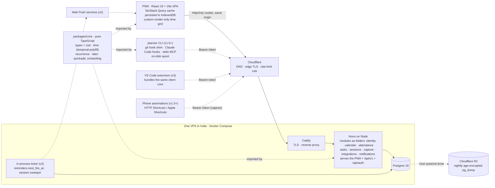
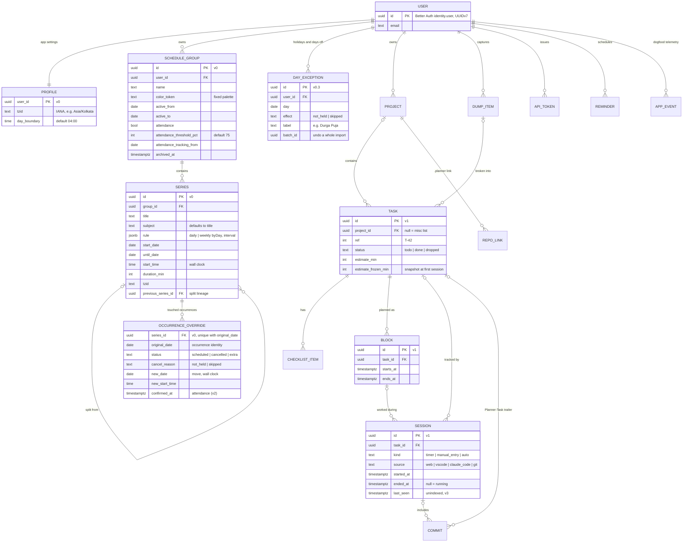

# 00 · Overview: the recommended system, the decision queue and the v0 plan

> Synthesis of `docs/brainstorm/01`–`13`, `10-wildcard` and `99-critique`, written 2026-10-06.
> Nothing in this file is decided. It is the shortest path from fifteen long documents to the choices you have to make, with a default for each.
> `JOURNEY.md` was not edited. Section 4 has every proposed entry, numbered from D-011, ready for you to sort into it.

## Start here

1. Read **§1** (one page) to see the whole system.
2. Answer **§2.A**: eleven questions, about an hour. Nothing else blocks the first commit.
3. Follow **§5**, the v0 checklist. Its first task is writing `packages/core/src/types.ts`, because the slices disagree on names (§3).
4. Sort **§4** into JOURNEY.md when you have time. Each entry says where it came from and whether the critique changed it.

**The one-sentence verdict.** Each slice is good on its own, but together they plan roughly 150–200 hours of v0 against about 50 hours available before end-sems (`99 §1`). So the recommended system is deliberately the *smallest* version that keeps every later door open: one TypeScript monorepo, one Hono process, one Postgres, one VPS, a server-first PWA, and the recurrence engine as the one piece built properly from day one.

### The files

| File | Recommendation in one line |
|---|---|
| `01-recurrence` | Store rules plus sparse overrides keyed by `(series_id, original local date)`; hand-written ~60-line expander tested against `rrule-temporal`; holidays as a day layer; attendance derived |
| `02-data-model` | Normalised Postgres, client UUIDv7, `user_id` everywhere, three time rules, distinct status/archive/trash verbs (its RLS, roles and triggers are too early, see §3) |
| `03-backend-system-design` | TypeScript modular monolith on Hono, REST under `/v1`, natural idempotency, due-time sweeps instead of a queue |
| `04-database-and-sync` | Plain host-agnostic Postgres (keep). Full client replica with hand-rolled HLC sync (defer, see §3) |
| `05-sessions-and-realtime` | Timer is a row; one running timer; one sessions table with assertions vs evidence; interval-merge heartbeats; polling before SSE |
| `06-auth-and-identity` | Better Auth with Google + allowlist; own scoped `pln_`-style machine tokens and device flow; OIDC at `accounts.ahmedatif.in` later |
| `07-infra-and-deployment` | One India-region VPS with Compose, Cloudflare in front, nightly encrypted dumps to R2 with restore drills |
| `08-integrations` | One client core plus a CLI; Git config-based global hook writing to a spool; `.planner` TOML; Claude Code hooks before VS Code |
| `09-frontend` | React 19 + Vite SPA, TanStack Router/Query, custom render-only time grid, cancelled blocks as a background layer |
| `10-scheduling-algorithms` | Pure shared package: interval subtraction for gaps, log-ratio estimator, transparent weighted ranking, LLM off by default |
| `10-wildcard` | "The Ledger", a local-first event-sourced design. Don't build it; steal its disciplines |
| `11-capture` | One capture bar; parse tasks, keep the dump raw; keyboard dictation is the voice MVP; Capture API + phone automations instead of native |
| `12-ux-flows` | Three tabs, Today is home, tap-a-gap on mobile, one ritual (evening shutdown), undo instead of confirms, no guilt |
| `13-build-plan` | Vertical slices on a walking skeleton; recurrence engine test-first; exam weeks maintenance-only; git hook at v1.5 |
| `99-critique` | Cut v0 to the roadmap; settle one shared types file; server-first sync; adopt 05's session model; confirm the semester date |

> The slice numbering has two `10-` files (`10-scheduling-algorithms`, `10-wildcard`), as requested. They don't collide.

---

## 1. The recommended system on one page

**Shape.** TypeScript end to end in one pnpm monorepo: `apps/web` (the PWA), `apps/api` (one Hono process) and `packages/core` (pure, no I/O: shared types and zod schemas, Temporal helpers, the recurrence engine; later the quick-add parser and scheduling). The API serves the PWA and a REST API on **one origin** (`/api/v1`, `/api/auth`). Postgres runs on the **same small India-region VPS** under Docker Compose, behind Caddy and Cloudflare, with a nightly `age`-encrypted dump to R2.

**Calendar model.** A group (D-004) owns series. A series stores a small JSON rule (daily or weekly by weekday, every N), a wall-clock start time, a duration and an IANA zone. Occurrences are **computed on read**, never stored. A row is written only when you say something about one occurrence: cancel (`not_held` / `skipped`), move, edit, or confirm attendance. That row is keyed by `(series_id, original local date)`, so it survives "move all DBMS classes to 10:30". Holidays are a separate day-level layer. Attendance is a pure function of those facts and the clock, which gives D-010's range for free.

**Client.** A React SPA. The server expands occurrences for the requested window. TanStack Query is the **only** client cache, persisted to IndexedDB, so the last-seen weeks open offline. A short list of offline-safe writes (in v0, only cancel/skip) queue as paused mutations and replay on reconnect. No sync engine, no replica, no CRDT.

**Later pieces, in order.** Tasks, blocks and the timer (v1) use 05's single sessions table, with one running timer and switch-with-undo. Scoped personal access tokens and a `planner` CLI with a Git config-based hook arrive at v1.5. An in-process ticker over due-time columns sends the evening-shutdown push at v2. Claude Code hooks come before the VS Code extension at v3. LLMs stay off by default.

### Architecture



Solid lines exist in v0. Dashed lines arrive with the milestone in brackets.

### Data model (v0 tables first)



### Stack at a glance

| Concern | v0 choice | Arrives later |
|---|---|---|
| Runtime | Node 24 LTS in the image and CI (your local Node 26 is fine); `temporal-polyfill` imported explicitly everywhere; TypeScript 6.0.x + Biome; no `Date` in `packages/core` | Native Temporal when every target ships it |
| Server | Hono, one process, modules as folders, zod validation, one JSON error shape | OpenAPI document at v1.5; contract diff at v3 |
| Data | Postgres 18 on the box, Drizzle 0.45 + reviewed SQL migrations, `user_id` on every row | RLS and composite FKs before a second real user |
| Sync | Server-first; persisted TanStack Query; paused mutations for cancel/skip | Capture and confirm join the queue in v1/v2; 04's replica only if dogfooding proves the need |
| Auth | Better Auth, Google sign-in, allowlist of one, DB session in an HttpOnly cookie | Scoped tokens + device flow at v1.5 |
| Hosting | One India VPS (Oracle Always Free if it works within one evening, else a ~$10–12/month 2 GB VPS), Caddy + api + Postgres, Cloudflare DNS, one origin | Worker container at v2; staging and PITR before other users |
| Frontend | React 19 + Vite, TanStack Router/Query, Tailwind v4 + shadcn/ui, `vite-plugin-pwa`, custom render-only grid | Desktop drag via a library in v1; touch drag only if missed |
| Jobs | None (backups are a host timer, not an app job) | v2: croner tick over `reminders.next_fire_at` with `SKIP LOCKED` |
| Integrations, LLM | None | v1.5 git hook → v3 Claude Code hooks → VS Code → MCP; LLM v3+ behind 10's interface |

Two facts were checked on this machine today:
- **Git 2.55.0 config-based hooks work.** A `hook.<name>.event=post-commit` hook fired, which confirms 08's install method.
- **Arch's Node 26.9.0 has no global `Temporal`,** even with `--harmony-temporal`. 03's claim that Temporal is built in is wrong here. 01's rule ("always import the polyfill") is right.

---

## 2. Decision queue

Every open decision from every file, with duplicates merged. Groups are ordered by what blocks v0 first. Within a group, earlier rows block more. The defaults already reflect the critique; where a slice's own default differs, the row says so. "Read" points at the section that argues it best.

### 2.A Before the first commit (blocks v0.0)

| # | Decision | Options | Suggested default | Read |
|---|---|---|---|---|
| A1 | Which phone do you use daily? | Android (Chrome) / iPhone | **Android** assumed by 09, 11, 12, 13. iPhone means push only after Add to Home Screen, no share target, no icon shortcuts, and native moves earlier. Your desktop browser is Brave, which ships with push off (turn on "Use Google services for push messaging") | 09 §8, 12 §5.13, 05 §5.14 |
| A2 | Real KIIT dates and your hours | Semester 3 end-sems, semester 4 start, Puja plans; 6 / 10 / 15 h per week in term | **10 h/week in term, ~2 in exam weeks; semester 4 ≈ 30 Nov until confirmed.** 12 assumed "early 2027". If 13 is right, the D-004 swap is due in about 8 weeks | 13 §2, §5.1; 99 §5 risk 3 |
| A3 | Subdomain (origin) and app name | `plan.ahmedatif.in` / `tasks.ahmedatif.in` / a named subdomain; separate `api.` host or not | **A neutral subdomain such as `plan.ahmedatif.in`, chosen now. One origin, `/api/v1` and `/api/auth`, no `api.` host.** The origin is effectively permanent for an installed PWA (cookies, push subscriptions, IndexedDB), but the product name can wait. The token prefix and CLI name follow the name later | 99 §4.2, 06 §5.3, 07 §5.10, 03 Q2 |
| A4 | Public repo, and which licence? | Public / private; MIT / AGPL / none | **Public, MIT.** Nobody picked a licence, and without one the code is "all rights reserved". Add gitleaks to CI | 07 Q2, 13 Q4, 99 §4.2 |
| A5 | Where does the box live? | Oracle Always Free A1 (Hyderabad/Mumbai) / 2 GB India VPS (~$10–12/month) / Hetzner EU (cheap, 140–170 ms away) / free managed tiers (13's assumption) | **Oracle if you get capacity within one evening, otherwise pay for the India VPS.** 13's ₹0 managed-tier assumption doesn't survive: an always-on process exhausts Neon's free compute | 07 §4, §9 Q1; 04 §4.6; 99 §2.5 |
| A6 | v0 sign-in | Google + allowlist (Better Auth) / GitHub OAuth (13's default) / passkey / no auth, local-only | **Google + allowlist of one.** No email infrastructure, and it survives a phone restart. Never magic links (they break inside installed PWAs) | 06 §5.4, §9 Q1; 13 §5.1 |
| A7 | Runtime and compiler | Node 24 / 26; TypeScript 6.0.x / 7.0.x | **Node 24 LTS in Docker and CI, TypeScript 6.0.x + Biome.** Import `temporal-polyfill` explicitly regardless (Node 26.9.0 here has no Temporal). 03 preferred Node 26; 09 preferred TypeScript 7 | 01 §5.9, 03 Q1, 99 §2.5 |
| A8 | Query layer | Drizzle 0.45 + `pg` / Kysely / raw SQL; Drizzle 1.0 RC | **Drizzle 0.45 stable + `pg`**, migrations generated and reviewed as SQL, no RC | 02 Q12, 03 Q9, 04 Q10 |
| A9 | Fallback if the skeleton slips | Keep going / switch to a local-only PWA on the same `packages/core` | **Accept 13's rule:** if the deployed skeleton isn't live by Sun 18 Oct, ship v0 local-only and add the server after exams | 13 §4, 10-wildcard §16 #13 |
| A10 | RLS from the first migration? | Yes, forced, with three roles (02) / later (03, critique) | **Later.** Scope every query by `user_id` and add one cross-user test now; RLS and composite FKs before a second real person signs in | 02 Q5, 03 trap 14, 99 §3.3 |
| A11 | Repo conventions | Merge style; CI database; coverage gate | **`--no-ff` merges; Actions `services:` Postgres + Compose locally; 90% branch coverage on `core/recurrence` only** | 13 Q9–Q11 |

### 2.B Calendar model (blocks v0.1–v0.2)

| # | Decision | Options | Suggested default | Read |
|---|---|---|---|---|
| B1 | Occurrence identity | `(series_id, original local date)` (01, 02, 04) / `(series_id, original start date-time)` (03, 09, 13, wildcard) | **The date key.** It survives "change the time of all", it can be computed before any row exists, and its upserts are idempotent | 01 §5.4, 99 §2.1 |
| B2 | Rule storage | 01's JSON subset / RRULE text (02) / a library such as `rrule` | **01's JSON** `{freq: daily|weekly, interval, byDay}`, with `COUNT` converted to an end date on save, plus a `toRRULE()` for a later ICS export | 01 §5.2 |
| B3 | Monthly rules in v0? | No / `BYMONTHDAY` / nth weekday | **No** | 01 Q6 |
| B4 | Time-zone mode | Per-series `tzid`, anchored (02) / per-group anchored or floating with a tz history (01) | **Per-series `tzid`, anchored, in v0.** Add floating mode for habits only if you ever travel | 01 Q1, 02 Q13, 99 §2.1 |
| B5 | DST gap behaviour | Shift forward (Temporal `compatible`) / drop the occurrence (RFC 5545) | **Shift forward and flag it** | 01 Q7 |
| B6 | Where expansion runs | Server only / client only / shared package with the server canonical | **Server in v0 (09); the package stays pure and shared,** so client-side expansion later is not a rewrite | 01 Q10, 09 §2, 99 §2.2 |
| B7 | Range caps | 62 days (03, 13) / 400 days (01) | **62 days on the public range endpoint**; internal callers (attendance, conflicts) pass bounded group ranges | 99 §2.1 |
| B8 | Attendance subject key | Normalised title (02) / `subject` field defaulted from the title (12) / a `recurring_item` table (01) | **A `subject` column defaulted from the title** | 02 Q6, 12 Q7, 99 §2.1 |
| B9 | Cancel vocabulary | Seven spellings across slices | **DB and API store meaning: `not_held`, `skipped`, plus a system-only `holiday` origin. UI labels stay "Prof cancelled / I skipped"** (D-005) | 99 §2.1, 02 §8, 12 §8 |
| B10 | Calendar UI: custom or library | Custom render-only grid / FullCalendar v7 from day one | **Custom render-only grid for v0** behind a `TimeGridProps` adapter, with FullCalendar v7 as the fallback | 09 Q2 |
| B11 | Small UI constants | Week start; visible hours; time format; colours; day boundary; moved ghost; mobile default view | **Monday; full 24 h scrolled to `max(now−1h, 07:00)`; 12-hour; fixed 10-colour palette; day starts 04:00; show a ghost for moved classes; Day timeline on mobile** | 09 Q3, Q4, Q8, Q9; 12 Q2, Q16; 02 Q3; 11 Q14 |

### 2.C Before end-sems and semester 4 (v0.3–v0.4)

| # | Decision | Options | Suggested default | Read |
|---|---|---|---|---|
| C1 | Offline writes in v0 | None (13) / cancel/skip queued (critique) / full replica L2–L3 (04) | **Persisted reads + paused mutations for cancel/skip only.** Capture joins in v1, confirm in v2 | 04 Q1, 09 Q10, 99 §2.2 |
| C2 | "Edit all" for timing changes | From today / from semester start / ask, with today preselected | **Ask, with today preselected.** Title, room and time can change in place. A weekday change is "end series, start new" (a split) | 01 Q5, 99 §2.1 |
| C3 | Holiday layer in v0.3, and who observes it | Build now or defer; attendance groups by default / all groups | **Build it if hours allow (Puja week is the first test). Attendance groups observe holidays by default. `effect` is `not_held` or `skipped`** (the latter covers 12's "I'm away") | 13 Q13, 01 Q9, 99 §2.1 |
| C4 | Minimum semester swap | Full wizard with conflict view / copy the group + archive the old one | **Copy + archive first; the conflict list if time allows.** Import plugs in later (D-008) | 12 §5.9, 13 §5.3, 99 §5 |
| C5 | "Saturday follows Monday's timetable" day swaps | v0 / after the dogfood / never | **After the dogfood**, when you hit a real one | 01 Q2 |
| C6 | Dogfood window | Right after v0.3 (exam weeks) / first two weeks of semester 4 | **Soft dogfood from v0.2; formal two weeks at the start of semester 4,** with 13's exit criteria | 13 Q5 |
| C7 | Backups and ops in v0 | Dumps only / plus PITR; staging; secrets; alerts; deploy tool | **Nightly `pg_dump` → `age` → R2, one restore drill written up; `.env` on the box backed up in a password manager; Compose + `deploy.sh`; Caddy + Let's Encrypt; a free uptime check.** Staging, SOPS, PITR, ntfy and a prod gate wait for v2 or a second user | 07 Q5–Q13, 04 Q9, 99 §3.4 |
| C8 | Trash retention | 30 / 7 days / forever | **30-day trash.** There are no sync tombstones until a delta feed exists | 02 Q10, 04 Q6 |
| C9 | Dogfood telemetry | None / a first-party `app_events` table | **One `app_events(user_id, at, name, props)` table**, written server-side. It feeds 13's exit criteria, 12's and 11's switch conditions and 10's logs | 99 §4.2 |

### 2.D v1: tasks, blocks, timer, dump

| # | Decision | Options | Suggested default | Read |
|---|---|---|---|---|
| D1 | Task depth | Project → task → checklist (02) / one level of subtasks (13 assumed `parent_id`, 2 levels) / an unlimited tree | **Checklist items** (no timers on them). Moving to real subtasks later is a straightforward migration | 02 Q1 |
| D2 | Short task refs | Per-user `T-42` / per-project prefixes / none | **Per-user `T-42`** (display), parsed case-insensitively | 02 Q2, 08 Q4 |
| D3 | Unique names among active projects | Yes / no | **Yes** | 02 Q7 |
| D4 | Mobile planning | Long-press drag (09) / tap-a-gap and a "Plan…" sheet (12) | **Tap-a-gap and "Plan…" on mobile; desktop drag through a library (dnd-kit) into the custom grid.** Touch drag only if missed after a month | 09 Q5, 12 Q15, 99 §3.5 |
| D5 | Drop details | Over an active class; default duration; snap; into the past; width over a cancelled ghost | **Allow side by side with a subtle ⚠; the estimate if set, else 60 min; 15-minute snap; into the past creates a block and offers "Log it"; about 85% width over a cancelled ghost so the stripes still show** | 09 Q6, Q7, Q11; 12 Q12; 99 §2.6 |
| D6 | Unfinished planned task at day end | Back to its list / stays planned / rolls to tomorrow | **Back to its list, shown once under "From yesterday",** derived on read with no job | 12 Q18 |
| D7 | Starting a timer while one runs | Auto-switch with Undo / confirm dialog / parallel timers | **Auto-switch with Undo** | 05 Q1, 12 Q14 |
| D8 | Session model | No overlap on all sessions (02) / assertions vs evidence (05) / latest start wins (04) | **05's model:** one table with `kind` and `source`; the exclusion constraint only on user assertions; `last_seen` unindexed and outside any change trigger | 99 §2.3 |
| D9 | Forgotten timer | Nudge at 4 h, cap at 12 h (05) / 3 h and midnight (12) / stop at shutdown / never | **05's 4 h nudge and 12 h cap,** with the running timer also shown at shutdown. The nudge is in-app until push exists (v2) | 05 Q6, 12 Q17 |
| D10 | Cross-device freshness | Refetch on focus + 30 s polling while visible / SSE now / WebSockets | **Focus refetch + polling;** SSE hints only if it feels laggy | 05 Q4, 04 Q8 |
| D11 | Dump aging | 7/30-day dot (12) / fading + age label + weekly resurfacing card + compost after 60 d and 2 skips (11) | **Age label and gentle fading in v1; the weekly card and compost suggestion in v2.** Never counts, badges or auto-delete | 11 Q12, Q13; 12 Q11 |
| D12 | Voice | Keyboard dictation / Web Speech / record + server STT; audio retention | **Keyboard dictation in v1. Audio never stored on the server**; any recording stays on the device for 30 days | 11 Q10, Q11; 02 Q11; 07 Q12 |
| D13 | Demo user for interviewers | Yes, seeded and reset nightly / screenshots only | **Yes in v1.4,** but design how an anonymous visitor gets that session past the allowlist (nobody did) | 13 Q7, 99 §4.2 |
| D14 | Export | None / JSON export / plus a nightly JSONL export to a private git repo | **One JSON format for fixture, import and export; a nightly JSONL export to a private repo in v1** | 99 §4.2, wildcard #14 |
| D15 | API internals | Generic `Idempotency-Key` table now or later; exceptions or `Result` | **Natural idempotency (client UUIDs, PUT by natural key) until `POST /sessions/ensure` exists in v3; typed exceptions + one error mapper** | 03 Q4, Q5; 99 §3.2 |
| D16 | Where build planning lives | GitHub Projects / Issues now, the app from v1.0 | **Issues and milestones now; time planning moves into the app at v1.0** | 13 Q8 |
| D17 | Desktop shortcuts and tray | Single keys / modifiers; tray right / left / bottom | **Single keys outside text fields with a `?` overlay; tray on the right, collapsible with `]`** (v2 is fine) | 12 Q9, Q10 |

### 2.E v1.5: tokens and the git hook

| # | Decision | Options | Suggested default | Read |
|---|---|---|---|---|
| E1 | Move the git hook to v1.5 | Yes / keep it in v3 | **Yes.** It starts collecting commit data months earlier, during internship season | 13 Q6 |
| E2 | Token design and timing | v1.5 (13) / v2 (11, for capture) / v3 (06); own module or Better Auth plugins; expiry | **v1.5, designed per 06: own module, prefixed, SHA-256 hashed, scoped, per device, no fixed expiry but a 90-day inactivity cut-off.** The Capture API rides on the same tokens | 06 Q4, Q5; 11 Q15; 99 §2.4 |
| E3 | CLI name, language, distribution | `planner` / `pln` / `pl`; Node / Go / shell; npm / binary / AUR | **A Node CLI named after the app, installed with `npm i -g`; AUR later as a portfolio touch** | 06 Q6, 08 Q9 |
| E4 | Hook installation | Global config hook (08) / per-repo shim (06) / per-repo `sh` + `curl` (13) | **08's Git config-based global hook** (verified on Git 2.55.0 here). The hook line holds no token, so 06's dotfiles worry is about tokens only | 08 §5.4, 99 §2.4 |
| E5 | `.planner` format | JSON link id (02) / TOML project id (08) | **TOML, committed for your own repos, holding a repo-link id under `link`** (02's indirection in 08's format); `~/.config/…/links.toml` overrides it | 08 Q3, 02 §5.7, 99 §2.3 |
| E6 | Commit → task tokens | Trailer key; branch token; cardinality | **`Planner-Task:` trailer, a `t42` token in the branch, one task per commit** | 08 Q4, Q5; 02 Q9 |
| E7 | What leaves the machine | Full message / subject only / hash only; which repos | **Subject only. Linked repos plus a `~/programming/**` include glob** | 08 Q1, Q2 |

### 2.F v2: attendance, quick add, time back, multiplier, push

| # | Decision | Options | Suggested default | Read |
|---|---|---|---|---|
| F1 | Does "not held" count in the denominator? | Excluded / counted as attended / per group | **Excluded** (classes *held*). Check the exact clause in KIIT's regulations | 01 Q4, 12 §10 |
| F2 | Portal baseline | None / per-subject attended/total at the tracking start / periodic re-sync | **A one-time per-subject baseline**, so the numbers match the portal | 01 Q3 |
| F3 | Unconfirmed backlog | Never auto-confirm / auto after N days | **Never auto-confirm; a pre-ticked bulk grid capped at 14 days; nothing counts before the tracking start date** | 01 Q8, 12 Q6 |
| F4 | "Can miss N more" | Show / hide / only near the line | **Show, computed from the safe (low) end** | 12 Q8 |
| F5 | Shutdown reminder time | 21:00 (12, 07) / 21:30 (05) / 22:00 (13) | **Your call.** Pick the time you actually wind down after classes and the run. 21:30 as a placeholder | 05 Q7, 12 Q4 |
| F6 | When push isn't available | In-app banner / plus `.ics` / plus email | **In-app banner on the next open; `.ics` with an alarm offered; no email provider yet** | 03 Q8, 05 Q7 |
| F7 | Notification scope | "Yes, all" inside the notification; block-start pushes; a push when a block ends | **Allow "Yes, all" (Android); block-start pushes for task blocks only; block-end stays in-app** | 12 Q5, Q13; 05 Q9 |
| F8 | Quick-add behaviour | Time → block?; recurring tasks; sigils; Hinglish; "next friday"; DMY; bare date; default mode | **A time creates a block; no recurring tasks; `@project #category`; `aaj/kal/parso` on; "next friday" = next week's, with an alternative chip; DMY; a bare date = "do on"; dump mode on the Dump screen, task mode elsewhere.** Ship the ~10 patterns you actually type first | 11 Q2–Q9, 12 Q3, 99 §3.8 |
| F9 | Quick-add on the server | Client only / also `POST /quick-add` | **Client only until v3**, then server-side for Claude Code and the CLI | 03 Q6, 11 Q16 |
| F10 | Estimator | 1-D Kalman filter (10) / EMA in log space with clamping (critique) | **EMA in log space in v2; the Kalman filter as a v3 refactor once there's data to justify it** | 10 §5.4, 99 §3.6 |
| F11 | Estimator inputs | Prior; scopes; what counts as "actual"; buckets | **Prior 1.0×; per category, plus per project once n ≥ 3; actual = timer + editor + Claude Code (+ git only with high start confidence); user-defined categories with a per-project default** | 10 Q1–Q3, 02 Q8 |
| F12 | Time back | Toast or on tap; minimum gap; day window; chunking; "Fill it" objective; energy | **An automatic non-modal toast (never a push); 20-minute minimum gap; a fixed 07:30–23:00 window; ≤ 30 min atomic, else chunkable; score × minutes; energy off** | 10 Q4–Q9 |
| F13 | Morning plan draft | Build in v2 (10) / not at all (12, critique) | **Don't build it.** 12's switch condition (4+ of 10 mornings with zero blocks planned) decides if it ever comes | 10 §5.7, 12 §10, 99 §2.6 |
| F14 | Where scheduling runs; "why" bars | Client / shared; long-press / always | **Server first, as a shared pure package; "why" bars on long-press** | 10 Q11, Q13 |

### 2.G v3: integrations

| # | Decision | Options | Suggested default | Read |
|---|---|---|---|---|
| G1 | Amend D-006's order | Keep it / Claude Code hooks before the VS Code extension | **Hooks first (about 2 days once the CLI exists vs 2–3 weeks for VS Code), then VS Code, then MCP** | 08 §8, Q12 |
| G2 | Claude Code's first prompt | A self-closing auto session + notice / start the manual timer | **An auto session.** A timer that starts itself but needs a human to stop it recreates forgotten timers | 05 §8.3, Q3 |
| G3 | Gap thresholds (§7) | 05: VS Code 15 / Claude Code 30 / git 60 min, constants / 08: 15 / 20 / 60, per-user tunable | **05's constants, plus a flag-gated 30-day calibration log; decide finally after two weeks of data** | 05 Q2, Q8; 08 Q6; 03 Q7 |
| G4 | Commit-only sessions | Estimated + flagged for review / references only; back-dating rule; minimum length | **Estimated and flagged, confirmed at shutdown. 05's fixed rule first (30-minute credit, earlier only by file mtimes, cap 3 h); 08's learned allowance after 30 observations; hide inferred sessions under 5 min** | 05 Q10, 08 Q8, 99 §2.3 |
| G5 | Claude's autonomous run time | All of it / up to 20 min after the last prompt / prompts only | **All of it, within the gap.** Evening review can trim | 08 Q7 |
| G6 | Manual vs auto collisions | Latest start wins / a manual timer is never closed by automation / overlap allowed | **Never closed by automation; `ensure` doesn't switch an explicit timer** | 04 Q4, 99 §2.3 |
| G7 | Time logged on a task deleted elsewhere | Restore with a notice / keep it under Trash / drop it | **Restore with a notice; never drop time** | 04 Q5 |
| G8 | Job runner | croner + due columns / pg-boss | **croner + due columns** (from v2); pg-boss when a retrying one-off job appears | 03 Q3, 05 Q5 |
| G9 | Publishing and auth details | VS Code: sideload / Open VSX / both; Claude notices: `systemMessage` / + OSC 777; MCP auth: local stdio / remote; contract diff warn or fail | **Sideload until 2 weeks of stable use, then both stores; `systemMessage` with OSC 777 as an option; local stdio MCP; fail CI on breaking `/v1` changes from v3** | 08 Q10, Q11; 06 Q8; 03 Q10 |

### 2.H Later

| # | Decision | Options | Suggested default | Read |
|---|---|---|---|---|
| H1 | First LLM provider | None / Groq free tier server-side + Chrome on-device + BYO key / Gemini free (trains on content) | **None until v3; then Groq, opt-in.** An LLM feature must beat the algorithm in replay first | 10 Q12 |
| H2 | Opening to other users | Sign-up policy; session length; email provider; passkeys; deletion grace | **Invite codes; 30-day sliding sessions; Resend from `mail.ahmedatif.in`, then SES/ZeptoMail before public signup; passkeys at v1.5 with `rpID = ahmedatif.in`; 7-day deletion grace** | 06 Q2, Q3, Q7, Q10, Q12; 07 Q3 |
| H3 | Shared identity | Better Auth `oauth-provider` / Zitadel or Pocket ID / WorkOS | **Trigger: a second app needs login.** The planner side is plain OIDC either way | 06 Q9 |
| H4 | 04's replica, if ever adopted | Conflict rule; replica scope; tombstone retention | **Per-field HLC LWW, full replica, 90-day tombstones**, as 04 specifies | 04 Q3, Q6, Q7 |
| H5 | Resume-ready date | 24 Jan 2027 / earlier | **24 Jan 2027** unless you're applying earlier | 13 Q14 |

---

## 3. Where the slices and the critique disagree

The critique (`99`) checked every slice against the others. This table puts each disagreement side by side, with the call this overview makes. In nearly every case the overview sides with the critique; the four rows marked **◆** add something to it or differ from it.

| Topic | Slice position | Critique position | This overview |
|---|---|---|---|
| Client data and sync | **04:** full per-user replica in Dexie, hand-rolled push/pull, HLC per-field LWW, L0–L2.5 inside v0 (12–13 focused days) | 09's server-first cache + a few paused mutations; that is also 04's own fallback | Critique. **◆** In v0 only cancel/skip is queued; "confirm" and "capture" (which the critique also lists) don't exist until v2 and v1 |
| Occurrence key | **03, 09, 13, wildcard:** series + original start date-time | **01, 02, 04:** series + local date | Date key (B1) |
| Rule storage | **02:** RRULE text, regex CHECK that allows `MONTHLY`. 11 and 13 assume RRULE | **01:** JSON subset | JSON (B2) |
| Session constraints | **02:** no-overlap exclusion on *all* sessions + `touch_row` trigger on `sessions`. **04:** latest start owns "running" | **05:** assertions vs evidence; heartbeats never bump sync state | 05 (D8) |
| Attendance confirmation | **03:** day-level `PUT /days/{date}/attendance` | Per-occurrence `confirmed_at` (01); `day_reviews` only means "shutdown done" | Critique |
| Holidays | **02:** per-occurrence override rows with `not_held` + `import_batch_id` | **01's** day layer, extended with `effect` | Critique (C3) |
| Subject key | **01:** a `recurring_item` layer. **02:** normalised title | **12's** `subject` column | Critique (B8) |
| API machinery | **03:** generated OpenAPI client, snapshot diff, dependency-cruiser, version headers, idempotency table, from v0 | Defer to v1.5 / v3; zod schemas from `packages/core` are enough while the PWA is the only client | Critique |
| Database hardening | **02:** forced RLS, three roles, a definer function, composite FKs, UUIDv5 ids, triggers from migration 1 | `user_id` scoping + one cross-user test now; RLS before a second user | Critique (A10). Keep 02's time rules and deletion verbs, which cost nothing |
| Ops stack | **07:** separate worker, staging as yesterday's prod, SOPS, squawk, dead-man switch, ntfy and an `api.` host by v1 | One box, `.env`, one restore drill, an uptime check; worker at v2 | Critique (C7). 07's "clients only talk to `*.ahmedatif.in`" and "never publish the DB port" stay |
| Hosting assumption | **13:** free managed tiers, ₹0 | 07's VPS (13's dates assumed no ops work) | VPS (A5). Add ~4 h to the skeleton estimate |
| Sign-in | **07:** magic links via Resend. **13:** GitHub OAuth | **06:** Google + allowlist, no email | 06 (A6) |
| Touch gestures | **09:** a pointer-event gesture engine in v1 (two-week timebox) | 12's tap-a-gap; desktop drag via a library | Critique (D4) |
| Estimator and ranking | **10:** Kalman filter, conditional logit, bootstrap CIs, knapsack fill, morning draft | Log-EMA with clamping, a ranked list with reasons, no morning plan | Critique (F10, F13). Keep 10's two "log it now" rules (estimate snapshot, suggestion log) |
| Gap thresholds | **08:** Claude Code 20 min, per-user tunable. **05:** 30 min constants | 05 + calibration log | Critique (G3) |
| Back-dating commits | **08:** learned allowance, cap 90 min. **05:** fixed rule, cap 3 h | 05 first, 08 after 30 observations | Critique (G4) |
| Hook install | **06:** per-repo shim. **13:** per-repo `sh` + `curl` | **08:** global config hook | 08 (E4), and verified here |
| Ingest endpoints | **03:** `/v1/activity` + `/integrations/git/commits`. **05:** `/v1/activity` (different body) + `/v1/commits` | **08's** single `POST /v1/ingest` carrying 05's `{from, to}` intervals | Critique |
| `.planner` | **02:** JSON link id. **08:** TOML project id | 08's TOML holding 02's link id | Critique (E5) |
| Token timing | **06:** v3. **11:** v2 | v1.5 with the hook | Critique (E2) |
| Voice and audio | **11:** Groq STT in v2. **02:** audio in object storage for 30 days. **03, 07, 12:** assumed on-device Web Speech | Keyboard dictation; no server audio | Critique (D12) |
| Semester 4 start | **12:** early 2027 | **13's** ~30 Nov is better sourced | Confirm now (A2) |
| Runtime | **03:** Node 26 with native Temporal, TypeScript 6. **09:** TypeScript 7 | Node 24, polyfill everywhere, TypeScript 6 + Biome | Critique. **◆** Verified today: Node 26.9.0 on this machine has no `Temporal` |
| Expansion window | **01:** 400 days. **03, 13:** 62 days | 62 days public, bounded internal calls | Critique (B7) |
| Expansion location | **01, 04, 10:** client too, for offline weeks and offline "time back" | Server in v0; shared package for later | Critique (B6) |
| Process topology | **07:** Caddy serves static files; separate worker | **03:** one process until v2; worker = same image, different command | Critique. **◆** Backups are a host `systemd` timer, not an app job, so "no jobs until v2" still holds |
| Job runner | **07:** pg-boss/graphile scanning "users whose local time is this minute" | **03/05:** due-time column + `SKIP LOCKED` claim | Critique (G8) |
| Task over a cancelled class | **09:** full width over the ghost | **12:** ~85% width, stripes still visible | Critique (D5) |
| Auth breadth in v1 | **06:** email OTP, invites, passkeys in v1 | Not until a second user | Critique (H2) |
| Hosts | **07:** `api.ahmedatif.in` for token clients. **03:** `api.planner.…` (a second-level name Cloudflare's free certificate doesn't cover) | One origin | Critique (A3) |
| Scope of v0 | **12:** move, scope chooser, "Days off". **13:** splits, conflicts, holidays, live swap. **04:** sync ladder. **03:** contract machinery | JOURNEY §8 only: render, cancel/skip with reason, create and archive groups; the rest below an exam line | Critique. **◆** The semester swap must still land before semester 4 (C4), so "below the line" means 26–29 Nov, not "later" |

### 3.1 Challenges to locked decisions: verdicts

All of these are refinements, not reversals. Each one is written up as a proposed entry in §4.

| Locked decision | Challenge (from) | Verdict | Entry |
|---|---|---|---|
| D-004 | Define "archive" as "no future occurrences, past ones still visible" (01) | Accept | D-030 |
| D-005 | Store meaning (`not_held`/`skipped`), not "who"; the evening review needs "it was cancelled"; a system `holiday` origin (01, 02, 12, 13) | Accept: one fix | D-027 |
| D-005 | Extra (make-up) classes change the denominator (12) | Accept | D-031 |
| D-006 | Claude Code hooks before the VS Code extension (08) | Accept | D-074 |
| D-006 | Claude's first prompt opens a self-closing auto session, not the manual timer (05) | Accept | D-073 |
| D-006 / §8 | The git hook moves to v1.5 (13) | Accept | D-074 |
| D-007 | Restate the native trigger as measured capture/timer friction; it depends on the phone OS (09, 11) | Accept | D-083 |
| D-009 | The load maths counts one source and leaves out UI polling (~175 req/s worst case; UI polling is the larger load) (05) | Accept: update the reasoning | D-054 |
| D-009 | Keep some raw evidence so the threshold can be tuned (03, 05) | Accept 05's time-boxed calibration log | D-053 |
| D-009 | "Computed lazily" must end in a materialised close (04, wildcard) | Accept: a view + a 5-minute sweeper | D-052 |
| D-009 | The real cost is write amplification, not request rate (07) | Accept: keep `last_seen` unindexed and out of change tracking | D-052 |
| D-010 | Never auto-confirm; a bounded backlog grid; a tracking start date (12, 01) | Accept | D-033 |
| D-003 | A static ICS feed at a secret URL (wildcard) | Later | n/a |
| D-007 | A log-relay design has no rich API (wildcard) | Moot: the Ledger isn't adopted | n/a |

### 3.2 What to take from the wildcard

Take its disciplines, not its architecture:
- a shared pure core
- `now` and `tz` injected into every derivation
- client UUIDs and natural keys
- dry-run previews applied under one `batch_id`
- "signal versus fact" for heartbeats
- bitemporal `occurred_at`/`recorded_at` on sessions and commits
- a nightly JSONL export
- the local-only PWA *only* as the 18 Oct fallback

Don't take full event sourcing, CRDTs, CalDAV storage, git-as-database, LiveStore/Jazz, end-to-end encryption in v1, or peer-to-peer sync (`99 §7`, `10-wildcard §16`).

---

## 4. Proposed JOURNEY.md entries (D-011 onward)

Every entry proposed by any slice is here, numbered after D-010.
- **Duplicates are merged.** For example, UUIDv7 IDs were proposed by 02, 04 and 06.
- **Where the critique changed an entry, it is written in its reconciled form.** The slice's original position moves into "Alternatives considered", so nothing is lost.
- **The `Source` bullet** says where each entry came from and its status.
- **Dates are today's.** Change them to the day you actually accept each one.
- **Traceability:** §4.12 maps every original slice entry to its new number.

### 4.1 Foundations and scope

### D-011 · Build in vertical slices on a walking skeleton (2026-10-06)
- **Decision:** Start with a deployed walking skeleton (login, DB, CI, installable PWA shell). Then ship thin end-to-end milestones, each deployed, usable on my phone and demo-able. The recurrence engine is the exception: it gets its own test-first milestone as a pure package before any calendar UI. If the skeleton isn't live by Sun 18 Oct, v0 ships as a local-only PWA on the same core package, and the server comes after exams.
- **Why:** About 10 h/week and exams in November. Vertical slices keep the app usable at every stop point and surface infra problems (cookies in an installed PWA, hosting) in week 1.
- **Alternatives considered:** Engine-first, layer by layer (nothing usable before exams). Integration-first with the git hook on day 1 (inverts D-006; commits would have nothing to attach to).
- **Source:** 13 §4, 10-wildcard §16 #13 · **Status:** proposed

### D-012 · v0 is the roadmap's v0 and nothing more (2026-10-06)
- **Decision:** v0 = render my real timetable, create and archive groups, cancel/skip with a reason. Move, "this and following", the holiday layer, the conflict list and the semester swap sit below an exam line and land in the 26–29 Nov gap, before semester 4. Sync engines, contract tooling, workers, staging, RLS and tokens arrive with the milestone that needs them.
- **Why:** Together, the brainstorm slices planned about 150–200 h of v0 against about 50 h before end-sems. Nearly all of it was plumbing.
- **Alternatives considered:** Each slice's fuller v0 (04's sync ladder, 03's contract machinery, 07's ops stack, 12's full scope chooser).
- **Source:** 99 §1, §3, §8; JOURNEY §8 · **Status:** proposed

### D-013 · Exam weeks are maintenance-only (2026-10-06)
- **Decision:** From 7 days before any mid-sem or end-sem paper until the last paper: P0 fixes only, no features. Dates move, and scope is cut from the ordered cut list. Remaining work is never compressed.
- **Why:** The project only works if it survives the semester. Using the app to plan revision is dogfooding enough.
- **Source:** 13 §5.10 · **Status:** proposed

### D-014 · Dogfood: soft from v0.2, formal in the first two weeks of semester 4 (2026-10-06)
- **Decision:** The soft dogfood starts the day my timetable renders on the phone. The formal two-week evaluation runs at the start of semester 4. It uses a daily friction log and `app_events` (D-096). Exit criteria: ≥ 12/14 days used, no open P0, zero wrong occurrences in the last 7 days, semester swap in under 30 minutes, and "I'd be annoyed if it vanished".
- **Why:** End-sem weeks have no classes to recur. The semester change is the real test of D-004.
- **Consequence:** v1.0 (tasks) can be built during the window. v1.1 (drag → block) waits for the exit review.
- **Source:** 13 §5.8 · **Status:** proposed; semester dates to be confirmed

### D-015 · One shared, pure `packages/core`; names decided once (2026-10-06)
- **Decision:** `packages/core` holds the shared types and zod schemas, the time helpers, the recurrence engine, and later quick add and scheduling. It has no I/O and never reads the clock: `now` and `tz` are always parameters. A lint rule bans `Date` and `Date.now` there. `types.ts` (occurrence key, cancel reasons, session kinds and sources, table names) is written before any other code, and every new name goes through it.
- **Why:** The brainstorm slices produced seven spellings of the cancel reasons and three occurrence-key formats. One file prevents that in code. Pure functions are deterministic, replayable and testable, and the PWA, API and CLI can never disagree.
- **Source:** 99 §4.2, 01, 10, 11, 13, 10-wildcard §16 #7–8 · **Status:** proposed

### D-016 · Owner-only auth in v0; `user_id` on every row (2026-10-06)
- **Decision:** v0 has a real login (D-058/D-059) restricted to an allowlist of one, with a long-lived first-party cookie. Every table carries `user_id` from the first migration, and every query is scoped by it.
- **Why:** The URL is public and holds my schedule. The installed PWA needs a session that survives restarts. `user_id` now makes the demo user and the future shared identity possible without a data migration.
- **Alternatives considered:** No auth (only works local-only), basic auth (clunky in a PWA, thrown away later), full signup.
- **Source:** 13 §5.1, 02 · **Status:** proposed

### D-017 · Testing pyramid, and what I deliberately don't test (2026-10-06)
- **Decision:** A fat base of unit and property tests in `packages/core`: fast-check, golden text snapshots of real KIIT weeks, explicit DST cases and a `TZ` matrix (UTC, Asia/Kolkata, America/New_York). API integration tests run against real Postgres. At most six Playwright flows. 90% branch coverage on `core/recurrence` only. No pixel snapshots, no global coverage target, no mocked DB.
- **Why:** As a solo developer, test effort goes where bugs are expensive (time maths, constraints, contracts other clients depend on). IST has no DST, so zone tests must run elsewhere too.
- **Source:** 13 §5.7, 01 §7, 07 §5.8 · **Status:** proposed

### D-018 · Repo and CI conventions; a public, MIT-licensed repo (2026-10-06)
- **Decision:** A pnpm monorepo (`apps/web`, `apps/api`, `packages/core`, later `integrations/`). `main` plus `<type>/<topic>` branches, Conventional Commits, atomic commits, `--no-ff` merges, and a tag per milestone. PR CI runs typecheck, Biome, unit tests under the TZ matrix, integration tests and gitleaks, in under 5 minutes. Deploy on `main` with a `/healthz` SHA smoke test. The repo is public with an MIT licence.
- **Why:** Reviewable history and a credible showcase at ₹0 CI cost. Without a licence a public repo is "all rights reserved".
- **Source:** 13 §5.9, 07 Q2, 99 §4.2 · **Status:** proposed

### D-019 · JOURNEY.md is the interview asset, kept up weekly (2026-10-06)
- **Decision:** Decisions get a Status/Revisited field: never deleted, only superseded. Add a mistakes-and-fixes log (a blameless mini-postmortem per entry), a metrics table updated per milestone, a screenshot/GIF gallery and STAR stories. A 15-minute Sunday ritual keeps it current.
- **Why:** Interviews ask how it was built: constraints, reversals, measurements. Writing it weekly keeps it accurate and cheap.
- **Source:** 13 §5.11 · **Status:** proposed

### D-020 · One JSON format for fixture, import and export (2026-10-06)
- **Decision:** The JSON that seeds my real timetable (`fixtures/kiit-sem3.json`) and drives the golden tests is also the D-008 import format and the data export format. It describes slots (weekday, start, end, title, room) and holidays, never RRULE strings.
- **Why:** One format, already validated by tests and two real semesters, before any import UI or LLM prompt exists. LLMs get RRULE wrong often.
- **Consequence:** "Later: timetable import" shrinks to the validation + preview UI and the prompt text.
- **Source:** 13 §5.3, 01 §2, 99 §4.2 · **Status:** proposed

### 4.2 Recurrence and the calendar

### D-021 · Recurrence stored as rules + sparse overrides, expanded on read (2026-10-06)
- **Decision:** A recurring block is a *series* (rule + wall-clock start + duration + zone). Occurrences are computed for the requested window and never stored. An `occurrence_override` row is written only when I act on one occurrence: cancel, move, edit, mark as extra, or confirm attendance.
- **Why:** One source of truth. Open-ended habits cost nothing. Editing a series is one row. Holidays and group date ranges become cheap layers. Expanding about 30 series takes microseconds.
- **Alternatives considered:** Fully materialised occurrence rows (easy SQL, but "edit all" needs diff-and-regenerate and open-ended series need a job). A rolling-horizon cache (two sources of truth plus a scheduler).
- **Source:** 01 §4, 02 §5.3 · **Status:** proposed

### D-022 · Occurrence identity = series + original local date (2026-10-06)
- **Decision:** An occurrence is identified by `(series_id, original_date)`, a unique key on `occurrence_override`. Extra classes get their own id (`x:<override_id>`).
- **Why:** It survives "change the time for all" and time-zone changes, which RFC 5545's date-time `RECURRENCE-ID` doesn't. It can be computed before any row exists, so offline cancels are idempotent upserts. The supported rules allow at most one occurrence per series per date.
- **Alternatives considered:** Series + original start date-time (03, 09, 13, wildcard). It orphans every exception when a series' time changes.
- **Source:** 01 §5.4, 02, 04; 99 §2.1 · **Status:** proposed

### D-023 · Timing edits apply from a date via a series split; "edit all" never rewrites the past (2026-10-06)
- **Decision:** A change to days or interval under "this and following" or "all" ends the old series the day before and starts a new one (`previous_series_id` links them). Overrides on or after the split move to the new series. Title, room, colour and (with the date key) the time can change in place. `COUNT` is converted to an end date on save.
- **Why:** Past occurrences carry attendance and sessions. Rewriting them would corrupt history.
- **Source:** 01 §5.6, 02, 99 §2.1 · **Status:** proposed

### D-024 · Recurrence rule = a JSON strict subset of RRULE (2026-10-06)
- **Decision:** `{freq: 'daily', interval}` or `{freq: 'weekly', interval, byDay[]}`, plus start and end dates in columns. The week start is fixed to Monday internally. A `toRRULE()` exists for a later ICS export. The ~60-line expander is my own code, tested against `rrule-temporal` as an oracle.
- **Why:** It covers classes, runs and writing days. Impossible states can't be represented, and imports and quick add are easy to validate.
- **Alternatives considered:** RRULE text with a regex CHECK (02; it would also allow `MONTHLY`). The `rrule` npm package (stale since 2023, output depends on the host zone). `rrule-temporal` as the runtime (kept as the oracle and as the fallback if monthly rules are ever needed).
- **Source:** 01 §5.2 · **Status:** proposed

### D-025 · Wall-clock times + IANA zone per series; DST gaps shift forward; Temporal through the polyfill everywhere (2026-10-06)
- **Decision:** A series stores a local start date, a wall-clock time and an IANA `tzid`, all anchored. A time inside a DST gap is shifted forward and flagged, never dropped. All date maths uses `temporal-polyfill`, imported explicitly on server and client. Zone names like "IST" and raw offsets are rejected.
- **Why:** UTC storage drifts by an hour at DST changes, which is invisible in India and broken elsewhere. Silently dropping an occurrence (the RFC 5545 rule) is worse UX than shifting it. Native Temporal isn't everywhere: Safari lacks it, and Arch's Node 26.9.0 has no global `Temporal` (checked 2026-10-06). One engine everywhere means server and client can't disagree.
- **Alternatives considered:** A floating zone mode per group with a user-zone history (01). Deferred until I travel.
- **Source:** 01 §5.9, 02, 09, 99 §2.5 · **Status:** proposed

### D-026 · Holidays and days off are a day-level exception layer (2026-10-06)
- **Decision:** A holiday (or a personal day off) is one `day_exception` row with an `effect` (`not_held` or `skipped`), a label and a `batch_id`. It is applied at expansion time to groups that observe holidays, which attendance groups do by default. Precedence: an explicit occurrence override, then the day exception, then the series rule. Imports are previewed as a dry run and can be undone per batch.
- **Why:** Bulk cancel and undo are one statement each. The layer applies automatically to series created later, such as next semester's.
- **Alternatives considered:** One `not_held` override per class per holiday (02). Undo becomes a hunt, and it doesn't cover later series.
- **Source:** 01 §5.8, 12 §5.5, 99 §2.1 · **Status:** proposed

### D-027 · Cancellations store meaning, not who (refines D-005) (2026-10-06)
- **Decision:** The database and API store `cancel_reason` ∈ `not_held` | `skipped`, plus a system-only `holiday` origin for bulk layers. D-005's prompt keeps its two buttons ("Prof cancelled" = not held, for any reason; "I skipped"). The evening review also offers "it was cancelled", so a prof cancellation I never marked doesn't have to be recorded as "went".
- **Why:** Holidays aren't "the prof cancelled", and attendance only cares whether the class was held. Without a third option in the review, unmarked prof cancellations inflate the denominator.
- **Source:** 01 §8, 02 §8, 12 §8.2, 13 §8 · **Status:** proposed refinement of D-005

### D-028 · Blocks (tasks on the calendar) are separate from recurrence (2026-10-06)
- **Decision:** A Block is a one-off reservation in absolute instants, pointing at a task. It meets occurrences only in a shared `CalendarEntry` read model, used by the UI, the conflict check and "time back".
- **Why:** A block's lifecycle belongs to its task. When time is up and the task isn't done, the task simply stays in its list. Recurrence machinery would add complexity with no benefit.
- **Source:** 01 §5.11 · **Status:** proposed

### D-029 · Group conflicts via expand + sweep, summarised per series pair (2026-10-06)
- **Decision:** Expand the busy groups over the overlap of their active ranges, sort the intervals and sweep them. Only a positive overlap counts, and cancelled occurrences are ignored. Results are grouped per pair of series, with "move other / keep both / edit" actions.
- **Why:** It is correct for biweekly phases, holidays, ranges and DST by construction. O(n log n) on about 1,000 items.
- **Source:** 01 §5.7 · **Status:** proposed (v0.3, below the exam line)

### D-030 · "Archive" means no future occurrences; the semester swap lands before semester 4 (refines D-004) (2026-10-06)
- **Decision:** An archived group produces no future occurrences, but its past ones stay visible with their attendance. The minimum semester swap is "copy the group, edit the copy, archive the old one", built in the 26–29 Nov gap. The conflict view comes next, and import (D-008) plugs in later.
- **Why:** The first real swap happens at the start of semester 4. The import can wait; the swap can't.
- **Source:** 01 §8, 12 §10, 13 §5.3, 99 §5 · **Status:** proposed refinement of D-004

### D-031 · Extra classes are recorded as one-off occurrences (refines D-005) (2026-10-06)
- **Decision:** A group with attendance can get an "Add extra class" occurrence (an `extra` override). It counts as held, defaults to attended, and appears in the evening review like any other class.
- **Why:** D-005 only covers deviations that remove a class. Make-up classes change the denominator too.
- **Source:** 12 §8.1, 01 §5.3 · **Status:** proposed refinement of D-005

### 4.3 Attendance

### D-032 · Attendance is derived from cancellations and per-occurrence confirmations (2026-10-06)
- **Decision:** The only stored facts are cancellations (with a reason), extras and a per-occurrence `confirmed_at`. Every state is computed: attended, skipped, not held, unconfirmed, upcoming, untracked. The view is per *subject* (a `subject` column defaulted from the title). It shows a floored range `[A/T, (A+U)/T]`, the group's threshold line (default 75%) and "can miss N more", computed from the low end with integer arithmetic. "Not held" is excluded from the denominator. An optional one-time baseline per subject matches the portal.
- **Why:** It implements D-005 and D-010 with zero extra taps. KIIT's rule is per subject and counts classes held. `day_reviews` only records "shutdown done" (to suppress the reminder). Day-level confirmation would make series created later look confirmed.
- **Alternatives considered:** Day-level confirmations (03). A `recurring_item` table as the subject (01). A normalised title (02).
- **Source:** 01 §5.10, 02, 12 §5.11, 99 §2.1 · **Status:** proposed (v2)

### D-033 · Unconfirmed attendance is never auto-confirmed (refines D-010) (2026-10-06)
- **Decision:** Days skipped in the shutdown stay unconfirmed. The next shutdown, or the Attendance view, offers a pre-ticked grid of up to 14 recent unconfirmed days. Each attendance group has a tracking start date, and nothing before it counts.
- **Why:** Auto-confirming would bring back the inflation D-010 fixed. An unbounded backlog would turn the shutdown into a wall, and days before install would show as unconfirmed forever.
- **Source:** 12 §8.3, 01 Q8 · **Status:** proposed refinement of D-010

### 4.4 Data and storage

### D-034 · Relational Postgres with client-generated UUIDv7 IDs (2026-10-06)
- **Decision:** A normalised Postgres schema. Every row has a client-generated UUIDv7 `id` and a `user_id`, and every repository function filters by it. Natural keys (one override per series per date) are unique constraints. RLS, composite `(user_id, parent_id)` foreign keys and DB roles are added before a second real person signs in.
- **Why:** Client IDs make offline creation and integration retries idempotent with no ID remapping, and they're globally unique for the future `*.ahmedatif.in` identity. Hardening before there's a second user is a day or two of custom SQL with no benefit yet.
- **Alternatives considered:** Serial IDs (enumerable, no offline). ULIDs. Forced RLS, roles and composite FKs from migration 1 (02). Deterministic UUIDv5 override ids (natural keys do the same job).
- **Source:** 02 §5.1, 04, 06, 99 §3.3 · **Status:** proposed, hardening deferred

### D-035 · Three time rules, enforced at the API boundary (2026-10-06)
- **Decision:** Moments are `timestamptz`. Calendar days are `date`. Repeating wall-clock times are `time` + IANA zone + duration. "Today" is computed from the user's zone and a day boundary (default 04:00), via `localDateOf(instant, tz, boundary)`; the server never uses its own date. On the wire, instants carry an offset on input and come back as UTC `Z`, and range queries are half-open `[start, end)`.
- **Why:** Ambiguous times are the main source of calendar bugs. Late-night sessions belong to the evening that started them.
- **Source:** 02 §5.2, 03 §5.6 · **Status:** proposed

### D-036 · Status vs archive vs trash (2026-10-06)
- **Decision:** A domain status (`done`, `dropped`, `cancelled`) says what happened. `archived_at` means hidden but intact. `deleted_at` is a 30-day trash that cascades with one shared timestamp so restore is exact, then a purge. Business-unique indexes are partial on `deleted_at IS NULL`.
- **Why:** A "delete" that secretly archives, or an "archive" that loses attendance, destroys trust in the numbers.
- **Source:** 02 §5.5 · **Status:** proposed

### D-037 · Task depth = project → task → checklist (2026-10-06)
- **Decision:** Projects contain tasks. Tasks contain checklist items, which have no timers, blocks or sessions. "Which part I did" goes in session notes. Tasks get a per-user short ref (`T-42`).
- **Why:** Unlimited nesting brings recursive totals and ambiguous drag-to-calendar semantics for little gain. Moving to one level of real subtasks later is a straightforward migration.
- **Alternatives considered:** One level of subtasks (13's `parent_id` assumption). An unlimited tree.
- **Source:** 02 §5.2, Q1–Q2 · **Status:** proposed (v1)

### D-038 · Plain, host-agnostic Postgres; Drizzle with reviewed SQL migrations (2026-10-06)
- **Decision:** PostgreSQL 18 (17 acceptable) with vanilla features only: no Supabase Auth/RLS/Realtime and no Neon-only features in the app path. Drizzle 0.45 + `pg`. `drizzle-kit generate` produces SQL that I review and commit. Migrations follow expand → migrate → contract; there are no down-migrations in prod.
- **Why:** The hardest queries are about time, and Postgres has ranges, exclusion constraints, partial indexes and `ON CONFLICT`. Free tiers changed a lot in 2026, so portability through `pg_dump` is the hedge.
- **Alternatives considered:** SQLite + Litestream (strong runner-up). Turso. Cloudflare D1 (Workers lock-in). Prisma, Kysely, Atlas.
- **Source:** 04 §4, 02 §5.10, 07 §5.8 · **Status:** proposed

### D-039 · Postgres is the only stateful service; no Redis (2026-10-06)
- **Decision:** No Redis or other cache service. Jobs, schedules and (while there is one API process) rate-limit counters live in Postgres or in process memory.
- **Why:** At 10k users the hot path is a primary-key lookup plus small index range scans, served from Postgres's buffer cache. One thing to back up, monitor and restore.
- **Revisit when:** there is more than one API replica (try `LISTEN/NOTIFY` and an `UNLOGGED` table first).
- **Source:** 04 §5.9, 07, 03 · **Status:** proposed

### 4.5 Backend and API

### D-040 · Backend: a TypeScript modular monolith on Hono (2026-10-06)
- **Decision:** One Node process running a Hono app, with modules as folders (identity, calendar, attendance, tasks, sessions, capture, planning, integrations, notifications), one Postgres database, and the PWA's static files served from the same process behind Caddy. Module boundaries are a convention until there's pain. dependency-cruiser comes later.
- **Why:** A solo developer needs one deployable and one language. Sharing `packages/core` with the PWA means one implementation of the hardest logic. Hono is runtime-portable, so hosting stays reversible.
- **Alternatives considered:** Next.js full-stack (not an API for D-006/D-007 clients). FastAPI (best RRULE library, but two languages). Go (a third language, stale rrule library). NestJS (heavy for one person).
- **Source:** 03 §4, 99 §3.2 · **Status:** proposed

### D-041 · REST + JSON under `/api/v1`; OpenAPI when the first non-TypeScript client arrives (2026-10-06)
- **Decision:** All clients use plain HTTP+JSON. Routes validate with zod schemas from `packages/core`, which the PWA imports directly. Only additive changes inside `/v1`, and clients are tolerant readers. An OpenAPI 3.1 document is generated from the same schemas at v1.5 (for the git hook). Contract diffs in CI and a `Planner-Client` header arrive at v3.
- **Why:** The git hook is a shell shim and a native app may be Swift, so tRPC is out. Codegen and contract diffs only pay off once a second client exists. Publishing OpenAPI from zod routes later is a day of work, not a rewrite.
- **Alternatives considered:** tRPC (TypeScript-only). oRPC. GraphQL. A generated client and a contract diff from v0 (03).
- **Source:** 03 §5.6, 99 §3.2 · **Status:** proposed, contract tooling deferred

### D-042 · Retried writes: natural idempotency first (2026-10-06)
- **Decision:** Creates use client-generated UUIDv7 ids. Transitions are "set target state" no-ops. Overrides are upserts by natural key. Heartbeats use monotonic `greatest()` and interval union. Commits dedupe on `(user_id, repo_key, sha)`. A generic `Idempotency-Key` table waits until a server-id create such as `POST /sessions/ensure` exists (v3).
- **Why:** Offline replay, the git hook's spool and flaky mobile networks all retry. Endpoints designed to be idempotent cost less than a key store alone and fail in fewer ways.
- **Source:** 03 §5.7, 08, 99 §3.2 · **Status:** proposed

### D-043 · Errors: one JSON problem shape with stable codes (2026-10-06)
- **Decision:** Errors are RFC 9457 `application/problem+json` with a stable machine `code` and the `requestId`. Services throw typed exceptions, and one mapper turns them into responses.
- **Why:** Non-TypeScript clients (the git hook, later native) can branch on codes without parsing messages.
- **Source:** 03 §5.7, Q4 · **Status:** proposed

### D-044 · Background work: due-time columns and one idempotent ticker, none until v2 (2026-10-06)
- **Decision:** Each scheduled behaviour is a row with a `next_*_at` instant, claimed with `FOR UPDATE SKIP LOCKED` and advanced in the same transaction. One `tick()` runs every minute from an in-process croner (or an external pinger if the host sleeps). The first one is the evening shutdown push (v2). "A block ended, so the task returns to its list" needs no job, because it's derived on read. Backups run from a host `systemd` timer, not the app.
- **Why:** Missed or doubled ticks are harmless, there's no leader election, and it works on any host. Only one thing is time-critical.
- **Alternatives considered:** pg-boss (adopt when a retrying one-off job appears). A pg-boss/graphile worker scanning "users whose local time is this minute" (07; it misses reminders across restarts). BullMQ + Redis. Vercel Hobby cron (once a day).
- **Source:** 03 §5.9, 05 §5.15, 99 §2.5 · **Status:** proposed

### D-045 · One origin; clients only ever talk to `*.ahmedatif.in` (2026-10-06)
- **Decision:** The PWA, `/api/v1` and `/api/auth` share one origin on a neutral subdomain (e.g. `plan.ahmedatif.in`), with a host-only cookie, so no CORS. Token clients call the same origin with `Authorization: Bearer`, and a bearer request never falls back to the cookie. No client embeds a provider hostname.
- **Why:** No CORS preflights, the simplest cookie model, and CSRF-safe token routes. An installed PWA's origin is effectively permanent. Indian ISPs blocked `*.supabase.co` for about a week in Feb 2026, so owning every client-facing hostname lets a provider be swapped with one DNS change.
- **Alternatives considered:** A separate `api.ahmedatif.in` for token clients (07). A static host on another origin with CORS (09). A parent-domain cookie for shared identity (rejected, see D-063).
- **Source:** 07 §5.10, 06 §5.3, 03 Q2, 99 §2.2 · **Status:** proposed

### 4.6 Sync and the client's data

### D-046 · The client is server-first, with one cache and a short offline write queue (2026-10-06)
- **Decision:** The server expands occurrences and is the referee for every invariant. TanStack Query is the only client cache, persisted to IndexedDB, so recently viewed weeks open offline. The service worker caches only the app shell, never `/api`. A short list of offline-safe writes queue as paused mutations (serialised, idempotent) and replay on reconnect or app open: cancel/skip in v0, capture in v1, attendance confirm in v2. Last write wins at the server.
- **Why:** Two caches of the same data drift apart. Background Sync is Chromium-only, so replay on open works everywhere. One user, mostly online, rarely edits the same field on two devices offline.
- **Consequence:** Every mutation key needs `setMutationDefaults`, or queued writes are lost after a reload. A 401 must not drop the queue: it replays after login.
- **Alternatives considered:** D-047's full replica. Online-only (13's assumption; cancelling on campus Wi-Fi would fail).
- **Source:** 09 §5.7, 04 §4.9 (its own fallback), 99 §2.2 · **Status:** proposed

### D-047 · A full client replica with HLC sync is deferred, with a trigger (2026-10-06)
- **Decision:** Not now. If dogfooding shows lost edits or blank offline weeks more than a couple of times, or a native client needs the same offline model, adopt 04's design. That means: a Dexie replica, `/sync/push` and `/sync/pull` with a per-user transaction counter, per-field LWW by hybrid logical clock, tombstones and a restore epoch. PowerSync is the fallback if the hand-rolled version doesn't converge.
- **Why:** It is 12–13 focused days, the whole v0 budget, and it solves a multi-device offline problem I mostly don't have. Keeping D-034's client UUIDs and D-022's natural keys means adopting it later isn't a migration.
- **Source:** 04 §4–§5, 99 §3.1 · **Status:** deferred (record it; it's a good interview story about choosing not to build something)

### D-048 · Offline scope for the PWA (2026-10-06)
- **Decision:** Works offline: viewing recently loaded weeks, cancel/skip of an occurrence (v0), quick capture (v1), and attendance confirm (v2). Online-only: starting or stopping the timer (the UI says "will start when you're back"), splits, groups, the semester swap, imports, bulk holidays, settings and integrations.
- **Why:** The offline moments in the core loop are the phone-at-college ones. Bulk and multi-row operations need fresh server state to validate. iOS has no Background Sync, so the queue flushes on open, focus and `online`, and iOS users are prompted to install to escape Safari's 7-day storage eviction.
- **Source:** 04 §4.3 (trimmed), 05 §5.5, 09 · **Status:** proposed

### 4.7 Sessions, timer and realtime

### D-049 · Server-owned timer: one running timer per user; start = switch with undo (2026-10-06)
- **Decision:** A running timer is a `sessions` row with `ended_at IS NULL`. The server never ticks, and clients compute elapsed time from `started_at` with clock-offset correction. Only one timer runs per user. Starting another stops the current one at the same instant, in one transaction, with an Undo valid for 30 s. Forgotten timers get a nudge at 4 h and a cap at 12 h that closes at the last activity evidence and flags it for review.
- **Why:** It survives tab close and device switches for free. Parallel timers would double-count the one thing timers measure, and a confirm dialog adds friction to the most frequent action.
- **Alternatives considered:** A prompt on start. Parallel timers. Client-owned timers with sync. A 409 when a timer is already running (08).
- **Source:** 05 §5.5, 02, 12 Q14 · **Status:** proposed (v1)

### D-050 · Sessions: one table, assertions vs evidence, attribution on read (2026-10-06)
- **Decision:** All sessions live in one table with `kind` (`timer`, `manual_entry`, `auto`) and `source` (`web`, `vscode`, `claude_code`, `git`), in snake_case and defined once in `packages/core`. Timer and manual rows are my assertions. A Postgres exclusion constraint forbids overlapping *assertions* only. Auto rows are evidence and never modify assertions. Overlaps are resolved when reading, by a sweep-line with priority timer > VS Code > Claude Code > git. An auto session I edit is locked against automation.
- **Why:** It keeps provenance, never double-counts, and lets v3's editor evidence exist while a manual timer runs. A no-overlap constraint on *all* sessions would make that impossible to store. In v1 only timer and manual rows exist, so the behaviour is the same.
- **Alternatives considered:** No overlap on all sessions (02). Latest start owns "running" (04). A table per source. An event log + projection (05's fallback if thresholds keep changing).
- **Source:** 05 §5.3, 99 §2.3 · **Status:** proposed (v1 schema, v3 behaviour)

### D-051 · Heartbeats are activity intervals merged with per-source gap thresholds (answers §7) (2026-10-06)
- **Decision:** Integrations send coalesced activity intervals `{from, to}` with real timestamps about every 2 minutes while active, through one `POST /api/v1/ingest`. The server merges each interval into the open auto session for (user, source, context) when it's within that source's gap: VS Code 15 min, Claude Code 30 min, git-only commit chains 60 min. These are constants for now. An auto-closed session ends at `last_seen + tail` (1 / 2 / 0 min), never `last_seen + gap`.
- **Why:** Interval union is order-independent and idempotent, so late, duplicate and out-of-order batches need no dedupe table. 15 minutes matches WakaTime's long-standing default, and sparser sources need longer gaps.
- **Alternatives considered:** Claude Code at 20 min with per-user tunable thresholds (08). Tunable thresholds that apply to the past are the one thing this design can't do. A single 15-minute value.
- **Source:** 05 §5.6, 08 §5.7, 99 §2.3 · **Status:** proposed (v3), final numbers after D-053's calibration

### D-052 · Lazy session closing = an effective-end view + a 5-minute sweeper (refines D-009) (2026-10-06)
- **Decision:** Every read goes through a view that computes a session's effective end from `last_seen` and the gap. A 5-minute sweeper physically closes stale sessions. Both use one SQL function. `last_seen` is never indexed, the table uses `fillfactor` 85, and heartbeat-only updates never touch any change-tracking trigger or version.
- **Why:** Correctness never waits for a job, as D-009 intends, while stored data stays simple for exports. Other readers don't see `last_seen`, so "lazy" has to end in a written close. The real cost at scale is write amplification (WAL, dead tuples), not request rate. Unindexed `last_seen` keeps heartbeat writes as cheap HOT updates.
- **Source:** 05 §5.7, 04 §8, 07 §8, 10-wildcard §15 · **Status:** proposed refinement of D-009

### D-053 · A time-boxed calibration log of raw activity (refines D-009) (2026-10-06)
- **Decision:** During the first month of v3, a flag-gated table keeps the coalesced activity intervals for 30 days. After two weeks of data, the D-051 thresholds are re-tested against it and fixed in JOURNEY. Then the flag goes off.
- **Why:** With only `last_seen`, a threshold change can't be applied retroactively and a surprising session end can't be debugged. At scale the flag stays off, so D-009's load reasoning is unaffected.
- **Alternatives considered:** `activity_batches` kept 30 days permanently (03). A per-session minute bitmap. Pure `last_seen`.
- **Source:** 05 §4, 03 §8 · **Status:** proposed refinement of D-009

### D-054 · D-009's load maths, corrected (refines D-009) (2026-10-06)
- **Decision:** The decision stands, but its reasoning is updated. A coder running VS Code and Claude Code produces about 2.1× the heartbeats D-009 counted (worst case ≈ 175 req/s at 10k simultaneous coders). The UI's own polling (every 30 s while visible) is about 4× a heartbeat client and is the larger load. Both fit one small VM.
- **Why:** So the answer to "what's the actual bottleneck?" is right in an interview: the UI channel first, then write amplification if `last_seen` were indexed.
- **Source:** 05 §8.1 · **Status:** proposed refinement of D-009

### D-055 · Commits end sessions; starts are back-dated and confirmed at shutdown (2026-10-06)
- **Decision:** A commit attaches to a covering timer or auto session if one exists. Otherwise it creates a git session. Its start is a 30-minute credit, moved earlier only by the earliest changed-file mtime, never before the previous commit, and capped at 3 h. Sessions under 5 min are hidden. Each one is flagged `start_estimated` and listed in the evening shutdown for one-tap confirmation. After about 30 observations, 08's learned allowance (the median first-commit delay, clamped to 10–90 min) can replace the fixed credit. Rebased and cherry-picked commits are references, not activity.
- **Why:** Commits mark the *end* of work (§5 risk). An mtime can only move a start earlier. Asking once at shutdown is cheaper than guessing better.
- **Source:** 05 §5.8, 08 §5.7, 99 §2.3 · **Status:** proposed (v3)

### D-056 · Realtime: refetch on focus + polling; SSE hints later; push only for humans (2026-10-06)
- **Decision:** v1 refetches on focus or visibility and polls every 30 s while visible (with an ETag, so unchanged data returns 304). v2 may add an SSE stream that only carries "something changed" hints. No WebSockets. Web Push is only for visible nudges, never for data sync.
- **Why:** The timer is derived from `started_at`, so only rare state changes travel, and minutes of tolerance (D-009) make polling enough. iOS revokes push subscriptions that don't show a notification.
- **Source:** 05 §5.12 · **Status:** proposed

### D-057 · Notifications: Web Push with fallbacks; reminders in local time (2026-10-06)
- **Decision:** The shutdown reminder uses Web Push (VAPID, `web-push`), asking permission only after a user action and sending a test push right after subscribing. Reminders are stored as a local time + IANA zone, with a precomputed UTC `next_fire_at`. Stale reminders more than 2 h late are skipped. Fallbacks: an in-app banner and badge (always) and an `.ics` with an alarm. Email waits for an email provider. iOS needs a Home Screen install (16.4+). Brave needs Google push services turned on.
- **Why:** Zero budget, works across platforms where the platform allows, and respects DST and travel.
- **Source:** 05 §5.13–5.14 · **Status:** proposed (v2); default time is Atif's call

### 4.8 Auth and identity

### D-058 · Auth: Better Auth inside the API; my own module for machine tokens (2026-10-06)
- **Decision:** Browser sign-in and sessions use Better Auth (≥ 1.7.7) embedded in the Hono API, with a minimal plugin set. Its session table is renamed `auth_session` so it doesn't clash with work sessions, and app settings live in a separate `profile` table. Tokens for the git hook, VS Code, Claude Code and phone automations come from my own `identity/tokens` and `identity/device` modules.
- **Why:** The generic, easy-to-get-wrong parts (OAuth state/PKCE, cookie signing, later WebAuthn) come from a widely used library. The app-specific parts (scopes, device flow, client storage) are mine to design and explain.
- **Alternatives considered:** A managed IdP (WorkOS AuthKit, Clerk, Supabase Auth). Fully hand-rolled. Better Auth's api-key and device plugins.
- **Consequence:** I own patching: security alerts on, a monthly bump, a login smoke test before every auth upgrade.
- **Source:** 06 §4–§5 · **Status:** proposed

### D-059 · Sign-in: Google first; no magic links, no passwords (2026-10-06)
- **Decision:** v0 = Google sign-in with an email allowlist of one. When a second user exists: 6-digit email OTP plus invite codes, then passkeys (`rpID = ahmedatif.in`). Email/password is never enabled.
- **Why:** Magic links open in the default browser, not the installed PWA, so the session lands in the wrong cookie jar, and link scanners burn them. Passwords add resets, hashing and takeover risk for no benefit. No email infrastructure is needed until there are other users.
- **Alternatives considered:** Magic links via Resend (07). GitHub OAuth (13).
- **Source:** 06 §5.4, 99 §2.4 · **Status:** proposed

### D-060 · Browser sessions are database-backed cookies, not JWTs (2026-10-06)
- **Decision:** Opaque session tokens stored in Postgres, sent as an HttpOnly, Secure, SameSite=Lax, host-only cookie, with a 30-day sliding expiry and a 10-minute "fresh" window for sensitive actions. State-changing cookie requests get a same-origin check.
- **Why:** The device list, sign-out-everywhere and instant revocation are trivial with a table, and one indexed lookup per request costs nothing at this scale. JWTs are for cross-service identity later.
- **Source:** 06 §5.5 · **Status:** proposed

### D-061 · Machine tokens: scoped, prefixed, hashed, one per client per device (2026-10-06)
- **Decision:** Personal access tokens are a prefix (decided with the app name, e.g. `pln_`), random base62 and a checksum. They are stored as SHA-256 hashes, with scopes (`ingest:write`, `sessions:read/write`, `tasks:read/write`, `dump:write`, `calendar:read`) validated in code, not by a DB CHECK. Each has a per-device name ("VS Code on rury"), `last_used_at` (throttled writes), a 90-day inactivity cut-off and one-click revocation. The RFC 8628 device flow is a second way to mint the same token. No refresh tokens. Tokens can never manage tokens, approve devices, export or delete. They arrive at v1.5, shared by the git hook and the Capture API.
- **Why:** Scoped, revocable, long-lived tokens fit git hooks and editors, and refresh rotation breaks with concurrent clients. A fast hash is correct for high-entropy secrets.
- **Source:** 06 §5.7–5.8, 08 §5.11, 11, 99 §2.4 · **Status:** proposed (v1.5)

### D-062 · Tokens never live in repos or git config (2026-10-06)
- **Decision:** The CLI stores tokens in the OS keychain, falling back to a 0600 file under `~/.config/<app>/`, with an env-var override. VS Code uses `SecretStorage`. Claude Code hooks and the MCP server get the token at runtime from the CLI. Hook lines, `.planner`, `.claude/settings.json`, `.mcp.json` and `~/.gitconfig` never contain a token, and a gitleaks rule matches the prefix.
- **Why:** These files get committed, and `~/.gitconfig` sits in my dotfiles repo.
- **Source:** 06 §5.9 · **Status:** proposed

### D-063 · Shared identity later through a central OIDC provider, prepared now (2026-10-06)
- **Decision:** No parent-domain cookies. When a second app needs login, stand up `accounts.ahmedatif.in` as an OIDC provider, and each app keeps its own host-only session. Prepare now: UUIDv7 user IDs (the future `sub`), identity tables behind an import boundary, host-only cookies, and passkey `rpID = ahmedatif.in` when passkeys come.
- **Why:** Parent-domain cookies expose every session to every subdomain (including dangling-CNAME takeovers) and give no per-app permissions. OIDC is how Google-style accounts work, and with these preparations the move is a deploy, not a data migration.
- **Source:** 06 §5.13 · **Status:** proposed (far future)

### 4.9 Infrastructure

### D-064 · One India-region VPS with Docker Compose, Cloudflare in front (2026-10-06)
- **Decision:** Caddy, the API and Postgres run on one VPS under Docker Compose. A worker container from the same image is added at v2. Try Oracle Always Free (Ampere A1, Hyderabad/Mumbai) for at most one evening, otherwise use a 2 GB VPS in Mumbai, Bangalore or Delhi (~$10–12/month). Cloudflare's free plan handles DNS, edge TLS and a rate-limit rule. The box holds nothing that isn't in git or backups.
- **Why:** The app needs an always-on process eventually (reminders, sweeper, push), which makes scale-to-zero free tiers paid. An Indian region keeps round trips at ~5–40 ms instead of 140–170 ms. One box is cheap and fully explainable.
- **Alternatives considered:** PaaS + managed Postgres (an always-on process exhausts Neon's 100 CU-h free tier). Free managed tiers throughout (13's assumption). Cloudflare Workers + D1/Durable Objects. Hetzner EU.
- **Consequence:** I'm the SRE. Move the DB to managed Postgres if upkeep goes over ~2 h/month.
- **Source:** 07 §4, 99 §2.5 · **Status:** proposed

### D-065 · Backups are proven by restoring them (2026-10-06)
- **Decision:** v0: a nightly `pg_dump`, encrypted with `age` (only the public key on the server), sent to Cloudflare R2 with lifecycle retention (14 daily, 8 weekly, 6 monthly), and one restore drill written up in JOURNEY with its timing. Before other users: a weekly automated restore drill into staging, WAL-G point-in-time recovery (`archive_timeout` 15 min) and a quarterly evacuation drill.
- **Why:** A backup that has never been restored is a hope. Targets after PITR: RPO ≤ 15 min, RTO ≤ 2 h.
- **Source:** 07 §5.13, 04 Q9, 99 §3.4 · **Status:** proposed, phased

### D-066 · CI/CD: same image to prod; expand/contract migrations; no prod down-migrations (2026-10-06)
- **Decision:** GitHub Actions builds one image per commit (GHCR, tagged by SHA). `main` deploys it: a pre-deploy `pg_dump`, then migrate in a one-off container, `up --wait`, a `/healthz` SHA smoke test, and an app rollback on failure. A manual promote to prod comes with staging (v2). squawk lints migrations once there are other users' data.
- **Why:** Rolling back the app is always safe because migrations are expand-only. Data rollback is restore or PITR, not untested down scripts.
- **Source:** 07 §5.6–5.8 · **Status:** proposed, phased

### D-067 · Observability, phased (2026-10-06)
- **Decision:** v0: pino structured logs, `/healthz` with the deployed SHA, and a free uptime and TLS check. With the worker (v2): Sentry (Student Pack), Healthchecks.io dead-man switches for the ticker and backups, and ntfy alerts to the phone. Written SLO: 99.5% availability and 99% of reminders within 5 min.
- **Why:** The most likely silent failure is "reminders stopped" (a dead worker), which no uptime check notices. Before reminders exist, there is nothing to watch.
- **Alternatives considered:** A self-hosted Prometheus/Grafana/Loki stack (RAM and time).
- **Source:** 07 §5.14, 99 §3.4 · **Status:** proposed, phased

### D-068 · Email only when it's needed, from a subdomain (2026-10-06)
- **Decision:** No email provider in v0–v1. When OTP sign-in arrives, send from `mail.ahmedatif.in` with SPF, DKIM and DMARC (`p=none`, then `quarantine`). Start on Resend's free tier, and move to SES or ZeptoMail before public signup.
- **Why:** Resend's free tier caps at 100 emails/day and pauses sending, so one launch-day spike would lock people out. It's the first free tier this app would break.
- **Source:** 07 §5.12, 06 Q7 · **Status:** proposed (later)

### 4.10 Integrations

### D-069 · Integrations share one client core and a CLI; no daemon (2026-10-06)
- **Decision:** All local integrations use one TypeScript client core (config, link resolution, spool, flush, API, tokens). One CLI, named with the app, is the git flusher (v1.5), the Claude Code hook handler and the stdio MCP server (v3). The VS Code extension bundles the core. All clients write to one on-disk spool, and every event has an idempotency key.
- **Why:** Offline retry, crash safety, privacy filtering and rewrite handling are needed by every client and are miserable in shell. One tested implementation beats three drifting ones.
- **Alternatives considered:** Per-tool thin clients (a `sh` + `curl` hook, 13). A local daemon. GitHub webhooks only (they see pushes, not work).
- **Source:** 08 §4, 10-wildcard §16 #9 · **Status:** proposed, staged per client

### D-070 · The git hook is a config-based global hook writing to a spool (2026-10-06)
- **Decision:** `hook.<app>.event = post-commit` (plus a `post-rewrite` entry) in `~/.gitconfig`. The hook is a tiny `sh` shim that writes one file and spawns at most one detached flusher, so a commit never waits on the network. Never set a global `core.hooksPath`. Per-repo opt-out is `hook.<app>.enabled=false`, with an env var to disable it. What leaves the machine: SHA, the subject only, branch, timestamps and repo identity. Tracked repos: linked ones plus a `~/programming/**` include glob.
- **Why:** Config hooks coexist with husky, lefthook and pre-commit, and work on Git 2.55.0 here (checked 2026-10-06). Rebase floods cost one process.
- **Alternatives considered:** A per-repo shim (06). A per-repo `sh` + `curl` script with a queue in `.git/` (13).
- **Source:** 08 §5.4, 99 §2.4 · **Status:** proposed (v1.5)

### D-071 · Commit → task precedence (answers §7) (2026-10-06)
- **Decision:** The `Planner-Task: T-42` trailer → a `t42` token in the branch (`feat/t42-topic`) → the running session's task in the same project → `.planner`'s `default_task` → the project's "unsorted" → a global inbox of unmatched commits. Linking a repo from the inbox claims its past commits. Name matching only ever suggests. One task per commit.
- **Why:** Explicit beats inferred, and nothing is silently mislinked. The inbox makes "forgot to link" recoverable. The `t` prefix avoids false positives like `fix/404`.
- **Source:** 08 §5.5, 02 §5.1 · **Status:** proposed (v1.5)

### D-072 · `.planner` is a committed TOML file holding a repo-link id (closes the §5 risk) (2026-10-06)
- **Decision:** `.planner` at the repo root is TOML with `version`, `link = "<repo_link id>"`, an optional `default_task`, and later `[[path]]` prefixes for monorepos. The server maps the link to a project. Personal links for repos I don't own live in `~/.config/<app>/links.toml` and override the file. A foreign id (a fork) degrades to "unlinked" without errors. Fallbacks: remote URL (auto-link), then root commit or folder name (suggest only).
- **Why:** An id survives renames, holds no secrets and travels with clones. Pointing at a link row rather than a project means re-pointing a repo needs no edit in every clone.
- **Alternatives considered:** JSON `{"v":1,"link":…}` (02). TOML holding the project id (08). Name matching only.
- **Source:** 08 §5.6, 02 §5.7, 99 §2.3 · **Status:** proposed (v1.5)

### D-073 · Claude Code: plugin hooks for tracking, a local stdio MCP for requests (refines D-006) (2026-10-06)
- **Decision:** The first prompt in a linked folder (`UserPromptSubmit`) ensures a **self-closing auto session**, not the manual timer, and notifies via `systemMessage` only when it creates one or finds a conflict. `PostToolBatch` and `Stop` send throttled async heartbeats. `SessionStart` injects a one-line context. A local stdio MCP server (later) exposes tools such as `next_task`, `log_note`, `capture` and `breakdown_dump_item`. `ensure` never switches an explicit timer. Remote MCP is deferred.
- **Why:** A timer that starts itself but needs a human to stop it recreates forgotten timers. Hooks are reliable for automatic behaviour, and MCP is right for conversational actions. Breakdown through my own Claude costs the app nothing (D-002).
- **Source:** 08 §5.9–5.10, 05 §8.3 · **Status:** proposed refinement of D-006

### D-074 · Integration order: git hook at v1.5, then Claude Code hooks, then VS Code (amends D-006 and §8) (2026-10-06)
- **Decision:** The minimal git hook (tokens, `.planner`, idempotent ingest, attach to the running session) ships at v1.5, right after the v1 core and before the v2 features. In v3: Claude Code hooks → the VS Code extension → Claude Code MCP → (far future) the browser extension. The planned behaviours in D-006 are unchanged.
- **Why:** D-006 already says "core first, then the git hook". Once the CLI exists, Claude Code hooks take about 2 days against 2–3 weeks for the VS Code extension, and I use Claude Code daily. It fixes "commits mark the end of work" sooner and collects months more data during internship season.
- **Source:** 08 §8, 13 §4 · **Status:** proposed amendment of D-006 (needs your call: G1, E1)

### 4.11 Frontend, UX, capture and scheduling

### D-075 · Frontend: a React SPA on Vite with TanStack Router and Query (2026-10-06)
- **Decision:** React 19 single-page app, Vite 8, TanStack Router (typed URL state), TanStack Query v5 (the only server-state cache), Zustand for small UI state, Tailwind v4 + shadcn/ui on Radix, and `vite-plugin-pwa` (pinned exactly). No SSR, no meta-framework. Platform calls are isolated in `lib/platform.ts`.
- **Why:** The app is behind a login and must work offline, so server rendering adds nothing. A static SPA is the cheapest to host and cache, and the easiest to wrap in Capacitor later (D-083).
- **Alternatives considered:** Next.js + FullCalendar. A local-first SvelteKit + Dexie app.
- **Source:** 09 §4–§5 · **Status:** proposed

### D-076 · A custom time grid, staged and behind an adapter (2026-10-06)
- **Decision:** v0 is a render-only week/day grid (layout by interval partitioning, cancelled styles, tap to cancel), about 700–850 lines, behind one `TimeGridProps` interface. v1 adds desktop drag from the task tray via a library (dnd-kit) and resize. Touch drag waits until it's missed. If the grid blocks dogfooding for 3+ days, swap in FullCalendar v7 (MIT time grid and interaction) behind the same interface.
- **Why:** The cancelled-block visual and dragging tasks onto freed time are the product's identity. Schedule-X charges for drag and resize. FullCalendar fights a non-packed background layer and three cancel states.
- **Alternatives considered:** A custom pointer-event gesture engine in v1, with a two-week timebox (09).
- **Source:** 09 §4, §5.4; 12; 99 §3.5 · **Status:** proposed

### D-077 · Cancelled blocks are a background layer, outside column packing (2026-10-06)
- **Decision:** Not-held, skipped and moved-away occurrences render behind active blocks and never take a column in the overlap layout. Not held = grey diagonal stripes. Skipped = group-tinted stripes with a dashed edge. Moved = a dashed hollow ghost labelled "Moved → …". A task planned into a cancelled slot takes about 85% of the width, so the stripes stay visible. States differ by pattern, border and label, not only colour. Group colours come from a fixed palette with light and dark values.
- **Why:** If a task planned into a cancelled class's slot had to share width with the ghost, the freed time would look occupied, which defeats the original idea ("visualise the extra time I have").
- **Source:** 09 §5.6, 12 §5.5 · **Status:** proposed

### D-078 · Every drag has a tap and keyboard path; mobile planning is tap-a-gap (2026-10-06)
- **Decision:** On mobile, free gaps on Today are tappable and open a gap sheet listing tasks that fit; a "Plan…" sheet lists free slots for a task. On desktop, drag from the tray, plus keyboard paths (`p` to plan, `m` + arrows to move, `Shift+↑/↓` to resize).
- **Why:** Two taps instead of a fiddly gesture inside a scrolling timeline, which is the single biggest time sink in the frontend. WCAG 2.2 SC 2.5.7 requires a single-pointer alternative to dragging.
- **Source:** 12 §5.4, 09 §5.5 · **Status:** proposed (v1)

### D-079 · Navigation: three sections as tabs; Today is home (2026-10-06)
- **Decision:** Calendar, Tasks and Dump are bottom tabs on mobile and a left rail on desktop. The app opens on Calendar → Today. Attendance and Settings hang off the Calendar header and a gear, not as extra sections. On desktop the task list docks beside the timeline.
- **Why:** D-001 made visible. Each section ships on its own, matching the roadmap.
- **Alternatives considered:** A one-canvas calendar with drawers. A ritual-first guided app.
- **Source:** 12 §5.1 · **Status:** proposed

### D-080 · One ritual only: the evening shutdown (2026-10-06)
- **Decision:** The only guided flow is the evening shutdown: confirm classes (pre-ticked "went"), deal with open tasks and a still-running timer, confirm estimated sessions, glance at tomorrow. It can be completed from an Android notification ("Yes, all"). Morning planning is just Today with free gaps highlighted. No morning draft is generated (D-093).
- **Why:** The shutdown carries data integrity for attendance (D-010). A mandatory morning ritual risks guilt and abandonment.
- **Switch condition:** If 4+ of 10 weekday mornings in a dogfood have the app opened before noon with zero blocks created, add a guided morning flow built from existing pieces.
- **Source:** 12 §5.7 · **Status:** proposed

### D-081 · Undo instead of confirmation dialogs (2026-10-06)
- **Decision:** Cancel, move, complete, timer switch and "let go" happen instantly with an 8-second Undo toast (one-level `Ctrl+Z` on desktop). Single-row actions undo by an inverse write. Multi-row actions (splits, "Days off", imports, the semester swap) carry a `batch_id`, and undoing them reverts the batch. The swap's undo lasts 10 minutes, a timer switch's 30 s. The only mid-action questions are D-005's reason and the recurring-edit scope.
- **Why:** Confirmation dialogs add a tap to every action and train you to click through them. Nothing here is a hard delete.
- **Source:** 12 §5.14, 01, 05, 99 §4.2 · **Status:** proposed

### D-082 · No-guilt rules for copy and signals (2026-10-06)
- **Decision:** No "overdue" state, no red for unfinished tasks, no streaks, no count badges for dump items or open tasks. Unfinished planned tasks go back to their list at day end and show once under "From yesterday", derived on read with no job. Attendance warnings say what fixes the situation, not what went wrong.
- **Why:** The app exists to reduce the anxiety of forgetting things. Guilt signals make people avoid opening it.
- **Source:** 12 §5.16 · **Status:** proposed

### D-083 · The native-app trigger is measured friction, not just widgets (refines D-007) (2026-10-06)
- **Decision:** Keep PWA-first. Go native when capture or timer friction *measured on the real phone* is unacceptable: for example, median capture time over 4 s from intent to saved after the Shortcut widget is in use, or captures that keep leaking to other apps. The native step is a Capacitor wrapper around the same SPA plus native widget and share extensions.
- **Why:** On Android a PWA already gets share-to-dump (Web Share Target), icon shortcuts and push. On iOS it gets no share target, no shortcuts, push only after install, and no lock-screen timer. So the need for native depends on the phone, and JOURNEY's §5 risk wording ("share sheet is native-only") is only true on iOS.
- **Source:** 09 §8, 11 §8, 11 §5.10 · **Status:** proposed refinement of D-007

### D-084 · One capture bar; parse what has a time, keep the dump raw (2026-10-06)
- **Decision:** A single quick-add bar creates tasks, recurring blocks and dump items. Tasks and blocks are parsed with a live preview shown as removable chips plus a one-line consequence ("Plans Tue 4:00–5:00 pm"), not inline highlighting. A parsed time creates a block; a date alone sets the planned date. Dump items are stored verbatim, with only `@project` and `#tag` extracted. `source_text` and `parser_version` are stored.
- **Why:** Tasks carry dates, so structuring them once at entry saves a second pass. Ideas don't, and a parser misreading "next week" inside an idea would corrupt it. Chips avoid a `contenteditable` editor, a known source of Android keyboard bugs.
- **Switch condition:** If more than 15% of parsed captures get corrected within 10 minutes, the bar defaults to raw and parsing becomes opt-in.
- **Source:** 11 §4, 12 §5.3 · **Status:** proposed (sigils in v1, dates in v2)

### D-085 · Quick-add parser: own sigils + chrono-node + a policy layer, shared (2026-10-06)
- **Decision:** `packages/core/quickadd` is a pure `parseQuickAdd(input, ctx)`. My own extractors handle commands, `@ # ! ~` sigils, durations, recurrence clauses and DD/MM dates. chrono-node 2.10.x (the default English parser, not `en.GB`) with a few custom parsers handles date phrases: `kal/parso`, `tues`, `the 3rd`, `eod`. A named-rule policy layer resolves ambiguity and always shows its choice with a one-tap alternative. v2 ships the ~10 patterns I actually type first, with the long tail after.
- **Why:** chrono covers the long tail, and testing showed specific gaps that small parsers fix. The input string stays the source of truth (chips rewrite the text), so every parse is reproducible.
- **Source:** 11 §5.2–5.6, 13, 99 §3.8 · **Status:** proposed (v2)

### D-086 · Voice: keyboard dictation first; audio never stored on the server (2026-10-06)
- **Decision:** v1 voice is the phone keyboard's mic in an autofocused input: no code, on-device, works in installed PWAs, and the best at Indian English. In-app recording with server transcription (Groq `whisper-large-v3-turbo`, free tier, behind a `Transcriber` interface) comes only if dictation proves insufficient. Recordings stay on the device for 30 days, and the server forwards and forgets.
- **Why:** Web Speech fails in iOS Home Screen apps, Firefox and Brave. On-device models are heavy and weak on Hinglish.
- **Alternatives considered:** Groq transcription in v2 (11). Audio in object storage for 30 days (02). On-device Web Speech (assumed by 03, 07 and 12).
- **Source:** 11 §5.8, 99 §2.5 · **Status:** proposed

### D-087 · Mobile capture speed without native code (2026-10-06)
- **Decision:** A `/capture` route that boots from cache with no network, three manifest shortcuts, a GET Web Share Target (Android), and the same offline queue as D-046. From v1.5, a scoped capture token also feeds HTTP Shortcuts (Android widget / Quick Settings tile), Apple Shortcuts (Action button, Back Tap) and a Hyprland keybind with a fuzzel prompt.
- **Why:** These cover the fast entry points that were assumed to need native code, at near-zero cost.
- **Source:** 11 §5.10 · **Status:** proposed (v1, Capture API at v1.5)

### D-088 · Dump aging: a freshness signal, never guilt (2026-10-06)
- **Decision:** Freshness comes from `last_touched_at`, which only deliberate actions update. In v1 it shows as gentle fading and a neutral age label. In v2, a weekly card shows at most 3 older ideas (at most one per project, with backoff when dismissed). "Still cooking" snoozes an idea for 2, 4 or 8 weeks. "Compost" archives it and is suggested only after 60 days plus 2 skips. No counts, badges or streaks, and nothing is ever auto-deleted.
- **Why:** It resolves debate #5 (graveyard) without a forced ritual.
- **Source:** 11 §5.12, 12 Q11 · **Status:** proposed

### D-089 · Breakdown keeps provenance; AI suggests quick-add lines only (2026-10-06)
- **Decision:** A dump item becomes one task, several tasks, a new project, or keeps cooking. Tasks and projects get `created_from_dump_id`, and the item is marked converted, never deleted. The default splitter is algorithmic (lines, bullets, semicolons). The optional AI path, whether 10's provider interface or 08's MCP tool through my own Claude, returns *quick-add lines* that go through the same parser and preview.
- **Why:** It keeps the idea → work history, keeps D-002 intact (AI is optional and has no authority), and reuses the parser instead of a second code path.
- **Source:** 11 §5.11, 10 §5.8, 08 §5.10, 99 §2.6 · **Status:** proposed (manual v1; AI v3+)

### D-090 · Free time = interval subtraction with buffers and a minimum useful gap (2026-10-06)
- **Decision:** Free gaps = the day window minus busy intervals (non-cancelled occurrences, planned blocks), each widened by its group's buffers. Slivers under 20 min are dropped, and edges snap to 5 min. "You just got time back" runs on cancel, early finish and on demand, as a non-modal toast (never a push). Bulk cancels are debounced into one message.
- **Why:** O(n log n), exact, explainable ("merge intervals"). Buffers stop the app suggesting work during the walk between buildings.
- **Consequence:** Groups gain `buffer_before_min` and `buffer_after_min` in v2.
- **Source:** 10 §5.2–5.3 · **Status:** proposed (v2)

### D-091 · Estimation multiplier: an EMA on log(actual/estimate) now, a Kalman filter later (2026-10-06)
- **Decision:** Per category, and per project once n ≥ 3: an exponential moving average of `ln(actual/estimate)` with a clamp, prior 1.0×, from completed tasks only. "Actual" = timer + editor + Claude Code (+ git when start confidence is high). The raw estimate is snapshotted at the first session (`estimate_frozen_min`) and never overwritten; the adjustment is applied on read. Shown only after 5 tasks and when clearly different from 1. A 1-D Kalman filter (an automatically annealed learning rate) is a later refactor, once there's data to justify it.
- **Why:** Log space makes 2× over- and underruns cancel out. The EMA step *is* the learning-rate idea already in the session log. The Kalman version is a better interview story with data behind it.
- **Source:** 10 §5.4, 99 §3.6 · **Status:** proposed (v2), Kalman deferred

### D-092 · Suggestions use a transparent weighted score with reasons (2026-10-06)
- **Decision:** Score = urgency (slack) + priority + fit-to-gap + aging + momentum, each in [0, 1], with weights that sum to 1 and a deterministic tie-break. The top contributions become plain-English reasons ("Due tomorrow · fits this 90-min gap"). "Fill it" keeps the top-1 and fills the rest of the gap. Weights are versioned and tuned later by replay.
- **Why:** Explainable, testable, and works with zero data.
- **Consequence:** Tasks need a `priority` column (it's 20% of the score).
- **Alternatives considered:** MILP optimisation. Bandits or learning-to-rank (no data with one user).
- **Source:** 10 §5.5–5.6 · **Status:** proposed (v2)

### D-093 · No generated morning plan for now (2026-10-06)
- **Decision:** Don't build 10's two-pass greedy morning draft. Morning is Today with free gaps and "time back" suggestions. D-080's switch condition decides whether a guided morning ever comes.
- **Why:** It's not in the backlog, it adds a per-user morning job and a push, and 12's design argues a morning ritual risks guilt.
- **Alternatives considered:** An EDF + best-fit draft filling 75% of free time, never auto-applied (10).
- **Source:** 10 §5.7, 12 §5.2, 99 §2.6 · **Status:** proposed (rejected for now)

### D-094 · LLM path: none by default; Groq's free tier first; bring your own key (answers §7) (2026-10-06)
- **Decision:** One provider interface (`generateStructured` with a zod schema) behind features like breakdown and a quick-add fallback. Default: none. First remote provider (v3+, opt-in): Groq's free tier, server-side (no training, no retention by default). Chrome's on-device Prompt API when available on desktop. Other users bring their own key. Gemini's free tier only with explicit opt-in, because its free-tier content improves Google's products. An LLM feature becomes a default only if it beats the algorithm in replay.
- **Why:** It costs nothing, has an honest privacy story, and degrades silently to the algorithm.
- **Source:** 10 §5.8 · **Status:** proposed (v3+)

### D-095 · Log suggestions and snapshot estimates from day one of v2 (2026-10-06)
- **Decision:** Store `estimate_frozen_min` and `estimate_source` on tasks from v1. Log every suggestion event with its candidates' feature snapshots and the outcome. A `tools/replay` harness for walk-forward evaluation comes after about three months of data.
- **Why:** Data that wasn't logged can't be recovered later, and an algorithm can't be tuned or defended without its history.
- **Source:** 10 §5.9, 99 §3.6 · **Status:** proposed

### D-096 · First-party dogfood telemetry in one table (2026-10-06)
- **Decision:** One `app_events(user_id, at, name, props jsonb)` table, written server-side where possible, first-party only, mentioned in a privacy note. It feeds the dogfood exit criteria (D-014), the capture-correction rate (D-084), the morning switch condition (D-080) and suggestion outcomes (D-095).
- **Why:** Five decisions in this brainstorm depend on measurements nobody designed.
- **Source:** 99 §4.2 · **Status:** proposed (v0.4)

### D-097 · A nightly JSONL export to a private git repo (2026-10-06)
- **Decision:** A nightly job writes my data in D-020's format as JSONL and commits it to a private repo.
- **Why:** A second backup, a working export, and history that Claude Code can grep.
- **Source:** 10-wildcard §16 #14, 99 §7 · **Status:** proposed (v1)

### 4.12 Traceability: original slice entry → new number

- **01:** rules + overrides → D-021 · occurrence identity → D-022 · timing edits via split → D-023 · custom JSON → D-024 · wall clock + tz mode + DST → D-025 · holidays layer → D-026 · attendance derived → D-032 · conflicts → D-029 · blocks separate → D-028
- **02:** relational + UUIDv7 → D-034 · three time rules → D-035 · task depth → D-037 · overrides hold attendance → D-021, D-032 · session invariants in DB → D-050 (changed: exclusion on assertions only) · status/archive/trash → D-036 · `.planner` link id → D-072 · per-user rev + Drizzle → D-038 (rev counter deferred with D-047)
- **03:** modular monolith → D-040 · REST + OpenAPI → D-041 (OpenAPI deferred to v1.5) · natural idempotency → D-042 · background work → D-044 · errors and time formats → D-043, D-035 · raw activity batches → D-053 (changed: 05's time-boxed log)
- **04:** plain Postgres → D-038 · version-cursor sync → D-047 (deferred) · full replica → D-047 (deferred) · HLC conflicts → D-047 (deferred) · offline scope → D-048 (trimmed) · no Redis → D-039
- **05:** server-owned timer → D-049 · one table, assertions vs evidence → D-050 · heartbeat intervals + gaps → D-051 · lazy closing → D-052 · commits back-dated → D-055 · realtime → D-056 · notifications → D-057 · scheduled work → D-044 · challenges → D-053, D-054, D-073
- **06:** Better Auth + own tokens → D-058 · Google first, no magic links → D-059 · DB-backed cookies → D-060 · `pln_` tokens + device flow → D-061 · tokens never in repos → D-062 · OIDC later → D-063
- **07:** one India VPS → D-064 · same-origin `/api` → D-045 (changed: no `api.` host) · Postgres only stateful → D-039 · backups → D-065 · CI/CD → D-066 · observability → D-067 · email → D-068
- **08:** client core + CLI → D-069 · config-based hook → D-070 · commit → task → D-071 · `.planner` TOML → D-072 (changed: link id) · gap thresholds → D-051 (changed: 05's constants), D-055 · Claude Code plugin → D-073 · one token per client per device → D-061 · D-006 order → D-074
- **09:** React SPA → D-075 · custom grid → D-076 (changed: library drag, no touch engine) · background layer → D-077 · Temporal → D-025 (changed: polyfill everywhere) · one data cache → D-046 · tap + keyboard path → D-078 · native trigger → D-083
- **10:** shared core → D-015 · free time → D-090 · Kalman multiplier → D-091 (changed: EMA first) · weighted score → D-092 · morning plan → D-093 (rejected for now) · LLM path → D-094 · log suggestions → D-095
- **11:** one capture bar → D-084 · parser → D-085 · voice → D-086 (changed: no Groq until needed) · mobile capture → D-087 · dump aging → D-088 · breakdown → D-089
- **12:** navigation → D-079 · one ritual → D-080 · tap-a-gap → D-078 · undo → D-081 · no-guilt → D-082 · attendance view → D-032 · unconfirmed never auto → D-033 · extra classes → D-031 · chips → D-084 · semester swap timing → D-030
- **13:** vertical slices → D-011 · owner-only auth → D-016 · recurrence package → D-015, D-017 · dogfood window → D-014 · git hook v1.5 → D-074 · exam weeks → D-013 · testing pyramid → D-017 · repo/CI → D-018 · fixture = import format → D-020 · JOURNEY as asset → D-019
- **New from the critique / wildcard:** D-012, D-096, D-097

### 4.13 Proposed rows for JOURNEY §5 (risks) and §6 (backlog)

| Risk | Status | Mitigation | From |
|---|---|---|---|
| Recurrence edge cases (one-off cancel/move, "this and following", semester end, DST) | **Addressed (design)** | D-021–D-026; property tests (D-017). Remaining: overrides orphaned by weekday changes, mitigated by split-only weekday edits | 01 |
| Matching a folder to a project by name is fragile | **Addressed (design)** | `.planner` link id + inbox (D-071, D-072) | 08 |
| Mobile capture speed (widgets, share sheet are native-only) | **Partly addressed** | Reword: only true on iOS. `/capture` route, shortcuts, Android share target, offline queue, Capture API + phone automations (D-087) | 11 |
| Plumbing eats the pre-exam window | **Open** | D-012's v0 cut; the 18 Oct local-only switch (D-011) | 99 |
| Slices built on an unsettled contract (names, keys, enums) | **Open** | `types.ts` first (D-015) | 99 |
| Semester 4 start date unknown | **Open** | Confirm now; minimum swap = copy + archive (D-030) | 99, 13 |
| Hosting and mobile-platform friction (Oracle capacity, cookies in an installed PWA, Brave push, iOS install) | **Open** | One-evening Oracle timebox; one origin; test the installed PWA on the phone in v0.0 | 99, 07 |
| The dogfood produces no signal | **Open** | Soft dogfood from v0.2; `app_events`; formal window at semester 4 (D-014, D-096) | 99 |
| Silent data loss from offline replay | Partly addressed | Natural-key upserts, a queue that survives a 401, E2E for cancel → reload | 04, 99 |
| iOS Safari storage eviction / no Background Sync | Partly addressed | Install prompt, `storage.persist()`, flush on open/focus | 04 |
| Free-tier or host changes (Oracle limits halved mid-2026; Supabase DNS block in India, Feb 2026) | Addressed (design) | Vanilla Postgres, own backups, clients only use `*.ahmedatif.in` (D-038, D-045, D-065) | 04, 07 |
| Shutdown reminders silently stop | Addressed (design, v2) | Dead-man switch on the ticker; idempotent sends; 2 h catch-up (D-044, D-067) | 07 |
| Parser misreads silently create wrong dates | Mitigated | Chips with one-tap alternatives, Undo, `source_text`, 15% correction-rate switch (D-084) | 11 |
| Multiplier feedback loop (adjusted or LLM estimates training the model) | Addressed (design) | Raw estimate frozen; `estimate_source`; adjust on read (D-091, D-095) | 10 |
| LLM free-tier terms change | Open (v3+) | Provider interface, per-user caps, BYO key, default none (D-094) | 10 |

| Feature (§6) | Status | Notes | From |
|---|---|---|---|
| Semester swap (copy + archive) | ✅ Core, v0.4 | Moves out of "Later"; import still later (D-030) | 12, 13 |
| Holiday / "days off" layer | ✅ Core, v0.3 | D-026 | 01, 13 |
| Extra classes | ✅ Accepted, v2 | D-031 | 12 |
| Capture API + personal access tokens | ✅ Accepted, v1.5 | Shared with the git hook (D-061, D-087) | 11, 13 |
| Natural-language quick add | ✅ Accepted | Sigils in v1; the ~10 real patterns in v2 (D-085) | 11, 99 |
| Voice notes (record → transcribe) | 🅿️ Parked | Keyboard dictation covers it until proven otherwise (D-086) | 11, 99 |
| Weekly resurfacing card | ✅ Accepted, v2 | D-088 | 11 |
| Morning plan draft | ❌ Not now | D-093 | 99 |
| Demo user for interviewers | ✅ Accepted, v1.4 | Needs an anonymous path past the allowlist | 13, 99 |
| Nightly JSONL export | ✅ Accepted, v1 | D-097 | wildcard |
| Native widget (agenda / timer) | 🔭 Later | Only if D-083's measurement says so | 11, 09 |

---

## 5. v0 build checklist (start tomorrow, Wed 7 Oct)

The plan is 13's milestones, trimmed to the critique's minimal stack (D-012). Estimates are 13's, adjusted for the VPS. Assume they're 1.3–1.8× optimistic, which is why each milestone has a cap and everything is ordered so the bottom can be cut.

| Milestone | Target | Estimate / cap | Demo |
|---|---|---|---|
| Day 0: decisions and setup | Wed 7 Oct | 1.5 h | §2.A answered, repo exists |
| v0.0 Walking skeleton | Wed 14 Oct (**hard switch Sun 18 Oct**, D-011) | 14 h / 18 h | Merge a PR, and 3 minutes later the installed PWA on your phone shows the new commit SHA after login |
| v0.1 Recurrence engine | ~Fri 23 Oct (Puja 16–21 Oct) | 11 h / 15 h | `pnpm test` runs thousands of generated cases, golden KIIT weeks and the TZ matrix |
| v0.2 Readable calendar | ~Sun 1 Nov | 13 h / 17 h | Your real semester-3 timetable on the home screen. **Soft dogfood starts** |
| v0.3 Cancel/skip (above the exam line) | ~Sun 8 Nov | 8 h / 10 h | Cancel with "I skipped", see the stripes, reload, they persist |
| Below the exam line | 26–29 Nov, before semester 4 | 10 h / 13 h | Swap semester 3 → 4 in under 30 minutes |
| v0.4 Formal dogfood | First two weeks of semester 4 | 4 h of fixes | Exit review in JOURNEY |

End-sems (≈ 9–25 Nov) are maintenance-only (D-013).

### Day 0 (about 1.5 h)

- [ ] Answer §2.A (A1–A11). Copy the D-entries you accept from §4 into JOURNEY.md.
- [ ] Look up the real KIIT academic calendar: semester-3 end-sems and the semester-4 start. If semester 4 starts later than ~30 Nov, the below-the-line work gets slack.
- [ ] Pick the subdomain (e.g. `plan.ahmedatif.in`). Make sure `ahmedatif.in` uses Cloudflare nameservers.
- [ ] **Make the project its own git repo.** Right now this folder sits inside a git repo rooted at your home directory (`/home/atifahmed`, no commits). Run `git init -b main` here so commits don't go there. Add a `LICENSE` (MIT) and `.gitignore` before the first commit.
- [ ] Before the first commit, delete or ignore `docs/brainstorm/.claude-flow/`, `docs/brainstorm/.swarm/` and `docs/brainstorm/ruvector.db`. They are ruflo plugin state, not project files.
- [ ] Install pnpm. It isn't on this machine yet: `sudo pacman -S pnpm`.
- [ ] Start the Oracle Cloud signup in parallel. **Timebox: one evening.** If there's no A1 capacity in Hyderabad/Mumbai by then, buy the India VPS.

### v0.0 Walking skeleton (14 h, cap 18 h)

- [ ] **Monorepo.** pnpm workspace (`apps/web`, `apps/api`, `packages/core`), TypeScript 6.0.x strict, Biome, Vitest, `engines.node >= 24`. Add a Biome/grep rule that fails on `new Date(` or `Date.now` inside `packages/core`. — 1.5 h
- [ ] **`packages/core/src/types.ts` first** (D-015). Everything else imports these names. — 1 h

  ```ts
  // packages/core/src/types.ts: the single source of names (D-015)
  export type ISODate = string;   // 'YYYY-MM-DD', a local calendar date
  export type WallTime = string;  // 'HH:MM', a local wall-clock time
  export type IanaZone = string;  // 'Asia/Kolkata'; never 'IST' or '+05:30'
  export type Instant = string;   // RFC 3339 with offset in, UTC 'Z' out

  export type Weekday = 'MO' | 'TU' | 'WE' | 'TH' | 'FR' | 'SA' | 'SU';
  export type Rule =                                   // D-024
    | { freq: 'daily'; interval: number }
    | { freq: 'weekly'; interval: number; byDay: Weekday[] };

  export type OccurrenceKey = `${string}:${ISODate}` | `x:${string}`; // D-022
  export type CancelReason = 'not_held' | 'skipped';  // UI: "Prof cancelled" / "I skipped" (D-027)
  export type CancelOrigin = 'user' | 'holiday';

  export interface ScheduleGroup {
    id: string; name: string; colorToken: string;
    activeFrom: ISODate; activeTo: ISODate | null;
    attendance: boolean; attendanceThresholdPct: number; attendanceTrackingFrom: ISODate | null;
    archivedAt: Instant | null;
  }
  export interface Series {
    id: string; groupId: string; title: string; subject: string;
    rule: Rule; startDate: ISODate; untilDate: ISODate | null;
    startTime: WallTime; durationMin: number; tzid: IanaZone;
    previousSeriesId: string | null;
  }
  export interface OccurrenceOverride {
    seriesId: string; originalDate: ISODate;
    status: 'scheduled' | 'cancelled' | 'extra';
    cancelReason?: CancelReason;
    newDate?: ISODate; newStartTime?: WallTime; durationMin?: number;
    confirmedAt?: Instant;                             // v2 attendance
  }
  export interface DayException { id: string; day: ISODate; effect: CancelReason; label: string; batchId: string }
  export interface Occurrence {
    key: OccurrenceKey; seriesId: string; groupId: string; title: string;
    originalDate: ISODate; start: Instant; end: Instant;
    status: 'scheduled' | 'cancelled' | 'moved';
    cancelReason?: CancelReason; origin?: CancelOrigin; dstShifted?: boolean;
  }

  // Reserved now so v1/v3 never fork the names (D-050)
  export type SessionKind = 'timer' | 'manual_entry' | 'auto';
  export type SessionSource = 'web' | 'vscode' | 'claude_code' | 'git';
  ```

- [ ] **API.** `apps/api` on Hono: `/healthz` returns `{ sha, dbOk, time }`, env validated with zod at boot, pino logs, one error mapper (D-043). — 1.5 h
- [ ] **Database.** Postgres 18 in `compose.yaml` for local dev. Drizzle 0.45 + `pg`. Migration `0001`: Better Auth tables (`auth_session` renamed) + `profile(user_id, tzid, day_boundary)`. Review the generated SQL. — 1.5 h
- [ ] **Auth.** A Google OAuth client with the redirect URI on your subdomain. Better Auth with Google and an allowlist of one, a 30-day cookie, `/api/v1/me`, and middleware that rejects everything except `/healthz` and `/api/auth/*` (D-058–D-060). — 3 h
- [ ] **Web.** `apps/web`: Vite + React 19 + TanStack Router/Query + `vite-plugin-pwa` (pinned), manifest and icons, a login screen, and a page showing `/me` and the server time in your zone. — 2 h
- [ ] **Box.** Docker + Compose, Caddy in front of the API (which also serves the built PWA), Postgres on the private network only (**never publish 5432**), a host firewall, and Cloudflare DNS proxied. On Oracle, open the VCN security list *and* the host firewall. — 2.5 h
- [ ] **CI/CD.** GitHub Actions: install → typecheck → Biome → tests → build on every PR. On `main`: build the image, push to GHCR, run `deploy.sh` over SSH (pre-deploy `pg_dump`, migrate, `up --wait`), then smoke-test that `/healthz.sha` equals the commit. Branch protection on `main`, plus gitleaks. — 1.5 h
- [ ] **Phone checks.** Install the PWA on your phone, in Chrome and in Brave. The login must survive a phone restart. If you'll want push later, turn on Brave's "Use Google services for push messaging". — 0.5 h

**Done when:**
- A fresh clone runs with `pnpm i && pnpm dev` (timed, and written in the README).
- A PR with a deliberate type error can't merge.
- `/healthz` shows the SHA of `main`.
- The installed PWA keeps you logged in after a restart.
- A stack ADR and a screenshot are in JOURNEY.

### v0.1 Recurrence engine (11 h, cap 15 h)

The design is in `01 §5`. `packages/core/recurrence` has no I/O and no clock, and imports `Temporal` from `temporal-polyfill` explicitly.

- [ ] `expand(series[], overrides[], dayExceptions[], window: {from: ISODate; to: ISODate}): Occurrence[]`. Expand dates first (`PlainDate` only), then attach times and zones with `'compatible'` disambiguation, shifting DST-gap times forward and flagging them. Clip to the group's active range. — 3 h
- [ ] Daily and weekly by weekday, every N (anchored on the series start, not the window), with an inclusive `untilDate`. `COUNT` is converted to an end date on save. — 2 h
- [ ] Apply overrides (cancel with a reason, move by `newDate`/`newStartTime`, extra) and day exceptions, with precedence override > day exception > rule. — 2 h
- [ ] `splitSeries(series, atDate)` (used below the line, cheap to write now). — 1 h
- [ ] Tests, written alongside: — 3 h
  - about 40 examples
  - properties: window additivity, determinism, cancel locality, "split is a no-op"
  - golden text snapshots of two real KIIT weeks
  - New York DST cases
  - `rrule-temporal` as a dev-only oracle on random daily/weekly rules
  - a CI matrix of `TZ=UTC`, `Asia/Kolkata` and `America/New_York`

**Done when:**
- Everything is green under all three `TZ` values.
- Each property runs 1,000 times per PR.
- Branch coverage on `core/recurrence` is ≥ 90%. This is the only coverage gate.

### v0.2 Readable calendar (13 h, cap 17 h)

- [ ] **Migrations.** `schedule_group`, `series` (`rule jsonb` with a CHECK on `rule->>'freq'`), and `occurrence_override` with `UNIQUE (series_id, original_date)`. `user_id` on every row. — 2 h
- [ ] **API.** CRUD for groups and series. `GET /api/v1/calendar?from&to` expands on the server (a 400 above 62 days) and returns `Occurrence[]` (D-041). — 3 h
- [ ] **Series form.** Title, subject (defaults to the title), group, days, start time, duration, start and end dates. — 2 h
- [ ] **`<TimeGrid>`, render-only.** Day timeline on mobile and Week view on desktop. Interval-partition layout, a fixed colour palette, a "now" line, ±8 weeks of navigation, scroll to `max(now−1h, 07:00)` (D-076). — 4 h
- [ ] **Your timetable.** Write `fixtures/kiit-sem3.json` (your real timetable, also the first draft of the import format, D-020) and a seed script. — 0.5 h
- [ ] **Offline reads.** Persist TanStack Query to IndexedDB, with an "offline · last synced 14:02" badge (D-046). — 1 h
- [ ] **Cross-user test.** Seed a second user, who must not be able to read your rows. — 0.5 h

**Done when:**
- Your real timetable renders correctly this week and 4 weeks ahead, on the phone.
- A cold open on 4G shows the next class within 4 s, and within 1.5 s with a warm cache.
- **The soft dogfood starts the same day** (D-014).

### v0.3 Cancel/skip, above the exam line (8 h, cap 10 h)

- [ ] Tap a block to open the cancel sheet. Attendance groups ask "Prof cancelled / I skipped" (stored as `not_held`/`skipped`); other groups just cancel. Cancelled occurrences render as a striped background layer (D-077), with an 8-second Undo that upserts the override back (D-081). — 3.5 h
- [ ] The cancel works offline as a paused mutation. The queue survives a reload and a 401, then replays (D-046). — 1.5 h
- [ ] Playwright: create a series → cancel with a reason → reload → the stripes persist. — 1 h
- [ ] Nightly `pg_dump` → `age` → R2 from a host `systemd` timer. **Do one restore drill** into a local DB and write up how long it took (D-065). — 1 h
- [ ] Group lifecycle: create, edit the active range, attendance on/off, archive (meaning no future occurrences, D-030). — 1 h

— *exam line: everything below may move to 26–29 Nov* —

### Below the line (26–29 Nov, before semester 4; 10 h, cap 13 h)

- [ ] **Semester swap, minimum version:** copy a group, edit the copy, archive the old one, with a dry-run preview and a 10-minute undo (D-030). — 2.5 h
- [ ] **`day_exception` layer** and a "Days off" sheet ("Holiday (not held)" / "I'm away (skipped)"), with undo per batch. Test it on any remaining holiday (D-026). — 2 h
- [ ] **Move one occurrence.** A ghost stays at the original slot. — 1.5 h
- [ ] **Edit scope** "Only this / This and following / All". Weekday changes go through `splitSeries` (D-023). — 2 h
- [ ] **Conflict list** when a group is created or activated over another active group (D-029). — 1.5 h
- [ ] **`app_events` table** recording opens, cancels, swaps and wrong-occurrence reports (D-096). — 0.5 h

### v0.4 Formal dogfood (first two weeks of semester 4)

- [ ] The live D-004 test: swap to the semester-4 timetable and time it.
- [ ] Keep a daily friction log (one line a day), and fix the top three items, P0s first.
- [ ] Exit criteria (D-014):
  - ≥ 12 of 14 days used
  - no open P0
  - zero wrong occurrences in the last 7 days
  - the swap took under 30 minutes
  - "I'd be annoyed if it vanished"
- [ ] Write the exit review into JOURNEY. v1.1 (drag → block) waits for it; v1.0 (tasks) can start during the window.

### Explicitly not in v0

Tasks, blocks, the timer, the dump, attendance percentages and the evening review, push, quick add, tokens, the git hook, any sync engine, OpenAPI codegen, RLS, staging, PITR, a worker, Sentry, email, LLMs, touch drag, monthly rules, floating time zones and day swaps. Each has a milestone and an entry in §4. If one starts creeping into v0, D-012 is the place to argue with yourself.
