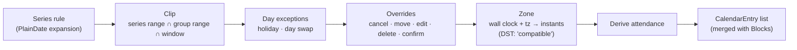
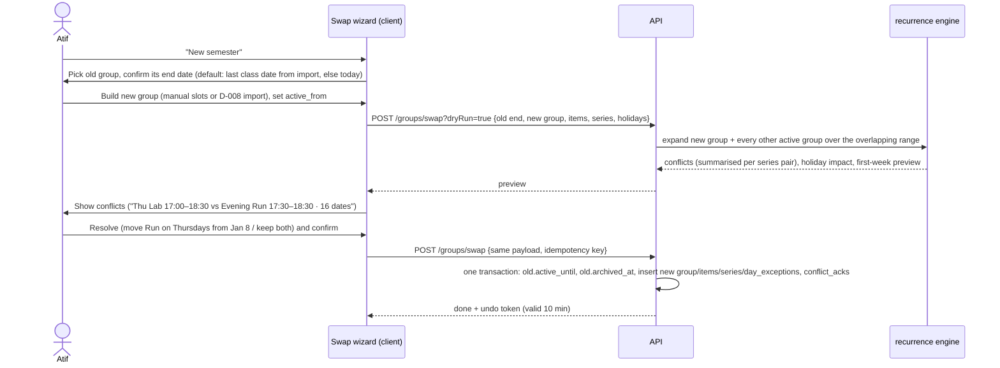
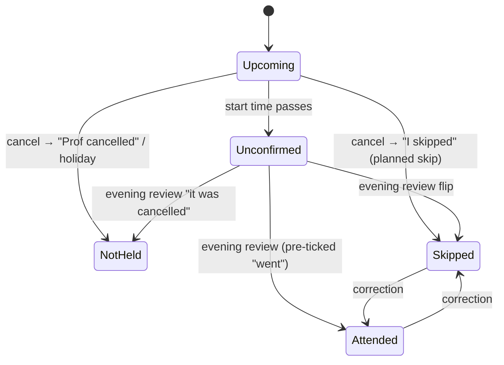

# 01 · Recurrence engine — deep dive

> Slice: 01-recurrence · Written: 2026-10-05 · Status: brainstorm, for critique
> Scope: how recurring blocks (classes, runs, writing days) are stored, expanded, edited, cancelled, clipped by group date ranges, checked for conflicts, cancelled in bulk for holidays, rendered across time zones, and turned into attendance numbers. It also covers how one-off Blocks (tasks dragged onto the calendar) relate to all of this.

---

## 1. TL;DR

- **Store rules, not occurrences.** A recurring thing is a *series* (a small rule plus a wall-clock start time and duration). Occurrences are **computed on read** for the requested window. A row is written for a single occurrence **only when the user says something about it**: cancel, move, edit, delete, or confirm attendance. I call this "virtual occurrences with lazy materialisation on write".
- **Occurrence identity = `(series_id, original local date)`.** In the subset we support, a series yields at most one occurrence per local date, so the date alone identifies it. Unlike RFC 5545's `RECURRENCE-ID` (a full date-time), this key **survives edits to the series' time**. It also gives us natural, idempotent upsert keys, which matters for offline sync.
- **Use a custom JSON rule that is a strict subset of RRULE**: `daily` every N days, or `weekly` every N weeks on chosen weekdays, plus a start date and an optional end date. `COUNT` ("ends after 10 times") is converted to an end date when the series is saved. It can be serialised to RRULE text for a later ICS export.
- **Expand dates first, attach times later.** The expander works only with `Temporal.PlainDate`, so it has no time zones and no DST. The wall-clock time and the time zone are attached at the very end with Temporal's `'compatible'` disambiguation. A DST-gap occurrence is **shifted forward, not dropped**. This is a deliberate departure from RFC 5545, which says to drop it.
- **Write the expander yourself (~60 lines). Use `rrule-temporal` as the test oracle, not as the runtime engine.** I prototyped the expander during this research. It matched `rrule-temporal` 2.2.8 on 3,000 random daily and weekly rules and passed window-additivity and "split is a no-op" property tests. The split property caught a real bug in my first sketch.
- **Holidays are their own layer** (a `day_exception` table), not N cancellation rows. Bulk-cancelling is one row per holiday, undoing it is one delete, and it automatically applies to series created later, such as next semester's.
- **Attendance is derived, never stored.** The only stored facts are cancellations (with a reason) and per-occurrence confirmations. Every attendance state (attended, skipped, not held, unconfirmed) is a pure function of those facts and the clock. The percentage is shown as a range `[lower, upper]` until everything is confirmed, plus a "you can still skip N" projection computed with integer arithmetic.
- **"Edit all" never rewrites the past.** A change to timing (days, time, interval) is applied *from a date*, by splitting the series. Only cosmetic fields such as title, location and colour apply everywhere.
- **Conflict detection** = expand both groups over the overlap of their active ranges, then do a sort-and-sweep over the intervals (O(n log n), about 1,000 intervals per semester, a few milliseconds). Results are summarised per pair of series, not per date.
- **Blocks (tasks on the calendar) are a separate table.** They have no recurrence and are stored as absolute instants. They share a `CalendarEntry` read model with occurrences, so the UI, the conflict checker and the "time back" feature treat both the same way.

---

## 2. Assumptions about other slices

I couldn't read the other slices. These are the assumptions this design relies on, so a critic can check them for mismatches.

| Slice | Assumption | What breaks if it's wrong |
|---|---|---|
| **02-data-model** | Entities exist roughly as: `schedule_group` (D-004), `recurring_item` (e.g. "DBMS", "Evening run"), `series` (one timing pattern of an item), `occurrence_override`, `day_exception`, `block`, `task`, `session`. Task / Block / Session stay separate (backlog: "Task / Block / Session separation"). | If 02 merges Block into series (a one-off as a COUNT=1 series), the "Blocks are separate" section needs revisiting. I argue against that below. |
| **03-backend** | The backend is **TypeScript** (Node 26 LTS or similar), so the expansion package is shared between server and PWA. | If the backend is Python, the engine has to be written twice, or only the server expands it (the PWA then can't render offline). §5.13 notes the Python options. |
| **04-database-and-sync** | **Postgres**. Clients sync using row-level last-writer-wins on `updated_at`, or a similar row-based mechanism. Natural keys are allowed as unique constraints. | If 04 picks a replicated-table sync engine whose client queries are SQL over synced tables, that is my "switch condition" (§4). |
| **05-sessions** | A session can optionally reference an occurrence by `(series_id, occurrence_date)`, for example "45 min logged during Wednesday's Writing slot". There is no FK to an occurrence row, because occurrence rows mostly don't exist. | If 05 needs a hard FK, it can create an override row on first reference (lazy materialisation already supports this). |
| **06-auth** | Every row carries `user_id`. Multi-user from day one, even though Atif is the only user. | None for the engine. It's pure and per-user. |
| **07-infra** | No cron or worker is required by recurrence. Expansion is stateless. The evening-shutdown push (D-010) is scheduled by another slice using the user's profile time zone. | If 07 has no scheduler at all, nothing here breaks. |
| **08-integrations / D-008 import** | The uni-calendar import format describes **slots** (weekday, start, end, title, location) and **holidays** (date, label). It does **not** ask an LLM to produce RRULE strings, because LLMs get RRULE wrong often. | If the import emits RRULE, add a parser for the supported subset (reject anything else). |
| **09-frontend** | React PWA. It renders a list of `CalendarEntry` and imports the same `@planner/recurrence` package for offline rendering and optimistic updates. | If the frontend can't embed the package, the server-side `/calendar` endpoint still works (online only). |
| **10-scheduling** | Consumes `busyIntervals(day)` and a `freedInterval` event when a busy occurrence is cancelled ("you just got time back"). | Interface only. |
| **11-capture** | Natural-language quick add ("DBMS mon wed fri 10am") compiles to the same `Recurrence` JSON. | The parser can target a different format only if it converts to this one. |
| **12-ux-flows** | Owns the edit-scope dialog (this / this and following / all), the semester-swap wizard, the conflict cards and the evening review. I specify the semantics; they specify the screens. | If 12 drops "this and following", the split logic is still needed internally for "edit all" (§5.6). |
| **13-build-plan** | Roadmap v0 = this engine without attendance stats; v2 = attendance. I recommend capturing the cancel *reason* from v0 anyway (§5.14). | Only ordering changes. |

---

## 3. Three genuinely different approaches

The real fork in the road is **what the source of truth is**: the rule, the rows, or both.

| Approach | Pros | Cons | Solo-dev effort | Interview value |
|---|---|---|---|---|
| **A. Virtual occurrences.** Rules are the truth. Occurrences are computed for a window on every read. A sparse override row exists only for occurrences the user touched. (The RFC 5545 / Google Calendar model.) | One source of truth. Editing a series is one row update. Open-ended series ("daily run", no end date) cost nothing. Storage is about 30 series plus a few hundred overrides per semester. Holidays and group ranges are cheap "layers". Natural keys make offline edits idempotent. | Every consumer needs the engine; plain SQL can't answer "which classes were on 14 Oct". Overrides can be orphaned when a rule changes, and the DB can't enforce a FK to a virtual occurrence. Moved occurrences need care at window edges. | **Medium.** ~600–900 lines of TS plus tests. Most of the difficulty is in edit semantics, not expansion. | **High.** Shows the classic "rules vs instances" trade-off, natural keys, property-based testing, and DST reasoning. Easy to whiteboard. |
| **B. Fully materialised rows.** The rule is only a generator. When a series is created, one row is inserted per occurrence for the group's active range (bounded, e.g. a semester), or N weeks ahead for open-ended series. Rows are the truth. | Every query is plain SQL. Attendance, sessions and blocks can have real FKs. Very easy to debug (`select * from occurrence`). A semester is small (about 30 slots × 18 weeks ≈ 540 rows). | "Edit all" becomes a diff-and-regenerate job that must keep hand-edited rows, so you end up storing a "was this row edited?" flag, which is approach A's override concept in disguise. Open-ended series need a horizon-extension job, which turns this into C. A room change rewrites hundreds of rows, all of which must sync to every device. It's hard to tell what the rule was once rows drift. | **Low to start, high later.** Day one is easy. The reconciliation logic for "this and following" over rows is where the time goes. | **Medium.** It's what most people build first. It's defensible only if you can explain why reconciliation is acceptable. |
| **C. Hybrid with a rolling horizon.** Rules are the truth, *and* an `occurrence` table is kept filled for [today − X, today + 12 weeks] by a job and by write-time triggers. Overrides are applied to the cached rows. | SQL and FKs for the hot window. Reads are a single indexed range scan. Per-occurrence reminders and the scheduling algorithm can query rows directly. | Two sources of truth plus cache invalidation. Needs a scheduler. Views beyond the horizon (planning next semester, history) still need on-the-fly expansion, so **you build A anyway**. Backfill bugs are silent. | **High.** All of A, plus a job runner, idempotent regeneration and drift detection. | **High if finished, negative if half-done.** A half-working cache is a liability in an interview. |

**Why A, B and C really are different.** In A, deleting every override row loses only user deviations, and the calendar can be fully rebuilt from rules. In B, deleting the occurrence rows loses the calendar. In C, deleting the cache loses nothing, but a bug in cache maintenance shows wrong data without any error. These are three different failure models, not three implementations of the same one.

**Why not RRULE strings versus a custom format as the axis?** That choice is real but secondary. It sits inside whichever storage model you pick, and I resolve it in §5.2 (custom JSON that is a strict RRULE subset).

**What the numbers say.** Atif's realistic load is about 6 subjects × 3–5 slots + 2 habit series ≈ 25–30 series, maybe 200 overrides per semester, and about 20 holidays a year. Expanding a week touches 30 series × 7 days, which takes microseconds. Expanding a whole semester for attendance stats is 30 × 140 date checks, which is still sub-millisecond. Performance is not a reason to materialise at this scale, or at 10,000 users, because expansion is per user, per request, and needs no shared state.

---

## 4. Recommendation

**Approach A: virtual occurrences with lazy materialisation on write.** It has these parts:

1. A custom `Recurrence` JSON (daily / weekly, interval, weekdays) on a `series` row, with `start_date`, `until_date`, `start_time` and `duration_min`.
2. Occurrence identity `(series_id, original_date)`, enforced by a unique constraint on `occurrence_override`.
3. A pure, deterministic TypeScript package `@planner/recurrence`, shared by the server and the PWA. Expansion works on `PlainDate`, and time zones are attached last.
4. Layers applied in a fixed order: rule → series and group date clipping → day exceptions (holidays, day swaps) → per-occurrence overrides → time-zone resolution → derived attendance.
5. Holidays as a separate `day_exception` layer. Attendance derived from cancellations and confirmations.
6. Timing edits applied from a date via series splits. Conflict detection by expand-and-sweep.

Approach A is also **the first half of C**. If the switch condition below ever fires, the engine becomes the generator for C's cache and nothing is thrown away. B doesn't have that property: moving from B to A means migrating data out of rows back into rules.

### The strongest argument against it (steelman)

> "You're optimising for elegance over operability. Look at what this app actually *does* with occurrences: attendance percentages, the evening review, session time history ('time spent in Writing slots this month'), 'time back' gap-finding, conflict views, and later an ICS feed and a native app. **Every one of those is a query over occurrences.** With A, none of them can be written in SQL. Each needs the TypeScript engine in the loop, including ad-hoc debugging at 1 a.m. when attendance looks wrong. ('Why is DBMS at 71%?' Under B that's one `GROUP BY`. Under A you write a script.)
>
> "The data is **bounded**: semesters end (D-004 gives every group an active range), and a semester is ~540 rows. Materialising that is free. B gives you real foreign keys from attendance and sessions to occurrences, so the database guarantees what A's natural keys only promise: an override can never point at an occurrence that no longer exists.
>
> "Version skew is worse under A. When you fix a bug in the expander, an old PWA still holding the old bundle keeps rendering the buggy set until it updates. Under B the server's rows are data, and data has no version. Atif is in his 3rd semester and is taking DBMS right now. Rows, constraints and `GROUP BY` are what he can explain best, and the 'reconciliation is hard' problem shows up only for 'edit all/following', which happens maybe twice a semester."

That is a serious argument. My answer:
- Open-ended habit series (the daily run, writing days) are first-class in the vision, and they're the case where B degrades into C.
- The reconciliation that B needs for edits is the *same* logic A needs (which hand-edited occurrences survive a rule change?). B just runs it over hundreds of rows instead of a few overrides.
- The SQL-debuggability gap is closed cheaply with a debug endpoint or a CLI that prints the expanded occurrences for an item, plus golden tests.
- Version skew is handled by stamping an `engineVersion` on API responses and making the PWA refetch server-expanded entries when its bundled engine is older.

### When I would switch

Switch to **C (with the cache horizon = each group's active range, so it's bounded and needs no rolling job)** if **any one** of these becomes true:
1. 04-database-and-sync chooses a sync engine where the client queries synced tables with SQL and can't run the TS package in its query path.
2. Three or more features need to *query* occurrences in SQL (for example, scheduling algorithms written in SQL, or analytics dashboards).
3. During the 2-week v0 dogfood, orphaned-override bugs or client/server expansion mismatches show up more than once.

---

## 5. Implementation walkthrough

### 5.1 Vocabulary and the resolution pipeline

- **Group** (D-004): "Classes · Sem 3", "Health". It has a colour, an active date range, an attendance flag, a time-zone mode, and whether it observes holidays.
- **Item**: the thing you'd name, such as "DBMS" or "Evening run". Attendance is computed **per item**, because the 75% rule is per subject. An item has a title, location and notes.
- **Series**: one timing pattern of an item. DBMS on Mon/Wed 10:00–11:00 is one series, and DBMS on Fri 14:00–15:00 lab is another. This is needed because RRULE can't express "different times on different weekdays" without producing a cartesian product. Series are what get split. Items keep their identity across splits, so attendance doesn't fragment.
- **Occurrence**: one computed instance. Mostly virtual.
- **Override**: a row holding anything the user said about one occurrence (cancel, move, edit, delete, confirm).
- **Day exception**: a date-level rule ("2026-10-20 is a holiday", "Saturday follows Monday's timetable").
- **Block**: a one-off calendar reservation, usually for a task. Not recurring.



**Precedence rule (memorise this one):** *an explicit user action on one occurrence beats a bulk rule, and a bulk rule beats the series rule.* Concretely: override > day exception > series rule. Everything in §7 follows from this.

### 5.2 Rule format: a custom JSON subset of RRULE

What classes, runs and writing days actually need:

| Real case | RRULE | Our JSON |
|---|---|---|
| Class every Mon/Wed/Fri | `FREQ=WEEKLY;BYDAY=MO,WE,FR` | `{freq:'weekly', interval:1, byDay:['MO','WE','FR']}` |
| Run every day | `FREQ=DAILY` | `{freq:'daily', interval:1}` |
| Every 3 days | `FREQ=DAILY;INTERVAL=3` | `{freq:'daily', interval:3}` |
| Alternate-week lab | `FREQ=WEEKLY;INTERVAL=2;BYDAY=TH` | `{freq:'weekly', interval:2, byDay:['TH']}` |
| Writing on weekends | `FREQ=WEEKLY;BYDAY=SA,SU` | `{freq:'weekly', interval:1, byDay:['SA','SU']}` |
| Semester ends | `UNTIL=…` | `series.until_date` (inclusive, a local date) |
| "Ends after 10 times" | `COUNT=10` | Converted to `until_date` at save time |

**Not supported, deliberately:** `HOURLY`/`MINUTELY`, `BYSETPOS`, `BYWEEKNO`, `BYYEARDAY`, multiple `BYHOUR` values (use separate series), `RSCALE`. **Monthly** (`BYMONTHDAY=15`, or "2nd Saturday") is the only plausible extension. The type is a discriminated union, so adding `{freq:'monthly', ...}` later is additive.

```ts
// packages/recurrence/src/types.ts
import { Temporal } from 'temporal-polyfill';
export type PlainDate = Temporal.PlainDate;

export type Weekday = 'MO' | 'TU' | 'WE' | 'TH' | 'FR' | 'SA' | 'SU';

export type Recurrence =
  | { freq: 'daily';  interval: number }                       // 1..365
  | { freq: 'weekly'; interval: number; byDay: Weekday[] };    // 1..52, byDay non-empty, unique
```

**Why custom JSON instead of storing RRULE strings:**
1. Impossible states can't be represented. A zod schema plus a Postgres `CHECK` on `rule->>'freq'` means no code path ever sees `BYSETPOS`.
2. The UI maps 1:1 to the fields, so there's no parsing in the form.
3. The D-008 import and the quick-add parser target a tiny, easy-to-validate shape.
4. Interop is preserved by a 15-line `toRRULE()` for a future ICS export (D-003 "maybe later").
5. Interview story: "I picked the smallest model that covers the use cases and kept a lossless path to the standard."

**Why `COUNT` is converted at save time:** a `COUNT` rule can't be split cleanly, because the new half needs "remaining count", which depends on exceptions. With `until_date` everywhere, a split is just "set until on the old series, set start on the new one". The UI can still say "ends after 10 times" by computing the 10th date when saving.

**Week start (`WKST`) is always Monday internally.** It only affects the phase of `interval > 1` weekly rules: which weeks are "on". The *display* week start (Sunday for US users) is a separate UI preference and must never change which weeks a biweekly lab falls on.

### 5.3 Schema (Postgres DDL)

```sql
create table schedule_group (
  id                     uuid primary key,
  user_id                uuid not null,
  name                   text not null,
  color                  text not null,
  active_from            date not null,
  active_until           date,                       -- inclusive; null = open-ended
  tz_mode                text not null check (tz_mode in ('anchored','floating')),
  tzid                   text,                       -- IANA, required iff anchored
  busy                   boolean not null default true,  -- counts for conflicts / free time
  observes_holidays      boolean not null default false,
  attendance_enabled     boolean not null default false,
  attendance_threshold   smallint check (attendance_threshold between 1 and 100), -- e.g. 75
  attendance_tracking_from date,                     -- default: creation date
  archived_at            timestamptz,
  created_at             timestamptz not null default now(),
  updated_at             timestamptz not null default now(),
  check (active_until is null or active_until >= active_from),
  check ((tz_mode = 'anchored') = (tzid is not null))
);

create table recurring_item (
  id                     uuid primary key,
  user_id                uuid not null,
  group_id               uuid not null references schedule_group(id),
  title                  text not null,
  location               text,
  notes                  text,
  attendance_baseline_attended smallint,   -- optional: from the uni portal, as of tracking start
  attendance_baseline_total    smallint,
  deleted_at             timestamptz,
  created_at             timestamptz not null default now(),
  updated_at             timestamptz not null default now()
);

create table series (
  id                     uuid primary key,
  user_id                uuid not null,
  item_id                uuid not null references recurring_item(id),
  start_date             date not null,       -- DTSTART date, also the phase anchor
  until_date             date,                -- inclusive
  start_time             time not null,       -- wall clock in the group's tz
  duration_min           integer not null check (duration_min between 5 and 1440),
  rule                   jsonb not null,      -- Recurrence
  split_from_series_id   uuid references series(id),  -- lineage for "this and following"
  deleted_at             timestamptz,
  created_at             timestamptz not null default now(),
  updated_at             timestamptz not null default now(),
  check (until_date is null or until_date >= start_date),
  check (rule->>'freq' in ('daily','weekly'))
);

create table occurrence_override (
  id                     uuid primary key,
  user_id                uuid not null,
  series_id              uuid not null references series(id),
  kind                   text not null check (kind in ('modified','extra')),
  original_date          date,                -- null only for 'extra'
  status                 text check (status in ('scheduled','cancelled','deleted')), -- null = inherit
  cancel_reason          text check (cancel_reason in ('prof','self')),               -- attendance groups only
  new_date               date,
  new_start_time         time,
  new_duration_min       integer check (new_duration_min between 5 and 1440),
  title_override         text,
  location_override      text,
  note                   text,
  confirmed_at           timestamptz,         -- attendance confirmation (D-010)
  updated_at             timestamptz not null default now(),
  check ((kind = 'extra') = (original_date is null)),
  check (kind <> 'extra' or (new_date is not null and new_start_time is not null)),
  check (cancel_reason is null or status = 'cancelled')
);
-- Natural key: one override per virtual occurrence. NULLs are distinct in Postgres, so extras never collide.
create unique index occurrence_override_key on occurrence_override (series_id, original_date);
create index occurrence_override_by_new_date on occurrence_override (user_id, new_date) where new_date is not null;
create index occurrence_override_by_orig    on occurrence_override (user_id, original_date);

create table day_exception (
  id                     uuid primary key,
  user_id                uuid not null,
  date                   date not null,
  kind                   text not null check (kind in ('holiday','day_swap')),
  label                  text not null,
  follows_weekday        smallint check (follows_weekday between 1 and 7),  -- day_swap only
  source                 text not null check (source in ('manual','import')),
  import_batch_id        uuid,                 -- undo a whole import in one statement
  created_at             timestamptz not null default now(),
  unique (user_id, date, kind),
  check ((kind = 'day_swap') = (follows_weekday is not null))
);

-- Floating-time resolution needs to know which tz the user was in *on that date* (§5.9).
create table user_tz_period (
  user_id                uuid not null,
  valid_from             date not null,
  tzid                   text not null,
  primary key (user_id, valid_from)
);

create table conflict_ack (
  user_id                uuid not null,
  series_a               uuid not null,       -- ordered: series_a < series_b
  series_b               uuid not null,
  acked_versions         text not null,       -- e.g. updated_at of both series at ack time
  primary key (user_id, series_a, series_b)
);
```

Two notes on the schema. Overrides use **patch semantics**: every override field is nullable, meaning "inherit from the series". An override that only changed the room keeps following the series' time if the series time later changes. A snapshot-style exception (copying all fields) would freeze the old time, which is the classic way calendars lose changes. Also, `start_date`, `until_date`, `original_date` and `new_date` are `date` columns, and times are `time` columns. **Nothing about a recurring series is stored as `timestamptz`**, because instants are derived.

### 5.4 Occurrence identity

```ts
export type OccurrenceKey = string; // `${seriesId}:${YYYY-MM-DD}` for generated, `x:${overrideId}` for extras
export const keyOf = (seriesId: string, d: PlainDate): OccurrenceKey => `${seriesId}:${d.toString()}`;
```

Why the date and not the start date-time:
- **It survives time edits.** Change DBMS from 10:00 to 10:30 "for all", and every existing cancellation still points at the right class. With a datetime key (RFC 5545 `RECURRENCE-ID`), every exception would have to be rewritten.
- **It survives time-zone changes**, because a local date doesn't depend on the offset.
- **It is unique** in our subset: with no sub-daily frequencies and one time per series, there's at most one generated occurrence per series per date.
- **It is computable without the DB.** The UI can cancel next Friday's class before any row exists. The client sends `PUT /occurrences/{seriesId}/{date}` and the server upserts. Two offline devices cancelling the same class produce one row, not two.

What it doesn't survive is a **weekday change**: if the series moves from Monday to Tuesday, Monday-keyed overrides no longer match a generated date. That's correct, because those occurrences really don't exist any more. The engine reports them as **orphans** (`resolveWindow` returns them separately). Because timing changes go through a split (§5.6), past Monday overrides stay attached to the old, still-valid series, so orphans should almost never happen in practice.

### 5.5 Expansion and resolution

**Date expansion.** This is the exact logic I prototyped and differentially tested against `rrule-temporal` 2.2.8 (3,000 random rules, zero mismatches once you account for RFC 5545 always including `DTSTART`, which we deliberately don't when it doesn't match `byDay`).

```ts
// packages/recurrence/src/expand.ts
const DOW: Record<Weekday, number> = { MO:1, TU:2, WE:3, TH:4, FR:5, SA:6, SU:7 };
const weekStart = (d: PlainDate) => d.subtract({ days: d.dayOfWeek - 1 });   // WKST = MO
const maxD = (a: PlainDate, b: PlainDate) => (Temporal.PlainDate.compare(a, b) >= 0 ? a : b);
const minD = (a: PlainDate, b: PlainDate) => (Temporal.PlainDate.compare(a, b) <= 0 ? a : b);
const le = (a: PlainDate, b: PlainDate) => Temporal.PlainDate.compare(a, b) <= 0;

/** Dates the rule generates within [from, to], clipped by series and group ranges. Pure. */
export function expandDates(
  s: Pick<Series, 'rule' | 'startDate' | 'untilDate'>,
  g: Pick<GroupWindow, 'activeFrom' | 'activeUntil'>,
  from: PlainDate, to: PlainDate,
): PlainDate[] {
  const lo = maxD(maxD(from, s.startDate), g.activeFrom);
  let hi = to;
  if (s.untilDate) hi = minD(hi, s.untilDate);
  if (g.activeUntil) hi = minD(hi, g.activeUntil);
  const out: PlainDate[] = [];
  if (!le(lo, hi)) return out;

  const r = s.rule;
  if (r.freq === 'daily') {
    // jump straight to the first aligned day >= lo: O(occurrences), not O(days)
    const offset = s.startDate.until(lo, { largestUnit: 'days' }).days;
    const k = Math.ceil(offset / r.interval);
    for (let d = s.startDate.add({ days: k * r.interval }); le(d, hi); d = d.add({ days: r.interval })) out.push(d);
  } else {
    const anchor = weekStart(s.startDate);                     // phase comes from the SERIES start
    const days = [...new Set(r.byDay)].map(x => DOW[x]).sort((a, b) => a - b);
    let w = weekStart(lo);
    const weeks = anchor.until(w, { largestUnit: 'days' }).days / 7;
    const rem = ((weeks % r.interval) + r.interval) % r.interval;
    if (rem !== 0) w = w.add({ weeks: r.interval - rem });     // skip to the next "on" week
    for (; le(w, hi); w = w.add({ weeks: r.interval })) {
      for (const dow of days) {
        const d = w.add({ days: dow - 1 });
        if (le(lo, d) && le(d, hi)) out.push(d);
      }
    }
  }
  return out;
}

export const occursOn = (s: Series, g: GroupWindow, d: PlainDate) => expandDates(s, g, d, d).length === 1;
```

Note that the **phase anchor is the series start, never the clip start**. If the group's active range starts later than the series, a biweekly lab still falls in the same weeks. There's a test for this (E8).

**Resolution.** This step turns dates into `Occurrence` objects for a window.

```ts
export interface Occurrence {
  key: OccurrenceKey;
  seriesId: string; itemId: string; groupId: string;
  originalDate: PlainDate | null;        // null for extras
  date: PlainDate;                       // effective local date (after a move)
  start: Temporal.ZonedDateTime;         // in the series' resolved tz
  end: Temporal.ZonedDateTime;
  status: 'scheduled' | 'cancelled';
  cancelReason: 'prof' | 'self' | 'holiday' | null;
  title: string; location: string | null; note: string | null;
  isMoved: boolean; isExtra: boolean;
  dstAdjusted: boolean;                  // wall-clock start fell in a DST gap and was shifted
  holidayLabel: string | null;
  confirmedAt: Temporal.Instant | null;
}

export interface ResolveInput {
  groups: Map<string, GroupWindow>;
  items: Map<string, Item>;
  series: Series[];
  overrides: Override[];          // rows with original_date OR new_date in [from, to], plus all extras in range
  dayExceptions: Map<string, DayException>;   // keyed by ISO date
  tzForDate: (d: PlainDate) => string;        // floating resolution, from user_tz_period
  from: PlainDate; to: PlainDate;
}

export function resolveWindow(i: ResolveInput): { occurrences: Occurrence[]; orphans: Override[] } {
  const ovByKey = new Map(i.overrides.filter(o => o.kind === 'modified').map(o => [keyOf(o.seriesId, o.originalDate!), o]));
  const seen = new Set<OccurrenceKey>();
  const out: Occurrence[] = [];

  // Pass 1: generated occurrences whose ORIGINAL date is in the window.
  for (const s of i.series) {
    const g = i.groups.get(groupOf(s))!;
    for (const d of expandDates(s, g, i.from, i.to)) {
      const k = keyOf(s.id, d);
      seen.add(k);
      const occ = applyLayers(s, g, d, ovByKey.get(k), i);
      if (occ && inWindow(occ.date, i.from, i.to)) out.push(occ);   // moved OUT of the window → drop
    }
  }
  // Pass 2: occurrences moved INTO the window from outside it.
  for (const o of i.overrides) {
    if (o.kind !== 'modified' || !o.newDate || seen.has(keyOf(o.seriesId, o.originalDate!))) continue;
    if (!inWindow(o.newDate, i.from, i.to)) continue;
    const s = seriesById(i, o.seriesId), g = i.groups.get(groupOf(s))!;
    if (!occursOn(s, g, o.originalDate!)) continue;                 // reported as an orphan below
    const occ = applyLayers(s, g, o.originalDate!, o, i);
    if (occ) out.push(occ);
  }
  // Pass 3: extras (make-up classes, RDATE-like).
  for (const o of i.overrides) if (o.kind === 'extra' && inWindow(o.newDate!, i.from, i.to)) out.push(buildExtra(o, i));

  const orphans = i.overrides.filter(o => o.kind === 'modified' && !isGenerated(o, i));
  return { occurrences: out.sort((a, b) => Temporal.ZonedDateTime.compare(a.start, b.start)), orphans };
}
```

`applyLayers` is where the precedence rule lives:

```ts
function applyLayers(s: Series, g: GroupWindow, original: PlainDate, ov: Override | undefined, i: ResolveInput): Occurrence | null {
  if (ov?.status === 'deleted') return null;                         // removed entirely
  const moved = !!(ov?.newDate || ov?.newStartTime);
  const date = ov?.newDate ?? original;
  const time = ov?.newStartTime ?? s.startTime;
  const dur  = ov?.newDurationMin ?? s.durationMin;

  let status: 'scheduled' | 'cancelled' = 'scheduled';
  let reason: Occurrence['cancelReason'] = null;
  let holidayLabel: string | null = null;

  // Layer 2: day exceptions. Apply only when the user hasn't explicitly placed or decided this occurrence.
  const ex = i.dayExceptions.get(original.toString());
  if (g.observesHolidays && ex?.kind === 'holiday' && !moved && ov?.status == null) {
    status = 'cancelled'; reason = 'holiday'; holidayLabel = ex.label;
  }
  // Layer 3: an explicit override status wins over everything.
  if (ov?.status === 'cancelled') { status = 'cancelled'; reason = ov.cancelReason; }
  if (ov?.status === 'scheduled') { status = 'scheduled'; reason = null; }   // e.g. a class held despite a holiday

  // Layer 4: zone. Wall clock + tz → instant, with DST 'compatible' (gap → shift forward, overlap → earlier).
  const tzid = g.tz.mode === 'anchored' ? g.tz.tzid : i.tzForDate(date);
  const start = date.toZonedDateTime({ timeZone: tzid, plainTime: time });
  const end = start.add({ minutes: dur });                           // exact elapsed time
  return {
    key: keyOf(s.id, original), seriesId: s.id, itemId: s.itemId, groupId: g.id,
    originalDate: original, date, start, end, status, cancelReason: reason,
    title: ov?.titleOverride ?? itemTitle(s, i), location: ov?.locationOverride ?? itemLocation(s, i),
    note: ov?.note ?? null, isMoved: moved, isExtra: false,
    dstAdjusted: !start.toPlainTime().equals(time), holidayLabel, confirmedAt: ov?.confirmedAt ?? null,
  };
}
```

The **day swap** ("Saturday 14 Nov follows Monday's timetable", common in Indian universities) fits the same structure. For a `day_swap` on date X with `follows_weekday = Y`: in groups that observe holidays, X's own occurrences are suppressed. For each series that `occursOn` the weekday-Y date in X's ISO week, emit an occurrence on X with `originalDate = X`. The key `(series, X)` stays unique because a series generates at most one occurrence per date, and X's own occurrences were suppressed. I suggest shipping this after v0 (Open decision Q2).

### 5.6 Edit operations

**Edit-scope semantics.** The dialog offers three choices. Defaults matter more than options: a **drag defaults to "this occurrence"** with an undo toast and **no dialog**. The dialog appears only from the edit sheet.

| User intent | Scope | What gets written | Notes |
|---|---|---|---|
| Prof cancelled today's class | this | upsert override `status='cancelled', cancel_reason='prof'` | D-005: the single question appears only in attendance groups |
| I'm skipping the lab | this | `status='cancelled', cancel_reason='self'` | Counts as missed |
| Cancel today's run | this | `status='cancelled'` (no reason) | Non-attendance group: no question |
| Class moved to Saturday 14:00 | this | `new_date`, `new_start_time` | Key unchanged, so attendance follows the class |
| Different room once | this | `location_override` | Patch, so it keeps following series time changes |
| Undo a cancel | this | set `status = null` (inherit), or delete the row if every field is null | Undo is just another upsert |
| This class never existed (import mistake) | this | `status='deleted'` | Hidden; excluded from attendance |
| From next week DBMS is at 11:00 | this and following | **split** at D (below) | |
| Rename "DBMS" → "Database Systems" | all | update `recurring_item.title` | Cosmetic, so history changes too, which is fine |
| "Change all" days or time | all | **split at today** (default) or at a chosen date | **Never rewrites the past.** See below |
| Stop doing this series | this and following | `until_date = D − 1` ("end series") | History and attendance kept |
| Delete series | all | soft delete (`deleted_at`). Allowed directly only if it has no overrides, confirmations or sessions. Otherwise the UI offers "End it instead" | Prevents destroying attendance history |

**"Edit all" should not rewrite history.** In a plain calendar, "edit all" can repaint the past without harm. In this app, past occurrences carry attendance confirmations and sessions. If "all" changed Monday classes to Tuesday retroactively, every past Monday confirmation would become an orphan and attendance would collapse. So *timing* fields (`rule`, `start_time`, `duration_min`, `start_date`) under "all" are implemented as a split at `max(today, series.start_date)`. The UI copy is honest about it: "Applies from **Mon 5 Oct** ▾". If the series hasn't started yet, the split degenerates into an in-place update.

**The split algorithm ("this and following" at date D):**

```ts
/** Returns DB mutations. Pure, so it can be tested without a DB. */
export function planSplit(s: Series, g: GroupWindow, D: PlainDate, changes: Partial<SeriesTiming>, overrides: Override[]): SplitPlan {
  if (Temporal.PlainDate.compare(D, s.startDate) <= 0) return { kind: 'in-place', update: changes };  // S4
  const dm1 = D.subtract({ days: 1 });
  // Clamp: splitting after the series ends must NOT extend it (S3, a bug fast-check found in my first sketch).
  const oldUntil = s.untilDate && Temporal.PlainDate.compare(s.untilDate, dm1) < 0 ? s.untilDate : dm1;
  // Phase preservation: the new series starts at the first occurrence >= D, not at D (S1).
  const newRule = changes.rule ?? s.rule;
  const firstOn = changes.rule
    ? D                                                            // a new rule defines its own phase from D
    : expandDates(s, g, D, D.add({ days: 7 * maxInterval(s.rule) + 7 }))[0];
  if (!firstOn || (s.untilDate && Temporal.PlainDate.compare(firstOn, s.untilDate) > 0))
    return { kind: 'end-only', update: { untilDate: oldUntil } };
  const newSeries: Series = { ...s, ...changes, id: uuid(), startDate: firstOn, rule: newRule, splitFromSeriesId: s.id };
  // Re-key overrides at/after D to the new series if the new series still generates that date; otherwise orphan.
  const moves = overrides
    .filter(o => o.kind === 'modified' && Temporal.PlainDate.compare(o.originalDate!, D) >= 0)
    .map(o => (occursOn(newSeries, g, o.originalDate!) ? { rekey: o.id, to: newSeries.id } : { orphan: o.id }));
  return { kind: 'split', update: { untilDate: oldUntil }, insert: newSeries, moves };
}
```

The whole plan runs in **one transaction**. The invariant, tested as a property: *splitting with no changes leaves the expanded set identical*. If you split a biweekly-Monday series on a Tuesday and naively start the new series on D, the phase flips. In the prototype, the naive version produced 26 Oct and 9 Nov instead of 19 Oct and 2 Nov.

If a split produces orphans (the new rule no longer generates a date that had a cancellation), the UI shows them before committing: "2 changes on Mondays won't apply any more: 'Prof cancelled, 9 Nov'. Discard them?" Orphans stay in the table (harmless, never rendered) until the user confirms.

**Delete vs cancel, summarised.** *Cancel* means "it was scheduled and didn't happen": it's visible (grey, diagonal stripes, as in the persona file) and matters for attendance. *Delete* means "it should never have been on the calendar": it's invisible and ignored by everything. Users mostly need cancel. Delete exists for import mistakes.

### 5.7 Groups: clipping, archiving, the semester swap, conflicts

**Clipping.** The effective range of a series is `[series.start_date, series.until_date] ∩ [group.active_from, group.active_until] ∩ [window]`. This is done once inside `expandDates`. Overrides on dates outside the group range are kept but not rendered. If the user later extends the semester by a week, those overrides reappear. This comes for free from layering, and it's the right behaviour.

**Archiving** (D-004) has a precise meaning here. An archived group produces **no future occurrences**, but its **past occurrences still render** when you browse old weeks, and its attendance stays viewable. Implementation: archiving sets `archived_at` (which hides the group from group pickers and the "today" surfaces) and, if `active_until` is null or in the future, sets `active_until` to the chosen end date. Deleting a group is a separate, rarer action (soft delete with a 30-day trash).

**The semester swap flow** (one wizard, one transaction at the end):



"Move Run on Thursdays from Jan 8" is just a **split** of the Run series at the new semester's first Thursday. The same primitive is reused. A "clone old group as a starting point" option is cheap to offer (copy items and series with new dates). It's useful when only a few subjects change.

**Conflict detection.**

*What counts as a conflict:* two **scheduled** (not cancelled) occurrences from groups with `busy = true` whose time intervals overlap by **more than zero minutes**. Touching endpoints (10:00–11:00 and 11:00–12:00) are not a conflict. Overlaps within one group are reported separately as "possible timetable/import mistake". One-off Blocks overlapping occurrences are shown inline in the calendar, not as group conflicts.

*Algorithm:*
1. Window = intersection of the new or edited group's active range with each other group's active range, capped at 400 days. Open-ended habit groups are clipped by the new group's range.
2. Expand everything in the window with `resolveWindow`, using the real layers, so holidays and cancellations are already applied.
3. Map to `[startMs, endMs)` using `start.epochMilliseconds`, which compares correctly across time zones and DST.
4. Sort by start, then sweep:

```ts
export function findOverlaps(occs: Occurrence[], isBusy: (o: Occurrence) => boolean): OverlapPair[] {
  const xs = occs.filter(o => o.status === 'scheduled' && isBusy(o))
    .map(o => ({ o, s: o.start.epochMilliseconds, e: o.end.epochMilliseconds }))
    .sort((a, b) => a.s - b.s || a.e - b.e);
  const active: typeof xs = [];
  const pairs: OverlapPair[] = [];
  for (const x of xs) {
    for (let k = active.length - 1; k >= 0; k--) if (active[k].e <= x.s) active.splice(k, 1); // ended
    for (const a of active) pairs.push({ a: a.o, b: x.o, minutes: (Math.min(a.e, x.e) - x.s) / 60000 });
    active.push(x);
  }
  return pairs;
}
```

*Complexity:* O(n log n) for the sort, plus O(n·c) for the sweep, where c is the peak number of simultaneous occurrences (2–3 in practice). For about 1,000 occurrences per semester that's a few milliseconds. An interval tree would be over-engineering.

*Why expand instead of comparing weekly patterns:* comparing "Mon 10:00–11:00" against "Mon 10:30–11:30" as patterns looks simpler, but it gets biweekly phases (C3), date-range clipping, holidays and DST wrong. Expansion is correct by construction and cheap at this size.

*Presentation:* group the pairs by `(seriesA, seriesB)` and summarise each group: weekday pattern, overlap minutes, count, first and last date. "**Lab** (Sem 4) overlaps **Evening run** (Health): Thursdays 17:30–18:30, 16 dates, 8 Jan → 23 Apr." Each card has three actions: *Move the other one* (a pre-filled split), *Keep both* (writes a `conflict_ack` that stores both series' `updated_at`, so it's raised again if either changes), and *Edit*. Never show 16 separate per-date conflicts.

### 5.8 Holidays and bulk cancellation

A holiday is **one `day_exception` row**, not N override rows.

- **Import (D-008):** the user pastes the LLM-converted academic calendar. The server validates it and runs a dry-run expansion: "5 holidays → cancels **14** class occurrences across **6** subjects. 2 dates fall outside any active group (no effect). 1 date is a Sunday (no classes)." Nothing is written until the user confirms. All rows share an `import_batch_id`.
- **Undo** of a whole import is `delete from day_exception where import_batch_id = $1`. The classes come back, and any per-occurrence edits the user made in the meantime survive, because they live in a different table.
- **Scope:** groups with `observes_holidays = true`. Default is `true` for attendance groups and `false` otherwise. The run doesn't stop for Diwali unless you want it to.
- **Future series:** a holiday imported in October still cancels classes of a series created in November. Per-occurrence rows couldn't do that.
- **Attendance:** holiday-cancelled occurrences are `not_held` (excluded from the denominator), the same as "prof cancelled".
- **Precedence:** a class explicitly marked "held" on a holiday (`status = 'scheduled'` override) is shown and counted. A class *moved onto* a holiday date stays where the user put it.
- **Half-day holidays:** not modelled. Cancel those classes individually. This keeps the layer date-only.

### 5.9 Time zones and DST

**Storage rule:** recurring things are stored as **wall-clock time + a time-zone rule**, never as UTC instants. If "10:00 every Monday" were stored as 04:30Z, a London class would drift to 11:00 after the October DST change. IST has no DST, so Atif would never notice this bug, which is exactly why it has to be designed in rather than discovered.

**Two time-zone modes, set per group:**

| Mode | Stored | Resolves to | Use for | When the user travels |
|---|---|---|---|---|
| `anchored` | `tzid` on the group (e.g. `Asia/Kolkata`) | Always that zone | Physical classes, fixed meetings | The class keeps its real instant. A Kolkata 10:00 class shows as 05:30 in London (BST) or 04:30 (GMT) |
| `floating` | nothing | The user's tz **on that date** (`user_tz_period`) | Runs, writing, habits | Stays at 18:00 local wherever you are |

Suggested defaults: attendance groups are `anchored` to the user's tz at creation, and other groups are `floating` (Open decision Q1). For anyone who stays in IST the two modes behave identically, so Atif can dogfood without thinking about it.

**Why floating needs a tz *history*.** If floating meant "the user's current tz", changing your tz from Kolkata to London on 20 Dec would retroactively move every past run to London time, and sessions logged against those runs would look misaligned. `user_tz_period(valid_from, tzid)` fixes this with one indexed lookup ("last row with `valid_from <= date`"). The client reports the device tz. If it differs from the profile, the app *asks* ("Looks like you're in Europe/London. Switch from 21 Dec?") rather than switching silently, because VPNs and wrong device clocks exist.

**DST behaviour** (only matters for non-IST users):
- **Gap** (spring forward, e.g. America/New_York, 8 Mar 2026, 02:00→03:00): an occurrence at 02:30 resolves to **03:30 EDT** (Temporal `'compatible'`). It's flagged `dstAdjusted` so the UI can show a small "DST" hint. RFC 5545 §3.3.10 says such instances "MUST be ignored and MUST NOT be counted", and `rrule-temporal` follows that: I verified it returns 6, 7, 9, 10 March with the 8th missing. **We deliberately deviate.** Silently losing a class or a run is worse than shifting it by the length of the gap. Lord Howe Island's 30-minute gap works too: 02:15 on 4 Oct 2026 → 02:45 (+11:00).
- **Overlap** (fall back, 1 Nov 2026, 01:00–02:00 happens twice): 01:30 resolves to the **first** 01:30 (EDT, −04:00). This matches both Temporal `'compatible'` and RFC 5545 §3.3.5.
- **Duration across a transition:** `end = start.add({minutes})` is **exact elapsed time**. A 60-minute class at 01:30 EDT on 1 Nov ends at 01:30 EST, which looks odd but is physically correct. The alternative (wall-clock end) makes a "1-hour" class last 2 hours. Exact time is the right choice for attendance and time tracking.
- **Whole missing dates** (Pacific/Apia skipped 30 Dec 2011): a daily 10:00 series resolves the 30th to 31 Dec 10:00, so two occurrences appear on the 31st with *different keys*. This is accepted, and it's a fun test case.

**Day boundaries:** an occurrence's `date` is its local date in its own tz. "Today" in the evening review is the viewer's local date, and the review lists occurrences whose *instant* falls within the viewer's today. For IST-only users these are always the same.

**Runtime warning:** native Temporal isn't something you can count on yet. Safari (macOS and iOS) doesn't ship it as of Oct 2026. Node 26 enables it by default, **but only if Node was built with the Rust toolchain**. On this machine, Arch's `node` 26.9.0 has `typeof Temporal === 'undefined'` even though `--harmony-temporal` defaults to on. So **always import from `temporal-polyfill` explicitly** (as a ponyfill, not the global). The same code then runs everywhere, regardless of how the runtime was built.

### 5.10 Attendance (D-005, D-010)

**Stored facts** (all on `occurrence_override`):
1. `status = 'cancelled'` plus `cancel_reason ∈ {prof, self}`, from the cancel action (D-005: one question, no extra taps).
2. `confirmed_at`, written when the user confirms in the evening review (D-010), or taps "went" on a single class.

**Everything else is derived:**



```ts
export type AttendanceState = 'upcoming' | 'attended' | 'skipped' | 'not_held' | 'unconfirmed' | 'untracked';

export function attendanceOf(o: Occurrence, g: GroupWindow, now: Temporal.Instant): AttendanceState | null {
  if (!g.attendance.enabled) return null;
  if (Temporal.PlainDate.compare(o.date, g.attendance.trackingFrom) < 0) return 'untracked';
  if (o.status === 'cancelled') return o.cancelReason === 'self' ? 'skipped' : 'not_held';  // prof | holiday
  if (Temporal.Instant.compare(o.start.toInstant(), now) > 0) return 'upcoming';
  return o.confirmedAt ? 'attended' : 'unconfirmed';
}
```

**The evening review** lists today's occurrences in attendance groups, pre-ticked as "went". Submitting sends **one batch upsert**: `confirmed_at = now()` for the ticked ones, and `status='cancelled', cancel_reason='self'` for flipped ones. That's about 5 rows a day. A "skipped" class is also visually cancelled (stripes), because that time was free. I considered storing one "day confirmed" row per date instead. I rejected it because it has fuzzy semantics: a series created later would retroactively look confirmed, and occurrences near midnight in another tz are ambiguous. The rule "a row exists if and only if the user said something about this occurrence" is simpler to reason about and to explain. Days the user never reviewed stay unconfirmed. The app nudges ("6 classes from last week to confirm") and never auto-confirms (Q8).

**The percentage, per item.** Over occurrences in `[trackingFrom, now]`, let A = attended, S = skipped, U = unconfirmed (`not_held`, `untracked` and `upcoming` are excluded), and let (a₀, t₀) be the optional baseline from the uni portal:

- `T = A + S + U + t₀`
- `lower = (A + a₀) / T`, `upper = (A + U + a₀) / T`
- Display `floor(lower)%–floor(upper)%` while U > 0, otherwise a single number. Always **round down**: 74.6% must never show as "75%" next to a 75% rule.

**Projection ("you can still skip N").** This is the number a student actually wants. Let R = remaining `upcoming`, non-cancelled occurrences up to `group.active_until` (known holidays are already excluded by the layer). With threshold p/100, computed in **integers** to avoid float errors:

- Safe skips: `k = floor((100·(A_eff + R) − p·(T + R)) / 100)`, computed once with `A_eff = A + a₀` (pessimistic) and once with `A_eff = A + U + a₀` (optimistic). Show "**5–8** more skips".
- If k < 0, show the consecutive classes needed: `x = ceil((p·T − 100·A_eff) / (100 − p))`. If x > R: "75% isn't reachable this semester".

Worked example (test A3): A=15, S=2, U=3, no baseline, so T=20. That gives `lower` 75%, `upper` 90%, displayed as "75–90% (3 to confirm)". With R=22 and p=75: k_low = ⌊(3700 − 3150)/100⌋ = 5 and k_high = ⌊(4000 − 3150)/100⌋ = 8.

**Mid-semester onboarding.** Atif will install the app weeks into a semester. Without `attendance_tracking_from` (default: group creation date), every past class would show as unconfirmed and the range would be useless. The optional per-item baseline ("portal says 30/36 as of 4 Oct") makes the numbers match the official ones from day one (Q3).

### 5.11 Blocks: tasks dragged onto the calendar

**Separate engine, shared read model.** A Block is `{id, task_id?, title, start_at timestamptz, end_at timestamptz, tzid}`. It's a one-off reservation at a real instant, so UTC storage is correct here. The original tzid is kept only for display. Blocks have no recurrence, no attendance and no holidays.

Why not model a Block as a `COUNT=1` series: its lifecycle belongs to the task, not to a schedule. From the persona file: when the block's time ends and the task isn't ticked, the task "goes back to its place unticked", and clicking it shows all the time and sessions spent on it. In this model the task *never left* the list. The Block is a time reservation that points at it, the Session records the actual work, and once its end passes the Block stays on the calendar as history ("planned 2h · logged 1h20"). Forcing that through series, overrides and split semantics would add complexity and nothing else.

What they share:

```ts
export type CalendarEntry =
  | { kind: 'occurrence'; occ: Occurrence; attendance: AttendanceState | null }
  | { kind: 'block'; block: Block; taskDone: boolean };

export function assembleCalendar(occs: Occurrence[], blocks: Block[], viewerTz: string): CalendarEntry[];
export function busyIntervals(entries: CalendarEntry[], day: PlainDate, viewerTz: string): Interval[];  // for 10-scheduling
export function freedInterval(cancelled: Occurrence, entries: CalendarEntry[]): Interval | null;       // "time back"
```

When a busy occurrence today or in the future is cancelled, `freedInterval` returns its slot minus anything else busy in it. The scheduling slice uses that to suggest tasks. A Block may optionally record `host_occurrence_key` (for example, a task planned *inside* a non-busy "Writing" slot) for visual nesting only.

### 5.12 API surface (recurrence-related)

| Endpoint | Purpose |
|---|---|
| `GET /v1/calendar?from=2026-10-05&to=2026-10-11` | Server-expanded `CalendarEntry[]` plus `engineVersion`. Canonical for thin clients (native app per D-007, VS Code, MCP). Rejects windows over 400 days. |
| `GET /v1/recurrence/snapshot?from&to` | Raw groups, items, series, overrides and exceptions for the PWA to expand locally (offline, optimistic updates). |
| `PUT /v1/occurrences/{seriesId}/{date}` | Idempotent upsert of one override (cancel, move, edit, confirm). |
| `POST /v1/attendance/confirm` | Batch confirm and skip from the evening review. |
| `POST /v1/series/{id}/split` | `{fromDate, changes, dryRun?}` returns the plan (including orphans) or applies it. |
| `POST /v1/groups/swap` | The semester wizard, with `dryRun` and an idempotency key. |
| `POST /v1/day-exceptions:import` | `{items, dryRun}` returns the impact preview, then applies it with an `import_batch_id`. |
| `GET /v1/items/{id}/attendance` | `{lower, upper, unconfirmed, safeSkips: {min, max}}` |
| `GET /v1/conflicts?groupId=` | Summarised overlap pairs. |

### 5.13 Libraries (versions checked on the npm registry, 2026-10-05)

| Library | Version (published) | Role | Verdict |
|---|---|---|---|
| `temporal-polyfill` | 1.0.5 (2026-09-11), ~5.5M weekly downloads, under 20 kB min+gz | `PlainDate`, `PlainTime`, `ZonedDateTime` everywhere | **Use**, imported as a ponyfill (`import { Temporal } from 'temporal-polyfill'`) on server and client |
| Native Temporal | Stage 4 since Mar 2026; Chrome/Edge 144+, Firefox 139+, **Safari: not shipped**; Node 26 (only when built with Rust) | | Don't depend on it yet. Revisit when Safari ships |
| `@js-temporal/polyfill` | 0.5.1 (2025-03-31) | Reference polyfill | Not chosen: larger, still 0.x, no release in 18 months |
| `rrule-temporal` | 2.2.8 (2026-10-01), first published 2025-04, ~1.2M weekly downloads, 1 open issue | Full RFC 5545 engine on Temporal | **Dev dependency: test oracle.** Also the fallback engine if monthly or yearly rules are ever needed. Drops DST-gap instances per the RFC (verified) |
| `rrule` (rrule.js) | 2.8.1 (2023-11-10), 184 open issues, 31 open PRs | Classic Date-based RRULE | **Avoid.** No release in about 3 years, and it returns "UTC dates that mean local time". I verified that the *same* rule gives `13:00Z` under `TZ=Asia/Kolkata` and `02:30Z` under `TZ=America/New_York` |
| `fast-check` | 4.10.2 (2026-09-19) | Property-based tests | **Use** |
| `vitest` | 5.0.3 (2026-09-30) | Test runner, golden-file snapshots | Use (or whatever 13 picks) |
| `zod` | 4.6.5 (2026-09-13) | Validate `Recurrence`, import payloads | Use |
| `ics` | 3.12.1 (2026-10-01) | Future ICS export | Later. Hand-writing VEVENT is also fine |
| `luxon` 3.7.2 (2025-09-05), `date-fns` 4.4.0 + `@date-fns/tz` 1.5.0 | | Alternatives if Temporal were off the table | Not needed |
| Python `python-dateutil` | 2.9.0.post0 (2024-03-01) | `rrule` if the backend were Python | Mature but slow-moving and works on naive datetimes. If 03 picks Python, keep the same date-first design with `zoneinfo` |

Download counts are from npm's API for the week 2026-09-28 to 2026-10-04. The browser and Node Temporal status is from web-features/caniuse and the Node 26 release coverage, checked the same day.

### 5.14 Order of work

The schedule is sized for a part-time student. Each step ends with green tests.

1. **Package skeleton plus `expandDates`**, its property tests and the `rrule-temporal` differential test. (1–2 sessions)
2. **Zone step plus DST golden tests**, with the CI matrix running under `TZ=UTC`, `Asia/Kolkata` and `America/New_York`. (1 session)
3. **`resolveWindow` with overrides**: cancel, move (both window-edge passes), edit, delete, extras, orphans. (2 sessions)
4. **Schema, `/calendar` and override upsert**, so the PWA week view can render. *This is the v0 dogfood point.* **Capture `cancel_reason` from v0**: D-005's question costs nothing, and two weeks of real data will be ready when attendance stats ship in v2. (2–3 sessions)
5. **`planSplit`** plus "this and following" and "all = split from today". (2 sessions)
6. **Group ranges, archive, conflict sweep**, then the swap wizard backend. (2 sessions)
7. **Holiday layer plus import dry-run** (pairs with D-008). (1–2 sessions)
8. **Attendance derivation, evening-review batch, stats and projection** (roadmap v2). (2 sessions)
9. Later: day swap, `user_tz_period` UI, ICS export, monthly rules.

---

## 6. Traps (things that look cool but eat weeks)

1. **Implementing full RFC 5545.** `BYSETPOS`, `BYWEEKNO`, `HOURLY` and RSCALE are weeks of work that no class, run or writing day needs. If monthly rules ever matter, swap in `rrule-temporal` behind the same `expandDates` signature. Don't grow the hand-written one.
2. **Using rrule.js with JS `Date`.** Its output depends on the host machine's `TZ` (verified above). Tests pass on your laptop and fail on a UTC CI box or a US user's phone.
3. **Storing recurring times as UTC instants.** Invisible in IST, broken twice a year everywhere with DST.
4. **Keying exceptions by original start date-time.** One "change time for all" orphans every cancellation. Use the date key.
5. **Snapshot overrides.** Copying every field into an exception freezes stale values. Use patches with nullable inherit.
6. **"Edit all" that rewrites history.** Destroys attendance and session links. Use a split from today.
7. **`COUNT` in storage.** Makes splits depend on exception counts. Normalise to `until_date`.
8. **Unbounded expansion.** A daily series with no end plus a careless `all()` call loops for ever (or until a library's iteration cap). Every call takes a window, and the API rejects windows over 400 days.
9. **Materialising "just to be safe".** It quietly creates a second source of truth (approach C) without the job, the invalidation or the tests.
10. **Relying on native Temporal.** Safari doesn't have it, and some Node builds don't either (this machine's doesn't). Always use the ponyfill import.
11. **tzdata skew.** Client and server ICU tz databases can differ for a few weeks after a government changes DST rules at short notice. Because only wall-clock data is stored, skew affects *display* only, never stored data. Accept it and note it in the README.
12. **The edit-scope dialog on every drag.** It turns a 1-second action into a 4-second one. Drag = this occurrence, plus an undo toast.
13. **Interval trees or constraint solvers for conflicts.** Sort and sweep over 1,000 items is enough.
14. **Merging recurring *tasks* into this engine.** "Water plants 3 days after last done" is completion-based, not calendar-based, so its semantics are different. Keep it out of scope or give it its own tiny model later.
15. **Per-series time zones and a tz picker on every form.** Put the tz mode on the group. One decision per group, not per class.
16. **Holidays as N override rows.** Undo becomes a hunt, and future series aren't covered. Use the day-exception layer.

---

## 7. Edge cases & tests

Dates used: Mon 5 Oct 2026 is "today". 20 Oct 2026 (Tue) is an *example* holiday. 14 Nov 2026 is a Saturday. The 2026 DST transitions (verified with Temporal): New York, gap 8 Mar and overlap 1 Nov. London, gap 29 Mar and overlap 25 Oct. Lord Howe, 30-minute gap 4 Oct. Asia/Kolkata has none.

### Expansion (pure)

| # | Input | Expected |
|---|---|---|
| E1 | weekly i=1 `[MO,WE,FR]`, start 2026-10-05, until 2026-10-16, window 10-01..12-01 | 10-05, 10-07, 10-09, 10-12, 10-14, 10-16 *(verified)* |
| E2 | same with `byDay ['FR','MO','WE']` | identical, sorted output *(verified)* |
| E3 | weekly i=2 `[MO]`, start **Tue** 2026-10-06 | 10-19, 11-02, 11-16, 11-30. The week of the start date is "on" but its Monday is before the start *(verified; matches rrule.js and rrule-temporal)* |
| E4 | daily i=3, start 10-05, window 10-09..10-20 | 10-11, 10-14, 10-17, 10-20 *(verified)* |
| E5 | `until_date` < `start_date` | rejected by CHECK. The engine returns `[]` |
| E6 | window entirely before start | `[]` |
| E7 | weekly `[FR]`, group `active_until` 2026-11-27 (Fri) | last occurrence 11-27 (inclusive) |
| E8 | weekly i=2 `[MO]` start 10-05, group `active_from` 10-12 | first occurrence **10-19**, not 10-12 (phase from the series start) |
| E9 | property: for any rule and a ≤ b ≤ c, `expand(a..c) == expand(a..b) ++ expand(b+1..c)` | holds *(verified, 2,000 runs)* |
| E10 | property: for daily/weekly rules, our dates == `rrule-temporal` dates (tz=UTC, DTSTART on-pattern) | holds *(verified, 3,000 runs)* |
| E11 | property: output strictly ascending, no duplicates, every date ∈ [lo, hi] and matches `byDay` | holds |
| E12 | daily, no `until`, window 400 days | 400 dates. A 401-day window is rejected at the API |

### Overrides and moves

| # | Input | Expected |
|---|---|---|
| O1 | MWF 10:00 series; override 10-07 `cancelled/prof` | 10-07 returned, `status=cancelled`, `cancelReason=prof`, still rendered (striped) |
| O2 | move 10-09 → 10-10 14:00; window 10-05..10-09 | key `s:2026-10-09` **absent** |
| O3 | same move; window 10-10..10-11 | key `s:2026-10-09` present at 10-10 14:00, `isMoved` |
| O4 | move 10-19 → 10-10; window 10-05..10-11 | present (pass 2), even though the original date is outside the window |
| O5 | location-only override on 10-14; then "all" time 10:00→11:00 from 10-05 (series not started → in place) | 10-14 at **11:00** with the overridden location (patch semantics) |
| O6 | moved occurrence (14:00) + series time change | still at 14:00 (explicit placement wins) |
| O7 | override `deleted` on 10-12 | not returned; excluded from attendance and conflicts |
| O8 | series changes MO→TU via in-place edit; override exists on a Monday | the Monday override appears in `orphans`, not in `occurrences` |
| O9 | two clients upsert cancel for `(s, 2026-10-09)` offline | one row (unique key); last writer wins on `updated_at` |
| O10 | extra make-up class Sat 11-14 09:00 for DBMS | key `x:<uuid>`, counts in DBMS attendance |
| O11 | undo cancel → `status=null`, all other fields null | row deleted; occurrence back to plain virtual |

### Splits

| # | Input | Expected |
|---|---|---|
| S1 | weekly i=2 `[MO]` start 10-05; split at Tue **10-13**, no changes | old `until` 10-12; new `start` **10-19**. A naive `start=10-13` yields 10-26, 11-09 (phase flip) *(verified)* |
| S2 | MWF 10:00; split at 10-19 with 11:00; overrides on 10-14 and 10-21 | 10-14 stays on old; 10-21 re-keyed to new (new series has Wednesdays) |
| S3 | series until 11-27; split at 12-10 | no new series; old `until` stays 11-27 (**not** extended to 12-09). fast-check found this in my first sketch |
| S4 | split at D ≤ `start_date` | in-place update, no new series |
| S5 | property: split with no changes ⇒ identical expanded set | holds *(verified, 3,000 runs)* |
| S6 | split MWF → TTh at 10-19 with a cancellation on Mon 10-26 | plan returns that override as an orphan; UI asks before committing |

### Holidays and day exceptions

| # | Input | Expected |
|---|---|---|
| H1 | holiday 10-20 (Tue); Tue DBMS in a group observing holidays; Run group not observing | DBMS `cancelled/holiday` with label; Run unaffected |
| H2 | + override `status='scheduled'` on DBMS 10-20 | scheduled (explicit beats bulk) |
| H3 | delete the holiday row | DBMS 10-20 back to scheduled; unrelated overrides unchanged |
| H4 | import 5 holidays, dry run | counts: cancelled occurrences per item, dates with no effect; zero rows written |
| H5 | class moved *onto* 10-20 from 10-19 | shown as scheduled on 10-20 |
| H6 | holiday imported for a date; series for that weekday created a month later | the new series is also cancelled that day |
| H7 | day swap: Sat 11-14 follows MO; Monday series DBMS 10:00 | DBMS occurrence on 11-14 10:00, key `dbms:2026-11-14`; any Saturday-pattern occurrences that day suppressed |

### Attendance

| # | Input | Expected |
|---|---|---|
| A1 | 4 classes today; review at 21:00 flips one | 3 rows with `confirmed_at`, 1 row `cancelled/self` |
| A2 | no review on 10-06 | 10-06 classes `unconfirmed`; % shown as a range |
| A3 | A=15, S=2, U=3, R=22, p=75 | "75–90% (3 to confirm)"; safe skips 5–8 |
| A4 | A=10, T=16, U=0, p=75 | 62%; "attend next **8** in a row" (18/24 = 75%) |
| A5 | prof-cancelled and holiday occurrences | excluded from T and R |
| A6 | planned future skip (`cancelled/self` on 10-30) | counts as skipped; reduces safe skips by 1 |
| A7 | baseline 30/36 at tracking start + A=15, S=2, U=3 | lower 45/56 = 80.3% → "80", upper 48/56 = 85.7% → "85" |
| A8 | true value 74.6% | displays **74%** (floor) |
| A9 | class 14:00–15:00, now 14:30, not confirmed | `unconfirmed` (UI may label it "in progress") |
| A10 | occurrence before `attendance_tracking_from` | `untracked`, excluded |
| A11 | class confirmed, then series split with a time change at an earlier date | confirmation re-keyed with the occurrence; still attended |

### Time zones and DST

| # | Input | Expected |
|---|---|---|
| T1 | NY anchored, daily 02:30, 03-07..03-09 | 03-07 02:30−05:00; **03-08 03:30−04:00, `dstAdjusted`**; 03-09 02:30−04:00. Keys unchanged. (`rrule-temporal` omits 03-08, verified) |
| T2 | NY, 01:30 for 60 min on 11-01 | start `01:30−04:00`, end `01:30−05:00` (exact elapsed) *(verified)* |
| T3 | Lord Howe, 02:15 on 2026-10-04 | `02:45+11:00` *(verified)* |
| T4 | London-anchored 10:00 viewed in IST | Fri 10-23 → 14:30 IST; Mon 10-26 → 15:30 IST *(verified)* |
| T5 | Kolkata-anchored 10:00 viewed in London | 10-23 → 05:30 BST; 10-26 → 04:30 GMT |
| T6 | property: Kolkata series, any date | local start == stored `start_time`; `dstAdjusted` always false |
| T7 | floating run 18:00; `user_tz_period` Kolkata until 12-19, London from 12-20 | 12-19 run 12:30Z; 12-21 run 18:00Z; the 12-19 run does **not** move after the switch |
| T8 | Pacific/Apia daily 10:00 around 2011-12-30 | 12-30 resolves to `2011-12-31T10:00+14:00`; two distinct keys on 12-31 *(verified)* |
| T9 | whole suite under `TZ=UTC`, `Asia/Kolkata`, `America/New_York` | byte-identical golden outputs |

### Conflicts

| # | Input | Expected |
|---|---|---|
| C1 | Mon 10:00–11:00 vs Mon 10:30–11:30 (two groups) | one pair summary: 30 min on every shared Monday |
| C2 | 10:00–11:00 vs 11:00–12:00 | none |
| C3 | biweekly MO from 10-05 vs biweekly MO from 10-12, same time | none (different weeks; pattern comparison would wrongly flag it) |
| C4 | Sem 3 (07-13..11-27) vs Sem 4 (2027-01-04..) with identical times | none |
| C5 | C1, with one Monday cancelled | count reduced by 1 |
| C6 | two series in the same group at the same time | reported as "possible import mistake" |
| C7 | ack C1, then edit either series | conflict raised again |
| C8 | non-busy group ("Writing", `busy=false`) overlapping a class | none |

**Golden files.** `fixtures/*.json` contains `{groups, items, series, overrides, dayExceptions, tzPeriods, window, now}`. Expected output is a JSON list of `{key, start, end, status, reason, attendance}` with ISO strings, compared with vitest file snapshots. Each fixture is hand-checked once. Write one fixture per user story ("KIIT Sem 3 week of 5 Oct", "semester swap Jan 2027", "NY user DST week").

---

## 8. Challenges to locked decisions

**None.** D-004, D-005 and D-010 fit this design directly: archive = clip plus hide, the cancel reason is a stored fact, and unconfirmed is a derived state. Two clarifications, not challenges, that the main agent may want to record:

- *D-004 "archive":* define it as "no future occurrences, past ones still visible", not "hidden".
- *D-005 "cancel asks once":* in non-attendance groups the question isn't shown. In the evening review a third option ("it was cancelled") is needed, otherwise an unmarked prof cancellation can only be recorded as "went" or "skipped", which inflates T.

---

## 9. Open decisions for Atif

| # | Question | Options | Suggested default |
|---|---|---|---|
| Q1 | Default tz mode per group | (a) all anchored; (b) attendance groups anchored, others floating; (c) all floating | **(b).** Classes are physical places; habits follow you |
| Q2 | Support "Saturday follows Monday's timetable" (day swap)? | (a) v0; (b) after v0 dogfood; (c) never, manual moves | **(b).** The schema has room for it; build it once you hit a real one |
| Q3 | Attendance baseline from the uni portal? | (a) none; (b) per-item attended/total as of the tracking start; (c) periodic re-sync | **(b).** One form, makes numbers match the portal |
| Q4 | Does "prof cancelled" count in the denominator? | (a) excluded; (b) counted as attended; (c) per-group policy | **(a).** It's the common rule; check KIIT's actual policy |
| Q5 | "Edit all" for timing applies from… | (a) today; (b) semester start (rewrites history); (c) ask with today pre-selected | **(c).** Defaults to today; history only if explicitly chosen and there are no confirmations |
| Q6 | Monthly rules in v0? | (a) no; (b) `BYMONTHDAY` only; (c) nth-weekday too | **(a).** Nothing in the current life needs them |
| Q7 | DST-gap behaviour | (a) shift forward (Temporal 'compatible'); (b) skip (RFC 5545) | **(a).** Never silently lose an occurrence |
| Q8 | Unconfirmed backlog | (a) never auto-confirm, nudge; (b) auto-attended after 7 days; (c) auto-attended at semester end | **(a).** Auto-confirm reintroduces the D-010 hole |
| Q9 | Which groups observe holidays? | (a) attendance groups by default, toggle per group; (b) all; (c) choose at import time | **(a)**, plus a per-import override in the preview |
| Q10 | Where does expansion run? | (a) server only; (b) client only; (c) shared package, server canonical | **(c).** The native app (D-007) needs the server; offline needs the client |
| Q11 | Max planning window | 90 / 400 / unlimited days | **400.** Covers a year view and next semester |

---

## 10. Proposed JOURNEY.md entries

### D-0XX · Recurrence stored as rules + sparse overrides, expanded on read (2026-10-05)
- **Decision:** A recurring block is a *series* (rule + wall-clock start + duration). Occurrences are computed for the requested window. A row is written for a single occurrence only when the user acts on it (cancel, move, edit, delete, confirm).
- **Why:** One source of truth. Open-ended habits cost nothing. Editing a series is one row. Holidays and group date ranges become cheap layers. At about 30 series per user, expansion takes microseconds.
- **Alternatives:** Fully materialised rows (easy SQL, but "edit all" needs diff-and-regenerate and open-ended series need a job). Hybrid rolling-horizon cache (two sources of truth plus a scheduler). Switch to a hybrid cache bounded by group ranges if the sync engine needs SQL-queryable occurrences.

### D-0XX · Occurrence identity = series + original local date (2026-10-05)
- **Decision:** An occurrence is identified by `(series_id, original_date)`, a unique key on `occurrence_override`. Make-up classes ("extras") get their own id.
- **Why:** Survives "change time for all" and time-zone changes (RFC 5545's datetime-based `RECURRENCE-ID` doesn't). Can be computed before any row exists. Makes offline edits idempotent upserts.
- **Consequence:** Changing a series' weekdays would orphan overrides, which is why timing edits go through a split (next entry).

### D-0XX · Timing edits apply from a date via series split; "edit all" never rewrites the past (2026-10-05)
- **Decision:** "This and following" and "all" changes to days, time or interval end the old series the day before and start a new one at the first matching date on or after the split date (phase-preserving). Overrides at or after the split move to the new series. Title, location and colour apply everywhere.
- **Why:** Past occurrences carry attendance and sessions. Rewriting them would corrupt history.
- **Consequence:** `COUNT` ("ends after N times") is converted to an end date when saving, so splits stay simple.

### D-0XX · Custom recurrence JSON = strict RRULE subset (2026-10-05)
- **Decision:** `{freq:'daily', interval}` or `{freq:'weekly', interval, byDay[]}` plus start and end dates. Week start is fixed to Monday internally. It can be serialised to RRULE for a future ICS export.
- **Why:** Covers classes, runs and writing days. Impossible states can't be represented, and the shape is easy to validate for imports and quick-add. The hand-written expander is about 60 lines and is tested against `rrule-temporal` as an oracle.
- **Alternatives:** RRULE strings with `rrule` (stale since 2023, its output depends on host TZ) or `rrule-temporal` (excellent, kept as the test oracle and as the fallback if monthly rules are ever needed).

### D-0XX · Wall-clock + group time-zone mode; DST gaps shift forward (2026-10-05)
- **Decision:** Recurring times are stored as local date and time. Each group is `anchored` (fixed IANA tz) or `floating` (the user's tz on that date, from a small tz-history table). Instants are derived with Temporal (`temporal-polyfill`, always imported explicitly). A time in a DST gap is shifted forward and flagged.
- **Why:** UTC storage drifts an hour at DST changes (invisible in IST, broken elsewhere). Floating without history would move past habits when the user changes tz. Silently dropping an occurrence (the RFC 5545 rule) is worse UX than shifting it.
- **Consequence:** Native Temporal isn't relied on: Safari lacks it, and some Node 26 builds ship without it.

### D-0XX · Holidays are a day-level exception layer, not per-class cancellations (2026-10-05)
- **Decision:** One `day_exception` row per holiday (or "day follows weekday X" swap), applied at expansion time to groups that observe holidays. Imports are previewed as a dry run and undoable per batch.
- **Why:** Bulk cancel and undo are one statement each. Applies automatically to series created later. User edits on individual occurrences are untouched.
- **Precedence:** explicit occurrence override > day exception > series rule.

### D-0XX · Attendance is derived from cancellations + per-occurrence confirmations (2026-10-05)
- **Decision:** Stored facts are only `cancelled + reason (prof/self)` and `confirmed_at`. States (attended, skipped, not held, unconfirmed, upcoming, untracked) are computed. The percentage is a floored range `[A/T, (A+U)/T]` plus a "safe skips" projection in integer arithmetic. Tracking starts at group creation, with an optional baseline from the uni portal.
- **Why:** Implements D-005 and D-010 with zero extra taps. A row exists only when the user said something about an occurrence.
- **Alternatives:** A per-day "confirmed" row (rejected: fuzzy for later-created series and around midnight).

### D-0XX · Group conflicts via expand + sweep, summarised per series pair (2026-10-05)
- **Decision:** Expand all busy groups over the overlap of their active ranges, sort the intervals, and sweep. Positive overlap only, cancelled occurrences ignored. Results are grouped per pair of series, with "move other / keep both / edit" actions. Acknowledgements are re-raised when either series changes.
- **Why:** Correct for biweekly phases, holidays, ranges and DST by construction. O(n log n) on about 1,000 items.

### D-0XX · Blocks (tasks on the calendar) are separate from recurrence (2026-10-05)
- **Decision:** A Block is a one-off reservation (absolute instants) pointing at a task. It merges with occurrences only in a shared `CalendarEntry` read model used by the UI, conflicts and "time back".
- **Why:** A Block's lifecycle belongs to the task: when time is up and the task isn't done, it simply stays in the list with its sessions. Recurrence machinery would add complexity with no benefit.

*Suggested §5 risk-table update:* "Recurrence edge cases (one-off cancel/move, 'this and following', semester end, DST)" → **Addressed (design)** — see `docs/brainstorm/01-recurrence.md`. Remaining risk: orphaned overrides after weekday changes (mitigated by split-only timing edits and an orphan review step).
