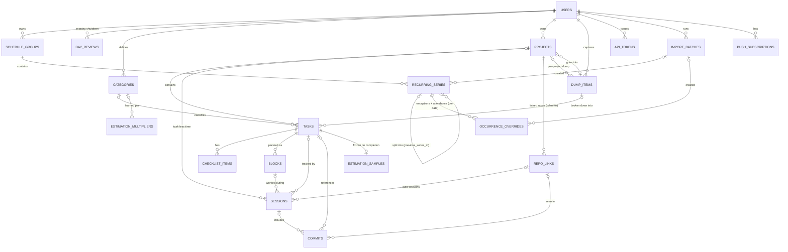
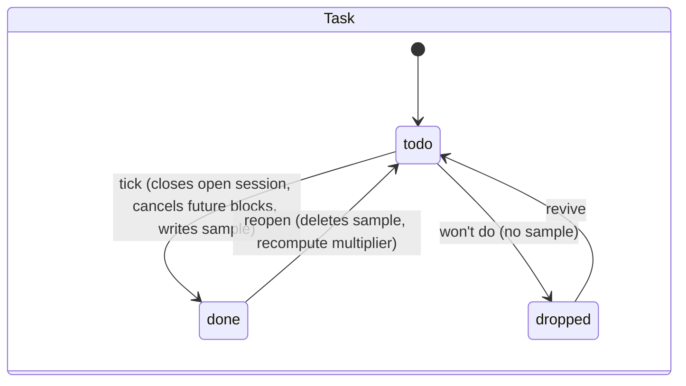
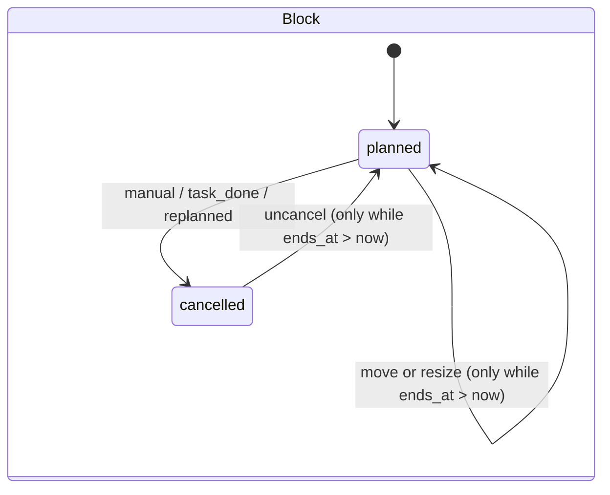

# 02 · Data Model

> Slice: full data model for the planner (schema, IDs, time, deletion semantics, derived values, state machines, migrations, tenancy).
> Written: 2026-10-05. Dialect assumed: **PostgreSQL 18** (works on 17 if you drop the `uuidv7()` defaults).
> Library versions were checked against the npm registry and vendor pages on 2026-10-05 (see §5.10).

---

## 1. TL;DR

- **Shape:** a normalised relational schema in Postgres with about 19 tables. Only four of them are needed for v0. The model has two calendar layers: **recurring series** (your fixed week, expanded on read) and **blocks** (one-off planned time, usually a task dragged onto the calendar). Actual time lives in **sessions**, which are separate from plans.
- **IDs:** **UUIDv7, generated by the client.** Offline creation, idempotent retries from the git hook and future cross-subdomain identity all need IDs that exist before the server sees the row. Rows with a natural key (one override per class per date) get a **deterministic UUIDv5**, so two offline devices cancelling the same class produce the same ID. Humans get a per-user **short task ref (`T-42`)** for commit trailers and branch names.
- **`user_id` on every row**, enforced through **composite foreign keys** `(user_id, x_id) → parent(user_id, id)`. A row can't point at another user's data even though Postgres FK checks bypass RLS. RLS stays on from the first migration as a second layer of defence.
- **Time follows three rules.** Moments are `timestamptz`. Calendar days are `date`. Repeating wall-clock times are `time` + IANA `tzid`. Recurring things are never stored in UTC.
- **Each removal verb means one thing.** A domain status (`done`, `dropped`, `cancelled`) says what happened. `archived_at` means hidden but intact, and an archived group keeps its history and attendance. `deleted_at` is a 30-day trash that cascades down the ownership tree and is purged later. "Delete" never quietly means "archive."
- **Most values are derived, not stored:** task totals, attendance ranges, "time back" gaps, task in-progress state, and what happens to a task after its block ends. A few are stored on purpose: lazily closed session ends (written on the next write), frozen estimates, estimation samples, and a recomputable multiplier cache.
- **Sessions:** at most **one open session per user** (partial unique index) and **no overlapping sessions** (a GiST exclusion constraint). The idle and cap policy is **frozen onto each row**, so changing settings later never rewrites history.
- **Attendance:** one `occurrence_overrides` row per touched class holds cancel, move and edit changes plus attendance confirmation. With `not_held | skipped` plus `attended_confirmed_at`, that is all D-005 and D-010 need to compute the attendance range.
- **Sync:** each user gets a revision counter bumped by trigger. The trigger holds that user's row lock until commit, which gives a gap-free pull cursor without a global sequence.
- **Tooling:** Drizzle ORM 0.45.x and drizzle-kit 0.31.x (stable). Migrations are generated SQL files, reviewed and committed. Custom SQL migrations cover what Drizzle can't express: the exclusion constraint, triggers, and `SET NULL (col)` foreign keys. Tests run on PGlite (Postgres 18.3 in process), and Testcontainers covers the concurrency tests.

---

## 2. Assumptions about other slices

Each assumption says what changes here if it turns out to be wrong.

| # | Slice | Assumption | If wrong |
|---|---|---|---|
| A1 | 01-recurrence | Rules are **expanded on read**, never pre-materialised forever. A rule produces **at most one occurrence per series per local date**, so no `BYHOUR`/`BYMINUTE`; the time comes from `start_time`. The rule is stored as an RFC 5545 RRULE body **without** DTSTART/UNTIL/COUNT, because bounds live in columns. "This and following" **splits** the series into a new row. | If 01 materialises occurrences, `occurrence_overrides` becomes an `occurrences` table with every row, and attendance becomes pure SQL. If 01 allows several occurrences per day, the override key becomes `(series_id, original_start_local)` instead of `(series_id, occurrence_date)`. |
| A2 | 03-backend | A TypeScript/Node API (Hono or Fastify class) is the only writer to Postgres. Clients never connect to the database directly, and API DTOs are decoupled from table shapes. | If clients talk to the DB through a sync engine, RLS is no longer defence-in-depth but the *only* line of defence, and it needs a harder review. |
| A3 | 04-database-and-sync | **Postgres** is the single source of truth. Sync is server-authoritative: idempotent pushes keyed by client UUIDs, plus delta pulls by a per-user `rev` cursor. No CRDT documents. | If 04 adopts a replication-based sync engine (Electric/Zero/PowerSync), `rev` and the touch trigger are unnecessary but harmless. Client IDs and tombstones are still exactly right. |
| A4 | 05-sessions-and-realtime | 05 owns heartbeat semantics: gap threshold, attach-or-create, which client wins. This slice only provides columns and invariants: one open session per user, no overlap, `last_seen_at`, and a per-row idle and cap policy. | If 05 wants parallel sessions (for example a manual timer plus an editor session at once), drop the exclusion constraint and the open-session index, and accept double counting in totals. |
| A5 | 06-auth-and-identity | 06 owns credential, OAuth and web-session tables. They reference `users.id`. **`users.id` (UUIDv7) becomes the future global identity across `*.ahmedatif.in`**, which means the identity service adopts these IDs instead of minting new ones. Integration credentials are personal access tokens stored hashed in `api_tokens`. | If 06 introduces an external IdP that issues its own subject IDs, add `users.idp_subject text UNIQUE`. Nothing else changes. |
| A6 | 07-infra | Postgres 18 with `citext` and `btree_gist` (Neon defaults new projects to PG18; Supabase was still on 17 at last check). S3-compatible object storage holds voice clips. A daily job runner exists for purging and reminders. | On PG17, remove `DEFAULT uuidv7()`; the app always supplies IDs anyway. With no job runner, the purge runs lazily on login. |
| A7 | 08-integrations | The `.planner` file contains a **repo link ID** (not a project ID). The git hook sends `sha`, `subject`, timestamps, branch, `remote_url` and `root_commit_sha` as identity hints. Commit→task mapping uses the `T-42` short ref (trailer or branch) with the active session as fallback. | If 08 uses project IDs in `.planner`, `repo_links` loses its indirection, and re-pointing a repo means editing a file in every clone. |
| A8 | 09-frontend | The client generates UUIDv7 IDs, uses Temporal (native in Chrome 144+, Firefox 139+ and Node 26; polyfill on Safari), and mirrors these tables in IndexedDB. | Nothing here breaks. Only the client cache shape changes. |
| A9 | 10-scheduling | The estimation multiplier is an EWMA-style step per category, recomputed from immutable samples. "Time back" gaps are computed on read. | If 10 wants a per-project multiplier, `category_id` is swapped for `project_id` in two tables. |
| A10 | 11-capture | Voice transcription may happen on the client or the server. Keeping audio is optional. | Columns are nullable either way. |
| A11 | 12-ux-flows | The UI exposes cancel, archive and delete as three distinct verbs. The evening shutdown writes per-class confirmations. Trash keeps items for 30 days. | If UX merges delete into archive, `deleted_at` is still used for sync tombstones. |
| A12 | 13-build-plan | Migrations land in roadmap order v0 → v3 as additive steps (see §5.11). | Order only. |

---

## 3. Three genuinely different approaches

| Approach | Pros | Cons | Solo-dev effort | Interview value |
|---|---|---|---|---|
| **A. Normalised relational, state-based** (Postgres tables per entity, rules expanded on read, derived values via queries, client UUIDs and tombstones for sync) | Constraints enforce the invariants that matter: one open session, no overlap, no cross-tenant links. Ad-hoc analytics are plain SQL. Every tutorial and ORM fits. Easy to explain on a whiteboard. Git-hook and VS Code writes are simple upserts. | History is overwritten unless you design for it. Offline needs deliberate work (client IDs, tombstones, rev cursor). Recurrence expansion lives in app code, so attendance isn't pure SQL. | **Low–medium.** About 19 tables, 4 needed for v0. | **High** if you can defend the details (composite FKs vs RLS, exclusion constraints, per-user rev, time rules). "Boring and correct" interviews well. |
| **B. Document / local-first** (each user's planner is a handful of documents, either JSONB or a CRDT doc such as Automerge or Yjs, synced whole or as patches; the server stores blobs) | Offline-first works by construction. Very fast UI. The server stays tiny. Undo and multi-device merges come with the CRDT. | Server-side writers (git hook, VS Code, Claude Code) must load, merge and save a CRDT on every heartbeat. Cross-document invariants such as "one open session" or "no overlap" can't be enforced, only repaired. Analytics like attendance and multipliers need full document loads. Schema evolution means migrating documents in the wild. | **High.** CRDT semantics, compaction, and server-side merge for integrations. | **Medium–high.** Trendy, but harder to defend why a planner with three server-side integrations needs it. |
| **C. Event-sourced** (an append-only `events` table with types like `TaskCreated`, `BlockPlanned`, `SessionStarted`, `HeartbeatBatch`, `OccurrenceCancelled`, `DayConfirmed`, and projections as read models) | Perfect history: "what did my plan look like on Monday", plan vs actual over time, and undo. Sync is just "send me events after N". Fits the JOURNEY ethos and the estimation-as-training-loop story. | You build two systems (log plus projections). Events need versioning and upcasting forever. Invariants live in command handlers with optimistic concurrency. Rebuilds, snapshots and eventual consistency are easy to get subtly wrong. Debugging means replaying. | **Very high** for a solo student. The projection layer alone is weeks. | **Very high**, but only if finished. A half-built event store is a negative signal. |

**Prose.** These approaches differ in where the truth lives. In **A** the truth is current state, and history exists only where it was deliberately modelled. In **B** the truth is a mergeable document on each device, and the server is mostly a relay. In **C** the truth is the sequence of things that happened, and current state is a cache.

The planner has three properties that pull in different directions:

1. It is a *personal history* product: time spent, attendance, estimation accuracy. That favours C.
2. It needs *offline capture* on flaky campus Wi-Fi. That favours B or C.
3. It has *several non-browser writers* (git hook, VS Code, Claude Code) that must apply small, validated writes server-side, with invariants like "only one timer runs". That strongly favours A.

The third property is the deciding one. With B, integrations become hard. With C, everything becomes hard.

---

## 4. Recommendation

**Choose A (normalised relational, state-based), and borrow two ideas from the other approaches:**

- **From C, append-only facts where history matters, and nowhere else.**
  - Sessions are facts.
  - Blocks whose end time has passed are immutable except for cancellation.
  - Estimation samples are frozen at completion.
  - Occurrence overrides are keyed by date and never re-keyed.
  - Imports are batches that can be undone.
  - A per-user `rev` counter gives you a change feed without an event store.
- **From B, client-generated IDs and tombstones,** so offline creation and idempotent retries work from day one, plus fractional `sort_key`s, so reordering offline never renumbers siblings.

This model can be finished by a solo student in the v0–v3 roadmap. It explains cleanly ("these are the three time rules, these are the three deletion verbs, these four constraints make the timer correct"). It also leaves an obvious upgrade path if history becomes more important.

### The strongest argument against it (steelman)

> "Your product's real output is *history*. 'How much time did I give this?' 'What's my attendance?' 'How wrong are my estimates?' 'Did I do what I planned?' A state-based schema stores only the latest truth.
>
> - Edit a session's end time and the original is gone.
> - Move a task to another project and every past session silently changes which project it 'belonged to'.
> - Re-plan a block and the plan you abandoned disappears, which kills the 'how often do I push this task' insight.
>
> Meanwhile you have offline phones, three integration clients writing concurrently, and you are *already* building a `rev` change feed and tombstones. That is half an event log, without the replay, audit and time-travel benefits. Building the log first would make sync, undo, history and the 'Journey' story all fall out of one mechanism instead of four ad-hoc ones."

This is a real argument. The answer is that the history this app needs is narrow and already covered. Sessions are append-mostly, past blocks are immutable, samples are frozen, and overrides are stable. The remaining mutations are *user corrections*, which you *want* to overwrite: a timer you forgot to stop is not history worth keeping.

### When I would switch

Add an append-only `row_history` table, filled by an `AFTER UPDATE OR DELETE` trigger that stores `old` as JSONB, for specific tables, **not** a full event-sourcing rewrite. Do this if any of these become true:

- (a) 04 picks a sync engine that requires a mutation log (Replicache or Zero-style push of named mutators). In that case store the mutators.
- (b) Three or more features need "as of date X" queries, such as plan-as-of-Monday or project-membership-as-of.
- (c) A real undo-history feature becomes a priority.

Move to full C only if the app becomes multi-user collaborative, which D-001 rules out.

---

## 5. Implementation walkthrough

### 5.1 Conventions that every table follows

**IDs.**

- Every syncable table has `id uuid PRIMARY KEY`, **generated by the client as UUIDv7** (RFC 9562).
- Why UUIDv7:
  - The client can create a task, a block for it and a session on it while offline, all referencing each other with no ID remapping.
  - A retried POST from the git hook with the same ID is naturally idempotent.
  - The time-ordered prefix keeps B-tree inserts at the right-hand edge, unlike v4.
  - IDs are globally unique, which a future shared identity across `*.ahmedatif.in` needs, and so would merging data between apps.
- Rejected alternatives:
  - **Serial:** can't be allocated offline, is enumerable, and collides across databases.
  - **ULID:** equivalent ordering, but a non-standard text form, and Postgres has no native type or function for it (PG18 ships `uuidv7()`).
  - **Server-only UUIDs:** break offline creation.
- **Rule: never treat the ID's embedded timestamp as `created_at`.** A phone with a wrong clock produces valid IDs with wrong times.
- **Server rule:** an upsert must never let a client overwrite another user's row by guessing its ID. `ON CONFLICT (id) DO UPDATE … WHERE t.user_id = EXCLUDED.user_id`, and RLS's `WITH CHECK`, both block it (test E11).
- **Deterministic IDs for natural keys.** `occurrence_overrides.id = uuidv5(name = occurrence_date, namespace = series_id)`. Two offline devices cancelling Monday's DSA class produce the same ID, so sync merges instead of conflicting on the unique key.
- **Human refs.** `tasks.short_ref` is a per-user integer (`T-42`) allocated by the server on insert. An offline-created task shows `T-?` until it syncs. This makes commit trailers (`Planner-Task: T-42`) and branch names (`t42-fix-login`) practical, and feeds §7's "how are commits mapped to tasks".

**`user_id` on every row.** It is denormalised even where it could be derived through a parent. Every parent exposes `UNIQUE (user_id, id)`, and every child references `(user_id, parent_id)`. This matters because **Postgres foreign key checks bypass RLS**. With single-column FKs, a malicious client could link its session to another user's task ID, and the FK error would also confirm that ID exists. Composite FKs close that hole structurally. The cost is 16 bytes per row and wider indexes, which is trivial at this scale.

Nullable composite FKs use **`ON DELETE SET NULL (col)`** (PG15+). Plain `SET NULL` would also null `user_id` and fail. Drizzle can't express the column list, so those FKs go in a custom migration.

**Time: three rules.**

1. **A moment is `timestamptz`.** Session start and end, block start and end, `created_at`, a precise deadline (`due_at`), a moved occurrence's new time.
2. **A calendar day is `date`.** `due_on`, group `active_from`/`active_until`, series `starts_on`/`ends_on`, `occurrence_date`, `day_reviews.local_date`.
3. **A repeating wall-clock time is `time` + `tzid`.** A series stores `start_time time`, `duration_min int` and `tzid text`.

Why rule 3 matters: "Run, daily 18:00, Europe/Berlin" stored in UTC would drift by an hour on 25 October 2026. India has no DST, but the app is meant for anyone. Duration is in minutes rather than an end time, so a 23:00–01:00 slot never has `end < start`.

`users.tzid` is the default for new series and blocks, and each series keeps its own `tzid` (a class happens in Bhubaneswar even if you fly to London). "Today" is computed with `users.day_boundary` (default 04:00). A 01:30 coding session then belongs to the evening that started it, which is what the evening shutdown and daily totals expect.

IANA zone names are validated in the app against `Intl.supportedValuesOf('timeZone')`. A CHECK can't call a non-immutable lookup.

**Standard columns on syncable tables:** `created_at`, `updated_at`, `deleted_at` (tombstone), `rev bigint` (from the per-user counter). Server-only tables (`api_tokens`, `estimation_*`, `push_subscriptions`, `import_batches`) skip `rev` and `deleted_at`.

**Enums are `text` + CHECK, not `CREATE TYPE … AS ENUM`.** Adding a value is easy either way. *Removing or renaming* a native enum value is painful, while CHECK constraints are swapped in one migration.

**Ordering** uses fractional-index strings (`sort_key text COLLATE "C"`). The `"C"` collation is required: fractional keys are case-sensitive base-62, and a locale collation sorts them in the wrong order.

**Deletion semantics:**

| Entity | Domain end-state | Archive | Trash (`deleted_at`) | Physical delete |
|---|---|---|---|---|
| `schedule_groups` | — | `archived_at`: hidden from pickers and conflict checks. **Archiving clamps `active_until`** (CHECK enforced). Past occurrences, overrides and attendance stay. | Allowed with a loud warning (attendance history goes too) | Purge after 30 days |
| `recurring_series` | `ends_on` set (series ended or split) | via group | yes | purge |
| `occurrence_overrides` | revert = clear fields (row stays) | — | only for import undo | purge |
| `projects` | — | `archived_at` | Cascades to tasks, checklist, blocks and sessions **with the same timestamp**. Dump items move to the general dump (a thought is never silently lost). Commits are unlinked. | purge |
| `tasks` | `done`, `dropped` | none (done tasks older than 7 days are hidden by query) | cascades to checklist, blocks, sessions | purge |
| `blocks` | `cancelled` (+ reason) | — | yes ("that was a mistake") | purge |
| `sessions` | ended | — | yes (bogus session) | purge |
| `dump_items` | `processed`, `discarded` | — | yes | purge |
| `commits` | — | — | unlink only | with the user |
| `api_tokens` | `revoked_at` | — | — | 90 days after revoke |
| `users` | — | — | `deletion_requested_at` (7-day grace) | hard cascade (right to erasure; India's DPDP Act 2023) |

**Restore** brings back children whose `deleted_at` equals the parent's `deleted_at`. Items you trashed individually earlier stay trashed.

### 5.2 Entity-relationship diagram



**Cardinalities worth stating:**

- **Nesting depth: project → task → checklist item.** Checklist items are not tasks: no timers, blocks or sessions. "Which part of the task I did" goes in session notes, as the original idea describes. Projects are one level deep (no sub-projects).
- **Project and task.** A task belongs to at most one project. `NULL` means the misc todo list.
- **Task and blocks.** A task has 0..N blocks (plan an hour on Monday and two on Wednesday).
- **Sessions.** A session belongs to a task, *or* a project (an auto session before you pick a task), *or* neither (unassigned, to be sorted at shutdown). It is never both. That means **moving a task to another project moves its time with it**, with no drift.
- **Commits.** A commit links to at most one session and at most one task. It is unique per user by SHA, so forks that share history don't duplicate it.
- **Dump items.** A dump item can turn into 0..N tasks or projects (`source_dump_item_id` on the child). That is the "break down later" flow.
- **Groups, series, overrides.** A group has 0..N series. A series has 0..1 override per date.

### 5.3 Full DDL (PostgreSQL 18)

Comments mark the roadmap milestone that introduces each table. The script shows the final v3 state. In practice it lands as additive migrations (§5.11).

```sql
-- ============================================================
-- Extensions and helpers                                  [v0]
-- ============================================================
CREATE EXTENSION IF NOT EXISTS citext;
CREATE EXTENSION IF NOT EXISTS btree_gist;   -- uuid "=" inside GiST exclusion constraints

-- ============================================================
-- users                                                   [v0]
-- ============================================================
CREATE TABLE users (
  id                    uuid PRIMARY KEY DEFAULT uuidv7(),   -- PG18; app normally supplies it
  email                 citext NOT NULL UNIQUE,
  display_name          text   NOT NULL CHECK (length(display_name) BETWEEN 1 AND 80),
  tzid                  text   NOT NULL,                    -- IANA, validated in app
  day_boundary          time   NOT NULL DEFAULT '04:00',    -- "today" starts here (local)
  week_start            smallint NOT NULL DEFAULT 1 CHECK (week_start BETWEEN 1 AND 7), -- ISO, 1 = Mon
  idle_timeout_s        integer  NOT NULL DEFAULT 900   CHECK (idle_timeout_s BETWEEN 120 AND 7200),
  timer_cap_s           integer  NOT NULL DEFAULT 43200 CHECK (timer_cap_s BETWEEN 600 AND 86400),
  next_task_ref         integer  NOT NULL DEFAULT 1 CHECK (next_task_ref >= 1),
  rev                   bigint   NOT NULL DEFAULT 0,        -- per-user change counter (sync cursor)
  settings              jsonb    NOT NULL DEFAULT '{}'::jsonb,  -- UI-only prefs; nothing the server computes on
  created_at            timestamptz NOT NULL DEFAULT now(),
  updated_at            timestamptz NOT NULL DEFAULT now(),
  deletion_requested_at timestamptz
);

-- Every write to a syncable row bumps the owner's rev. The UPDATE takes the user's row lock
-- until commit, so per-user revs become visible in commit order (no gaps for a pull cursor).
CREATE FUNCTION touch_row() RETURNS trigger LANGUAGE plpgsql AS $$
BEGIN
  IF TG_OP = 'UPDATE' AND NEW IS NOT DISTINCT FROM OLD THEN
    RETURN OLD;                                   -- no-op update: don't bump rev
  END IF;
  UPDATE users SET rev = rev + 1 WHERE id = NEW.user_id RETURNING rev INTO NEW.rev;
  NEW.updated_at := now();
  RETURN NEW;
END $$;

-- ============================================================
-- import_batches  (D-008 timetable import, holiday bulk-cancel; undo)   [v2]
-- ============================================================
CREATE TABLE import_batches (
  id          uuid PRIMARY KEY DEFAULT uuidv7(),
  user_id     uuid NOT NULL REFERENCES users(id) ON DELETE CASCADE,
  kind        text NOT NULL CHECK (kind IN ('timetable','holidays')),
  payload     jsonb NOT NULL,                      -- the validated, previewed import document
  status      text NOT NULL DEFAULT 'previewed' CHECK (status IN ('previewed','applied','reverted')),
  applied_at  timestamptz,
  reverted_at timestamptz,
  created_at  timestamptz NOT NULL DEFAULT now(),
  UNIQUE (user_id, id),
  CHECK ((status = 'previewed') = (applied_at IS NULL)),
  CHECK ((status = 'reverted')  = (reverted_at IS NOT NULL))
);

-- ============================================================
-- schedule_groups  (D-004)                                [v0]
-- ============================================================
CREATE TABLE schedule_groups (
  id                     uuid PRIMARY KEY DEFAULT uuidv7(),
  user_id                uuid NOT NULL REFERENCES users(id) ON DELETE CASCADE,
  name                   text NOT NULL CHECK (length(name) BETWEEN 1 AND 60),
  color                  text NOT NULL,              -- palette token ('teal'), not hex: themes can remap
  active_from            date NOT NULL,
  active_until           date,                       -- inclusive; NULL = open-ended
  attendance_enabled     boolean NOT NULL DEFAULT false,
  attendance_target_pct  smallint CHECK (attendance_target_pct BETWEEN 1 AND 100),  -- e.g. 75 at KIIT
  sort_key               text COLLATE "C" NOT NULL,
  import_batch_id        uuid,
  archived_at            timestamptz,
  created_at             timestamptz NOT NULL DEFAULT now(),
  updated_at             timestamptz NOT NULL DEFAULT now(),
  deleted_at             timestamptz,
  rev                    bigint NOT NULL DEFAULT 0,
  UNIQUE (user_id, id),
  FOREIGN KEY (user_id, import_batch_id) REFERENCES import_batches(user_id, id)
    ON DELETE SET NULL (import_batch_id),
  CHECK (active_until IS NULL OR active_until >= active_from),
  CHECK (archived_at IS NULL OR active_until IS NOT NULL)   -- archiving clamps the range
);
CREATE INDEX schedule_groups_live_idx ON schedule_groups (user_id, sort_key)
  WHERE deleted_at IS NULL;

-- ============================================================
-- recurring_series                                        [v0]
-- ============================================================
CREATE TABLE recurring_series (
  id                  uuid PRIMARY KEY DEFAULT uuidv7(),
  user_id             uuid NOT NULL REFERENCES users(id) ON DELETE CASCADE,
  group_id            uuid NOT NULL,
  title               text NOT NULL CHECK (length(title) BETWEEN 1 AND 120),
  location            text CHECK (length(location) <= 120),
  notes               text,
  tzid                text NOT NULL,                  -- wall-clock zone for this series
  starts_on           date NOT NULL,                  -- first eligible local date
  ends_on             date,                           -- inclusive; NULL = until the group ends
  start_time          time NOT NULL,                  -- local wall-clock start
  duration_min        integer NOT NULL CHECK (duration_min BETWEEN 5 AND 1440),
  rrule               text,                           -- RRULE body; NULL = single occurrence on starts_on
  previous_series_id  uuid,                           -- lineage after a "this and following" split
  import_batch_id     uuid,
  created_at          timestamptz NOT NULL DEFAULT now(),
  updated_at          timestamptz NOT NULL DEFAULT now(),
  deleted_at          timestamptz,
  rev                 bigint NOT NULL DEFAULT 0,
  UNIQUE (user_id, id),
  FOREIGN KEY (user_id, group_id) REFERENCES schedule_groups(user_id, id) ON DELETE CASCADE,
  FOREIGN KEY (user_id, previous_series_id) REFERENCES recurring_series(user_id, id)
    ON DELETE SET NULL (previous_series_id),
  FOREIGN KEY (user_id, import_batch_id) REFERENCES import_batches(user_id, id)
    ON DELETE SET NULL (import_batch_id),
  CHECK (ends_on IS NULL OR ends_on >= starts_on),
  CHECK (rrule IS NOT NULL OR ends_on IS NOT DISTINCT FROM starts_on),  -- plain "=" passes on NULL
  CHECK (rrule IS NULL OR (rrule ~ '^FREQ=(DAILY|WEEKLY|MONTHLY)'
                           AND rrule !~ '(UNTIL|COUNT|DTSTART|BYHOUR|BYMINUTE|BYSECOND)'))
);
CREATE INDEX recurring_series_group_idx ON recurring_series (user_id, group_id)
  WHERE deleted_at IS NULL;

-- ============================================================
-- occurrence_overrides  (cancel / move / edit / attendance)   [v0; attendance column v2]
-- id = uuidv5(occurrence_date, namespace = series_id), so it is deterministic across devices
-- ============================================================
CREATE TABLE occurrence_overrides (
  id                     uuid PRIMARY KEY,
  user_id                uuid NOT NULL REFERENCES users(id) ON DELETE CASCADE,
  series_id              uuid NOT NULL,
  occurrence_date        date NOT NULL,              -- the local date the rule generated (RECURRENCE-ID)
  cancelled_at           timestamptz,
  cancel_reason          text CHECK (cancel_reason IN ('not_held','skipped')),
                                                     -- not_held = prof cancelled / holiday; skipped = I didn't go
  cancel_note            text CHECK (length(cancel_note) <= 200),   -- "Prof away", "Diwali"
  moved_starts_at        timestamptz,
  moved_ends_at          timestamptz,
  title_override         text CHECK (length(title_override) <= 120),
  location_override      text CHECK (length(location_override) <= 120),
  note                   text,
  attended_confirmed_at  timestamptz,               -- D-010: confirmed "went" at shutdown
  import_batch_id        uuid,
  created_at             timestamptz NOT NULL DEFAULT now(),
  updated_at             timestamptz NOT NULL DEFAULT now(),
  deleted_at             timestamptz,
  rev                    bigint NOT NULL DEFAULT 0,
  UNIQUE (user_id, id),
  UNIQUE (series_id, occurrence_date),
  FOREIGN KEY (user_id, series_id) REFERENCES recurring_series(user_id, id) ON DELETE CASCADE,
  FOREIGN KEY (user_id, import_batch_id) REFERENCES import_batches(user_id, id)
    ON DELETE SET NULL (import_batch_id),
  CHECK ((cancelled_at IS NULL) = (cancel_reason IS NULL)),
  CHECK ((moved_starts_at IS NULL) = (moved_ends_at IS NULL)),
  CHECK (moved_ends_at IS NULL OR (moved_ends_at > moved_starts_at
                                   AND moved_ends_at - moved_starts_at <= interval '24 hours')),
  CHECK (attended_confirmed_at IS NULL OR cancelled_at IS NULL)
);
CREATE INDEX occurrence_overrides_date_idx ON occurrence_overrides (user_id, occurrence_date)
  WHERE deleted_at IS NULL;
CREATE INDEX occurrence_overrides_moved_idx ON occurrence_overrides (user_id, moved_starts_at)
  WHERE moved_starts_at IS NOT NULL AND deleted_at IS NULL;

-- ============================================================
-- day_reviews  (evening shutdown ritual done for a local date)   [v2]
-- ============================================================
CREATE TABLE day_reviews (
  id          uuid PRIMARY KEY,                      -- uuidv5(local_date, namespace = user_id)
  user_id     uuid NOT NULL REFERENCES users(id) ON DELETE CASCADE,
  local_date  date NOT NULL,
  reviewed_at timestamptz NOT NULL,
  created_at  timestamptz NOT NULL DEFAULT now(),
  updated_at  timestamptz NOT NULL DEFAULT now(),
  deleted_at  timestamptz,
  rev         bigint NOT NULL DEFAULT 0,
  UNIQUE (user_id, local_date)
);

-- ============================================================
-- categories  (estimation multiplier buckets)             [v2]
-- ============================================================
CREATE TABLE categories (
  id          uuid PRIMARY KEY DEFAULT uuidv7(),
  user_id     uuid NOT NULL REFERENCES users(id) ON DELETE CASCADE,
  name        text NOT NULL CHECK (length(name) BETWEEN 1 AND 40),
  color       text NOT NULL,
  created_at  timestamptz NOT NULL DEFAULT now(),
  updated_at  timestamptz NOT NULL DEFAULT now(),
  deleted_at  timestamptz,
  rev         bigint NOT NULL DEFAULT 0,
  UNIQUE (user_id, id)
);
CREATE UNIQUE INDEX categories_name_uq ON categories (user_id, lower(name)) WHERE deleted_at IS NULL;

-- ============================================================
-- projects                                                [v1]
-- ============================================================
CREATE TABLE projects (
  id                   uuid PRIMARY KEY DEFAULT uuidv7(),
  user_id              uuid NOT NULL REFERENCES users(id) ON DELETE CASCADE,
  name                 text NOT NULL CHECK (length(name) BETWEEN 1 AND 80),
  description          text,
  color                text NOT NULL,
  default_category_id  uuid,
  source_dump_item_id  uuid,                         -- FK added after dump_items exists
  sort_key             text COLLATE "C" NOT NULL,
  archived_at          timestamptz,
  created_at           timestamptz NOT NULL DEFAULT now(),
  updated_at           timestamptz NOT NULL DEFAULT now(),
  deleted_at           timestamptz,
  rev                  bigint NOT NULL DEFAULT 0,
  UNIQUE (user_id, id),
  FOREIGN KEY (user_id, default_category_id) REFERENCES categories(user_id, id)
    ON DELETE SET NULL (default_category_id)
);
-- Unique among *active* projects, so the name-match fallback for repos is deterministic.
CREATE UNIQUE INDEX projects_active_name_uq ON projects (user_id, lower(name))
  WHERE archived_at IS NULL AND deleted_at IS NULL;

-- ============================================================
-- dump_items  (thought dump)                              [v1]
-- ============================================================
CREATE TABLE dump_items (
  id                 uuid PRIMARY KEY DEFAULT uuidv7(),
  user_id            uuid NOT NULL REFERENCES users(id) ON DELETE CASCADE,
  project_id         uuid,                           -- NULL = general dump
  kind               text NOT NULL CHECK (kind IN ('text','voice')),
  body               text CHECK (length(body) <= 20000),   -- text, or the transcript for voice
  audio_key          text,                           -- object-storage key
  audio_mime         text,
  audio_ms           integer CHECK (audio_ms BETWEEN 0 AND 600000),
  transcript_status  text NOT NULL DEFAULT 'none'
                     CHECK (transcript_status IN ('none','pending','done','failed')),
  status             text NOT NULL DEFAULT 'open' CHECK (status IN ('open','processed','discarded')),
  closed_at          timestamptz,
  touched_at         timestamptz NOT NULL DEFAULT now(),  -- aging is measured from here
  created_at         timestamptz NOT NULL DEFAULT now(),
  updated_at         timestamptz NOT NULL DEFAULT now(),
  deleted_at         timestamptz,
  rev                bigint NOT NULL DEFAULT 0,
  UNIQUE (user_id, id),
  FOREIGN KEY (user_id, project_id) REFERENCES projects(user_id, id) ON DELETE SET NULL (project_id),
  CHECK (kind = 'voice' OR (body IS NOT NULL AND audio_key IS NULL)),
  CHECK (kind = 'text'  OR audio_key IS NOT NULL OR body IS NOT NULL),
  CHECK ((audio_key IS NULL) = (audio_mime IS NULL)),
  CHECK ((status = 'open') = (closed_at IS NULL))
);
CREATE INDEX dump_items_inbox_idx ON dump_items (user_id, status, touched_at)
  WHERE deleted_at IS NULL;

ALTER TABLE projects ADD FOREIGN KEY (user_id, source_dump_item_id)
  REFERENCES dump_items(user_id, id) ON DELETE SET NULL (source_dump_item_id);

-- ============================================================
-- tasks                                                   [v1; category/estimate columns v2]
-- ============================================================
CREATE TABLE tasks (
  id                   uuid PRIMARY KEY DEFAULT uuidv7(),
  user_id              uuid NOT NULL REFERENCES users(id) ON DELETE CASCADE,
  short_ref            integer NOT NULL,              -- T-42, assigned by trigger
  project_id           uuid,                          -- NULL = misc todo list
  category_id          uuid,
  title                text NOT NULL CHECK (length(title) BETWEEN 1 AND 300),
  notes                text,
  status               text NOT NULL DEFAULT 'todo' CHECK (status IN ('todo','done','dropped')),
  closed_at            timestamptz,
  due_on               date,                          -- "due Friday"
  due_at               timestamptz,                   -- "due Friday 23:59 IST"
  estimate_min         integer CHECK (estimate_min BETWEEN 1 AND 10000),
  estimate_frozen_min  integer CHECK (estimate_frozen_min BETWEEN 1 AND 10000), -- set at first session
  source_dump_item_id  uuid,
  sort_key             text COLLATE "C" NOT NULL,
  created_at           timestamptz NOT NULL DEFAULT now(),
  updated_at           timestamptz NOT NULL DEFAULT now(),
  deleted_at           timestamptz,
  rev                  bigint NOT NULL DEFAULT 0,
  UNIQUE (user_id, id),
  UNIQUE (user_id, short_ref),
  FOREIGN KEY (user_id, project_id) REFERENCES projects(user_id, id) ON DELETE CASCADE,
  FOREIGN KEY (user_id, category_id) REFERENCES categories(user_id, id) ON DELETE SET NULL (category_id),
  FOREIGN KEY (user_id, source_dump_item_id) REFERENCES dump_items(user_id, id)
    ON DELETE SET NULL (source_dump_item_id),
  CHECK ((status = 'todo') = (closed_at IS NULL)),
  CHECK (num_nonnulls(due_on, due_at) <= 1)
);
CREATE INDEX tasks_list_idx ON tasks (user_id, project_id, status, sort_key) WHERE deleted_at IS NULL;
CREATE INDEX tasks_due_on_idx ON tasks (user_id, due_on) WHERE due_on IS NOT NULL AND status = 'todo' AND deleted_at IS NULL;
CREATE INDEX tasks_due_at_idx ON tasks (user_id, due_at) WHERE due_at IS NOT NULL AND status = 'todo' AND deleted_at IS NULL;

CREATE FUNCTION assign_task_ref() RETURNS trigger LANGUAGE plpgsql AS $$
BEGIN
  UPDATE users SET next_task_ref = next_task_ref + 1
   WHERE id = NEW.user_id
  RETURNING next_task_ref - 1 INTO NEW.short_ref;
  RETURN NEW;
END $$;
CREATE TRIGGER tasks_assign_ref BEFORE INSERT ON tasks
  FOR EACH ROW EXECUTE FUNCTION assign_task_ref();

-- ============================================================
-- checklist_items  (subtasks: no timers, no blocks)       [v1]
-- ============================================================
CREATE TABLE checklist_items (
  id          uuid PRIMARY KEY DEFAULT uuidv7(),
  user_id     uuid NOT NULL REFERENCES users(id) ON DELETE CASCADE,
  task_id     uuid NOT NULL,
  text        text NOT NULL CHECK (length(text) BETWEEN 1 AND 300),
  done_at     timestamptz,
  sort_key    text COLLATE "C" NOT NULL,
  created_at  timestamptz NOT NULL DEFAULT now(),
  updated_at  timestamptz NOT NULL DEFAULT now(),
  deleted_at  timestamptz,
  rev         bigint NOT NULL DEFAULT 0,
  FOREIGN KEY (user_id, task_id) REFERENCES tasks(user_id, id) ON DELETE CASCADE
);
CREATE INDEX checklist_items_task_idx ON checklist_items (task_id, sort_key) WHERE deleted_at IS NULL;

-- ============================================================
-- blocks  (one-off planned time; usually a dragged task)  [v1]
-- ============================================================
CREATE TABLE blocks (
  id             uuid PRIMARY KEY DEFAULT uuidv7(),
  user_id        uuid NOT NULL REFERENCES users(id) ON DELETE CASCADE,
  task_id        uuid,                                -- NULL = personal one-off ("Dentist")
  title          text CHECK (length(title) <= 120),
  starts_at      timestamptz NOT NULL,
  ends_at        timestamptz NOT NULL,
  tzid           text NOT NULL,                       -- zone it was planned in (display)
  status         text NOT NULL DEFAULT 'planned' CHECK (status IN ('planned','cancelled')),
  cancel_reason  text CHECK (cancel_reason IN ('manual','task_done','replanned')),
  source         text NOT NULL DEFAULT 'manual'
                 CHECK (source IN ('manual','drag','time_back','quick_add','import')),
  note           text,
  created_at     timestamptz NOT NULL DEFAULT now(),
  updated_at     timestamptz NOT NULL DEFAULT now(),
  deleted_at     timestamptz,
  rev            bigint NOT NULL DEFAULT 0,
  UNIQUE (user_id, id),
  FOREIGN KEY (user_id, task_id) REFERENCES tasks(user_id, id) ON DELETE CASCADE,
  CHECK (ends_at > starts_at AND ends_at - starts_at <= interval '24 hours'),
  CHECK (task_id IS NOT NULL OR title IS NOT NULL),
  CHECK ((status = 'cancelled') = (cancel_reason IS NOT NULL))
);
CREATE INDEX blocks_window_idx ON blocks (user_id, starts_at) WHERE deleted_at IS NULL;
CREATE INDEX blocks_task_idx   ON blocks (task_id, starts_at) WHERE deleted_at IS NULL;

-- ============================================================
-- repo_links  (the `.planner` file points here)           [v3]
-- ============================================================
CREATE TABLE repo_links (
  id               uuid PRIMARY KEY DEFAULT uuidv7(),  -- written into .planner
  user_id          uuid NOT NULL REFERENCES users(id) ON DELETE CASCADE,
  project_id       uuid NOT NULL,
  default_task_id  uuid,
  label            text NOT NULL CHECK (length(label) BETWEEN 1 AND 120), -- folder name at link time
  remote_url       text,                              -- normalised: 'github.com/atif/planner'
  root_commit_sha  text CHECK (root_commit_sha ~ '^[0-9a-f]{40}([0-9a-f]{24})?$'),
  auto_sessions    boolean NOT NULL DEFAULT true,
  last_seen_at     timestamptz,
  created_at       timestamptz NOT NULL DEFAULT now(),
  updated_at       timestamptz NOT NULL DEFAULT now(),
  deleted_at       timestamptz,
  rev              bigint NOT NULL DEFAULT 0,
  UNIQUE (user_id, id),
  FOREIGN KEY (user_id, project_id) REFERENCES projects(user_id, id) ON DELETE CASCADE,
  FOREIGN KEY (user_id, default_task_id) REFERENCES tasks(user_id, id)
    ON DELETE SET NULL (default_task_id)
);
CREATE INDEX repo_links_remote_idx ON repo_links (user_id, remote_url) WHERE deleted_at IS NULL;
CREATE INDEX repo_links_root_idx   ON repo_links (user_id, root_commit_sha) WHERE deleted_at IS NULL;

-- ============================================================
-- sessions  (actual tracked time)                         [v1; repo_link_id v3]
-- ============================================================
CREATE TABLE sessions (
  id              uuid PRIMARY KEY DEFAULT uuidv7(),
  user_id         uuid NOT NULL REFERENCES users(id) ON DELETE CASCADE,
  task_id         uuid,
  project_id      uuid,                               -- only when task_id IS NULL
  block_id        uuid,
  repo_link_id    uuid,
  source          text NOT NULL
                  CHECK (source IN ('timer','manual','git','vscode','claude_code','import')),
  started_at      timestamptz NOT NULL,
  ended_at        timestamptz,                        -- NULL = open (possibly stale: see effective end)
  last_seen_at    timestamptz NOT NULL,
  idle_timeout_s  integer CHECK (idle_timeout_s BETWEEN 60 AND 7200),  -- frozen at start; NULL = manual timer
  max_duration_s  integer NOT NULL CHECK (max_duration_s BETWEEN 60 AND 86400), -- frozen at start
  end_reason      text CHECK (end_reason IN ('stopped','idle','capped','switched','edited')),
  note            text CHECK (length(note) <= 4000),
  created_at      timestamptz NOT NULL DEFAULT now(),
  updated_at      timestamptz NOT NULL DEFAULT now(),
  deleted_at      timestamptz,
  rev             bigint NOT NULL DEFAULT 0,
  UNIQUE (user_id, id),
  FOREIGN KEY (user_id, task_id)    REFERENCES tasks(user_id, id)    ON DELETE CASCADE,
  FOREIGN KEY (user_id, project_id) REFERENCES projects(user_id, id) ON DELETE CASCADE,
  FOREIGN KEY (user_id, block_id)   REFERENCES blocks(user_id, id)   ON DELETE SET NULL (block_id),
  FOREIGN KEY (user_id, repo_link_id) REFERENCES repo_links(user_id, id)
    ON DELETE SET NULL (repo_link_id),
  CHECK (task_id IS NULL OR project_id IS NULL),
  CHECK (last_seen_at >= started_at),
  CHECK (ended_at IS NULL OR (ended_at >= started_at AND ended_at - started_at <= interval '24 hours')),
  CHECK ((ended_at IS NULL) = (end_reason IS NULL)),
  CONSTRAINT sessions_no_overlap EXCLUDE USING gist (
    user_id WITH =,
    tstzrange(started_at, ended_at, '[)') WITH &&      -- NULL end = unbounded
  ) WHERE (deleted_at IS NULL)
);
CREATE UNIQUE INDEX sessions_one_open_uq ON sessions (user_id)
  WHERE ended_at IS NULL AND deleted_at IS NULL;
CREATE INDEX sessions_time_idx ON sessions (user_id, started_at DESC) WHERE deleted_at IS NULL;
CREATE INDEX sessions_task_idx ON sessions (task_id) WHERE task_id IS NOT NULL AND deleted_at IS NULL;

-- Effective end of a session, closing it lazily (D-009). NULL = still running at `at`.
CREATE FUNCTION session_effective_end(s sessions, at timestamptz)
RETURNS timestamptz LANGUAGE sql STABLE AS $$
  SELECT coalesce(
    s.ended_at,
    LEAST(                                         -- LEAST ignores NULLs in Postgres
      CASE WHEN s.idle_timeout_s IS NOT NULL
            AND at - s.last_seen_at > make_interval(secs => s.idle_timeout_s)
           THEN s.last_seen_at END,
      CASE WHEN at - s.started_at > make_interval(secs => s.max_duration_s)
           THEN s.started_at + make_interval(secs => s.max_duration_s) END
    )
  )
$$;

-- ============================================================
-- commits  (refs attached to sessions/tasks)              [v1 manual refs; v3 hook]
-- ============================================================
CREATE TABLE commits (
  id            uuid PRIMARY KEY DEFAULT uuidv7(),
  user_id       uuid NOT NULL REFERENCES users(id) ON DELETE CASCADE,
  sha           text NOT NULL CHECK (sha ~ '^[0-9a-f]{40}([0-9a-f]{24})?$'),  -- SHA-1 or SHA-256 repos
  repo_link_id  uuid,
  session_id    uuid,
  task_id       uuid,
  subject       text NOT NULL CHECK (length(subject) <= 500),
  branch        text CHECK (length(branch) <= 255),
  committed_at  timestamptz NOT NULL,
  url           text,
  source        text NOT NULL CHECK (source IN ('hook','manual','import')),
  created_at    timestamptz NOT NULL DEFAULT now(),
  updated_at    timestamptz NOT NULL DEFAULT now(),
  deleted_at    timestamptz,
  rev           bigint NOT NULL DEFAULT 0,
  UNIQUE (user_id, sha),                              -- hook retries and forks are idempotent
  FOREIGN KEY (user_id, repo_link_id) REFERENCES repo_links(user_id, id) ON DELETE SET NULL (repo_link_id),
  FOREIGN KEY (user_id, session_id)   REFERENCES sessions(user_id, id)   ON DELETE SET NULL (session_id),
  FOREIGN KEY (user_id, task_id)      REFERENCES tasks(user_id, id)      ON DELETE SET NULL (task_id)
);
CREATE INDEX commits_session_idx ON commits (session_id) WHERE session_id IS NOT NULL;
CREATE INDEX commits_task_idx    ON commits (task_id, committed_at) WHERE task_id IS NOT NULL;

-- ============================================================
-- estimation  (samples = truth, multipliers = cache)      [v2]
-- ============================================================
CREATE TABLE estimation_samples (
  task_id       uuid PRIMARY KEY,
  user_id       uuid NOT NULL REFERENCES users(id) ON DELETE CASCADE,
  category_id   uuid,
  estimate_min  integer NOT NULL CHECK (estimate_min > 0),   -- the frozen estimate
  actual_s      integer NOT NULL CHECK (actual_s >= 0),
  completed_at  timestamptz NOT NULL,
  FOREIGN KEY (user_id, task_id) REFERENCES tasks(user_id, id) ON DELETE CASCADE,
  FOREIGN KEY (user_id, category_id) REFERENCES categories(user_id, id) ON DELETE SET NULL (category_id)
);
CREATE INDEX estimation_samples_cat_idx ON estimation_samples (user_id, category_id, completed_at);

CREATE TABLE estimation_multipliers (
  user_id       uuid NOT NULL REFERENCES users(id) ON DELETE CASCADE,
  category_id   uuid,                                 -- NULL = the user's global multiplier
  multiplier    numeric(6,3) NOT NULL CHECK (multiplier > 0),
  sample_count  integer NOT NULL CHECK (sample_count >= 0),
  updated_at    timestamptz NOT NULL DEFAULT now(),
  UNIQUE NULLS NOT DISTINCT (user_id, category_id),
  FOREIGN KEY (user_id, category_id) REFERENCES categories(user_id, id) ON DELETE CASCADE
);

-- ============================================================
-- api_tokens  (integrations: git hook, VS Code, Claude Code)   [v3]
-- ============================================================
CREATE TABLE api_tokens (
  id            uuid PRIMARY KEY DEFAULT uuidv7(),
  user_id       uuid NOT NULL REFERENCES users(id) ON DELETE CASCADE,
  name          text NOT NULL CHECK (length(name) BETWEEN 1 AND 60),   -- "laptop git hook"
  token_prefix  text NOT NULL,                                          -- "pln_3fA9" for display
  token_hash    bytea NOT NULL UNIQUE CHECK (octet_length(token_hash) = 32), -- SHA-256 of the secret
  scopes        text[] NOT NULL CHECK (cardinality(scopes) > 0 AND scopes <@
                  ARRAY['sessions:write','commits:write','tasks:read','dump:write']::text[]),
  created_at    timestamptz NOT NULL DEFAULT now(),
  last_used_at  timestamptz,                                            -- throttled: update at most once a minute
  expires_at    timestamptz,
  revoked_at    timestamptz
);
CREATE INDEX api_tokens_user_idx ON api_tokens (user_id) WHERE revoked_at IS NULL;

-- ============================================================
-- push_subscriptions  (evening shutdown reminder)         [v2]
-- ============================================================
CREATE TABLE push_subscriptions (
  id               uuid PRIMARY KEY DEFAULT uuidv7(),
  user_id          uuid NOT NULL REFERENCES users(id) ON DELETE CASCADE,
  endpoint         text NOT NULL UNIQUE,
  p256dh           text NOT NULL,
  auth             text NOT NULL,
  user_agent       text,
  created_at       timestamptz NOT NULL DEFAULT now(),
  last_success_at  timestamptz,
  failure_count    smallint NOT NULL DEFAULT 0
);

-- ============================================================
-- Wiring: touch triggers, sync indexes, RLS               [v0, extended per milestone]
-- ============================================================
DO $$
DECLARE t text;
BEGIN
  FOREACH t IN ARRAY ARRAY['schedule_groups','recurring_series','occurrence_overrides','day_reviews',
                           'categories','projects','dump_items','tasks','checklist_items','blocks',
                           'repo_links','sessions','commits']
  LOOP
    EXECUTE format('CREATE TRIGGER %1$I_touch BEFORE INSERT OR UPDATE ON %1$I
                    FOR EACH ROW EXECUTE FUNCTION touch_row()', t);
    EXECUTE format('CREATE INDEX %1$I_sync_idx ON %1$I (user_id, rev)', t);
  END LOOP;
END $$;

-- The API connects as a login role that is a member of app_rw (never the table owner).
-- Jobs (purge, reminder fan-out) use app_jobs, which has BYPASSRLS.
DO $$
DECLARE t text;
BEGIN
  FOREACH t IN ARRAY ARRAY['schedule_groups','recurring_series','occurrence_overrides','day_reviews',
                           'categories','projects','dump_items','tasks','checklist_items','blocks',
                           'repo_links','sessions','commits','import_batches','estimation_samples',
                           'estimation_multipliers','api_tokens','push_subscriptions']
  LOOP
    EXECUTE format('ALTER TABLE %I ENABLE ROW LEVEL SECURITY', t);
    EXECUTE format('ALTER TABLE %I FORCE ROW LEVEL SECURITY', t);
    EXECUTE format('CREATE POLICY %1$I_owner ON %1$I
                    USING (user_id = current_setting(''app.user_id'')::uuid)
                    WITH CHECK (user_id = current_setting(''app.user_id'')::uuid)', t);
  END LOOP;
END $$;
ALTER TABLE users ENABLE ROW LEVEL SECURITY;
ALTER TABLE users FORCE ROW LEVEL SECURITY;
CREATE POLICY users_self ON users
  USING (id = current_setting('app.user_id')::uuid)
  WITH CHECK (id = current_setting('app.user_id')::uuid);

-- Token lookup happens before we know the user, so it goes through one narrow definer function.
-- FORCE RLS applies to the table owner too, so the function must be owned by a role with
-- BYPASSRLS that can only SELECT api_tokens (not by the owner, and not by app_jobs).
CREATE FUNCTION auth_lookup_token(p_hash bytea)
RETURNS TABLE (token_id uuid, user_id uuid, scopes text[])
LANGUAGE sql STABLE SECURITY DEFINER SET search_path = public AS $$
  SELECT id, user_id, scopes FROM api_tokens
   WHERE token_hash = p_hash AND revoked_at IS NULL
     AND (expires_at IS NULL OR expires_at > now())
$$;
-- CREATE ROLE app_auth NOLOGIN BYPASSRLS; GRANT SELECT ON api_tokens TO app_auth;
ALTER FUNCTION auth_lookup_token(bytea) OWNER TO app_auth;
```

**Notes on the DDL:**

- **Why `current_setting('app.user_id')` without `missing_ok`.** A forgotten `withUser` wrapper *errors* instead of silently returning nothing. After a `SET LOCAL` transaction ends, the setting reverts to `''` on that pooled connection, and `''::uuid` also errors. Both cases fail closed and loudly.
- **The exclusion constraint and the open-session index work together.** A stale open session still has `ended_at IS NULL`, so its range is `[start, ∞)`. That means every write path that inserts a session must first materialise stale sessions (`closeStaleSessions`, §5.7). This is centralised in one repository function.
- **Window queries on blocks** use `starts_at < $to AND ends_at > $from AND starts_at > $from - interval '24 hours'`. The 24-hour cap (a CHECK) lets the plain B-tree on `(user_id, starts_at)` bound the scan, so no GiST index is needed.

### 5.4 State machines



**Task.** Stored states are only `todo | done | dropped`. Everything else is **derived**:

- *Running*: there is an open, non-stale session on the task.
- *Planned*: it has a future `planned` block.
- *Started*: it has any session.
- *Missed plan*: a past `planned` block with no overlapping session.

"A task dragged onto the calendar that ends unticked goes back to the list unticked" therefore needs **no write**. When the block's end passes, the "planned" chip disappears from the list row, the task is still `todo`, and its sessions show under it. There is no `archived` task state, because done tasks older than 7 days are hidden by query.



**Block.** *Past* is derived: `ends_at <= now`. **The rule is that the past is append-only.** Once a block has ended, you can't move it. Re-planning a missed block creates a new block, and the old one becomes `cancelled/replanned` with a "pushed N times" history. That gives you a procrastination signal for free.

A block that is *in progress* when its task is completed is **trimmed** (`ends_at = completion time`). That trim is the trigger for "you just got time back".

```mermaid
stateDiagram-v2
  direction LR
  state "Session" as S {
    [*] --> open: start (closes stale, switches fresh)
    open --> open: heartbeat (last_seen_at = max(last_seen, activity), clamped to now)
    open --> stale: now - last_seen > idle_timeout, or now - start > max_duration (derived only)
    stale --> closed: materialised on next write (ended_at = effective end; idle | capped)
    open --> closed: stop / switched
    closed --> closed: edited (end_reason = edited)
  }
```



**Session.** `stale` is never stored; it's what `session_effective_end` reports. "Pause" in the UI is *stop*, and "resume" starts a new session on the same task. Sessions are contiguous intervals, so there is no pause state to get wrong.

**Occurrence** (derived, per expanded occurrence, attendance-enabled groups only):

| Override row state | Attendance meaning |
|---|---|
| no row, occurrence not finished | `future` (excluded) |
| `cancel_reason = 'not_held'` | not held: excluded from the denominator |
| `cancel_reason = 'skipped'` | held, **absent** |
| `attended_confirmed_at` set | held, **present (confirmed)** |
| no row / no flags, occurrence finished | held, **present (assumed, unconfirmed)**: D-005 default plus D-010 range |

### 5.5 Derived vs stored

| Value | Decision | Reason |
|---|---|---|
| Task total time | **Derived**: `SUM(effective_end − started_at)` per task (one GROUP BY over an indexed column) | Tiny row counts (about 4k sessions a year for a heavy user). A cached column would drift on every session edit. |
| Running timer display | Derived on the client from `started_at` | Never write a ticking value. |
| Session end when closed lazily | **Derived until the next write, then stored** | D-009. Materialisation keeps the open-session index and exclusion constraint truthful. |
| Idle/cap policy | **Stored per row** (frozen at start) | Changing your idle threshold next month must not rewrite last month's totals. |
| Task status after a block ends | Derived | See §5.4. Nothing happens to the task. |
| Attendance % | **Derived** (app expands occurrences, joins overrides) | Expansion lives in 01's engine. A semester is about 600 occurrences, which is trivial. |
| Conflicts between groups (D-004) | Derived | Pairwise overlap of expanded occurrences within the new group's range. |
| "Time back" gaps | Derived | Free intervals = day window − (held occurrences ∪ planned blocks). |
| Estimation multiplier | **Stored as a cache**, recomputable from `estimation_samples` | It is an EWMA ("learning-rate step on the error"), so the order of samples matters. Samples are the truth, and a reopen recomputes the cache. |
| Frozen estimate | **Stored** (`estimate_frozen_min`, set when the first session starts) | Honest learning needs the estimate made *before* work began. Estimates edited later are never sampled. |
| Dump item age | Derived from `touched_at` | "Still relevant" bumps `touched_at`. That is the gentle aging signal from §4 #5. |
| Project progress | Derived | `count(done) / count(*)`. |
| Short task ref | **Stored** (allocated) | Must be stable for commit messages. |

### 5.6 Data shapes in TypeScript

The Drizzle schema is the source of truth for everything Drizzle can express. Here is one table to show the conventions:

```ts
// packages/db/src/schema/sessions.ts  (drizzle-orm 0.45.x, pg-core)
import { pgTable, uuid, text, integer, bigint, timestamp, check, index,
         uniqueIndex, unique, foreignKey } from 'drizzle-orm/pg-core';
import { sql } from 'drizzle-orm';
import { tasks } from './tasks';
import { projects } from './projects';

// ALWAYS withTimezone: Drizzle's timestamp() defaults to `timestamp without time zone`.
const tstz = (name: string) => timestamp(name, { withTimezone: true, mode: 'date' });

export const SESSION_SOURCES = ['timer', 'manual', 'git', 'vscode', 'claude_code', 'import'] as const;
export const SESSION_END_REASONS = ['stopped', 'idle', 'capped', 'switched', 'edited'] as const;

export const sessions = pgTable('sessions', {
  id: uuid('id').primaryKey(),
  userId: uuid('user_id').notNull(),
  taskId: uuid('task_id'),
  projectId: uuid('project_id'),
  blockId: uuid('block_id'),
  repoLinkId: uuid('repo_link_id'),
  source: text('source', { enum: SESSION_SOURCES }).notNull(),
  startedAt: tstz('started_at').notNull(),
  endedAt: tstz('ended_at'),
  lastSeenAt: tstz('last_seen_at').notNull(),
  idleTimeoutS: integer('idle_timeout_s'),
  maxDurationS: integer('max_duration_s').notNull(),
  endReason: text('end_reason', { enum: SESSION_END_REASONS }),
  note: text('note'),
  createdAt: tstz('created_at').notNull().defaultNow(),
  updatedAt: tstz('updated_at').notNull().defaultNow(),
  deletedAt: tstz('deleted_at'),
  rev: bigint('rev', { mode: 'number' }).notNull().default(0),
}, (t) => [
  unique('sessions_user_id_id_uq').on(t.userId, t.id),
  foreignKey({ columns: [t.userId, t.taskId], foreignColumns: [tasks.userId, tasks.id] }).onDelete('cascade'),
  foreignKey({ columns: [t.userId, t.projectId], foreignColumns: [projects.userId, projects.id] }).onDelete('cascade'),
  check('sessions_task_xor_project', sql`${t.taskId} IS NULL OR ${t.projectId} IS NULL`),
  check('sessions_end_reason', sql`(${t.endedAt} IS NULL) = (${t.endReason} IS NULL)`),
  uniqueIndex('sessions_one_open_uq').on(t.userId).where(sql`${t.endedAt} IS NULL AND ${t.deletedAt} IS NULL`),
  index('sessions_time_idx').on(t.userId, t.startedAt.desc()).where(sql`${t.deletedAt} IS NULL`),
]);
// Not expressible in Drizzle (custom migration): sessions_no_overlap EXCLUDE,
// FK (user_id, block_id) ON DELETE SET NULL (block_id), touch trigger, RLS policy.
```

Use `date(..., { mode: 'string' })` and `time(..., { mode: 'string' })` for `date` and `time` columns. A JS `Date` for a date-only value shifts with the runtime's zone.

Domain types shared by the API, the PWA and later the extensions:

```ts
// packages/db/src/types.ts
type Brand<T, B extends string> = T & { readonly __brand: B };
export type UserId = Brand<string, 'UserId'>;
export type TaskId = Brand<string, 'TaskId'>;
export type ProjectId = Brand<string, 'ProjectId'>;
export type SeriesId = Brand<string, 'SeriesId'>;
export type SessionId = Brand<string, 'SessionId'>;
export type BlockId = Brand<string, 'BlockId'>;
export type LocalDate = Brand<string, 'LocalDate'>;   // 'YYYY-MM-DD'

export type TaskStatus = 'todo' | 'done' | 'dropped';
export type CancelReason = 'not_held' | 'skipped';
export type SessionSource = (typeof SESSION_SOURCES)[number];

export interface OccurrenceKey { seriesId: SeriesId; occurrenceDate: LocalDate }

export interface ExpandedOccurrence {        // produced by 01's engine
  key: OccurrenceKey;
  groupId: string;
  title: string;
  start: Temporal.Instant;                   // after applying a move override
  end: Temporal.Instant;
}

export type AttendanceState =
  | 'future' | 'not_held' | 'absent' | 'present_confirmed' | 'present_assumed';

export interface AttendanceSummary {
  held: number;
  presentConfirmed: number;
  absent: number;
  unconfirmed: number;
  minPct: number | null;   // presentConfirmed / held
  maxPct: number | null;   // (presentConfirmed + unconfirmed) / held
}
```

### 5.7 Key functions and queries

All write functions run inside `withUser`, which sets the RLS context and takes the user's row lock **first**. A uniform lock order prevents deadlocks between the touch trigger's lock on `users` and other row locks.

```ts
export async function withUser<T>(
  db: Db, userId: UserId, fn: (tx: Tx) => Promise<T>, opts: { write: boolean } = { write: true },
): Promise<T> {
  return db.transaction(async (tx) => {
    await tx.execute(sql`select set_config('app.user_id', ${userId}, true)`);
    if (opts.write) await tx.execute(sql`select 1 from users where id = ${userId} for update`);
    return fn(tx);
  });
}
```

**Sessions** (05 owns the policy; these are the data operations):

```ts
export async function closeStaleSessions(tx: Tx, userId: UserId, now: Date): Promise<Session[]>;
// UPDATE sessions s
//    SET ended_at = session_effective_end(s, $now),
//        end_reason = CASE WHEN session_effective_end(s, $now) = s.last_seen_at
//                          AND s.idle_timeout_s IS NOT NULL THEN 'idle' ELSE 'capped' END
//  WHERE s.user_id = $user AND s.ended_at IS NULL AND s.deleted_at IS NULL
//    AND session_effective_end(s, $now) IS NOT NULL
//  RETURNING *;

export async function startSession(tx: Tx, userId: UserId, input: {
  id: SessionId; taskId?: TaskId; projectId?: ProjectId; blockId?: BlockId;
  repoLinkId?: string; source: SessionSource; at: Date;
}): Promise<{ session: Session; closed: Session[] }>;
// 1. closeStaleSessions(now)
// 2. open := SELECT … WHERE ended_at IS NULL           (at most one, by index)
// 3. if open matches (task, project) → return open      (idempotent "start" from 2 clients)
// 4. if open differs: if input.at > open.started_at → close open at input.at ('switched')
//                     else (late offline start) → insert the new one as already closed
//                          [input.at, open.started_at) with end_reason 'switched'; return open
// 5. insert with last_seen_at = at, idle_timeout_s = source ∈ {git,vscode,claude_code}
//    ? users.idle_timeout_s : NULL, max_duration_s = users.timer_cap_s
// 6. UPDATE tasks SET estimate_frozen_min = estimate_min
//     WHERE id = taskId AND estimate_frozen_min IS NULL AND estimate_min IS NOT NULL

export async function touchSession(tx: Tx, userId: UserId, sessionId: SessionId,
  lastActivityAt: Date, now: Date): Promise<Session>;
// last_seen_at = GREATEST(last_seen_at, LEAST(lastActivityAt, now))   -- clamp client clock skew

export async function stopSession(tx: Tx, userId: UserId, sessionId: SessionId, at: Date): Promise<Session>;
```

**Task totals** for a list view:

```sql
SELECT s.task_id,
       sum(extract(epoch FROM coalesce(session_effective_end(s, $2), $2) - s.started_at))::bigint AS tracked_s,
       count(*)                                         AS session_count,
       bool_or(session_effective_end(s, $2) IS NULL)    AS running
  FROM sessions s
 WHERE s.user_id = $1 AND s.task_id = ANY($3::uuid[]) AND s.deleted_at IS NULL
 GROUP BY s.task_id;
```

**Completing a task** is one transaction:

```ts
export async function completeTask(tx: Tx, userId: UserId, taskId: TaskId, at: Date): Promise<Task>;
// 1. UPDATE tasks SET status='done', closed_at=$at WHERE id=$task AND status='todo'
// 2. stop the open session on this task (end_reason 'stopped')
// 3. UPDATE blocks SET ends_at=$at WHERE task_id=$task AND status='planned' AND starts_at < $at AND ends_at > $at
//    -- trim the current block → "time back"
// 4. UPDATE blocks SET status='cancelled', cancel_reason='task_done'
//     WHERE task_id=$task AND status='planned' AND starts_at >= $at
// 5. if estimate_frozen_min IS NOT NULL: INSERT estimation_samples(task_id, category_id, estimate, actual_s)
//    ON CONFLICT (task_id) DO UPDATE …
// 6. recomputeMultiplier(userId, categoryId)        -- 10 owns the formula
export async function reopenTask(tx: Tx, userId: UserId, taskId: TaskId): Promise<Task>;
// status='todo', closed_at=NULL; DELETE FROM estimation_samples WHERE task_id; recompute multiplier
```

**Overrides and attendance:**

```ts
export function overrideId(key: OccurrenceKey): string;          // uuid v5(key.occurrenceDate, key.seriesId)

export async function upsertOverride(tx: Tx, userId: UserId, key: OccurrenceKey,
  patch: Partial<Pick<OccurrenceOverride,
    'cancelReason' | 'cancelNote' | 'movedStartsAt' | 'movedEndsAt' |
    'titleOverride' | 'locationOverride' | 'note' | 'attendedConfirmedAt'>>,
): Promise<OccurrenceOverride>;
// INSERT … VALUES (overrideId(key), …) ON CONFLICT (id) DO UPDATE SET <patched cols>, deleted_at = NULL
// "Uncancel" = patch { cancelReason: null } (cancelled_at cleared with it)

export async function confirmDay(tx: Tx, userId: UserId, localDate: LocalDate,
  items: Array<{ key: OccurrenceKey; went: boolean }>): Promise<void>;
// went  → upsertOverride(key, { attendedConfirmedAt: now })
// !went → upsertOverride(key, { cancelReason: 'skipped', attendedConfirmedAt: null })
// then  INSERT INTO day_reviews … ON CONFLICT (user_id, local_date) DO UPDATE SET reviewed_at = now()

export function summariseAttendance(
  occurrences: ExpandedOccurrence[], overrides: Map<string, OccurrenceOverride>, now: Temporal.Instant,
): AttendanceSummary;
// for each occurrence with end <= now:
//   ov = overrides.get(keyString)
//   if ov?.cancelReason === 'not_held' → skip
//   held++; if ov?.cancelReason === 'skipped' → absent++
//           else if ov?.attendedConfirmedAt → presentConfirmed++ else unconfirmed++
```

Attendance is computed **per subject**, where a subject is the series title normalised with `lower(trim())` within the group. KIIT's 75% rule is per subject, and one subject is often two series (Mon 10:00 and Wed 14:00). The group total is a roll-up.

**"Today"** for the shutdown, attendance and daily totals:

```ts
export function localDateOf(at: Temporal.Instant, tz: string, dayBoundary: Temporal.PlainTime): LocalDate {
  const z = at.toZonedDateTimeISO(tz);
  const d = Temporal.PlainTime.compare(z.toPlainTime(), dayBoundary) < 0
    ? z.toPlainDate().subtract({ days: 1 }) : z.toPlainDate();
  return d.toString() as LocalDate;   // wall-clock comparison: correct across DST
}
```

**Repo resolution** (§5 risk "folder → project matching is fragile"):

```ts
export async function resolveRepo(tx: Tx, userId: UserId, hints: {
  linkId?: string; remoteUrl?: string; rootCommitSha?: string; folderName?: string;
}): Promise<{ kind: 'linked'; link: RepoLink } | { kind: 'suggest'; candidates: Project[] } | { kind: 'none' }>;
// 1. linkId (from the nearest .planner walking up from cwd)  → exact; monorepo subfolders
//    simply have their own .planner with a different link id
// 2. remote_url match on an existing link → linked (works on a fresh clone without .planner)
// 3. root_commit_sha match → suggest (template/starter repos share roots, so never auto-link)
// 4. lower(folderName) = lower(active project name) → suggest (unique among active projects)
```

The `.planner` file contains `{"v":1,"link":"<repo_links.id>"}`. Renaming the project changes nothing, and re-pointing the repo to another project is a row update with no file edit. It is safe to commit for solo repos. For shared repos, put it in `.git/info/exclude`, because a teammate's client would get a 404 and fall back to hints.

**Sync pull** (if 04 agrees):

```ts
export async function pullChanges(tx: Tx, userId: UserId, sinceRev: number, limit = 500):
  Promise<{ rows: Array<{ table: string; rev: number; row: unknown }>; nextRev: number; hasMore: boolean }>;
// per syncable table: SELECT … WHERE user_id = $1 AND rev > $2 ORDER BY rev LIMIT $3  (uses *_sync_idx)
// merge, sort by rev, cut at `limit`; tombstones (deleted_at NOT NULL) are included
```

**Trash and purge:**

```ts
export async function trashProject(tx: Tx, userId: UserId, projectId: ProjectId, at: Date): Promise<void>;
// same `at` stamped on project, its tasks, checklist items, blocks, sessions;
// dump_items.project_id = NULL; commits.task_id = NULL for its tasks
export async function restoreProject(tx: Tx, userId: UserId, projectId: ProjectId): Promise<void>;
// clear deleted_at where deleted_at = project.deleted_at (siblings trashed earlier stay trashed)
export async function purgeTrash(jobTx: Tx, olderThan: Date): Promise<number>;   // app_jobs role
```

A client whose cursor is older than the oldest purged tombstone must do a full resync. Store the purge high-water mark per user (`users.settings.purgedThroughRev`, or a column if 04 wants it).

### 5.8 Migrations, seed data, schema evolution

**Tooling: Drizzle ORM plus drizzle-kit, generate mode.**

- Edit `schema/*.ts`, run `drizzle-kit generate`, **review the SQL file**, commit it, and apply it with the migrator at deploy.
- Never run `drizzle-kit push` against a shared database.
- Run `drizzle-kit generate --custom --name=<x>` for the roughly 10% Drizzle can't express: the `EXCLUDE` constraint (still an open feature request, drizzle issues #3388 and #2813), the `ON DELETE SET NULL (col)` foreign keys, triggers, the `session_effective_end` function, RLS policies and roles, and the `auth_lookup_token` definer function.
- **Version choice:** use stable `drizzle-orm@0.45.x` and `drizzle-kit@0.31.x` today. v1 has been at `1.0.0-rc.4` since June 2026. When v1 ships, `drizzle-kit up` converts the migration folder (v1 drops `journal.json` for one folder per migration). The v1 breaking changes that matter are relational-queries v1 removal, validators moving to `drizzle-orm/zod`, and `.enableRLS()` becoming `pgTable.withRLS()`. To keep that upgrade cheap, **don't use the relational query API (`db.query.*`) now**. Stick to the core `select/insert/update` builder, which is stable across versions.
- **Drift guard in CI:**
  1. Spin up a fresh Postgres 18 and apply every migration.
  2. Dump `pg_dump --schema-only` to `db/schema.sql` and fail if it differs from the committed copy. Every PR then shows the *effective* schema diff, including custom SQL.
  3. Run a test asserting the hand-written constraints exist (`SELECT conname FROM pg_constraint WHERE conname = 'sessions_no_overlap'`).

**Alternatives considered:**

- **Kysely** (0.29.6) **plus node-pg-migrate** (9.0.0). SQL-first and very explainable, but you maintain types by hand or by codegen.
- **Prisma** (the `latest` tag is currently `8.0.0-rc.19`; 7.10.0 was the previous stable). A moving target right now, and its schema language can't express exclusion constraints or composite `SET NULL (col)` FKs either.
- **Atlas** (v1.3.0, 2026-08-02). Declarative and excellent, but its linting and drift features sit in the paid tier, and it's another tool to learn.

sqlx and Alembic only make sense with a Rust or Python backend (assumption A2).

**Migrations at this scale** run in a transaction, and plain `CREATE INDEX` is fine (tables are tiny). Set `SET lock_timeout = '5s'` at the top of each migration, so a stuck lock fails the deploy instead of hanging it. If 07 uses Neon, run each migration first against a **branch of production** in CI.

**Evolving without breaking older clients.** The PWA's service worker can serve old code for days, and the git hook script lives in many repos.

1. **Clients never see tables.** The API returns DTOs, so a column rename is invisible to them (A2).
2. **Expand, migrate, contract.**
   - Add a nullable column.
   - Deploy writers that fill both old and new columns.
   - Backfill.
   - Switch readers.
   - Add NOT NULL.
   - Drop the old column only after `min_supported_client` has moved past the version that used it.
3. **Unknown enum values are a client contract.** Every client must render an unknown `source` or `status` as a generic fallback ("Other integration"). Add a contract test that feeds unknown values to the client mappers.
4. **The sync and integration protocol carries a version.**
   - Clients send `X-Planner-Schema: <int>`.
   - The server can down-convert rows for the last N versions, or answer `426 Upgrade Required` below `min_supported`.
   - The hook API is tiny and versioned in the URL (`/v1/heartbeats`, `/v1/commits`), so old hook installs keep working.
5. **Additive by default.** A migration that drops or narrows something needs a written note in JOURNEY.

**Seed data.** `pnpm db:seed` builds a **deterministic demo account**:

- A KIIT-style "Classes" group (5th semester, about 24 series Mon–Sat, 75% target, attendance on) and a "Running" daily group at 18:00.
- Three projects (this planner, a DSA practice project, a writing project) with about 30 tasks, some with estimates.
- Three weeks of sessions, including auto sessions with commits.
- A handful of overrides (two `not_held`, one `skipped`, one moved).
- Five dump items, one of them voice.

IDs are fixed UUIDv7 values with fixed timestamps, so test fixtures and screenshots are stable. Dates are generated relative to an **anchor date**. Tests pin the anchor to 2026-10-05, and the demo account uses "this week" so it always looks alive in an interview demo. Use a hand-written seed rather than `drizzle-seed`, which is built for random data, while this seed has to tell a coherent story.

### 5.9 Multi-tenancy and row-level security

- **Tenancy unit:** the user. There are no shared projects, which D-001 implies. If sharing ever arrives, it needs a `project_members` table and policies that check membership. Composite FKs on `user_id` would then have to loosen for shared children. That is the main thing this design trades away.
- **Layer 1, structural:**
  - `user_id NOT NULL` on every row.
  - Composite FKs, so no cross-tenant references can exist.
  - Upserts guarded by `user_id`.
- **Layer 2, RLS:**
  - Enabled **and forced** on every table from the first migration.
  - The app role is not the table owner, since owners bypass RLS unless `FORCE` is set.
  - The context is set with `set_config('app.user_id', …, true)`, which is transaction-local and therefore safe behind a transaction-mode pooler. Plain `SET` would leak between pooled clients.
- **Server-wide jobs** (purge, the 21:00 shutdown push fan-out across time zones) use a separate `app_jobs` role with `BYPASSRLS`, and only the job runner holds those credentials.
- **Why from day one:** retrofitting RLS means auditing every query. Doing it on day one costs one wrapper function. It also makes for a strong test: "user B's session sees zero of user A's rows, and every cross-tenant write fails."
- **Partitioning or sharding:** none. One heavy user produces a few thousand rows a year, and 10k users fit comfortably in a single small Postgres.

### 5.10 Libraries (versions checked 2026-10-05 against the npm registry and vendor pages)

| Library | Version (date) | Role | Notes |
|---|---|---|---|
| PostgreSQL | **18.6** (2026-08-13) | database | 19 is at beta 4 (2026-09-24), not GA; don't adopt yet. Neon defaults new projects to 18. Supabase was still on 17 at last check (then drop the `uuidv7()` defaults). |
| drizzle-orm | **0.45.3** (2026-09-21); v1 at 1.0.0-rc.4 (2026-06-27) | schema + query builder | Avoid `db.query.*` (RQB v1 is removed in v1). |
| drizzle-kit | **0.31.11** (2026-09-21); 1.0.0-rc.4 | migrations | `generate` + `--custom`; no EXCLUDE support. |
| pg (node-postgres) | **8.23.1** (2026-09-30) | driver | Or `postgres` 3.4.9 (2026-04-05); both maintained. |
| uuid | **14.0.2** (2026-08-18) | `v7()` on client/server, `v5()` for override IDs | One dependency covers both versions. |
| zod | **4.6.5** (2026-09-13) | DTO validation, tz validation | `drizzle-zod` 0.8.3 is the legacy package; v1 moves it into `drizzle-orm/zod`. |
| temporal-polyfill | **1.0.5** (2026-09-11) | Temporal on Safari | Native in Chrome 144+, Firefox 139+ and Node 26 (Temporal on by default; 26 becomes LTS this month). |
| fractional-indexing | **4.0.0** (2026-06-25) | `sort_key` generation | Keys must use `COLLATE "C"`. |
| @electric-sql/pglite | **0.5.8** (2026-08-26) | fast in-process test DB | Embeds Postgres 18.3; `btree_gist` and `citext` ship as contrib extensions. Single connection, so it can't test concurrency. |
| @testcontainers/postgresql | **12.2.0** (2026-09-28) | real PG18 for concurrency tests | Race tests (E4, E21) need two connections. |
| vitest | **5.0.3** (2026-09-30) | test runner | |
| (alt) kysely / node-pg-migrate / prisma / Atlas | 0.29.6 / 9.0.0 / 8.0.0-rc.19 (latest tag) / v1.3.0 | alternatives | See §5.8. |
| (01's call) rrule | 2.8.1, **last published 2023-11-10** | RRULE expansion | Flag for 01: effectively unmaintained. A small Temporal-based expander for the DAILY/WEEKLY/MONTHLY subset may be safer. |

### 5.11 Order of work (matches roadmap §8)

1. **v0 (calendar):**
   - Extensions, `users`, `touch_row`, RLS scaffolding and `withUser`.
   - `schedule_groups`, `recurring_series`, `occurrence_overrides` (cancel, move and edit columns, plus `cancel_reason`).
   - The PGlite test harness and the KIIT seed.
   - About 4–5 days. Dogfood for two weeks.
2. **v1 (tasks):**
   - `projects`, `dump_items`, `tasks` (+ short-ref trigger), `checklist_items`, `blocks`.
   - `sessions` (+ exclusion constraint, `session_effective_end`), and `commits` for manual refs.
   - Repository functions: `startSession`, `closeStaleSessions`, `completeTask`, trash and restore.
   - About 2 weeks.
3. **v2 (insight):**
   - Additive migrations: `occurrence_overrides.attended_confirmed_at`, `day_reviews`, `categories`, `tasks.category_id`/`estimate_*`, `estimation_samples`, `estimation_multipliers`, `push_subscriptions`, `import_batches` (+ `import_batch_id` columns).
   - This is a good showcase of expand-only migrations on live data.
4. **v3 (integrations):**
   - `api_tokens` + `auth_lookup_token`, `repo_links`, `sessions.repo_link_id`, and commit-hook ingestion.
5. **Later:**
   - Purge job, `row_history` if the steelman condition triggers, `users.idp_subject` for shared identity.

---

## 6. Traps (things that look cool but eat weeks)

1. **Storing recurring times as UTC instants.** Everything works in IST, then a Berlin user's 09:00 run moves to 10:00 on 25 October. Use `time` + `tzid` from day one (§5.1).
2. **Materialising every occurrence with a cron job.** You end up debugging the generator, backfills after rule edits, and "why does next year have no classes?" Expand on read. Only overrides are stored.
3. **Event sourcing the whole app** "for the interview." It shows well only if it's finished, and the projection layer alone outlasts the semester. Use the narrow append-only facts in §4.
4. **Unlimited task nesting** (an adjacency list or `ltree`). It brings recursive CTEs for every total, the question of whether a parent's time includes its children's, which level you can drag onto the calendar, and a tree UI on mobile. Checklist items cover the real need.
5. **A global sequence as the sync cursor.** Sequences are not transactional. A transaction holding rev 101 can commit after one holding rev 102 has been read, and the client skips 101 forever. The per-user counter, bumped under the user's row lock, avoids this (§5.3).
6. **Polymorphic links** (`attachable_type` + `attachable_id` for commits or notes). They look flexible, but you lose every foreign key and the composite-tenant guarantee. Use explicit nullable FKs.
7. **Storing every heartbeat.** D-009 already said no. It also tempts you to build "activity graphs" that nobody asked for.
8. **Putting server-computed settings in JSONB** (idle timeout, day boundary, time zone). Then you can't CHECK, index or join them. JSONB is only for UI preferences.
9. **Drizzle defaults:** `timestamp()` is *without* time zone, `date()` returns a JS `Date` that shifts with the runtime's zone, and `numeric` comes back as a string. Wrap them once (`tstz()`, `date({mode:'string'})`) and lint for raw usage.
10. **Composite FK + `ON DELETE SET NULL` without the column list.** It nulls `user_id` too and fails at purge time, months after you wrote it. Use `SET NULL (col)` (PG15+) in a custom migration.
11. **Locale collation on `sort_key`.** Fractional keys sort wrongly under `en_US`, and the bug only appears after many reorders. Use `COLLATE "C"`.
12. **Unique constraints that ignore soft delete.** A trashed project named "Planner" blocks creating a new "Planner". Make every business-unique index partial on `deleted_at IS NULL` (and `archived_at IS NULL` where it applies).
13. **Using the server's "today."** The host runs in UTC, so between 00:00 and 05:30 IST the server thinks it's yesterday. Always derive local dates with `localDateOf(instant, user.tzid, user.day_boundary)`.
14. **Trying to track rebased or amended commits.** The SHA changes and the old row is orphaned. Accept it, and don't build history rewriting.
15. **`INSERT … ON CONFLICT DO UPDATE` fires BEFORE INSERT triggers even when the row already exists.** For `tasks`, that burns a `short_ref` number on every re-sync of an existing task, and the gaps look like lost tasks. The push path checks existence first: new IDs get a plain INSERT, known IDs get an UPDATE. Upserts are fine everywhere else.
16. **CHECKs that compare a nullable column with `=`.** `CHECK (ends_on = starts_on)` *passes* when `ends_on` is NULL, because NULL counts as "not false." Use `IS NOT DISTINCT FROM` or explicit `IS NOT NULL` in every CHECK that must reject NULLs.

---

## 7. Edge cases and tests

Unless stated otherwise: user tz = Asia/Kolkata, `idle_timeout_s` = 900, `timer_cap_s` = 43200, anchor date = 2026-10-05.

| # | Input | Expected |
|---|---|---|
| E1 | Git session: started 10:00, `last_seen` 10:40, now 10:50 | `session_effective_end` = NULL (running). At now 11:00 it is 10:40, and the task total includes 40 min. |
| E2 | Stale open session (last_seen 10:40), `startSession` at 11:30 for another task | Old session gets `ended_at` 10:40, `end_reason` 'idle'. New session is open from 11:30. The one-open index holds. |
| E3 | Fresh open timer on T-1 since 11:00, `startSession` T-2 at 11:20 | T-1 session closes at 11:20 ('switched'). T-2 opens at 11:20. No overlap. |
| E4 | Two concurrent `startSession` calls for the same task (git hook + VS Code), via Testcontainers with 2 connections | One insert succeeds. The other sees an open match after the lock and returns the same session. Exactly one open row. |
| E5 | Manual entry "yesterday 14:00–16:00" overlapping an auto session 15:00–15:40 | `sessions_no_overlap` violation. API returns 409 with the conflicting session ID. No row inserted. |
| E6 | Heartbeat with `lastActivityAt` = now + 10 min (phone clock ahead) | `last_seen_at` = now (clamped), never in the future. |
| E7 | Offline phone starts a timer at 10:00 and syncs at 10:30. A laptop session has been open since 10:15. | Phone session stored closed `[10:00, 10:15)` ('switched'). Laptop session stays open. |
| E8 | Task T-5 dragged to 15:00–17:00 today. At 17:01 it's still `todo`. | No writes happen at 17:00. The task shows in the list unticked with no "planned" chip. The block stays `planned` (past). The "missed plan" query returns it (no overlapping session). |
| E9 | Complete T-5 at 16:10 with that block in progress and another block tomorrow | Today's block `ends_at` = 16:10 (trimmed). Tomorrow's block becomes `cancelled/task_done`. Open session closed at 16:10. Time back = 16:10–17:00. |
| E10 | T-5 (estimate frozen at 60, actual 90 min) completed, then reopened | Sample `(60, 5400s)` is written, then deleted. The multiplier equals its value before completion (recomputed from the remaining samples). |
| E11 | User B upserts a task with an `id` that exists for user A | 0 rows updated (or an RLS `WITH CHECK` error). A's row is unchanged. API returns 404. |
| E12 | User B inserts a session with `task_id` = A's task | Composite FK violation `(user_id, task_id)`. No information about A's row beyond "not found". |
| E13 | Series "Run, WEEKLY BYDAY=SU, 09:00, Europe/Berlin" on 2026-10-18 and 2026-10-25 | Both occurrences start at 09:00 local. The instants are 07:00Z and then 08:00Z. |
| E14 | IST session 2026-10-06 01:30 (= 2026-10-05 20:00Z), `day_boundary` 04:00 | `localDateOf` → 2026-10-05 (counts toward Monday's shutdown). With `day_boundary` 00:00 → 2026-10-06. |
| E15 | DSA subject, 10 finished occurrences: 5 confirmed, 1 `skipped`, 1 `not_held`, 3 unmarked | held = 9, present confirmed = 5, absent = 1, unconfirmed = 3. Range = 55.6%–88.9%. |
| E16 | Archive group "Sem 4" (no `active_until`) on 2026-10-05 | It must set `active_until` (CHECK). The UI clamps to 2026-10-04 or the chosen date. Past overrides and attendance unchanged. No occurrences after `active_until`. |
| E17 | "This and following" split of DSA (Mon 10:00 → 11:00) from 2026-10-12, with a `not_held` override on 2026-10-19 | Old series `ends_on` 2026-10-11. The new series has `previous_series_id` = old. The Oct 19 cancellation is re-keyed to the new series (same date exists), with a new deterministic ID. Overrides whose date no longer exists are reported, not silently dropped. (01 owns the split logic; this test owns the data invariant.) |
| E18 | Two tasks created concurrently for the same user (plain INSERTs); then the sync path re-pushes T-41's row | `short_ref`s 41 and 42, unique (user row lock). The re-push takes the UPDATE path (existence checked first), so `next_task_ref` stays at 43 and no number is burned (see trap 15). |
| E19 | Git hook posts the same SHA 3 times | One `commits` row (`UNIQUE (user_id, sha)`). Three idempotent 200s. |
| E20 | SHA-256 repo commit (64 hex) / an uppercase SHA | Accepted / rejected by CHECK. The API lowercases before insert. |
| E21 | Two transactions for one user: tx1 gets rev 101 and sleeps; tx2 writes. Puller with cursor 100 reads in between. | tx2 blocks on the user row until tx1 commits. The puller never sees 102 without 101. |
| E22 | Trash project "Planner" (12 tasks, 30 sessions; one task trashed separately yesterday), then restore | All restored except yesterday's task. Its dump items stayed in the general dump. Commits stay unlinked until restore re-links by `task_id`. |
| E23 | Create project "Planner" while an archived "Planner" exists / while an active one exists | Allowed / unique violation (`projects_active_name_uq`). |
| E24 | Task with both `due_on` and `due_at` | CHECK violation. |
| E25 | Block 23:00–01:00 on Oct 5 | Shows on both days in the day view. A daily-totals query splits a session over the same range 60/60 min at local midnight (or at `day_boundary`). |
| E26 | Move Wednesday's class to Saturday 11:00, then cancel it as `not_held` | One override row: moved times plus `cancel_reason`. The Saturday view shows it striped. Attendance excludes it. The Wednesday view shows nothing. |
| E27 | Two devices cancel Monday's DSA class offline, as `skipped` and as `not_held` | Same deterministic override ID. The second push updates the same row (last writer wins per field). Exactly one row exists. |
| E28 | Dump item broken down into 3 tasks and 1 project | All four have `source_dump_item_id`. The item can be `processed`. Trashing the item sets their `source_dump_item_id` to NULL on purge. |
| E29 | Manual timer forgotten for 14 h | `session_effective_end` = start + 12 h. On the next write it becomes `end_reason` 'capped'. The shutdown flags it for review. |
| E30 | A query run without `withUser` (no `app.user_id` set) | Error (`unrecognized configuration parameter` or `invalid input syntax for type uuid: ""`), never an empty or leaked result. |

---

## 8. Challenges to locked decisions

**None.** The locked decisions are consistent with each other and with this model.

Two clarifications should be recorded so they aren't misread later. Neither reverses a decision:

- **D-005 offers two cancel reasons, and that's enough, but not every cancel goes through the prompt.** A holiday import (D-003 "maybe later") bulk-cancels classes as `not_held` with a note, without asking. The data model therefore stores *meaning* (`not_held` / `skipped`) rather than *who* ("prof"), and the prompt's two buttons map onto it.
- **D-004 puts the attendance switch on the group. That's correct for the switch, but the percentage has to be per subject** (series title within the group), because KIIT's 75% rule is per subject. A group-level percentage alone would hide a failing subject behind a healthy average.

---

## 9. Open decisions for Atif

1. **Task depth.**
   - (a) Project → Task → **checklist** (no timers on items).
   - (b) Project → Task → subtask (real tasks, one level, own timers).
   - (c) Unlimited tree.
   - **Default: (a).** Moving to (b) later is a straightforward data migration (insert tasks from items).
2. **Short task refs (`T-42`)?**
   - (a) Yes, per user, allocated by the server.
   - (b) Per-project prefixes (`PLN-12`).
   - (c) None, UUIDs only.
   - **Default: (a).** Prefixes break when a task moves projects.
3. **Day boundary default.** (a) 04:00 or (b) 00:00. **Default: (a) 04:00**, editable. You code past midnight.
4. **No-overlap constraint on sessions.**
   - (a) Enforced in the DB (exclusion).
   - (b) App-level only.
   - (c) Allow overlap.
   - **Default: (a).** Double-counted time poisons totals and the multiplier.
5. **RLS from the first migration?** (a) Yes or (b) only before inviting other users. **Default: (a).** It's cheap now and expensive to retrofit.
6. **Attendance subject key.**
   - (a) Normalised series title.
   - (b) An explicit `subject` field on series.
   - (c) A `subjects` table.
   - **Default: (a).** Add (b) if renames ever split a subject.
7. **Unique names among active projects?** (a) Yes or (b) no. **Default: (a).** It makes the repo name-fallback deterministic.
8. **Estimation buckets.**
   - (a) A user-defined `categories` table.
   - (b) Project as category.
   - (c) A fixed enum (coding, study, writing…).
   - **Default: (a)**, with a project-level default category so you rarely set it per task.
9. **Commit ↔ task cardinality.** (a) A commit links to one task or (b) many-to-many. **Default: (a).** "Fixes T-12 and T-13" is rare enough to ignore.
10. **Trash retention.** (a) 30 days, (b) 7 days, or (c) forever. **Default: (a).**
11. **Voice audio retention** (with 11). (a) Keep transcript only, (b) keep audio for 30 days, or (c) keep audio forever. **Default: (b).** Storage is the only cost, and re-transcription stays possible.
12. **Drizzle line.** (a) Stable 0.45.x now and `drizzle-kit up` at v1 GA, or (b) start on 1.0.0-rc.4. **Default: (a)**, without `db.query.*`.
13. **Series follow the user's time zone?** (a) Each series keeps its own `tzid` or (b) "floating" series follow `users.tzid`. **Default: (a)** for classes. Revisit (b) for personal habits like the evening run if you ever travel.

---

## 10. Proposed JOURNEY.md entries

### D-0XX · Relational schema with client-generated UUIDv7 IDs (2026-10-05)
- **Decision:** A normalised Postgres schema. Every row has a client-generated UUIDv7 `id` and a `user_id`. Children reference parents through composite foreign keys `(user_id, parent_id)`. Rows with a natural key (one override per class per date) use a deterministic UUIDv5. Tasks also get a per-user short ref (`T-42`) for humans and commit messages.
- **Why:** Client IDs make offline creation and integration retries idempotent with no ID remapping, and they're globally unique for the future `*.ahmedatif.in` identity. Composite FKs stop cross-user links that RLS can't catch, because FK checks bypass RLS.
- **Alternatives considered:** Serial IDs (no offline, enumerable), ULID (non-standard in Postgres), document/CRDT storage (integrations can't enforce invariants), event sourcing (too big to finish solo).

### D-0XX · Three time rules (2026-10-05)
- **Decision:** Moments are `timestamptz`. Calendar days are `date`. Repeating wall-clock times are `time` + IANA `tzid` + duration. "Today" is computed from the user's zone and a day boundary (default 04:00).
- **Why:** Recurring items stored in UTC drift an hour across DST for users outside India. Late-night sessions belong to the evening that started them.
- **Consequence:** The server never uses its own date. All local dates come from `localDateOf(instant, tz, boundary)`.

### D-0XX · Task depth = project → task → checklist (2026-10-05)
- **Decision:** Projects contain tasks. Tasks contain checklist items, which have no timers, blocks or sessions. "Which part I did" goes in session notes.
- **Why:** Unlimited nesting brings recursive totals and ambiguous drag-to-calendar semantics for little gain.
- **Alternatives considered:** One level of real subtasks (easy to migrate to later), an unlimited tree.

### D-0XX · Occurrence overrides hold cancel, move, edit and attendance (2026-10-05)
- **Decision:** Recurring series are expanded on read. Only touched occurrences get an `occurrence_overrides` row keyed by `(series, date)`, holding `cancel_reason` (`not_held` | `skipped`), move and edit fields, and `attended_confirmed_at`. The evening shutdown writes confirmations. Attendance is computed per subject as a confirmed-to-assumed range.
- **Why:** One small table covers D-005 and D-010 exactly. Nothing is stored for the default "attended" case.
- **Consequence:** Attendance % is computed in app code (expansion lives in the recurrence engine), not in pure SQL.

### D-0XX · Session invariants live in the database (2026-10-05)
- **Decision:** At most one open session per user (partial unique index), no overlapping sessions (GiST exclusion constraint), and idle and cap policy frozen on each row. A lazily closed session is materialised on the next write.
- **Why:** Three writers (PWA, git hook, editor) will race. Constraints make double-counted time impossible rather than unlikely, and frozen policy means settings changes never rewrite history.
- **Alternatives considered:** App-level checks only, allowing overlap.

### D-0XX · Status vs archive vs trash (2026-10-05)
- **Decision:** A domain status (`done`, `dropped`, `cancelled`) says what happened. `archived_at` means hidden but intact; an archived group clamps its date range and keeps history and attendance. `deleted_at` is a 30-day trash that cascades with one shared timestamp so restore is exact, then a purge.
- **Why:** "Delete" that secretly archives, or "archive" that loses attendance, both destroy trust in the numbers.
- **Consequence:** Every business-unique index is partial on `deleted_at IS NULL`.

### D-0XX · `.planner` holds a repo link ID (2026-10-05)
- **Decision:** The `.planner` file holds `{"v":1,"link":"<repo_links.id>"}`. The server maps the link to a project. Fallbacks are remote URL (auto-link), then root commit SHA or folder name (suggest only).
- **Why:** This resolves the §5 risk. Project renames and re-pointing a repo need no file edits, and monorepo subfolders just get their own `.planner`.
- **Alternatives considered:** Project ID in the file, name matching only.

### D-0XX · Per-user revision counter for sync and Drizzle migrations (2026-10-05)
- **Decision:** A trigger bumps `users.rev` on every write and stamps the row. Clients pull `rev > cursor`, and deletes are tombstones. Schema changes go through `drizzle-kit generate` (reviewed SQL), with custom SQL migrations for constraints Drizzle can't express and a committed `schema.sql` dump checked in CI. Migrations follow expand, migrate, contract.
- **Why:** A per-user counter under a row lock is gap-free, which a global sequence isn't. Reviewed SQL plus a drift check keeps the schema explainable and safe for old PWA and hook clients.
- **Alternatives considered:** A global sequence cursor, Prisma Migrate, Atlas, Kysely + node-pg-migrate.
