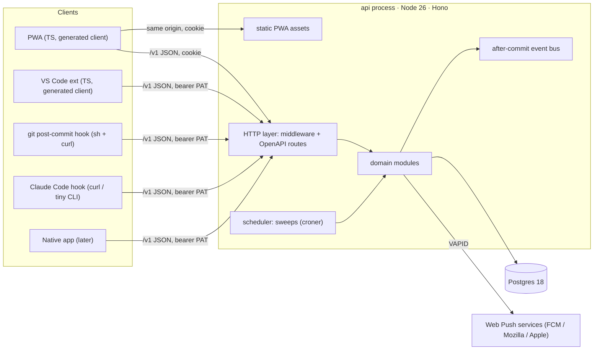
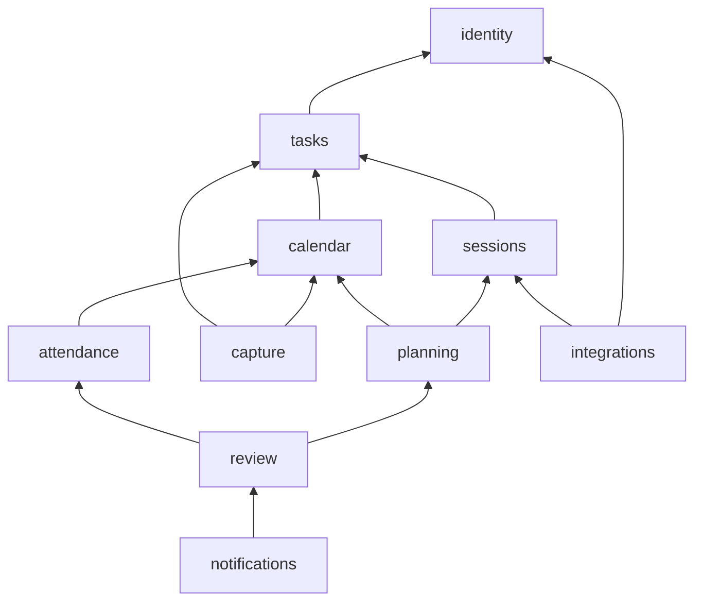
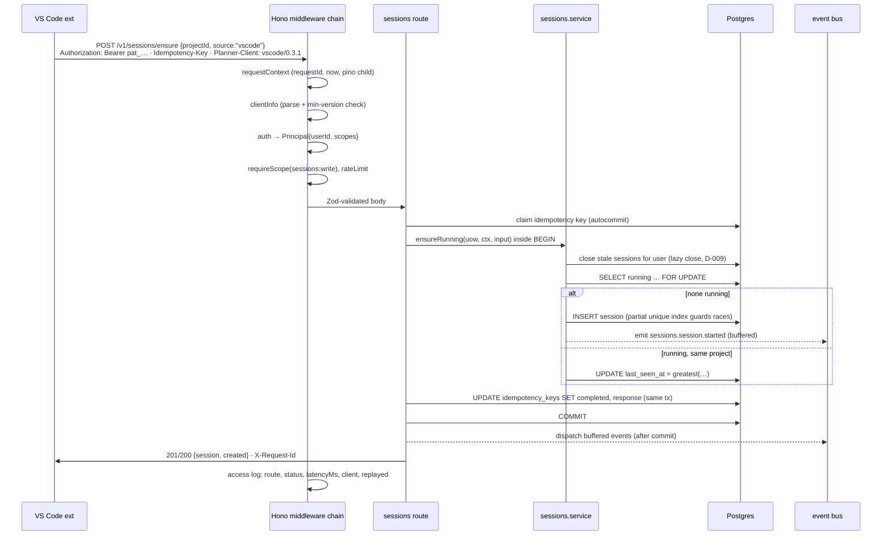

# 03 · Backend system design

> Slice: overall backend shape, language/framework, API style and versioning, cross-cutting concerns (validation, errors, idempotency, pagination, time at the boundary), background work, layout, observability, endpoint inventory.
> Written: 2026-10-05 · Status: brainstorm proposal · Depends on: 01, 02, 04, 05, 06, 07, 08 (see §2)

---

## 1. TL;DR

- **Shape:** one **TypeScript modular monolith**: a single Node.js process and a single Postgres database, split internally into about ten modules (identity, calendar, attendance, tasks, sessions, capture, planning, review, integrations, notifications) with enforced boundaries. No microservices, no Redis, no message broker.
- **Stack:** **Hono 4.13** on **Node 26** (Temporal is built in; Node 26 is promoted to LTS this month), **Zod 4.6** for validation, **@hono/zod-openapi 1.6** to produce an **OpenAPI 3.1** contract from the same route definitions, Postgres 18, Drizzle 0.45 (subject to 02/04). Versions were checked on 2026-10-05 (see §5.12).
- **API:** **REST + OpenAPI under `/v1`**, with no tRPC or GraphQL. The git hook is a shell script using `curl`, so the API has to be plain HTTP+JSON. The PWA uses a client **generated from the published OpenAPI document**, the same artifact a future Swift or Kotlin app would use. That is the practical meaning of "native is just another client" (D-007).
- **Versioning:** URL major version, additive-only changes inside `/v1`, tolerant-reader clients, a `Planner-Client: <kind>/<version>` header on every request, and `Deprecation`/`Sunset` headers plus a `/v1/meta` minimum-version table for the rare breaking change.
- **Correctness for retried writes:** **natural idempotency first**: client-generated UUIDv7 ids, "set target state" transitions, monotonic `last_seen = greatest(...)`, and commit SHAs as natural keys. An `Idempotency-Key` header table is the safety net for whatever is left, and it is written **in the same transaction** as the business change.
- **Errors:** RFC 9457 `application/problem+json` with stable machine `code`s and the `requestId`.
- **Time:** instants travel as RFC 3339 with an explicit offset and are always returned as UTC `Z`. Wall-clock things (a class at 10:00 every Monday) travel as local date/time plus an IANA zone, never as instants.
- **Background work:** D-009 needs **no job for correctness**, because session closing is computed on read and materialised on the next write. The only work that has to happen on time is the evening shutdown push. It is handled with a per-user `next_fire_at` column and a once-a-minute in-process sweep (`croner`) that claims due rows with `FOR UPDATE SKIP LOCKED` and advances them in the same transaction. That design is safe under concurrent runs without any queue library. Move to **pg-boss 12** only when a real one-off delayed job with retries shows up.
- **Hosting assumption:** a long-running process (07). The Hono app is runtime-portable, so if Atif ends up on serverless the only piece that changes is the scheduler (an external cron calls `/internal/jobs/tick`).

---

## 2. Assumptions about other slices

Each assumption below is something this design leans on. If another slice decided differently, a critic should flag the mismatch.

| Slice | Assumption | What changes here if it is wrong |
|---|---|---|
| **01 recurrence** | Occurrences are **expanded on read** from series + exception rows (no materialised occurrence table). The engine is a pure TS package (`packages/recurrence`, likely on `rrule-temporal`) that runs on both server and client. Occurrence identity is **(seriesId, original local start)**, the same as iCalendar `RECURRENCE-ID`. Each series carries an IANA time zone. | If 01 materialises occurrences, add a daily `calendar.extendHorizon` sweep (the scheduler already supports it) and paths can use occurrence row ids instead of `{originalStart}`. |
| **02 data model** | Postgres tables use UUIDv7 primary keys, and every user-owned row has `user_id`. Groups are archived, not deleted (D-004). The sessions table has `started_at`, `last_seen_at`, `ended_at NULL`, `source`, `closed_reason`, `task_id`, `project_id`. | Field names in my snippets change; the design does not. |
| **04 database & sync** | **Postgres 18** (18.6 is current; it has a native `uuidv7()`). Drizzle ORM is the query builder and migration tool, though my design only needs a transaction handle (`Tx`), so Kysely would also work. **Offline writes are replayed as ordinary API calls** carrying client-generated ids, not through a CRDT op-log endpoint. There may be a delta feed `GET /v1/changes?since=`. | If 04 picks an op-log or CRDT sync, the mutation surface collapses into one `POST /v1/sync/push` endpoint and the generic idempotency table becomes the per-mutation dedupe store. |
| **05 sessions & realtime** | 05 owns session **policy**: gap threshold, which sources may auto-start, and what happens with a forgotten manual timer. 05 also owns realtime transport, which can be SSE or polling since latency tolerance is minutes. This slice provides the **atomic primitives** (one running session per user, ensure-running, lazy close) and an after-commit event bus that 05 can fan out from. | If 05 wants WebSockets, the bus stays the same and only the transport changes. |
| **06 auth & identity** | Two credential kinds. (1) An httpOnly, `SameSite=Lax` **cookie session** for the PWA. (2) **Bearer tokens** for everything else: personal access tokens (PATs) with scopes for the git hook, VS Code, and Claude Code, and later session tokens for native. 06 exposes `authenticate(headers) → Principal | null`. If 06 chooses Better Auth (1.7.7), its handler is mounted inside the same Hono app. | If 06 is bearer-only, the CSRF middleware can be removed. |
| **07 infra** | One **long-running Node 26 process** (small VM or container) behind TLS, plus Postgres. It **serves the built PWA static files from the same origin**, so there is no CORS. Normally one instance runs, but two can briefly overlap during a deploy, so every job must be safe under concurrency. | If serverless: same Hono app via `hono/vercel` or Workers, and an external cron hits `/internal/jobs/tick` (Vercel Hobby crons run at most once a day; see §5.9). |
| **08 integrations** | The git hook is a **POSIX shell script + curl** with an offline queue file. The VS Code extension is TS and uses the generated client. The Claude Code hook calls `curl` or a tiny CLI. A `.planner` link file holds a **repo link id, never a token**. Commit→task resolution order is trailer, then branch pattern, then the active session's task. | Endpoint payloads in §5.11 shift; the ingest module boundary stays. |
| **09 frontend** | The PWA is TypeScript, consumes the generated `openapi-fetch` client, sends `Planner-Client`, and imports the shared `packages/recurrence`, `packages/time` and `packages/quick-add`. | If 09 picks Next.js, mount this Hono app inside a catch-all route handler (§4.3) instead of running two backends. |
| **10 scheduling** | Algorithms ("time back", gap finding, estimation multiplier) are pure functions in `packages/scheduling`, callable from the server's `planning` module and from the PWA. | None structurally. |
| **11 capture** | The quick-add parser is a pure TS package. Voice is transcribed **on device** (Web Speech API), so the server never receives audio. | If server-side transcription is chosen, it becomes the first real job that needs pg-boss. |
| **12 UX flows** | The evening shutdown is one screen backed by **one aggregate read and one write**. | The `review` module's endpoints change shape. |
| **13 build plan** | Roadmap phases v0–v3 stand. My order of work (§5.13) slots inside them. | Reorder §5.13. |

---

## 3. Three genuinely different approaches

The three options differ on the axes that matter: **one language or two**, **long-running server or serverless**, and **an API contract or framework-internal RPC**.

| Approach | Pros | Cons | Solo-dev effort | Interview value |
|---|---|---|---|---|
| **A. TS modular monolith**: Hono + REST/OpenAPI, one long-running Node process, Postgres, shared TS packages with the PWA | One language end to end. Recurrence, time and quick-add code is **shared** with the PWA (offline rendering, instant previews). The OpenAPI contract serves curl clients, VS Code and future native apps equally. Hono runs on Node, Bun, Workers and Vercel, so the hosting choice can be reversed. A long-running process makes minute-level jobs trivial. One deployable. | You assemble the pieces yourself (validation, OpenAPI, auth lib, ORM). JS date and recurrence handling was historically weak, though Temporal is native in Node 26 and `rrule-temporal` is active. You need a host that runs a process (some ops). There is a codegen step for the client. | **Medium.** About 2–3 days to a skeleton with auth, errors, OpenAPI and one module. | **High.** Module boundaries, contract-first API, idempotency design, a `SKIP LOCKED` scheduler and time-zone correctness are all concrete and explainable. |
| **B. Next.js full-stack, serverless**: App Router, Server Actions for PWA mutations, route handlers for integrations, Vercel + Neon, external cron | Fastest path to v0. One framework, one repo, one deploy. Zero-ops hosting. Very good DX. | **Server Actions are not an API**: the git hook, VS Code and native need a second, separately designed surface (this cuts against D-007). Vercel Hobby crons are **once per day** with imprecise timing, so the shutdown push needs an external cron. Serverless Postgres needs pooling. Business logic tends to leak into components. Vendor coupling and cold starts. | **Low at v0**, rising to **medium-high at v3** when a second API surface appears. | **Medium.** A very common stack; it says less about backend design. |
| **C. Python FastAPI service + TS PWA**: Pydantic, SQLAlchemy 2.1, `dateutil.rrule`, APScheduler or procrastinate; OpenAPI → generated TS client | Automatic OpenAPI from type hints. Excellent validation (Pydantic 2.13). `dateutil.rrule` is the most battle-tested RRULE implementation anywhere. Python is familiar. Easy later ML/LLM experiments (estimation, AI breakdown). | **Two languages and two toolchains** for one person. No shared recurrence or time code with the PWA, so expansion logic is either duplicated in TS or the client cannot render the calendar offline. Python naive/aware datetime pitfalls. Async SQLAlchemy has a learning curve. `python-dateutil` has not released since March 2024 (stable, but quiet). | **Medium-high.** | **High** for backend and ML-leaning roles, but "why two languages for a solo app?" needs a good answer. |

**Approach A** fits the constraints best. Recurrence is risk #1, and with A the *same* expansion code runs on the server (authoritative) and in the PWA (offline, instant). The API is designed once as a contract, so the git hook, VS Code, Claude Code and an eventual native app are genuinely "just more clients". Its main cost is that Atif must wire a few libraries together. That cost is front-loaded and teaches exactly what interviews ask about.

**Approach B** is the honest "ship v0 this weekend" choice, and §4.2 makes the best case for it. Its problem is structural. D-007 locks in an API-first backend, and D-006 brings in three non-browser clients. With B, the v0 server actions end up as a private API that gets re-implemented as a public one in v3. The free-tier cron limit also hits exactly the feature (the evening shutdown, D-010) that keeps attendance honest.

**Approach C** is the strongest choice *if recurrence correctness were the only thing that mattered*. It is not, and the shared-code argument outweighs it. Two languages also double what Atif has to learn and keep current.

**Variants considered and folded in:**

- **Go** (1.27.1, with chi v5.3.2 or huma v2.39.1 for OpenAPI, sqlc v1.31.1, River v0.48.0 for Postgres-backed jobs). It would be the best *performance* and *single-binary ops* story and a strong interview signal. Its weaknesses: `rrule-go`'s last release was v1.8.2 in January 2023, it is a third language for a 3rd-semester student, and nothing is shared with the PWA. Worth it only if Atif specifically wants to learn Go.
- **TS framework inside A** (all versions checked 2026-10-05):

| Framework | Version | Verdict |
|---|---|---|
| **Hono** | 4.13.13 (2026-10-04) | **Pick.** Small, Web-standard `Request`/`Response`, runs anywhere, first-class OpenAPI via `@hono/zod-openapi`, built-in `requestId`, `csrf`, `bodyLimit`, `secureHeaders`. ~86M weekly downloads. |
| Fastify | 5.12.5 (2026-09-16) | Excellent and mature, with a JSON-schema-first design and a plugin system. Node-only and more ceremony. A fine second choice. |
| NestJS | 12.1.2 (2026-09-30) | Enforces modules through DI and decorators and is popular in Indian job listings. For a solo dev it adds a lot of framework to learn before any domain code exists, and you end up explaining Nest rather than your design. |
| Elysia (Bun) | 1.4.30 (2026-08-26) | Great type inference and speed, but it ties you to Bun and has a smaller ecosystem. Not worth the risk for the core of a long-lived app. |
| Next.js route handlers | 16.3.8 (2026-09-30) | See approach B. Hono can be *mounted inside* Next if needed (§4.3). |

- **API style:**

| Style | Verdict |
|---|---|
| **REST + OpenAPI 3.1** | **Pick.** Works with curl (git hook), any language (native later), browser caching semantics, standard tooling (docs, codegen, diffing). |
| tRPC 11.19 | Excellent DX, but TS-to-TS only. The git hook and a Swift app cannot use it, so you would need REST anyway. |
| oRPC 1.15 | The best "middle" option: contract-first procedures that also emit OpenAPI and a typed client. A reasonable swap if Atif prefers its DX. I don't default to it because it is a second abstraction on top of the HTTP framework, its community is smaller (~1.8M weekly downloads vs Hono's ~86M), and making its routes curl-friendly means writing REST-shaped paths anyway. |
| GraphQL | No. The data graph is small and fixed, and N+1 queries, caching, persisted queries and auth-per-field are weeks of work with no user benefit. |

---

## 4. Recommendation

### 4.1 The recommendation

Build **approach A**:

- **One Hono app on Node 26**, structured as a **modular monolith** with about ten modules, explicit factory-function dependency injection (no DI container), in-process typed domain events dispatched after commit, and boundaries enforced in CI by `dependency-cruiser`.
- **REST + OpenAPI 3.1 under `/v1`.** Routes are defined once with Zod schemas, and the contract is published at `/v1/openapi.json`. The PWA, VS Code extension and any future native app use clients generated from that document. The git hook uses curl.
- **The same process serves the PWA's static files**, so everything runs on one origin with one deploy, one TLS certificate and no CORS.
- **Postgres is the only stateful dependency.** It holds data, idempotency records, the notification schedule and, if ever needed, the job queue (pg-boss).
- **Background work is a handful of idempotent sweeps** run by an in-process scheduler. They are safe under concurrent execution thanks to `FOR UPDATE SKIP LOCKED` and advance-in-the-same-transaction. A secret-protected `/internal/jobs/:name/run` route lets any external cron trigger the same sweeps.

### 4.2 The strongest argument against it

*"You are building an API platform for clients that don't exist yet."* v0 is a recurring calendar that Atif will dogfood for two weeks, and the first non-browser client (the git hook) is v3, months away. A Next.js app with Server Actions on Vercel + Neon would have v0 working in a weekend with **zero servers to patch, zero TLS setup, zero codegen, and a free tier that never sleeps for static pages**. Every hour spent on OpenAPI plumbing, problem types, a client generator, a workspace layout and a VM is an hour not spent finding out whether the recurring-groups idea even works in daily life. Many v0 assumptions will be thrown away after dogfooding anyway. Small free VMs need a credit card and can be reclaimed, and a single VM is a single point of failure Atif has to babysit during exams. For a 3rd-semester student, "monorepo + codegen + separate API + server ops" is four new concepts at once, and abandonment is the biggest risk any side project faces. YAGNI says to build the public API when the first public client arrives.

That argument is genuinely good. My answer is that **D-007 already locks API-first**, so the question is only *when* to pay for it. The cost of paying in v0 is small: about a day for the OpenAPI wiring, and serving the PWA from the same process removes the two-deploys and CORS problems. The cost of paying in v3 is a rewrite of every mutation path while the app is in daily use. The interview story ("I designed the contract first; the PWA consumes the same generated client a Swift app would") is also much stronger than "I later bolted on REST".

### 4.3 When I would switch

- **Switch hosting, not architecture**, if Atif cannot get a long-running host for free or very cheaply (for example, a VM sign-up fails card verification). Deploy the *same* Hono app to Vercel or Cloudflare Workers, and replace the in-process scheduler with an external cron (cron-job.org, or a Workers cron trigger) calling `/internal/jobs/tick` every minute. Nothing else changes.
- **Switch to approach B's framework, still keeping the contract**, if slice 09 chooses Next.js for the frontend. In that case, mount the Hono app in `app/api/[[...route]]/route.ts` using `hono/vercel`'s `handle(app)` rather than writing Server Actions. There is still one backend, one contract, and one generated client.
- **Abandon the separate-contract discipline** only if, after the first week of v0, more than roughly a third of Atif's time is going into API plumbing instead of the calendar. That would mean the overhead is real for him, and dogfooding the idea matters more. Even then, keep the module boundaries.

---

## 5. Implementation walkthrough

### 5.1 System context



### 5.2 Modules and what each owns

| Module | Owns (tables / concepts) | Public API (examples) | Emits | Phase |
|---|---|---|---|---|
| `platform` (shared kernel, not a domain module) | db pool, `Tx`, clock, ids, errors, logger, config, idempotency store, rate limiter, scheduler, event bus | `inTransaction`, `AppError`, `Clock` | n/a | v0 |
| `identity` | users, profile (tz, week start), auth sessions, PATs + scopes (06) | `getProfile`, `authenticate`, `requireScope` | `identity.profile.tzChanged` | v0 (PATs v3) |
| `calendar` | schedule groups (D-004), recurring series, exceptions (override / cancel + reason, D-005), one-off and task-planned blocks, conflict detection, imports (D-008), holiday bulk-cancel | `listOccurrences`, `cancelOccurrence`, `setSkipped`, `findConflicts` | `calendar.occurrence.cancelled`, `calendar.group.archived` | v0 |
| `attendance` | **only** day-level confirmations (D-010). "Skipped" lives on the calendar cancellation, so there is a single source of truth. | `summary`, `confirmDay` | `attendance.day.confirmed` | v2 |
| `tasks` | projects, tasks (nested), status, ordering, estimates | `assertOwned`, `complete`, `get` | `tasks.task.completed` | v1 |
| `sessions` | work sessions, notes, commit refs, the running-session invariant, lazy close (D-009) | `start`, `stop`, `ensureRunning`, `recordActivity`, `effective` | `sessions.session.started/stopped` | v1 |
| `capture` | thought-dump items (general or per project), aging, convert-to-task | `convert` (calls `tasks.create`) | `capture.item.converted` | v1 |
| `planning` | no tables at first. Wraps `packages/scheduling`: gaps, "time back" suggestions, estimation multiplier (derived from history). | `gaps`, `suggestions`, `multipliers` | n/a | v2 |
| `review` | no tables. Composes the evening shutdown read model from calendar, attendance, tasks and sessions. | `shutdownSummary` | n/a | v2 |
| `notifications` | push subscriptions, notification schedules (`next_fire_at`), delivery log | `dispatchDue`, `reschedule` | n/a | v2 |
| `integrations` | repo links (`.planner`), commit records, ingest of activity batches. An **anti-corruption layer** that translates outside events into `sessions` and `tasks` commands. | `ingestCommits`, `ingestActivity`, `resolveRepo` | `integrations.commit.ingested` | v3 |

Dependency direction (an arrow means "imports the public API of"; everything also depends on `platform`). The graph must stay **acyclic**, and CI fails if it doesn't.



### 5.3 How modules talk

There are three mechanisms, chosen by how strong the coupling needs to be:

1. **Synchronous queries** for cross-module reads. Example: `review` calls `calendar.listOccurrences(...)`. A module never reads another module's tables directly; only its public functions.
2. **Commands that join the caller's transaction** when two modules must change atomically. Commands take a `UnitOfWork`. The canonical example is the evening shutdown write. The user flips "Algorithms 10:00" to *skipped*, so `attendance.confirmDay(uow, …)` calls `calendar.setSkipped(uow, keys)` and then inserts the day confirmation. Both happen in one transaction, or neither does.
3. **Domain events dispatched after commit** for side effects that may lag or fail without corrupting data, such as realtime "something changed" hints (05) or a cache refresh. Handlers run after the transaction commits and are never allowed to fail the request.

There is deliberately **no outbox table** at first. If an after-commit side effect ever has to be guaranteed (for example "send an email when X"), enqueue a pg-boss job *inside* the business transaction. pg-boss accepts an external database executor for `send`; check the exact option name in the v12 docs. That gives outbox semantics without building an outbox.

```ts
// platform/uow.ts
export interface UnitOfWork {
  readonly tx: Tx;                        // Drizzle transaction (or Kysely) — the only DB handle services use
  emit(event: DomainEvent): void;         // buffered; dispatched only after COMMIT
}

export async function inTransaction<T>(
  db: Db, bus: EventBus, fn: (uow: UnitOfWork) => Promise<T>,
): Promise<T> {
  const pending: DomainEvent[] = [];
  const result = await db.transaction((tx) => fn({ tx, emit: (e) => pending.push(e) }));
  for (const e of pending) bus.dispatch(e);   // fire-and-forget; errors are logged, never rethrown
  return result;
}
```

```ts
// platform/events.ts — one discriminated union for the whole app keeps events greppable
export type DomainEvent =
  | { type: 'calendar.occurrence.cancelled'; userId: UserId; occurrenceKey: OccurrenceKey; reason: CancelReason; at: Instant }
  | { type: 'calendar.group.archived'; userId: UserId; groupId: GroupId; at: Instant }
  | { type: 'tasks.task.completed'; userId: UserId; taskId: TaskId; projectId: ProjectId | null; at: Instant }
  | { type: 'sessions.session.started'; userId: UserId; sessionId: SessionId; source: SessionSource; at: Instant }
  | { type: 'sessions.session.stopped'; userId: UserId; sessionId: SessionId; reason: ClosedReason; at: Instant }
  | { type: 'attendance.day.confirmed'; userId: UserId; date: PlainDateString; at: Instant }
  | { type: 'integrations.commit.ingested'; userId: UserId; sha: string; sessionId: SessionId | null; at: Instant };

export interface EventBus {
  dispatch(e: DomainEvent): void;
  on<K extends DomainEvent['type']>(type: K, h: (e: Extract<DomainEvent, { type: K }>) => Promise<void> | void): void;
}
```

**Wiring uses factory functions, with no DI container.** It is boring and readable, and you can explain it on a whiteboard:

```ts
// main.ts — the composition root; the only place that knows every module
const config = loadConfig(process.env);            // Zod-validated; process exits on bad config
const db = createDb(config.databaseUrl);
const clock = systemClock;                          // tests inject a fixed clock
const bus = createEventBus(logger);
const identity   = createIdentityModule({ db, clock, bus, auth: createAuth(config) });
const tasks      = createTasksModule({ db, clock, bus });
const calendar   = createCalendarModule({ db, clock, bus, tasks });
const sessions   = createSessionsModule({ db, clock, bus, tasks, policy: config.sessionPolicy });
const attendance = createAttendanceModule({ db, clock, bus, calendar });
// … capture, planning, review, notifications, integrations
const app = buildApp({ config, identity, tasks, calendar, sessions, attendance /* … */ });
const server = serve({ fetch: app.fetch, port: config.port });
const scheduler = startScheduler(buildJobs({ sessions, notifications, platform }), { logger });
onShutdownSignal(async () => { scheduler.stop(); await closeServer(server); await db.end(); });
```

**Boundary enforcement:** each module exposes exactly one `index.ts`. A `dependency-cruiser` (18.5.0) rule forbids importing `modules/X/*` from outside `X` except through `modules/X/index.ts`. A second rule forbids cycles. Both run in CI, so you can show an interviewer the rule file and a red build from a deliberate violation.

### 5.4 Directory layout

pnpm workspaces only (pnpm 12.9.1). No Turborepo or Nx until builds are actually slow.

```
planner/
├─ apps/
│  ├─ api/
│  │  ├─ src/
│  │  │  ├─ main.ts                 # composition root: config, db, server, scheduler, graceful shutdown
│  │  │  ├─ app.ts                  # buildApp(deps) → OpenAPIHono (no listen → testable with app.request())
│  │  │  ├─ http/                   # middleware: requestContext, clientInfo, auth, rateLimit, errors, idempotent()
│  │  │  ├─ platform/               # db, uow, clock, ids, errors, events, scheduler, config, logger
│  │  │  ├─ modules/
│  │  │  │  ├─ calendar/
│  │  │  │  │  ├─ index.ts           # PUBLIC: types + createCalendarModule
│  │  │  │  │  ├─ routes.ts          # OpenAPI route defs + thin handlers (parse → call service → map DTO)
│  │  │  │  │  ├─ service.ts         # use cases; all invariants live here
│  │  │  │  │  ├─ repo.ts            # SQL; every function takes userId first
│  │  │  │  │  ├─ schema.ts          # Drizzle tables owned by this module
│  │  │  │  │  ├─ dto.ts             # Zod wire schemas (request/response)
│  │  │  │  │  └─ *.test.ts
│  │  │  │  ├─ identity/ tasks/ sessions/ attendance/ capture/
│  │  │  │  └─ planning/ review/ notifications/ integrations/
│  │  │  └─ jobs/index.ts           # buildJobs(): the list of sweeps and their schedules
│  │  ├─ drizzle/                   # generated SQL migrations (reviewed, committed)
│  │  └─ test/                      # testcontainers setup, factories, fixed clock
│  ├─ web/                          # PWA (slice 09)
│  ├─ vscode/                       # v3
│  └─ git-hook/                     # v3: post-commit.sh + install script
├─ packages/
│  ├─ time/                         # Temporal helpers + Zod codecs for Instant/PlainDate/PlainTime/TimeZone
│  ├─ recurrence/                   # slice 01, pure, shared client/server
│  ├─ scheduling/                   # slice 10, pure
│  ├─ quick-add/                    # slice 11, pure rule parser
│  └─ api-client/                   # openapi.json snapshot + openapi-typescript types + openapi-fetch wrapper
└─ .dependency-cruiser.cjs
```

`packages/api-client` is generated by a script: start the app in-process, call `app.getOpenAPI31Document()`, write `openapi.json`, then run `openapi-typescript`. The snapshot is **committed**, so a pull request that changes the API shows a readable contract diff.

### 5.5 Core cross-cutting types

```ts
// platform/context.ts
export type ClientKind = 'pwa' | 'native' | 'vscode' | 'git-hook' | 'claude-code' | 'cli' | 'unknown';
export type Scope = 'all' | 'sessions:write' | 'ingest:write' | 'tasks:read' | 'tasks:write' | 'calendar:read';

export interface Principal {
  userId: UserId;
  authMethod: 'cookie' | 'bearer';
  tokenId: string | null;          // PAT id for audit + revocation
  scopes: ReadonlySet<Scope>;      // cookie sessions get {'all'}
}

export interface RequestContext {
  requestId: string;
  now: Temporal.Instant;           // captured ONCE per request; services never call Date.now()
  principal: Principal | null;
  client: { kind: ClientKind; version: string | null };
  log: Logger;                     // pino child with requestId, userId, client
}
```

Capturing `now` once per request means every row written by one request carries the same timestamp, and tests can freeze time by injecting a `Clock`.

```ts
// platform/errors.ts
export type ProblemCode =
  | 'malformed-request' | 'validation-failed' | 'unauthenticated' | 'insufficient-scope'
  | 'not-found' | 'state-conflict' | 'id-conflict' | 'range-too-large'
  | 'idempotency-key-reused' | 'idempotency-in-progress'
  | 'client-version-unsupported' | 'rate-limited' | 'internal';

export class AppError extends Error {
  constructor(
    readonly code: ProblemCode,
    readonly status: number,
    message: string,
    readonly extensions: Record<string, unknown> = {},
  ) { super(message); }
}
export const notFound = (what: string) => new AppError('not-found', 404, `${what} not found`);
export const stateConflict = (detail: string, ext = {}) => new AppError('state-conflict', 409, detail, ext);
```

```ts
// http/errors.ts — the single place that turns anything thrown into RFC 9457
app.onError((err, c) => {
  const ctx = c.get('ctx');
  const p = err instanceof AppError ? err : new AppError('internal', 500, 'Unexpected error');
  if (p.status >= 500) ctx.log.error({ err }, 'unhandled'); else ctx.log.info({ code: p.code }, 'problem');
  return c.json({
    type: `${config.publicOrigin}/problems/${p.code}`,
    title: TITLES[p.code], status: p.status,
    detail: p.status >= 500 ? undefined : p.message,      // never leak internals
    instance: c.req.path, code: p.code, requestId: ctx.requestId,
    ...p.extensions,
  }, p.status, { 'Content-Type': 'application/problem+json' });
});
```

Services **throw** `AppError` subclasses, and one handler maps them. A `Result`/`Either` style (neverthrow, Effect) is more principled but doubles the ceremony of every function. For a solo codebase, typed exceptions plus a single mapper are easier to write, read and explain.

### 5.6 API conventions

**Resources and paths.** Plural nouns, ids in paths, and sub-resources for state that has its own lifecycle. A cancellation is a **sub-resource you PUT or DELETE** (`/occurrences/{originalStart}/cancellation`), not a verb, which makes it naturally idempotent. Actions that are true state transitions use a verb sub-path (`/sessions/{id}/stop`) and are written to be **no-ops when already in the target state**.

**Occurrence identity in URLs.** `{originalStart}` is the occurrence's *original* local start in the series' zone, in iCalendar basic format (`20261006T100000`). That avoids colons in paths and keeps working after the occurrence is moved. This is the RECURRENCE-ID idea from slice 01.

**Versioning policy (so native and extensions are "just more clients"):**

1. The major version is in the URL: `/v1`. A new major version is introduced **per resource** only when something must break, and `/v1` stays served side by side.
2. Inside `/v1`, **only additive changes** are allowed: new endpoints, new optional request fields, new response fields, new enum values. Clients are written as **tolerant readers**: they ignore unknown fields and map unknown enum values to an "other" branch. This rule goes in the API README and in the generated client wrapper.
3. Every request carries `Planner-Client: <kind>/<semver>` (for example `vscode/0.3.1`, `git-hook/1`). It is a custom header without the `X-` prefix (RFC 6648), and it works because the PWA is same-origin (cross-origin it would trigger a CORS preflight). The server logs it on every request, which is how you **know** nobody still calls an endpoint before you remove it.
4. `GET /v1/meta` returns `{ apiVersion, serverTime, minClient: { vscode: '0.2.0', … }, latestClient: {...} }`. Clients warn when they are behind `latest` and refuse to run below `min`. If an old client calls anyway, the server answers `400 client-version-unsupported` with `minVersion`. This is only used for known-broken clients. `serverTime` also lets clients estimate clock skew.
5. Deprecation: the OpenAPI operation gets `deprecated: true`, and responses carry `Deprecation: @<unix-ts>` (RFC 9745), `Sunset: <HTTP-date>` (RFC 8594) and `Link: <docs>; rel="deprecation"`. The minimum window is **90 days**. The git hook gets the longest window because shell scripts don't auto-update; `/v1/meta` tells it a newer script exists.
6. Database migrations follow **expand → migrate → contract**, so API and schema deploys never have to be simultaneous.
7. CI runs an OpenAPI diff of the committed snapshot against the new one and fails on breaking changes to `/v1` (for example with `oasdiff`; version not verified).

**Validation.** Zod 4 schemas at the HTTP edge (shape, formats, bounds) through `@hono/zod-openapi`. Business invariants live in services, not in Zod: "end after start", "task belongs to user", "only one running session". Malformed JSON gets `400 malformed-request`. Schema failures get `422 validation-failed` with `errors: [{ path, message, code }]`. Objects **strip unknown keys**, logged at debug level, so an older server tolerates a newer client. In dev and test, responses are also validated against their schemas to catch DTO drift.

**Time at the boundary** (shared Zod codecs live in `packages/time`):

| Wire type | Format | Example | Rule |
|---|---|---|---|
| `Instant` | RFC 3339 **with offset** | `2026-10-06T04:30:00Z`, `2026-10-06T10:00:00+05:30` | Input requires `Z` or an offset (`z.iso.datetime({ offset: true })`). A bare `2026-10-06T10:00` is **rejected** as ambiguous. Output is always UTC `Z` with milliseconds. |
| `PlainDate` | `YYYY-MM-DD` | `2026-10-06` | Used for calendar days, attendance days and shutdown dates. Its meaning is relative to a stated zone. |
| `PlainTime` | `HH:MM[:SS]` | `10:00` | Wall-clock times of series and the shutdown time. |
| `TimeZone` | IANA id | `Asia/Kolkata` | Validated by constructing a Temporal `ZonedDateTime`. Abbreviations (`IST`) and raw offsets (`+05:30`) are **rejected for user and series zones**: an offset has no DST rules, and "IST" is ambiguous (India, Ireland, Israel). |
| Duration | integer minutes | `durationMin: 90` | Used for planned things. Tracked time is always derived from instants. |

Range queries take `start`/`end` **instants**, half-open `[start, end)`. The client computes its visible week in the user's zone, so the server never guesses which "Monday" was meant. Occurrence expansion is capped at **62 days per request** (`422 range-too-large`), which bounds CPU per request. Each occurrence in a response carries both resolved instants (for rendering) and its local start plus zone (for identity and editing):

```ts
interface OccurrenceDto {
  key: string;                    // opaque: `${seriesId}~${originalStartBasic}` or `blk_${blockId}`
  seriesId: string | null;        // null for one-off / task-planned blocks
  groupId: string | null;
  title: string;
  start: Instant; end: Instant;   // resolved (after overrides)
  originalStart: string;          // "20261006T100000" in timeZone — stable identity
  timeZone: string;
  status: 'scheduled' | 'moved' | 'cancelled';
  cancelReason?: 'prof_cancelled' | 'skipped' | 'holiday' | 'other';
  taskId?: string | null;
  attendance?: 'went' | 'skipped' | 'unconfirmed' | 'n/a';
}
```

Client clock skew: server-side, any client-supplied instant (heartbeats, commits, offline edits) more than **5 minutes in the future** is rejected per item, and anything **older than 14 days** is rejected for ingest. The server also stores its own `received_at`.

**Idempotency: natural first, key-based as a safety net.** Retries come from three places: flaky mobile networks (the PWA), the PWA's offline replay (04), and the git hook's offline queue (08). Most endpoints are made idempotent *by design*:

| Technique | Where | Behaviour on retry |
|---|---|---|
| Client-generated UUIDv7 ids on create | tasks, projects, dump items, blocks, series, sessions | Same id and same content → `200` with the existing row. Same id with different content (or another user's id) → `409 id-conflict`. |
| Target-state transitions | complete/reopen task, stop session, PUT/DELETE cancellation | Already in the target state → `200`, no-op, no duplicate event. |
| Set replacement | `PUT /v1/days/{date}/attendance` with the full `skipped` set | Replaying the same set gives the same result. |
| Monotonic merge | heartbeats: `last_seen_at = greatest(last_seen_at, $maxAt)` | Replays and out-of-order batches don't move time backwards. |
| External natural keys | commits: `UNIQUE (user_id, repo_link_id, sha)`, insert `ON CONFLICT DO NOTHING` | A duplicate is reported as `duplicate`, with no new session or attachment. |

What is left, mainly `POST /v1/sessions/ensure` and `POST /v1/quick-add` (both create things whose id the server chooses), supports an `Idempotency-Key` header. It follows the Stripe pattern and the IETF draft. The draft expired in April 2026 without becoming an RFC, but the header remains the de-facto standard.

```sql
create table idempotency_keys (
  user_id        uuid        not null,
  key            text        not null check (length(key) between 8 and 128),
  method         text        not null,
  path           text        not null,
  request_hash   bytea       not null,          -- sha256 of method + path + canonical JSON body
  state          text        not null check (state in ('in_progress', 'completed')),
  locked_until   timestamptz,
  response_status int,
  response_body  jsonb,
  created_at     timestamptz not null default now(),
  primary key (user_id, key)
);
-- purged after 7 days by a sweep
```

```ts
// http/idempotent.ts — usage: return idempotent(c, async (uow) => ({ status, body }))
export async function idempotent(
  c: Ctx, run: (uow: UnitOfWork) => Promise<{ status: 200 | 201; body: unknown }>,
): Promise<Response>
```

The algorithm:

1. If there is no header, just `inTransaction(run)`.
2. **Claim** in a short autocommit statement: `INSERT … state='in_progress', locked_until=now()+30s ON CONFLICT DO NOTHING RETURNING`.
3. If nothing was inserted, read the existing row. A different `request_hash` gives `422 idempotency-key-reused`. A `completed` row is **replayed** with header `Idempotent-Replayed: true`. An `in_progress` row with a live lock gives `409 idempotency-in-progress` plus `Retry-After: 1`. An expired lock is taken over with a conditional `UPDATE … WHERE locked_until < now()`.
4. Run the business logic **and** `UPDATE idempotency_keys SET state='completed', response_*` **in the same transaction**. This is the important detail. If the process dies after commit, the stored response exists. If it dies before commit, neither the business change nor the response exists, and the retry runs again safely.
5. A 4xx domain error is stored as the completed response (a retry gets the same answer). A 5xx deletes the claim so the client can retry.

**Pagination.** Lists that grow (sessions, dump items, commits, tasks) use **keyset cursors**: `{ data: T[], nextCursor: string | null }`, with `limit` defaulting to 50 and capped at 200. The cursor is `base64url(JSON.stringify({ v: 1, k: [sortValue, id] }))` and is opaque to clients. Because ids are UUIDv7 (time-ordered), "newest first" lists can paginate on `id` alone (`WHERE id < $cursor ORDER BY id DESC LIMIT $n + 1`). Inserts during pagination never cause duplicates or skips, unlike `OFFSET`. Calendar occurrences are **not** paginated; they are range-bounded.

**Auth, CSRF, CORS, abuse.** The auth middleware resolves a `Principal` from the cookie or `Authorization: Bearer`. `requireScope('ingest:write')` guards integration routes. Every repo function takes `userId` as its first argument, and a lookup for another user's id returns **404, not 403**, so ids can't be probed. Cookie-authenticated unsafe methods go through Hono's `csrf()` (Origin check). Bearer requests are exempt because they carry no ambient credentials. Same origin means no CORS configuration at all; if 07 puts the API on a subdomain, add an explicit allowlist. Request bodies are limited to 256 KB, or 2 MB on import endpoints. Rate limiting uses `rate-limiter-flexible` (11.2.1) with an in-memory store, since there is one process: 10/min/IP on auth, 60/min/token on ingest, 300/min/user otherwise. A limited request gets `429 rate-limited` plus `Retry-After`.

### 5.7 Request lifecycle walkthrough

Example: the VS Code extension's **Start** button for project *planner*, sent with a PAT and an `Idempotency-Key` (the user double-clicked).



The steps:

1. **`requestContext`** takes an incoming `X-Request-Id` if it is well-formed, or generates one, and stores `{requestId, now, log}` in Hono context and AsyncLocalStorage (`hono/context-storage`) so deep code can log with the id.
2. **`clientInfo`** parses `Planner-Client` and rejects known-broken versions.
3. **`auth`** produces a `Principal` or `null`. Protected routes call `requireAuth`.
4. **`rateLimit`** runs per principal and route class.
5. **Validation**: `@hono/zod-openapi` validates params, query and body against the same schemas that generate the OpenAPI document. There is one source of truth.
6. **Handler**: thin. It calls `idempotent(c, uow => sessions.ensureRunning(uow, ctx, body))` and maps the result to a DTO.
7. **Service**: all invariants live here. The race between the VS Code button and the Claude Code hook firing at the same instant is closed by `SELECT … FOR UPDATE` on the user's running row **plus** a partial unique index (`UNIQUE (user_id) WHERE ended_at IS NULL`). The loser of the race catches the unique violation, re-reads, and returns `created: false`.
8. **Commit** happens, then buffered events are dispatched (the realtime hint to the PWA tab, slice 05).
9. **Response**: the DTO is serialised (and validated in dev) with an `X-Request-Id` header.
10. **Access log**: one structured line per request.

### 5.8 Sessions under D-009: the key functions

D-009 says the server keeps `last_seen` and closes sessions lazily. That works if **every reader goes through one function** that computes the effective state:

```ts
export type SessionSource = 'manual' | 'vscode' | 'claude-code' | 'git' | 'native';
export type ClosedReason = 'stopped' | 'idle' | 'superseded';

export interface SessionPolicy {                       // values owned by slice 05
  idleAfter(source: SessionSource): Temporal.Duration | null;   // null = never idle-closes (manual timer)
  tailCredit: Temporal.Duration;                       // e.g. PT2M: a batch summarises up to 2 min of work
  maxClientSkew: Temporal.Duration;                    // PT5M
}

export function effective(row: SessionRow, now: Temporal.Instant, p: SessionPolicy): SessionView {
  if (row.endedAt) return { ...row, state: 'closed' };
  const idle = p.idleAfter(row.source);
  if (idle && Temporal.Instant.compare(now, row.lastSeenAt.add(idle)) > 0) {
    const end = minInstant(row.lastSeenAt.add(p.tailCredit), now);
    return { ...row, state: 'closed', endedAt: end, closedReason: 'idle' };
  }
  return { ...row, state: 'running' };
}

// Materialises what `effective` already reports; called at the start of every sessions write, and by a sweep.
export async function closeStale(uow: UnitOfWork, userId: UserId | 'all', now: Temporal.Instant): Promise<number>;

export async function start(uow: UnitOfWork, ctx: RequestContext, input: StartSessionInput): Promise<{ session: SessionView; created: boolean }>;
export async function stop(uow: UnitOfWork, ctx: RequestContext, id: SessionId, at?: Temporal.Instant): Promise<SessionView>;
export async function ensureRunning(uow: UnitOfWork, ctx: RequestContext, input: EnsureInput): Promise<{ session: SessionView; created: boolean }>;
export async function recordActivity(uow: UnitOfWork, ctx: RequestContext, batch: ActivityBatch): Promise<ActivityResult>;
```

Wire shapes for the v3 ingest endpoints:

```ts
// POST /v1/activity   (D-009 batch, ~every 2 min while active)
interface ActivityBatch {
  source: 'vscode' | 'claude-code' | 'native';
  repo?: { linkId?: string; remoteUrl?: string; folderName?: string };   // resolved by integrations
  events: { at: Instant; kind: 'edit' | 'focus' | 'prompt' | 'build' }[];  // ≤ 500 per batch
}
interface ActivityResult { sessionId: string | null; accepted: number; rejected: { index: number; reason: 'future' | 'too-old' | 'before-session' }[] }

// POST /v1/integrations/git/commits   (hook flushes its offline queue in one call)
interface CommitBatch {
  repo: { linkId?: string; remoteUrl?: string };
  commits: { sha: string; message: string; branch: string | null; committedAt: Instant; stats?: { files: number; insertions: number; deletions: number } }[];  // ≤ 100
}
interface CommitResult { results: { sha: string; status: 'attached' | 'stored' | 'duplicate'; sessionId?: string; taskId?: string }[] }
```

`recordActivity` algorithm, all in one transaction:

1. Sort events and drop ones in the future (beyond skew) or older than 14 days.
2. Lock the user's running session.
3. For each event: if the session is open and `at − lastSeen ≤ idleAfter`, advance `lastSeen = max(lastSeen, at)`. If the gap is larger, close the old session at `lastSeen + tailCredit` and, if 05's policy lets this source auto-start, open a new one at `at`.

A late batch therefore **never revives** a session that should have closed. That edge case matters because laptops sleep and flush queued batches on wake.

### 5.9 Background work: what is actually needed

| Work | Needed by | Trigger | Mechanism | Required for correctness? |
|---|---|---|---|---|
| Close idle sessions | D-009 | every 5 min + on every sessions write | `sessions.closeStale('all', now)` | **No.** Reads use `effective()`. The sweep keeps rows tidy for SQL analytics. |
| Evening shutdown push | D-010, backlog | every 1 min | `notifications.dispatchDue` over `next_fire_at` | **Yes, time-sensitive.** |
| Purge idempotency keys | §5.6 | hourly | `DELETE … WHERE created_at < now() - '7 days'` | No |
| Prune dead push subscriptions | notifications | inline on `404/410` from the push service | delete on send failure | No |
| Purge expired auth rows | 06 | daily | only if the auth library doesn't do it | No |
| Purge sync tombstones | 04 | daily | only if 04 uses tombstones | No |
| Extend recurrence horizon | 01 | daily | **only if 01 materialises occurrences** | Depends on 01 |
| DB backups | 07 | daily | platform / `pg_dump` cron, not the app | Yes, but infra |

**Recurrence expansion, the dump aging signal, the attendance range and the estimation multiplier are all computed on read.** None of them needs a job. The rule is to prefer derivation over denormalisation while the data is small.

**The `next_fire_at` pattern for the shutdown reminder.** Each user's reminder is one row:

```sql
create table notification_schedules (
  id                    uuid primary key,
  user_id               uuid not null references users(id),
  kind                  text not null check (kind in ('evening_shutdown')),
  local_time            time not null,          -- 21:30
  time_zone             text not null,          -- copied from profile; recomputed on tz change
  enabled               boolean not null default true,
  next_fire_at          timestamptz not null,
  last_fired_local_date date,
  unique (user_id, kind)
);
create index on notification_schedules (next_fire_at) where enabled;
```

```ts
// pure, unit-tested; DST-safe because Temporal resolves wall-clock → instant per date
export function nextFireAt(
  localTime: Temporal.PlainTime, timeZone: string, after: Temporal.Instant,
  lastFired: Temporal.PlainDate | null,
): Temporal.Instant {
  let d = after.toZonedDateTimeISO(timeZone).toPlainDate();
  for (let i = 0; i < 3; i++, d = d.add({ days: 1 })) {
    if (lastFired && Temporal.PlainDate.compare(d, lastFired) <= 0) continue;   // never twice per local day
    const at = d.toZonedDateTime({ timeZone, plainTime: localTime }).toInstant(); // 'compatible': gap → later
    if (Temporal.Instant.compare(at, after) > 0) return at;
  }
  throw new Error('unreachable');
}

// jobs: notifications.dispatchDue — runs every minute; safe if two processes run it at once
export async function dispatchDue(deps: Deps, now: Temporal.Instant): Promise<{ sent: number; skipped: number }> {
  const claimed = await inTransaction(deps.db, deps.bus, async ({ tx }) => {
    const due = await tx.execute(sql`
      select * from notification_schedules
      where enabled and next_fire_at <= ${now}
      order by next_fire_at limit 200
      for update skip locked`);
    for (const s of due) {
      const localDate = s.nextFireAt.toZonedDateTimeISO(s.timeZone).toPlainDate();
      await tx.update(schedules).set({
        nextFireAt: nextFireAt(s.localTime, s.timeZone, now, localDate),
        lastFiredLocalDate: localDate,
      }).where(eq(schedules.id, s.id));
    }
    return due;
  });
  // Network calls happen AFTER commit: at-most-once delivery. A crash here loses one reminder; it can never double-send.
  let sent = 0, skipped = 0;
  for (const s of claimed) {
    if (isTooLate(s.nextFireAt, now, { hours: 2 })) { skipped++; continue; }   // server was down; don't ping at 1 a.m.
    sent += await deps.push.sendToUser(s.userId, await deps.review.shutdownNotification(s.userId, now));
  }
  return { sent, skipped };
}
```

Why this rather than a queue library: claiming rows with `FOR UPDATE SKIP LOCKED` and advancing `next_fire_at` **in the same transaction** makes the sweep safe under concurrency. Two overlapping processes during a deploy cannot both claim a row. A missed minute self-heals, because the next run still sees `next_fire_at <= now`. Changing the shutdown time is a single `UPDATE` that recomputes `next_fire_at`. You can explain it in two minutes, and it uses the same Postgres primitive that pg-boss and Graphile Worker are built on.

**Delivery semantics:** a reminder is not worth sending twice, so it is **at-most-once** (claim, commit, then send). Atif should be able to say out loud why he chose that over at-least-once.

**Scheduler:** `croner` 10.0.1 runs in-process with `protect: true`, so a slow run never overlaps itself. Every job is also reachable at `POST /internal/jobs/:name/run`, guarded by a shared-secret header and hidden from the public OpenAPI document. That gives manual operations, integration tests, and the serverless fallback (an external cron calls `tick`, which runs every due sweep).

```ts
export interface Job { name: string; cron: string; run(now: Temporal.Instant): Promise<Record<string, number>> }
export function startScheduler(jobs: Job[], o: { logger: Logger; clock: Clock }): { stop(): void };
```

**Upgrade path:** add **pg-boss 12.36** (2026-10-02; Node ≥ 22.12; it already ships OpenTelemetry and dead-letter support) the first time one of these appears: (a) a one-off delayed job per entity, such as "remind me about this task at 16:00" from quick add; (b) a job that must retry with backoff, such as server-side transcription or a GitHub API fetch; (c) fan-out work that shouldn't block a request. Graphile Worker 0.18 is an equally good Postgres-backed alternative. **BullMQ + Redis** (6.3.11) is not justified: it adds a second stateful service for a workload Postgres handles easily.

### 5.10 Observability hooks

Ordered by value per hour of work:

1. **Structured logs** with `pino` 10.4. One access line per request: `requestId`, `userId`, `client.kind/version`, `route` (the template, not the raw path), `status`, `latencyMs`, `dbMs`, `idempotentReplay`. One line per job run with counts and duration. In development, pipe through `pino-pretty`.
2. **Request ids everywhere**: in the `X-Request-Id` response header, in problem bodies, and in logs. A screenshot of an error from the PWA can then be traced in seconds.
3. **Health**: `GET /healthz` (process alive) and `GET /readyz` (DB `select 1` with a timeout, plus a scheduler heartbeat younger than 3 minutes). Point a free uptime monitor at `/readyz`.
4. **Error tracking**: optional `@sentry/node` 11.4, with 5xx only and request bodies scrubbed.
5. **Client usage**: a daily log-derived count of `(client.kind, client.version, route)`. This is what makes the deprecation policy (§5.6) honest.
6. **Later (v3+)**: OpenTelemetry via `@hono/otel` 1.2 and `@opentelemetry/sdk-node` 0.222. pg-boss already emits OTel spans. Add this only once there is somewhere free to send traces. Before that, logs are enough.

### 5.11 Endpoint inventory (v0–v3)

**Auth** column: `C` = cookie session (PWA), `B:scope` = bearer PAT with that scope; `all` scopes are implied for cookie sessions. **Idem.** column: `nat` = naturally idempotent, `key` = supports `Idempotency-Key`, `—` = read-only.

| Phase | Method & path | Module | Auth | Idem. | Notes |
|---|---|---|---|---|---|
| v0 | `GET /healthz`, `GET /readyz` | platform | none | — | liveness / readiness |
| v0 | `GET /v1/meta` | platform | none | — | apiVersion, serverTime, min/latest client versions |
| v0 | `GET /v1/openapi.json`, `GET /docs` | platform | none | — | contract + Scalar reference UI |
| v0 | `* /v1/auth/*` | identity (06) | varies | — | delegated to the auth library |
| v0 | `GET /v1/me`, `PATCH /v1/me` | identity | C, B | nat | tz, week start; v2 adds shutdown time, which recomputes `next_fire_at` |
| v0 | `GET /v1/groups`, `POST /v1/groups` | calendar | C | nat (client id) | groups (D-004): colour, active range, attendance flag |
| v0 | `PATCH /v1/groups/{groupId}` | calendar | C | nat | the response includes `conflicts[]` as warnings |
| v0 | `POST /v1/groups/{groupId}/archive`, `…/unarchive` | calendar | C | nat | semester swap; history kept |
| v0 | `GET /v1/calendar/conflicts?start&end&groupId` | calendar | C | — | the D-004 conflict view |
| v0 | `POST /v1/series`, `GET /v1/series/{seriesId}` | calendar | C | nat | the recurring block (rule from 01) |
| v0 | `PATCH /v1/series/{seriesId}` | calendar | C | nat | edit all occurrences |
| v0 | `POST /v1/series/{seriesId}/split` | calendar | C | key | "this and following": ends the old series, creates the new one |
| v0 | `DELETE /v1/series/{seriesId}` | calendar | C | nat | |
| v0 | `PUT` / `DELETE /v1/series/{seriesId}/occurrences/{originalStart}` | calendar | C | nat | override one occurrence (move, retime) / revert it |
| v0 | `PUT` / `DELETE /v1/series/{seriesId}/occurrences/{originalStart}/cancellation` | calendar | C | nat | body `{reason: prof_cancelled|skipped|other}` (D-005) / uncancel |
| v0 | `GET /v1/calendar/occurrences?start&end&groupId` | calendar | C, B:calendar:read | — | expanded view, ≤ 62 days |
| v1 | `GET /v1/projects`, `POST /v1/projects`, `GET/PATCH/DELETE /v1/projects/{id}`, `POST …/archive` | tasks | C | nat | |
| v1 | `GET /v1/tasks?projectId&status&parentId&cursor` | tasks | C, B:tasks:read | — | keyset pagination; the VS Code picker uses `parentId` to walk the tree |
| v1 | `POST /v1/tasks`, `GET/PATCH/DELETE /v1/tasks/{id}` | tasks | C, B:tasks:write | nat | |
| v1 | `POST /v1/tasks/{id}/complete`, `…/reopen`, `…/move` | tasks | C | nat | move = reorder or reparent |
| v1 | `POST /v1/blocks`, `PATCH/DELETE /v1/blocks/{id}` | calendar | C | nat | one-off and task-planned blocks (drag a task onto the calendar) |
| v1 | `GET /v1/sessions/current` | sessions | C, B:sessions:write | — | effective state (lazy close applied) |
| v1 | `POST /v1/sessions` | sessions | C | nat (client id) | start a manual timer; supersedes any running session |
| v1 | `POST /v1/sessions/{id}/stop` | sessions | C, B:sessions:write | nat | no-op if already stopped |
| v1 | `PATCH /v1/sessions/{id}`, `DELETE /v1/sessions/{id}` | sessions | C | nat | notes, task reassignment, time corrections |
| v1 | `GET /v1/sessions?start&end&taskId&cursor`, `GET /v1/tasks/{id}/sessions` | sessions | C | — | history for a task |
| v1 | `POST /v1/sessions/{id}/commit-refs` | sessions | C | nat | manual commit reference with a note |
| v1 | `GET /v1/dump-items?projectId&cursor`, `POST /v1/dump-items` | capture | C | nat | typed or on-device-transcribed text |
| v1 | `PATCH/DELETE /v1/dump-items/{id}`, `POST /v1/dump-items/{id}/convert` | capture | C | nat | convert to a task or project (calls `tasks`) |
| v1 | `GET /v1/changes?since` | sync (04) | C | — | **assumed**; owned by 04 |
| v1 | `GET /v1/events` | realtime (05) | C | — | **assumed** SSE stream of change hints |
| v2 | `GET /v1/attendance/summary?groupId&start&end` | attendance | C | — | per course: went / skipped / prof_cancelled / unconfirmed, with a low–high range (D-010) |
| v2 | `GET /v1/days/{date}/shutdown` | review | C | — | today's classes pre-ticked, tasks done, time tracked, carry-overs |
| v2 | `PUT /v1/days/{date}/attendance` | attendance → calendar | C | nat (set) | body `{skipped: OccurrenceKey[]}`; confirms the day |
| v2 | `GET /v1/planning/gaps?date`, `GET /v1/planning/suggestions?start&end` | planning | C | — | "time back" after a cancellation |
| v2 | `GET /v1/planning/estimation` | planning | C | — | per-category multipliers, derived |
| v2 | `GET /v1/push/vapid-public-key` | notifications | C | — | |
| v2 | `PUT /v1/push/subscriptions` | notifications | C | nat | upsert keyed by endpoint hash |
| v2 | `DELETE /v1/push/subscriptions/{id}`, `POST /v1/push/test` | notifications | C | nat / — | |
| v2+ | `POST /v1/imports/calendar/preview`, `POST /v1/imports/calendar/apply` | calendar | C | — / key | D-008; preview is pure validation and apply is one transaction. The roadmap places it "Later". |
| v2+ | `POST /v1/groups/{groupId}/bulk-cancel` | calendar | C | nat | holiday import (D-003); reason `holiday` |
| v3 | `GET /v1/tokens`, `POST /v1/tokens`, `DELETE /v1/tokens/{id}` | identity | C only | key | PATs with scopes; the secret is shown once and stored hashed |
| v3 | `POST /v1/repo-links`, `GET /v1/repo-links/resolve?remoteUrl&folder` | integrations | C, B:ingest:write | nat | returns `.planner` contents (link id only) |
| v3 | `POST /v1/sessions/ensure` | sessions | B:sessions:write | key | VS Code Start, Claude Code first prompt (D-006); returns `{session, created}` |
| v3 | `POST /v1/activity` | integrations → sessions | B:ingest:write | nat (monotonic) | D-009 batches |
| v3 | `POST /v1/integrations/git/commits` | integrations | B:ingest:write | nat (sha) | batch of ≤ 100 commits |
| v3 | `POST /v1/quick-add` | capture | C, B:tasks:write | key | server-side parse + create for non-TS clients; the PWA parses locally with the same package |
| later | `GET /v1/calendar/feed.ics?token` | calendar | feed token | — | D-003 one-way export |
| internal | `POST /internal/jobs/{name}/run`, `POST /internal/jobs/tick` | platform | shared secret | nat | ops, tests, serverless fallback |

### 5.12 Libraries (versions checked 2026-10-05)

Checked against registry.npmjs.org, nodejs.org, postgresql.org, pypi.org and proxy.golang.org on 2026-10-05.

| Package | Version (release date) | Role | Maintenance note |
|---|---|---|---|
| Node.js | **26.10.0** (2026-09-21) | runtime; **Temporal on by default** | 26 is "Current" and becomes LTS in October 2026. 24.21.0 "Krypton" is the active-LTS fallback (it needs `temporal-polyfill`). |
| TypeScript | **6.0.3** | compiler | 7.0.2 (the native Go port, 2026-07-08) is `latest`, but `typescript-eslint` 8.71.1 still declares `typescript <6.1.0`. Stay on 6.0.x until lint supports 7. |
| hono | 4.13.13 (2026-10-04) | HTTP framework | very active |
| @hono/node-server | 2.1.3 (2026-09-29) | Node adapter + `serveStatic` | active |
| @hono/zod-openapi | 1.6.3 (2026-09-04) | routes → OpenAPI 3.1 | peers: `zod ^4`, `hono >=4.10` |
| zod | 4.6.5 (2026-09-13) | validation | very active |
| @scalar/hono-api-reference | 0.12.10 | `/docs` UI | active |
| openapi-typescript / openapi-fetch | 7.13.0 / 0.17.0 (2026-02-11) | client codegen + tiny typed fetch | slower release cadence (last release Feb 2026, metadata updated June 2026). Fine: small surface. |
| drizzle-orm / drizzle-kit | 0.45.3 / 0.31.11 | queries + migrations (04 decides) | **avoid the 1.0.0-rc.x tags** until 1.0 is `latest` |
| pg | 8.23.1 (2026-09-30) | Postgres driver | active |
| PostgreSQL | **18.6** (current major) | database | native `uuidv7()` |
| croner | 10.0.1 (2026-02-01) | in-process cron, `protect` against overlap | stable |
| pg-boss | 12.36.0 (2026-10-02) | **upgrade path** job queue | very active; Node ≥ 22.12 |
| graphile-worker | 0.18.0 (2026-09-08) | alternative queue | active |
| web-push | 3.6.7 (2024-01-16) | VAPID Web Push | **no release since Jan 2024**. The protocol is stable, so it is acceptable, but it is a watch item. |
| pino | 10.4.0 (2026-10-02) | logging | very active |
| rate-limiter-flexible | 11.2.1 | rate limiting | active |
| temporal-polyfill | 1.0.5 (2026-09-11) | Temporal for **clients** | needed: stable Safari has not shipped Temporal (as of mid-2026), and the iPhone PWA runs on WebKit |
| rrule-temporal | 2.2.8 (2026-10-01) | RRULE on Temporal (01 decides) | active; `rrule` (JS) 2.8.1 has not released since Nov 2023 |
| vitest | 5.0.3 (2026-09-30) | tests | active |
| @testcontainers/postgresql | 12.2.0 (2026-09-28) | real Postgres in tests | active; needs Docker |
| dependency-cruiser | 18.5.0 | module-boundary rules in CI | active |
| better-auth | 1.7.7 (2026-09-30) | auth, **if** 06 picks it | active; Hono + Drizzle adapters |
| @sentry/node | 11.4.0 (2026-10-02) | optional error tracking | active |
| pnpm | 12.9.1 | workspaces | active |

Alternatives that were checked but not picked: fastify 5.12.5, @nestjs/core 12.1.2, elysia 1.4.30, next 16.3.8, @trpc/server 11.19.0, @orpc/server 1.15.4, bullmq 6.3.11; FastAPI 0.142.2, Pydantic 2.13.5, SQLAlchemy 2.1.3, Django 6.1.1, django-ninja 1.7.1, python-dateutil 2.9.0.post0 (2024-03-01), procrastinate 3.10.0; Go 1.27.1, chi v5.3.2, huma v2.39.1, River v0.48.0, sqlc v1.31.1, rrule-go v1.8.2 (2023-01-13).

Sources for the non-registry facts: [Node.js 26.0.0 release (Temporal on by default)](https://nodejs.org/en/blog/release/v26.0.0/), [Help Net Security on Node 26](https://www.helpnetsecurity.com/2026/05/07/node-js-26-released/), [Vercel cron usage & pricing (Hobby: once per day)](https://vercel.com/docs/cron-jobs/usage-and-pricing), [Cloudflare Workers limits (free: 5 cron triggers per account)](https://developers.cloudflare.com/workers/platform/limits), [IETF Idempotency-Key draft-07 (expired 2026-04)](https://datatracker.ietf.org/doc/html/draft-ietf-httpapi-idempotency-key-header-07), [Temporal ships in Chrome 144](https://socket.dev/blog/temporal-api-ships-in-chrome-144-major-shift-for-javascript-date-handling), [MDN BCD issue on Safari Temporal status](https://github.com/mdn/browser-compat-data/issues/30337).

### 5.13 Order of work (backend, inside the roadmap)

**v0: calendar (about 2–3 weeks part-time)**

1. Workspace, `apps/api` skeleton: `main.ts`/`app.ts` split, Zod-validated config, pino, `requestContext`, the error handler with problem+json, `/healthz` and `/readyz`, graceful shutdown.
2. Postgres via Docker locally, Drizzle schema plus the first migration, the testcontainers harness and a fixed clock.
3. Auth integration (06) and `GET/PATCH /v1/me`.
4. `packages/time` codecs, then calendar: groups → series → occurrences read → overrides and cancellations → conflicts.
5. The OpenAPI document, Scalar `/docs`, the generated `packages/api-client`, the committed snapshot, and the CI contract diff plus the dependency-cruiser rules.
6. Serve the PWA build from the same process and deploy (07). The `Planner-Client` header is sent from day one.

**v1: tasks, sessions, dump**

7. tasks and projects (client ids, keyset pagination); then blocks (drag a task onto the calendar).
8. Sessions: the partial unique index, `start`/`stop`/`current`, `effective()`.
9. Capture CRUD and convert.
10. The event bus plus 05's realtime hints.
11. The `Idempotency-Key` table and middleware: small, and useful as soon as the PWA retries on mobile.

**v2: attendance and the evening loop**

12. Attendance summary (range math), the review shutdown read, `PUT …/attendance` (the cross-module transaction).
13. Notifications: VAPID keys, subscriptions, `notification_schedules`, `nextFireAt` (tested hard), croner plus `dispatchDue`, `/internal/jobs`.
14. Planning endpoints wrapping `packages/scheduling`.

**v3: integrations**

15. PATs plus scopes, then rate limiting per token.
16. Repo links and `.planner` resolution.
17. Commit ingest (natural keys).
18. `ensure` plus activity batches plus the `closeStale` sweep.
19. Client min-version gating and the deprecation headers, which are now needed because clients that don't auto-update exist.

---

## 6. Traps

Each of these looks like progress but eats weeks.

1. **Microservices, or "each module as its own deployable".** You get network calls where function calls used to be, distributed transactions (the shutdown write spans two modules), N deploys and N log streams. The modular monolith already gives you the boundaries to talk about in an interview. If a module ever needs to be extracted, its `index.ts` *is* the future service interface.
2. **GraphQL, or "a flexible API for future clients".** Resolvers, N+1 queries, dataloaders, caching and field-level auth, for about forty endpoints and one user. REST + OpenAPI is the flexible-for-future-clients option, because a curl script can use it.
3. **Redis + BullMQ "because real apps have queues".** A second stateful service to host, secure and back up, for three sweeps. Postgres `SKIP LOCKED` does the job, and pg-boss is the upgrade when needed.
4. **Writing your own job queue or outbox framework.** The `next_fire_at` sweep is fine; it is about 40 lines. A general retrying, delayed, dead-lettering queue is a product, and that product is pg-boss.
5. **Event sourcing or CQRS for sessions ("time tracking is a log of events!").** You would have projections, rebuilds, schema versioning of events and snapshotting, while D-009 deliberately chose *not* to store every ping. If you want replayability, keep raw activity batches for 30 days (§8). That is about 1% of the work.
6. **DI containers, generic repositories, or a "clean architecture" with five layers per endpoint.** Factory functions and three files per module (routes, service, repo) are enough. Each extra layer is something you must justify line by line in an interview.
7. **Serverless with minute-level crons on free tiers.** Vercel Hobby crons run once a day, inside a one-hour window. Finding that out after building the shutdown reminder costs a week of redesign. Decide hosting knowing this (§4.3).
8. **Hono RPC (`hc`) type inference as the API contract.** It is tempting (no codegen), but it couples the PWA to the server's *source types*, can slow the TS language server badly as routes grow, and does nothing for the git hook or native. Use the OpenAPI-generated client.
9. **Bleeding-edge toolchain.** That means TypeScript 7 before `typescript-eslint` supports it, Drizzle 1.0 RC, Effect 4.0 (powerful, but a whole new programming model), and Bun-only runtimes. Each one is a few evenings lost to tooling bugs that have nothing to do with the product.
10. **Full OpenTelemetry, Grafana dashboards and SLOs before there are users.** Structured logs with request ids answer 95% of questions for a single-user app.
11. **Multi-tenancy, orgs and the `*.ahmedatif.in` shared identity now.** Keep `user_id` on every row and authenticate through one function. That is all the shared-identity future needs from this slice today.
12. **A generic "integration plugin framework" before the second integration exists.** Build the git hook path concretely, then extract the common shape when VS Code arrives. Three examples make a pattern; one makes a guess.
13. **Putting tokens in `.planner`.** That file will get committed to public repos. It holds a link id only, and credentials live in the user's config directory.
14. **Row-level security as the primary isolation mechanism.** It is powerful, but it makes the connection pool, migrations and tests subtle. Scope by `userId` in every repo function and test cross-user access explicitly. RLS can be added later as defence in depth.

---

## 7. Edge cases and tests

Integration tests run the real Hono app (`app.request()`) against Postgres in testcontainers, with a **fixed clock**. Pure functions (`nextFireAt`, `effective`, cursor codecs, time codecs) get table-driven unit tests.

**Idempotency and retries**

| # | Input | Expected |
|---|---|---|
| T1 | `POST /v1/sessions/ensure` with `Idempotency-Key: k1`, sent twice with identical bodies | Both return the same body and status. The second has `Idempotent-Replayed: true`. Exactly 1 session row and 1 `session.started` event. |
| T2 | Same key `k1`, but the second body has a different `projectId` | `422`, `code: idempotency-key-reused`; no new row. |
| T3 | Two concurrent requests with `k1` (the first handler is held open with a test hook) | One `201`. The other is `409 idempotency-in-progress` with `Retry-After: 1`. |
| T4 | The handler throws a 5xx after the claim | The claim row is deleted, and a retry with `k1` executes normally. |
| T5 | `POST /v1/tasks {id: X, title: "A"}` twice, then `{id: X, title: "B"}` | `201`, then `200` with the same body, then `409 id-conflict`. |
| T6 | User B posts `{id: X}` where X is user A's task id | `409 id-conflict`, and the response doesn't reveal A's data. |
| T7 | `POST /v1/integrations/git/commits` with sha `abc` twice (hook retry) | First: `status: attached` or `stored`. Second: `status: duplicate`. One commit row. |

**Sessions (D-009)**

| # | Input | Expected |
|---|---|---|
| T8 | VS Code `ensure` and Claude Code `ensure` for the same project, fired concurrently with no session running | Exactly one running row (partial unique index). Both responses have the same `session.id`, one with `created: true` and one with `created: false`. |
| T9 | Manual session S1 running on task A; `POST /v1/sessions` for task B at 11:00 | S1 `endedAt = 11:00`, `closedReason = superseded`; S2 running. Events: `stopped(S1)`, then `started(S2)`. |
| T10 | Source `vscode`, `lastSeenAt = 10:00`, idle = 15 min, tail = 2 min; `GET /v1/sessions/current` at 10:20 | Response: no current session. History shows the session closed, `endedAt = 10:02`, `closedReason = idle`. The DB row is still unchanged until a write or sweep. After `closeStale`, the row has `ended_at = 10:02`. |
| T11 | Same session; a late batch arrives at 10:40 with events at `[10:30, 10:31]` | The old session stays closed at 10:02 (**not revived**). If policy allows auto-start for `vscode`, a new session starts at 10:30 with `lastSeen = 10:31`. Otherwise `sessionId: null` and both events are rejected with `before-session`. |
| T12 | Batch at server time 10:06 with events `[10:05, 10:03, 10:20]` | `10:20` is rejected as `future` (more than 5 min of skew). `lastSeenAt = 10:05`. `accepted = 2`. |
| T13 | A heartbeat with an event older than the running session's `startedAt` | Rejected as `before-session`; it doesn't move `startedAt` backwards. |
| T14 | Manual timer (`source: manual`) with no heartbeats for 6 hours | Still running (`idleAfter(manual) = null`). 05's "still working?" nudge policy applies. |
| T15 | Commit with `committedAt` 3 days ago (an offline queue flush) while a session is running now | It attaches to the session whose `[startedAt, effectiveEnd + grace]` contains that instant, if any, otherwise `stored`. It never attaches to the current session. |

**Notifications (`next_fire_at`)**

| # | Input | Expected |
|---|---|---|
| T16 | `nextFireAt(21:30, 'Asia/Kolkata', after = 2026-10-05T10:00Z, null)` | `2026-10-05T16:00:00Z` |
| T17 | `nextFireAt(21:30, 'America/New_York', after = 2026-10-31T12:00Z, null)` | `2026-11-01T01:30:00Z` (EDT, −4). Next call with `lastFired = 2026-10-31` → `2026-11-02T02:30:00Z` (EST, −5; DST ended on 2026-11-01). |
| T18 | `nextFireAt(02:30, 'America/New_York', after = 2027-03-14T05:00Z, null)` (02:30 doesn't exist on spring-forward day) | `2027-03-14T07:30:00Z` (03:30 EDT, under `compatible` disambiguation) |
| T19 | Shutdown 21:30 IST, already fired today (`lastFired = today`); user changes it to 22:00 at 21:45 | `next_fire_at` = **tomorrow** 22:00 IST (`2026-10-06T16:30Z`); no second reminder today. |
| T20 | Server down from 20:50 to 22:10 IST; the row is due at 21:30 | The 22:10 sweep sends (40 min late is under the 2 h grace) and advances to tomorrow. If the server is instead down until 01:00, it sends nothing, advances, and logs `skipped: 1`. |
| T21 | Two `dispatchDue` runs concurrently against the same DB with 50 due rows | Exactly 50 pushes in total and 50 delivery-log rows; the runs together claim disjoint sets. |
| T22 | The push service returns `410 Gone` for one of the user's 2 subscriptions | That subscription is deleted, the other still receives the push, and `next_fire_at` is advanced. |
| T23 | The user changes their profile tz from `Asia/Kolkata` to `Asia/Dubai` | `notification_schedules.time_zone` is updated and `next_fire_at` recomputed (21:30 Dubai = 17:30Z). |

**API boundary**

| # | Input | Expected |
|---|---|---|
| T24 | `GET /v1/calendar/occurrences?start=2026-10-05T00:00:00%2B05:30&end=2026-10-12T00:00:00%2B05:30` | `200`. `start`/`end` in the response objects are in `Z` form. |
| T25 | `…?start=2026-10-05T00:00:00&end=…` (no offset) | `422 validation-failed`, `errors[0].path = ["start"]` |
| T26 | `…?start=2026-01-01T00:00Z&end=2027-01-01T00:00Z` | `422 range-too-large`, `maxDays: 62` |
| T27 | `PATCH /v1/me {timeZone: "IST"}` / `{timeZone: "+05:30"}` / `{timeZone: "Asia/Kolkata"}` | `422`, `422` (with the hint "use an IANA zone like Asia/Kolkata"), `200`. |
| T28 | `POST /v1/tasks` with an unknown extra field `colour` | `201`; the field is ignored and not echoed back. |
| T29 | Paginate `GET /v1/dump-items?limit=2`, insert 3 new items between page 1 and page 2 | Page 2 contains neither duplicates nor items from page 1, and doesn't skip older items. |
| T30 | `Planner-Client: vscode/0.1.0` when `minClient.vscode = 0.2.0` | `400 client-version-unsupported`, `minVersion: "0.2.0"`. |
| T31 | Call an operation marked deprecated | The response includes `Deprecation: @…`, `Sunset: …` and `Link: …; rel="deprecation"`. |
| T32 | A PAT with only `ingest:write` calls `DELETE /v1/tasks/{id}` | `403 insufficient-scope` |
| T33 | User B: `GET /v1/tasks/{A's task id}` | `404 not-found` (not `403`) |
| T34 | Cookie-authenticated `POST` with `Origin: https://evil.example` | `403` from the CSRF middleware. The same request with a bearer token isn't subject to the Origin check. |
| T35 | A handler throws `TypeError` in production mode | `500`. The body has `code: internal` and `requestId`, with **no** stack or message. The log line has the full error. |

**Cross-module and domain**

| # | Input | Expected |
|---|---|---|
| T36 | `PUT /v1/days/2026-10-05/attendance {skipped: [K2]}` where the day has K1, K2, K3 and K3 was already cancelled as `prof_cancelled` | K2 gets a `skipped` cancellation. K1 is untouched (it counts as went). K3 stays `prof_cancelled`. The day is confirmed for attendance-enabled groups. Repeating the request changes nothing. |
| T37 | The same PUT, but the calendar insert fails midway (a fault injected in `setSkipped`) | **No** day-confirmation row exists (one transaction). |
| T38 | Attendance with 10 held classes: 6 confirmed went, 1 confirmed skipped, 3 on unconfirmed days | `range = { low: 60%, high: 90% }` |
| T39 | Create a group whose series overlaps an existing active group's Monday 10:00 | `201`, plus `conflicts: [{ occurrenceKey, otherGroupId, overlapMinutes }]` as warnings, not an error (D-004). |
| T40 | A deliberate import of `modules/tasks/repo.ts` from `modules/sessions/service.ts` | CI's dependency-cruiser step fails with the boundary rule name. |

---

## 8. Challenges to locked decisions

**D-009 (a soft challenge, a refinement rather than a reversal).** Storing only `last_seen` and discarding pings is the right default for load. But §7 still lists the **session gap threshold as an open question**, and with only `last_seen` stored, **any threshold change is not retroactive and can't be debugged.** If Atif changes 15 → 20 minutes next month, past sessions can't be recomputed. If a session ends at a surprising time, there is no evidence of why.

The cheap fix keeps D-009's spirit, since no per-ping rows ever exist: keep each **received batch** (one row per ~2-minute request, holding the min/max event time and count) in an `activity_batches` table with a **30-day TTL** sweep. For one user, that is about 30 rows per active hour. At the D-009 scale estimate (10k concurrent coders) it is about 83 small inserts per second, which Postgres handles, and the TTL bounds storage. If even that is too much, store a per-session **minute bitmap** (`bytea`, one bit per active minute) instead. That makes idle gaps visible, makes thresholds recomputable, and is a few hundred bytes per session.

No other locked decision conflicts with this design. D-006 and D-007 are what *drive* the REST + OpenAPI choice, and D-004/D-005/D-008/D-010 map directly onto calendar and attendance endpoints.

---

## 9. Open decisions for Atif

1. **Node 26 or Node 24 to start?**
   - Options: (a) Node 26 now (Temporal native, LTS later this month); (b) Node 24 LTS plus `temporal-polyfill`.
   - **Default: (a).** The LTS promotion happens before v0 ships, and native Temporal removes a dependency on the server.
2. **Same origin or API subdomain?**
   - Options: (a) one process serves the PWA and `/v1` on `planner.ahmedatif.in` (name TBD); (b) `api.planner.ahmedatif.in` plus CORS plus a cookie domain.
   - **Default: (a).** No CORS, no preflights for the custom header, and a simpler service-worker cache. Revisit when the shared `*.ahmedatif.in` identity becomes real (06).
3. **Jobs: croner sweeps, or pg-boss from day one?**
   - **Default: croner** (v2). Adopt pg-boss the first time a retrying or delayed one-off job is needed (§5.9).
4. **Error style inside services: exceptions or `Result` types?**
   - **Default: typed exceptions plus one mapper.** Use `Result` only if he wants to learn it deliberately.
5. **Generic `Idempotency-Key` support: v1 or v3?**
   - **Default: v1.** About half a day of work, and it makes PWA retries on bad mobile networks safe from the start.
6. **Server-side quick-add endpoint?**
   - Options: (a) client-only parsing; (b) also `POST /v1/quick-add` for non-TS clients.
   - **Default: (a) until v3, then (b)** for Claude Code ("add task: …") and the CLI.
7. **Raw activity retention (§8)?**
   - Options: none (pure D-009); 30-day batches; a minute bitmap.
   - **Default: 30-day batches.** Simplest to query and to explain.
8. **Shutdown reminder when Web Push isn't available** (for example an iPhone without the PWA installed, since iOS only allows push for home-screen web apps)?
   - Options: in-app banner on the next open; email (needs a provider); nothing.
   - **Default: in-app banner on the next open after the shutdown time**, with no email provider for now.
9. **ORM**: Drizzle 0.45 or Kysely 0.29 (to be decided jointly with 04).
   - **Default: Drizzle 0.45 stable**, migrations reviewed as SQL, and no RC versions.
10. **Contract-diff strictness in CI.**
    - Options: warn or fail on breaking `/v1` changes.
    - **Default: warn until v3** (only the PWA exists and it ships together with the API), then **fail** once VS Code and the git hook exist.

---

## 10. Proposed JOURNEY.md entries

### D-0XX · Backend shape: TypeScript modular monolith on Hono (2026-10-05)
- **Decision:** One Node 26 process running a Hono app with about ten internal modules (identity, calendar, attendance, tasks, sessions, capture, planning, review, notifications, integrations), one Postgres database, explicit factory wiring, after-commit domain events, and module boundaries enforced by dependency-cruiser in CI. The same process serves the PWA's static files.
- **Why:** A solo developer needs one deployable and one language. Sharing the recurrence, time and quick-add packages with the PWA means one implementation of the hardest logic. Hono is runtime-portable, so the hosting choice stays reversible.
- **Alternatives considered:** Next.js full-stack with Server Actions on Vercel (fast v0, but not an API for D-006/D-007 clients, and Hobby crons run once a day); Python FastAPI (best RRULE library, but two languages and no shared code); Go (strong ops story, stale rrule library, a third language); NestJS (heavy for one person).

### D-0XX · API: REST + OpenAPI 3.1 under /v1, generated clients (2026-10-05)
- **Decision:** All clients use plain HTTP+JSON under `/v1`. Routes are defined with Zod via `@hono/zod-openapi`. The published `openapi.json` is committed and used to generate the TS client (`openapi-typescript` + `openapi-fetch`). Only additive changes are allowed inside `/v1`, clients are tolerant readers, a `Planner-Client` header is sent on every request, and `Deprecation`/`Sunset` headers plus a 90-day window apply to the rare breaking change.
- **Why:** The git hook is a shell script and a native app may be Swift, so tRPC is not an option. Generating the PWA's client from the same contract a native app would use is what makes "just another client" (D-007) true.
- **Alternatives considered:** tRPC (TS-only); oRPC (viable, but a second abstraction with a smaller community); GraphQL (complexity with no benefit); Hono RPC type inference (couples clients to server source).

### D-0XX · Retried writes: natural idempotency first, Idempotency-Key as a safety net (2026-10-05)
- **Decision:** Creates use client-generated UUIDv7 ids, transitions are "set target state" no-ops, attendance uses full-set PUT, heartbeats use a monotonic `greatest()`, and commits dedupe on `(user, repo link, sha)`. The remaining server-id creates accept an `Idempotency-Key`, whose stored response is written in the same transaction as the business change.
- **Why:** The git hook's offline queue, the PWA's offline replay and flaky mobile networks all retry. Designing endpoints to be idempotent costs less and fails in fewer ways than a generic key store alone.
- **Consequences:** Clients must generate ids, and every endpoint's retry behaviour is listed in the endpoint inventory and covered by tests.

### D-0XX · Background work: Postgres sweeps over next_fire_at, no queue until needed (2026-10-05)
- **Decision:** An in-process scheduler (croner) runs idempotent sweeps. The evening shutdown reminder is a per-user `next_fire_at` row, claimed with `FOR UPDATE SKIP LOCKED` and advanced in the same transaction, then sent after commit (at-most-once, with a 2-hour lateness cut-off). Session closing stays lazy (D-009), with a tidy-up sweep. Every job can also be triggered via `/internal/jobs/:name/run` for operations and as a serverless fallback.
- **Why:** Only one job is time-critical. The `SKIP LOCKED` pattern is concurrency-safe across overlapping deploys without Redis or a queue library, and it is easy to explain.
- **Alternatives considered:** pg-boss (the planned upgrade when retrying or delayed one-off jobs appear); BullMQ + Redis (an extra stateful service); Vercel Cron (Hobby runs once a day, too coarse for a per-user reminder time).

### D-0XX · Error and time formats at the API boundary (2026-10-05)
- **Decision:** Errors are RFC 9457 `application/problem+json` with a stable `code` and `requestId`. Instants must carry an offset on input and are always returned as UTC `Z`. Wall-clock data travels as `PlainDate`/`PlainTime` plus an IANA zone. Range queries are half-open `[start, end)` instants capped at 62 days. Abbreviations like "IST" and raw offsets are rejected as user or series zones.
- **Why:** Ambiguous times are the main source of calendar bugs (DST, travel, India vs Ireland "IST"). Stable error codes let non-TS clients such as the git hook branch on errors without parsing messages.
- **Consequences:** `packages/time` holds the shared Zod codecs. Clients send instants they computed in the user's zone, and the server never guesses a zone.

### D-0XX · Keep raw activity batches for 30 days (refines D-009) (2026-10-05)
- **Decision:** In addition to `last_seen`, store one row per received heartbeat batch (min/max time, count, source) and purge rows after 30 days.
- **Why:** The gap threshold is still an open question. Without the raw batches, a threshold change can't be applied retroactively and surprising session ends can't be debugged. The cost is one small insert per ~2-minute request, which keeps D-009's load reasoning intact.
- **Alternatives considered:** pure `last_seen` (cheapest, not debuggable); a per-session minute bitmap (smallest storage, slightly harder to query).
