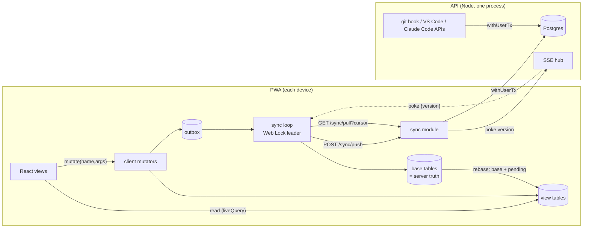

# 04 · Database and sync

> Brainstorm slice 04 of 14. Written 2026-10-05. Source of truth: `JOURNEY.md` (D-001..D-010).
> All library versions, prices and free-tier limits below were checked on **2026-10-05** unless marked *unverified*.

---

## 1. TL;DR

- **Database:** plain **PostgreSQL** (18.x today; 17 is fine) used as a boring, host-agnostic relational database. No provider-specific features (no Supabase Auth/RLS/Realtime, no Neon branching in the app path), so the host can be swapped in an hour with `pg_dump`/`pg_restore`.
- **Host:** follow the compute choice from slice 07. If the API runs as one always-on process on a small VPS, put Postgres **on the same VPS** (€0 extra, no cold starts, no free-tier traps). If there is no VPS, use **Supabase's free tier purely as a Postgres host**. Pick **Neon only if the API is serverless**, because Neon's free 100 CU-hours run out when an always-on process keeps querying it (0.25 CU × 730 h = 182 CU-h).
- **Sync model:** **server-authoritative sync with a full per-user replica on the client**. The server is the referee for every invariant. The client keeps a complete copy of the user's data in IndexedDB (Dexie) and renders from it, so the UI is instant and offline-capable. This is the Replicache push/pull protocol, hand-rolled and simplified, because one user's planner data is tiny (roughly 5k rows a year).
- **Protocol:** client-generated UUIDs; mutations are named intents with a per-client sequence number (idempotent, strictly ordered); every user has one `version` counter bumped under a row lock, so the pull cursor (`/sync/pull?cursor=epoch:version`) can never skip a change because of commit-order races; deletes are tombstones with a retention horizon; a sync `epoch` protects clients after a backup restore.
- **Conflicts:** **per-field last-writer-wins ordered by a hybrid logical clock (HLC)**, plus a few semantic rules where LWW is wrong: deletes win; logged time is never dropped; a user's timer sessions never overlap (enforced by a Postgres exclusion constraint); cancelling the same occurrence twice converges because exception IDs are deterministic.
- **Recurrence:** occurrences are **never stored or synced**. Series and exceptions are synced; both client and server expand them with the same shared TypeScript function (slice 01). Offline week views therefore work for any week, not just ones you have visited.
- **Offline:** viewing any week, quick capture, cancel/skip, attendance review, tasks, drag-to-calendar and start/stop timer all work offline. Semester swaps, imports, "this and following" splits and bulk operations are online-only.
- **Caching:** no Redis. Postgres's own buffer cache and per-user index range scans are enough up to 10k users. The per-user `version` doubles as a cache key and ETag for server-computed aggregates, so cache invalidation becomes trivial.
- **Build it as a ladder** (L0 idempotent mutations → L1 persisted reads → L2 outbox → L3 full replica → L4 pokes). Each rung ships on its own, and the schema carries the sync columns from day one so nothing needs migrating later.

---

## 2. Assumptions about other slices

These are the places where this design depends on another slice. If a critic finds a mismatch, it will be on one of these lines.

| Slice | Assumption |
|---|---|
| **01-recurrence** | A series stores **local wall-clock time + IANA time zone + an RRULE subset**, not UTC instants. Occurrences are virtual, identified by `(series_id, original_local_date)`. An exception can cancel, skip or **move** one occurrence (`moved_start_at/moved_end_at`). "This and following" **splits** a series: the old series gets an `until` date and a `successor_id` pointing to the new series. Expansion is a **pure, deterministic TypeScript function** (`expand(series, exceptions, window, tz)`) shared by client and server. There is also a `generatesOn(series, date)` predicate. |
| **02-data-model** | IDs are **UUIDs generated on the client** (UUIDv7 for normal entities). I additionally propose **UUIDv5** (deterministic) IDs for occurrence exceptions; see §4.4. Every synced table carries `user_id`, `version bigint`, `field_clock jsonb`, `deleted_at timestamptz` (soft delete). Entities in scope: groups (D-004), series, occurrence exceptions, day reviews (D-010), projects, tasks, planned blocks (task dragged onto the calendar), sessions, dump items, attachments, commit refs. |
| **03-backend-system-design** | A **TypeScript modular monolith** running as one long-lived Node process (Hono or Fastify), with a shared `packages/shared` workspace for zod schemas. The ORM/query builder is Drizzle 0.45.x or Kysely. The sync module uses raw SQL through the same driver because it needs explicit isolation levels and savepoints. |
| **05-sessions-and-realtime** | The timer is **server-owned** (JOURNEY §5). By default **a user has at most one running session**, and a user's sessions do not overlap. Heartbeats (D-009) update `last_seen` in a narrow, **non-synced** table. A periodic sweeper materialises the lazy session close. Realtime is a **poke over SSE** (`{version}`) and the client then pulls. Without 05, the client polls. |
| **06-auth-and-identity** | Each request resolves to a `userId`. Each browser profile registers a `clientId` that belongs to exactly one user. Integrations (git hook, VS Code, Claude Code) authenticate with their own tokens and call normal server APIs. They are not sync clients. |
| **07-infra-and-deployment** | Either (a) one small always-on VPS running the API (my default host for Postgres too), or (b) a container host plus managed Postgres. Object storage (Cloudflare R2) is available for backups. If 07 chooses serverless functions, the DB host recommendation flips to Neon (§4.6). |
| **08-integrations** | Integrations write through server endpoints that use the same `withUserTx` helper, so their writes bump the user's version and reach the PWA through normal pulls. |
| **09-frontend** | A **React + Vite PWA** with a service worker from **Serwist**. Components read data through hooks backed by Dexie `liveQuery`. Other frameworks would also work, since Dexie's `liveQuery` is framework-agnostic. |
| **10-scheduling-algorithms** | "Time back" suggestions and the estimation multiplier are pure TS functions that can run on the client replica, so they work offline. |
| **11-capture** | Voice capture stores the audio blob locally first. Upload and transcription happen later and asynchronously. |
| **12-ux-flows** | Conflicts are surfaced as **quiet notices** (a toast or an inbox entry), never blocking "resolve conflict" dialogs. There is an outbox indicator ("3 changes waiting to sync"). |
| **13-build-plan** | v0 is allowed to take the first three or four rungs of the sync ladder (§5.12). Dogfooding v0 is how sync bugs are found on low-stakes data. |

---

## 3. Three genuinely different approaches

Two choices are mostly independent: *how the client and server keep data in step* (§3.1) and *which database engine and host* (§3.2). §3.3 records the current state of every sync engine I checked.

### 3.1 Sync architecture

| Approach | Pros | Cons | Solo-dev effort | Interview value |
|---|---|---|---|---|
| **A. Server-first + persisted query cache.** Postgres + REST. TanStack Query with optimistic updates, cache persisted to IndexedDB. Offline = read-only for screens already visited, plus a small capture queue. | • Least code; well-documented patterns • DB is the only state, so it's easy to debug • No sync protocol to get wrong | • Offline writes fail, except special-cased capture • Weeks you haven't visited are blank offline • Optimistic updates must patch several query keys (week, task list, project view), which gets messy • Every tap waits on the network (campus Wi-Fi; 150–250 ms RTT to an EU host) • Retrofitting offline writes later means retrofitting idempotency | **~6–8 focused days** for the data layer | **Medium.** "CRUD with caching": you can discuss invalidation and optimistic updates, but it's the default answer. |
| **B. Server-authoritative sync, hand-rolled (recommended).** Postgres with a per-user version cursor. The client holds a full replica in IndexedDB (Dexie) plus an outbox of pending mutations. Push/pull protocol; per-field HLC last-writer-wins; tombstones. | • Everything core works offline, and every tap is instant • One generic protocol covers all entities • The server still enforces invariants (one running timer, ownership) • No extra infrastructure • Every line can be explained • Builds incrementally (the ladder) | • You own subtle correctness: cursor races, rebase, tombstones, restore epochs • Needs a convergence test harness • Client recurrence expansion must match the server (mitigated by sharing the code) • Roughly 2–3× the client code of A | **~13–15 focused days** for the full ladder on calendar entities; each later entity costs ~0.5–1 day | **High.** A real distributed-systems story: idempotency, commit-order anomalies, isolation levels, HLCs, tombstones, epochs. |
| **C. Off-the-shelf local-first engine.** **PowerSync** (SQLite in the browser, synced from Postgres; writes go through your API via an upload queue). Zero and Electric were considered and rejected (see prose). | • Battle-tested client DB, upload queue, multi-tab handling, incremental sync, reactive SQL queries • Your backend still owns the write path and conflict rules • Fewer of your own subtle bugs | • An extra service to run (PowerSync service + bucket storage), or a Cloud free tier that is **deactivated after 1 week of inactivity** and capped at 50 concurrent clients • Needs Postgres logical replication • A sync-rules/streams DSL to learn • wa-sqlite/OPFS quirks on iOS Safari; bigger bundle • The architecture is shaped by the vendor | **~8–12 focused days** (less code, more infra and learning) | **Medium-high.** Shows tool judgement, but the hard parts sit inside someone else's box and are harder to explain from first principles. |

**Approach A** is what most CRUD apps do. It would be the right answer if this app were only used at a desk. But JOURNEY's core loop happens on a phone at college: "a class was cancelled, grey it out", "capture a thought before it's gone", "start the timer". Those are exactly the moments when KIIT Wi-Fi or mobile data is flaky. Under A, cancel-on-phone fails without signal, and capture needs its own queue anyway, which is half of approach B built badly. A also leaves the week view empty offline unless you happened to open that week earlier. A has a second, quieter cost: optimistic updates in TanStack Query are per query key. Completing one task touches the task list, the project tree, today's view and maybe a planned block, and each needs `setQueryData` with rollback. That code tends to rot.

**Approach B** gives the client a full replica of the user's own data. That sounds heavy, but it isn't for a personal planner. A busy student creates a few thousand rows a year (§4.7), so even after three years the replica is a few megabytes. Because the replica is *complete*, the hardest problem in general sync engines, partial replication ("which rows does this client need?"), simply doesn't arise. The server stays authoritative: clients send *intents* ("cancel occurrence X", "start timer on task Y at 10:00"), not raw row writes. The server applies them in order, enforces invariants and returns the canonical rows. This is the model Replicache popularised and Linear-style apps use. The difference is that here it is ~600 lines of code you wrote and can explain.

**Approach C** is the "don't build your own sync engine" answer, and it deserves respect (see the steelman in §4.8). I evaluated the engines and **PowerSync is the only mature, alive engine that supports offline writes against your own Postgres** at this budget. **Zero 1.0** (stable since June 2026) is excellent, but its docs say plainly that **offline writes are rejected**: reads keep working, writes return an offline error. That disqualifies it for offline capture and cancel. **Electric** only does the read path ("Electric does not do write-path sync"), so you would still build the outbox and write path yourself, which brings you most of the way back to B. PowerSync fits functionally, but adds a service to operate (or a free tier that sleeps after a week of inactivity), logical replication, and a DSL. For one user with a small dataset, that is more machinery than the problem needs.

### 3.2 Database engine and host

| Option | Range queries over time | Recurrence exceptions | JSON | Cost (free tier, checked 2026-10-05) | Backups | Interview value | Verdict |
|---|---|---|---|---|---|---|---|
| **Postgres, self-hosted on the API's VPS** | Excellent: `timestamptz`, `tstzrange`, `daterange`, GiST, exclusion constraints | Unique `(series_id, original_date)`, partial indexes, `ON CONFLICT` upserts | `jsonb` with GIN if ever needed | €0 marginal on a VPS you already pay for (Hetzner CX23 is €5.49/mo after the June 2026 increase; Oracle Always Free ARM is now 2 OCPU/12 GB) | Yours: nightly `pg_dump` → R2, restore drills | **High**: you can talk about MVCC, isolation, vacuum and backups because you run them | **Default if 07 picks a VPS** |
| **Supabase (as plain Postgres)** | Same engine | Same | Same | Free: 500 MB DB, **paused after 1 week inactive**, 2 active projects, **no backups**, 200 pooler connections. Pro $25/mo (8 GB, 7-day backups) | Free tier has none, so you must run your own dumps | Medium (managed); low if you lean on Supabase's auth/RLS/realtime | **Default if there's no VPS** and the API is always-on |
| **Neon (serverless Postgres)** | Same engine | Same | Same | Free: 100 CU-h/project/month, autoscale to 2 CU, **scale-to-zero after 5 min (cannot be disabled)**, 1 GB/project (pricing page today; some summaries still say 0.5 GB), 6 h PITR, 5 GB egress. Launch: $0.106/CU-h, $0.35/GB-mo, no minimum | 6 h PITR on free; still do your own dumps | Medium; branching is a nice dev story | **Best fit only for a serverless API.** An always-on poller (job queue, scheduler, `LISTEN`) keeps it awake and burns the CU budget |
| **SQLite + Litestream on the VPS** | Good, but no native interval types; store epoch ms or ISO text | Fine | `json`/`jsonb` functions | €0 | Litestream 0.5.x (actively released, 0.5.17 in Aug 2026) streams to R2 | Medium-high ("SQLite in production" is trendy) | Strong runner-up. Lost on types, exclusion constraints, ecosystem, and being the database interviewers expect |
| **Turso (libSQL / Turso DB)** | SQLite semantics | Fine | SQLite JSON | Free: 100 DBs, 5 GB, 500M rows read, **10M rows written/mo**; Developer $4.99. Turso Sync (offline push/pull) is **public beta** | Provider PITR (1 day free) | Medium; database-per-user is an interesting story | DB-per-user means fanning schema migrations out to N databases. Offline sync is beta and vendor-specific. Not for v0–v2 |
| **Cloudflare D1** | SQLite semantics | Fine | SQLite JSON | Free: 500 MB per DB, 5 GB total, 5M rows read/day, **100k rows written/day**; 10 GB hard cap per DB even on paid | Time Travel (provider) | Medium | Ties the backend to Workers. The 10 GB per-DB cap forces sharding by user eventually. Rejected |
| **Document / BaaS** (Firestore, MongoDB Atlas, InstantDB) | Weak for interval queries and aggregates | Workable | Native | InstantDB free: 1 GB, never paused; Pro $30 | Provider | Low to medium | The data is relational (tasks ↔ projects ↔ sessions ↔ series) with transactional invariants. Rejected |

**Why Postgres wins here.** The app's hardest queries are about *time*: "what overlaps this week", "do these two groups clash", "which sessions overlap". Postgres has first-class types for these (`tstzrange`, `daterange`) and can *enforce* time invariants with exclusion constraints. "A user's sessions never overlap" becomes one line of DDL instead of a race-prone application check (§5.2). Recurrence exceptions are a textbook use of a unique key plus `INSERT … ON CONFLICT`. `jsonb` holds the per-field clocks. The sync design needs `REPEATABLE READ` snapshots and per-user row locks, and Postgres does both well. Finally, it is the database most interviewers will probe, and running it yourself (vacuum behaviour under heartbeat churn, backups, restore drills) gives you real stories to tell.

**Why the host is a separate, reversible decision.** Free tiers changed a lot this year: Neon repriced after the Databricks acquisition, Oracle halved its free ARM allowance, and Hetzner raised prices 37%. The defence is to use only vanilla Postgres features, keep the schema in migrations, and keep your own backups. Moving hosts is then a dump, a restore and a connection-string change.

### 3.3 Sync engines checked (state on 2026-10-05)

| Engine | State | Pricing | Fit for this app |
|---|---|---|---|
| **Zero** (Rocicorp) | **1.0 stable (June 2026)**, open source | Self-host free; managed from $30/mo | **Offline writes rejected by design.** Out. |
| **Replicache** | **Maintenance mode**, now free and open source | Free | Its protocol is the blueprint for approach B, but don't take a dependency on a frozen library |
| **ElectricSQL** | 1.x (GA March 2025); **read-path only** | Electric Cloud pay-as-you-go: $1 per million writes, $0.10/GB-month; bills under $5 waived | You'd still build writes and the outbox yourself |
| **TanStack DB** | **0.6.x beta**; `@tanstack/offline-transactions` 1.0.30 (outbox, Web Locks leader election) | Free | Promising. Plan B for the client half of approach B if hand-rolled code gets hairy (§4.9) |
| **PowerSync** | Active; Sync Streams GA May 2026; Open Edition self-host under FSL (converts to Apache 2.0) | Cloud free: 2 GB synced/mo, 500 MB hosted, 50 peak clients, **deactivated after 1 week inactive**; Pro $49/mo | Approach C's pick |
| **Triplit** | Team joined Supabase (Oct 2025); code open-sourced, no longer a company product | n/a | Don't start on it |
| **Jazz** | 2.0 **alpha** (alpha.56) | Hosted tiers | Too early |
| **InstantDB** | Active | Free 1 GB, never paused; Pro $30 | Proprietary data model; you don't own a Postgres |
| **RxDB** | 17.5.0 | Core free; production-grade IndexedDB/OPFS storages are **premium ($99/mo, billed annually)** | Overkill, and the useful parts cost money |
| **LiveStore** | 0.4.0 (June 2026), beta | Free | Event-sourcing model; beta |
| **Automerge / Yjs** | Automerge 3.x (big memory improvements); Yjs 13.6.32 | Free | CRDTs for collaborative documents. Overkill for structured planner rows (Trap 3) |
| **Turso Sync** | Public beta | Turso plans | Vendor-specific; beta |

---

## 4. Recommendation

**Plain Postgres as the single source of truth, plus a hand-rolled, server-authoritative push/pull sync protocol, with a full per-user replica in IndexedDB on each client.** Conflicts are resolved by per-field HLC last-writer-wins plus a handful of semantic rules. Recurring occurrences are expanded on read, never stored. It is built as a ladder so every rung ships.

### 4.1 Architecture



The client has two copies of each entity table. **Base tables** hold exactly what the server last said. Only the sync loop writes them. **View tables** are what the UI reads: base plus pending local mutations. A local action writes to the view table and the outbox in one IndexedDB transaction, so the UI updates instantly. When a pull arrives, the sync loop rewrites the base tables, drops mutations the server has acknowledged, resets the affected view rows to base, and replays whatever is still pending. This is Replicache's "server snapshot + pending mutations" model, made explicit as two sets of Dexie tables.

### 4.2 Why this, specifically

1. **The data is per-user and small**, so a full replica is cheap. That removes partial replication, the most complex part of any sync engine.
2. **The app's key moments are mobile and offline-prone** (cancelled class, capture, timer), and the builder is far from any cheap server region. With a local replica, network latency never sits in the interaction path.
3. **The server stays the referee.** Timer invariants, ownership checks, split-series lineage and bulk imports all run in one place, in SQL transactions. That is much easier to reason about than peer-to-peer CRDT merges.
4. **Everything is explainable.** Each mechanism (version cursor, sequence numbers, HLC, tombstones, epoch) solves one named problem, and §7 has a failing test for each problem.
5. **No new infrastructure.** One Node process and one Postgres, the same as approach A.
6. **Recurrence works offline** because the client has series and exceptions and runs the same expansion code as the server. As a bonus, the moment a class is cancelled offline, the "you just got time back" algorithm can already see the freed gap.

### 4.3 What works offline

| Action | Offline? | Mechanism |
|---|---|---|
| View today, this week, any past or future week | **Yes** | Full replica + local expansion |
| Quick capture (text) | **Yes** | Outbox; must never fail |
| Voice capture | Record **yes**; upload and transcription later | Blob saved in IndexedDB; separate upload queue; dump item created immediately with `attachment.status = 'pending_upload'` |
| Cancel / skip an occurrence ("Prof cancelled" / "I skipped", D-005) | **Yes** | Deterministic exception ID |
| Evening attendance review (D-010) | **Yes** | `day_review` row + skip exceptions |
| Move a single occurrence | **Yes** | Exception with `moved_*` fields |
| Create / edit / complete / reorder tasks and projects | **Yes** | Per-field LWW; fractional sort keys |
| Drag a task onto the calendar | **Yes** | Creates a `planned_block` |
| Start / stop timer | **Yes (provisional)** | Client timestamps, skew-corrected and clamped by the server |
| Edit a whole series (e.g. move a run from 18:00 to 18:30 for all days) | **Yes** | Field patch on the series |
| "This and following" split, create/archive groups and semester swap (D-004), uni-calendar import (D-008), holiday bulk-cancel (D-003) | **Online-only** | Multi-row, validated against fresh state; the UI disables the button offline |
| Stats older than the replica, account settings, integration tokens, push subscription | **Online-only** | Plain REST + TanStack Query |

### 4.4 The conflicts this app will actually see

| Scenario | Rule | Outcome |
|---|---|---|
| Phone and laptop edit **different fields** of the same task | Per-field LWW | Both edits kept |
| Phone and laptop edit the **same field** | HLC LWW | The causally-later edit wins. A stale offline edit that arrives late loses |
| Both devices **cancel the same occurrence** while offline | Exception ID = `uuidv5(series_id + original_date)`, plus per-field LWW | One row. The latest reason ("prof cancelled" vs "skipped") wins |
| Phone cancels an occurrence offline while the laptop splits the series ("this and following") | The server follows `successor_id` | The cancel lands on the new series, or is rejected as `occurrence_gone` with a notice |
| Edit vs delete | **Delete wins** (tombstones are terminal unless an explicit `restore` arrives) | The edit is acknowledged as rejected (`deleted`) |
| A timer session logged offline against a task deleted elsewhere | **Logged time is never dropped** | Session kept and the task restored, with a notice (open decision §9.5) |
| Timer started on two devices | A user's sessions never overlap. The latest start owns "running"; an earlier start ends where the next session begins | Exactly one running session; a consistent timeline |
| Same task started twice within 60 s | Treated as a duplicate start | Merged into one session |
| Offline "stop" for a session another device already closed | `ended_at = min(requested, next session start)` | No overlap |
| Two devices reorder the same list | Fractional `sort_key`, LWW, ties broken by `id` | Deterministic order on every device |
| Dump captures on both devices | Pure creations | No conflict possible |

**Why per-field LWW instead of per-row.** The most likely real conflict is two devices touching *different* fields: rename on the laptop, tick "done" on the phone. Per-row LWW would silently lose one of them. Per-field costs one `jsonb` column.

**Why an HLC instead of wall-clock timestamps.** Phone clocks drift. Suppose the phone runs three minutes slow. You edit a title on the laptop, pick up the phone (which has already synced the laptop's edit) and edit the title again. Wall clocks would say the phone's edit is older, so your newest intent is lost. An HLC moves past any clock it has seen, so the phone's edit is stamped later than the laptop's, which matches what happened. It's about 30 lines of code.

**Why not arrival order ("server applies whatever arrives last").** Arrival order is fine when everyone is online. It's wrong for exactly the case this design exists for: a phone that was offline for an hour pushes an edit made an hour ago over a newer one.

**Why not conflict dialogs.** For a personal planner, a modal asking "which version of 'Lab report' do you want?" is worse than a predictable rule with a quiet notice.

### 4.5 Caching stance

- **No Redis.** At 10k users the hot path is "one primary-key lookup + a few `(user_id, version)` index range scans that usually return nothing". Postgres serves that from `shared_buffers` in about a millisecond. Redis would add a second stateful service, a second thing to back up, and cache-invalidation bugs, all to speed up queries that are already fast. I would revisit only for cross-instance pub/sub or rate limiting once there are several API instances, and even then Postgres `LISTEN/NOTIFY` covers pub/sub.
- **The version is the cache key.** Any server-computed aggregate (attendance percentage, estimation multiplier history, weekly stats) is a pure function of the user's data at a given `version`. So the ETag is `W/"<epoch>:<version>"`: one PK lookup, a 304 if unchanged, and no stale caches ever. An optional in-process LRU keyed by `(userId, version, endpoint)` needs no invalidation logic at all.
- **HTTP.** Sync endpoints are `Cache-Control: no-store` (private, and the cursor already makes them incremental). Hashed static assets are `public, max-age=31536000, immutable`. `index.html` is `no-cache`. The service worker precaches the shell and **never** caches `/api/*` (Trap 9).
- **Client.** The Dexie replica is the cache for synced entities. TanStack Query is used only for online-only, server-computed endpoints, with the user version in the query key so they refetch after changes.

### 4.6 Hosting rule of thumb

| If slice 07 chooses… | Put Postgres… | Because |
|---|---|---|
| One always-on VPS for the API | On the **same VPS** (Docker, pinned major), nightly encrypted dumps to R2 | €0 extra, ~0 ms DB latency, `LISTEN/NOTIFY` and pollers are free |
| An always-on container host without a VPS | **Supabase free, as plain Postgres** (Mumbai/Singapore region if offered) | Always-on micro compute, so no CU-hour budget. Daily use prevents the 7-day pause. 500 MB lasts one user for decades and ~100 users for a while |
| Serverless functions | **Neon free**, pooled connection string | Scale-to-zero matches request-driven compute. Cold starts (~0.3–1 s) are hidden by the local replica |

### 4.7 Growth and scale estimates

Per **heavy** user per year: ~40 series, ~150 exceptions, 365 day reviews, ~2,000 tasks, ~1,500 planned blocks, ~2,500 sessions, ~1,000 dump items, ~3,000 commit refs. That is about 10k rows, **~4 MB of heap plus ~3 MB of indexes ≈ 7 MB/year**. A typical user is closer to 2 MB/year. The client replica is ~2–4 MB of JSON per year of history (~0.5 MB gzipped on first sync).

| | 1 user (Atif) | 1k registered (~300 active) | 10k registered (~3k active) |
|---|---|---|---|
| DB size growth | ~7 MB/yr | ~1–2 GB/yr | ~10–20 GB/yr |
| Sync writes | < 1/min | ~0.5/s average | ~6/s average, ~60/s peak |
| Heartbeat updates (D-009, non-synced table) | trivial | ~8/s peak | ~83/s peak (JOURNEY's math) |
| Pulls | trivial | ~10/s | ~20/s typical; ~130/s pessimistic (8k open tabs polling every 60 s) |
| Host | Any free tier | VPS disk, or Neon Launch ≈ $1–5/mo; Supabase free fills in months | 4–8 GB VPS (~€10–20/mo) or managed ≈ $25–50/mo |
| Connections | pool of 5 | pool of 10 | pool of 20; PgBouncer only if more than one API instance |
| Partitioning / read replicas | No | No | No. Revisit at ~100M session/commit rows |

The bottleneck at every size is **operations** (backups, upgrades), not performance. A single 2-vCPU Postgres handles thousands of indexed point queries per second. The "no changes" fast path (§5.4) makes most pulls one PK lookup.

### 4.8 The strongest argument against

> "You are hand-rolling a sync engine, which is the canonical thing senior engineers tell you not to do. Sync bugs don't crash. They silently lose a cancelled class or an hour of logged time, and you find out weeks later. PowerSync has already solved the upload queue, multi-tab leadership, incremental sync, schema migrations on the client, and dozens of iOS IndexedDB/OPFS quirks you haven't discovered yet. Your scarce hours should go into what makes this app different, the recurrence engine and scheduling, not reinventing infrastructure. And for interviews, 'I chose PowerSync, wrote the server-side conflict rules in my upload handler, and here is why Zero didn't fit' is still a strong, mature story.
>
> Worse, you may not need any of it. You are one person, mostly on one device at a time. Approach A plus a capture queue covers the 95% case (lost signal in a corridor), and v0's goal is to dogfood a calendar in two weeks, not to build a distributed system."

This is a good argument and parts of it are right: sync bugs are silent, and the time cost is real. My answer has three parts. First, the design is deliberately the *narrow* version of the problem: one user's data, a full replica, a server referee, LWW. It is not a general engine, and §7 lists a failing test for every known failure mode, including a property-based convergence test. Second, the ladder means v0 can stop at L1 or L2 if dogfooding shows offline writes don't matter. Third, the server-side half (idempotent named mutations, the version cursor, `withUserTx`) is exactly what PowerSync's upload handler would need anyway, so the switch cost stays low.

### 4.9 When I would switch

- **To PowerSync (approach C):** if the L3 replica isn't converging reliably (the property test still finds bugs) after **~5 focused days past its estimate**, or if iOS storage or IndexedDB problems eat more than a few days. The server mutators carry over unchanged as PowerSync's upload endpoint.
- **To TanStack DB + `@tanstack/offline-transactions` for the client half:** if TanStack DB reaches 1.0 before v1 and the hand-rolled client rebase code grows past ~800 lines.
- **Down to approach A (stop at L2):** if two weeks of v0 dogfooding show that the only offline writes are captures and cancels. Then ship L2 (persisted reads + outbox for those two mutations) and spend the time on recurrence.
- **To a partial replica:** if any single user's replica exceeds ~20k rows, or the first sync exceeds ~2 MB gzipped. Archived groups and sessions older than a year move to online-only endpoints.
- **To a real sync engine (Zero/Electric):** if shared projects or multi-user collaboration ever arrive. Partial replication across users is where those engines earn their complexity.

---

## 5. Implementation walkthrough

### 5.1 Modules

```
packages/shared/                 # imported by server AND client
  schema/            entities.ts      # zod schemas for every synced row
  sync/              mutations.ts     # mutation names, zod args, client mutators
                     hlc.ts           # hybrid logical clock (pure)
                     lww.ts           # mergeFields() — per-field LWW (pure)
                     timer.ts         # resolveStart()/resolveStop() (pure)
                     ids.ts           # uuidv7(), exceptionId() = uuidv5(...)
                     protocol.ts      # PushRequest/PullResponse types, Cursor codec
  recurrence/        (slice 01)       # expand(), generatesOn()

apps/server/src/
  db/                pool.ts, migrations/
  sync/              withUserTx.ts, push.ts, pull.ts, pokes.ts, gc.ts, epoch.ts
  mutators/          task.ts, occurrence.ts, timer.ts, dump.ts, ...  # server handlers
  calendar/          weekQuery.ts     # server-side expansion (notifications, ICS, conflict view)
  routes/            sync.routes.ts

apps/web/src/
  data/              db.ts (Dexie), localTx.ts, mutate.ts
  sync/              syncLoop.ts, applyPull.ts, triggers.ts, outboxBadge.ts
  hooks/             useWeek.ts, useTasks.ts, ...
  sw/                sw.ts (Serwist)
```

The rule is **share the decisions, not the I/O**. Pure functions (LWW merge, timer resolution, recurrence expansion, ID derivation) live in `shared` and run on both sides. Reading and writing rows is implemented separately: SQL on the server, Dexie on the client.

### 5.2 Server schema (sync-relevant parts)

```sql
-- ─── Sync bookkeeping ────────────────────────────────────────────────
create table sync_state (
  user_id            uuid primary key references users(id) on delete cascade,
  version            bigint not null default 0,     -- bumped once per write transaction
  tombstone_horizon  bigint not null default 0      -- cursors below this must reset
);

create table sync_clients (
  client_id          uuid primary key,              -- one per browser profile per user
  user_id            uuid not null references users(id) on delete cascade,
  last_mutation_seq  bigint not null default 0,
  app_version        text,
  created_at         timestamptz not null default now(),
  last_seen_at       timestamptz not null default now()
);
create index on sync_clients (user_id);

create table sync_rejections (                      -- outcome of rejected mutations, kept 30 days
  client_id  uuid not null references sync_clients(client_id) on delete cascade,
  seq        bigint not null,
  code       text not null,                          -- 'deleted' | 'not_found' | 'occurrence_gone' | ...
  detail     text,
  created_at timestamptz not null default now(),
  primary key (client_id, seq)
);

create table sync_meta (key text primary key, value text not null);
insert into sync_meta values ('epoch', gen_random_uuid()::text);  -- changed on every restore

-- Guard: any UPDATE of a synced row must raise its version (catches forgotten bumps)
create function sync_version_guard() returns trigger language plpgsql as $$
begin
  if new.version <= old.version then
    raise exception 'sync: version must increase on %.% (old %, new %)',
      tg_table_name, old.id, old.version, new.version;
  end if;
  return new;
end $$;

-- ─── Example synced tables (business columns belong to slice 02) ─────
create table tasks (
  id           uuid primary key,                     -- client-generated UUIDv7
  user_id      uuid not null references users(id) on delete cascade,
  project_id   uuid references projects(id),
  title        text not null check (length(title) between 1 and 500),
  status       text not null default 'open' check (status in ('open','done')),
  sort_key     text not null,                        -- fractional index
  estimate_min int  check (estimate_min > 0),
  due_date     date,
  -- sync columns: identical on every synced table
  version      bigint not null,
  field_clock  jsonb  not null default '{}'::jsonb,  -- {"title": "<hlc>", "status": "<hlc>"}
  deleted_at   timestamptz,
  created_at   timestamptz not null default now(),
  updated_at   timestamptz not null default now()
);
create index tasks_sync_idx    on tasks (user_id, version);
create index tasks_project_idx on tasks (user_id, project_id) where deleted_at is null;
create index tasks_gc_idx      on tasks (deleted_at) where deleted_at is not null;
create trigger tasks_version_guard before update on tasks
  for each row execute function sync_version_guard();

create table occurrence_exceptions (
  id              uuid primary key,                  -- uuidv5(series_id || '|' || original_date)
  user_id         uuid not null references users(id) on delete cascade,
  series_id       uuid not null references series(id),
  original_date   date not null,                     -- local date of the unmodified occurrence
  status          text not null check (status in ('cancelled','skipped','moved','attended')),
  cancel_reason   text check (cancel_reason in ('prof_cancelled','self_skipped')),
  moved_start_at  timestamptz,
  moved_end_at    timestamptz,
  version bigint not null, field_clock jsonb not null default '{}', deleted_at timestamptz,
  created_at timestamptz not null default now(), updated_at timestamptz not null default now(),
  unique (series_id, original_date),
  check ((moved_start_at is null) = (moved_end_at is null))
);
create index on occurrence_exceptions (user_id, version);
create index on occurrence_exceptions (user_id, original_date);
create index on occurrence_exceptions (user_id, moved_start_at) where moved_start_at is not null;

create extension if not exists btree_gist;
create table sessions (
  id          uuid primary key,
  user_id     uuid not null references users(id) on delete cascade,
  task_id     uuid references tasks(id),
  source      text not null check (source in ('manual','git','vscode','claude')),
  started_at  timestamptz not null,
  ended_at    timestamptz,                           -- null = running
  note        text,
  version bigint not null, field_clock jsonb not null default '{}', deleted_at timestamptz,
  created_at timestamptz not null default now(), updated_at timestamptz not null default now(),
  check (ended_at is null or ended_at >= started_at),
  -- A user's live sessions never overlap; this also implies at most one running session.
  constraint sessions_no_overlap exclude using gist (
    user_id with =,
    tstzrange(started_at, coalesce(ended_at, 'infinity'::timestamptz), '[)') with &&
  ) where (deleted_at is null)
);
create index on sessions (user_id, version);
create index on sessions (user_id, started_at);

-- Heartbeat churn lives OFF the synced row (D-009): narrow table, HOT-update friendly.
create table session_liveness (
  session_id uuid primary key references sessions(id) on delete cascade,
  last_seen  timestamptz not null
) with (fillfactor = 70);
```

`planned_blocks`, `series`, `groups`, `projects`, `dump_items`, `day_reviews`, `attachments` and `commit_refs` follow the same pattern: business columns from slice 02, plus the five sync columns, `(user_id, version)` index and the guard trigger. A migration helper `addSyncColumns(table)` generates them so no table is forgotten. A test (T22) asserts that every table in `SYNCED_TABLES` has the trigger.

### 5.3 Wire protocol (TypeScript)

```ts
// packages/shared/sync/protocol.ts
export type Hlc = string;                       // "000001759650300000:0000:k3f9" (sortable as text)
export interface Cursor { epoch: string; version: bigint }   // wire form "epoch:version"

export interface MutationWire {
  seq: number;              // per-client, strictly increasing from 1
  name: MutationName;       // e.g. "task.patch", "occurrence.setStatus", "timer.start"
  args: unknown;            // validated by the same zod schema on both sides
  hlc: Hlc;                 // stamped when the user acted
  at: number;               // device wall-clock ms when the user acted (for timers)
}

export interface PushRequest  { clientId: string; appVersion: string; clientNow: number; mutations: MutationWire[] }
export interface PushResponse { results: Array<{ seq: number; status: 'applied' | 'duplicate' | 'rejected'; code?: string }> }

export type SyncedTable =
  | 'groups' | 'series' | 'occurrence_exceptions' | 'day_reviews' | 'projects' | 'tasks'
  | 'planned_blocks' | 'sessions' | 'dump_items' | 'attachments' | 'commit_refs';

export interface PullResponse {
  type: 'delta' | 'reset';                  // reset = drop base tables, this is a full snapshot
  cursor: string;                           // "epoch:version" to send next time
  lastMutationSeq: number;                  // read in the SAME snapshot as the rows
  maxHlc: Hlc;                              // client advances its HLC past this
  changes: Partial<Record<SyncedTable, Array<Row | Tombstone>>>;
}
export interface Tombstone { id: string; version: string; deleted_at: string }
```

Two deliberate choices. **Mutations are named intents, not row diffs**, so the server can apply business rules (follow a split series, close the running timer) that a row diff can't express. **Updates are field patches, never full rows**, so an older app version that doesn't know about a new column can't wipe it (Trap 13).

### 5.4 Server: the four key functions

**`withUserTx`: the one door every write goes through** (sync pushes, integrations, sweepers, imports).

```ts
// apps/server/src/sync/withUserTx.ts   (postgres.js 3.4.x style)
export function withUserTx<T>(userId: string, fn: (tx: Tx, version: bigint) => Promise<T>): Promise<T> {
  return sql.begin(async (tx) => {
    // Takes the per-user row lock AND allocates this transaction's version.
    // Concurrent writers for the same user queue here, so versions commit in order.
    const [{ version }] = await tx`
      insert into sync_state (user_id, version) values (${userId}, 1)
      on conflict (user_id) do update set version = sync_state.version + 1
      returning version`;
    return fn(tx, BigInt(version));
  });
}
```

*Why a per-user counter and not `updated_at` or a global sequence?* Timestamps and `nextval()` are assigned when a statement runs, not when the transaction commits. Say transaction T1 takes sequence 104 and commits late, while T2 takes 105 and commits early. A pull between the two commits sees 105, returns cursor 105, and **104 is never delivered**. The per-user lock forces T2 to wait for T1, so per-user versions become visible in order. A single *global* counter row would also be correct, but it would serialise every user's writes behind one lock. The per-user version scales horizontally for free. (This is Replicache's "per-space version" strategy.)

**`push`**

```ts
export async function push(userId: string, req: PushRequest): Promise<PushResponse> {
  if (req.mutations.length > 100) throw new HttpError(413);
  const skewMs = Date.now() - req.clientNow;              // used to correct timer timestamps
  const results: PushResponse['results'] = [];
  for (const m of req.mutations) {                        // one transaction per mutation
    results.push(await withUserTx(userId, async (tx, version) => {
      const [cl] = await tx`select last_mutation_seq from sync_clients
                            where client_id = ${req.clientId} and user_id = ${userId} for update`;
      if (!cl) throw new HttpError(409, { code: 'unknown_client' });
      const last = Number(cl.last_mutation_seq);
      if (m.seq <= last) return replayOutcome(tx, req.clientId, m.seq);   // idempotent retry
      if (m.seq !== last + 1) throw new HttpError(409, { code: 'seq_gap', expected: last + 1 });

      let outcome = { seq: m.seq, status: 'applied' as const } as PushResponse['results'][number];
      try {
        await tx.savepoint(async (sp) => {                // roll back partial work on rejection
          const def = SERVER_MUTATORS[m.name];
          if (!def) throw new Rejection('unknown_mutation');
          const args = def.args.parse(m.args);            // same zod schema as the client
          await def.apply({ tx: sp, userId, version,
                            hlc: clampHlc(m.hlc),          // ≤ server now + 60 s
                            at: correctAt(m.at, skewMs) }, args);
        });
      } catch (e) {
        if (!(e instanceof Rejection) && isInfraError(e)) throw e;   // DB down → 503, client retries batch
        outcome = { seq: m.seq, status: 'rejected', code: e instanceof Rejection ? e.code : 'internal' };
        await tx`insert into sync_rejections (client_id, seq, code, detail)
                 values (${req.clientId}, ${m.seq}, ${outcome.code}, ${String(e)})`;
        if (!(e instanceof Rejection)) log.error({ err: e, m }, 'mutator bug');  // poison-pill safe
      }
      await tx`update sync_clients set last_mutation_seq = ${m.seq}, last_seen_at = now()
               where client_id = ${req.clientId}`;
      return outcome;
    }));
  }
  pokes.publish(userId);                                   // SSE nudge to the user's other devices
  return { results };
}
```

Strict `seq === last + 1` keeps mutations in order. Duplicates are answered from `sync_rejections` (or reported as `duplicate`), so a retried push gets the same answer as the original. A mutator that throws a non-infrastructure error is recorded as rejected instead of blocking the queue forever.

**`pull`**

```ts
export async function pull(userId: string, clientId: string, cursorStr: string | null): Promise<PullResponse> {
  return sql.begin('isolation level repeatable read read only', async (tx) => {
    // Everything below is read from ONE snapshot.
    const [{ value: epoch }] = await tx`select value from sync_meta where key = 'epoch'`;
    const [st] = await tx`select version, tombstone_horizon from sync_state where user_id = ${userId}`;
    const [cl] = await tx`select last_mutation_seq from sync_clients
                          where client_id = ${clientId} and user_id = ${userId}`;
    if (!cl) throw new HttpError(409, { code: 'unknown_client' });

    const cur = cursorStr ? decodeCursor(cursorStr) : null;
    const version = BigInt(st?.version ?? 0);
    const reset = !cur || cur.epoch !== epoch || cur.version < BigInt(st?.tombstone_horizon ?? 0);
    const base = { cursor: encodeCursor({ epoch, version }), lastMutationSeq: Number(cl.last_mutation_seq) };

    if (!reset && cur!.version === version)               // fast path: nothing changed
      return { type: 'delta', ...base, maxHlc: '', changes: {} };

    const from = reset ? 0n : cur!.version;
    const changes: PullResponse['changes'] = {};
    for (const t of SYNCED_TABLES) {
      const rows = await tx`
        select * from ${tx(t)}
        where user_id = ${userId} and version > ${from}
        ${reset ? tx`and deleted_at is null` : tx``}`;     // a fresh replica needs no tombstones
      if (rows.length) changes[t] = rows.map(r => r.deleted_at ? toTombstone(r) : r);
    }
    return { type: reset ? 'reset' : 'delta', ...base, maxHlc: maxFieldClock(changes), changes };
  });
}
```

`REPEATABLE READ` matters. Under the default `READ COMMITTED`, each statement takes a new snapshot. If a writer commits between "read `sync_state.version`" and "read `tasks`", you can still be correct by ordering the reads carefully (version first), but `lastMutationSeq` could then come from a later snapshot than the rows. The client would then drop an outbox entry whose effect isn't in the rows it received, and the optimistic change would flicker away and come back. One snapshot removes that whole class of reasoning. Read-only RR transactions are cheap in Postgres.

**Generic per-field LWW patch**, used by `task.patch`, `project.patch`, `series.patch`, `dump.patch`, `block.patch` and others:

```ts
// shared/sync/lww.ts — pure, used by both sides
export function mergeFields<R extends { field_clock: Record<string, Hlc> }>(
  row: R, fields: Partial<R>, hlc: Hlc,
): { next: R; changed: (keyof R)[] } {
  const next = { ...row, field_clock: { ...row.field_clock } };
  const changed: (keyof R)[] = [];
  for (const [k, v] of Object.entries(fields) as [keyof R & string, unknown][]) {
    const prev = row.field_clock[k];
    if (!prev || hlc > prev || (hlc === prev && String(v) > String(row[k]))) {  // deterministic tie-break
      (next as any)[k] = v; next.field_clock[k] = hlc; changed.push(k);
    }
  }
  return { next, changed };
}

// apps/server/src/mutators/patch.ts
export async function applyPatch(ctx: Ctx, table: PatchableTable, id: string, fields: object) {
  const [row] = await ctx.tx`select * from ${ctx.tx(table)} where id = ${id} for update`;
  if (!row || row.user_id !== ctx.userId) throw new Rejection('not_found');   // never reveal other users' ids
  if (row.deleted_at) throw new Rejection('deleted');                          // delete wins
  assertPatchable(table, fields);                                               // whitelist per table
  const { next, changed } = mergeFields(row, fields, ctx.hlc);
  if (!changed.length) return;                                                  // lost every LWW race
  await ctx.tx`update ${ctx.tx(table)} set ${ctx.tx(pick(next, changed))},
               field_clock = ${next.field_clock}, version = ${ctx.version}, updated_at = now()
               where id = ${id}`;
}
```

**Creates** use `insert … on conflict (id) do nothing returning id`. If nothing is returned and the existing row belongs to the same user, it's a duplicate create and becomes a no-op. If the row belongs to *another* user, the mutation is rejected as `forbidden`. A client-chosen UUID must never be able to overwrite someone else's row (T18).

**Semantic mutators (two examples):**

```ts
// occurrence.setStatus — offline cancel/skip that survives a concurrent series split
async function setOccurrenceStatus(ctx: Ctx, a: { seriesId: string; originalDate: string;
    status: 'cancelled' | 'skipped' | 'attended' | null; reason?: 'prof_cancelled' | 'self_skipped' }) {
  let s = await getOwnedSeries(ctx, a.seriesId);
  while (s && !generatesOn(s, a.originalDate) && s.successor_id && a.originalDate > s.until_date)
    s = await getOwnedSeries(ctx, s.successor_id);          // follow "this and following" lineage
  if (!s || !generatesOn(s, a.originalDate)) throw new Rejection('occurrence_gone');
  const id = exceptionId(s.id, a.originalDate);             // uuidv5 → both devices pick the same id
  await upsertWithLww(ctx, 'occurrence_exceptions', id,
    { series_id: s.id, original_date: a.originalDate, status: a.status, cancel_reason: a.reason ?? null });
}

// shared/sync/timer.ts — pure decision, executed by the server (and optimistically by the client)
export function resolveStart(
  neighbours: { running: Session | null; nextStartAfter: (t: number) => number | null },
  incoming: { id: string; taskId: string; startedAt: number; source: Source },
): TimerAction[] {
  const r = neighbours.running;
  if (r && r.taskId === incoming.taskId && Math.abs(r.startedAt - incoming.startedAt) <= 60_000)
    return [{ kind: 'merge', keep: r.id, drop: incoming.id, startedAt: Math.min(r.startedAt, incoming.startedAt) }];
  const next = neighbours.nextStartAfter(incoming.startedAt);
  if (next !== null)                                       // arrived late from an offline device
    return [{ kind: 'insert', session: { ...incoming, endedAt: next } }];
  return [
    ...(r ? [{ kind: 'close', id: r.id, endedAt: incoming.startedAt } as const] : []),
    { kind: 'insert', session: { ...incoming, endedAt: null } },
  ];
}
```

The exclusion constraint is the backstop. If any path (an integration, a sweeper, a bug) tries to create overlapping sessions, the transaction fails loudly instead of corrupting the timeline.

### 5.5 Hybrid logical clock

```ts
// shared/sync/hlc.ts
export interface HlcState { wall: number; counter: number; node: string }   // persisted in meta
const enc = (s: HlcState): Hlc =>
  `${String(s.wall).padStart(15, '0')}:${s.counter.toString(36).padStart(4, '0')}:${s.node}`;
const dec = (h: Hlc) => { const [w, c, n] = h.split(':'); return { wall: +w, counter: parseInt(c, 36), node: n }; };

export function tick(s: HlcState, now = Date.now()): Hlc {        // local event
  if (now > s.wall) { s.wall = now; s.counter = 0; } else { s.counter++; }
  return enc(s);
}
export function receive(s: HlcState, remote: Hlc, now = Date.now()): void {   // after every pull
  const r = dec(remote); const wall = Math.max(s.wall, r.wall, now);
  s.counter = wall === s.wall && wall === r.wall ? Math.max(s.counter, r.counter) + 1
            : wall === s.wall ? s.counter + 1
            : wall === r.wall ? r.counter + 1 : 0;
  s.wall = wall;
}
// server side: a device with its clock set to 2027 can win for at most 60 seconds
export const clampHlc = (h: Hlc, now = Date.now()): Hlc =>
  dec(h).wall > now + 60_000 ? enc({ wall: now + 60_000, counter: 0, node: dec(h).node }) : h;
```

Server-originated changes (git-hook sessions, sweeper closes, imports) are stamped by a server HLC with node `srv`.

### 5.6 Client store and sync loop

```ts
// apps/web/src/data/db.ts  (Dexie 4.4.x) — one IndexedDB database per signed-in user
export class PlannerDB extends Dexie {
  constructor(userId: string) {
    super(`planner-${userId}`);
    this.version(1).stores({
      // base_* = exactly what the server said; written ONLY by applyPull
      base_groups: 'id', base_series: 'id', base_exceptions: 'id', base_day_reviews: 'id',
      base_projects: 'id', base_tasks: 'id', base_blocks: 'id', base_sessions: 'id', base_dump: 'id',
      // view tables = base + pending; what the UI reads (indexes for UI queries)
      groups: 'id', series: 'id, groupId',
      exceptions: 'id, [seriesId+originalDate], originalDate, movedStartAt',
      day_reviews: 'id, date', projects: 'id', tasks: 'id, projectId, status, dueDate',
      blocks: 'id, startAt, taskId', sessions: 'id, taskId, startedAt, endedAt',
      dump: 'id, projectId, createdAt',
      outbox: 'seq',                   // { seq, name, args, hlc, at, touched: string[], createdAt }
      blobs: 'id',                     // pending voice uploads (separate from the outbox)
      meta: 'key',                     // clientId, cursor, nextSeq, hlcState
    });
  }
}
```

```ts
// apps/web/src/data/mutate.ts
export async function mutate<N extends MutationName>(name: N, args: ArgsOf<N>): Promise<void> {
  const def = CLIENT_MUTATORS[name];
  def.args.parse(args);                                    // same validation as the server
  await db.transaction('rw', [db.outbox, db.meta, ...VIEW_TABLES], async () => {
    const seq = await nextSeq();
    const hlc = tick(await hlcState());
    const at = Date.now();
    const touched = await def.apply(localTx(db), args, { hlc, at });   // writes view tables
    await db.outbox.add({ seq, name, args, hlc, at, touched, createdAt: at });
  });
  scheduleSync({ debounceMs: 300 });
}
```

```ts
// apps/web/src/sync/syncLoop.ts
export async function syncOnce(): Promise<void> {
  await navigator.locks.request(`planner-sync-${userId}`, { ifAvailable: true }, async (lock) => {
    if (!lock) return;                                     // another tab is the sync leader
    for (;;) {                                             // 1) push everything pending, in order
      const batch = await db.outbox.orderBy('seq').limit(100).toArray();
      if (!batch.length) break;
      const res = await api.push({ clientId, appVersion, clientNow: Date.now(), mutations: batch.map(toWire) });
      if (res.status === 409) return handle409(res.body);  // unknown_client / seq_gap → re-register
      notifyRejections(res.body.results);                  // quiet toasts
      if (res.body.results.at(-1)!.seq === batch.at(-1)!.seq && batch.length < 100) break;
    }
    const pulled = await api.pull({ clientId, cursor: await getMeta('cursor') });   // 2) pull
    await applyPull(pulled);                                                          // 3) rebase
  });
}

// apps/web/src/sync/applyPull.ts
export async function applyPull(res: PullResponse): Promise<void> {
  await db.transaction('rw', ALL_TABLES, async () => {
    if (res.type === 'reset') await clearBaseTables();     // NEVER clear the outbox
    const affected = new Set<string>();                    // "table:id"
    for (const [t, rows] of Object.entries(res.changes))
      for (const r of rows!) {
        isTombstone(r) ? await base(t).delete(r.id) : await base(t).put(fromWire(t, r));
        affected.add(`${t}:${r.id}`);
      }
    const acked = await db.outbox.where('seq').belowOrEqual(res.lastMutationSeq).toArray();
    await db.outbox.bulkDelete(acked.map(m => m.seq));     // acks happen HERE, not on push
    const pending = await db.outbox.orderBy('seq').toArray();
    for (const m of [...acked, ...pending]) m.touched.forEach(k => affected.add(k));

    if (res.type === 'reset') await copyAllBaseToView();
    else for (const k of affected) await resetViewRowFromBase(k);   // missing in base ⇒ delete (kills phantoms)
    for (const m of pending)                               // replay; client mutators are idempotent
      await CLIENT_MUTATORS[m.name].apply(localTx(db), m.args, { hlc: m.hlc, at: m.at });

    await setMeta('cursor', res.cursor);
    if (res.maxHlc) receive(await hlcState(), res.maxHlc);
  });
}
```

**Rules the client code must follow:**

1. **Client mutators are idempotent** (they set values and upsert by id; they never increment), so replaying them is safe even on rows that weren't reset.
2. **Outbox entries are only deleted inside `applyPull`**, using `lastMutationSeq` from the same snapshot as the rows. Deleting them when the push response arrives creates a window where neither the outbox nor the base has the change, and the app could close inside that window.
3. **One IndexedDB database per user** (`planner-<userId>`). Signing out with a non-empty outbox shows "3 changes haven't synced, sign out anyway?"
4. **When to sync:** 300 ms after a local mutation; on the `online` event; on `visibilitychange → visible`; on an SSE poke; every 60 s while visible; exponential backoff with full jitter (1 s → 5 min cap) after failures. There is **no reliance on the Background Sync API**, because iOS Safari and Firefox don't support it. It can be registered as a Chromium-only bonus.
5. **Multi-tab:** the Web Locks API (`ifAvailable`) elects one syncing tab. Dexie's `liveQuery` already propagates IndexedDB changes to the other tabs.
6. **Storage durability:** call `navigator.storage.persist()`. On iOS, nudge the user to "Add to Home Screen", because Safari wipes script-writable storage for non-installed sites after 7 days without interaction. If the outbox has an entry older than 24 h, show a banner.
7. **409 handling:** `unknown_client` or `seq_gap` (which only happens after a server restore or data loss) → register a new `clientId`, **renumber the outbox from 1**, do a reset pull, then push. Mutations are never silently dropped.

### 5.7 Recurring occurrences: client and server

**Mirrored state.** Groups, series and exceptions are synced as ordinary rows. Occurrences are **computed on read** and never stored:

```ts
// apps/web/src/hooks/useWeek.ts
export function useWeek(weekStartLocal: string /* '2026-10-05' (ISO 2026-W41, Monday) */, tz: string) {
  return useLiveQuery(async () => {
    const window = weekWindow(weekStartLocal, tz);                  // [ws, we) instants
    const [groups, series, exceptions, blocks] = await Promise.all([
      db.groups.toArray(), db.series.toArray(),                     // ~40 series: load all
      db.exceptions.where('originalDate').between(addDays(weekStartLocal, -1), addDays(weekStartLocal, 8)).toArray(),
      db.blocks.where('startAt').between(window.start - DAY_MS, window.end).toArray(),  // bounded duration
    ]);
    const moved = await db.exceptions.where('movedStartAt').between(window.start, window.end).toArray();
    return buildWeek({ groups, series, exceptions: dedupe([...exceptions, ...moved]), blocks, window, tz }); // slice 01
  }, [weekStartLocal, tz]);
}
```

Occurrence identity is `${seriesId}:${originalLocalDate}`. Expanding ~40 series over 7 days takes microseconds, so there's no occurrence cache to invalidate. A moved occurrence is found both by its original date and by its new time, so a Friday class moved to Monday appears in the following week.

**Server-side week query.** The server needs the same view for the evening-shutdown notification (D-010), conflict detection on a semester swap (D-004), later ICS export (D-003), and integrations that ask "what am I supposed to be doing now?".

```sql
-- $1 user_id, $2 week_start_date, $3 week_end_date (local dates), $4 ws, $5 we (timestamptz)
-- (a) series active in the window (a user has ~40; the (user_id) index is enough)
select s.* from series s join groups g on g.id = s.group_id
where s.user_id = $1 and s.deleted_at is null and g.deleted_at is null and g.archived_at is null
  and g.active_range && daterange($2, $3, '[]')
  and s.start_date <= $3 and (s.until_date is null or s.until_date >= $2);

-- (b) exceptions touching the window: by original date (±1 day of tz slack) OR by moved time
select e.* from occurrence_exceptions e
where e.user_id = $1 and e.deleted_at is null
  and ( e.original_date between $2 - 1 and $3 + 1
     or (e.moved_start_at < $5 and e.moved_end_at > $4) );    -- BitmapOr over the two indexes

-- (c) one-off planned blocks overlapping [ws, we). Blocks are capped at 24 h, so a plain
--     btree on (user_id, start_at) works and no GiST index is needed.
select * from planned_blocks
where user_id = $1 and deleted_at is null
  and start_at >= $4 - interval '24 hours' and start_at < $5 and end_at > $4;
```

Then `expand()` from `shared/recurrence` runs in Node. **Index summary:** `(user_id, version)` on every synced table (pull); `(user_id, original_date)` and a partial `(user_id, moved_start_at)` on exceptions; `(user_id, start_at)` on blocks and sessions; the exclusion GiST on sessions; partial `(deleted_at)` indexes for tombstone garbage collection. Check with `EXPLAIN (ANALYZE, BUFFERS)` on a seeded 10k-user database (T25).

### 5.8 Tombstones, garbage collection and the restore epoch

- **Tombstone GC** runs nightly and per user: delete rows with `deleted_at < now() - interval '90 days'`, then raise the horizon:

  ```sql
  with purged as (
    delete from tasks where user_id = $1 and deleted_at < now() - interval '90 days' returning version
  ) update sync_state set tombstone_horizon = greatest(tombstone_horizon, coalesce((select max(version) from purged), 0))
    where user_id = $1;
  ```

  (Repeat for every synced table inside one `withUserTx`.) A client whose cursor is below the horizon (a phone left in a drawer for four months) gets a `reset`: a full snapshot, after which its outbox replays on top.
- **Epoch:** `sync_meta.epoch` is part of every cursor. The restore runbook's first step after any restore, including provider point-in-time restores, is `update sync_meta set value = gen_random_uuid()::text where key = 'epoch'`. Without this, a client whose cursor is *ahead* of the restored database would silently skip every change made under the reused version numbers (T17).

### 5.9 Connection pooling and database configuration

- **Same-VPS or Supabase, single Node process:** use the driver's own pool (`max: 10`, `idle_timeout: 60`, `connect_timeout: 10`). No PgBouncer is needed with one app process.
- **Neon:** use the pooled (`-pooler`) connection string, `idle_timeout: 30`, and **no background pollers**. That means no pg-boss, no per-minute cron query, and no held `LISTEN` connection. Each query resets the 5-minute scale-to-zero timer (Trap 7).
- **Pooler-safe by construction:** the design uses only transaction-scoped features (row locks, `REPEATABLE READ` transactions, `SET LOCAL`, savepoints). It never uses session `SET`, session advisory locks or temp tables, so it works behind PgBouncer or Supavisor in transaction mode. The single exception is `LISTEN` for cross-instance pokes, which needs one dedicated direct connection, and only once there is more than one API instance.
- **Role defaults:** `alter role app set statement_timeout = '5s'; alter role app set idle_in_transaction_session_timeout = '10s';`. Keep external calls (push notifications, transcription) **out** of `withUserTx`, because the per-user lock is held for the whole transaction.
- **Heartbeat churn (D-009):** `session_liveness` uses `fillfactor = 70` and has no index on `last_seen`, so 83 updates/s are HOT updates and autovacuum keeps up easily. If heartbeats bumped the synced `sessions.version`, every device would pull every 2 minutes for nothing (Trap 6).

### 5.10 Backups

- Nightly `pg_dump -Fc`, encrypted with `age`, uploaded to **Cloudflare R2** (free: 10 GB-month storage, 1M class A and 10M class B operations, zero egress). Keep 7 daily, 4 weekly and 6 monthly dumps. That's a few hundred MB for years.
- **A monthly restore drill**, scripted: restore into a scratch database, run row-count and checksum queries, bump the epoch on the scratch copy, and record the RTO. A backup you've never restored isn't a backup.
- Target RPO is 24 h (the nightly dump; on Neon the 6 h PITR helps) and RTO is 30 min. Outboxes on devices are not a backup strategy, but they do mean recent offline work survives a server rollback.

### 5.11 Libraries (versions checked 2026-10-05)

| Library | Version | Role | Notes |
|---|---|---|---|
| PostgreSQL | **18.6** (Aug 2026); 19 GA expected Oct 2026 | Database | Don't chase 19 until 19.1+. Nothing here needs 18-only features (IDs are generated on the client) |
| `postgres` (postgres.js) | 3.4.9 (Apr 2026) | Driver used in the examples | Clean `begin(isolation, fn)` and `savepoint`. `pg` 8.23.1 is equally fine and releases more often |
| Drizzle ORM | 0.45.2 stable (1.0 is still RC) | Schema and migrations (if 03 picks it) | Stay on 0.45.x; don't adopt an RC mid-build |
| Dexie | 4.4.6 | IndexedDB wrapper, `liveQuery`, cross-tab observation | `dexie-react-hooks` for `useLiveQuery` (version unverified) |
| TanStack Query | 5.104.0 (persist-client 5.104.1) | Online-only server-computed endpoints | Not used for synced entities |
| Serwist | 9.5.12 | Service worker: precache shell, `NetworkOnly` for `/api/*` | Maintained fork of Workbox |
| zod | (unverified; slice 03) | Shared entity and mutation schemas | |
| `uuid` | (unverified) | v7 for entities, v5 for exception IDs | |
| `fractional-indexing` | (unverified) | Task `sort_key` | Tiny; could be vendored |
| fast-check | 4.10.2 | Property-based convergence tests | |
| PGlite | 0.5.8 | Fast single-connection SQL unit tests | Concurrency tests need real Postgres (Docker) |
| Litestream | 0.5.x | Only if SQLite is chosen instead | |

### 5.12 Order of work: the sync ladder

| Rung | What ships | Effort (focused days) | Roadmap |
|---|---|---|---|
| **L0** | Schema with sync columns + guard triggers; `withUserTx`; `/sync/push` with idempotent, sequenced mutations; the online client calls it directly | 3 | v0, week 1 |
| **L1** | `/sync/pull` (RR snapshot, cursor, fast path); Dexie base and view tables; the UI renders from IndexedDB; Serwist app shell. **Reads work offline** | 3 | v0, week 2 |
| **L2** | Outbox + `syncOnce` + `applyPull` rebase + Web Locks + triggers + outbox badge. **Writes work offline** (cancel/skip, review, series patch) | 3–4 | v0, week 3 |
| — | Convergence property test (T27) + race tests (T2, T3, T28). Gate: no new sync features until these pass | 1.5 | v0, before dogfooding |
| **L2.5** | Tombstone GC, `reset` path, epoch, backup + restore drill | 1.5 | v0, end |
| **L3** | Remaining entities as v1 lands: tasks/projects (~1 day), planned blocks (0.5), dump + voice blob queue (1.5), timers with `resolveStart/Stop` + exclusion constraint (2) | ~5 | v1 |
| **L4** | SSE pokes (with slice 05); version-keyed ETags for stats endpoints | 1–2 | v1 / v2 |

If v0 has to ship sooner, stop at **L1** (online writes, offline reads) and dogfood. L2 then becomes v0.5. The schema doesn't change between rungs.

---

## 6. Traps (things that look cool but eat weeks)

1. **`updated_at > :cursor` delta sync.** This is the most common bug in hand-rolled sync. Timestamps are taken at statement time, not commit time, so a slow transaction's rows land "behind" a cursor that was already handed out and are never delivered. A global `bigserial` has exactly the same flaw. Use the per-user version under a lock (§5.4).
2. **Materialising occurrences** (generating two years of class rows). Every series edit rewrites hundreds of rows, causing sync storms; "forever" series need a generation horizon and a job to extend it; "this and following" needs bulk rewrites. Store rules and exceptions; expand on read.
3. **CRDTs for structured rows** (Automerge 3, Yjs). They're designed for concurrent editing of shared documents. Here, per-field LWW plus a server referee gives the same practical result for task fields with none of the document-model, compaction or schema pain. If session notes ever become collaboratively edited rich text, add Yjs *to that one field*.
4. **Partial replication before it's needed.** Query-driven sync, windowed replicas and per-view subscriptions are what make Zero and Electric complex. One user's data fits on the device. Wait for the 20k-row trigger in §4.9.
5. **One giant JSONB "entities" table** to make sync generic. Sync gets easier and everything else gets worse: no foreign keys, no typed columns, no interval indexes, painful stats queries. Keep typed tables and a `SYNCED_TABLES` list.
6. **Heartbeats bumping the sync version.** D-009 already avoids storing every ping. Also keep `last_seen` off synced rows, or every device pulls a changed session row every 2 minutes for nothing.
7. **Neon free plus an always-on process.** A job queue that polls every few seconds (pg-boss defaults), a per-minute scheduler query, or a held `LISTEN` keeps the compute awake. 0.25 CU × 730 h = 182 CU-h against a 100 CU-h budget, and the database stops mid-month.
8. **Adding Redis "for performance"** before there's a measured problem (§4.5).
9. **A service worker that caches API responses.** A stale-while-revalidate rule that accidentally matches `/api/sync/pull` will serve an old cursor and changes will appear to vanish. Use `NetworkOnly` for `/api/*`; the replica *is* the offline cache.
10. **Relying on the Background Sync API.** It isn't available on iOS Safari or Firefox. Flush on open, focus and `online` instead.
11. **Server-generated IDs plus temp-ID remapping.** Offline-created rows referencing other offline-created rows (task → planned block → session) become a remapping nightmare. Generate UUIDs on the client.
12. **Building on Supabase-specific features** (PostgREST, RLS-as-API, Realtime). They're convenient, but they replace the parts of the backend you want to own and explain, and they tie you to one host.
13. **Full-row PUT updates from the client.** An old client overwrites columns it doesn't know about, and two devices clobber each other's fields. Use field patches only.
14. **Clearing IndexedDB in a client schema migration "because the server has everything".** True for base and view tables, **false for the outbox**. Migrations may drop and resync entity tables but must carry the outbox over.
15. **Conflict-resolution dialogs.** They take weeks of UI work for a situation that a deterministic rule plus a notice handles better.
16. **Paginating the initial sync, multi-region replicas, table partitioning.** None of these are needed below the thresholds in §4.7. A user's snapshot is about 0.5 MB gzipped.
17. **Chasing pre-1.0 or brand-new versions** (Drizzle 1.0 RC, TanStack DB 0.x, Postgres 19.0, Jazz 2 alpha) in the middle of the build.
18. **Logical-replication-based sync you build yourself** (`wal2json`, replication slots). Forgotten slots fill disks, and it's a week of ops for something a version column already does.

---

## 7. Edge cases and tests

Unless stated otherwise, tests use a real Postgres in Docker plus a simulated client that uses the real `applyPull`/`mutate` code over `fake-indexeddb`. Times are IST unless stated.

| # | Setup / input | Expected |
|---|---|---|
| **T1** Duplicate push | Client pushes seq 41–43; the response is lost; the client retries the identical batch | Results for the retry are `duplicate` (or the original rejection code). Entity rows are identical to after the first push. `sync_state.version` advanced exactly 3 times, `last_mutation_seq = 43` |
| **T2** Commit-order race | Tx A: `withUserTx(u)` bumps to v10 and inserts task X, then is held open. A pull runs and returns cursor `e:9` without X. Commit A. Pull with `e:9` | The second pull returns X with version 10. **Control:** the same scenario with an `updated_at` cursor misses X (the test documents the bug) |
| **T3** Ack and rows in one snapshot | Client pushes seq 5 (creates task T). A pull whose RR snapshot started before the commit runs concurrently | Pull returns `lastMutationSeq = 4` and no T. The client keeps seq 5 in the outbox and T stays visible (no flicker). The next pull returns T and `lastMutationSeq = 5`; the outbox is empty |
| **T4** Different fields | Task "Lab report". Laptop (online, 10:05) sets `title = 'Lab report v2'`. Phone (offline, 10:00) set `due_date = 2026-10-07` and syncs at 11:00 | Server row: title `Lab report v2`, due `2026-10-07` |
| **T5** Same field, stale offline edit | Phone offline at 10:00 sets `title='A'`; laptop at 10:05 sets `title='B'`; phone syncs at 11:00 | Title `B`; the phone's mutation is `applied` but changes nothing; no version bump for that mutation |
| **T6** Clock skew vs causality | Phone clock is 3 min slow. Laptop sets title at 10:05:00. The phone pulls (receives the field clock), and the user edits the title at phone time 10:02:10 | The phone's HLC is ≥ 10:05:00 with counter+1, so **the phone wins**. Final title = the phone's |
| **T7** Future clock | A device clock is set to 2027-01-01 and edits a title. 2 minutes later another device edits it with a correct clock | The stored HLC is clamped to server now + 60 s; the second edit wins |
| **T8** Double cancel | Phone and laptop both offline. Phone cancels "DSA class, Mon 2026-10-12" as `prof_cancelled` (HLC P1); laptop marks it `self_skipped` (HLC L1 > P1). Both sync | Exactly one `occurrence_exceptions` row, `id = uuidv5(series|2026-10-12)`, `cancel_reason = self_skipped`. Both devices converge |
| **T9** Cancel vs split | Series S: Mon 10:00 from 2026-07-20. On 2026-10-06 the laptop splits S from 2026-10-12 into S2 (Mon 11:00). The phone (stale) cancels S @ 2026-10-19 offline, then syncs | The exception lands on S2 @ 2026-10-19. If S2 were Tuesdays only: `rejected: occurrence_gone`, a notice is shown, and the outbox drains |
| **T10** Moved across a week boundary | Fri 2026-10-09 09:00 class moved to Mon 2026-10-12 09:00 | `useWeek('2026-10-12')` and the server week query for W42 include it. W41 shows no live occurrence on Friday (only whatever "moved" marker 12 specifies) |
| **T11** Timer on two devices | Phone offline starts A ("DSA assignment") at 10:00. Laptop online starts B ("Planner app") at 10:05. The phone syncs at 10:30 | A = [10:00, 10:05), B = [10:05, running). Exactly one running session; the exclusion constraint is satisfied |
| **T12** Duplicate start | Phone starts task X at 10:00:00 and the laptop starts task X at 10:00:20 (both offline, then sync) | One session from 10:00:00; the second is reported `merged` |
| **T13** Offline stop after a remote close | A was started at 10:00 (synced); the laptop starts B at 10:05 (closing A at 10:05); the phone, offline since 10:01, stops A at 10:30 | A stays [10:00, 10:05). No overlap with B |
| **T14** Skewed stop | Session started 14:00 (server time). A device 3 min slow stops it at device time 15:07, i.e. real 15:10. Push carries `clientNow` with the same skew | `ended_at = 15:10` (skew-corrected). If the corrected time is before `started_at`, it's clamped to `started_at` and flagged `clock_skew` |
| **T15** Edit vs delete | Laptop deletes task T at 10:00. Phone offline renames T at 10:10 and syncs at 11:00 | T stays deleted. Phone result: `rejected: deleted`. The phone's view row disappears after the pull |
| **T16** Time logged on a deleted task | As T15, but the phone logged a 40-minute session on T offline | The session is kept. Per the default in §9.5, T is restored and a notice is created. Weekly totals include the 40 minutes |
| **T17** Restore epoch | Server restored from v9100 to v9000 and the epoch rotated. A client at `e1:9100` pulls | `reset` response: base tables replaced, outbox replayed. The client never sees mixed pre/post-restore data |
| **T18** ID hijack | User B pushes `task.create` with `id` = an existing task of user A | `rejected: forbidden`. A's row is unchanged. B learns nothing about A's row (same code as `not_found` on patch) |
| **T19** Old mutation after deploy | The outbox holds `task.setEstimate.v1` written by app v1.3; the server now runs v1.5, where v2 is current | Applied through the compat handler (kept ≥ 30 days). A push with `appVersion` below the minimum gets `426`, the SW update flow runs, then the push is retried |
| **T20** Poison mutation | A server mutator throws `TypeError` for seq 12 | seq 12 `rejected: internal` and logged; seq 13+ apply; the queue is not blocked |
| **T21** Multi-tab | Two tabs call `syncOnce` at the same moment | The Web Lock lets one run. The server receives each seq exactly once (count pushes = 1) |
| **T22** Forgotten version bump | `update tasks set title = 'x' where id = …` without touching `version` | The trigger raises `sync: version must increase`. Meta-test: every table in `SYNCED_TABLES` has the guard trigger and a `(user_id, version)` index |
| **T23** DST zone | User tz `America/New_York`, weekly series Sun 09:00. Weeks of 2026-10-25 and 2026-11-01 (US DST ends Nov 1, 2026) | Occurrences at `2026-10-25T13:00Z` and `2026-11-01T14:00Z`: wall clock stays 09:00. For IST (no DST) the same test shows a constant offset |
| **T24** Block across midnight | Planned block 2026-10-11 23:30 → 2026-10-12 00:30 IST (Sun → Mon) | Appears in both W41 and W42 queries, client and server |
| **T25** Scale sanity | Seed 10k users (3k heavy, 3 years each); run 130 pulls/s against a 2-vCPU Postgres | Fast-path pull p95 < 5 ms DB time; a delta with 10 rows p95 < 20 ms. `EXPLAIN` shows `Index Scan using tasks_sync_idx`. A heavy user's reset snapshot is < 1 s and < 1 MB gzipped |
| **T26** Unsynced outbox warning | An outbox entry is older than 24 h (the phone hasn't opened the app online) | Banner: "Some changes haven't synced". On iOS without home-screen install, an install hint |
| **T27** Convergence (property) | fast-check: 3 simulated clients; random sequences of {create/patch/delete task, cancel/skip occurrence, start/stop timer, capture}; random online/offline schedules and push/pull interleavings; random clock skew ±5 min | After a final sync round, every client's view tables deep-equal the server rows. No outbox is left non-empty. The exclusion constraint never fires. Patch-only histories give the same server state under any push order (commutativity) |
| **T28** Isolation regression | Run `pull` under `READ COMMITTED` with a writer committed between the version read and the row reads (fault injection) | Demonstrates that `lastMutationSeq` is inconsistent with the rows. Under `REPEATABLE READ` the property holds. Keep this as a guard against "simplifying" the isolation level later |
| **T29** Sign-out with pending changes | The outbox holds 3 entries; the user signs out | Confirmation dialog. On confirm, the per-user IndexedDB is deleted; on cancel, nothing changes. A different user signing in on the same browser never sees the first user's data |
| **T30** Voice capture offline | Record a 40 s clip offline | The dump item appears immediately with "uploading later". The blob uploads on reconnect via an idempotent `PUT /attachments/:id`. The item syncs even if the upload fails, and the upload retries independently |

---

## 8. Challenges to locked decisions

**None.** D-001 to D-010 are all compatible with this design: offline-tolerant sync supports D-007's PWA-first approach rather than fighting it, and D-009's batching keeps heartbeat traffic away from the sync path.

*Clarification requested (not a challenge):* D-009 says a session gap "closes the session (computed lazily)". With synced replicas, "lazily" has to mean "materialised by a sweeper or on the next write", not "derived at read time on each client". Clients don't receive `last_seen` (deliberately, to avoid churn), so they can't compute the close themselves. A sweeper every ~5 minutes that closes stale sessions through `withUserTx` keeps every device consistent. Slice 05 should confirm this.

---

## 9. Open decisions for Atif

1. **How high does v0 climb the ladder?**
   Options: (a) L1, offline reads only; (b) L2, offline cancel/skip/review too; (c) L3, everything.
   **Suggested default: (b) L2 for v0**, since cancel-on-phone is v0's core action, and L3 grows naturally with v1's entities. Fall back to (a) if v0 is slipping past three weeks.

2. **Where does Postgres live?**
   Options: (a) same VPS as the API; (b) Supabase free as plain Postgres; (c) Neon free.
   **Default: follow slice 07, using the table in §4.6**. Write the backup script on day one regardless of host.

3. **Same-field conflict rule?**
   Options: (a) per-field HLC LWW; (b) arrival order (simpler, wrong for stale offline edits); (c) per-row LWW.
   **Default: (a).** The `field_clock` column exists from L0 even if the HLC is wired up at L2.

4. **When a manual timer and an auto session (git hook / Claude Code, D-006) collide offline, who wins?**
   Options: (a) the latest start wins, regardless of source; (b) a manual session is never closed by an auto session, and the auto session is trimmed or dropped instead; (c) allow overlap for auto sessions.
   **Default: (b).** A manual start is an explicit intent, while an auto session is a guess. Needs agreement from slice 05.

5. **Time logged against a task deleted on another device?**
   Options: (a) restore the task and show a notice; (b) keep the task deleted, keep the session attached, and show it under "Trash" in stats; (c) drop the session.
   **Default: (a).** An offline timer on a task strongly suggests the delete was the mistake. Never (c).

6. **Tombstone retention?**
   Options: 30 days / 90 days / forever.
   **Default: 90 days.** A device offline longer than that does one cheap full resync.

7. **Replica scope?**
   Options: (a) everything for the user; (b) a window (for example, sessions older than a year online-only).
   **Default: (a)** until a user passes ~20k rows or a ~2 MB gzipped first sync.

8. **Poke channel before slice 05 lands?**
   Options: (a) poll every 60 s while visible plus on focus; (b) SSE now.
   **Default: (a).** SSE is an L4 add-on, and the protocol doesn't change.

9. **Backup destination and encryption?**
   Options: R2 + `age`; Backblaze B2; provider snapshots only.
   **Default: R2 + `age`** (free tier, zero egress for restore drills). Provider snapshots are a bonus, never the only copy.

10. **Driver and query layer?**
    Options: Drizzle 0.45 + postgres.js; Drizzle + `pg`; Kysely; raw SQL only.
    **Default: whatever slice 03 picks for app code**, with the sync module in raw SQL through the same driver. postgres.js if there's no preference.

---

## 10. Proposed JOURNEY.md entries

### D-0XX · Plain Postgres as the single source of truth, host-agnostic (2026-10-05)
- **Decision:** Use PostgreSQL (18.x; 17 acceptable) with vanilla features only: no Supabase Auth/RLS/Realtime and no Neon-only features in the app path. The host follows compute: the same VPS as the API, else Supabase free as plain Postgres, else Neon if the API is serverless.
- **Why:** The hardest queries are about time (overlaps, ranges), and Postgres has `tstzrange`, exclusion constraints, partial indexes and `ON CONFLICT`. Free tiers changed a lot in 2026 (Neon repricing, Oracle halving its ARM allowance, Hetzner +37%), so portability through `pg_dump` is the hedge.
- **Alternatives considered:** SQLite + Litestream (strong runner-up; lost on types and constraints), Turso (DB-per-user migration fan-out; offline sync in beta), Cloudflare D1 (Workers lock-in, 10 GB per-DB cap), document stores (data is relational).
- **Consequence:** Nightly encrypted `pg_dump` to R2 plus a monthly restore drill, whichever host is used.

### D-0XX · Server-authoritative sync with a per-user version cursor (2026-10-05)
- **Decision:** A hand-rolled push/pull protocol. Clients send named mutations with a per-client sequence number (idempotent, strictly ordered). Every write runs in `withUserTx`, which bumps `sync_state.version` under the user's row lock. Pull = rows with `version > cursor`, read in one `REPEATABLE READ` snapshot. Deletes are tombstones, garbage-collected after 90 days. Cursors carry a restore `epoch`.
- **Why:** `updated_at` or global-sequence cursors silently skip rows when transactions commit out of order. A per-user counter under a lock can't, and it scales because users never contend with each other. The approach is small enough to explain line by line (it's Replicache's protocol, simplified).
- **Alternatives considered:** Zero 1.0 (rejects offline writes), Electric (read path only), PowerSync (fits, but adds a service and a DSL; kept as the fallback), server-first + query cache (offline writes fail).
- **Switch condition:** If the convergence property test still fails ~5 days after the L3 estimate, move the client side to PowerSync and keep the server mutators.

### D-0XX · Full per-user replica on the client; occurrences are computed, never stored (2026-10-05)
- **Decision:** Each device keeps all of the user's rows in IndexedDB (Dexie), as base tables (server truth) plus view tables (base + pending outbox). Recurring occurrences are expanded on read by the shared `expand()` on both client and server. Exception IDs are deterministic (`uuidv5(series_id + original_date)`).
- **Why:** One user's planner data is about 5–10k rows a year, so a full replica removes partial-replication complexity, makes every week viewable offline, and hides network latency. Deterministic exception IDs make "cancelled on both devices" converge to one row.
- **Consequence:** The client and server must share the recurrence code (a slice 01 requirement). Revisit at ~20k rows per user.

### D-0XX · Conflicts: per-field LWW by hybrid logical clock, plus semantic rules (2026-10-05)
- **Decision:** Field patches carry an HLC and win per field when newer (server clamps HLCs to now + 60 s). Deletes win over edits. Logged time is never dropped. A user's sessions never overlap (Postgres exclusion constraint); the latest start owns "running". Duplicate starts within 60 s merge. No conflict dialogs, only quiet notices.
- **Why:** The realistic conflicts are different-field edits across devices, stale offline edits, and timers started on two devices. Per-row LWW loses fields, arrival order lets stale edits win, and wall clocks get causality wrong when a phone's clock drifts.
- **Alternatives considered:** CRDTs (Automerge/Yjs: overkill for structured rows), arrival-order LWW, conflict dialogs.

### D-0XX · Offline scope for the PWA (2026-10-05)
- **Decision:** Offline: view any week, quick capture (text; voice recorded now and uploaded later), cancel/skip/move an occurrence, evening review, task and project edits, drag-to-calendar, start/stop timer. Online-only: "this and following" splits, groups and semester swaps, imports, bulk holiday cancels, settings and integrations.
- **Why:** The offline moments are the phone-at-college moments in the core loop. Bulk and multi-row operations need fresh server state to validate.
- **Consequence:** There is no Background Sync on iOS or Firefox, so the outbox flushes on open, focus and `online`. Prompt iOS users to install to the home screen so Safari's 7-day storage eviction doesn't apply. Show an outbox badge.

### D-0XX · No Redis; the user version is the cache key (2026-10-05)
- **Decision:** No Redis or other cache service. Aggregates use `ETag: W/"epoch:version"` and an optional in-process LRU keyed by `(user, version)`. The service worker never caches `/api/*`.
- **Why:** At 10k users the hot path is a PK lookup plus empty index range scans, served from Postgres's buffer cache in about 1 ms. Versioned keys need no invalidation logic.
- **Revisit when:** there are several API instances and cross-instance pub/sub or rate limiting is needed (try Postgres `LISTEN/NOTIFY` first).

**Proposed §5 risk rows**

| Risk | Status | Mitigation |
|---|---|---|
| Silent data loss from sync bugs | **Open** | Race tests T2/T3/T28 + fast-check convergence test T27 gate every sync change |
| iOS Safari storage eviction / no Background Sync | Partly addressed | Install-to-home-screen prompt, `storage.persist()`, flush on open/focus, stale-outbox banner |
| Free-tier changes at the DB host | Addressed | Vanilla Postgres + own backups; the host can be swapped with `pg_dump`/restore |

---

### Sources (checked 2026-10-05)

- Neon pricing: https://neon.com/pricing · scale-to-zero behaviour: https://neon.com/docs/introduction/compute-lifecycle
- Supabase pricing: https://supabase.com/pricing
- Turso free plan: https://turso.tech/blog/turso-cloud-debuts-the-new-developer-plan · Turso offline sync beta: https://turso.tech/blog/turso-offline-sync-public-beta
- Cloudflare D1 limits: https://freetier.co/articles/cloudflare-d1-free-tier-limits-pricing-and-alternatives
- PostgreSQL 19 status: https://versionlog.com/blog/postgresql-19-whats-coming-september-2026/ · 18.6 minor: https://aws-news.com/article/2026-08-25-amazon-rds-for-postgresql-supports-minor-versions-186-1711-1615-1519-and-1424
- Zero 1.0: https://www.infoq.com/news/2026/06/zero-version-1/ · Zero offline (writes rejected): https://zero.rocicorp.dev/docs/offline · Zero pricing/self-host: https://zero.rocicorp.dev/docs/self-host
- Replicache maintenance mode: https://forums.basehub.com/rocicorp/mono/1
- Electric Cloud pricing: https://electric.ax/blog/2026/04/02/electric-cloud-pricing · Electric writes guide: https://electric-sql.com/docs/guides/writes
- PowerSync pricing: https://powersync.com/pricing · Open Edition: https://powersync.com/blog/powersync-open-edition-release · changelog: https://powersync.com/blog/powersync-changelog-june-july-2026
- TanStack DB 0.6: https://tanstack.com/blog/tanstack-db-0.6-app-ready-with-persistence-and-includes · offline-transactions: https://www.npmjs.com/package/@tanstack/offline-transactions
- Triplit joins Supabase: https://supabase.com/blog/triplit-joins-supabase
- Jazz 2.0 alpha: https://github.com/garden-co/jazz/releases/tag/v2.0.0-alpha.56
- InstantDB pricing: https://www.instantdb.com/pricing
- RxDB premium: https://rxdb.info/premium/ · RxDB 17: https://rxdb.info/releases/17.0.0.html
- LiveStore: https://docs.livestore.dev/changelog/
- Automerge 3: https://automerge.org/blog/automerge-3/ · Yjs: https://www.npmjs.com/package/yjs
- TanStack Query releases: https://github.com/TanStack/query/releases/tag/release-2026-10-02-1005
- Drizzle 1.0 RC: https://x.com/DrizzleORM/status/2049984880600121556 · releases: https://github.com/drizzle-team/drizzle-orm/releases
- Dexie: https://www.npmjs.com/package/dexie · Serwist: https://www.npmjs.com/package/serwist
- postgres.js: https://www.npmjs.com/package/postgres · pg: https://www.npmjs.com/package/pg
- Litestream 0.5: https://fly.io/blog/litestream-v050-is-here/ · releases: https://github.com/benbjohnson/litestream/releases
- fast-check: https://www.npmjs.com/package/fast-check · PGlite: https://www.npmjs.com/package/@electric-sql/pglite
- Safari Background Sync / storage eviction: https://www.magicbell.com/blog/pwa-ios-limitations-safari-support-complete-guide · https://developer.apple.com/forums/thread/710157
- Hetzner 2026 prices: https://northflank.com/blog/hetzner-cloud-server-price-increases · Oracle free tier cut: https://www.infoq.com/news/2026/07/oracle-cloud-free-tier-limits/
- Cloudflare R2 free tier: https://nubbo.app/blog/cloudflare-r2-free-tier/
