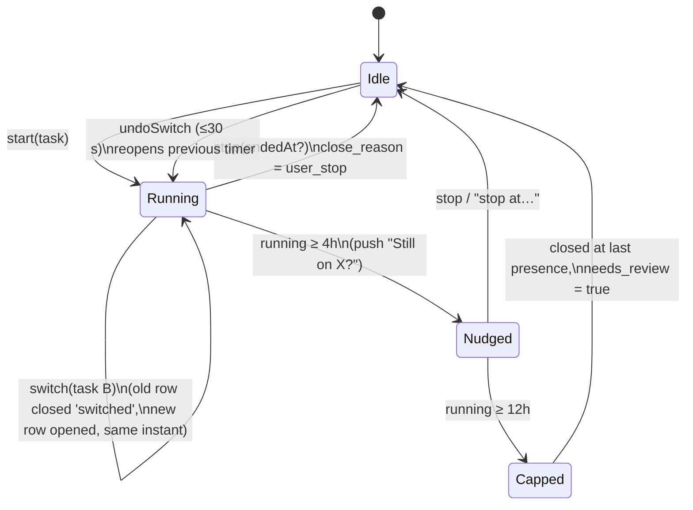
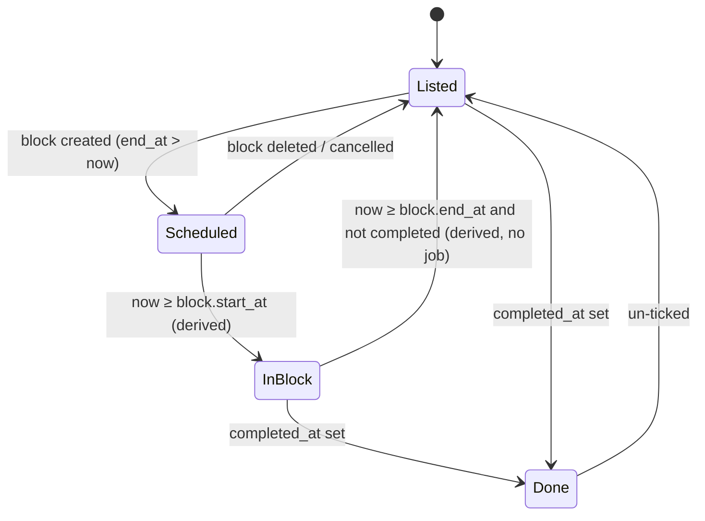
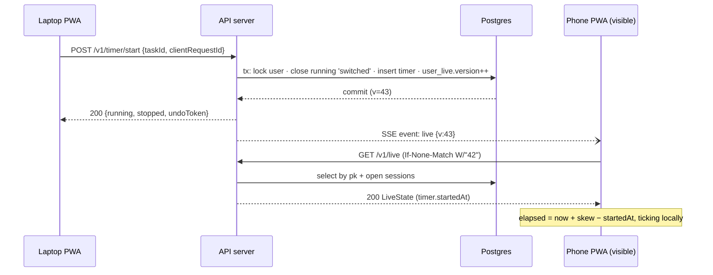
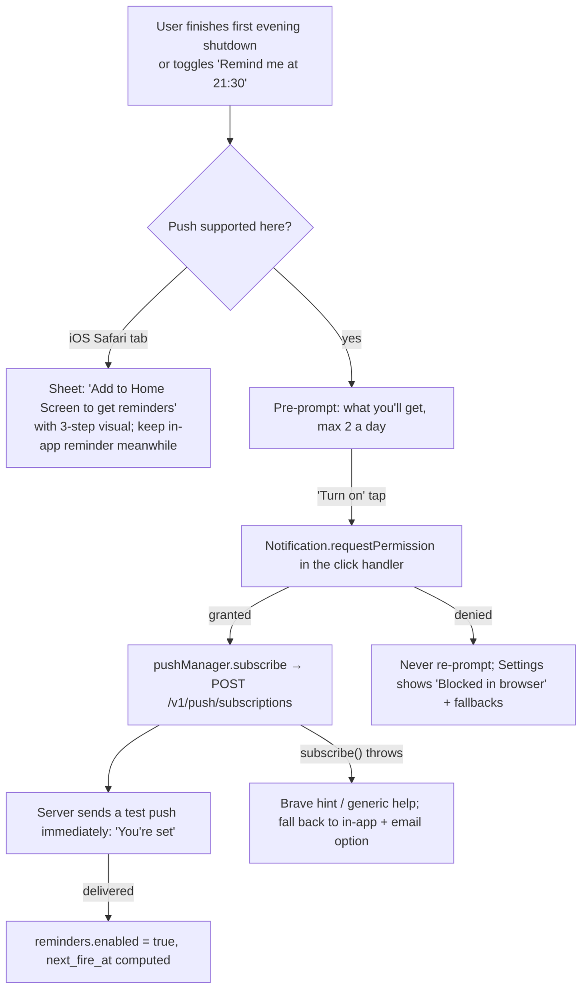

# 05 · Sessions, timer and realtime

> Slice 05 of the brainstorm. Written 2026-10-05.
> Scope: the server side of the timer and sessions. That covers activity ingestion (heartbeats, commits, Claude Code events), lazy session closing, multi-device realtime, push notifications and scheduled jobs. The client side of the integrations (git hook, VS Code extension, Claude Code hooks) belongs to slice 08. This slice only defines what they send and what the server does with it.
> Library versions were checked against the npm registry on 2026-10-05. Web Push platform status was checked on the web the same day (sources at the end).

---

## 1. TL;DR

- **The timer is a row, not a clock.** A running timer is a `sessions` row with `started_at` set and `ended_at IS NULL`. The server never ticks. Each client computes elapsed time from `started_at` plus a measured clock offset, so the timer survives tab close, laptop sleep and device switches without extra work.
- **One running timer per user.** Starting a timer while another runs is a *switch*. One transaction stops the old timer and starts the new one at the same instant, and the UI shows an Undo toast. There is no modal prompt and no parallel timers, because parallel timers double-count the very thing this feature measures.
- **One sessions table, two kinds of truth.** Every row has a `kind` (`timer`, `manual_entry`, `auto`) and a `source` (`web`, `vscode`, `claude_code`, `git`). Timer and manual rows are *assertions* the user made. Auto rows are *evidence* from integrations. Evidence never edits an assertion. Overlaps are resolved when data is read, by a small sweep-line "attribution" function, so totals never double-count.
- **Heartbeats are intervals, merged like LeetCode 56.** Integrations send coalesced activity intervals about every 2 minutes. If an interval falls within the source's gap threshold, the server merges it into the open auto session. Otherwise it starts a new one. Interval merging gives the same result in any order and is safe to repeat, so late, duplicated or out-of-order batches need no dedupe table.
- **Gap thresholds (answers the §7 question):** 15 minutes for VS Code, 30 for Claude Code, and 60 for git-only commit chains, where a lone commit gets a 30-minute start credit. An auto session's `ended_at` is `last_seen + tail`, never `last_seen + gap`. The tail is 1 minute for VS Code, 2 for Claude Code and 0 for git.
- **Lazy closing is a view plus a sweeper.** A SQL view works out each session's effective end on every read, so correctness never waits for a job. A sweeper then writes the close every 5 minutes, which keeps exports, analytics and indexes simple.
- **Commits mark the end of work, so the start is backdated from evidence.** If a session covers the commit, the commit attaches to it. If none does, the server estimates the start from three things: the previous commit, file modification times (which can only move the start earlier) and a 30-minute credit. It flags the session `start_estimated`, and the evening shutdown (D-010) asks the user to confirm it.
- **Realtime in v1 means refetching on focus plus light polling. v2 adds SSE "invalidate" hints. No WebSockets.** Push notifications are for people (visible nudges), never for syncing data. iOS revokes any subscription whose pushes don't show a notification.
- **Notifications use Web Push with VAPID** (`web-push` 3.6.7). They work on Android and desktop. On iOS they work only for Home Screen web apps (iOS 16.4+), and iOS 18.4+ adds Declarative Web Push. Brave ships with push turned off, and that is Atif's own browser. Fallbacks are an in-app banner and badge, opt-in email and an `.ics` file with an alarm.
- **Jobs are due-time columns plus one simple ticker.** Every scheduled thing is a row with a `next_*_at` instant and a claim query that is safe to run twice. A 1-minute in-process ticker or an external pinger drives them. There are no per-user cron schedules.
- **Load: D-009 holds, but its math needs two corrections.** It is low by about 2×, because a coder runs two integration sources. It also leaves out UI polling, which at 30-second intervals sends 4× the heartbeat traffic for each open client. The worst case at 10k simultaneous coders is about 175 heartbeat requests per second. One small VM handles that if the `last_seen` updates stay HOT, meaning `last_seen` is never indexed and a heartbeat never bumps the sync version.

---

## 2. Assumptions about other slices

These are explicit so the critic can catch mismatches.

| Slice | What I assume | If the assumption is wrong |
|---|---|---|
| **02 data model** | Tables `users`, `projects`, `tasks`, `blocks` exist. `tasks.completed_at` marks done. `blocks` has `task_id`, `start_at`, `end_at` (timestamptz). `users.timezone` stores an IANA zone name (e.g. `Asia/Kolkata`). This slice owns `sessions`, `commits`, `push_subscriptions`, `reminders` and `user_live`. | If 02 already defines `sessions`, merge their columns with mine. The columns I need are listed in §5.3. |
| **03 backend** | TypeScript on Node (22.12+; ideally 24 LTS, or 26 once it becomes LTS this month), run as one long-running process in a modular monolith with Hono or Fastify. Request handlers get `userId` and `deviceId` from auth middleware. | If 03 picks pg-boss for jobs, my ticker functions become pg-boss schedules and nothing else changes. If 03 picks serverless functions, SSE is out (Vercel Hobby caps a function at 300 s, streaming included). Use polling, plus an external pinger for the ticker. |
| **04 database & sync** | Postgres 18 (current stable; 19 is still in beta as of 2026-09-24), with `uuidv7()` and the `btree_gist` extension. Sync is driven by a per-row `version` or change log. **I require that heartbeat-only updates (`last_seen`) do not count as sync changes.** Postgres `now()` is the clock of record. | If 04's change-tracking trigger fires on every UPDATE, `last_seen` must move into its own table (the escape hatch in §5.7). If 04 picks a Postgres that scales to zero, see the ticker trap in §6. |
| **06 auth** | The PWA uses a session cookie. Integrations use long-lived per-device API tokens with an `activity:write` scope, stored hashed and cached in memory after the first lookup. | Nothing in this slice depends on the token format, only on getting `userId` and `deviceId`. |
| **07 infra** | One always-on small VM or container. If the host sleeps (Render's free tier spins down after 15 minutes idle), in-process timers don't fire. In that case cron-job.org (free, 1-minute cadence) calls `POST /internal/tick`. | The design is "one tick function, two possible triggers", so it works either way. |
| **08 integrations** | Clients send the payloads defined in §5.6 and §5.8. The VS Code extension coalesces activity into intervals and posts about every 2 minutes, and only while the user is active. Claude Code hooks send `UserPromptSubmit` and `Stop` events. The git `post-commit` hook sends SHA, timestamps, branch, an optional `Task:` trailer and (optionally) the earliest modification time of the changed files. 08 owns folder-to-project mapping (`.planner` file) and sends `projectId` or a `repoKey`. | If 08 sends raw pings instead of intervals, the server treats each ping as a zero-length interval and everything still works. Only the request count changes. |
| **09 frontend** | A PWA with a service worker (needed for push) and a query cache that can be invalidated by an event. It computes elapsed time locally. | If there's no service worker, push isn't possible except Declarative Web Push on iOS 18.4+. |
| **10 scheduling** | The estimation multiplier reads (planned block minutes, attributed actual minutes) pairs, which I expose per task. | None. |
| **12 UX flows** | Owns the evening shutdown screen. I provide "sessions needing review" (estimated starts, capped timers, unassigned auto sessions) and "timer still running". | None. |
| **13 build plan** | The roadmap order from JOURNEY §8: timer in v1, reminders and push in v2, integrations in v3. §5.18 maps my work onto it. | None. |

---

## 3. Three genuinely different approaches

| | **A. Rows and rules** (recommended) | **B. Evidence log + projection** | **C. Per-user live actor** |
|---|---|---|---|
| **Core idea** | One `sessions` table. A timer is an open row. Heartbeats merge intervals into an open auto row. Closing is lazy (a view) plus a sweeper. Overlaps are resolved when data is read. Realtime is polling, later with SSE hints. | Store compact *activity spans* per source in an append-only log. A projector rebuilds the user-visible sessions from the log, and user edits are stored as overrides that are layered on top. | Each user has a stateful actor (e.g. a Cloudflare Durable Object, or an in-memory actor in Node) holding the live timer and open spans. An alarm fires at exactly `last_seen + gap`. Devices hold WebSockets to the actor, and closed sessions are flushed to Postgres. |
| **Pros** | Least code. One source of truth. Easy to explain. Correct under reordering. Very cheap writes (HOT updates). Works on any host with Postgres. | History is a pure function of evidence. Thresholds can be changed *retroactively*. Full audit trail. Dedupe and "what happened" debugging are trivial. | Exact timeouts, no sweeper. Instant multi-device updates. A clean actor-model story. The Durable Objects free tier covers early use (100k requests/day, 100k SQLite rows written/day). |
| **Cons** | Merging is lossy: once spans merge, a changed threshold can't re-split old sessions. The closing rule lives in three places (ingest, view, sweeper) and must stay consistent. | User edits on top of derived data are the hardest problem in the system, because overrides must survive every recompute. Storage grows per batch, which goes against the spirit of D-009. More moving parts (log, projector, overrides). | Two sources of truth (actor state and Postgres) or vendor lock-in. Different runtime from the rest of the backend. Local dev and tests are harder. A WebSocket per open tab is overkill for a minutes-tolerant feature. The free tier's 100k writes/day is roughly 800 users coding 4 h/day. |
| **Solo-dev effort** (part-time student, ~10 h/week) | About 4–5 weeks total, spread over v1–v3 (timer 1 week, edits and attribution 1 week, push and jobs 1.5 weeks, ingestion 1.5 weeks). | A plus 2–3 weeks, mostly the override system and the projector's edge cases. | 5–7 weeks, plus learning Workers/DOs, plus duplicate infra and deploys. |
| **Interview value** | High *if* told well: "timer as a row", interval merging as a semilattice, HOT updates and write amplification, lazy evaluation vs sweeper, the sweep-line attribution. Every piece can be explained end to end. | Very high on paper (event sourcing, projections, retroactive recompute), but a half-built version is a liability in an interview. | High (actor model, alarms, WebSocket hibernation), but it invites "why did you need this for a minutes-latency feature?", and the honest answer is "I didn't". |

**A: Rows and rules.** The database row is the state. Every behaviour that sounds time-driven ("the session closes after 15 minutes of silence", "the task returns to the list when the block ends") becomes a rule applied when data is read, not an event that has to fire on time. A small sweeper makes those rules permanent so that queries stay simple. The realtime layer only carries "something changed, refetch", never data, so it can be dropped or degraded without losing correctness. It is the boring choice, and it matches D-009's own wording ("computed lazily").

**B: Evidence log + projection.** Integrations append spans (one row per coalesced batch interval, not per keystroke). A projector function `sessionsFromSpans(spans, thresholds) → sessions` runs after each append for the affected user and day, and writes a materialized `sessions` table. A manual edit writes an *override* ("session derived from spans X..Y has start 14:05 and task T"), and the projector must re-apply it after every recompute. That is the trap: once the projector's output changes shape (two sessions merge because a late span bridged them), you need rules for which override applies to the merged result. Real products that do this (WakaTime's "durations" are read-only projections of heartbeats) avoid it by *not allowing edits* of derived data. This app needs edits, because the raw idea doc explicitly wants trimming and notes.

**C: Per-user live actor.** It is elegant: one object per user, an alarm scheduled at `last_seen + gap` that closes the span exactly on time, WebSocket hibernation so idle connections cost nothing, and all of a user's state in one place. But this app's tolerance is minutes (D-009 says so explicitly). The precision C buys has no user-visible value, while its costs (a second runtime, keeping two stores consistent, the WebSocket lifecycle on mobile) land on a solo student.

---

## 4. Recommendation

**Build A.** Keep a single `sessions` table with `kind` × `source`. Run the timer on the server with one running timer per user and switch semantics. Ingest heartbeats as interval merges with per-source gap thresholds. Close sessions lazily through a view, with a 5-minute sweeper. Resolve overlaps at read time with a sweep-line attribution function. For realtime, use refetch on focus plus 30-second polling in v1 and SSE invalidation hints in v2. Use Web Push for the shutdown reminder, and drive every job from due-time columns plus one ticker.

Add one piece borrowed from B, kept small: a **calibration log** (`activity_spans_debug`). It records the raw coalesced intervals as received, is enabled by a flag, is kept for 30 days and stays on only during the first month of dogfooding. It lets Atif replay a month of his own data against different gap thresholds offline before fixing the defaults. At one user it costs a few thousand rows. At scale it stays off, which respects D-009 (see §8).

### The strongest argument against A (steelman)

> "Approach A spreads the definition of *is this session still open?* across three places: the ingest merge, the effective-end view and the sweeper. All three depend on `now()`, which is the classic recipe for bugs where the API says 'running' and the export says 'ended'. Worse, A *mutates history*: a late batch can merge two closed sessions, so the 47-minute session you saw yesterday is 1h52m today. And the one parameter you *know* you'll tune, the gap threshold, is the one A can't apply retroactively, because merged spans are lossy. B makes sessions a pure, deterministic function of evidence. It is one function with one test suite, recomputable whenever you change your mind. You're about to spend weeks tuning thresholds while dogfooding, so choosing the design that can't re-run history is choosing to be wrong in a way you can't fix."

That is a real argument, and the calibration log is my partial answer to it. My other answers are:

1. The three places share **one** SQL function (`effective_end(...)`), so the rule can't drift.
2. Late-merge mutation only affects *unlocked* auto sessions. Anything the user touched is frozen.
3. Once the thresholds settle, nobody re-runs history, while edits happen every day. B optimizes for the rare operation and makes the common one hard.

### When I'd switch

Switch to B, keeping the calibration log permanently and making `sessions` a projection, if **any** of these happen during the first 4–6 weeks of dogfooding v3:

- the gap threshold changes more than twice;
- users (or Atif) ask for a per-user threshold setting that should apply to past data;
- more than one real "API says running, export says ended" bug appears despite the shared function.

Switch to C only if a feature truly needs sub-second shared state. That would be a shared live session with another person (e.g. pair-study rooms), which is out of scope under D-001.

---

## 5. Implementation walkthrough

### 5.1 Module map

```
src/server/sessions/
  timer.ts          start / stop / switch / undoSwitch (manual timer, user assertions)
  entries.ts        manual entries, edit, split, merge, delete
  ingest.ts         POST /v1/activity  → normalize → mergeEvidence()
  commits.ts        POST /v1/commits   → attach or estimate → mergeEvidence()
  merge.ts          mergeEvidence(): interval-union with gap, the core algorithm
  policy.ts         per-source gap / tail / limits (single source of truth)
  resolveTask.ts    evidence → (projectId, taskId | null)
  attribution.ts    attribute(sessions, window) → segments (sweep line)
  live.ts           GET /v1/live, user_live.version bump, ETag
  events.ts         GET /v1/events (SSE hints), in-process hub (+ LISTEN/NOTIFY if >1 instance)
src/server/notify/
  push.ts           VAPID send, 404/410 cleanup, payload builder
  reminders.ts      nextFireAt(), claim + send
  email.ts          optional fallback (Resend)
src/server/jobs/
  tick.ts           runDueJobs(now): sweeper, timer nudges/caps, reminders, cleanups
  scheduler.ts      croner '* * * * *' → tick(); POST /internal/tick → tick()
```

### 5.2 Vocabulary (worth getting exactly right)

- **Task**: something to do. **Block**: planned time for a task on the calendar. **Session**: actual time spent. A block is a plan and a session is a fact, and neither ever modifies the other.
- **Assertion** (`kind = 'timer' | 'manual_entry'`): time the user claims. It is authoritative and must not overlap other assertions.
- **Evidence** (`kind = 'auto'`): time inferred from integrations. It may overlap anything. It never overrides assertions and is reconciled at read time.
- **`source`**: where the row came from (`web`, `vscode`, `claude_code`, `git`, `api`). The VS Code **Start button** (D-006) creates `kind = 'timer', source = 'vscode'`. VS Code **heartbeats** create `kind = 'auto', source = 'vscode'`. Kind and source are separate axes, and mixing them up is the most common modelling mistake here.
- **`context_key`**: what an auto session is "about". It is `project:<uuid>|task:<uuid or ->` when the repo is linked, or `repo:<hash>|task:-` when it isn't. Because the resolved task is part of the key, switching tasks mid-flow simply creates a second auto session, with no special case.

### 5.3 Schema (Postgres 18)

```sql
create extension if not exists btree_gist;

create table sessions (
  id                uuid primary key default uuidv7(),
  user_id           uuid not null references users(id) on delete cascade,
  task_id           uuid references tasks(id)    on delete set null,
  project_id        uuid references projects(id) on delete set null,
  block_id          uuid references blocks(id)   on delete set null,  -- timer started from a block
  kind              text not null check (kind in ('timer','manual_entry','auto')),
  source            text not null check (source in ('web','vscode','claude_code','git','api')),
  context_key       text,                       -- auto only
  started_at        timestamptz not null,
  ended_at          timestamptz,                -- NULL = open (running timer / live auto span)
  last_seen         timestamptz not null,       -- latest evidence; = started_at for timers
  start_estimated   boolean not null default false,
  close_reason      text check (close_reason in
                      ('user_stop','switched','gap_timeout','hard_cap','merged','edited')),
  needs_review      boolean not null default false,
  locked            boolean not null default false,  -- user edited → automation never touches it
  nudged_at         timestamptz,                -- long-running-timer nudge sent
  note              text,
  client_request_id uuid,                       -- idempotent start / manual entry
  deleted_at        timestamptz,
  created_at        timestamptz not null default now(),
  version           bigint not null default 1,  -- bumped on VISIBLE changes only
  constraint ended_after_started check (ended_at is null or ended_at >= started_at),
  constraint auto_has_context   check ((kind = 'auto') = (context_key is not null))
) with (fillfactor = 85);  -- leave room on each page so last_seen updates stay HOT

-- exactly one running timer per user
create unique index sessions_one_running_timer on sessions (user_id)
  where kind = 'timer' and ended_at is null and deleted_at is null;

-- at most one open auto span per (user, source, context)
create unique index sessions_one_open_auto on sessions (user_id, source, context_key)
  where kind = 'auto' and ended_at is null and deleted_at is null;

create index sessions_user_started on sessions (user_id, started_at);
create index sessions_task_started on sessions (task_id, started_at) where deleted_at is null;
create unique index sessions_client_req on sessions (user_id, client_request_id)
  where client_request_id is not null;

-- user assertions can never overlap each other (open timer = [start, ∞))
alter table sessions add constraint sessions_assertions_no_overlap
  exclude using gist (
    user_id with =,
    tstzrange(started_at, coalesce(ended_at, 'infinity'), '[)') with &&
  ) where (kind in ('timer','manual_entry') and deleted_at is null);

-- NOTE: last_seen appears in NO index and NO partial-index predicate. That is deliberate:
-- an UPDATE that changes only last_seen is a HOT update (no index writes).

create table commits (
  id             uuid primary key default uuidv7(),
  user_id        uuid not null references users(id) on delete cascade,
  repo_key       text not null,             -- hash of normalized remote URL (or path)
  sha            text not null,
  committed_at   timestamptz not null,      -- hook wall clock, skew-corrected
  authored_at    timestamptz,
  branch         text,
  subject        text,                      -- first line, truncated to 200 chars
  project_id     uuid references projects(id) on delete set null,
  task_id        uuid references tasks(id)    on delete set null,
  session_id     uuid references sessions(id) on delete set null,
  earliest_mtime timestamptz,               -- optional evidence from the hook
  refs_only      boolean not null default false,  -- replayed/rebased commits: not activity
  unique (user_id, repo_key, sha)
);

create table user_live (                    -- tiny, hot, one row per user
  user_id        uuid primary key references users(id) on delete cascade,
  version        bigint not null default 0, -- bumps on timer/auto-session VISIBLE changes
  last_active_at timestamptz                -- any authenticated request, written ≤ 1/min
);

create table push_subscriptions (
  id              uuid primary key default uuidv7(),
  user_id         uuid not null references users(id) on delete cascade,
  endpoint        text not null unique,
  p256dh          text not null,
  auth            text not null,
  platform        text,                     -- 'ios-webapp' | 'android' | 'desktop' (UA hint)
  created_at      timestamptz not null default now(),
  last_success_at timestamptz,
  failure_count   int not null default 0
);

create table reminders (
  user_id        uuid not null references users(id) on delete cascade,
  kind           text not null check (kind in ('shutdown')),
  local_time     time not null default '21:30',
  enabled        boolean not null default false,  -- opt-in via the permission flow
  next_fire_at   timestamptz,                     -- precomputed UTC instant
  last_fired_for date,                            -- user-local date, idempotency guard
  primary key (user_id, kind)
);
create index reminders_due on reminders (next_fire_at) where enabled;
```

Why a separate `user_live` table: the ETag for `/v1/live` must change when the visible live state changes, and nothing else should bump it. Putting `version` on `users` would make the widest, most-read row in the system also a hot write target.

### 5.4 TypeScript types

```ts
type Kind = 'timer' | 'manual_entry' | 'auto';
type Source = 'web' | 'vscode' | 'claude_code' | 'git' | 'api';

interface Session {
  id: string; userId: string; taskId: string | null; projectId: string | null;
  blockId: string | null; kind: Kind; source: Source; contextKey: string | null;
  startedAt: string; endedAt: string | null; lastSeen: string;
  startEstimated: boolean; closeReason: CloseReason | null;
  needsReview: boolean; locked: boolean; note: string | null; version: number;
}

// What integrations POST to /v1/activity (08 builds it)
interface ActivityBatch {
  batchId: string;             // uuid; useful for logs, not needed for correctness
  deviceId: string;
  source: 'vscode' | 'claude_code';
  sentAt: string;              // client clock, used for skew correction
  items: Array<{
    projectId?: string;        // from .planner link file
    repoKey?: string;          // fallback when unlinked
    taskId?: string;           // explicit pick (VS Code tree, trailer)
    branch?: string;
    intervals: Array<{ from: string; to: string }>;  // coalesced client-side, gap ≤ 2 min
  }>;
}

// Per-source policy: the ONLY place these numbers live
const MIN = 60_000;
export const POLICY = {
  vscode:      { gapMs: 15 * MIN, tailMs: 1 * MIN, maxBackfillMs: 7 * 24 * 60 * MIN },
  claude_code: { gapMs: 30 * MIN, tailMs: 2 * MIN, maxBackfillMs: 7 * 24 * 60 * MIN },
  git:         { gapMs: 60 * MIN, tailMs: 0,       maxBackfillMs: 7 * 24 * 60 * MIN,
                 firstCommitCreditMs: 30 * MIN, maxBackdateMs: 180 * MIN, minSessionMs: 5 * MIN },
} as const;

export const TIMER = { nudgeAfterMs: 4 * 60 * MIN, hardCapMs: 12 * 60 * MIN, undoWindowMs: 30_000 };
```

### 5.5 The manual timer



**API**

```ts
// POST /v1/timer/start  { taskId, startedAt?, blockId?, clientRequestId }
// → 200 { running: Session, stopped: Session | null, undoToken: string | null }
async function startTimer(userId: string, input: StartInput): Promise<StartResult>;

// POST /v1/timer/stop   { sessionId, endedAt?, note? }   → 200 { session }
async function stopTimer(userId: string, input: StopInput): Promise<Session>;

// POST /v1/timer/undo-switch { undoToken }   → 200 { running: Session }
async function undoSwitch(userId: string, token: string): Promise<Session>;
```

**`startTimer`, in one transaction:**

```ts
async function startTimer(userId, { taskId, startedAt, blockId, clientRequestId }) {
  return db.tx(async (tx) => {
    // Serialize all timer operations for this user. Cheap, simple, no deadlocks.
    await tx.query(`select pg_advisory_xact_lock(hashtextextended($1, 1))`, [userId]);

    const dup = await tx.maybeOne(`select * from sessions
       where user_id=$1 and client_request_id=$2`, [userId, clientRequestId]);
    if (dup) return { running: dup, stopped: null, undoToken: null };   // retried request

    const at = startedAt ? clampBackdate(startedAt) : await tx.now(); // server clock wins
    const current = await tx.maybeOne(`select * from sessions where user_id=$1
       and kind='timer' and ended_at is null and deleted_at is null`, [userId]);

    let stopped = null;
    if (current) {
      if (at < current.started_at) throw conflict('starts before the running timer');
      stopped = await tx.one(`update sessions set ended_at=$2, close_reason='switched',
         version=version+1 where id=$1 returning *`, [current.id, at]);
    }
    const running = await tx.one(`insert into sessions
       (user_id, task_id, project_id, block_id, kind, source, started_at, last_seen, client_request_id)
       values ($1,$2,(select project_id from tasks where id=$2),$3,'timer',$4,$5,$5,$6) returning *`,
       [userId, taskId, blockId, sourceFromClient(), at, clientRequestId]);
    // The exclusion constraint rejects a backdated start that overlaps earlier assertions (→ 409).
    await bumpLive(tx, userId);
    return { running, stopped, undoToken: stopped ? sign({ stopped: stopped.id, running: running.id }) : null };
  });
}
```

Design notes:

- **Server time is authoritative** for start and stop unless the client passes an explicit `startedAt`/`endedAt` ("I actually started 10 minutes ago"). A backdate is limited to the end of the previous assertion (the exclusion constraint enforces this) and to 24 hours.
- **Switch, not prompt.** The old timer closes at the exact instant the new one opens. The response includes `stopped`, so the UI can say "Stopped *OS notes* after 42m · Undo". Undo is a signed token that is valid for 30 seconds. It deletes the new row and reopens the old one, but only if both are untouched.
- **Concurrent starts from two devices** are serialized by the advisory lock. The later one wins and the earlier becomes a short `switched` session. If the second start arrives within the undo window, the UI shows the usual Undo, so "oops, both devices" is a one-tap fix.
- **Stop is naturally idempotent.** `update … where id=$1 and ended_at is null`. If zero rows change, return the already-stopped row with 200.
- **Starting a timer from a block** stores `block_id`. That gives the estimation multiplier (10) its planned-vs-actual pair without guessing.
- **Offline start** (PWA with no network): v1 doesn't fake it. The button shows "Offline: will start when you're back", records the tap time and sends `startedAt = tap time` on reconnect. If another device started a timer after that tap time, the server returns 409. The UI then offers "Keep *Y* (laptop) and log *X* from 10:00–10:05?" There is no CRDT for timers (see Traps).

### 5.6 Activity ingestion (heartbeats, D-009 in detail)

**Batching contract (client side is 08's; this is what the server expects):**

- The client records activity locally (keystrokes, file focus, saves, terminal input) and coalesces it into intervals with a 2-minute internal gap.
- It POSTs **every ~2 minutes while there is activity**, and immediately on window blur or close if the batch is non-empty. Nothing is sent while idle.
- On failure, the batch stays in a local queue (cap of 24 hours of data) and is retried with exponential backoff plus jitter. Since merging is idempotent, resending is always safe.

**What a heartbeat carries.** It does not carry "I'm alive". It carries **intervals of observed activity with real timestamps**. This one choice is what makes late and out-of-order delivery correct: the server stores the timestamps of the activity, not the time the request arrived.

**Normalization (`ingest.ts`):**

```ts
function normalize(batch: ActivityBatch, receivedAt: number): Evidence[] {
  // Clock-skew correction, NTP-lite: if the client clock is off by more than 30 s,
  // shift every timestamp by the measured offset.
  const skew = receivedAt - Date.parse(batch.sentAt);          // network delay is ≪ 30 s
  const shift = Math.abs(skew) > 30_000 ? skew : 0;
  const out: Evidence[] = [];
  for (const item of batch.items) for (const iv of item.intervals) {
    let from = Date.parse(iv.from) + shift, to = Date.parse(iv.to) + shift;
    to = Math.min(to, receivedAt + 60_000);                     // nothing from the future
    if (to < receivedAt - POLICY[batch.source].maxBackfillMs) { reject(iv, 'too_old'); continue; }
    if (from > to) [from, to] = [to, from];
    out.push({ userId, source: batch.source, deviceId: batch.deviceId,
               ...resolveContext(item), from, to });           // §5.9
  }
  return out;   // items are accepted or rejected individually: 207-style result
}
```

**The merge (`merge.ts`).** This is the heart of the slice. Conceptually, the auto sessions for one (user, source, context) are the connected components of all evidence intervals, where two intervals connect if the gap between them is at most `gapMs`. It is LeetCode 56 ("merge intervals") with a gap tolerance, run incrementally.

```ts
export async function mergeEvidence(tx: Tx, ev: Evidence): Promise<string /* sessionId */> {
  const { gapMs, tailMs } = POLICY[ev.source];
  await tx.query(`select pg_advisory_xact_lock(hashtextextended($1, 2))`,
                 [`${ev.userId}|${ev.source}|${ev.contextKey}`]);

  // 1. User edits win: cut out any part of the interval covered by a locked session
  //    of the same key. Leftover pieces shorter than 2 min are dropped as noise.
  const pieces = await clipAgainstLocked(tx, ev);
  let lastId = null;

  for (const p of pieces) {
    // 2. All unlocked sessions of this key whose evidence is within gap of the piece.
    const cands = await tx.many(`
      select id, started_at, last_seen, ended_at from sessions
       where user_id=$1 and kind='auto' and source=$2 and context_key=$3
         and deleted_at is null and not locked
         and started_at <= $5::timestamptz + $6::interval
         and last_seen  >= $4::timestamptz - $6::interval
       order by started_at
       for update`, [ev.userId, ev.source, ev.contextKey, p.from, p.to, `${gapMs} ms`]);

    const start    = min([p.from, ...cands.map(c => c.started_at)]);
    const lastSeen = max([p.to,   ...cands.map(c => c.last_seen)]);
    const open     = (await tx.now()) - lastSeen <= gapMs;
    const endedAt  = open ? null : lastSeen + tailMs;

    // Prefer the currently open row as survivor so live clients keep a stable id.
    const survivor = cands.find(c => c.ended_at === null) ?? cands[0];
    const losers   = cands.filter(c => c !== survivor);

    // Soft-delete losers FIRST (frees the one-open-auto unique index), re-point commits.
    if (losers.length) await absorb(tx, survivor?.id, losers);

    if (!survivor) {
      lastId = await insertAuto(tx, ev, start, lastSeen, endedAt);
      await bumpLive(tx, ev.userId);
    } else if (start === survivor.started_at && endedAt === survivor.ended_at && !losers.length) {
      // Hot path, ~99% of heartbeats: only last_seen moves. HOT update, no version bump.
      await tx.query(`update sessions set last_seen = greatest(last_seen, $2) where id = $1`,
                     [survivor.id, lastSeen]);
      lastId = survivor.id;
    } else {
      await tx.query(`update sessions set started_at=$2, last_seen=$3, ended_at=$4,
         close_reason = case when $4 is null then null else coalesce(close_reason,'gap_timeout') end,
         version = version + 1 where id=$1`, [survivor.id, start, lastSeen, endedAt]);
      await bumpLive(tx, ev.userId);
      lastId = survivor.id;
    }
    if (shouldCalibrate(ev.userId)) await logCalibration(tx, ev, p);   // §4, flag-gated
  }
  return lastId;
}
```

Why this is correct under reordering: for unlocked sessions, the final state equals "connected components of the set of all intervals received". A set union doesn't care about order or duplicates, so the merge is commutative, associative and idempotent (a join-semilattice). That is why no `batch_id` dedupe table is needed. The property test in §7 checks this directly against a pure offline function over random permutations.

**Gap thresholds (answer to §7 "Session gap threshold"):**

| Source | Signal density | Gap threshold | Tail (added after `last_seen` on close) | Reasoning |
|---|---|---|---|---|
| `vscode` | Dense (every few seconds while typing; batched to 2 min) | **15 min** | 1 min | WakaTime's default "keystroke timeout" is 15 min, and its plugins also send every 2 min while typing, the same cadence D-009 chose. A 15-minute gap absorbs reading docs, thinking and a quick chai, and splits on a real break. |
| `claude_code` | Sparse (prompt, then the agent works, then you review the diff) | **30 min** | 2 min after the last `Stop` | Between prompts you read diffs and test by hand, and 10–20 minute gaps are normal while still "on task". The interval for a prompt is `[promptAt, stopAt]`, so agent run time counts. |
| `git` (commit-only, no other evidence) | Very sparse, end markers only | **60 min** chain | 0 | `git-hours` uses 120/120 by default, which over-counts students' bursty commits. A 60-minute chain plus a 30-minute first-commit credit is more conservative, and every estimated start is flagged for review. |
| `timer` | None (explicit) | n/a | n/a | No gap, ever. Forgotten timers are handled by the 4h nudge and 12h cap instead. |

These are starting values, kept in one constant. The calibration log exists to replace them with numbers measured on Atif's own month of data.

**What `ended_at` becomes for an auto-closed session:** `last_seen + tail`. It is **not** `last_seen + gap` (that would credit 15 free minutes to every session) and **not** the sweeper's run time (that would make the length depend on when a job ran). `last_seen` is the time of the last real activity, so the session ends roughly when the work did.

### 5.7 Lazy closing: view + sweeper (both, with clear roles)

```sql
create function effective_end(k text, src text, ended timestamptz, seen timestamptz, at timestamptz)
returns timestamptz language sql immutable as $$
  select case
    when ended is not null then ended
    when k = 'auto' and at - seen > case src when 'vscode' then interval '15 min'
                                             when 'claude_code' then interval '30 min'
                                             when 'git' then interval '60 min' end
      then seen + case src when 'vscode' then interval '1 min'
                           when 'claude_code' then interval '2 min'
                           else interval '0' end
    else null end
$$;

create view sessions_effective as
  select s.*, effective_end(s.kind, s.source, s.ended_at, s.last_seen, now()) as eff_end
  from sessions s where s.deleted_at is null;
```

- **Correctness lives in the view.** Every read path (the live endpoint, task history, totals, exports) reads `sessions_effective`. A session whose silence exceeded the gap shows as ended *immediately*, whether or not any job has run. This is D-009's "computed lazily".
- **The sweeper is housekeeping.** Every 5 minutes it runs:

  ```sql
  update sessions
     set ended_at = effective_end(kind, source, null, last_seen, now()),
         close_reason = 'gap_timeout', version = version + 1
   where kind = 'auto' and ended_at is null and deleted_at is null
     and effective_end(kind, source, null, last_seen, now()) is not null
  returning user_id;   -- then bumpLive() for each distinct user
  ```

  The rows it scans are found through the partial unique index on open auto sessions, which holds at most (active users × sources) rows.
- **Close-on-next-write** happens inside `mergeEvidence`. If a heartbeat arrives after the gap, the candidate query doesn't match the stale open row, and the new insert has to close it first. In code: before inserting a new open row for a key, run the sweeper's UPDATE scoped to that one key. This avoids violating the unique index and costs one indexed update.
- **Race: heartbeat vs sweeper.** Both touch the same row. Under READ COMMITTED, Postgres re-checks the sweeper's WHERE clause against the newest row version after waiting for the row lock (EvalPlanQual). If the heartbeat committed first, `last_seen` is fresh, the row no longer qualifies and the sweeper skips it. If the sweeper commits first, the heartbeat's merge sees a closed, unlocked row, and the gap rule either reopens it (the evidence bridges the gap) or starts a new session. Neither order loses data.
- **Escape hatch:** if `pg_stat_user_tables.n_tup_hot_upd / n_tup_upd` falls below about 90% for `sessions`, or if 04's change tracking can't ignore `last_seen`, move `last_seen` into a narrow `session_liveness(session_id pk, last_seen)` table with fillfactor 70. The merge code changes in two places.

```mermaid
stateDiagram-v2
    [*] --> Open: first evidence for (user, source, context)
    Open --> Open: evidence within gap\n(last_seen moves; HOT update, no version bump)
    Open --> ClosedVirtual: now − last_seen > gap\n(view reports eff_end = last_seen + tail)
    ClosedVirtual --> Closed: sweeper (≤5 min) or next write for this key
    Open --> Closed: newer evidence beyond gap\n(closed at last_seen + tail, new Open created)
    Closed --> Open: late evidence bridges the gap\nand last_seen is recent (unlocked only)
    Closed --> Closed: late evidence bridges two\nclosed sessions → merged (unlocked only)
    Closed --> Locked: user edits / assigns / trims
    Open --> Locked: user edits while open\n(closed at edit time)
    Locked --> [*]
```



### 5.8 Commits mark the end: attaching and backdating

The git hook is the first integration to ship (D-006) and the one that "solves forgot-to-start-the-timer". But a commit is the *end* of work (risk §5). Server rules, in priority order:

1. **Dedupe.** `insert … on conflict (user_id, repo_key, sha) do nothing`. A replayed hook is a no-op.
2. **Replay guard.** If `authored_at` is more than 24 hours older than `committed_at`, or if more than 5 commits arrive from one repo within 10 seconds (rebase, cherry-pick, `git am`), mark them `refs_only`. They show up as commit references, but they are not activity evidence. Amends create a new SHA. 08 can send `post-rewrite` mappings so the server replaces the old SHA, and without them the old ref just stays as harmless history.
3. **Attach to a host session** covering `committed_at` (or ended no more than the source's gap before it). Preference: the running/closed *timer* for the same project, then an auto `vscode` session for the same context, then auto `claude_code`. Set `commits.session_id`. If the host is an unlocked auto session, also call `mergeEvidence` with a zero-length interval at `committed_at`, because the commit is proof of activity at that moment.
4. **No host: estimate a session** through `mergeEvidence(source='git', from=estimateStart(c), to=c.committedAt)`, with `start_estimated = true` and `needs_review = true`.

```ts
function estimateStart(c: CommitIn, prevCommitAt: number | null, prevSessionEnd: number | null): number {
  const P = POLICY.git;
  // Hard floor: never before the previous commit in this repo, the end of the
  // previous session in this context, or 3 hours ago.
  const floor = Math.max(c.committedAt - P.maxBackdateMs, prevCommitAt ?? -Infinity, prevSessionEnd ?? -Infinity);
  const credit = c.committedAt - P.firstCommitCreditMs;
  // The earliest mtime among changed files is an UPPER bound on when work began
  // (you edited a file before its last save), so it can only move the start EARLIER.
  const evidence = c.earliestMtime ?? credit;
  const from = Math.max(floor, Math.min(credit, evidence));
  return Math.min(from, c.committedAt - P.minSessionMs);   // at least 5 minutes
}
```

Better start signals, when they exist, come from the other integrations rather than the commit. In order of quality: the VS Code Start button (an exact start), VS Code heartbeats (activity from the first keystroke), Claude Code's first prompt, file mtimes, the previous commit, and finally the fixed credit. The commit-only estimate is a last resort. Its review flag lets the shutdown screen say "We guessed 08:45–09:15 for *Fix login bug*. ✓ / adjust".

Chaining works for free. Commit 1 at 16:05 creates `[15:35, 16:05]`. Commit 2 at 16:40 estimates `[16:10, 16:40]` (floor = the previous commit). The two pieces are 5 minutes apart, below the 60-minute git gap, so they merge into one session `[15:35, 16:40]`.

### 5.9 Mapping evidence to a task (server half of §7 "How are commits mapped to tasks?")

08 decides what the client can detect. The server resolves in this order and stops at the first hit:

1. An explicit `taskId` in the payload (picked in the VS Code task tree, or a `Task: <short-id>` commit trailer parsed by the hook). The server checks that the task belongs to the user.
2. A task short-id in the branch name (`t-4f2a-fix-login`).
3. The task of the **running timer**, if it is in the same project.
4. Otherwise `task_id = null` at project level. These show up in an "Unassigned time" triage list ("37 min in *Planner app* — assign to a task?").

If the repo isn't linked to a project at all (`repoKey` only), the session is kept with `project_id = null`, and the triage list offers "Link this repo to a project", which writes the `.planner` link file (08) and backfills `project_id`.

### 5.10 Attribution at read time (no double counting)

Sessions overlap legitimately. You run a timer on task X while VS Code reports activity on X, or Claude Code works on project P while you type in another repo. Totals must count each wall-clock minute once. `attribute()` is a sweep line:

```ts
const RANK: Record<string, number> = { timer: 0, manual_entry: 0, vscode: 1, claude_code: 2, git: 3 };
const rank = (s: EffSession) => s.kind === 'auto' ? RANK[s.source] : RANK[s.kind];

export function attribute(sessions: EffSession[], [w0, w1]: [number, number]): Segment[] {
  const cut = (s: EffSession) => [Math.max(s.start, w0), Math.min(s.end ?? Date.now(), w1)] as const;
  const pts = [...new Set(sessions.flatMap(s => cut(s)))].filter(t => t >= w0 && t <= w1).sort((a, b) => a - b);
  const out: Segment[] = [];
  for (let i = 0; i + 1 < pts.length; i++) {
    const [a, b] = [pts[i], pts[i + 1]];
    const active = sessions.filter(s => { const [s0, s1] = cut(s); return s0 <= a && s1 >= b; });
    if (!active.length) continue;
    // Highest priority wins; ties go to the most recently started (the newer focus).
    const win = active.reduce((x, y) => rank(y) < rank(x) || (rank(y) === rank(x) && y.start > x.start) ? y : x);
    const prev = out.at(-1);
    if (prev && prev.end === a && prev.sessionId === win.id) prev.end = b;
    else out.push({ start: a, end: b, sessionId: win.id, taskId: win.taskId, projectId: win.projectId });
  }
  return out;
}
```

That is O(n²) over one day's sessions (n is rarely above 30), which is fine. Swap in a heap if it ever matters. Task totals are the sum of segment lengths per `taskId`. For display, an auto session that is at least 90% covered by an assertion *on the same task* collapses under it as a "corroborated by VS Code" chip instead of being listed twice.

### 5.11 Editing sessions

- `PATCH /v1/sessions/:id { startedAt?, endedAt?, taskId?, note? }`. Editing an auto session sets `locked = true` and `close_reason = 'edited'` (if it was open, it closes at the edit time unless an end is given). Automation never touches it again.
- `POST /v1/sessions` (manual entry, `kind = 'manual_entry'`). It is subject to the exclusion constraint, and a 409 returns the conflicting session so the UI can offer a trim.
- `POST /v1/sessions/:id/split { at, taskIdForSecondHalf? }` produces two locked rows and moves commits by timestamp.
- `POST /v1/sessions/merge { ids[] }` requires the same task and gaps under 30 minutes, and produces one locked row.
- Delete is a soft delete. Auto sessions the user deletes stay as tombstones (`deleted_at`) so that late evidence for the same span doesn't recreate them. The clip-against-locked step treats tombstones as locked.
- Notes and commit refs per session (from the raw idea doc) are `sessions.note` and `commits.session_id`.

### 5.12 Blocks vs sessions: "the block ends and the task returns to the list unticked"

There is no transition to trigger. Where a task appears is **derived**, not stored:

```sql
-- a task appears in its list (unticked) unless it has a current or future block
select t.*,
       exists (select 1 from blocks b where b.task_id = t.id and b.end_at > now()
               and b.cancelled_at is null) as is_scheduled
from tasks t where t.completed_at is null;
```

When a block's `end_at` passes and the task isn't done, the next read shows it back in its list, unticked, with "planned 2h · spent 1h20m" from `attribute()`. No job runs at 16:00, and no state can be missed if the server was asleep. Completed tasks show struck through in their original place, and the block stays on the calendar as history.



Interactions with the timer: a block ending **never** stops a timer, because plans don't edit facts. If a timer is running on the task when its block ends, the live view shows "Block ended 5 min ago" with "Stop" and "Extend block" buttons. An *optional* push ("Block for *X* ended. Reschedule?") would need a job (a `blocks.end_nudged_at` claim column in the ticker). I suggest leaving it off by default, as in-app only (§9).

### 5.13 Multi-device realtime

**What actually needs to be realtime.** The timer is derived from `started_at`, so nothing ticks over the network. Only *state changes* travel: start, stop, switch, an auto session opening or closing, and edits. Usually the phone isn't even open when the laptop starts a timer, and when it opens it refetches. Simultaneous open screens are the only case a push channel improves. **Target latency:** within one refetch when a device comes to the foreground, and under 2 seconds (with SSE) or under 30 seconds (polling only) when both screens are open. Both are well inside D-009's "minutes".

**The live endpoint.**

```ts
// GET /v1/live   (ETag: W/"<user_live.version>")
interface LiveState {
  serverNow: string;
  version: number;
  timer: { sessionId: string; taskId: string; taskTitle: string; startedAt: string;
           blockId: string | null; blockEndsAt: string | null } | null;
  auto: Array<{ sessionId: string; source: Source; projectId: string | null;
                taskId: string | null; startedAt: string; lastSeen: string }>;  // eff_end IS NULL only
  reviewCount: number;   // sessions needing review (shutdown badge)
}
```

`If-None-Match` compares against `user_live.version`, a single primary-key read, and returns 304 with no body. Heartbeats don't bump the version (only visible changes do), so a phone polling while VS Code hums along gets cheap 304s.

**Clock-skew-correct display.** On each 200 response the client stores `skewMs = serverNow − (sentAt + rtt/2)`. On a 304, it reads the HTTP `Date` header instead (1-second resolution, good enough). Elapsed time is `Date.now() + skewMs − startedAt`. A phone whose clock is 3 minutes off still shows the right elapsed time.

**Channel choice:**

| | Latency | Server cost | Mobile battery | Complexity | Verdict |
|---|---|---|---|---|---|
| Refetch on `visibilitychange`/`focus`/`online` | Instant on foreground | ~0 | ~0 | Trivial | **v1, always on** |
| Poll `/live` every 30 s *while visible* (ETag → 304) | ≤ 30 s | 2 req/min per open client | Low (foreground only) | Trivial | **v1** |
| **SSE `/v1/events`, hints only** | ~instant | 1 idle connection per visible client | Low; close when hidden | ~80 lines | **v2** |
| WebSockets | ~instant | Same as SSE plus a ping protocol | Same | Auth, reconnect, proxies, heartbeat frames: real work | No: nothing is bidirectional |
| Web Push for sync | n/a | Per-message push service call | Wakes the device | iOS revokes silent pushes | **Never for data** |

**SSE design (v2).** The stream carries **hints, not data**: `event: live`, `data: {"v":43}`. The client compares `v` with its cached version and refetches `/live`. If a hint is lost, the next poll or focus event catches up, so the channel can be flaky without being wrong.

```ts
app.get('/v1/events', requireUser, (c) => streamSSE(c, async (stream) => {
  const userId = c.get('userId');
  const off = liveHub.subscribe(userId, (v) =>
    stream.writeSSE({ event: 'live', data: JSON.stringify({ v }), id: String(v) }));
  stream.onAbort(off);
  await stream.writeSSE({ event: 'live', data: JSON.stringify({ v: await liveVersion(userId) }), retry: 5000 });
  while (!stream.aborted) { await stream.sleep(25_000); await stream.write(': ping\n\n'); }
}));
```

- **Fan-out:** with one instance, `liveHub` is an in-process `Map<userId, Set<listener>>`, and `bumpLive()` emits after the transaction commits. With more than one instance, add `NOTIFY live, '<userId>:<v>'` and one `LISTEN` connection per instance. LISTEN needs a direct (session) connection, because transaction-mode poolers drop it (relevant if 04 picks Supabase or Neon pooled URLs).
- **Proxy hygiene:** a `: ping` comment every 25 seconds (Cloudflare and many proxies close idle streams at about 100 seconds), `Cache-Control: no-store`, `X-Accel-Buffering: no`, no compression on this route, and at most 10 streams per user.
- **Client lifecycle:** open the `EventSource` only while `document.visibilityState === 'visible'` and close it on `hidden`. iOS kills it anyway, and closing it explicitly saves the reconnect storm on resume. Serve over HTTP/2 so several tabs don't hit HTTP/1.1's six-connections-per-origin limit. Don't build tab leader election.



### 5.14 Push notifications (D-010 shutdown reminder and other nudges)

**Platform status (checked 2026-10-05):**

| Platform | Web Push | Conditions and quirks |
|---|---|---|
| Android: Chrome, Edge, Samsung Internet, Firefox | ✅ | Works in a tab or an installed PWA. Since Oct 2025, Chrome auto-revokes notification permission for low-engagement, high-volume sites, but **installed web apps are exempt**, so nudge users toward installing. |
| Android and desktop **Brave** | ⚠️ Off by default | Needs `brave://settings/privacy` → "Use Google services for push messaging". `subscribe()` fails until it's on. **This is Atif's own browser**, so test it on day one. |
| iOS / iPadOS 16.4+ | ✅ **Home Screen web apps only** | No push in Safari tabs. Permission must be requested from a user gesture. **Every push must show a notification** (inside `event.waitUntil`) or Safari revokes the subscription. 18.4+ supports **Declarative Web Push** (`"web_push": 8030` JSON, displayed by the OS even without a running service worker). Since iOS 26, any site added to the Home Screen opens as a web app by default. Action buttons are not reliably supported, so design for tap-to-open only. |
| macOS Safari 16+, desktop Chrome/Edge/Firefox | ✅ | Desktop delivery needs the browser process running. On Linux with the browser closed, the message waits until its TTL expires. |

**Library:** `web-push` 3.6.7. It was last published in Jan 2024, but it is mature and very widely used, and the protocol (RFC 8030/8291/8292) is stable. Use `@pushforge/builder` 2.0.5 (Web Crypto, zero dependencies, active in 2026) only if 03 lands on an edge runtime.

**VAPID:** generate the keys once and store the private key as a secret. `subject: 'mailto:planner@ahmedatif.in'`, because Apple rejects a malformed `sub`. **Never rotate the keys casually**: every existing subscription is bound to the public key and dies on rotation.

**Payload (one JSON for every platform):**

```json
{
  "web_push": 8030,
  "notification": {
    "title": "Evening shutdown",
    "body": "Confirm 3 classes · 2 tasks still open",
    "navigate": "https://tasks.ahmedatif.in/shutdown?d=2026-10-05",
    "tag": "shutdown-2026-10-05",
    "app_badge": "1"
  }
}
```

iOS 18.4+ shows it declaratively. Everywhere else, the service worker's `push` handler parses the same JSON and calls `showNotification` inside `event.waitUntil(...)`. Send with `TTL: 7200` (a 21:30 reminder delivered at 02:00 is worse than none), `urgency: 'normal'` and `topic: 'shutdown'` (supported by some push services, so treat it as best effort). Responses: 404 or 410 → delete the subscription; 429 → honour `Retry-After`; 413 → the payload is too big (limit about 4 KB).

**Permission UX (never ask on first load):**



The immediate test push proves the whole pipeline (keys, service worker, platform) at the moment the user is paying attention. On iOS it is a visible notification, so it can't count against the silent-push rule.

**Fallback ladder when push is unavailable:**

1. **In-app (always on):** a banner when the app opens after the reminder time ("Shutdown pending · 3 classes to confirm"), plus `navigator.setAppBadge(n)` where supported (installed PWAs on Chromium, and iOS 16.4+ Home Screen apps once permission is granted).
2. **Email (opt-in, off by default):** Resend's free tier is 3,000 emails/month and **100/day**. That's fine for Atif and friends but is not a mass fallback. One email a day feels spammy, so offer it only to people who chose it.
3. **`.ics` with an alarm (zero infrastructure):** "Add a daily 21:30 reminder to your calendar" downloads an `.ics` file with a `RRULE:FREQ=DAILY` event, a `VALARM` and the shutdown URL. The phone's native calendar then rings even on an iOS Safari tab with no install. It can't know whether you already did the shutdown, which is acceptable for a fallback. (Unverified: whether every calendar app keeps `VALARM` on import. iOS is known to strip alerts from *subscribed* calendars by default, so offer an import rather than a subscription.)

**Timezone-correct scheduling:**

```ts
// Uses Temporal (native in Node 26; temporal-polyfill 1.0.5 on Node 22/24).
export function nextFireAt(localTime: string /* '21:30' */, tz: string, after: Temporal.Instant): Temporal.Instant {
  const nowLocal = after.toZonedDateTimeISO(tz);
  let candidate = nowLocal.toPlainDate().toZonedDateTime({ timeZone: tz, plainTime: Temporal.PlainTime.from(localTime) });
  // 'compatible' disambiguation (the default): a non-existent DST time moves forward,
  // and an ambiguous one picks the earlier instant.
  if (Temporal.Instant.compare(candidate.toInstant(), after) <= 0) candidate = candidate.add({ days: 1 });
  return candidate.toInstant();
}
```

- Store the user's **IANA zone** plus the **local** time (`21:30`), never a UTC time of day. Precompute `next_fire_at` (UTC) after each firing and on any change to settings or timezone.
- Travel: when the client's `Intl.DateTimeFormat().resolvedOptions().timeZone` differs from `users.timezone`, ask "You're in *Asia/Dubai* now. Move reminders to local time?" Don't switch silently. IST has no DST, but the app must work for users elsewhere, so the tests include US DST transitions.

**Nudge catalogue (kept small on purpose, because notification fatigue gets permissions revoked):**

| Nudge | Channel | Default |
|---|---|---|
| Evening shutdown (D-010) | Push → in-app → optional email/ics | On after opt-in |
| Timer running 4h: "Still on *X*? Stop now / Stop at last activity" | Push + in-app | On |
| Block ended, task not done | In-app hint only | Push off |
| Claude Code auto-started a session (D-006) | **Local** notification by the integration itself (08), not Web Push | n/a |

### 5.15 Scheduled jobs

**Pattern:** every scheduled thing is a **row with a due-time column** and a **claim query that is safe to run twice**. The scheduler is a simple trigger for `tick(now)`. Missing a tick is harmless, because the next tick sees `due <= now()`. Two tickers at once are harmless, because claims use `FOR UPDATE SKIP LOCKED` or a conditional UPDATE. There is no leader election and no per-user cron.

| Job | Cadence | Claim | What it does | Phase |
|---|---|---|---|---|
| `capForgottenTimers` | 5 min | `update … where kind='timer' and ended_at is null and started_at < now() - '12h'` | Close at last presence evidence (`max` of auto `last_seen` within the window and `user_live.last_active_at`), else at the 4h nudge time. `needs_review = true`, `close_reason = 'hard_cap'`. | v1 |
| `nudgeLongTimers` | 5 min | `… and started_at < now() - '4h' and nudged_at is null` → set `nudged_at` | Push or in-app "Still on X?" | v2 |
| `fireReminders` | 1 min | `select … where enabled and next_fire_at <= now() for update skip locked limit 500` | Skip if the shutdown is already done today or the fire is more than 2h late. Advance `next_fire_at` and **commit, then send** (at most once: a missed reminder beats a double ping). | v2 |
| `sweepStaleAuto` | 5 min | Conditional UPDATE (§5.7) | Physically close gap-timed-out auto sessions | v3 |
| `pruneSubscriptions` | Daily | `failure_count >= 3 and last_success_at < now() - '60 days'` | Remove dead endpoints that never returned 410 | v2 |
| `purgeTombstones` / `purgeCalibration` | Daily | `deleted_at < now() - '30 days'` / spans older than 30 days | Housekeeping | v3 |

**Runner choice:**

- **Recommended:** an in-process **croner 10.0.1** `'* * * * *'` → `tick()`, plus `POST /internal/tick` (shared-secret header) that calls the same function. On an always-on VM the in-process trigger does the work. On a sleeping or serverless host, **cron-job.org** (free, 1-minute cadence, 30-second timeout) calls the endpoint.
- **If 03 adopts pg-boss 12.36.0** (Postgres-backed, cron with `tz`, multi-instance safe, Node ≥ 22.12): register the same functions as `boss.schedule('tick', '* * * * *')`, with a unique `key` per schedule, because schedules sharing a name and the default empty key overwrite each other. Don't create a pg-boss schedule *per user*.
- **Not viable:** Vercel Hobby cron (once per day, ±59 minutes precision). The Notification Triggers API (abandoned, never shipped). Periodic Background Sync (Chromium-only, no timing guarantees).

### 5.16 Load math (sanity check of D-009)

**Per-user rates while coding with both integrations:** VS Code ≈ 30 req/h, Claude Code ≈ 30 req/h at most (one throttled report per 2 minutes of agent or prompt activity), git ≈ 3 commits/h. That is **≈ 63 req/h ≈ 0.0175 req/s per active coder**. A **visible** PWA polling every 30 seconds adds **120 req/h**, while SSE adds one idle connection and about 10 refetches/h.

| | 1 user (Atif) | 1k registered | 10k registered | D-009 worst case |
|---|---|---|---|---|
| Assumption | 5 h/day coding, app visible 1.5 h/day | Peak 10% coding at once (100), 5% app visible (50) | Peak 1,000 coding, 500 visible | 10k coding at once, both sources |
| Heartbeat + commit req/s (peak) | 0.0175 | 1.75 | 17.5 | **≈ 175** (D-009 said 83: it counted one source and no commits) |
| Polling req/s (30 s, visible only) | 0.03 | 1.7 | 17 | +333 if all 10k visible (SSE: ~0 req/s, 10k connections) |
| Heartbeat UPDATEs/day | ~300 | ~30k | ~2.4M (10k users × 4 h × 60/h) | — |
| WAL from heartbeats, HOT (~200 B each) | 60 KB/day | 6 MB/day | **~480 MB/day** | ~35 KB/s |
| Same, if `last_seen` were indexed (non-HOT, ~5 indexes) | — | — | **~3–4× WAL, plus index bloat** | — |
| D-009 alternative "store every ping" as rows (~150 B incl. index) | — | — | ~360 MB/day of permanent growth (~130 GB/yr) | — |
| `sessions` rows (≈6/user/day) | ~2k/yr (~1 MB) | ~0.7M/yr | ~22M/yr (~5 GB with indexes) | — |
| Open auto rows (hot set) | ≤ 2 | ≤ ~200 | ≤ ~2k | ≤ 20k (a few MB, cache-resident) |
| Shutdown pushes at 21:30 IST | 1 | ≤ 1k in ~2 s | ≤ 10k in ~20 s (concurrency 50) | — |

Conclusions:

1. **D-009's decision holds.** Even the corrected worst case of about 175 req/s is light for one Node process (≈ 1–2 ms CPU per request with cached token lookup) and one Postgres. Each heartbeat transaction takes about 1–2 ms on a pool of 10, roughly 0.35 connection-seconds per second.
2. **The UI channel, not heartbeats, is the larger load** once many clients are visible. That is why polling is limited to visible tabs, uses ETag/304, and moves to SSE hints in v2.
3. **Write amplification is decided by schema, not traffic.** Keep `last_seen` unindexed, keep fillfactor 85, and never bump `version` or the change log on a heartbeat. Then every heartbeat is one HOT tuple plus one small WAL record, and page pruning reclaims dead versions without waiting for vacuum. Per-table autovacuum settings (`autovacuum_vacuum_scale_factor = 0.02`) keep `sessions` healthy as it grows. Monitor `n_tup_hot_upd / n_tup_upd`.
4. At 1 user, everything fits a free Postgres tier. At 10k, ~5 GB/yr and ~0.5 GB/day of WAL means a paid database, which is a nice problem to have, not a design flaw.

### 5.17 Libraries (versions checked on npm, 2026-10-05)

| Need | Choice | Version (published) | Notes |
|---|---|---|---|
| Web Push (VAPID, encryption) | `web-push` | 3.6.7 (2024-01-16) | Stable and mature, Node ≥ 16. Edge alternative: `@pushforge/builder` 2.0.5 (2026-04-23). |
| In-process ticker | `croner` | 10.0.1 (2026-02-01) | Zero dependencies, supports a `timezone` option. Or a 10-line `setInterval`. |
| Postgres job queue (only if 03 picks it) | `pg-boss` | 12.36.0 (2026-10-02) | Node ≥ 22.12. `schedule()` supports `tz`, the `missed: 'once'` catch-up option and RRULE in v12. Minimum interval is 1 minute. |
| Time zones | Native `Temporal` (Node 26, released 2026-05-05) / `temporal-polyfill` | 1.0.5 (2026-09-11) | Safari still lacks Temporal, so the client uses the polyfill or `Intl` only. |
| SSE | Hono `streamSSE` (`hono` 4.13.13) or hand-written on Fastify 5.12.5 | — | Only hints are sent, so a hand-written version is about 40 lines. |
| Email fallback | `resend` | 6.32.0 | Free tier: 3,000/month, 100/day, 3 domains. |
| Validation | `zod` | 4.6.5 | Batch payloads, with a per-item 207-style result. |
| Tests | `vitest` 5.0.3, `fast-check` 4.10.2, `@testcontainers/postgresql` 12.2.0 | — | Property tests for the merge; a real Postgres for exclusion constraints and HOT checks. |
| Postgres driver | `pg` 8.23.1 or `postgres` 3.4.9 | — | 04's call. |
| Database | PostgreSQL 18 (`uuidv7()`, `btree_gist`) | 19 still in beta (Beta 4, 2026-09-24) | — |

### 5.18 Order of work (mapped to the JOURNEY §8 roadmap)

**v1: timer and sessions**
1. `sessions` + `user_live` tables with the exclusion constraint. `startTimer`/`stopTimer`/`undoSwitch`. `GET /v1/live` with ETag. Elapsed time on the client with skew correction. *(3 days)*
2. Refetch on focus and 30-second visible polling. *(½ day)*
3. Per-task session history, manual entry, edit/split/merge/delete. *(3–4 days)*
4. `attribute()` and task totals. "Planned vs spent" on tasks that came back from blocks. *(2 days)*
5. The ticker skeleton with `capForgottenTimers` only (in-app review flag). *(1 day)*

**v2: shutdown reminder and nudges**
6. `reminders` table, `nextFireAt()` with DST tests, `fireReminders`. *(2 days)*
7. Web Push: VAPID, service worker handler (declarative-compatible JSON), permission flow, test push, 410 cleanup. **Test on a real Android phone, an iPhone with the app installed, and Brave on day one.** *(4–5 days)*
8. `nudgeLongTimers`. Feed the shutdown screen (12): needs-review sessions and a still-running timer. *(1–2 days)*
9. SSE hints, if polling ever feels laggy while dogfooding. *(1–2 days)*

**v3: integrations (server side)**
10. `POST /v1/commits`: dedupe, replay guard, attach to host, `estimateStart`, `git` merge. *(3 days)*
11. `POST /v1/activity`: normalize, `mergeEvidence`, `sessions_effective` view, `sweepStaleAuto`. Property tests. The calibration log behind a flag. *(4–5 days)*
12. Claude Code event mapping (`[promptAt, stopAt]` intervals). Unassigned-time triage list. *(2 days)*
13. After 2–4 weeks of dogfooding, replay the calibration log against other thresholds, then fix the defaults (and log the decision in JOURNEY).

---

## 6. Traps: things that look cool but eat weeks

1. **Server-side ticking.** A `setInterval` per running timer, or writing `elapsed` every second. The timer is `started_at`, so there is nothing to tick.
2. **WebSockets "for realtime".** Nothing here is bidirectional or sub-second. You'd build auth handshakes, ping frames, reconnect logic and mobile lifecycle handling for a signal that changes a few times an hour.
3. **Using push for data sync.** iOS revokes subscriptions whose pushes don't show a notification. Push is for people, and the data comes from `/live`.
4. **Per-user cron schedules** (10k pg-boss schedules, or a `setTimeout` per user). Use one due-time column and one claim query instead.
5. **Indexing `last_seen` or bumping `version` on heartbeats.** Either one turns cheap HOT updates into full index writes plus sync fan-out to every device. This is the single biggest load trap in the slice.
6. **Storing every ping "just in case".** D-009 already rejected it. The calibration log is time-boxed and flag-gated, not a back door.
7. **Trusting client clocks blindly, or ignoring them.** Using receive time breaks offline queues, and blindly trusting device clocks breaks phones with wrong clocks. Do skew correction plus clamping.
8. **Tab leader election via `BroadcastChannel`** to share one SSE connection. Use HTTP/2 and close the stream when the tab is hidden.
9. **An offline-first timer with CRDTs.** Two devices starting timers offline is a rare conflict that a 409 plus one dialog solves.
10. **Automation that starts the *manual* timer.** A timer that starts by itself but needs a human to stop it creates a forgotten timer. Automation produces self-closing auto sessions (§8).
11. **Local scheduled notifications** (Notification Triggers, Periodic Background Sync). One is dead and the other is Chromium-only with no timing guarantee.
12. **Rotating VAPID keys or changing the `subject` casually.** It silently kills every subscription.
13. **Estimating effort from diff size or lines of code.** It's a rabbit hole of heuristics. Use timestamps and ask the user at shutdown.
14. **Precision obsession.** A sweeper running every 10 seconds, or exact-timeout actors. The view already makes reads exact, so the sweeper's cadence only affects housekeeping.
15. **Testing push only on desktop Chrome.** iOS needs the Home Screen install and Brave needs a setting, and each one is discovered late at great cost.
16. **Storing reminder times in UTC** ("16:00 UTC"). It breaks with DST and travel. Store local time plus an IANA zone.
17. **Physically merging manual and auto sessions at write time.** You lose provenance and can't undo it. Keep the rows and attribute at read time.
18. **A 1-minute ticker on a scale-to-zero Postgres.** If 04 picks a serverless Postgres that suspends after a few minutes idle (e.g. Neon's default), a per-minute query keeps the compute awake all day and burns the free compute allowance. If that's the stack, make the ticker adaptive (sleep until `min(next_fire_at, earliest open-session expiry, earliest timer nudge)`, capped at 15 minutes), or tick every 15 minutes.

---

## 7. Edge cases & tests

Times are IST (UTC+05:30) unless shown with `Z`. Policy is as in §5.4.

### Manual timer

| # | Input | Expected |
|---|---|---|
| T1 | Nothing running. `start(A)` at 10:00 | One row `kind=timer`, `started_at=10:00` (server clock), `ended_at=null`. `user_live.version` +1. |
| T2 | A running since 10:00. `start(B)` at 10:40 | A: `ended_at=10:40`, `close_reason=switched`. B: `started_at=10:40`. Response has `stopped=A` and an `undoToken`. No exclusion violation (`[)` ranges touch). |
| T3 | Two devices `start(B)` at 10:40:00.100 and `start(C)` at 10:40:00.150 | After both commit, exactly one running timer (C). B exists as `[10:40:00.100, 10:40:00.150)` `switched`. Neither client sees a 500. |
| T4 | `start(A)` retried with the same `clientRequestId` | Same row returned. Row count unchanged. |
| T5 | `stop(A)` twice | Both return 200. `ended_at` stays the first value. |
| T6 | A started 10:00. `stop(endedAt=10:30)` / `stop(endedAt=09:50)` | Ends at 10:30 / 422 `ended_before_started`. |
| T7 | Previous manual session ended 09:45. `start(X, startedAt=09:30)` | 409 overlap, with suggestion `09:45`. |
| T8 | Switch A→B at 10:40, `undoSwitch` at 10:40:20 | B soft-deleted. A reopened (`ended_at=null`, `close_reason=null`). After 30 s: 410 `undo_expired`. |
| T9 | Timer started 10:00. Ticks at 14:00, 14:05 | One nudge (sets `nudged_at`). The second tick sends nothing. |
| T10 | Timer started 08:00, last VS Code `last_seen` 10:10, no app activity after. Tick at 20:01 | Closed: `ended_at = 10:10`, `close_reason=hard_cap`, `needs_review=true`. |
| T11 | Timer started 08:00, no evidence at all, nudge sent 12:00. Tick at 20:01 | `ended_at = 12:00` (nudge time), `needs_review=true`. |
| T12 | Offline tap `start(X)` at 10:00. Laptop starts Y at 10:05. Phone reconnects at 10:20 | 409 with `{running: Y}`. The UI offers to log X for 10:00–10:05 as a manual entry. |

### Activity ingestion and merging (VS Code gap 15 min, tail 1 min)

| # | Input | Expected |
|---|---|---|
| A1 | Intervals `[14:00,14:02]`, then `[14:02,14:04]` | One open session, `started 14:00`, `last_seen 14:04`. The second write is a HOT update with no `version` bump. |
| A2 | Then `[14:25,14:27]` (21-minute gap) | First session closed `ended_at=14:05` (14:04 + 1). New open session from 14:25. |
| A3 | `[10:00,10:05]`, `[10:30,10:35]`, then `[10:12,10:24]` | One session 10:00 → `last_seen` 10:35. **Property test:** for 200 random interval sets × random permutations × random duplication, the DB result equals the pure `mergeWithGap(sortedUnion)`. |
| A4 | The same batch POSTed twice | Byte-identical session rows (except unrelated timestamps). |
| A5 | Client clock 5 min fast: `sentAt=14:07`, interval `[14:05,14:07]`, received at 14:02:05 | Stored as `[14:00,14:02]` (shift −5 min). |
| A6 | After skew correction, the interval ends 10 min in the future | `to` clamped to `receivedAt + 60s`. |
| A7 | A batch with one interval 8 days old and one current | 207: the old item is rejected with `too_old` and the current one is merged. |
| A8 | Session edited by the user to `[14:00,15:00]` (locked). Late interval `[14:50,14:55]` | No change at all. |
| A9 | Same locked session. Late interval `[15:05,15:10]` | New separate auto session `[15:05, …]`, not merged into the locked one. |
| A10 | Open session `last_seen=14:10`. Sweeper at 14:30 / at 14:20 | Closed at `14:11`, `gap_timeout` / untouched. |
| A11 | Heartbeat moving `last_seen` to 14:29 commits while the sweeper (snapshot `last_seen=14:10`) waits on the row lock | The sweeper re-checks the row, skips it, and the session stays open. (Integration test with two connections.) |
| A12 | Open session `last_seen=14:10`, no sweep yet. Read at 14:30 | `sessions_effective.eff_end = 14:11`. `/v1/live` excludes it. |
| A13 | Laptop `[10:00,10:10]`, desktop `[10:05,10:20]`, same context | One session 10:00 → 10:20. |
| A14 | Claude Code: prompt 11:00, Stop 11:06. Prompt 11:31, Stop 11:40. Prompt 12:20 | Sessions `[11:00, 11:42]` (closed at the last Stop + 2) and `[12:20, …]` open. |
| A15 | Closed `S1=[10:00,10:20]` and open `S2=[10:45,…]`. Late `[10:25,10:40]` arrives | One session survives with **S2's id** (the open one), `started 10:00`. S1 soft-deleted `merged`, its commits moved. |
| A16 | Context switches task mid-flow (branch changes to `t-9b1c-…`) | A second auto session under the new `context_key`. The old one closes by gap, and attribution gives the overlap to the newer start. |

### Commits

| # | Input | Expected |
|---|---|---|
| C1 | Commit 16:40, open VS Code session 14:00–16:39 in the same context | Commit attached. `last_seen = 16:40`. |
| C2 | Commits at 16:05 and 16:40, no other evidence | One git session `[15:35, 16:40]`, `start_estimated`, `needs_review`. |
| C3 | First commit of the day at 09:15, `earliest_mtime=08:52` | `[08:52, 09:15]`. |
| C4 | Same, `earliest_mtime=09:10` | `[08:45, 09:15]`. The mtime can't move the start *later* than the credit. |
| C5 | Same, `earliest_mtime` two days ago | `[08:45, 09:15]`. The mtime is ignored below the 3-hour floor. |
| C6 | The same SHA posted twice | One `commits` row. Sessions unchanged. |
| C7 | 12 commits within 2 s, `authored_at` 3 days old (rebase) | Stored `refs_only`. No session created or extended. |
| C8 | Commit with trailer `Task: t-4f2a` on branch `t-9b1c-x` | `task_id = t-4f2a` (the trailer beats the branch). |
| C9 | Timer running on X (project P). Commit in P with no trailer | Attached to the timer session. `task_id = X`. |
| C10 | Commit from an unlinked repo | Session with `project_id=null`, `context_key='repo:<hash>|task:-'`. Shown in triage as "Link this repo". |

### Attribution

| # | Input | Expected |
|---|---|---|
| R1 | Timer X 10:00–11:00. VS Code auto on Y 10:30–11:30 | X = 60 min, Y = 30 min (11:00–11:30). Day total 90. |
| R2 | Timer X 10:00–11:00. VS Code auto on X 09:50–11:10 | X = 80 min (the union). The auto session collapses as "corroborated" except for its edges. |
| R3 | Claude Code (P, task null) 10:00–10:40. VS Code on Z 10:20–10:50 | Z = 30, P-unassigned = 20. |
| R4 | Two manual entries touching at 11:00 (`[10,11)`, `[11,12)`) | Accepted. A third `[10:30, 10:45)` → 409. |

### Blocks

| # | Input | Expected |
|---|---|---|
| B1 | Block X 14:00–16:00, X not done. List query at 16:01 | X listed, unticked, "planned 120 · spent N". **No row was written at 16:00.** |
| B2 | Timer on X still running at 16:00 | Timer unaffected. Live shows `blockEndsAt` in the past, and the UI offers Stop / Extend. |
| B3 | X completed at 15:30 | X struck through in its list. The block remains on the calendar styled as done. |
| B4 | Block moved to tomorrow at 15:00 | X not in the list (it has a future block). |

### Reminders and time zones

| # | Input | Expected |
|---|---|---|
| N1 | `Asia/Kolkata`, 21:30, now `2026-10-05T15:00Z` | `next_fire_at = 2026-10-05T16:00Z`. |
| N2 | `America/New_York`, 21:30, US DST ends 2026-11-01 | Fires `2026-11-01T01:30Z` (EDT, for Oct 31 local), then `2026-11-02T02:30Z` (EST). |
| N3 | `America/New_York`, 02:30 local, 2026-03-08 (02:30 doesn't exist) | Fires `2026-03-08T07:30Z` (03:30 EDT, `compatible` disambiguation). |
| N4 | Server down 21:00–23:45 IST. Reminder due 21:30 | On restart: overdue more than 2h → no push. `next_fire_at` moves to the next day. |
| N5 | Shutdown completed at 21:10. Due 21:30 | No push. `next_fire_at` advanced. `last_fired_for` set. |
| N6 | Two ticker instances run at once | Exactly one push (`SKIP LOCKED`). |
| N7 | One of two subscriptions returns 410 | That row is deleted. The other device still receives the push. |
| N8 | Zone changes `Asia/Kolkata` → `Europe/London` at 12:30Z on 2026-10-05, reminder 21:30 | After confirmation: `next_fire_at = 2026-10-05T20:30Z` (BST). |

### Realtime and push UX

| # | Input | Expected |
|---|---|---|
| L1 | Laptop starts a timer, phone visible with SSE | Phone receives `live {v:43}`, refetches and shows the timer in < 2 s. |
| L2 | Phone hidden during the start, then foregrounded | `visibilitychange` → `GET /live` with `If-None-Match: W/"42"` → 200 (v43). |
| L3 | `GET /live` with a matching ETag | 304 with no body. Exactly one primary-key read in the query log. |
| L4 | Device clock 3 min slow | Displayed elapsed time within ±1 s of the server value. |
| L5 | No events for 25 s | A `: ping` comment is written, and the connection survives a 100-second proxy idle limit. |
| P1 | iOS Safari tab, tap "Enable reminders" | Install-instructions sheet. `requestPermission` is **not** called. |
| P2 | Brave with Google push services off | `subscribe()` rejects. The Brave-specific hint is shown, and in-app/email/ics fallbacks are offered. |
| P3 | Permission granted | Test push delivered. If it isn't delivered within 30 s, the UI shows troubleshooting. |

---

## 8. Challenges to locked decisions

None of these overturns a decision. Each is a gap in a decision's reasoning or wording, so it is flagged rather than silently designed around.

1. **D-009's load math is incomplete (the decision stands).** "10k coders × 1 request/2 min ≈ 83 req/s" counts one source. A coder using both VS Code and Claude Code (plus commits) makes about 2.1× that (~175 req/s). More importantly, the UI's own realtime channel isn't counted: a visible client polling every 30 seconds costs 4× a heartbeat client. Both still fit on one server, but the reasoning in JOURNEY should be updated so it holds up when an interviewer asks "what's the actual bottleneck?" The honest answer is "the UI channel, then write amplification if you index `last_seen`", not heartbeats.
2. **D-009 "don't store each ping" makes the §7 threshold question impossible to answer from data.** Without raw intervals, a threshold can't be re-evaluated against real behaviour. I propose a narrow, time-boxed exception: a flag-gated calibration log of coalesced intervals, kept 30 days, on only for dogfooding (§4). At scale it stays off, so D-009's purpose (load) is unaffected.
3. **D-006 "the first prompt in a project folder auto-starts a session (if none is running)" is ambiguous in a way that matters.** If "session" means the *manual timer*, automation starts something only a human can stop, which brings back forgotten timers. I read it as **Claude Code opens a self-closing auto session**, with a local notification ("Tracking *Planner app*, tap to pick a task"). I also read "if none is running" as "don't notify if a timer is already running", not "drop the evidence". Please confirm (§9, Q3).

---

## 9. Open decisions for Atif

1. **What happens on "start" while another timer runs?**
   Options: (a) auto-switch with an Undo toast; (b) a confirm dialog; (c) allow parallel timers.
   **Default: (a).** One tap, no modal, and history stays non-overlapping.

2. **Gap thresholds.**
   Options: (a) VS Code 15, Claude Code 30, git 60 + 30-minute credit, fixed; (b) the same defaults, user-adjustable in settings; (c) a single 15-minute value for everything.
   **Default: (a) for v3**, revisited with the calibration log after 2–4 weeks. Note that (b) is the trigger for switching to approach B (§4).

3. **Claude Code's first prompt: auto session or timer?**
   Options: (a) a self-closing auto session plus a local notification; (b) start the manual timer.
   **Default: (a).**

4. **Realtime channel.**
   Options: (a) refetch on focus + 30-second visible polling in v1, SSE hints in v2 if it feels laggy; (b) SSE from day one; (c) WebSockets.
   **Default: (a).**

5. **Job runner.**
   Options: (a) croner ticker + due columns (+ a cron-job.org ping if the host sleeps); (b) pg-boss.
   **Default: (a)**, unless 03 already uses pg-boss for other work, in which case reuse it.

6. **Forgotten-timer policy.**
   Options: (a) nudge at 4h, cap at 12h, close at last presence and flag for review; (b) stop at the evening shutdown; (c) never auto-close.
   **Default: (a).** The shutdown screen *also* surfaces a still-running timer.

7. **Shutdown reminder default time and fallbacks.**
   Options for the time: 21:00, 21:30 or 22:00 local. Options for fallbacks: in-app only, + opt-in email, + `.ics` download.
   **Default: 21:30, with in-app + `.ics` offered and email opt-in.** (What time do you actually wind down after KIIT classes and your evening run?)

8. **Calibration log during dogfooding.**
   Options: (a) on for 30 days, then off; (b) never.
   **Default: (a).**

9. **Push when a block ends unfinished.**
   Options: (a) in-app only; (b) push.
   **Default: (a).** Each extra push risks the permission.

10. **Commit-only sessions.**
    Options: (a) create estimated sessions flagged for review; (b) only attach commit refs and never create time.
    **Default: (a).** That is the point of D-006's git-hook-first ordering.

---

## 10. Proposed JOURNEY.md entries

### D-0XX · Server-owned timer: one running timer per user, start = switch (2026-10-05)
- **Decision:** A running timer is a `sessions` row with `ended_at IS NULL`. The server never ticks, and clients compute elapsed time from `started_at` with clock-skew correction. Only one timer runs per user. Starting another stops the current one at the same instant in one transaction, and an Undo toast is valid for 30 s.
- **Why:** It survives tab close and device switches for free. Parallel timers would double-count the one thing timers measure. A confirm dialog adds friction to the most frequent action.
- **Alternatives:** a prompt on start (more friction); parallel timers (double counting); client-owned timers with sync (conflicts, forgotten-timer chaos).
- **Consequence:** A Postgres exclusion constraint forbids overlapping user-asserted time. Forgotten timers are handled by a 4h nudge and a 12h cap that closes at the last activity evidence and is flagged for review.

### D-0XX · Sessions: one table, assertions vs evidence, attribution at read time (2026-10-05)
- **Decision:** All sessions live in one table with `kind` (`timer` / `manual_entry` / `auto`) and `source` (`web` / `vscode` / `claude_code` / `git`). Timer and manual rows are user assertions. Auto rows are evidence and never modify assertions. Overlaps are resolved when reading by a sweep-line with priority timer > VS Code > Claude Code > git. User-edited auto sessions are locked against automation.
- **Why:** It keeps provenance, never double-counts, and makes edits simple. Physically merging sources at write time can't be undone.
- **Alternatives:** separate tables per source; an event log + projection (retroactive recompute, but edits over derived data are very hard). The second is the fallback if thresholds keep changing.

### D-0XX · Heartbeats are activity intervals merged with per-source gap thresholds (2026-10-05)
- **Decision:** Integrations send coalesced activity intervals with real timestamps about every 2 min while active. The server merges each interval into the auto session for (user, source, context) when it is within that source's gap, like merging intervals with a tolerance. Gaps: **VS Code 15 min, Claude Code 30 min, git-only commit chains 60 min**. An auto-closed session ends at `last_seen + tail` (1 / 2 / 0 min), never `last_seen + gap`.
- **Why:** Interval union is order-independent and idempotent, so late, duplicate and out-of-order batches are safe without a dedupe table. 15 min matches WakaTime's long-standing default. Sparse sources need longer gaps.
- **Consequence:** Answers the §7 "session gap threshold" question provisionally. A flag-gated 30-day calibration log during dogfooding lets the values be re-tested against real data before they are locked.

### D-0XX · Lazy session closing = effective-end view + 5-minute sweeper (2026-10-05)
- **Decision:** Every read goes through a view that computes a session's effective end from `last_seen` and the gap. A 5-minute sweeper physically closes stale sessions. Both use one SQL function. `last_seen` is never indexed, and heartbeat-only updates never bump the sync version.
- **Why:** Correctness never depends on job timing (D-009's "computed lazily"), while stored data stays simple for exports and analytics. Unindexed `last_seen` keeps heartbeat writes as cheap HOT updates.
- **Alternatives:** sweeper only (minutes of wrong "running" status); view only (every query must remember the rule); an exact per-user timer/actor (precision nobody needs).

### D-0XX · Commits end sessions; starts are backdated from evidence and confirmed at shutdown (2026-10-05)
- **Decision:** A commit attaches to a covering timer or auto session if one exists. Otherwise it creates a git session whose start is the later of (previous commit, 3h ago) and the earlier of (a 30-minute credit, the earliest changed-file mtime), at least 5 min long. It is flagged `start_estimated` and listed in the evening shutdown for one-tap confirmation. Rebased or replayed commits are kept as references only.
- **Why:** Commits mark the *end* of work (risk §5). An mtime can only move a start earlier, never later. Asking once at shutdown is cheaper than guessing better.

### D-0XX · Realtime: refetch on focus + polling, then SSE hints; push only for humans (2026-10-05)
- **Decision:** v1 refetches `/v1/live` on focus/visibility and polls every 30 s while visible (ETag → 304). v2 may add an SSE stream that only carries "version changed" hints. No WebSockets. Web Push is used only for visible nudges, never for data sync.
- **Why:** The timer is derived from `started_at`, so only rare state changes travel, and minutes of tolerance (D-009) make polling enough. iOS revokes push subscriptions that don't show a notification.
- **Consequence:** At scale the UI channel, not heartbeats, is the larger request source, so polling is limited to visible tabs and SSE is the upgrade path.

### D-0XX · Notifications: Web Push (VAPID) with in-app, email and .ics fallbacks; reminders in user-local time (2026-10-05)
- **Decision:** The shutdown reminder uses Web Push, with permission asked only after a user action. A test push is sent immediately after subscribing. iOS requires a Home Screen install (16.4+; Declarative Web Push on 18.4+), and Brave needs Google push services enabled. Fallbacks: in-app banner and badge (always), opt-in email, and an `.ics` with an alarm. Reminders are stored as a local time plus an IANA zone, with a precomputed UTC `next_fire_at`. Stale reminders more than 2h late are skipped.
- **Why:** It needs zero budget, works across platforms where the platform allows, and respects DST and travel.

### D-0XX · Scheduled work = due-time columns + one idempotent ticker (2026-10-05)
- **Decision:** Each scheduled behaviour is a row with a `next_*_at` column and a claim query that is safe to run twice (`FOR UPDATE SKIP LOCKED` / conditional UPDATE). One `tick()` runs every minute from an in-process cron, or from an external pinger if the host sleeps. "A block ended, so the task returns to the list" needs no job, because a task's placement is derived when it is read.
- **Why:** Missed or doubled ticks are harmless, there's no leader election, and it works on any host.
- **Alternatives:** per-user cron schedules (don't scale or reschedule cleanly); Vercel Hobby cron (once a day only); pg-boss (fine if the backend already uses it).

---

## Sources (checked 2026-10-05)

- npm registry metadata for `web-push`, `pg-boss`, `graphile-worker`, `croner`, `temporal-polyfill`, `hono`, `fastify`, `resend`, `zod`, `vitest`, `fast-check`, `@testcontainers/postgresql`, `pg`, `postgres`, `@pushforge/builder`, `git-hours` (queried directly from registry.npmjs.org)
- [WebKit: Meet Declarative Web Push](https://webkit.org/blog/16535/meet-declarative-web-push/)
- [WebKit: Meet Web Push](https://webkit.org/blog/12945/meet-web-push/)
- [Progressier: iOS push subscriptions terminated after 3 notifications](https://dev.to/progressier/how-to-fix-ios-push-subscriptions-being-terminated-after-3-notifications-39a7)
- [MagicBell: PWA iOS limitations 2026](https://www.magicbell.com/blog/pwa-ios-limitations-safari-support-complete-guide)
- [heise: iOS 26 changed web app behaviour on the Home Screen](https://www.heise.de/en/news/iOS-26-and-iPadOS-26-Changed-web-app-behaviour-on-the-home-screen-10749652.html)
- [Michael Tsai: Web Apps in iOS 26](https://mjtsai.com/blog/2025/10/03/web-apps-in-ios-26/)
- [Chromium blog: automatic notification permission revocation (Oct 2025)](https://blog.chromium.org/2025/10/automatic-notification-permission.html)
- [Brave Community: "Use Google services for push messaging" disabled by default](https://community.brave.app/t/setting-use-google-services-for-push-messaging-is-disabled-by-default-and-push-messaging-doesnt-work/98022)
- [Chrome Developers: Notification Triggers API (development ended)](https://developer.chrome.com/docs/web-platform/notification-triggers)
- [pg-boss: Scheduling](https://pgboss.io/api/scheduling)
- [agledger: pg-boss in production footguns (schedule key)](https://agledger.ai/blog/pg-boss-production-lessons/)
- [Vercel: Cron jobs usage and pricing (Hobby = once per day)](https://vercel.com/docs/cron-jobs/usage-and-pricing)
- [Vercel: Functions duration limits](https://vercel.com/docs/functions/configuring-functions/duration)
- [cron-job.org](https://cron-job.org/en/)
- [Render vs Fly.io 2026 (Render free spins down after 15 min)](https://northflank.com/blog/flyio-vs-render)
- [Resend pricing](https://resend.com/pricing)
- [Node.js 26.0.0 release (Temporal enabled by default)](https://nodejs.org/en/blog/release/v26.0.0/)
- [Bryntum: JavaScript Temporal in 2026](https://bryntum.com/blog/javascript-temporal-is-it-finally-here/)
- [PostgreSQL 18 release notes](https://www.postgresql.org/docs/release/18.0/) · [PostgreSQL 19 release notes (beta)](https://www.postgresql.org/docs/release/19.0/)
- [HOT updates and fillfactor](https://www.michal-drozd.com/en/blog/postgresql-hot-updates-fillfactor/)
- [WakaTime FAQ (15-minute keystroke timeout, heartbeats every 2 min)](https://wakatime.com/faq)
- [git-hours README (default 120-minute max commit diff / first-commit add)](https://github.com/kimmobrunfeldt/git-hours)
- [Cloudflare Durable Objects pricing](https://developers.cloudflare.com/workers/platform/pricing/)
- [Hono streaming helper (streamSSE)](https://hono.dev/docs/helpers/streaming)
