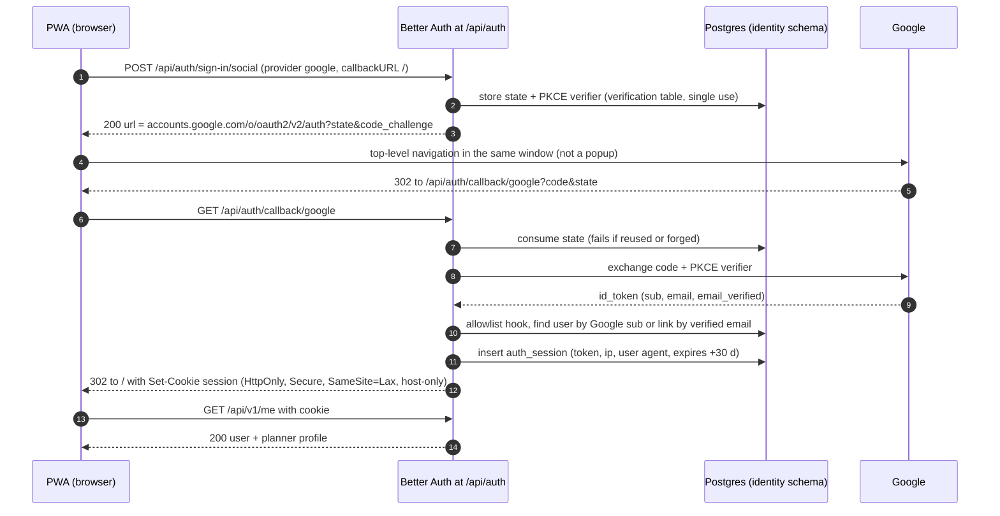
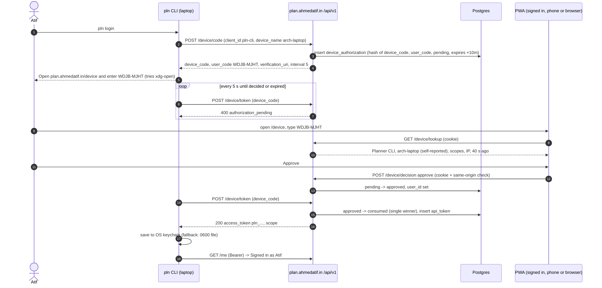

# 06 · Auth and Identity

> Slice owner: brainstorm agent 06 · Written 2026-10-05 · Status: proposal, not yet decided
> Scope: how people sign in to the PWA, how browser sessions work, how non-browser clients (git hook, VS Code, Claude Code, MCP) get scoped tokens, and how this grows into one shared identity across `*.ahmedatif.in` without a rewrite.
> Placeholder names used throughout: app origin `plan.ahmedatif.in`, CLI `pln`, token prefix `pln_`. Rename freely once the app has a name (§7 of JOURNEY).

---

## 1. TL;DR

- **Use Better Auth (1.7.7 or newer) as a library inside your own TypeScript API** for everything a browser touches: Google sign-in, sessions, later email OTP and passkeys. Do not use a managed identity provider, and do not hand-roll the browser parts.
- **Build the machine-token system yourself** (about 400 lines): prefixed `pln_` personal access tokens, hashed at rest with SHA-256, scoped (`sessions:write`, `commits:write`, ...), named per device, with last-used tracking and one-click revocation. The **OAuth device flow (RFC 8628) is just a second way to mint the same token**, so VS Code and the CLI log in without copy-pasting. This is the part of auth that is specific to your app, and it is the part you will be asked about in interviews.
- **v0 (only you):** Sign in with Google, gated by an email allowlist. No passwords, ever. Recovery is a documented re-link script, because you own the server.
- **v1 (other students):** add **email OTP codes, not magic links**. Magic links break in installed PWAs, because the link opens in the browser and the session lands in the wrong cookie jar. Add invite codes and a device list. Passkeys come after that, as an add-on.
- **Browser sessions are opaque tokens stored in the database and sent in an HttpOnly cookie, not JWTs.** That makes the device list, sign-out-everywhere and instant revocation trivial. Use a 30-day sliding expiry. The CSRF defence is SameSite=Lax plus a same-origin check on every state-changing request that is authenticated by cookie.
- **Tokens never live in a repo, in a hook script, or in `git config`.** Your `~/dotfiles` repo makes `~/.gitconfig` a leak path. They live in the OS keychain, with a mode-0600 file as the fallback. Inside VS Code they live in `SecretStorage`. Claude Code hooks and the MCP server fetch the token at runtime through `pln`.
- **Shared identity later means a central OIDC provider at `accounts.ahmedatif.in`, not a parent-domain cookie.** Five cheap things to do now: UUIDv7 user IDs, a separate `identity` Postgres schema, host-only cookies, passkey `rpID = ahmedatif.in`, and an `audience` column on tokens. Then the later move is a deploy, not a data migration.

---

## 2. Assumptions about other slices

These are stated so a critic can catch mismatches. If one turns out to be wrong, the section noted next to it needs revisiting.

| # | Assumption | Slice | If wrong |
|---|---|---|---|
| A1 | The backend is **TypeScript on Node 22+** (Hono, Fastify or similar), one deployable API. I use Hono in snippets. | 03 | If it's Go/Python/Rust, Better Auth is out. Fall back to approach C (hand-rolled with that language's OAuth/WebAuthn libs) or approach A (managed). The token design (§5.7–5.9) is language-agnostic. |
| A2 | **Postgres** is the primary database (version 17 or 18; 18 has a native `uuidv7()`). Query layer is Drizzle or Kysely. | 04 | Better Auth also supports SQLite/MySQL. Replace `bytea`, `inet` and `text[]` with portable types. |
| A3 | **The app and the API share one origin** (`plan.ahmedatif.in` serves the PWA, `plan.ahmedatif.in/api/*` the API). No separate `api.` subdomain. | 07 | A separate API host means CORS with credentials and more careful cookie settings. It's still doable, but the CSRF rules in §5.5 change. |
| A4 | There is **one API instance** at first, behind a reverse proxy or CDN that sets a trusted client-IP header (`CF-Connecting-IP` or `X-Forwarded-For` from a known hop). | 07 | Multiple instances need the rate-limit store in Postgres or Redis. I already recommend Postgres. |
| A5 | **All IDs are UUIDv7, generated in the app or by Postgres**, and every user-owned row has a `user_id` column. | 02 | Integer user IDs would make the shared-identity move a data migration. Please don't. |
| A6 | The data model calls a timer run a **"work session"** and stores it in a table like `work_session`. Better Auth's session table is renamed to **`auth_session`** to avoid the collision. | 02, 05 | Two tables both called `session` will cause bugs and confusing interviews. |
| A7 | Realtime (if any) is **SSE or WebSocket on the same origin**, authenticated by the session cookie at connect time. Heartbeats (D-009) are plain HTTPS POSTs that accept bearer tokens. | 05 | If 05 uses a third-party realtime service, that service needs its own short-lived token minted by our API. |
| A8 | Integrations (git hook, VS Code, Claude Code, MCP) call the API with `Authorization: Bearer pln_...`, and the **`.planner` repo link file holds only a project ID**. | 08 | If 08 wants the hook to be pure shell with no CLI, the token has to come from a 0600 file that the hook reads (§5.9). Still never from the repo. |
| A9 | The PWA treats a `401` from `/api/*` as "show the sign-in screen". The service worker never caches `/api/auth/*` responses, and **the Web Share Target POST is handled inside the service worker** (stored locally, synced later) and never sent straight to the server. | 09, 11 | A share-target POST that reaches the server directly comes with `Origin: null` or `Sec-Fetch-Site: none`, and my CSRF guard rejects it. That is the correct behaviour, but it will look like a bug. |
| A10 | Email sending exists from v1 on, via **Resend** (free plan: 3,000/month, capped at 100/day), from a subdomain such as `mail.ahmedatif.in`. | 07 | Any SMTP provider works. The daily cap matters for rate limits (§5.10). |

---

## 3. Three genuinely different approaches

| Approach | Pros | Cons | Solo-dev effort | Interview value |
|---|---|---|---|---|
| **A. Managed identity provider** (WorkOS AuthKit, Clerk, Supabase Auth). The provider hosts the login UI, sessions and user store. Your API verifies their JWTs. | Least code. Hosted UI, bot protection and MFA. Someone else patches CVEs. Generous free tiers: AuthKit free to 1M MAU, Clerk Hobby 50k MRU per app, Supabase Auth 50k MAU. A provider is already "central accounts" for future `*.ahmedatif.in` apps. | Your users live in someone else's database. Clerk's free plan excludes passkeys, MFA and satellite domains (all Pro, $25/mo, with satellites at $10/mo each). Machine tokens for the git hook and VS Code still need building, or bending the vendor's M2M product to fit. Vendor JWT verification and webhooks for user sync add moving parts. Free tiers and terms change. | **Low** for browser login (1–2 days). **Medium** for machine tokens, which stay your problem. | **Low–medium.** "I integrated Clerk" is a config story. You can still talk about JWT verification and webhooks. |
| **B. Library in your API** (Better Auth 1.7.x for browser auth) **plus your own token module** for machine clients. *Recommended.* | Users and sessions live in your Postgres, one schema you control. A well-trodden implementation of the dangerous parts: OAuth state and PKCE, WebAuthn ceremonies, cookie signing, the OTP lifecycle. Plugins exist for OTP, passkeys and, later, an OAuth/OIDC provider for `accounts.ahmedatif.in`. Free. You still design the session policy, CSRF guard, scopes, device flow and threat model. | You own patching. Better Auth published **37 security advisories between Dec 2024 and Sep 2026**, including a *critical* one fixed in 1.7.7 on 2026-09-30. You must stay current. Plugin APIs churn: the api-key plugin renamed `userId` to `referenceId`. | **Medium:** about 3 days for v0 login, about 1 week for tokens and the device flow in v3. | **High.** You can explain why sessions are not JWTs, why tokens use SHA-256 and not argon2, how the device flow works, and what your threat model is, and you built the app-specific half yourself. |
| **C. Hand-rolled on primitives** in the "Copenhagen Book" / Lucia-guide style. Your own `auth_session` table and cookie code, `oauth4webapi` for Google, `@simplewebauthn/server` for passkeys, your own OTP. | Maximum understanding and no framework lock-in. Sessions really are about 200 lines; this is why Lucia's author deprecated Lucia and published a guide instead. Strong "I know how it works" story. | Every subtle bug is yours, and nobody else is looking for it. OAuth state/PKCE, account linking, OTP brute-force limits, WebAuthn counter and backup-flag handling, and timing-safe comparisons all have to be right. The helper libraries are thinning out: Arctic and most `@oslojs/*` packages were deprecated on 2026-07-29. | **High:** 2–3 weeks to reach parity with B's v1, and it competes with the actual product. | **Very high if done well, negative if a reviewer finds a hole.** |

**Approach A** is what a startup with paying customers should do, and the honest default for someone who just wants the app. It fits you badly for three reasons. First, the hardest auth work in this project is not browser login, which managed providers solve. It's machine tokens for the git hook, VS Code and Claude Code, which they mostly don't. You'd end up with a vendor for the easy half and your own code for the hard half. Second, the long-term "Google-style accounts across `*.ahmedatif.in`" vision is itself a showcase. Renting it removes the story. Third, Clerk's free plan excludes passkeys and satellite domains, the two features this design wants later. AuthKit's 1M-MAU free tier is the strongest managed option and is the fallback if B goes badly (§4).

**Approach B** splits the work along a sensible line. Generic, standardised and easy-to-get-subtly-wrong code comes from a library that thousands of apps exercise. App-specific policy you write yourself and can explain: session lifetime, CSRF on your own routes, scopes, token format, device flow, client-side storage. Better Auth is the current default in the TypeScript ecosystem. Auth.js/NextAuth is now maintained by the Better Auth team, and new projects are pointed at Better Auth. Its downside is real and quantified in §4.

**Approach C** is the best learning project and the worst product decision. It's tempting because Lucia's own author argues sessions are simple, and he's right about sessions. But OAuth account linking and WebAuthn are where hand-rolled auth actually breaks. Better Auth's own advisory list ("OAuth sign-in can link to an account an attacker registered in advance", "OAuth callback accepts a forged state value") shows that even a full-time team gets these wrong. You would too, with nobody filing advisories against your code.

**Also considered:** a **self-hosted identity server from day one** (Zitadel v4.19.4, Logto v1.44.0, Keycloak 26.8.0, Pocket ID v2.18.0, authentik 2026.8.3, Ory Kratos/Hydra v26.2.0). This is "build `accounts.ahmedatif.in` first". It's rejected for now because it doubles the services you operate (Keycloak alone typically wants around 1 GB of RAM) before a second app exists. Revisit it when the second app arrives (§5.13, §9 Q9).

---

## 4. Recommendation

**Approach B.** Better Auth ≥ 1.7.7, embedded in the API, with the **smallest possible plugin surface**:

- v0: core plus Google.
- v1: add `emailOTP`, then `passkey`.
- Later: `oauth-provider` and `jwt` when `accounts.ahmedatif.in` happens.

Your own `identity/tokens` and `identity/device` modules issue and verify every non-browser credential. Email/password is **disabled**. Sessions are database-backed, cookie-carried and host-only.

### The strongest argument against it

*"You are a student with exams, not a security team, and you're volunteering to be on call for an auth library with a long advisory history."*

The numbers are real. Better Auth published 37 GitHub security advisories from December 2024 to September 2026, and several were rated critical. Two account-takeover advisories landed on **2026-09-30, five days ago**. One is the critical "OAuth state can be used as a Magic Link to sign in as another user", which affects every version from 1.4.0-beta.18 up to before 1.7.7. The other is the high-severity "OAuth Proxy lets an attacker sign in as another user". About eleven of the 37 hit features this design would use: OAuth state handling, trusted-origin redirect checks, the rate limiter (an IPv6-rotation bypass), path normalisation, passkey ownership and the error page.

A managed provider patches these server-side while you sleep. With B, a mid-semester critical you miss for three weeks is a real account-takeover window on an app that holds your timetable. A timetable is a precise record of where you physically are and when, so this is not trivial data.

The steelman continues from the other side. B is also *worse for learning than C*. "I configured Better Auth" hides exactly what interviewers probe: how sessions are stored, how the cookie is signed, how OAuth state is bound. And the library's own device-authorization and API-key plugins had authorisation bugs ("Any signed-in user can approve or deny another person's device sign-in"; "Anyone can create or change API keys for another user"). So "use the library because it's safer" isn't automatically true even for the library's own code.

**Why I still recommend B:**

- The advisory volume is partly a sign of scrutiny. Fixes shipped within days, and a hand-rolled implementation would have similar bugs that nobody reports.
- About 23 of the 37 were in plugins or modes this design never enables: SSO, SCIM, organisations, Stripe, the OAuth proxy, the OIDC provider, multi-session, 2FA and secondary storage.
- The plugins with authorisation bugs are exactly the ones I'm telling you to write yourself, with those advisories turned into test cases (§7).
- The patch treadmill is manageable with three habits:
  1. Dependabot/Renovate security alerts on.
  2. "Watch → Security alerts" on the `better-auth` repo.
  3. A scripted login smoke test (`agent-browser` or Playwright) that you run before deploying any auth bump.

**Switch conditions:**

- **Move to approach A (WorkOS AuthKit)** if you miss a critical-advisory patch window by more than 7 days twice, or if v1 grows past roughly 200 real users and you want MFA and bot protection without building them. The `identity` schema boundary (§5.2) keeps that migration contained: users keep their UUIDs, and you store the vendor's user ID as an external account.
- **Move to approach C for sessions only** if a Better Auth major upgrade costs more than two days of migration work. Keep `oauth4webapi` and `@simplewebauthn/server` for the hard parts.
- **Re-open the whole decision** if slice 03 picks a non-TypeScript backend (assumption A1).

---

## 5. Implementation walkthrough

### 5.1 Module layout

```
api/src/
  identity/                 # everything auth; the rest of the app imports only from identity/index.ts
    index.ts                # exports: authenticate, requireScope, requireBrowserSession, IdentityService
    better-auth.ts          # betterAuth({...}) config, mounted at /api/auth/*
    principal.ts            # Principal type + helpers
    csrf.ts                 # same-origin guard for cookie-authenticated mutations
    tokens.ts               # pln_ token generation, hashing, verification, CRUD
    scopes.ts               # the scope registry (single source of truth)
    device.ts               # RFC 8628 endpoints
    clients.ts              # registry of first-party public clients (pln-cli, vscode, claude-code, mcp)
    rate-limit.ts           # app-level limits Better Auth doesn't cover (per-email OTP, device codes, bad bearer tokens)
    events.ts               # auth_event audit log
    account.ts              # export + delete
  planner/                  # the actual app; never touches identity tables directly
cli/                        # `pln` (Node): login, logout, whoami, hook, mcp, auth header
vscode-ext/                 # AuthenticationProvider backed by SecretStorage
```

There is one rule worth enforcing with an ESLint `no-restricted-imports` rule: **`planner/**` may import from `identity/index.ts` only.** This boundary is what makes the shared-identity move cheap later.

### 5.2 Identifiers and the schema boundary (the "do it now" part of shared identity)

```sql
-- Postgres 18 has uuidv7() built in; on 17, generate in app code (uuid@14 v7()).
create schema identity;   -- Better Auth tables + our token tables
create schema planner;    -- everything else

-- Better Auth creates these (names configured, see 5.3):
--   identity."user", identity.account, identity.auth_session, identity.verification, identity.passkey
-- Planner tables reference the user only by id:
create table planner.profile (
  user_id     uuid primary key references identity."user"(id) on delete cascade,
  timezone    text not null default 'Asia/Kolkata',
  week_starts smallint not null default 1,          -- Monday
  created_at  timestamptz not null default now()
);
```

Rules:

1. **User IDs are UUIDv7 from day one.** When `accounts.ahmedatif.in` exists, its OIDC `sub` claim *is* this UUID, so no planner row ever changes.
2. **Email is an attribute, not a key.** It can change, and KIIT accounts get deactivated after graduation (§6, trap 12).
3. **App-specific profile data lives in `planner.profile`, not in the identity `user` table.** Future apps get their own profile tables, and the identity user stays small: id, name, email, image.
4. Planner code reads user info only through `IdentityService.getUser(id)`, never with a join into `identity.*`. Later, that function changes from a SQL query into a claim read or an HTTP call.

### 5.3 Browser auth: Better Auth configuration

```ts
// identity/better-auth.ts  (better-auth 1.7.7)
import { betterAuth, APIError } from "better-auth";
import { emailOTP } from "better-auth/plugins";       // v1
import { passkey } from "@better-auth/passkey";       // v1.5
import { v7 as uuidv7 } from "uuid";
import { pool } from "../db";

export const auth = betterAuth({
  appName: "Planner",
  baseURL: env.APP_ORIGIN,                  // https://plan.ahmedatif.in
  basePath: "/api/auth",
  secret: env.BETTER_AUTH_SECRET,           // 32+ random bytes; NOT stored in DB or backups
  database: pool,                           // pg Pool with search_path=identity
  trustedOrigins: [env.APP_ORIGIN],         // exact origin, no wildcards
  emailAndPassword: { enabled: false },     // no passwords, ever (see Traps)
  socialProviders: {
    google: {
      clientId: env.GOOGLE_CLIENT_ID,
      clientSecret: env.GOOGLE_CLIENT_SECRET,
      prompt: "select_account",             // students juggle personal + kiit.ac.in accounts
    },
  },
  account: {
    accountLinking: { enabled: true, trustedProviders: ["google"] }, // link only on verified email
  },
  session: {
    modelName: "auth_session",              // avoid clash with planner work sessions
    expiresIn: 60 * 60 * 24 * 30,           // 30 days, sliding
    updateAge: 60 * 60 * 24,                // extend at most once a day
    freshAge: 60 * 10,                      // "fresh" = signed in within 10 min (step-up)
    cookieCache: { enabled: false },        // DB lookup per request is cheap at this scale; instant revocation
  },
  rateLimit: { enabled: true, storage: "database", customRules: { /* see 5.10 */ } },
  advanced: {
    database: { generateId: () => uuidv7() },
    ipAddress: { ipAddressHeaders: ["cf-connecting-ip"] }, // whatever 07's proxy sets, and ONLY that
    // no crossSubDomainCookies: cookies stay host-only (see 5.13)
  },
  databaseHooks: {
    user: {
      create: {
        before: async (user) => {
          if (!(await isAllowedToSignUp(user.email))) {
            throw new APIError("FORBIDDEN", { message: "not_invited" });
          }
          return { data: user };
        },
      },
    },
  },
  plugins: [
    // v1:
    // emailOTP({ otpLength: 6, expiresIn: 600, allowedAttempts: 3, storeOTP: "hashed",
    //            sendVerificationOTP: queueOtpEmail }),   // default storeOTP is "plain": change it
    // v1.5:
    // passkey({ rpID: "ahmedatif.in", rpName: "ahmedatif", origin: env.APP_ORIGIN }),
  ],
});

// Hono mount
app.on(["GET", "POST"], "/api/auth/*", (c) => auth.handler(c.req.raw));
```

Facts verified against the 1.7.7 package source on 2026-10-05:

- **Session tokens.** The session row stores a random 32-character token, and the cookie carries that token plus an HMAC signature keyed by `BETTER_AUTH_SECRET`. A leaked database dump alone therefore can't be replayed as a cookie. Keep the secret out of the database, out of backups and out of the repo.
- **OTP storage.** Email OTPs are stored in plain text by default, so set `storeOTP: "hashed"`.
- **Option names.** `advanced.database.generateId` accepts a function, `"uuid"`, `"serial"` or `false`. The passkey plugin takes `rpID`, `rpName` and `origin`.

### 5.4 Sign-in methods by phase

| Phase | Methods | Why |
|---|---|---|
| **v0** (just you) | **Google** + allowlist (`ALLOWED_EMAILS=you@gmail.com`) | Zero email infrastructure. Works on Android, desktop Brave/Chrome and iOS. Google needs no app verification for `openid email profile`. It takes one afternoon. |
| **v1** (other students) | Google + **email OTP** (6-digit code, 10-minute expiry, 3 attempts) + **invite codes** | OTP is the fallback for people who won't use Google, and it's the account-recovery channel. Invites keep a public URL from becoming a spam target and protect the 100-emails/day quota. |
| **v1.5** | **Passkeys** as an *additional* method, added from Settings | They're nice, but they're the weakest on your own daily driver (desktop Linux + Brave), so they can't be primary. |
| **Later** | GitHub as a *linked* login (only when its primary email is verified) | Natural for developers. Keep "sign in with GitHub" separate from "grant repo access" (08's concern). |
| **Never** | Email + password | Hashing, resets, breach checks, enumeration and pre-registration attacks. It's all cost and no benefit when OTP exists. |

**v0 login sequence (Google).** The v1 OTP flow is the same from step 10 onward. Steps 1–9 are replaced by "send code → type code → verify".



**Why OTP codes and not magic links.** A magic link is clicked in an email client and opens in *whatever browser the OS picks*. On iOS, a home-screen web app has storage separate from Safari, so the link signs Safari in, not your installed PWA. On Android, if the PWA was installed from Chrome but your default browser is Brave, the link opens in Brave, which also has the wrong cookie jar. University and Outlook link scanners also pre-fetch links and burn single-use tokens. A 6-digit code is *typed into the app that needs the session*, so all three problems disappear. You can show this trade-off in an interview.

**Passkey `rpID` decision, made now.** WebAuthn lets the relying-party ID be a registrable suffix of the origin. If you register passkeys with `rpID = "plan.ahmedatif.in"`, they can never be used on `accounts.ahmedatif.in`, and every user would have to re-register when shared identity arrives. With `rpID = "ahmedatif.in"` they work on every subdomain. The server still checks the exact `origin` inside `clientDataJSON`, so a sibling subdomain cannot replay an assertion to the planner.

### 5.5 Sessions, cookies, CSRF, device list

**Sessions are opaque and stored in the database. They are not JWTs.** The reasoning:

| Need | DB session | JWT session |
|---|---|---|
| "Sign out everywhere" | `delete from auth_session where user_id = $1` | Needs a revocation list, which is a DB lookup anyway, or waiting for expiry |
| Device list with "last active" | Rows already hold `ip_address`, `user_agent`, `updated_at` | You'd have to build a session table anyway |
| Revoke on account delete | Immediate | Delayed until expiry |
| Per-request cost | One indexed lookup, about 0.2 ms | Signature check |

At D-009's own upper bound (10k active coders, about 83 req/s), the lookup cost is irrelevant. JWTs earn their place only *between services*: later, `accounts.ahmedatif.in` will issue ID tokens to other apps (§5.13).

**Cookie.** Better Auth sets `__Secure-better-auth.session_token` with `HttpOnly; Secure; SameSite=Lax; Path=/`, host-only (no `Domain`). Sliding 30-day expiry, extended at most once per day.

**CSRF.** Better Auth protects its own `/api/auth/*` routes (origin check against `trustedOrigins`, Fetch Metadata, `SameSite=Lax`). **Your own `/api/v1/*` routes need their own guard**, because SameSite=Lax is not enough on its own. It doesn't stop same-site attacks from a sibling subdomain, and older browsers behave differently.

```ts
// identity/csrf.ts
const SAFE = new Set(["GET", "HEAD", "OPTIONS"]);
export function isSameOriginMutation(req: Request, appOrigin: string): boolean {
  if (SAFE.has(req.method)) return true;
  const site = req.headers.get("sec-fetch-site");
  if (site !== null) return site === "same-origin";            // NOT "same-site": siblings are hostile
  const origin = req.headers.get("origin");
  return origin === appOrigin;                                  // null/absent Origin on a mutation = reject
}
// Also: mutations must be Content-Type: application/json (415 otherwise), and no state change on GET, ever.
```

The guard applies **only to cookie-authenticated requests**. Bearer-token requests are immune to CSRF because browsers never attach the header automatically.

**Device list and sign-out.** Settings → Security shows:

- Each `auth_session`: parsed user agent ("Brave on Linux"), coarse IP, created, last active, and "This device".
- Each `api_token`: name, client, scopes, created, last used, last IP.

The actions are:

- **Sign out** (this session).
- **Sign out of other devices** (`revokeOtherSessions`).
- **Revoke** per token.
- **Revoke all tokens.**

Browser sessions and machine tokens are **deliberately separate buttons**. Signing out of your phone shouldn't silently kill the git hook on your laptop.

**Step-up.** These actions require a *fresh* session (signed in within 10 minutes; otherwise re-authenticate with Google, OTP or a passkey):

- Creating a token.
- Approving a device.
- Exporting data.
- Deleting the account.
- Changing sign-in methods.

**Realtime.** WebSocket/SSE connections authenticate with the cookie at connect time and check `Origin === APP_ORIGIN` on upgrade, to stop cross-site WebSocket hijacking. When a session is revoked, publish a `session_revoked` event so open sockets for that session close (§7, test S7).

### 5.6 Request authentication: one `Principal`, two ways in

```ts
// identity/principal.ts
export type Principal =
  | { kind: "browser"; userId: string; sessionId: string; sessionCreatedAt: Date }   // all scopes
  | { kind: "token"; userId: string; tokenId: string; client: ClientId; scopes: ReadonlySet<Scope> };

// identity/index.ts
export const authenticate: MiddlewareHandler = async (c, next) => {
  const authz = c.req.header("authorization");
  if (authz !== undefined) {                                  // Bearer present => bearer ONLY, never fall back to cookie
    const m = /^Bearer (pln_[0-9A-Za-z]{42})$/.exec(authz);
    if (!m || !hasValidChecksum(m[1])) return unauthorized(c, "invalid_token");
    const p = await tokens.authenticate(m[1], reqMeta(c));
    if (!p) { await rl.noteBadToken(reqMeta(c).ipBucket); return unauthorized(c, "invalid_token"); }
    c.set("principal", p);
    return next();
  }
  const s = await auth.api.getSession({ headers: c.req.raw.headers });
  if (s) {
    if (!isSameOriginMutation(c.req.raw, env.APP_ORIGIN)) return c.json({ error: "csrf" }, 403);
    c.set("principal", { kind: "browser", userId: s.user.id, sessionId: s.session.id,
                         sessionCreatedAt: s.session.createdAt });
  }
  return next();
};

export const requireScope = (needed: Scope): MiddlewareHandler => async (c, next) => {
  const p = c.get("principal");
  if (!p) return unauthorized(c);
  if (p.kind === "token" && !p.scopes.has(needed)) {
    c.header("WWW-Authenticate", `Bearer error="insufficient_scope", scope="${needed}"`);
    return c.json({ error: "insufficient_scope", needed }, 403);
  }
  return next();
};

// Token management, device approval, export, delete: browser sessions ONLY (a leaked token can't mint tokens).
export const requireBrowserSession = (opts: { fresh?: boolean } = {}): MiddlewareHandler => async (c, next) => {
  const p = c.get("principal");
  if (!p || p.kind !== "browser") return c.json({ error: "browser_session_required" }, 403);
  if (opts.fresh && Date.now() - p.sessionCreatedAt.getTime() > 10 * 60_000)
    return c.json({ error: "reauth_required" }, 401);
  return next();
};
```

**The `userId` always comes from the principal, never from a request body or path.** This single rule prevents the class of bug behind CVE-2025-61928 ("Anyone can create or change API keys for another user").

### 5.7 Machine tokens: format, storage, scopes, lifecycle

**Format:** `pln_` + 36 random base62 characters (≈214 bits) + 6-character base62 CRC32 checksum of the random part. That is 46 characters in total. It matches the regex `\bpln_[0-9A-Za-z]{42}\b`.

- **The prefix** makes a leaked token greppable and lets scanners recognise it. GitHub's *custom* secret-scanning patterns are only for organisation-owned repos with Secret Protection, not personal repos (checked 2026-10-05). So ship a `gitleaks` rule (gitleaks v8.30.1) for your own pre-commit hook and document the format in `SECURITY.md` so others can add it.
- **The checksum** lets the CLI catch typos offline and lets the API drop garbage before touching the database. It's the same idea as GitHub's `ghp_` tokens. It is *not* a security feature.
- **One prefix, one token type.** Tokens from the web UI and tokens from the device flow are the same kind of object. There are no refresh tokens (see Traps, trap 3).

```ts
// identity/tokens.ts
import { randomBytes, createHash } from "node:crypto";
import { crc32 } from "node:zlib";                       // Node ≥ 20.15 / 22.2
const B62 = "0123456789ABCDEFGHIJKLMNOPQRSTUVWXYZabcdefghijklmnopqrstuvwxyz";

function randomBase62(n: number): string {               // rejection sampling: no modulo bias
  let out = "";
  while (out.length < n) for (const b of randomBytes(n * 2)) {
    if (b < 248) out += B62[b % 62];                     // 248 = 62 * 4
    if (out.length === n) break;
  }
  return out;
}
const toB62 = (x: number, len: number) => { let s = ""; do { s = B62[x % 62] + s; x = Math.floor(x / 62); } while (x > 0); return s.padStart(len, "0"); };
export const sha256 = (s: string) => createHash("sha256").update(s).digest();

export function generateToken(): { token: string; hash: Buffer; hint: string } {
  const body = randomBase62(36);
  const token = `pln_${body}${toB62(crc32(body), 6)}`;
  return { token, hash: sha256(token), hint: `pln_${body.slice(0, 4)}…${token.slice(-4)}` };
}
export function hasValidChecksum(token: string): boolean {
  const body = token.slice(4, 40), sum = token.slice(40);
  return toB62(crc32(body), 6) === sum;
}
```

**Why SHA-256 and not argon2/bcrypt?** Slow hashes exist to protect *low-entropy* secrets (passwords) from offline guessing. A 214-bit random token can't be guessed, so one SHA-256 is enough. It also has to be fast, because it runs on *every* API call. Argon2 at OWASP's minimum (19 MiB, t=2) costs tens of milliseconds and 19 MiB of RAM per request. At D-009's 83 req/s that would be a full CPU core and about 1.5 GB of churn spent on hashing. We look tokens up *by hash*, so there's no secret-dependent string comparison to make constant-time. An optional server-side HMAC "pepper" would add key-rotation pain for no gain at this entropy, so skip it.

**Schema:**

```sql
create table identity.api_token (
  id             uuid primary key,                         -- uuidv7
  user_id        uuid not null references identity."user"(id) on delete cascade,
  name           text not null check (char_length(name) between 1 and 80),  -- "Planner CLI · arch-laptop"
  client         text not null check (client in ('pln-cli','vscode','claude-code','mcp','manual')),
  token_hash     bytea not null unique,                    -- sha256(full token)
  token_hint     text not null,                            -- "pln_7Hq2…Xk9a" for the UI and logs
  scopes         text[] not null check (cardinality(scopes) > 0),
  audience       text not null default 'planner',          -- cheap now, matters with shared identity
  created_via    text not null check (created_via in ('ui','device_flow')),
  created_at     timestamptz not null default now(),
  expires_at     timestamptz,                              -- null = no fixed expiry (inactivity rule still applies)
  last_used_at   timestamptz,
  last_used_ip   inet,
  last_used_ua   text,
  revoked_at     timestamptz,
  revoked_reason text                                      -- 'user', 'sign_out_all_tokens', 'account_deleted', 'leak_detected', 'inactive'
);
create index api_token_user_active on identity.api_token (user_id) where revoked_at is null;
```

**Scopes** (`identity/scopes.ts` is the single source of truth):

| Scope | Allows | Used by |
|---|---|---|
| `sessions:read` | Read work sessions and the running timer | VS Code, MCP |
| `sessions:write` | Start, stop and heartbeat work sessions (D-009) | git hook, VS Code, Claude Code, MCP |
| `commits:write` | Attach commit refs to sessions/tasks | git hook |
| `projects:read` | List projects, resolve a `.planner` link | git hook, VS Code, Claude Code |
| `tasks:read` / `tasks:write` | Read and edit tasks | VS Code (read), MCP (both) |
| `dump:write` | Add to the thought dump | MCP |
| `calendar:read` | Read today's blocks ("what's my day?") | MCP |

Presets per client (the device flow grants *at most* the client's ceiling, defined in `clients.ts`):

- `pln-cli` (git hook): `commits:write sessions:write projects:read`
- `vscode`: `projects:read tasks:read sessions:read sessions:write`
- `claude-code`: `sessions:write projects:read`
- `mcp`: `tasks:read tasks:write sessions:read sessions:write dump:write calendar:read`

**No scope can reach** `/api/auth/*`, token management, device approval, export or delete. Those require a browser session (§5.6).

**Verification:**

```ts
export async function authenticate(token: string, meta: ReqMeta): Promise<TokenPrincipal | null> {
  const row = await db.oneOrNone(`
    select id, user_id, client, scopes from identity.api_token
     where token_hash = $1 and revoked_at is null
       and (expires_at is null or expires_at > now())
       and coalesce(last_used_at, created_at) > now() - interval '90 days'`, [sha256(token)]);
  if (!row) return null;
  // throttled write: at most one UPDATE per token per 5 minutes (heartbeats come every ~2 min)
  await db.none(`update identity.api_token set last_used_at = now(), last_used_ip = $2, last_used_ua = $3
                  where id = $1 and (last_used_at is null or last_used_at < now() - interval '5 minutes')`,
                [row.id, meta.ip, meta.ua?.slice(0, 200)]);
  return { kind: "token", userId: row.user_id, tokenId: row.id, client: row.client, scopes: new Set(row.scopes) };
}
```

**Lifecycle:**

- **Creation.** UI (fresh browser session) or device flow. The plaintext token is shown **once** and is never retrievable afterwards.
- **Expiry.** No fixed expiry by default. A token that is **unused for 90 days stops working**, which is visible in the UI as "expired (inactive)". The user can choose a fixed expiry (30/90/365 days).
- **Rotation** is "create a new token, then revoke the old one". `pln login` does this automatically: it mints a new token via the device flow, then revokes the previous token ID stored next to it.
- **Revocation** is immediate. There is no token cache, so the next request fails.
- **Leak response:** revoke in the UI, check `last_used_ip` and the `auth_event` log, run `pln login` again.

### 5.8 Device authorization flow (RFC 8628), self-built

Why build it rather than use Better Auth's `deviceAuthorization` plugin? Three reasons:

1. That plugin **issues a full Better Auth session token**, not a scoped token. A leaked git-hook credential would then be a complete account login.
2. It had two authorisation advisories, one in May 2026 and one in Sep 2026, including "approval does not show the requesting client or permissions".
3. The flow is about 200 lines once tokens exist, and it's one of the best things in this project to whiteboard.

```sql
create table identity.device_authorization (
  id               uuid primary key,
  device_code_hash bytea not null unique,           -- sha256(device_code); device_code = 32 random bytes, base64url
  user_code        text not null,                    -- normalised: 8 chars from BCDFGHJKLMNPQRSTVWXZ (RFC 8628 §6.1)
  client_id        text not null,                    -- key into clients.ts
  device_name      text not null check (char_length(device_name) <= 60),  -- self-reported, shown as such
  scopes           text[] not null,                  -- already clamped to the client's ceiling
  requested_ip     inet,
  requested_ua     text,
  status           text not null default 'pending'
                   check (status in ('pending','approved','denied','consumed')),
  user_id          uuid references identity."user"(id) on delete cascade,  -- set on approve
  interval_seconds int not null default 5,
  last_polled_at   timestamptz,
  expires_at       timestamptz not null,             -- created_at + 10 min
  created_at       timestamptz not null default now(),
  decided_at       timestamptz,
  token_id         uuid references identity.api_token(id)
);
create unique index device_user_code_live on identity.device_authorization (user_code)
  where status in ('pending','approved');
```

**User code design.** Eight characters from a 20-consonant alphabet (no vowels, so no accidental words; no 0/O/1/I confusion), displayed as `WDJB-MJHT`. That's 20⁸ ≈ 2.6 × 10¹⁰ possibilities. With 10 wrong guesses allowed per 15 minutes per signed-in user and a 10-minute lifetime, brute force is hopeless. Input is normalised: uppercase, separators stripped, and `0→O`-style lookalikes are rejected rather than guessed.

**Endpoint signatures:**

```ts
// POST /api/v1/device/code          (no auth; rate-limited 10/hour per IP bucket)
startDeviceAuthorization(body: { client_id: ClientId; scope?: string; device_name: string }, meta: ReqMeta)
  : Promise<{ device_code: string; user_code: string; verification_uri: string;
              verification_uri_complete: string; expires_in: 600; interval: 5 }>

// POST /api/v1/device/token         (no auth; the device_code is the credential)
pollDeviceToken(body: { grant_type: "urn:ietf:params:oauth:grant-type:device_code"; device_code: string; client_id: ClientId })
  : Promise<{ access_token: string; token_type: "Bearer"; scope: string }
          | { error: "authorization_pending" | "slow_down" | "access_denied" | "expired_token" | "invalid_grant" }>

// GET  /api/v1/device/lookup?user_code=...   (browser session; 10 misses / 15 min per user)
// POST /api/v1/device/decision {user_code, decision: "approve" | "deny"}   (browser session + CSRF guard)
decideDevice(userId: string, userCode: string, decision: "approve" | "deny"): Promise<void>
```

**Atomic transitions.** These enforce single use and a single token:

```sql
-- approve (or deny): only from pending, only while live
update identity.device_authorization
   set status = $3, user_id = $2, decided_at = now()
 where user_code = $1 and status = 'pending' and expires_at > now()
returning id;                                  -- 0 rows => 409 "already decided or expired"

-- poll that wins: approved -> consumed exactly once
update identity.device_authorization
   set status = 'consumed'
 where device_code_hash = $1 and client_id = $2 and status = 'approved' and expires_at > now()
returning id, user_id, scopes, device_name, client_id;
-- then, in the same transaction, insert api_token and set token_id
```

**Polling.** If `now() - last_polled_at < interval_seconds`, respond `slow_down` and increase `interval_seconds` by 5, as the RFC says. If the code is past its expiry or not found, respond `expired_token`.

**Approval page.** This is the defence against device-code phishing (RFC 8628 §5.4, actively abused against Microsoft 365 in 2025–26). The page shows:

- The client's display name from `clients.ts`, for example "Planner CLI".
- The device name, labelled *"reported by the device"*.
- Each scope in plain English.
- The requesting IP and "requested 40 seconds ago".
- A warning: *"Only approve if you just ran this yourself. Nobody will ever ask you for this code."*

`verification_uri_complete` pre-fills the code but **never auto-approves on GET**. From v1 on, every approval also sends a "New device signed in" email.

**Honest caveat to state in interviews:** the CLI and VS Code are *public clients*. They can't keep a secret, so `client_id` is a label and a scope ceiling, not authentication. The user's approval is the authentication.



### 5.9 Where tokens live on each client

| Client | Token location | Never here |
|---|---|---|
| **`pln` CLI + git hook** | OS keychain via `@napi-rs/keyring` 2.1.0 (Secret Service/libsecret on Linux, Keychain on macOS, Credential Manager on Windows). Service `in.ahmedatif.planner`, account = API base URL, so dev and prod tokens coexist. **Fallback:** `$XDG_CONFIG_HOME/planner/credentials.json`, file mode 0600 inside a 0700 directory, with a printed warning. **Override:** `PLANNER_TOKEN` env var for CI. | `~/.gitconfig`, which is often tracked in a dotfiles repo (yours is). `.git/config`, `.planner`, the hook script itself, shell rc files. |
| **Git hook script** | No token at all. The installed `.git/hooks/post-commit` is a 4-line shim that calls `pln hook post-commit` in the background, and `pln` reads the keychain at runtime. | Anything committed. |
| **VS Code extension** | `context.secrets` (SecretStorage: Electron `safeStorage` backed by the OS keyring), exposed through a VS Code `AuthenticationProvider` so it appears in the Accounts menu with "Sign out". Uses the device flow, which works in Remote-SSH, WSL and Codespaces, where URI-handler and loopback flows often break. | `settings.json`, `globalState`. |
| **Claude Code hooks** | No token in `.claude/settings.json` (it can be committed). The hook command is `pln hook claude --event UserPromptSubmit`, and `pln` reads the keychain. | Project settings, `env` blocks in committed settings. |
| **MCP, local (recommended first)** | `pln mcp` runs as a stdio MCP server and reads the keychain itself. | `.mcp.json`. |
| **MCP, remote (later)** | Claude Code's `headersHelper: "pln auth header --client mcp"` prints `{"Authorization":"Bearer ..."}` at connect time, so no static token sits in `.mcp.json`. Full MCP OAuth (CIMD + protected-resource metadata, MCP spec 2025-11-25) only arrives once `accounts.ahmedatif.in` is an OAuth server (§5.13). | Static `headers` in `.mcp.json`. |

**Each client gets its own token** with its own name, scopes and revoke button. VS Code never reads the CLI's token.

**Linux note, specific to you.** On Arch + Hyprland there may be no Secret Service provider running. If `secret-tool` doesn't work, start gnome-keyring or enable KeePassXC's Secret Service integration. Otherwise `pln` falls back to the 0600 file, and VS Code falls back to its weaker "basic" password store and warns. Commits made over SSH on a remote machine also have no D-Bus keyring, so the file fallback will be used there.

Hook shim (installed per repo, chaining any existing hook. 08 owns the details):

```sh
#!/bin/sh
# Installed by pln. Contains no secrets. Never blocks the commit.
command -v pln >/dev/null 2>&1 || exit 0
(pln hook post-commit --repo "$(git rev-parse --show-toplevel)" >/dev/null 2>&1 &)
exit 0
```

### 5.10 Rate limiting and enumeration

**KIIT-specific constraint.** Hundreds of students on campus Wi-Fi share a few public IPs, and Jio/Airtel mobile data uses carrier-grade NAT. **Strict per-IP limits will lock out the whole campus.** So the limits below are generous per IP and strict per account or email. IPv6 addresses are bucketed by /64, because Better Auth's rate limiter had a bypass via IPv6 address rotation (CVE-2026-45364, fixed).

| Endpoint | Limit | Layer |
|---|---|---|
| `/api/auth/sign-in/social` | 30/min per IP bucket | Better Auth `customRules` |
| `/api/auth/email-otp/send-verification-otp` | 3 per 15 min **per email**; 30/hour per IP bucket; **global cap of 80/day** (stays under Resend's 100/day) with an alert at 60 | app (`rate-limit.ts`) + Better Auth |
| OTP verification | 3 attempts per code (plugin), then 10 failures per hour per email triggers a 1-hour lock | Better Auth + app |
| `POST /device/code` | 10/hour per IP bucket | app |
| `GET /device/lookup` misses | 10 per 15 min per user | app |
| Bad bearer tokens | 30/min per IP bucket, then 429 | app |
| Everything else | Better Auth default + a generous global API limit | both |

Store counters in Postgres (`storage: "database"`). Use Redis only if 07 adds it anyway. Add Cloudflare Turnstile (Better Auth has a captcha plugin) to the OTP form **only if** abuse appears. An attacker who can drain the 100/day email quota can stop *everyone* from signing in. That is the most realistic DoS against this app.

**Enumeration.** There is little to enumerate:

- Google sign-in reveals nothing.
- The OTP "send" endpoint always returns `200 {"sent": true}` with the same latency. Send the email asynchronously; Better Auth's docs warn against awaiting it.
- For a non-invited email, nothing is sent, which saves quota, but the response is identical.
- The not-invited error after Google sign-in is shown only to the Google account holder, which is fine.

### 5.11 Logging hygiene and the audit log

- **pino 10.4.0 redaction:** `redact: { paths: ["req.headers.authorization", "req.headers.cookie", 'res.headers["set-cookie"]', "*.token", "*.access_token", "*.device_code", "*.otp", "*.code"], censor: "[redacted]" }`.
- **Strip query strings** from access logs for `/api/auth/*` and `/device*`. OAuth callbacks carry `code` and `state`. Configure the reverse proxy too: Caddy and nginx log full URLs by default.
- **Log the token's `token_hint` or `id`, never the token.** Error reporting (if any) runs with `sendDefaultPii: false` and a `beforeSend` scrubber.
- **No secrets in URLs, ever.** The only exception is `verification_uri_complete`'s user code, which is short-lived, useless without a signed-in approval, and still never auto-approves.

```sql
create table identity.auth_event (
  id         uuid primary key,                     -- uuidv7, so time-ordered
  user_id    uuid references identity."user"(id) on delete cascade,
  type       text not null,   -- sign_in, sign_in_failed, otp_sent, token_created, token_revoked,
                              -- device_approved, device_denied, sessions_revoked, export, delete_requested
  ip         inet,
  user_agent text,
  detail     jsonb not null default '{}',          -- e.g. {"token_id": "...", "client": "vscode"}; never secrets
  created_at timestamptz not null default now()
);
```

Show the last 50 events on the Security page. Keep them for a year; DPDP-era rules mention year-long log retention, so check before v1.

### 5.12 Recovery, export, delete

**Recovery:**

- **v0.** Your Google account *is* your recovery. If you lose it, the break-glass procedure (documented in the repo, run on the server) is:
  1. Add the new email to `ALLOWED_EMAILS`.
  2. Run `pnpm admin:relink --from old@... --to new@...`. This updates `identity.user.email` and deletes the old Google `account` row.
  3. Sign in with the new Google account. Verified-email linking attaches it to the same user ID.

  This needs no auth internals and no special endpoint.
- **v1.** Email OTP is the recovery channel. Encourage two methods (Google + OTP, or Google + passkey). Warn users whose only method is a `@kiit.ac.in` Google account, because university accounts are deactivated after graduation. Skip security questions and recovery codes unless passkey-only accounts appear.

**Export.** `GET /api/v1/me/export` requires a fresh browser session. It streams JSON containing the profile, all planner data, linked sign-in methods (provider names only), token metadata (no hashes) and the last year of auth events. It's cheap to add an ICS file of the calendar too (D-003 mentions ICS export).

**Delete.** `POST /api/v1/me/delete` requires a fresh session and a typed confirmation. The sequence is:

1. Set `deletion_requested_at` on `planner.profile`.
2. **Immediately** revoke all sessions and tokens.
3. Send a confirmation email (v1).
4. A daily job hard-deletes after **7 days**. The cascade from `identity.user` removes everything, including auth events.

Signing in during the grace period offers "Cancel deletion". India's DPDP Rules (notified 14 Nov 2025, most duties effective by **13 May 2027**) include erasure rights. A working delete path, a privacy note and a contact email before v1 are cheap insurance. This is not legal advice, so check before opening to other students.

**Sign-out and offline data.** Sign-out on a device with **unsynced offline changes** must warn first: "3 changes haven't synced. Sync now / Discard and sign out". Only then clear IndexedDB and Cache Storage (09/04 own the mechanics). Do not blindly send `Clear-Site-Data: "storage"`.

### 5.13 Shared identity across `*.ahmedatif.in`

| | Parent-domain cookie (`Domain=ahmedatif.in`) | Central OIDC provider at `accounts.ahmedatif.in` |
|---|---|---|
| How SSO works | Every subdomain receives the same session cookie | Each app redirects to `accounts`, gets an auth code (PKCE), and sets its *own* host-only cookie. Second-app login is a silent redirect. |
| Coupling | Every app shares the session store or calls an introspection endpoint on every request, which in practice means one stack | Apps need only the discovery document + JWKS (`jose`) or any OIDC client library |
| Blast radius | Any subdomain gets every user's cookie: a static demo on a third-party host, a hacked side project, a **dangling CNAME taken over** by someone else | A compromised app holds only its own sessions |
| Cookie tossing | Sibling subdomains can set cookies for the parent | Host-only cookies everywhere |
| Per-app permissions | None: all or nothing | Scopes/claims per client, consent for third-party clients |
| Logout | Global for free | Per app. Global needs RP-initiated logout (and optionally back-channel). |
| Effort | Tiny | Moderate: Better Auth's `oauth-provider` + `jwt` plugins on the existing instance, or a self-hosted IdP |
| Interview story | "I shared a cookie" | "I built Google-style accounts with OIDC" |

**Recommendation: the central OIDC provider, built when the second app exists, not before.** The trigger is concrete: "app #2 needs login". Until then it's YAGNI.

**Migration path when that day comes:**

1. Move the `identity` schema and Better Auth instance behind `accounts.ahmedatif.in` (same code, new host). Enable `jwt` + `oauth-provider`. The issuer serves `/.well-known/openid-configuration`.
2. Register the planner as a *trusted first-party client* (no consent screen) and the new app as another client.
3. The planner's login button becomes "Continue with your ahmedatif account" (OIDC code + PKCE). The planner keeps its own host-only session. The `sub` claim is the same UUIDv7, so **zero data migration**.
4. Passkeys keep working because `rpID` is already `ahmedatif.in`.
5. Machine tokens stay **per-app** (`audience = 'planner'`). Centralising them buys nothing. Remote MCP can then use real OAuth (CIMD) against `accounts`.
6. Cross-app data, the "if they had something related to tasks, it would reflect here" idea from your original note, becomes app-to-app API calls with scoped OAuth tokens (client credentials or token exchange), never shared database tables.

Note that Better Auth's provider-side OAuth code is young. It had seven advisories in 2026: four in `@better-auth/oauth-provider` (authorization-code reuse under concurrency, concurrent refresh-token races, tokens for unauthorised audiences, client-creation privileges) and three in the older OIDC/MCP plugins (plain PKCE, refresh without client secret, `javascript:` redirect URIs). Re-evaluate it against Zitadel or Pocket ID at that point. Because the boundary is OIDC, the planner doesn't care which one you pick.

**Do now (cost: about an hour):**

- UUIDv7 user IDs (§5.2).
- The `identity` schema plus the import boundary.
- Host-only cookies (don't enable `crossSubDomainCookies`).
- Passkey `rpID = "ahmedatif.in"`.
- An `audience` column on tokens.
- Scope names in one registry.
- Create the Google OAuth client in a GCP project named for the ecosystem ("ahmedatif accounts"), not for this app.

### 5.14 Threat model (lightweight STRIDE)

One framing first: **a student's timetable says where they will physically be, every week, to the minute.** Combined with a daily run block, that's stalking-grade data. Treat calendar confidentiality as the top asset, above "someone sees my todo list".

| # | STRIDE | Threat | Likelihood | Impact | Mitigation | When |
|---|---|---|---|---|---|---|
| T1 | Spoofing | Token committed to a repo (hook script, `.planner`, `.mcp.json`, dotfiles) | **High** for devs | Medium (scoped) | Token never written to repo paths; `pln_` regex + gitleaks rule; scopes limit blast radius; one-click revoke; 90-day inactivity expiry | v3 |
| T2 | Spoofing | Device-code phishing ("enter this code to verify your account") | Low (personal app) | High | Approval page shows client, scopes, IP and age, plus a warning; 10-minute expiry; new-device email | v3 |
| T3 | Spoofing | Account takeover via OAuth linking to an attacker-pre-registered account | Low | High | No passwords; link only on verified email from a trusted provider; Better Auth ≥ 1.7.7 | v0 |
| T4 | Spoofing | Session theft via XSS | Medium | High | HttpOnly cookie; strict CSP; framework escaping; commit messages and notes rendered as text, never HTML | v0 |
| T5 | Tampering | CSRF on `/api/v1/*` mutations | Medium | Medium | SameSite=Lax + same-origin guard + JSON-only mutations + no GET side effects | v0 |
| T6 | Tampering | Cross-site WebSocket hijacking | Low | Medium | Origin check on upgrade | v1 |
| T7 | Repudiation | "I didn't create that token / approve that device" | Low | Low | `auth_event` log, visible to the user | v1 |
| T8 | Info disclosure | IDOR: reading another user's blocks by ID | Medium (once multi-user) | **High** (location data) | Every query scoped by `principal.userId`; `userId` never from input; IDOR tests per route (02/03 own the queries) | v1 |
| T9 | Info disclosure | Tokens, OTPs or codes in logs | Medium | Medium | pino redaction; query-string stripping; log hints only | v0 |
| T10 | Info disclosure | DB dump/backup leak | Low | High | Token hashes only; session cookies need `BETTER_AUTH_SECRET` (kept outside the DB); OTPs hashed; encrypted backups (07) | v0 |
| T11 | DoS | Email quota exhaustion blocks all OTP logins | Medium (once public) | Medium | Per-email + global caps; invites; Turnstile if abused; Google still works | v1 |
| T12 | DoS | Campus-NAT lockout from per-IP limits | **High** at KIIT | Medium | Generous per-IP, strict per-account; IPv6 /64 buckets | v1 |
| T13 | Elevation | Leaked machine token used to mint more tokens or delete the account | Medium | High | Token management, approval, export and delete need a *browser* session (fresh) | v3 |
| T14 | Elevation | Token used outside its scope | Medium | Medium | `requireScope` on every route; route-scope table test (§7) | v3 |
| T15 | Elevation | Unpatched library CVE | **High** over time | High | Pinned version, security alerts, monthly bump, login smoke test | always |
| T16 | Spoofing | Subdomain takeover on `*.ahmedatif.in` | Low | High *if* parent-domain cookies were used | Host-only cookies; delete dangling DNS records | always |

### 5.15 Libraries and services (verified 2026-10-05)

| Package / service | Version / plan | Published / checked | Role |
|---|---|---|---|
| `better-auth` | **1.7.7** | 2026-09-30 | Browser auth. **Minimum 1.7.7** (critical OAuth-state advisory fixed). |
| `@better-auth/passkey` | 1.7.7 | 2026-09-30 | v1.5 passkeys. Depends on `@simplewebauthn/server ^13.3.1`. |
| `@simplewebauthn/server` / `browser` | 14.0.3 / 14.0.0 | 2026-09-25 | Only if hand-rolling passkeys (approach C) |
| `hono` | 4.13.13 | 2026-10-04 | HTTP framework (assumption A1) |
| `resend` | 6.32.0; free plan 3,000/mo, 100/day | 2026-10-01 | OTP email (v1) |
| `@napi-rs/keyring` | 2.1.0 | 2026-09-13 | CLI keychain access |
| `uuid` | 14.0.2 | checked 2026-10-05 | `v7()` if not on Postgres 18 |
| `pino` | 10.4.0 | checked 2026-10-05 | Logging with redaction |
| `zod` | 4.6.5 | 2026-09-13 | Request validation |
| `jose` | 6.2.12 | checked 2026-10-05 | Later: verify OIDC ID tokens / JWKS |
| `oauth4webapi` | 3.8.8 | 2026-09-05 | Approach C, or a non-Better-Auth OIDC client later |
| gitleaks | v8.30.1 | 2026-03-21 | Local secret scanning with a `pln_` rule |

**Evaluated and not used:**

- **`lucia` 3.2.2**: deprecated on npm. The site is now a learning resource.
- **`arctic` 3.7.0** and most **`@oslojs/*`**: deprecated 2026-07-29 with no successor. Only `@oslojs/encoding` is still maintained.
- **`next-auth` 4.24.15 / 5.0.0-beta.32, `@auth/core` 0.41.3**: maintained for security fixes by the Better Auth team, who say new projects should start on Better Auth.
- **`@openauthjs/openauth` 0.4.3**: last published 2025-03-04.
- **Better Auth `@better-auth/api-key` 1.7.7**: SHA-256 hashing, prefixes, permissions, a `lastRequest` field. It's reasonable, but there was a breaking `userId→referenceId` rename and CVE-2025-61928, and it doesn't integrate with a scoped device flow.
- **Better Auth `deviceAuthorization` plugin**: issues full sessions.

**Managed and self-hosted options (§3):**

- Clerk Hobby: 50k MRU per app free; passkeys, MFA and satellite domains need Pro at $25/mo. Checked on clerk.com/pricing.
- WorkOS AuthKit: free to 1M MAU (secondary sources).
- Supabase Auth: 50k MAU free (secondary sources).
- Zitadel v4.19.4, Logto v1.44.0, Keycloak 26.8.0, Pocket ID v2.18.0, authentik 2026.8.3, Ory Kratos/Hydra v26.2.0, `oidc-provider` 9.12.2.

**Sources:**

- npm registry and GitHub releases APIs, queried 2026-10-05.
- Better Auth GitHub security advisories (37 listed).
- better-auth.com docs: security, session management, email-OTP, device authorization, API key, OAuth provider.
- pilcrowonpaper.com/blog/18.
- better-auth.com/blog/authjs-joins-better-auth.
- code.claude.com/docs (MCP and hooks).
- GitHub Docs on custom secret-scanning patterns.
- OWASP Password Storage Cheat Sheet.
- RFC 8628.
- MCP authorization spec 2025-11-25.
- PIB notification of the DPDP Rules 2025.

### 5.16 Order of work

| Step | Roadmap phase | Work | Estimate |
|---|---|---|---|
| 1 | v0, week 1 | Schemas (`identity`, `planner`), UUIDv7, Better Auth with Google + allowlist, `authenticate` middleware, CSRF guard, pino redaction, sign-out | 2–3 days |
| 2 | v0 | `admin:relink` break-glass script + README; login smoke test script | 0.5 day |
| 3 | v1 | Security page: session list, sign out others; `auth_event` log | 1 day |
| 4 | v1 | Email OTP (Resend, DNS: SPF/DKIM/DMARC on `mail.ahmedatif.in`), invite codes, per-email/global limits | 2 days |
| 5 | v1 | Export + delete with grace period; sign-out offline-changes guard | 1–2 days |
| 6 | v1.5 | Passkeys (`rpID = ahmedatif.in`) as an add-on method | 1 day |
| 7 | v3 | `api_token` + scopes + `requireScope` + Tokens UI (create/revoke/last used) → **git hook via `pln login --with-token`** (paste from UI) | 2–3 days |
| 8 | v3 | Device flow + `pln login` (keychain, file fallback) | 2 days |
| 9 | v3 | VS Code `AuthenticationProvider` (device flow, SecretStorage) | 1–2 days |
| 10 | v3 | Claude Code hooks via `pln hook claude`; local stdio `pln mcp` | 1 day (auth part) |
| 11 | Later | `accounts.ahmedatif.in` OIDC (when app #2 exists); remote MCP OAuth | 1–2 weeks |

---

## 6. Traps (things that look cool but eat weeks)

1. **Adding email + password "because every app has it".** It brings hashing parameters, reset emails, breach checks, enumeration-safe sign-up, and the pre-registration takeover class (two Better Auth advisories in 2026 were exactly this). OTP gives you everything passwords would, minus all of that.
2. **JWT browser sessions.** Then you need refresh tokens, rotation, a revocation list, and clock-skew handling. All of that rebuilds a database session badly. Use JWTs only for cross-service identity later.
3. **Refresh-token rotation for the git hook and VS Code.** Several git hooks fire in parallel (rebases, `git commit` in three terminals), and VS Code has many windows. Rotating refresh tokens with reuse detection will see two clients refresh at once, call it "reuse", revoke the family, and log you out at random. Better Auth's own oauth-provider had a concurrent-refresh CVE. Long-lived, scoped, revocable tokens with inactivity expiry are the right fit, and they're what `gh` does.
4. **Magic links in an installed PWA.** They have the wrong cookie jar on iOS, the wrong default browser on Android, and link scanners burn them (§5.4). Use codes.
5. **Building `accounts.ahmedatif.in` now.** It's a whole OIDC provider (discovery, JWKS rotation, consent, logout) for a second app that doesn't exist. Do the five cheap things in §5.13 instead.
6. **Putting Cloudflare Access or HTTP basic auth in front as "the auth".** It's tempting for v0, but service workers, manifest fetches and background sync get redirected to a login page when the edge cookie expires. It also gives you no user model and no bearer tokens for integrations.
7. **Passkeys as the only login on desktop Linux.** Brave/Chromium on Linux has no platform-synced passkeys the way Android or macOS do. You'd depend on phone-over-Bluetooth (hybrid), a hardware key or a password-manager extension. Make passkeys an add-on, not the front door.
8. **Enabling Better Auth plugins "because they're there"** (organization, admin, multi-session, oauth-proxy, sso, api-key). Most of the 37 advisories live in plugins. Every plugin is attack surface you must patch.
9. **Per-IP login limits on a campus network.** One bot on KIIT Wi-Fi, or one shared Jio CGNAT IP, locks out your whole cohort (§5.10).
10. **Slow-hashing API tokens** with argon2/bcrypt. That costs a CPU core at heartbeat volume for zero security gain (§5.7). Also, **writing `last_used_at` on every request** turns every heartbeat into two writes, so throttle it.
11. **Tokens in `git config`, or a global `core.hooksPath`.** `~/.gitconfig` is routinely committed to dotfiles repos (yours exists). A global `core.hooksPath` silently disables every repo's own hooks (husky, lint-staged). Install per-repo shims that chain existing hooks.
12. **`@kiit.ac.in` Google as a user's only sign-in method.** University Workspace accounts get deactivated after graduation. Workspace admins can also block third-party OAuth apps that aren't on their allowlist. Never make it the only path; nudge users to add a second method.
13. **Caching sessions or tokens "for performance" before measuring.** Better Auth's cookie cache had an advisory, and any cache adds revocation lag. One indexed lookup per request is fine at 83 req/s.
14. **Loopback or URI-handler OAuth for VS Code.** It looks native, but it breaks in Remote-SSH, WSL, dev containers and Codespaces. The device flow works everywhere, and the CLI uses it too.

---

## 7. Edge cases & tests

Concrete cases, input → expected. "Cookie" means a valid browser session cookie; "T(scopes)" means a valid bearer token with those scopes.

**Request authentication**

| # | Input | Expected |
|---|---|---|
| R1 | `GET /api/v1/tasks` with valid cookie **and** `Authorization: Bearer garbage` | `401 invalid_token`; cookie ignored (bearer wins, no fallback) |
| R2 | `POST /api/v1/work-sessions/start` with T(`sessions:write`) and `Origin: https://evil.example` | `200`: CSRF guard doesn't apply to bearer requests |
| R3 | Same POST with cookie and `Sec-Fetch-Site: cross-site` | `403 csrf` |
| R4 | Same POST with cookie, `Sec-Fetch-Site: same-site` (sibling subdomain) | `403 csrf` |
| R5 | Same POST with cookie, no `Sec-Fetch-Site`, `Origin: null` | `403 csrf` |
| R6 | Cookie POST with `Content-Type: text/plain` | `415` |
| R7 | T(`commits:write`) → `GET /api/v1/tasks` | `403`, `WWW-Authenticate: Bearer error="insufficient_scope", scope="tasks:read"` |
| R8 | Any token → `POST /api/v1/tokens` | `403 browser_session_required` |
| R9 | Cookie session 2 h old → `POST /api/v1/tokens` | `401 reauth_required`; after re-login → `201` |
| R10 | Route-scope table test: iterate every registered `/api/v1` route, assert it declares `requireScope` or `requireBrowserSession` | Fails CI if a new route forgets |
| R11 | `POST /api/v1/tokens` with body `{"userId": "<other user>"}` (CVE-2025-61928 pattern) | Token created for the *caller*; `userId` in body ignored |

**Tokens**

| # | Input | Expected |
|---|---|---|
| K1 | Generate 100,000 tokens | All match `^pln_[0-9A-Za-z]{42}$`; all checksums valid; no duplicates |
| K2 | Valid token with one character changed | Checksum fails → `401` with **no DB query** (assert query count = 0) |
| K3 | Unknown well-formed token vs revoked token vs expired token | Identical body `{"error":"invalid_token"}` and status `401` |
| K4 | Revoke token, then use it immediately | `401` on the very next request |
| K5 | Token with `last_used_at` = 91 days ago | `401`; UI shows "expired (inactive)" |
| K6 | 10 heartbeats in 2 min with the same token | Exactly 1 `UPDATE` to `last_used_at` |
| K7 | Create token in UI | Plaintext shown once; `GET /api/v1/tokens` returns only `token_hint`; DB holds a 32-byte hash |
| K8 | 31 bad tokens in 1 minute from one IP | 31st → `429` |
| K9 | "Sign out of other devices" | All other `auth_session` rows gone; **all `api_token` rows untouched** |
| K10 | "Revoke all tokens" | All tokens `revoked_reason='sign_out_all_tokens'`; browser sessions untouched |

**Device flow**

| # | Input | Expected |
|---|---|---|
| D1 | Poll before approval | `400 {"error":"authorization_pending"}` |
| D2 | Two polls 1 s apart (interval 5) | 2nd → `slow_down`; stored interval becomes 10 |
| D3 | User enters `wdjb mjht` / `WDJB-MJHT` / `wdjbmjht` | All resolve to the same pending request |
| D4 | User enters a code containing a vowel or digit | `400 invalid_code` and counts as a miss |
| D5 | 11 wrong codes in 15 min from one user | 11th → `429` |
| D6 | Approved; CLI polls twice concurrently | Exactly one `200` with a token; the other gets `invalid_grant`; exactly one `api_token` row |
| D7 | Code older than 10 min, then approve | `409 expired`; poll → `expired_token` |
| D8 | User denies | Poll → `access_denied`; later poll → `expired_token`/`invalid_grant` |
| D9 | User A approves, then user B submits a decision for the same code (CVE-2026-45337 pattern) | `409 already decided`; token bound to A |
| D10 | Client `pln-cli` requests `tasks:write` (outside its ceiling) | Scopes clamped to the ceiling; approval page shows only the granted scopes |
| D11 | `GET /device?user_code=...` (verification_uri_complete) | Pre-fills the code and shows the approval page; **no state change on GET** |
| D12 | `device_name` of 500 characters containing `<script>` | `400` (over 60 chars). A 60-char name renders as escaped text. |

**Sign-in and sessions**

| # | Input | Expected |
|---|---|---|
| S1 | Google sign-in with an email not on the allowlist / no invite | Redirect to `/login?error=not_invited`; no `user` row created |
| S2 | Google returns `email_verified: false` for an email matching an existing user | No link; error page |
| S3 | Existing OTP user signs in with Google using the same verified email | Linked to the same user ID; `account` rows: 2 |
| S4 | Session last used day 29 | Extended (new `expires_at` ≈ now + 30 d) |
| S5 | Session unused 31 days | `401`; PWA shows sign-in |
| S6 | OTP: 4th attempt on the same code | Invalidated; must request a new code |
| S7 | Session revoked while a WebSocket is open | Socket closed within 5 s with code `4401` |
| S8 | OTP send for a non-invited email vs an invited email | Same status, same body, latency within ±50 ms |
| S9 | 81st OTP email in a day (global cap) | Not sent; alert logged; Google sign-in still works |
| S10 | Sign-out with 3 unsynced offline changes | Warning dialog; nothing cleared until "Sync now" or "Discard" |
| S11 | Passkey registered on `plan.ahmedatif.in` with `rpID=ahmedatif.in`, used on a later `accounts.ahmedatif.in` | Assertion verifies (origin allowlisted on the accounts server) |

**Client storage and leakage**

| # | Input | Expected |
|---|---|---|
| L1 | Run `pln login` in a repo, then `git grep -n 'pln_'` and `git status --porcelain` | No matches; no new tracked or untracked files except the hook shim in `.git/hooks` |
| L2 | `pln login` on a machine with no Secret Service | Warning printed; `~/.config/planner/credentials.json` created with mode `0600`, directory `0700` |
| L3 | `PLANNER_TOKEN` set and keychain also has a token | Env var wins; `pln whoami` says so |
| L4 | Send a request with `Authorization: Bearer pln_...` that errors with 500 | Logs contain `[redacted]` and the `token_hint`; `grep -c 'pln_[0-9A-Za-z]\{42\}'` over logs = 0 |
| L5 | OAuth callback URL in proxy access logs | Query string stripped |
| L6 | `.planner` file containing anything matching the token regex | `pln` refuses to read it and tells you to rotate that token |

**Account lifecycle**

| # | Input | Expected |
|---|---|---|
| A1 | Delete account with a 2-hour-old session | `401 reauth_required` |
| A2 | Delete account (fresh) | All sessions and tokens revoked immediately; git hook gets `401`; `pln` prints "token revoked, run pln login" |
| A3 | Sign in on day 3 of the grace period | "Cancel deletion?" shown; cancelling restores access |
| A4 | Day 8 purge job | No rows anywhere with that `user_id` (assert across all schemas) |
| A5 | Export | JSON contains planner data and token metadata, and **no** `token_hash`, OTPs or session tokens |

---

## 8. Challenges to locked decisions

**None.** D-001 to D-010 are compatible with this design. D-007's "the backend is API-first, so a native app is just another client" is honoured by bearer-token support from v3, and D-009's load figure (≈83 req/s) is comfortably within one indexed token lookup per request, provided `last_used_at` writes are throttled (§5.7).

---

## 9. Open decisions for Atif

| # | Question | Options | Suggested default |
|---|---|---|---|
| Q1 | Sign-in method for v0? | (a) Google + allowlist; (b) passkey-only with a CLI-bootstrapped enrollment; (c) email OTP from day one | **(a)**. No email infrastructure, works on all your devices, one afternoon. |
| Q2 | Who can sign up in v1? | (a) Anyone; (b) invite codes; (c) any `@kiit.ac.in` address + invites for others | **(b)**. Protects the 100/day email quota and keeps the beta small. Revisit (c) once Workspace OAuth restrictions are confirmed. |
| Q3 | Browser session lifetime? | 7-day sliding (Better Auth default); 30-day sliding; 90-day | **30-day sliding.** A planner opened daily shouldn't log you out after a week-long trip home. |
| Q4 | Machine-token expiry? | (a) None, 90-day inactivity cut-off; (b) fixed 1 year; (c) fixed 90 days | **(a)** + optional user-chosen expiry. Fixed expiry silently breaks the git hook, which defeats its purpose of "never forget the timer". |
| Q5 | Use Better Auth's api-key/device plugins or own modules? | Plugins; own modules | **Own modules.** Scoped tokens from the device flow, a stable schema, and the interview story. |
| Q6 | CLI implementation? | (a) Node CLI `pln` + `@napi-rs/keyring`; (b) Go single binary; (c) pure shell + 0600 file | **(a)**, sharing TypeScript types with the API. (c) is fine if 08 wants zero runtime dependencies for the hook. |
| Q7 | Email provider for OTP (v1)? | Resend free; Amazon SES; Gmail SMTP | **Resend free**, sending from `mail.ahmedatif.in` to protect the root domain's reputation. |
| Q8 | First MCP auth path? | (a) local stdio `pln mcp`; (b) remote HTTP + `headersHelper`; (c) full MCP OAuth with CIMD | **(a)**. (c) only after Q9 happens. |
| Q9 | When and how to build `accounts.ahmedatif.in`? | (a) Better Auth `oauth-provider` on the same instance; (b) self-hosted Zitadel / Pocket ID; (c) WorkOS AuthKit | **Trigger: app #2 needs login.** Then compare (a) and (b) on advisory history at that time. The planner side is identical either way (OIDC). |
| Q10 | Passkeys: when? | v1; v1.5; never | **v1.5**, after Google + OTP are solid. Set `rpID = ahmedatif.in` regardless. |
| Q11 | App origin? | `plan.ahmedatif.in` (app + API same origin); separate `api.` host | **Same origin.** Pick the real subdomain once the app has a name. |
| Q12 | Data deletion grace period? | Immediate; 7 days; 30 days | **7 days**, with immediate credential revocation. |

---

## 10. Proposed JOURNEY.md entries

### D-0XX · Auth: Better Auth inside the API; own module for machine tokens (2026-10-05)
- **Decision:** Browser sign-in and sessions use Better Auth (≥ 1.7.7) embedded in the TypeScript API, with a minimal plugin set. Tokens for the git hook, VS Code, Claude Code and MCP come from our own `identity/tokens` + `identity/device` modules.
- **Why:** The generic, easy-to-get-wrong parts (OAuth state/PKCE, WebAuthn, cookie signing) come from a widely used library. The app-specific parts (scopes, device flow, client storage) are ours to design and explain. Users stay in our Postgres.
- **Alternatives:** Managed IdP (WorkOS AuthKit / Clerk / Supabase Auth): least code, but machine tokens remain our problem and the shared-accounts story is rented. Fully hand-rolled: best learning, too much risk and time.
- **Consequences:** We own patching. Security alerts on, monthly bumps, login smoke test before every auth upgrade. Switch to WorkOS AuthKit if critical patches are missed by more than 7 days twice.

### D-0XX · Sign-in: Google first, email OTP codes (not magic links), passkeys later, no passwords (2026-10-05)
- **Decision:** v0 = Google + email allowlist. v1 = add 6-digit email OTP + invite codes. v1.5 = passkeys as an extra method. Email/password is never enabled.
- **Why:** Magic links open in the default browser, not the installed PWA, so the session lands in the wrong cookie jar (iOS storage split, Android default-browser mismatch), and link scanners burn them. Passwords add resets, hashing and pre-registration takeover risk for no benefit.
- **Consequences:** Email infrastructure (Resend, DNS) is only needed from v1. Passkeys use `rpID = ahmedatif.in` so they survive the move to shared accounts.

### D-0XX · Browser sessions are database-backed cookies, not JWTs (2026-10-05)
- **Decision:** Opaque session tokens in `identity.auth_session` (Better Auth's table, renamed to avoid a clash with work sessions), sent as an HttpOnly, Secure, SameSite=Lax, host-only cookie. 30-day sliding expiry; 10-minute "fresh" window for sensitive actions. Our own `/api/v1` mutations get a same-origin CSRF guard.
- **Why:** The device list, sign-out-everywhere and instant revocation are trivial with a table. One indexed lookup per request is nothing at our scale. JWTs are for cross-service identity later.
- **Alternatives:** JWT + refresh rotation was rejected (it rebuilds a session table badly).

### D-0XX · Machine tokens: scoped `pln_` tokens; the device flow mints the same tokens (2026-10-05)
- **Decision:** Personal access tokens are `pln_` + 36 random base62 characters + a 6-character CRC32 checksum, stored as SHA-256 hashes, with per-client scopes (`sessions:write`, `commits:write`, `projects:read`, ...), a per-device name, last-used tracking, a 90-day inactivity cut-off and one-click revocation. The RFC 8628 device flow is a second way to create the same token. No refresh tokens. Tokens can never manage tokens, approve devices, export or delete. Those need a fresh browser session.
- **Why:** A scoped, revocable, long-lived token fits git hooks and editors. Refresh rotation breaks with concurrent clients. A fast hash is correct for high-entropy secrets.
- **Alternatives:** Better Auth's api-key plugin (schema churn, CVE history) and its device plugin (issues full sessions).

### D-0XX · Tokens never live in repos or git config (2026-10-05)
- **Decision:** The CLI stores tokens in the OS keychain (fallback: a 0600 file under `~/.config/planner/`; override: `PLANNER_TOKEN`). VS Code uses SecretStorage. Claude Code hooks and MCP get the token at runtime via `pln`. Hook scripts, `.planner`, `.claude/settings.json`, `.mcp.json` and `~/.gitconfig` never contain a token.
- **Why:** These files get committed. `~/.gitconfig` sits in the dotfiles repo. The `pln_` prefix plus a gitleaks rule catch mistakes.

### D-0XX · Shared identity later via central OIDC at accounts.ahmedatif.in, prepared now (2026-10-05)
- **Decision:** No parent-domain cookies. When a second app needs login, stand up `accounts.ahmedatif.in` as an OIDC provider, and each app keeps its own host-only session. Prepare now with UUIDv7 user IDs (the future `sub`), a separate `identity` schema behind an import boundary, host-only cookies, passkey `rpID = ahmedatif.in`, and an `audience` column on tokens.
- **Why:** Parent-domain cookies expose every session to every subdomain (including dangling-CNAME takeovers) and give no per-app permissions. OIDC is how Google-style accounts actually work, and with these preparations the later move needs no data migration.
- **Consequences:** Building the provider is deferred until it's needed. At that point, choose between Better Auth's oauth-provider plugin and a self-hosted IdP (Zitadel / Pocket ID) based on their security record then.
