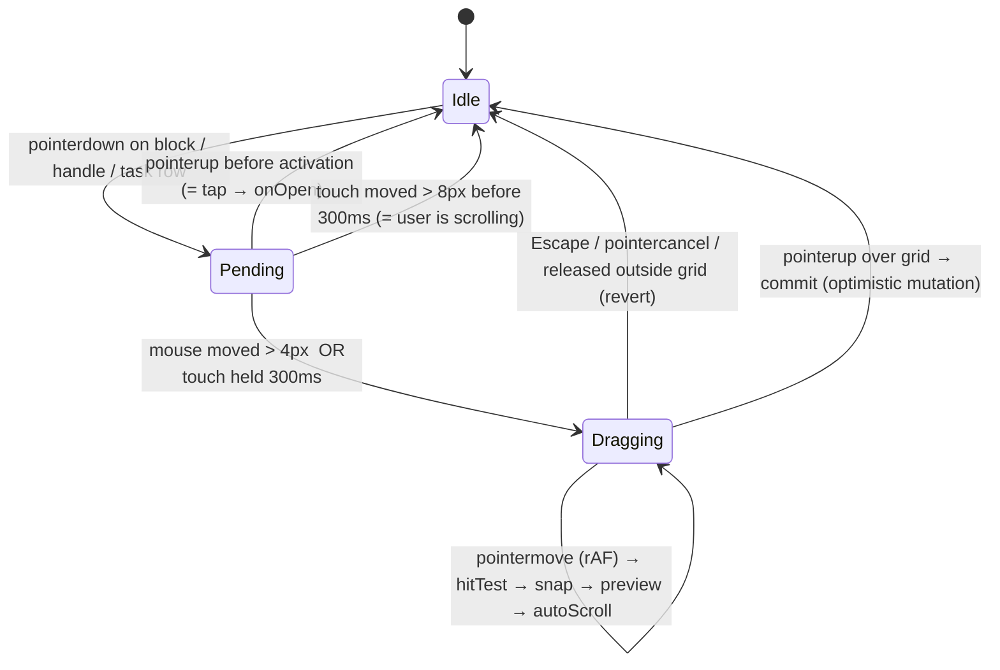
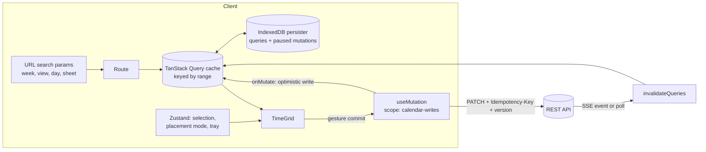

# 09 · Frontend

> Slice owner: frontend (technical). Screen-by-screen flows belong to 12-ux-flows; this document covers how the client is built.
> Written 2026-10-05. Library versions were checked against the npm registry on 2026-10-05. Bundle sizes were measured the same day (method in §5.9). Platform-support claims were checked by web search the same day, and the sources are named inline.

---

## 1. TL;DR

- **Stack:** a React 19.3 single-page app built with Vite 8, with TanStack Router for typed URL state and TanStack Query v5 as the only server-state cache. Zustand holds a small amount of UI state. Styling is Tailwind v4 plus shadcn/ui components on Radix, with `vite-plugin-pwa` in `injectManifest` mode for the service worker. There is no SSR and no meta-framework, because the app sits behind a login and is meant to work offline, so server rendering buys nothing.
- **Calendar: custom time grid, built in two stages.** v0 (per the roadmap) only needs a *render-only* week/day grid with tap-to-cancel. That is roughly 700–850 lines and fits easily in the dogfooding window. v1 adds a gesture engine on pointer events for move, resize, drag-from-list and long-press on touch, which is about another 650–850 lines. Both stages sit behind one `<TimeGrid>` props interface, so FullCalendar v7 (MIT; time grid and external drag are free) can be swapped in if the custom grid misses a two-week timebox.
- **Why custom:** the product's identity is the cancelled-block visual and dragging tasks onto free time. Libraries either charge for drag and drop (Schedule-X v4 lists drag-and-drop, resize, drag-to-create and its sidebar as premium) or make you fight their event model for three kinds of cancellation and background-layer rendering (FullCalendar). A custom grid also gives the strongest interview story: interval partitioning, a pointer-event state machine, optimistic concurrency, and time-zone correctness.
- **Key design move:** cancelled blocks render as a **background layer that is left out of column packing**. A task dropped into a cancelled class's slot then takes the full width on top of the striped ghost. That is exactly the "see the time I got back" feeling from the original idea.
- **Time:** use Temporal everywhere (native in Chrome 144+ and Firefox 139+). Load `temporal-polyfill` (about 21 KB gzipped) only where Temporal is missing, which as of August 2026 still means Safari and every iOS browser.
- **PWA:** the service worker caches the **app shell only**. API data lives offline in TanStack Query's persisted cache (IndexedDB), and writes made offline sit in a queue as paused mutations. There is exactly one data cache, which keeps the system easy to reason about. Android gets push, install, app shortcuts and **Web Share Target** (straight into the thought dump). iOS gets push only after the app is added to the Home Screen, and has no share target and no widgets.
- **Assumed phone:** Android with Chrome (the common case for a KIIT student). This is the first open decision, because an iPhone changes the capture and notification story a lot.

---

## 2. Assumptions about other slices

Each line is something this design relies on. If another slice decided differently, a critic should flag the mismatch here.

| Slice | Assumption |
|---|---|
| **01-recurrence** | The **server expands occurrences** for a requested time range, with exceptions (cancel, skip, move, edit) already applied. The client never runs RRULE expansion. Each occurrence carries a **stable key** `seriesId + originalStart` (RECURRENCE-ID semantics), so a cancelled or moved occurrence can be addressed before an exception row exists. "This and following" edits are a server operation; the client only sends the scope. |
| **02-data-model** | Task, Block and Session are separate entities. A *planned task* is a block of kind `task` with `taskId`, `start` and `end`. Groups have `colorToken` (a palette id, not free hex), `attendance: boolean`, `activeFrom`/`activeTo`, and `archivedAt`. A cancellation stores `by: 'prof' \| 'self'` (D-005). A move stores the new start/end and keeps the original slot visible as a "moved" ghost. |
| **03-backend-system-design** | REST + JSON with an **OpenAPI 3.1** spec, so client types are generated. Timestamps go over the wire as UTC instants (`2026-10-06T04:30:00Z`), and the user's IANA zone is stored in the profile. Every mutable row has a `version` integer. PATCH sends `If-Match`/`version` and gets **409** on conflict. POST/PATCH accept an `Idempotency-Key` header so replayed offline mutations are safe. |
| **04-database-and-sync** | **Server-first.** The client cache can be thrown away. There are no CRDTs and no client-side source of truth. An optional `updatedSince` delta endpoint is nice to have, not required. |
| **05-sessions-and-realtime** | The timer is **server-owned** (`startedAt` from the server; the client only renders elapsed time). Cross-device updates arrive over SSE *or* polling, and the client treats either as "invalidate these query keys". The PWA is not a primary heartbeat source (D-009); it may send heartbeats only while the timer view is visible. |
| **06-auth-and-identity** | The web app uses an **HttpOnly session cookie** (SameSite=Lax) on a sibling subdomain of `ahmedatif.in`, so no tokens go in `localStorage`. **Personal access tokens** exist for the git hook and (on iOS) a Shortcuts-based capture fallback. |
| **07-infra-and-deployment** | The SPA is a static build on a free static host with an SPA fallback to `index.html`, served over HTTPS (service workers require it). The API is on a separate origin with CORS and credentials, or reached through a same-origin `/api` proxy. The backend runs a scheduler that sends **VAPID Web Push** for the evening shutdown. |
| **08-integrations** | Nothing on the critical path for the frontend. The client only displays commit refs attached to sessions. |
| **10-scheduling-algorithms** | "Time back" suggestions come from the API as ranked `{ taskId, start, end, score, reason }` proposals. The client draws them as dashed suggestion blocks and never computes them. |
| **11-capture** | A capture endpoint accepts text plus optional audio. Voice recording uses `MediaRecorder` on the client; transcription is decided by 11. The share-target route (§5.7) posts into the same endpoint. |
| **12-ux-flows** | There are three primary sections (Calendar, Tasks, Thought dump), Calendar is the default screen, and cancelling is tap → sheet → "Prof cancelled / I skipped" for attendance groups. If 12 replaces drag on mobile with something else, my "pick up and place" mode (§5.5) is the technical basis for it. |
| **13-build-plan** | Work follows JOURNEY §8 (v0 grid → v1 drag/tasks → v2 push/attendance). My work order in §5.10 follows that. |

---

## 3. Three genuinely different approaches

| | **A. React SPA + custom time grid** (Vite, TanStack Router/Query, custom grid and gestures) | **B. Meta-framework + calendar library** (Next.js 16 App Router, FullCalendar v7, Serwist) | **C. Local-first SvelteKit** (SvelteKit 3 static, Svelte 5 runes, Dexie as client source of truth, custom grid, sync queue) |
|---|---|---|---|
| **Pros** | Full control of cancelled, skipped and moved styling and of the background-layer rule. One gesture model for move, resize, create and drag-from-list. Small surface: no SSR, no server components. Easy to wrap in Capacitor later, because the build is plain static files. Biggest hiring ecosystem (React). | Fastest to a feature-rich calendar: FullCalendar's MIT time grid already handles overlaps, DST, `snapDuration`, resize, touch `longPressDelay` and external `Draggable`. Next.js is the most common "industry" React stack. | Best offline story: the app is fully usable with no network. Smallest runtime. Svelte 5 runes make fine-grained updates during drag cheap. "Local-first" is an impressive talking point. |
| **Cons** | You own every bug in layout, DST and touch gestures. About 1,400–1,700 lines of calendar code before tests. Risk of polishing the grid instead of shipping features. | FullCalendar renders through its own Preact core, so custom block content needs render hooks; a "background layer that is not packed" and three cancel states fight its event model. Bundle is about 72 KB gzipped for the calendar alone, plus about 21 KB for Temporal on Safari. SSR and RSC add no value for an app behind a login and complicate the PWA. | Conflicts with the server-first model assumed from 04. Sync, conflict resolution and schema migrations on the client are a second backend to build. The Svelte ecosystem for calendar and drag-and-drop is thinner. React dominates student-level interviews in India. |
| **Solo-dev effort** | **Medium.** v0 grid in about 1.5–2 weeks part-time; gestures in about 2–3 weeks. | **Low at first, medium later.** v0 in about 1 week, then a slow tax of workarounds per custom behaviour. | **High.** The sync engine alone is weeks of work, and its edge cases (clock skew, replay order, deletes) are research problems. |
| **Interview value** | **High and explainable:** interval partitioning (greedy colouring of an interval graph is optimal), a pointer-event state machine, optimistic updates with rollback, DST-safe time math. | **Medium:** "I configured a library" is weaker, though shipping fast is a real skill. | **High if finished, harmful if half-done.** An unfinished sync engine is a bad demo. |

**Approach A** treats the calendar as *the product*. JOURNEY's vision ("your fixed week is always visible", "drag them onto free time") and the original idea (greyed, translucent, diagonal stripes; stretching a task to plan time) put the time grid at the centre of the app, not at its edge. Owning that component means the app's signature interactions behave exactly as designed. The cost is real but bounded, because the roadmap splits it neatly: v0 is render-only and v1 adds gestures.

**Approach B** treats the calendar as a solved problem and spends the saved weeks on the backend, where the actually-hard part lives (recurrence edge cases are the top **Open** risk in JOURNEY §5). FullCalendar v7 (released 2026-09-05) is a clean single `fullcalendar` package with subpath plugins; it has adopted `temporal-polyfill` as a peer dependency and ships new themes. Its premium tier covers only timeline, vertical resource views and print. Everything this app needs is MIT. That makes B a legitimate choice and the named fallback for A.

**Approach C** changes the source of truth. It is worth knowing about, and a strong answer to "what would you do differently at scale?", but it contradicts the server-first assumption and roughly doubles the project. For a solo student, a local-first sync engine is the kind of thing that looks great on a slide and eats a semester.

---

## 4. Recommendation

**Choose Approach A, staged, with an adapter boundary.**

1. Build a **render-only custom grid for v0**: week and day views, overlap layout, now-line, cancelled/skipped/moved styles, tap → cancel sheet. This is the smallest version that still delivers the signature visual, and v0 needs no drag at all.
2. Put the calendar behind one props interface (`TimeGridProps`, §5.3), so the rest of the app never imports calendar internals.
3. In v1, build the **gesture engine** (pointer events, long-press on touch, 15-minute snapping, auto-scroll, resize) with a **two-week timebox**.
4. If the timebox is blown, put FullCalendar v7 (`fullcalendar/timegrid` + `fullcalendar/interaction`, MIT) behind the same interface. The query hooks, styles and mutations stay the same.

### The strongest argument against it

> "You are a solo student with a recurrence engine, a timer, a sync model, push notifications and four integrations still ahead of you. The calendar grid is the most solved UI problem in web development. FullCalendar v7 is MIT for everything you need: time grid, `snapDuration: '00:15'`, `eventResize`, external `Draggable` with `longPressDelay` for touch, and `eventClassNames`/`eventContent` hooks that can paint your stripes. It has a decade of bug reports about DST, overlapping events, iOS touch quirks and auto-scroll already fixed. Your custom grid will rediscover those bugs one at a time while you dogfood, and every week you spend on pointer-event edge cases is a week not spent on the recurrence engine, which is the part an interviewer will actually probe. An interviewer is more impressed by a shipped app with a correct 'this and following' edit than by a hand-rolled grid in an app that never reached v2. The 'interval partitioning' story is about 120 lines; you can write that function as a kata without owning the whole calendar."

That argument is strong. It is why the recommendation is *staged, timeboxed and behind an adapter*, not "custom at all costs". My reasons for still starting custom:

- v0's grid is genuinely small, because rendering without gestures is mostly CSS positioning.
- The background-layer rule for cancelled blocks and the three cancel states are central to the product, and they are awkward in FullCalendar's model. You would end up layering background events, custom render hooks and CSS overrides on top of a Preact-rendered DOM you do not control.
- The gesture engine is *one* state machine shared by four interactions. That is easier to test (pure reducer) than four library callbacks, each with its own quirks.

### When to switch

Switch to FullCalendar v7 behind `TimeGridProps` if **either** of these is true at the end of the v1 gesture timebox (two calendar weeks of the v1 phase):

- Moving and resizing blocks with long-press is not reliable on **Atif's actual phone**. "Reliable" means: no accidental drags while scrolling, and no stuck drags after `pointercancel`, across 20 manual tries.
- The grid has an open DST or overlap bug that has blocked dogfooding for more than three days.

Also switch earlier if the recurrence engine (01) slips by more than two weeks. In that case, time saved on the frontend is worth more on the backend.

---

## 5. Implementation walkthrough

### 5.1 Stack and verified versions

All versions are the npm `latest` dist-tag on **2026-10-05**. Licences are from each package's manifest.

| Concern | Choice | Version (published) | Licence | Notes |
|---|---|---|---|---|
| UI runtime | `react`, `react-dom` | 19.3.0 (2026-09-09) | MIT | About 69 KB gzipped measured (react + `react-dom/client`). React Compiler (`babel-plugin-react-compiler` 1.0.0) is optional; leave it off until profiling shows a need. |
| Build | `vite` + `@vitejs/plugin-react` | 8.3.2 (2026-10-01) / 6.1.2 (2026-10-05) | MIT | Vite 8 is built on Rolldown. Every plugin below declares Vite 8 peer support. |
| Language | `typescript` | 7.0.2 | Apache-2.0 | The native-compiler line. If an editor plugin breaks, pin the last 6.x. |
| Router | `@tanstack/react-router` + `@tanstack/router-plugin` | 1.170.41 / 1.168.42 (2026-09-30) | MIT | Typed and validated search params (`?week=2026-W41&view=day`), file-based routes, and loaders that call `queryClient.ensureQueryData`. About 28 KB gzipped measured. Considered instead: `react-router` 8.4.0. |
| Server state | `@tanstack/react-query` (+ `-persist-client`, `query-async-storage-persister`) | 5.104.1 (2026-10-02) | MIT | About 10 KB gzipped measured. Paused-mutation persistence and the `scope` option for serial mutations are the main reasons to use it. |
| UI state | `zustand` | 5.0.15 (2026-08-13) | MIT | About 0.4 KB gzipped. Considered instead: `jotai` 3.0.1. |
| Time | Native `Temporal`, falling back to `temporal-polyfill` | 1.0.5 (2026-09-11) | MIT | About 21 KB gzipped, loaded only when `globalThis.Temporal` is missing. Considered instead: `date-fns` 4.4.0 + `@date-fns/tz` 1.5.0 (about 7 KB gzipped for a typical subset); `dayjs` 1.11.23 (about 5 KB with utc and timezone). |
| Styling | `tailwindcss` + `@tailwindcss/vite` | 4.3.3 | MIT | The calendar's own CSS is hand-written (§5.6); Tailwind handles everything around it. |
| Components | `shadcn` CLI (copy-in) on `radix-ui` | 4.21.1 (2026-10-01) / 1.6.7 | MIT | Dialog, DropdownMenu, Popover, Tooltip came to about 36 KB gzipped measured together; import only what you use. **Avoid `vaul`** (shadcn's Drawer): its README says "This repo is unmaintained" and its last release was 2024-12-14. Build the bottom sheet from a Radix Dialog. |
| Toasts / icons | `sonner` / `lucide-react` | 2.0.8 / 1.52.0 | MIT / ISC | |
| Validation | `zod` | 4.6.5 | MIT | Search-param schemas and the import-preview validation (D-008). |
| API types | `openapi-typescript` + `openapi-fetch` | 7.13.0 / 0.17.0 | MIT | Generated types from 03's spec, plus a fetch wrapper of a few KB. Considered instead: `@hey-api/openapi-ts` 0.99.0 or `orval` 8.40.0 (these generate Query hooks, but they add more magic than is worth explaining). |
| Offline storage | `idb-keyval` | 6.3.0 (2026-07-08) | Apache-2.0 | Storage for the Query persister. `dexie` 4.4.6 is overkill without a local-first design. |
| PWA | `vite-plugin-pwa` (`injectManifest`) + `workbox-*` | 2.0.0 (2026-10-03) / workbox 7.4.1 | MIT | **2.0.0 is two days old.** Pin it exactly; if it misbehaves, use 1.3.0 (2026-05-05). Considered instead: `@serwist/vite` 9.5.13 (2026-10-04), a maintained Workbox fork with the same model. |
| Unit / component tests | `vitest` (+ browser mode), `vitest-browser-react`, `@testing-library/react` | 5.0.3 / 2.3.0 / 16.3.3 | MIT | |
| API mocking | `msw` | 3.0.2 (2026-10-03) | MIT | One set of handlers is shared by the dev server, tests and the `/dev/gallery` route. |
| E2E and visual | `@playwright/test`, `@axe-core/playwright` | 1.63.0 / 4.13.0 | Apache-2.0 / MPL-2.0 | |
| Lint and format | `@biomejs/biome` | 2.5.15 | MIT/Apache-2.0 | One fast tool and one config. Considered instead: ESLint 10.12 + Prettier. |

**Rejected calendar and drag-and-drop libraries, with evidence:**

- **Schedule-X 4.9.1** (2026-09-29, MIT core). In v4 its docs list *Drag and Drop, Resize, Drag to Create, Sidebar* and more as **premium plugins requiring a licence**. The last MIT `@schedule-x/drag-and-drop`/`resize` packages are 3.7.3 (2026-01-14), from the v3 line. It also pins `temporal-polyfill@0.3.2` as a peer, which conflicts with FullCalendar's `^1.0.1` (npm refused to install both together during testing). Measured at about 55 KB gzipped without the polyfill.
- **react-big-calendar 1.20.0** (2026-06-01, MIT). Maintained, but its drag-and-drop addon is HTML5-backend-shaped and weak on touch. Measured at about 75 KB gzipped with the drag-and-drop addon.
- **TOAST UI Calendar 2.1.3**: last published **2022-08-16**. Unmaintained.
- **`@dnd-kit/core` 6.3.1**: stable and about 14 KB gzipped, but the last release was **2024-12-05**. The author's new `@dnd-kit/react` is at **0.5.0** (pre-1.0, about 34 KB gzipped). This is the **fallback** for drag-from-list if the custom gesture engine struggles, because its TouchSensor (delay + tolerance) and auto-scroll are proven.
- **`@atlaskit/pragmatic-drag-and-drop` 4.0.0** (2026-09-24, Apache-2.0, about 9.5 KB gzipped with auto-scroll). Excellent for lists and boards, but it is built on **native HTML5 drag and drop**. That gives poor control over a live, snapped preview inside a scrolling grid, nothing for resize, and the OS long-press behaviour on mobile differs between platforms.
- **`react-aria-components` 1.21.1**: superb accessibility primitives, but about 52 KB gzipped for a modest subset. Worth it only if Radix's components prove inaccessible somewhere specific.

### 5.2 Directory layout

```
web/
├─ index.html
├─ vite.config.ts                 # react, tailwind, tanstack router plugin, pwa (injectManifest)
├─ biome.json
├─ public/                        # icons (192, 512, maskable-512), apple-touch-icon, robots
├─ src/
│  ├─ main.tsx                    # polyfill gate → providers → router
│  ├─ sw.ts                       # service worker (precache shell, push, share-target)
│  ├─ app/
│  │  ├─ queryClient.ts           # QueryClient, persister, mutation defaults
│  │  ├─ router.ts
│  │  └─ Providers.tsx
│  ├─ routes/                     # file-based (TanStack Router)
│  │  ├─ __root.tsx               # shell: rail (desktop) / bottom nav (mobile)
│  │  ├─ calendar.tsx             # ?week=YYYY-Www&view=week|3day|day&day=YYYY-MM-DD
│  │  ├─ tasks.tsx  tasks.$taskId.tsx  projects.$projectId.tsx
│  │  ├─ dump.tsx   dump.new.tsx   share-target.tsx
│  │  ├─ settings.tsx
│  │  └─ dev.gallery.tsx          # fixture scenes for visual tests (dev/test builds only)
│  ├─ api/
│  │  ├─ schema.d.ts              # generated by openapi-typescript
│  │  ├─ client.ts                # openapi-fetch instance, idempotency keys, 409 mapping
│  │  ├─ keys.ts                  # query-key factories
│  │  └─ calendar.ts tasks.ts dump.ts timer.ts push.ts
│  ├─ features/
│  │  ├─ calendar/
│  │  │  ├─ model/                # PURE, fully unit-tested, no React
│  │  │  │  ├─ types.ts
│  │  │  │  ├─ segments.ts        # occurrence → per-day segments (midnight split, zone)
│  │  │  │  ├─ layout.ts          # column packing + background layer
│  │  │  │  ├─ geometry.ts        # minutes ↔ pixels, snapping
│  │  │  │  └─ gesture.ts         # gesture reducer (state machine)
│  │  │  ├─ gestures/
│  │  │  │  ├─ useGridGesture.ts  # wires DOM events → reducer
│  │  │  │  ├─ longPress.ts  autoScroll.ts  hitTest.ts
│  │  │  ├─ components/
│  │  │  │  ├─ TimeGrid.tsx  DayColumn.tsx  TimeAxis.tsx  Block.tsx
│  │  │  │  ├─ NowLine.tsx  DropPreview.tsx  DayStrip.tsx  CancelSheet.tsx
│  │  │  ├─ useWeek.ts            # range math + query + prefetch neighbours
│  │  │  ├─ mutations.ts          # move/resize/cancel/plan with optimistic cache writes
│  │  │  └─ calendar.css
│  │  ├─ tasks/  dump/  timer/  attendance/
│  ├─ lib/
│  │  ├─ time.ts                  # the ONLY module that touches Temporal directly
│  │  ├─ platform.ts              # isStandalone, isIOS, supports.{push,shareTarget,...}
│  │  ├─ pwa.ts                   # SW registration + update prompt
│  │  └─ push.ts                  # subscribe/unsubscribe with VAPID key
│  └─ styles/ tokens.css  index.css
└─ tests/
   ├─ e2e/        calendar.drag.spec.ts  cancel.spec.ts  offline.spec.ts
   └─ visual/     grid.visual.spec.ts
```

The rule that keeps this explainable: **`features/calendar/model/` is pure TypeScript with no React and no DOM.** Layout, snapping, segmenting and the gesture reducer are plain functions with table-driven tests. Components only turn their output into absolutely positioned divs.

### 5.3 Data shapes

```ts
// features/calendar/model/types.ts
export type Instant = string;        // '2026-10-06T04:30:00Z' (UTC, from API)
export type ISODate = string;        // '2026-10-06' (a PlainDate in the user's zone)
export type PaletteToken = 'c1' | 'c2' | 'c3' | 'c4' | 'c5' | 'c6' | 'c7' | 'c8' | 'c9' | 'c10';

export type BlockState =
  | { type: 'active' }
  | { type: 'cancelled'; by: 'prof' | 'self' }                // D-005; 'self' = "I skipped"
  | { type: 'moved'; to: { start: Instant; end: Instant } };  // ghost left at original slot

export type TaskOutcome = 'planned' | 'done' | 'returned';    // returned = ended unticked

export interface Occurrence {
  key: string;                 // `${seriesId}:${originalStart}` or `oneoff:${id}`; stable across edits
  seriesId: string | null;
  groupId: string | null;      // recurring group (D-004); null for task blocks
  kind: 'recurring' | 'oneoff' | 'task';
  taskId?: string;
  title: string;
  start: Instant;
  end: Instant;
  originalStart?: Instant;     // for moved/edited recurring occurrences
  state: BlockState;
  taskOutcome?: TaskOutcome;   // only when kind === 'task'
  attendance?: 'unconfirmed' | 'attended' | 'skipped'; // D-010; only attendance groups, past only
  version: number;             // optimistic concurrency (03)
  pending?: boolean;           // client-only: optimistic write in flight / queued offline
}

export interface Group {
  id: string; name: string; colorToken: PaletteToken;
  attendance: boolean; activeFrom: ISODate; activeTo: ISODate | null; archivedAt: Instant | null;
}

/** One visible rectangle. An occurrence crossing midnight yields two segments. */
export interface Segment {
  occ: Occurrence;
  day: ISODate;
  startMin: number;            // minutes from local midnight, 0..1440
  endMin: number;              // exclusive, > startMin, ≤ 1440
  continuesBefore: boolean;
  continuesAfter: boolean;
}

export interface Positioned extends Segment {
  layer: 'background' | 'foreground';
  col: number;                 // 0-based column within its cluster
  cols: number;                // total columns in the cluster
  span: number;                // columns it may expand into (≥1)
  conflict: boolean;           // overlaps another ACTIVE recurring block from a different group (D-004)
}

/** The adapter boundary: FullCalendar could implement this too. */
export interface TimeGridProps {
  days: ISODate[];                       // 1, 3 or 7 consecutive days
  zone: string;                          // IANA, e.g. 'Asia/Kolkata'
  occurrences: Occurrence[];
  groups: Record<string, Group>;
  suggestions?: Suggestion[];            // v2 "time back"
  pxPerMin: number;                      // zoom; 64px/h desktop ≈ 1.067
  snapMin?: 15;
  onOpen(occ: Occurrence): void;
  onMove(key: string, start: Instant, end: Instant): void;
  onResize(key: string, end: Instant): void;
  onDropTask(taskId: string, start: Instant, end: Instant): void;
  onCreate?(start: Instant, end: Instant): void;  // drag on empty space (v1.5)
}
```

### 5.4 Rendering the grid

**Coordinates.** Each day column is `position: relative` with height `1440 * pxPerMin`. A block's geometry is passed as CSS custom properties, so zoom changes `--px-per-min` once instead of re-rendering everything:

```tsx
<div className="block" data-state={state.type} data-by={state.type === 'cancelled' ? state.by : undefined}
     data-layer={p.layer} data-conflict={p.conflict || undefined}
     style={{ '--start': p.startMin, '--len': p.endMin - p.startMin,
              '--col': p.col, '--cols': p.cols, '--span': p.span,
              '--c': `var(--palette-${group?.colorToken ?? 'neutral'})` } as React.CSSProperties}>
```

**Segmenting (`segments.ts`).** Convert `start`/`end` instants into `ZonedDateTime`s in the display zone. Walk day boundaries with `startOfDay()` (not "+24 h", which is wrong on DST days) and emit one `Segment` per visible day. Clamp to the visible days.

**Overlap layout (`layout.ts`): interval partitioning.** This is the interview-worthy piece.

```ts
export function layoutDay(segments: Segment[], groups: Record<string, Group>): Positioned[] {
  // 1. Split layers. Cancelled + moved-ghosts never take columns: they are "freed time".
  const bg = segments.filter(s => s.occ.state.type !== 'active');
  const fg = segments.filter(s => s.occ.state.type === 'active')
                     .sort((a, b) => a.startMin - b.startMin || b.endMin - a.endMin);

  const out: Positioned[] = bg.map(s => ({ ...s, layer: 'background', col: 0, cols: 1, span: 1, conflict: false }));

  // 2. Sweep into clusters (connected components of the overlap graph).
  let cluster: Segment[] = [];
  let clusterEnd = -1;
  const flush = () => { out.push(...packCluster(cluster, groups)); cluster = []; };
  for (const s of fg) {
    if (cluster.length && s.startMin >= clusterEnd) flush();   // touching (end == start) is NOT overlap
    cluster.push(s);
    clusterEnd = Math.max(clusterEnd, s.endMin);
  }
  if (cluster.length) flush();
  return out;
}

function packCluster(cluster: Segment[], groups: Record<string, Group>): Positioned[] {
  // 3. Greedy column assignment: first column whose last end ≤ my start.
  //    For interval graphs this greedy-by-start is optimal: #columns = max overlap depth.
  const colEnds: number[] = [];
  const placed = cluster.map(s => {
    let col = colEnds.findIndex(end => end <= s.startMin);
    if (col === -1) { col = colEnds.length; colEnds.push(s.endMin); } else colEnds[col] = s.endMin;
    return { s, col };
  });
  const cols = colEnds.length;
  // 4. Expansion: extend right while the neighbouring column has nothing overlapping me.
  return placed.map(({ s, col }) => {
    let span = 1;
    while (col + span < cols && !placed.some(p => p.col === col + span && overlaps(p.s, s))) span++;
    const conflict = s.occ.kind === 'recurring' && placed.some(p =>
      p.s !== s && p.s.occ.kind === 'recurring' && p.s.occ.groupId !== s.occ.groupId && overlaps(p.s, s));
    return { ...s, layer: 'foreground', col, cols, span, conflict };
  });
}
const overlaps = (a: Segment, b: Segment) => a.startMin < b.endMin && b.startMin < a.endMin;
```

This costs O(n log n) for the sort plus O(k²) inside a cluster, where k is about 4 in practice. A student calendar holds maybe 10–15 blocks a day, so this never needs optimising. The `conflict` flag is a free by-product that D-004's "show conflicts with other groups" view can use.

**Why the background layer matters.** If cancelled blocks were packed, a cancelled 10:00–11:00 class plus a task planned at 10:00 would each get half the width, and the freed time would *look* occupied. With the rule above, the task fills the column on top of a striped ghost, and the user reads "my class got cancelled and I used the hour". That is the core emotional beat of the original idea, so it is encoded in the layout algorithm, not left to CSS.

**Other render pieces.**

- `NowLine` updates on a `setTimeout` aligned to the next minute and re-syncs on `visibilitychange`, so there is no 1-second interval.
- `TimeAxis` is `aria-hidden`.
- On first load, the grid scrolls to `max(now − 1h, 07:00)`.
- All-day items are out of scope for v0. Holidays (D-003 "maybe later") show as a banner above the day, not as grid blocks.
- A **minimum rendered height** of 22px applies, with a single-line title. A 15-minute block at 64 px/h is about 16px tall, too small to tap.

### 5.5 Gestures: drag from list, move, resize, long-press, keyboard

**One engine, four intents:** `move` (existing block), `resize` (bottom handle), `place` (task dragged in from the list or tray), and later `create` (drag on empty space). All four share the same hit-testing, snapping, preview and auto-scroll.



```ts
// features/calendar/model/gesture.ts — pure reducer, unit-tested without a DOM
export type Intent =
  | { kind: 'move'; key: string; grabOffsetMin: number; durationMin: number }
  | { kind: 'resize'; key: string; startMin: number; day: ISODate }
  | { kind: 'place'; taskId: string; durationMin: number };

export type GestureState =
  | { s: 'idle' }
  | { s: 'pending'; intent: Intent; pointerType: 'mouse' | 'touch' | 'pen'; x0: number; y0: number; t0: number }
  | { s: 'dragging'; intent: Intent; target: SlotTarget | null }
  | { s: 'committing'; intent: Intent; target: SlotTarget };

export interface SlotTarget { day: ISODate; startMin: number; endMin: number }

export type GestureEvent =
  | { type: 'down'; intent: Intent; pointerType: GestureState extends never ? never : 'mouse' | 'touch' | 'pen'; x: number; y: number; t: number }
  | { type: 'move'; x: number; y: number; t: number; hit: { day: ISODate; minute: number } | null }
  | { type: 'longPressElapsed' }
  | { type: 'up' } | { type: 'cancel' };

export function reduce(state: GestureState, ev: GestureEvent, snapMin = 15): GestureState;
export function snap(minute: number, step = 15): number {         // round to nearest step
  return Math.round(minute / step) * step;
}
export function targetFor(intent: Intent, hit: { day: ISODate; minute: number }, step = 15): SlotTarget;
```

**DOM wiring (`useGridGesture`).**

- **Event model.** Listen to `pointerdown` on the grid and on task rows. Then attach `pointermove`/`pointerup`/`pointercancel` to `window`, plus a **non-passive `touchmove` listener on `document` that calls `preventDefault()` only while in the `dragging` state**. Pointer events alone cannot stop a scroll that the browser is about to start. Because activation happens after a 300ms *still* hold, the first `touchmove` after activation can be cancelled before any scroll begins. This is the same trick dnd-kit's TouchSensor uses.
- **Selected blocks on touch.** A selected (tapped) block and its resize handle get `touch-action: none`, so on mobile you **tap to select, then drag immediately** with no long-press, Google Calendar style. Unselected blocks keep the default `touch-action`, so the grid still scrolls normally.
- **iOS long-press side effects.** Draggables get `-webkit-touch-callout: none; user-select: none;`, and `contextmenu` is prevented during `pending` (Android fires it on long-press).
- **Hit-testing.** At drag start, cache each day column's `getBoundingClientRect()` and the scroll container's `scrollTop`; refresh both on `scroll`. Then `minute = (clientY − colTop) / pxPerMin`. Use `elementFromPoint` only to detect "over the task list" (meaning cancel or unplan).
- **No React render per pointermove.** Pointer coordinates go into a ref, and a single `requestAnimationFrame` loop updates the `DropPreview` element's `transform`/`height` directly. React state changes only when the **snapped** target changes, at most once per 15-minute step. This one rule is what keeps dragging at 60 fps on a mid-range Android phone.
- **Auto-scroll.** Inside that rAF loop, if the pointer is within 56px of the scroll container's top or bottom edge, call `scrollBy(0, ±v)` with `v = vmax · (1 − d/56)²` and `vmax = 18 px/frame`. Then recompute the hit, because the grid moved under a stationary finger. In **day view on mobile**, holding at the left or right screen edge for 600ms switches to the previous or next day (edge-dwell). This is optional for v1.
- **Floating ghost** while dragging from the list. A portal `div` follows the pointer until it is over the grid, then it hides and the in-grid `DropPreview` (snapped) takes over, so the user always sees where the task *will* land, not where the finger is.
- **Default duration** for `place` is the task's estimate if it has one (v2's multiplier can adjust it), otherwise 60 min. Clamp to the end of the day; dragging cannot create blocks that cross midnight in v1.
- **Resize.** Call `setPointerCapture` on the handle; `end = snap(minute)`, clamped to `start + 15 … 1440`. There is no top handle in v1 (move covers that need).

**Mobile drag source.** The tasks list is a **bottom-sheet tray** over the day view. Long-press a task row and the tray collapses to a peek strip, so the grid becomes the drop zone. Releasing over the strip cancels the drag.

**Accessible alternative: "pick up and place".** Every drag has a non-drag path, as WCAG 2.2 SC 2.5.7 (Dragging Movements) requires. It also turns out to be the *better* mobile flow for one-handed use.

1. On a task, choose **"Plan…"** (a button, or `P` when focused). The calendar enters *placement mode*: a banner reads "Tap a time to place 'Write DSA notes' (60 min)", and the snapped preview follows taps or arrow keys.
2. Tap a slot, or press `Enter`, to commit. `Esc` cancels.
3. With a block focused, `Alt+↑/↓` moves it by 15 min, `Alt+Shift+↑/↓` resizes it, and `Alt+←/→` moves it a day. Keystrokes are **coalesced**: the preview updates instantly and one PATCH fires 600ms after the last key.
4. Every committed change is announced in a polite live region, for example "Planned Write DSA notes, Tuesday 15:00 to 16:00."

### 5.6 Cancelled, skipped and moved styling

Design rules:

- Never rely on colour alone. Each state differs by **pattern, border and label**.
- Text over stripes always sits on a solid "pill" so contrast stays ≥ 4.5:1.
- The group colour is a **palette token** with separate light and dark values, so contrast is designed once, not left to whatever hex a user picks.

| State | Fill | Pattern | Border | Label/icon | Meaning |
|---|---|---|---|---|---|
| Active recurring | group colour at 22% over surface | none | 3px left, group colour | title, time | Normal class/run |
| **Cancelled by prof** | neutral muted grey | grey stripes −45° | left border desaturated | "Cancelled", title struck through | Time freed, not my choice |
| **Skipped (self)** | muted, faint group tint | **group-tinted** stripes −45° | dashed left border | "Skipped", ⊘ icon | Time freed, my choice; still counts in attendance |
| **Moved (ghost at original)** | transparent | none | 1.5px dashed outline | "Moved → Thu 15:00", → icon | Not here anymore |
| Task planned | white/surface | none | 3px left, project colour | ▶ start-timer affordance | Planned work |
| Task done (past) | surface | none | solid | ✓, faded | Finished in that block |
| Task returned (past, unticked) | surface | none | dotted | ↩ "Back in list" | Ended without a tick |
| Conflict (D-004) | as active | none | 2px inset warning outline | ⚠ | Two groups overlap |
| Attendance unconfirmed (D-010) | as active | none | as active | hollow dot top-right | Not yet confirmed in shutdown |

```css
/* styles/tokens.css */
:root {
  --surface: oklch(99% 0 0);
  --surface-muted: oklch(95.5% 0.004 260);
  --text: oklch(23% 0.01 260);
  --text-muted: oklch(47% 0.01 260);          /* ≥ 4.5:1 on --surface-muted */
  --stripe: oklch(0% 0 0 / 0.11);
  --palette-c1: oklch(60% 0.15 255);           /* blue  */
  --palette-c2: oklch(62% 0.16 150);           /* green */
  /* … c3..c10, each checked for 3:1 against surface as a non-text border … */
  --palette-neutral: oklch(60% 0.01 260);
}
@media (prefers-color-scheme: dark) {
  :root:not([data-theme="light"]) {
    --surface: oklch(19% 0.01 260);
    --surface-muted: oklch(24% 0.01 260);
    --text: oklch(94% 0.005 260);
    --text-muted: oklch(72% 0.01 260);
    --stripe: oklch(100% 0 0 / 0.09);
    --palette-c1: oklch(72% 0.13 255);         /* lighter in dark mode, same hue */
    --palette-c2: oklch(74% 0.14 150);
  }
}
:root[data-theme="dark"] { /* same values as the media query block */ }
```

```css
/* features/calendar/calendar.css */
.day-col { position: relative; height: calc(1440 * var(--px-per-min) * 1px); container-type: inline-size; }

.block {
  position: absolute;
  top:    calc(var(--start) * var(--px-per-min) * 1px);
  height: max(22px, calc(var(--len) * var(--px-per-min) * 1px - 1px));
  left:   calc(var(--col) / var(--cols) * 100%);
  width:  calc(var(--span) / var(--cols) * 100% - 2px);
  background: color-mix(in oklch, var(--c) 22%, var(--surface));
  border-left: 3px solid var(--c);
  border-radius: 6px;
  color: var(--text);
  overflow: hidden;
  -webkit-touch-callout: none;
  user-select: none;
}
.block[data-layer="background"] { left: 0; width: calc(100% - 2px); z-index: 0; }
.block[data-layer="foreground"] { z-index: 1; }

/* Prof cancelled: neutral grey stripes. Anchored to the column so stacked ghosts line up. */
.block[data-state="cancelled"] {
  background-color: var(--surface-muted);
  background-image: repeating-linear-gradient(-45deg, var(--stripe) 0 2px, transparent 2px 9px);
  background-position: 0 calc(var(--start) * var(--px-per-min) * -1px);
  border-left-color: color-mix(in oklch, var(--c) 30%, var(--surface-muted));
  color: var(--text-muted);
}
.block[data-state="cancelled"] .title { text-decoration: line-through; }

/* Self-skipped: same geometry, stripes tinted with the group's hue (still "mine"). */
.block[data-state="cancelled"][data-by="self"] {
  background-color: color-mix(in oklch, var(--c) 8%, var(--surface-muted));
  background-image: repeating-linear-gradient(-45deg,
      color-mix(in oklch, var(--c) 32%, transparent) 0 2px, transparent 2px 9px);
  border-left-style: dashed;
}

/* Moved: hollow ghost at the original slot. */
.block[data-state="moved"] {
  background: transparent;
  border: 1.5px dashed color-mix(in oklch, var(--c) 55%, var(--text-muted));
  color: var(--text-muted);
}

/* Labels sit on a solid pill so stripes never sit under text. */
.block[data-state="cancelled"] .label,
.block[data-state="moved"] .label {
  background: var(--surface-muted);
  padding: 0 4px;
  border-radius: 4px;
  width: fit-content;
}

.block[data-conflict] { box-shadow: inset 0 0 0 2px oklch(68% 0.17 45); }
.block[data-pending] { opacity: .75; }           /* optimistic / queued offline */

@container (max-width: 110px) { .block .time { display: none; } }

@media (prefers-contrast: more) {
  .block[data-state="cancelled"] { background-image: repeating-linear-gradient(-45deg, var(--text-muted) 0 3px, transparent 3px 8px); }
  .block { border-left-width: 4px; }
}
@media (forced-colors: active) {         /* Windows high contrast removes backgrounds */
  .block { border: 1px solid CanvasText; }
  .block[data-state="cancelled"] { border-style: dashed; }
  .block[data-state="moved"] { border-style: dotted; }
}
@media (prefers-reduced-motion: reduce) { .block, .drop-preview { transition: none; } }
```

Notes:

- `color-mix()` and `oklch()` are Baseline 2023 (Safari 16.2+, Chrome 111+), which is fine for a 2026 PWA.
- Keep stripe periods at whole pixels (2px/9px). Fractional periods cause moiré at device pixel ratios of 2.75 and 3, which many Android phones use.
- Do not animate `background-position` on stripes. It looks cool for an afternoon and then costs battery forever.

### 5.7 State management and data flow



**Three kinds of state, three homes:**

1. **URL state** (TanStack Router search params, validated with zod): `week`, `view`, `day`, open sheet ids. The Android back button and shared links behave correctly. "Today" is a redirect, not a stored value.
2. **Server state** (TanStack Query): occurrences, tasks, projects, groups, the active timer, dump items. This is the only place server data lives.
3. **Ephemeral UI state** (Zustand plus refs): the selected block, placement mode, tray open or closed. Gesture coordinates live in **refs**, never in a store.

**Query keys** (`api/keys.ts`):

```ts
export const qk = {
  occurrences: { all: ['occ'] as const,
                 range: (fromISO: ISODate, toISO: ISODate) => ['occ', 'range', fromISO, toISO] as const },
  groups: ['groups'] as const,
  tasks: { all: ['tasks'] as const, list: (f: TaskFilter) => ['tasks', 'list', f] as const,
           one: (id: string) => ['tasks', 'one', id] as const },
  timer: ['timer', 'active'] as const,
  dump: (projectId?: string) => ['dump', projectId ?? 'general'] as const,
};
```

**Week fetching.** `useWeek(weekStart: Temporal.PlainDate)` computes `[Mon 00:00, next Mon 00:00)` in the user's zone, converts both to instants, and queries `qk.occurrences.range`. On idle (`requestIdleCallback`, with a timeout fallback on Safari) it prefetches the previous and next weeks with `staleTime: 5 min`. The cache is not normalised: an occurrence can appear in several ranges (week and 3-day caches can overlap), so writes go through one helper:

```ts
/** Apply a change to every cached range that contains (or should now contain) the occurrence. */
export function patchOccurrenceEverywhere(
  qc: QueryClient,
  key: string,
  next: Occurrence | null,                 // null = remove
): Array<[QueryKey, Occurrence[] | undefined]> /* snapshot for rollback */;
```

It walks `qc.getQueriesData({ queryKey: qk.occurrences.all })`, removes the old copy from every range, and inserts `next` into each range whose `[from, to)` overlaps `next`. That handles a block **moved from Sunday into next week**, which naive "map over this week's array" code gets wrong.

**Optimistic mutation pattern:**

```ts
export function useMoveOccurrence() {
  const qc = useQueryClient();
  return useMutation({
    mutationKey: ['occ', 'move'],
    scope: { id: 'calendar-writes' },            // serialise all calendar writes (also offline replays)
    mutationFn: (v: { key: string; start: Instant; end: Instant; version: number }) =>
      api.moveOccurrence(v),                      // sends Idempotency-Key generated once per mutation
    onMutate: async (v) => {
      await qc.cancelQueries({ queryKey: qk.occurrences.all });
      const current = findOccurrence(qc, v.key)!;
      return { snapshot: patchOccurrenceEverywhere(qc, v.key, { ...current, start: v.start, end: v.end, pending: true }) };
    },
    onError: (err, _v, ctx) => {
      ctx?.snapshot.forEach(([k, data]) => qc.setQueryData(k, data));     // rollback
      toast(isConflict(err) ? 'Changed on another device — refreshed' : "Couldn't move block");
    },
    onSettled: () => qc.invalidateQueries({ queryKey: qk.occurrences.all }),
  });
}
```

Cancel, skip, resize and plan-task follow the same shape. Two details matter:

- **`scope`** makes TanStack Query run mutations with the same scope id *in order*. So "move, then cancel" made offline replays in that order, and the second request carries the version returned by the first.
- **Cross-cache effects** (planning a task changes both the calendar and the task list) are handled by invalidating `qk.tasks.all` in `onSettled`. Only the calendar is optimistic, because that is where the delay would be visible.

**Offline writes.** `networkMode: 'online'` (the default) **pauses** mutations while offline instead of failing them. `PersistQueryClientProvider` with an `idb-keyval`-backed async persister (`maxAge: 7 days`, `buster: APP_VERSION`) saves queries **and** paused mutations. The trap: after a reload, a restored mutation has no `mutationFn` unless you registered one with **`queryClient.setMutationDefaults(['occ','move'], { mutationFn })`** for every mutation key. Then call `queryClient.resumePausedMutations()` in the persister's `onSuccess`. A small "2 changes waiting to sync" chip reads `useMutationState({ filters: { status: 'pending' } })`.

**Realtime.** When an SSE event `{ type: 'occ.changed', from, to }` arrives (assumed from 05), call `invalidateQueries` on the matching range keys. If 05 chooses polling, use `refetchInterval: 60_000` on the visible week and `refetchOnWindowFocus: true`. Either way, the client code is just "invalidate".

**Timer display.** `useElapsed(startedAt)` mounts a 1-second interval *only inside the timer chip*, computing `now − startedAt + skew`. `skew` is estimated once per session from the server's `Date` header, so a phone whose clock is 2 minutes off still shows correct elapsed time. Nothing outside the chip re-renders each second.

**Time zones (`lib/time.ts`).**

```ts
// main.tsx — gate before the app renders
if (!('Temporal' in globalThis)) await import('temporal-polyfill/global');
```

- **Temporal**, because its types match the domain: a weekly class is "PlainTime 10:00 on Tuesdays in Asia/Kolkata", which maps to `Temporal.PlainTime` plus a zone, and `ZonedDateTime` arithmetic is DST-correct. Temporal reached Stage 4 and ES2026, and both maintained calendar libraries (FullCalendar v7, Schedule-X v4) moved to it, so this choice also keeps the FullCalendar fallback consistent. Status checked 2026-10-05: native in **Chrome/Edge 144+ (Jan 2026) and Firefox 139+**; **Safari had not shipped it** as of Aug 2026, so it is absent on every iOS browser.
- **One module** (`lib/time.ts`) exports the handful of operations the app needs: `toZoned(instant, zone)`, `weekRange(isoWeek, zone)`, `minutesSinceMidnight(zdt)`, `atMinute(day, minute, zone)`, `formatRange(...)`. The rest of the code never imports Temporal directly, so swapping to `date-fns` + `@date-fns/tz` later is a one-file change.
- **India has no DST and a +05:30 offset.** Dogfooding in Bhubaneswar will hide DST bugs and expose whole-hour assumptions. The test suite must therefore run zone-sensitive tests in `America/New_York` and `Europe/London` as well as `Asia/Kolkata` (§7).

### 5.8 PWA

**Manifest** (generated by `vite-plugin-pwa`):

```json
{
  "id": "/",
  "name": "Planner",
  "short_name": "Planner",
  "start_url": "/calendar?source=pwa",
  "scope": "/",
  "display": "standalone",
  "background_color": "#141418",
  "theme_color": "#141418",
  "icons": [
    { "src": "/icons/192.png", "sizes": "192x192", "type": "image/png" },
    { "src": "/icons/512.png", "sizes": "512x512", "type": "image/png" },
    { "src": "/icons/maskable-512.png", "sizes": "512x512", "type": "image/png", "purpose": "maskable" }
  ],
  "shortcuts": [
    { "name": "Quick dump", "url": "/dump/new?source=shortcut" },
    { "name": "Today", "url": "/calendar?view=day&source=shortcut" }
  ],
  "share_target": {
    "action": "/share-target",
    "method": "GET",
    "params": { "title": "title", "text": "text", "url": "url" }
  }
}
```

The share target uses **`GET`** deliberately. A POST share target has to be intercepted by the service worker (a static host cannot accept POSTs) and stashed in IndexedDB. GET simply opens `/share-target?text=…`, and the SPA route pre-fills a dump item. Files such as voice notes can come later with POST.

**Service worker strategy** (`src/sw.ts`, `injectManifest`):

```ts
/// <reference lib="webworker" />
import { precacheAndRoute, cleanupOutdatedCaches, createHandlerBoundToURL } from 'workbox-precaching';
import { registerRoute, NavigationRoute } from 'workbox-routing';
declare const self: ServiceWorkerGlobalScope;

precacheAndRoute(self.__WB_MANIFEST);           // app shell: html, js, css, fonts, icons
cleanupOutdatedCaches();
registerRoute(new NavigationRoute(createHandlerBoundToURL('/index.html'),
  { denylist: [/^\/api\//] }));                  // SPA fallback offline; API never cached here

self.addEventListener('push', (e) => {
  const d = e.data?.json() ?? {};
  e.waitUntil(self.registration.showNotification(d.title ?? 'Planner',
    { body: d.body, tag: d.tag, data: { url: d.url ?? '/calendar' } }));   // always visible (userVisibleOnly)
});
self.addEventListener('notificationclick', (e) => {
  e.notification.close();
  e.waitUntil((async () => {
    const all = await self.clients.matchAll({ type: 'window', includeUncontrolled: true });
    const hit = all.find(c => 'focus' in c);
    if (hit) { await hit.focus(); (hit as WindowClient).navigate(e.notification.data.url); }
    else await self.clients.openWindow(e.notification.data.url);
  })());
});
self.addEventListener('message', (e) => { if (e.data?.type === 'SKIP_WAITING') self.skipWaiting(); });
```

**Decision: the service worker never caches API responses.** Offline data comes from the TanStack Query persister. Two caches of the same data (a Workbox runtime cache and a Query cache) drift apart and produce bugs nobody can explain, like "why does the week show an old cancel after I undid it?". One cache, owned by one library, is something you can reason about in an interview.

**Updates.** Use `registerType: 'prompt'`. When a new service worker is waiting, show a toast ("Update ready, reload") and **never auto-reload while a gesture or mutation is pending**.

**Platform matrix (checked 2026-10-05):**

| Capability | Android (Chrome) | iOS/iPadOS (Safari, all iOS browsers) | Consequence |
|---|---|---|---|
| Install | `beforeinstallprompt` → custom "Install" button | Share → Add to Home Screen. Since iOS 26, home-screen sites open as web apps by default, even without a manifest. | Settings has an "Install" row; on iOS it opens an instruction sheet. |
| Web Push | Works in browser and installed | **Only when added to the Home Screen** (iOS 16.4+). Declarative Web Push since Safari 18.4. Permission must come from a user gesture. | Evening shutdown (v2) needs install on iPhone. Ask for permission from a button in the shutdown settings, never on load. |
| Local scheduled notifications | Not available (Notification Triggers never shipped) | Not available | Every reminder is **server-sent push** (07 needs a scheduler). |
| Background Sync API | Chromium only | No | Do not depend on it. Replay queued writes on `online`, `visibilitychange` and app start. |
| Storage persistence | `navigator.storage.persist()` usually granted for installed apps | Safari deletes script-writable storage after 7 days without interaction **in the browser**; home-screen apps are exempt | Call `persist()` after install; show the unsynced-change count. Since the server is the source of truth, eviction loses only cache and queued writes. |
| Web Share Target (receive shares) | **Yes, installed** (WebAPK) | **No** | The Android share sheet sends text and URLs straight into the dump. iOS needs a Shortcuts → API fallback (personal token, 06). |
| Manifest `shortcuts` (long-press icon) | Yes | No | "Quick dump" and "Today" on Android. |
| Home-screen widgets, lock-screen timer | No | No | **This is what forces D-007's native step** (§8). |
| Badging (`setAppBadge`) | Yes (installed) | Yes (installed, 16.4+) | Badge = unconfirmed attendance count after shutdown time (v2, optional). |

### 5.9 Layouts, performance, accessibility

**Layouts (CSS grid on the shell, container queries inside the calendar):**

| Width | Calendar view | Navigation | Task source for drag |
|---|---|---|---|
| < 640px (phone) | **Day** view with a 7-day strip on top | Bottom nav: Calendar · Tasks · Dump, plus a quick-add FAB | Bottom-sheet tray (long-press a row) or "Plan…" placement mode |
| 640–1023px | **3-day** view | Bottom nav or rail | Tray |
| ≥ 1024px (laptop) | **Week** view | Left rail | Right side panel (tasks and project tree), always visible |

Use `env(safe-area-inset-bottom)` padding for the bottom nav in standalone mode, set `overscroll-behavior: contain` on the grid scroller (stops pull-to-refresh hijacking a drag), and add `interactive-widget=resizes-content` to the viewport meta so the quick-add sheet stays above the Android keyboard.

**Performance budget** (mid-range Android, Moto G-class, 4G):

| Metric | Budget |
|---|---|
| JS for the calendar route, gzipped | ≤ 180 KB (Safari: +21 KB polyfill) |
| LCP, cold, installed | < 2.0 s; warm from service worker < 1.0 s |
| INP | < 200 ms (tap → cancel sheet open) |
| Drag frame time | 60 fps; ≤ 1 React commit per 15-minute snap step |
| Blocks per week rendered | ≤ 150 without virtualisation |

Measured sizes (esbuild 0.28.2, minified ESM, `gzip -9`, React externalised except in the React row, 2026-10-05): react + react-dom/client **68.8 KB**, TanStack Router **28.1**, TanStack Query **10.4**, Zustand **0.4**, Radix (4 components) **36.1**, temporal-polyfill **21.0**. Total about 165 KB before app code, so the 180 KB budget is tight but realistic. Lazy-load the tasks, dump and settings routes and the cancel sheet. For comparison: FullCalendar v7 (react + timegrid + interaction) **71.6 KB** without the polyfill, Schedule-X v4 **55.5**, react-big-calendar + drag-and-drop **75.4**, dnd-kit core **14.1**, `@dnd-kit/react` **33.7**, pragmatic-dnd + auto-scroll **9.5**, react-aria-components (5 components) **51.6**, date-fns subset + tz **7.3**, dayjs + utc + tz **5.0**. Real Vite/Rolldown output will differ by a few KB.

**Accessibility:**

- **Structure.** Each day is a `<section aria-labelledby>` containing an ordered list of blocks rendered as `<button>`s whose accessible name reads naturally: "Data Structures, 10:00 to 11:00, Classes, cancelled by professor." Don't use `role="grid"`: its keyboard contract is large and easy to get half-right. Provide an **agenda list view** (same data, a linear list) for screen readers and very small screens.
- **Targets.** Blocks render at least 22px tall, and the resize handle has an extended hit area (`::after` with `inset: -8px 0`) to meet the WCAG 2.5.8 24px target size.
- **Keyboard.** The full set from §5.5. Focus is visible with a 2px ring outside the block (`outline-offset: 2px`), so it is never hidden by stripes.
- **Motion and contrast.** Respect `prefers-reduced-motion`, `prefers-contrast`, and `forced-colors` (CSS above).
- **Announcements.** One polite `aria-live` region for commits, rollbacks ("Couldn't move; restored to 10:00") and sync status.

### 5.10 Testing strategy

| Layer | Tool | What |
|---|---|---|
| Pure model | Vitest 5 (node) | `layoutDay`, `segments`, `snap`, `targetFor`, gesture `reduce`, `weekRange`, `patchOccurrenceEverywhere`. Table-driven, run under `TZ=Asia/Kolkata`, `America/New_York` and `Europe/London` via a test matrix. |
| Components needing layout | **Vitest browser mode** (`@vitest/browser-playwright`) + `vitest-browser-react` | Anything that calls `getBoundingClientRect`, such as hit-testing and auto-scroll. **jsdom has no layout engine**, so these must run in a real browser. |
| Simple components | Testing Library + happy-dom | Cancel sheet choices, labels, accessible names. |
| API | MSW 3 | The same handlers power `npm run dev:mock`, the tests and `/dev/gallery`. |
| E2E | Playwright 1.63 | Drag task → grid with `page.mouse` (`steps: 12`). Long-press via synthetic `PointerEvent`s with `pointerType: 'touch'` plus a 350ms wait; Chromium projects with `hasTouch`. Offline flow via `context.setOffline(true)`. |
| Visual regression | Playwright `toHaveScreenshot` | About 12 scenes from `/dev/gallery?scene=…`, run inside the **official Playwright Docker image** for stable fonts. Fixed: `page.clock.setFixedTime('2026-10-07T10:30:00+05:30')`, `timezoneId: 'Asia/Kolkata'`, `locale: 'en-IN'`, `reducedMotion: 'reduce'`. Variants: light, dark, `forcedColors: 'active'`, 390px and 1280px widths. `maxDiffPixelRatio: 0.01`. |
| a11y | `@axe-core/playwright` | Zero serious or critical violations on Calendar, Tasks, Dump and the cancel sheet. |
| Real device | Manual, via `chrome://inspect` remote debugging | The §4 switch criterion: 20 long-press drags and resizes on Atif's phone. |

### 5.11 Order of work

1. **Setup (2–3 days).** Vite + TS + Tailwind + Router + Query + Biome + Vitest; tokens.css; the MSW fixtures for one week of KIIT-like classes; CI running `tsc`, Biome and Vitest.
2. **v0 grid, render-only (about 1.5–2 weeks).** `lib/time.ts` + `segments` + `layoutDay` with tests first. Then `TimeGrid`/`DayColumn`/`Block`/`NowLine`, the cancel/skip/move styles, the `/dev/gallery` route and visual snapshots, and tap → `CancelSheet` → optimistic cancel. Day/3-day/week responsive views and URL state.
3. **v0 PWA (2–3 days).** Manifest, `injectManifest` service worker, offline shell, update prompt, Query persister, paused mutations with `setMutationDefaults`. **Start dogfooding.**
4. **v1 tasks (about 1 week).** Task list and project tree, plus the "Plan…" placement mode *first* (keyboard and tap path). This gives a working planning flow even before drag exists.
5. **v1 gestures (2-week timebox).** Reducer, move/resize on desktop, then touch (long-press, select-then-drag), auto-scroll, list → grid ghost, mobile tray. **Evaluate the §4 switch criterion here.**
6. **v1 extras.** Timer chip, dump capture, Android share target and manifest shortcuts.
7. **v2.** Push subscription UI + service worker handlers, the attendance-confirm sheet (D-010) with the unconfirmed dot, "time back" suggestion blocks, and the badge count.

---

## 6. Traps (things that look cool but eat weeks)

1. **Building a general calendar.** Month view, all-day spanning bars, multi-week drag, a full RRULE editor, a resource/timeline view. The app needs week, 3-day, day and agenda. Nothing else.
2. **Driving drag with React state.** `setState` on every `pointermove` re-renders the grid 120 times a second on a 120 Hz phone. Use refs + rAF and commit only on snap-step changes.
3. **Animation libraries on the grid.** Layout animations (FLIP) on blocks while another block is being dragged cause jank and fight the snapped preview. A 120ms CSS transition on `top`/`height` *after* commit is enough.
4. **Swipe-between-days carousels.** Horizontal swipe competes with vertical scroll *and* long-press drag on the same surface. Use the day strip and edge-dwell instead; add swipe last, if ever.
5. **Native HTML5 drag-and-drop on mobile.** It looks free, but OS behaviour differs (iOS lift animation and callouts, Android `contextmenu`), there is no snapped live preview, and there is no resize. Pointer events plus the non-passive `touchmove` trick is the reliable route.
6. **Two caches for the same data.** A Workbox runtime cache for `/api` *plus* the Query persister. Pick one (the Query persister).
7. **Persisted mutations without `setMutationDefaults`.** Offline writes "work" until the first reload, then silently vanish because the restored mutation has no function.
8. **Testing geometry in jsdom.** Every rect is 0×0, so tests pass while the real grid is broken. Use Vitest browser mode for anything spatial.
9. **Pixel-perfect visual tests across machines.** Font hinting differs between Arch, CI and macOS, so snapshots flake and you start ignoring them. Run them only inside the pinned Playwright Docker image, and keep the scene count small.
10. **A free-form colour picker for groups.** Arbitrary hex values break dark mode and contrast. A 10-token palette is a better product *and* less code.
11. **SSR/RSC for an authenticated planner.** There is no SEO and no public pages, and it complicates the service worker and the eventual Capacitor wrapper.
12. **Local-first sync "because offline".** Paused mutations plus a persisted cache cover the real need (cancel a class on a flaky campus Wi-Fi). CRDTs are a different project.
13. **Infinite scrolling weeks with virtualisation.** Prev/next week with prefetch feels instant and costs nothing.
14. **Relying on Background Sync or local notification scheduling.** Neither works on iOS, so design for server push and replay-on-open from day one.
15. **A Storybook setup.** A `/dev/gallery` route reusing MSW fixtures gives the same value, doubles as the visual-test harness, and has no extra build.

---

## 7. Edge cases & tests

Zone is `Asia/Kolkata` unless stated otherwise. "Col" means `col/cols/span`.

**Layout (`layoutDay`):**

| # | Input (active unless noted) | Expected |
|---|---|---|
| L1 | A 10:00–11:00, B 10:30–11:30, C 11:00–12:00 | One cluster, cols = 2. A col 0, B col 1, C col 0. C span = 1 (B overlaps it in col 1). A span = 1. |
| L2 | A 09:00–10:00, B 10:00–11:00 | Two clusters (touching is not overlap). Both cols = 1, span = 1, full width. |
| L3 | A, B, C all 14:00–15:00 | cols = 3; col 0, 1, 2. |
| L4 | A 09:00–12:00, B 09:00–10:00, C 10:30–11:30 | Sorted A (longer first), B. A col 0, B col 1, C col 1 (B's column is free by 10:30). cols = 2. |
| L5 | Class 10:00–11:00 **cancelled (prof)** + task 10:00–11:00 | Class `layer: background`, full width. Task `layer: foreground`, cols = 1, span = 1 (full width on top). |
| L6 | Class 10:00–11:00 **moved** to Thu 15:00, viewing Tue | Tue: ghost background at 10:00 with label "Moved → Thu 15:00". Thu: active block at 15:00. |
| L7 | "Classes" 10:00–11:00 and "Lab" (other group) 10:30–11:30, both recurring | Both `conflict: true`. Same two from the *same* group → `conflict: false`. |
| L8 | Task 10:00–10:15 | Rendered height = max(22px, 16px) = 22px; title single line, ellipsis; full name in `aria-label`. |

**Segments and time:**

| # | Input | Expected |
|---|---|---|
| T1 | Instant `2026-10-06T04:30:00Z` | Tue 6 Oct, `startMin` 600 (10:00 IST). |
| T2 | Block Mon 2026-10-05 23:00 → Tue 01:00 IST | Two segments: Mon 1380–1440 `continuesAfter`, Tue 0–60 `continuesBefore`. |
| T3 | `weekRange('2026-W41', 'Asia/Kolkata')` | from `2026-10-04T18:30:00Z`, to `2026-10-11T18:30:00Z` (Mon 00:00 IST to next Mon). |
| T4 | Instant `2026-10-11T20:00:00Z` in `Asia/Kolkata` | Belongs to **Mon 12 Oct 01:30**, so to week W42, not W41. |
| T5 | Zone `America/New_York`, weekly 09:00 block across 2026-11-01 (DST ends) | Wall time stays 09:00 both weeks; the UTC instant shifts from 13:00Z to 14:00Z. `startMin` = 540 both times. |
| T6 | Zone `America/New_York`, `atMinute('2026-03-08', 150)` (02:30 doesn't exist) | Disambiguation `compatible` gives 03:30 EDT. The grid never offers 02:00–03:00 as a drop slot that day. |
| T7 | Zone `America/New_York`, 2026-11-01, block 01:30–02:30 | `startMin` 90, `endMin` 150 by wall clock (the repeated hour is drawn once; documented limitation). |
| T8 | Zone `Europe/London`, `weekRange` for the week containing 2026-10-25 | Length is 7 days + 1 hour in instant terms; the grid still shows 7 columns. |
| T9 | `Temporal` absent (simulated) | The polyfill is imported before the first render; `lib/time.ts` tests pass under both native and polyfill. |

**Snapping and gestures (`reduce`, `snap`, `targetFor`):**

| # | Input | Expected |
|---|---|---|
| G1 | `snap(607)` (10:07) / `snap(608)` (10:08) / `snap(1439)` | 600 / 615 / 1440, then clamped by `targetFor` so `start ≤ 1440 − duration`. |
| G2 | Place a 60-min task with the pointer at 23:40 | Target 23:00–24:00 (clamped so it doesn't cross midnight). |
| G3 | Resize a 10:00–11:00 block, pointer at 10:05 | End = 10:15 (the minimum duration of 15 min wins over snapping to 10:00). |
| G4 | Touch `down` then `move` of 12px at t = 120ms | State → `idle` (it is a scroll); no drag, no `onOpen`. |
| G5 | Touch `down`, `longPressElapsed` at 300ms, then `move` | State → `dragging`; the document `touchmove` listener prevents default. |
| G6 | Mouse `down`, `move` 3px, `up` | Tap: `onOpen(occ)` is called; no mutation. |
| G7 | `dragging`, then `cancel` (pointercancel) | Back to `idle`; preview removed; no mutation; no rollback needed. |
| G8 | Dragging with the pointer 10px from the scroller's bottom edge | Auto-scroll at about `18·(1−10/56)² ≈ 12 px/frame`; the target minute keeps increasing while the pointer is still. |
| G9 | Keyboard: focus a block 10:00–11:00, press `Alt+↓` ×4 within 600ms | Preview at 11:00–12:00 after each press; **exactly one** PATCH (start 11:00) after 600ms idle; live region announces once. |
| G10 | Release a drag over the task tray | No mutation; for an already-planned task block, a confirm to **unplan** it. |

**Data, optimistic updates, offline:**

| # | Scenario | Expected |
|---|---|---|
| D1 | Move a block; the server returns 409 (version conflict) | Block snaps back to its original slot; toast "Changed on another device, refreshed"; the range refetches. |
| D2 | Move Sun 2026-10-11 18:00 to Mon 2026-10-12 09:00, with W41 and W42 both cached | Block removed from W41's cache and present in W42's cache before the server responds. |
| D3 | Offline: cancel (prof), then reload the app while still offline | Block still shows cancelled with `data-pending`; the "1 change waiting" chip is visible. |
| D4 | Offline: move, then cancel the same block; go online | Requests are sent **in that order** (same `scope`); both succeed; the chip clears. |
| D5 | The same queued mutation is replayed twice (tab crash mid-request) | The server dedupes via `Idempotency-Key`; the UI ends in the same state. |
| D6 | A planned task block's end passes while the task is unticked | After refetch (server decides), the block shows ↩ "Back in list" and the task reappears in Tasks unticked. |
| D7 | A tab hidden for 3 h becomes visible | The now-line jumps to the correct minute immediately (`visibilitychange`); the visible week refetches. |
| D8 | URL `?week=2026-W54` | Router validation fails, so it redirects to the current ISO week. |
| D9 | Cancel on a group with `attendance: false` | The sheet shows a single "Cancel this occurrence" action with no prof/self question (D-005 scope). |
| D10 | A new service worker is waiting while a drag is in progress | No reload; the update toast appears after the gesture and its mutation settle. |

**Visual scenes** (snapshot each in light, dark and forced-colors, at 390px and 1280px): `overlaps`, `cancelled-prof`, `skipped-self`, `moved-ghost`, `task-over-cancelled`, `conflict`, `short-blocks`, `midnight-split`, `now-line`, `attendance-unconfirmed`, `drop-preview`, `suggestions`.

---

## 8. Challenges to locked decisions

**D-007 (PWA first, native later "mainly for widgets"): not a challenge to PWA-first, but to the stated trigger for going native.** On **Android**, a PWA covers most of the capture gap in JOURNEY §5: Web Share Target into the dump, manifest shortcuts on the icon, push in the browser and when installed, persistent storage. On **iOS**, the gap is wider than widgets: there is **no share target**, no manifest shortcuts, push **only after Add to Home Screen**, no Background Sync, and no lock-screen timer (a Live Activity). So whether "native later" is needed depends mostly on which phone Atif uses, and it is triggered by *capture friction* and *timer visibility*, not just widgets.

I suggest restating the trigger as: "Go native when capture or timer friction measured on the real phone exceeds X." Plan the native step as a **Capacitor wrapper around the same SPA plus native widget and share extensions**. That path stays cheap only because this design keeps the frontend a static SPA with all platform calls isolated in `lib/platform.ts`. This is a refinement of D-007, not a reversal, and it argues against adopting SSR/RSC (Approach B) for reasons beyond the frontend itself.

No other locked decision conflicts with the frontend design. D-005 and D-010 map directly onto block states and the unconfirmed dot, and D-004's conflict view falls out of the layout algorithm.

---

## 9. Open decisions for Atif

| # | Question | Options | Suggested default |
|---|---|---|---|
| 1 | **Which phone do you actually use?** | Android (Chrome) / iPhone | **Android assumed.** If iPhone: install-to-home-screen becomes mandatory for push, share-to-dump needs a Shortcut + personal token, and native moves earlier (§8). |
| 2 | Custom grid vs library | Custom (staged, timeboxed) / FullCalendar v7 from day one | **Custom v0 render-only**, gestures timeboxed to 2 weeks, FullCalendar v7 as the fallback behind `TimeGridProps`. |
| 3 | Week starts on | Monday / Sunday | **Monday** (ISO weeks, KIIT timetables run Mon–Sat). |
| 4 | Visible hours | Full 24h, scrolled to 07:00 / configurable range (e.g. 06:00–24:00) | **Full 24h, auto-scroll to `max(now−1h, 07:00)`.** Ranges hide late-night work sessions. |
| 5 | Mobile planning primary path | Long-press drag from tray / "Plan…" then tap a slot | **Both, with "Plan…" as the documented primary path on phones**; drag is the power-user path. |
| 6 | Dropping onto an *active* class | Allow side by side / refuse / allow with warning | **Allow, side by side**, with a subtle ⚠. Your call on whether double-booking a lecture deserves friction. |
| 7 | Default task duration on drop | 60 min / task estimate / 30 min | **Estimate if set, else 60 min**, rounded to 15. |
| 8 | Group colours | Fixed 10-token palette / free colour picker | **Fixed palette** (contrast and dark mode guaranteed). |
| 9 | Moved occurrences | Show a ghost at the original slot / hide it | **Show the ghost** (it explains why the class "isn't there"). |
| 10 | Offline writes | Queue and replay / read-only offline | **Queue and replay** (paused mutations), with a visible pending chip. |
| 11 | Snap granularity | 15 min fixed / 15 with a 5-min modifier (Shift) | **15 fixed** for v1. |
| 12 | Component primitives | shadcn on Radix / shadcn on Base UI (`@base-ui/react` 1.8.0) / React Aria | **Radix** (most docs and examples; Base UI is a fine later swap). |
| 13 | Theme | Follow system + manual override / system only | **System + override** (`data-theme` on `<html>`). |

---

## 10. Proposed JOURNEY.md entries

### D-0XX · Frontend stack: React SPA on Vite with TanStack Router and Query (2026-10-05)
- **Decision:** The web client is a React 19 single-page app built with Vite 8. TanStack Router holds typed URL state (week, view, day); TanStack Query v5 is the only server-state cache; Zustand holds small UI state; Tailwind v4 + shadcn/ui (Radix) handle the chrome. No SSR, no meta-framework.
- **Why:** The app is behind a login and must work offline, so server rendering adds nothing. A static SPA is the cheapest thing to host, cache in a service worker, and later wrap in Capacitor for the native step (D-007). It is also the largest hiring ecosystem.
- **Alternatives:** Next.js 16 + FullCalendar (faster start, but SSR/RSC complexity and a fight over custom block states); local-first SvelteKit with Dexie (best offline, but contradicts server-first and roughly doubles the work).

### D-0XX · Custom time grid, staged and behind an adapter (2026-10-05)
- **Decision:** Build the week/day grid ourselves. v0 is render-only (layout, cancelled styles, tap to cancel). v1 adds a pointer-event gesture engine (move, resize, drag from list, long-press) with a two-week timebox. The grid sits behind one `TimeGridProps` interface.
- **Why:** The cancelled-block visual and drag-to-free-time are the product's identity. Schedule-X v4 charges for drag-and-drop and resize, and FullCalendar's event model fights a non-packed background layer and three cancel states. The layout algorithm (interval partitioning) and gesture state machine are strong, explainable interview material.
- **Fallback:** If drag is not reliable on the real phone after the timebox, or a grid bug blocks dogfooding for 3+ days, swap in FullCalendar v7 (MIT time grid + interaction) behind the same interface.

### D-0XX · Cancelled blocks are a background layer, outside column packing (2026-10-05)
- **Decision:** Cancelled (prof), skipped (self) and moved-away occurrences render full-width *behind* active blocks and never take a column in the overlap layout. Prof-cancelled = grey diagonal stripes; skipped = group-tinted stripes + dashed edge; moved = dashed hollow ghost with "Moved → …".
- **Why:** If a task planned into a cancelled class's slot had to share width with the ghost, the freed time would look occupied, which defeats the original idea ("visualize the extra time I have").
- **Consequence:** States differ by pattern, border and label, not only colour. Group colours come from a fixed palette with separate light and dark values.

### D-0XX · Temporal for all client date math, polyfilled only where missing (2026-10-05)
- **Decision:** Use the Temporal API through one wrapper module (`lib/time.ts`). Load `temporal-polyfill` only when `globalThis.Temporal` is missing (Safari/iOS as of 2026-10).
- **Why:** Plain times plus zones match recurring classes exactly, and arithmetic is DST-correct. Temporal is native in Chrome 144+ and Firefox 139+ and is ES2026. FullCalendar v7 and Schedule-X v4 both moved to it.
- **Consequence:** India's fixed +05:30 offset hides DST bugs while dogfooding, so zone-sensitive tests also run in New York and London.

### D-0XX · One data cache: Query persister offline, service worker caches only the shell (2026-10-05)
- **Decision:** The service worker precaches the app shell and never caches `/api`. Offline data comes from TanStack Query's IndexedDB persister. Writes made offline queue as paused mutations (serialised by `scope`, with `Idempotency-Key`) and replay on reconnect or app open.
- **Why:** Two caches of the same data drift apart and create unexplainable bugs. Background Sync is Chromium-only, so replay-on-open works everywhere.
- **Consequence:** Every mutation key needs `setMutationDefaults`, or queued writes are lost after a reload. The server must support idempotency keys and versioned PATCH (409 on conflict).

### D-0XX · Every drag has a tap and keyboard path ("Plan…" placement mode) (2026-10-05)
- **Decision:** Tasks can be planned through "Plan…" then tap or press Enter on a slot. Blocks move and resize with `Alt+Arrow` keys (coalesced into one request). Long-press drag remains the power-user path.
- **Why:** WCAG 2.2 SC 2.5.7 requires a single-pointer alternative to dragging. On a phone, one-handed "pick up and place" is more reliable than long-press drag inside a scrolling grid. It also ships a usable planning flow before the gesture engine exists.

### D-0XX · Restate the native-app trigger in terms of measured friction (2026-10-05)
- **Decision:** Keep PWA-first (D-007). Go native when capture or timer friction *measured on the real phone* is unacceptable, not only for widgets. The native step is a Capacitor wrapper around the same SPA plus native widget and share extensions.
- **Why:** On Android a PWA already gets share-to-dump, icon shortcuts and push. On iOS it gets no share target, no shortcuts, push only after install, and no lock-screen timer, so the need for native depends on the phone OS.
- **Consequence:** Platform-specific calls live in `lib/platform.ts`, and the frontend stays a static SPA.
