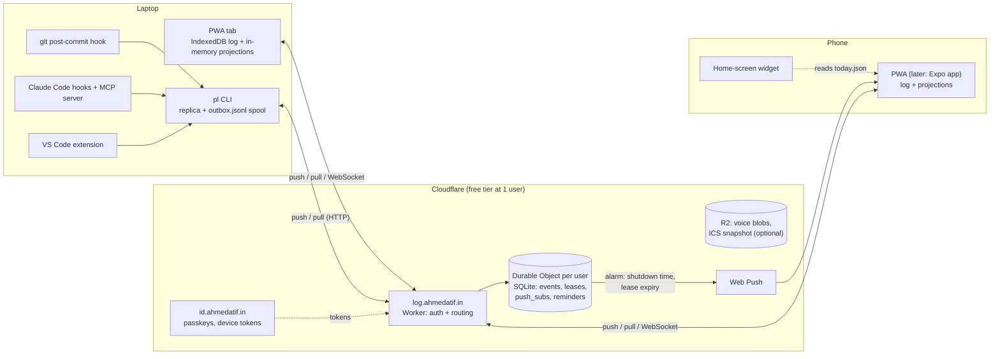
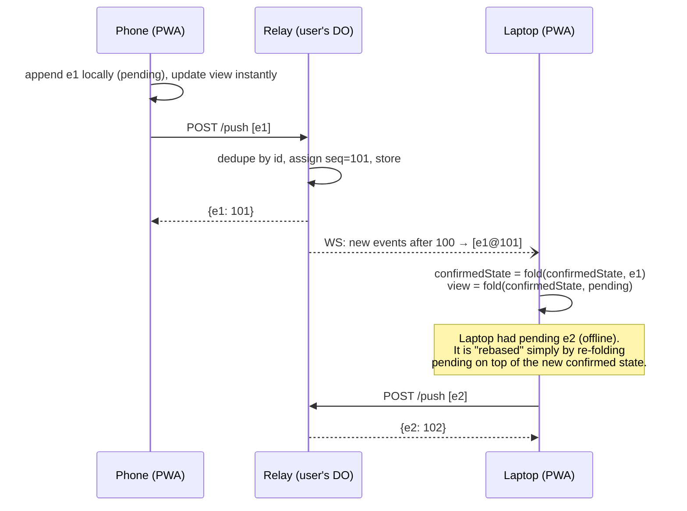
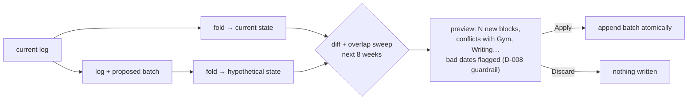

# 10 · Wildcard: The Ledger

> **Brainstorm slice:** wildcard (whole-app alternative design)
> **Date:** 2026-10-05
> **Status:** a radical alternative, here to be argued with. Not a proposal to replace the main design wholesale.
> **Tech claims checked on 2026-10-05.** Versions and links are in the Sources section at the end.

---

## TL;DR

**The Ledger** is a local-first, event-sourced planner. Each user has exactly one append-only log of typed events, such as `occurrence.cancelled {reason: "prof"}`, `commit.observed`, `day.reviewed` and `thought.captured`. The calendar, the task list, attendance, sessions, "time back" suggestions and the estimation multiplier are all **projections**: pure functions that fold the log into state. Every device keeps a full copy of the log and computes those projections locally, so the UI never waits on the network and capture works offline.

The server is not an application server. It is a **log relay**. It authenticates a device, stamps each incoming event with a per-user sequence number, stores it and fans it out to the user's other devices. It knows almost nothing about classes or tasks. Integrations (git hook, VS Code, Claude Code) do not call business endpoints. They append *observations*, and a pure **session-inference** projection decides what those observations mean. Because that inference is a function over history, changing the session gap threshold (an open question in §7) recomputes every past session from the same raw facts.

The main argument for it: event sourcing is usually painful because of scale, and this app has the opposite shape. It has many tiny logs, and each one fits in memory. One student produces roughly 40 events a day, about 6 MB a year. At that size "rebuild everything from scratch" is a legitimate strategy that takes milliseconds, and most of the textbook pain of event sourcing goes away.

The main argument against it: every event type you ever write must be readable forever, every projection must be deterministic on every device, and the server can no longer refuse a bad write. Those are permanent disciplines, not one-off costs.

**My verdict:** building the whole Ledger is defensible as an interview showcase, but it is not the lowest-risk path. Several of its ideas are cheap and clearly worth stealing into the conventional design: observations plus replayable inference, occurrence identity, deviation-only attendance, an outbox with idempotency keys, what-if previews and a shared core package. They are ranked at the end.

---

## 1. Why consider something this different

The conventional design treats the planner as a CRUD app with a recurrence engine bolted on. Read JOURNEY.md closely, though, and most of the interesting requirements are about *history and interpretation*, not current state:

- **Attendance (D-005, D-010)** is defined by what *didn't* happen. Classes are attended by default, only deviations are recorded, and an evening review confirms the rest. That is a fold over facts, not a column.
- **Auto sessions (D-006, D-009)** are interpretations of raw signals: commits, editor activity, a first Claude Code prompt. The rules for interpreting them (gap threshold, "commits mark the *end* of work", mapping commits to tasks) are explicitly still open in §5 and §7. When the rules are unsettled, keeping the raw signals and treating the interpretation as replaceable code is the safer bet.
- **Semester swap (D-004)** is about keeping history intact while the present changes. "History and attendance survive because groups are archived, not deleted" is event-sourcing language already.
- **Cancel instead of delete** in the original idea description is the same instinct: nothing is erased, it just changes state.
- **The estimation multiplier** is, as the session log already notes, a learning-rate step on the error. That is literally a fold over (estimate, actual) pairs.
- **Integrations** are signals coming from many places (git, VS Code, Claude Code, later a browser extension, later other `*.ahmedatif.in` tools). An append-only log is the most natural integration bus there is.

So the radical move is to make the log the database instead of logging *around* the database.

---

## 2. The core idea in one paragraph

Each user owns one ordered, append-only log of immutable events. An event records an intent or an observation in domain language, in the past tense, with a device-minted ID, a device timestamp and a time zone. Each client (the PWA, a future native app, the `pl` CLI that the git hook and Claude Code hooks call, and the VS Code extension) holds a replica of the log and runs a shared TypeScript package, `@planner/core`. That package defines the event types, the projections (calendar, tasks, attendance, sessions, dump ageing), the quick-add parser, the recurrence expander and the scheduling algorithms. Writes are local and instant: append to the local log, update the projection, then sync in the background. The relay, one tiny Cloudflare Worker with one Durable Object per user, gives the log a total order and pushes new events to other devices. Ephemeral signals such as heartbeats never enter the log. They update a small lease table on the relay exactly as D-009 describes, and only a session's *end* is written back as an event.

---

## 3. Architecture



There are four moving parts, and only one of them is a server:

1. **`@planner/core`** is a pure TypeScript package with no I/O. Every client imports it. It is where nearly all of the real logic lives, and it is fully unit-testable with fixture logs.
2. **Clients** each own a replica, an outbox of pending events and a sync loop.
3. **The relay** is three endpoints (`push`, `pull`, `lease`) plus a WebSocket for live tailing. One Durable Object per user is a single-threaded actor, so assigning sequence numbers needs no locks. The free plan allows SQLite-backed Durable Objects (checked 2026-10-05; numbers in §9).
4. **Identity** is a shared service for all `*.ahmedatif.in` tools (§8).

---

## 4. Data shapes

### 4.1 The event envelope

```ts
interface Event<T extends EventType = EventType> {
  id: string;          // ULID minted on the device: idempotency key + stable reference
  type: T;             // e.g. "occurrence.cancelled"
  v: number;           // payload schema version for this type (for upcasting)
  at: string;          // when it happened, device clock, ISO 8601 with offset
  tz: string;          // IANA zone of the device at the time, e.g. "Asia/Kolkata"
  device: string;      // "phone", "laptop-pwa", "laptop-cli"
  actor: "user" | "git" | "vscode" | "claude-code" | "relay";
  batch?: string;      // groups events that apply/undo together (imports, swaps)
  seq?: number;        // assigned by the relay; undefined while pending
  receivedAt?: string; // relay clock; lets projections detect device clock skew
  payload: PayloadOf<T>;
}
```

Two fields matter more than they look. `actor` lets you answer "what did Claude Code add today?" and lets you revert all of it in one go. `seq` together with `at` gives you **two time axes**: when something happened (valid time) and when the system learned about it (transaction time). §6.2 explains why that matters.

### 4.2 Event catalogue (v1)

| Area | Events (past tense, domain language) | Notes |
|---|---|---|
| Schedules (D-004) | `schedule.created {scheduleId, name, color, attendance, activeFrom, activeUntil}`, `schedule.archived {scheduleId, effectiveFrom}` | A schedule is a named group. Archiving ends its effect; it never deletes. |
| Rules | `rule.defined {ruleId, scheduleId, title, rrule, startLocal, duration, tz}`, `rule.split {ruleId, at, newRuleId, changes}`, `rule.ended {ruleId, at}` | `rrule` is a plain RFC 5545 string. "This and following" is a split. |
| Occurrences | `occurrence.cancelled {occ, reason: "prof" \| "skipped" \| "other", note?}`, `occurrence.restored {occ}`, `occurrence.moved {occ, start, end}` | The reason enum is D-005's one extra tap. |
| Tasks | `project.created`, `task.created {taskId, title, projectId?, parentId?}`, `task.edited`, `task.estimated {taskId, minutes}`, `task.completed`, `task.reopened`, `task.deleted` | Nested tasks via `parentId`. |
| Plans | `plan.created {planId, taskId, start, end, source: "drag" \| "time-back" \| "quick-add"}`, `plan.changed`, `plan.removed` | A plan is a task placed on the calendar. It is a separate thing from a session. |
| Sessions | `session.started {sessionId, taskId?, projectId?, source}`, `session.stopped {sessionId, endedAt}`, `session.timed_out {sessionId, endedAt}` (relay-authored), `session.noted {sessionId, text, shas?}`, `session.adjusted`, `inferred.confirmed`, `inferred.rejected` | Heartbeats are **not** events (§6.4). |
| Signals | `commit.observed {repo, projectId, sha, branch, subject, authoredAt, trailers}` | Observations from integrations. |
| Dump | `thought.captured {thoughtId, text, projectId?, via: "text" \| "voice", audioRef?}`, `thought.touched`, `thought.promoted {thoughtId, taskIds}`, `thought.archived` | `promoted` keeps the lineage from thought to task. |
| Review (D-010) | `day.reviewed {date, skipped: occ[], attendedAnyway: occ[]}` | The latest review for a date wins, and earlier ones stay as a correction trail. |
| Meta | `setting.changed {key, value}`, `event.reverted {eventId}`, `event.redacted {eventId}` | Generic undo, plus real deletion for privacy (§14). |

### 4.3 Occurrence identity

A recurring block is never stored per occurrence. It is expanded on read for the visible window. An occurrence is identified by a stable key made from the rule and its **original** start time, which is the same idea as iCalendar's `RECURRENCE-ID`:

```
occ = `${ruleId}@${originalStartLocal}`      // "r_dsa@2026-10-07T10:00"
```

A cancellation or move points at that key. It does not point at a row ID, and it does not point at the occurrence's *current* time. This one decision makes cancels and moves survive re-expansion, device differences and moving an occurrence twice.

### 4.4 Relay storage (Durable Object SQLite)

```sql
CREATE TABLE events (
  seq         INTEGER PRIMARY KEY,      -- total order for this user
  id          TEXT NOT NULL UNIQUE,     -- device ULID: dedupes retries
  type        TEXT NOT NULL,
  at          TEXT NOT NULL,
  device      TEXT NOT NULL,
  received_at TEXT NOT NULL,
  body        TEXT NOT NULL             -- full JSON envelope (or ciphertext, see §14)
);
CREATE TABLE leases (session_id TEXT PRIMARY KEY, last_seen INTEGER NOT NULL, gap_s INTEGER NOT NULL);
CREATE TABLE push_subs (endpoint TEXT PRIMARY KEY, keys TEXT NOT NULL, device TEXT NOT NULL);
CREATE TABLE reminders (kind TEXT PRIMARY KEY, local_time TEXT NOT NULL, tz TEXT NOT NULL);
```

That is the entire server-side schema. Nothing on the server needs a migration when the app changes.

### 4.5 Client storage

Store the event log in IndexedDB using the tiny `idb` wrapper, and keep the projections **in memory** as plain TypeScript maps, with a snapshot persisted at the last confirmed `seq` for fast startup. At about 15k events a year this is fine for many years. SQLite-WASM on OPFS is the upgrade path if querying ever gets heavy. The `opfs-sahpool` VFS works in Chrome 108+, Safari 16.4+ and Firefox 111+ and needs no COOP/COEP headers. It allows only one connection, though, so multiple tabs need a leader, and Safari's private mode has no OPFS at all (PowerSync's May 2026 survey). For one person's planner that complexity is not worth paying up front.

---

## 5. Sync protocol

The relay **never refuses an event for business reasons**. It checks only the envelope shape, the size and the auth scope, then assigns the next `seq`. All business validation happens in the projections, which are deterministic, so every replica reaches the same verdict about an event that "doesn't make sense any more", such as planning a task that another device deleted.



Each client keeps two pieces of state:

- `confirmedState`, the fold of all events that have a `seq`, persisted with its `seq` watermark.
- `pending`, the events in the local outbox that haven't been acknowledged yet.

What the UI renders is `pending.reduce(apply, confirmedState)`. When upstream events arrive, you fold them into `confirmedState` and re-apply `pending` on top. Pending is almost always 0–10 events, so this "rebase" costs nothing. LiveStore, the most mature event-sourced local-first library, uses the same git-like push/pull-and-rebase model with a central sync backend that enforces total order. That validates the shape. This design is simply a smaller, hand-rolled version of it.

There are three endpoints:

| Endpoint | Purpose |
|---|---|
| `POST /push {events[]}` | Idempotent by `id`. Returns the assigned `seq` for each event. |
| `GET /pull?after=N` (+ WebSocket tail) | Everything after watermark `N`. The WebSocket uses DO hibernation, so idle connections cost nothing. |
| `PUT /lease/:sessionId {lastActiveAt}` | D-009 heartbeat batch. Updates `last_seen` only. |

**Multiple tabs:** one tab takes a Web Lock and becomes the sync leader. Tabs announce new events to each other over `BroadcastChannel`.

---

## 6. Core flows

### 6.1 Recurring blocks, and cancelling with "prof" or "skip"

Setting up DSA on Monday and Wednesday at 10:00 appends one event:

```json
{ "type": "rule.defined", "payload": {
  "ruleId": "r_dsa", "scheduleId": "s_classes_aut26", "title": "DSA",
  "rrule": "FREQ=WEEKLY;BYDAY=MO,WE", "startLocal": "10:00", "duration": "PT1H",
  "tz": "Asia/Kolkata", "from": "2026-07-21", "until": "2026-11-28" } }
```

The calendar projection expands every active rule for the visible week using an RFC 5545 library. `rrule-temporal` (v2.2.7 on npm) is Temporal-based and timezone-aware, but Safari still doesn't ship Temporal, so the PWA needs a polyfill. The projection then overlays a map of overrides keyed by `occ`. Tapping cancel asks one question (D-005) and appends `occurrence.cancelled {occ: "r_dsa@2026-10-07T10:00", reason: "prof"}`. The block renders greyed out with diagonal stripes because the projection marks it cancelled. Nothing was deleted, and `occurrence.restored` undoes it.

"This and following" appends `rule.split`, which ends the old rule just before `at` and defines a new rule from `at`. Be honest here: **event sourcing does not remove the hard recurrence edge cases**, it only relocates them. When a split happens, the projection still has to decide what to do with overrides that point at the old rule after the split point. The policy is the same one a conventional engine needs: carry an override over if the new rule produces an occurrence with the same original start, otherwise surface it as orphaned. The gain is that every such decision is now reproducible from the log and covered by fixture tests.

### 6.2 Semester swap with conflicts, and time travel

D-008's import (a ready-made LLM prompt, the user pastes the result back) produces a **proposed batch** of events, not database writes: `schedule.archived {s_classes_aut26, effectiveFrom: 2027-01-04}`, `schedule.created {s_classes_spr27}`, and N × `rule.defined`, all sharing one `batch` ID.

The preview is a **what-if fork**. The client folds `log + proposedBatch` into a throwaway state and diffs it against the current state. It never touches the real log.



Conflict detection is an interval sweep over the expanded occurrences of every schedule active in the hypothetical state. Undoing the whole import later is a single `event.reverted` per batch, and the projection skips anything in a reverted batch.

**Time travel comes for free and is cheap.** "What did my week look like before the semester swap?" means: fold the events with `seq` below the swap batch's first `seq`, then render that week. Because events carry both `at` (valid time) and `seq` (transaction time), you can ask two different questions:

- *"What was planned for 12 Oct?"*: valid time. Fold everything and look at 12 Oct.
- *"What did I believe on 1 Oct my week would look like?"*: transaction time. Fold up to the last `seq` received on 1 Oct.

That is bitemporal data, which most CRUD apps can't answer at all. A small "as of" date scrubber on the calendar makes an excellent demo.

### 6.3 Dragging a task onto the calendar

Dropping a task on a slot appends `plan.created {planId, taskId, start, end, source: "drag"}`. Resizing it appends `plan.changed`. The original idea description asks for this: if the plan's time passes and the task isn't ticked, the task "goes back to its place unticked". Here that is a **read-time rule**, `now > plan.end && !completed`, so no background job is needed. Clicking the task shows its plans and its sessions, both folded from the log.

### 6.4 Timer, sessions and D-009 heartbeats

Manual timer: Start appends `session.started {sessionId, taskId, source: "ui"}` and Stop appends `session.stopped`. The timer is "owned by the log", not by a server process. Any device that has synced shows the same running timer, because a running timer is just a start timestamp with no stop event yet.

Heartbeats deliberately stay **out** of the log. Storing a ping every 2 minutes would add about 90 events to a three-hour coding session, all of them meaningless once the session has closed. Instead, following D-009 exactly:

1. Editor-side clients (the VS Code extension, the Claude Code hooks via `pl`) batch activity locally and call `PUT /lease/:sessionId` roughly every 2 minutes, only while active.
2. The Durable Object updates `leases.last_seen` and schedules a DO **alarm** at `last_seen + gap`. Every lease update pushes the alarm later.
3. If the alarm fires, or a pull notices an expired lease (the lazy path), the relay appends `session.timed_out {sessionId, endedAt: last_seen}` as an event authored by `actor: "relay"`.

Writing the close back into the log is a small but important deviation from purely lazy computation. `last_seen` is not in the log, so if every client computed the timeout lazily, they would each need the lease table and could disagree. Writing the end as an event means every replica, now and on replay, agrees on when the session ended.

A manual timer you forget to stop has no lease, so it doesn't time out. The evening shutdown (§6.7) catches it instead: "DSA timer has been running for 9 h. Trim it to when you last did something?"

### 6.5 Git-hook auto sessions and the inference projection

The post-commit hook runs `pl observe commit &`, in the background so it never slows a commit. The CLI reads the repo's `.planner` link file (this resolves the open risk in §5 of JOURNEY.md, and name matching is kept only as a fallback), appends a `commit.observed` to its local replica and spool file, and flushes when it's online. Commits made on a train with no network are not lost.

Sessions are then a **projection, not a record**:

```ts
function inferSessions(
  signals: Signal[],          // commit.observed + closed leases, grouped by projectId
  explicit: Session[],        // ui / vscode / claude-code sessions
  overrides: Override[],      // inferred.confirmed / inferred.rejected / session.adjusted
  p = { gapMin: 45, leadInMin: 25 },
): InferredSession[] {
  // 1. Explicit sessions win: signals inside one are attached to it (commit refs).
  // 2. Remaining signals are clustered: a new cluster starts when the gap > p.gapMin.
  // 3. Commits mark the END of work, so a cluster starts at
  //    max(firstSignal - leadIn, previousClusterEnd).
  // 4. Task mapping: "Task: T-12" trailer > branch "feat/T-12-…" > active task > project-only.
  // 5. Key = projectId + first signal id, so overrides can target it stably across replays.
  // 6. Apply overrides last (user corrections always beat inference).
}
```

This is the strongest argument for the whole design. JOURNEY §7 asks "Session gap threshold for commit-based sessions?" and "How are commits mapped to tasks?". In a CRUD design those answers get baked into rows at write time, and changing your mind means a data migration or living with old mistakes. Here you keep the raw facts, change one parameter, and every historical session is recomputed in milliseconds. You can even answer the open question empirically: chart your own last month at `gapMin` values of 20, 30, 45 and 60 and pick the one that matches reality. User corrections survive because they are events too, keyed to the inferred session's stable key.

### 6.6 Thought dump

Capture appends `thought.captured {thoughtId, text, projectId?, via}` to the local log and is done. That is a single IndexedDB write with no network round trip, so it is as fast as capture can get on a PWA, and it works in a lift with no signal. Voice input uses the browser's speech recognition where it exists. Otherwise the audio is recorded, stored in R2 by content hash, and only `audioRef` goes into the log. Ageing (JOURNEY §4, item 5: "a gentle ageing signal, not a forced ritual") is a projection: `now − max(capturedAt, lastTouched)`. Promoting a thought appends `thought.promoted {thoughtId, taskIds}`, so every task remembers the thought it came from.

### 6.7 Evening shutdown and attendance (D-005, D-010)

At the user's shutdown time (stored in the relay's `reminders` table whenever a `setting.changed {key: "shutdownAt"}` passes through), a DO alarm sends a Web Push. On iOS this works only for PWAs added to the Home Screen, which has been supported since iOS 16.4. The shutdown screen is one projection query that returns today's occurrences in attendance-enabled schedules that weren't cancelled by the prof, all pre-ticked as "went". It also lists inferred sessions waiting for confirmation and any timer that is still running. Submitting appends a single `day.reviewed {date, skipped: [...]}`.

Attendance is then a pure derivation. Nothing like "attendance %" is ever stored:

```ts
function attendance(s: State, scheduleId: string, now: ZonedDateTime) {
  const marks = pastOccurrences(s, scheduleId, now).map(o => {
    const c = s.cancellations.get(o.key);
    if (c?.reason === "prof") return "excluded";      // doesn't count either way
    if (c?.reason === "skipped") return "absent";
    const r = s.reviews.get(o.date);                  // latest day.reviewed for that date
    if (!r) return "unconfirmed";                     // D-010
    return r.skipped.has(o.key) ? "absent" : "present";
  });
  const total = marks.filter(m => m !== "excluded").length;
  const present = count(marks, "present"), unconf = count(marks, "unconfirmed");
  return { low: present / total, high: (present + unconf) / total };   // the D-010 range
}
```

"Unconfirmed" isn't a status anyone writes. It literally means "no review event covers this occurrence". If you correct last Tuesday on Friday, that is just another `day.reviewed` for Tuesday, and the trail of corrections is kept.

### 6.8 Quick add

The rule-based parser lives in `@planner/core`. `"dsa assignment fri 2h #college"` becomes `task.created` + `task.estimated {120}` + optionally `plan.created`, all in one batch. The PWA, `pl add "…"` in the terminal and Claude Code's MCP tool all call the same parser and emit the same events. There is **one write path** no matter where the input comes from.

### 6.9 "Time back" and the estimation multiplier

When an `occurrence.cancelled` arrives, whether from this device or from the phone over the WebSocket, the client runs `suggest(state, freedGap, now)`. This is a pure function that ranks open tasks whose *adjusted* estimate fits the gap. Suggestions are ephemeral and are not stored. Accepting one appends `plan.created {source: "time-back"}`, so the acceptance rate can be measured later from the log.

The estimation multiplier is a fold over `(task.estimated, total session time, task.completed)` per category: `f ← f + α·(actual/estimate − f)`. Because it is a fold, you can **replay the same history with a different α** and see which learning rate would have predicted best. That turns the "it's like a training step" observation from JOURNEY's session log into a small experiment you can actually run and show.

---

## 7. Integrations

Every integration becomes a thin wrapper around one CLI.

**`pl`** is a Node/Bun CLI that imports `@planner/core`. It holds a device token in `~/.config/planner/`, keeps a local replica, and spools to `outbox.jsonl` when offline. Commands: `pl observe commit`, `pl start [task]`, `pl stop`, `pl add "…"`, `pl status`, `pl today --json`, `pl mcp`. Login uses a device-code flow, the same way `gh auth login` works.

- **Git hook (D-006, first):** a global `core.hooksPath` script, one line: `pl observe commit --repo "$PWD" &`. It is tool-agnostic and works offline.
- **VS Code extension (second):** the extension is itself a replica. It runs `@planner/core` in the extension host and pulls the log, so "pick the task from the project's task tree" needs **no API at all**. It reads its own copy. It sends leases while the editor is focused and edits are happening, and its Start button appends `session.started {source: "vscode"}`.
- **Claude Code (third):** a `UserPromptSubmit` hook (which receives the prompt and the working directory, and whose stdout is added to Claude's context) calls `pl observe prompt`. If the local replica shows no open session for the project, `pl` appends `session.started {source: "claude-code"}` and prints a one-line notice, which is D-006's planned behaviour. Later prompts only refresh the lease. Every prompt is a heartbeat-like signal, not an event. A `SessionEnd` or `Stop` hook updates the lease one last time. `pl mcp` exposes `today()`, `add_task()`, `capture_thought()` and `note_session()` to Claude, all served from the local replica, so they are instant and work offline. Every event is tagged `actor: "claude-code"`, so "undo everything Claude did today" is a filter plus a batch revert.

The general rule that keeps the log clean: **a signal that carries information becomes an event** (a commit has a SHA and a message, the first prompt starts something). **A signal that only says "still here" becomes a lease update.**

---

## 8. Multi-device, native app later, shared identity

**Multi-device** is what the sync protocol in §5 already provides. A new device downloads the whole log, roughly 6 MB a year raw and much less gzipped. A later optimisation lets any client upload a projection snapshot at `seq N` for faster bootstrapping.

**Native later (D-007):** an Expo / React Native app is just another replica that runs the same `@planner/core` on `expo-sqlite`. Widgets can't comfortably run JavaScript, so the app writes a precomputed `today.json` into the shared app-group container on every change and the widget reads that. A quick-capture widget or share-sheet extension appends `thought.captured` to a native-side outbox file, which the app flushes later. Local-first makes the widget story *easier* than in a server-authoritative design, because capture never needs the network.

**Shared identity across `*.ahmedatif.in`:**

- `id.ahmedatif.in` handles sign-in with passkeys. A WebAuthn credential registered with RP ID `ahmedatif.in` is valid on every subdomain. The service issues an `HttpOnly; Secure; Domain=ahmedatif.in` session cookie for the web apps and scoped device tokens for the CLI and the editor.
- Each future tool gets a **namespace in the same per-user log**: `tasks/*`, `fitness/*`, `reading/*`. Tokens are scoped, so a tool can append only to its own namespace and can read only the namespaces it has been granted.
- "If they had something related to tasks, they would have it reflect here" (from the original idea description) then becomes a projection that reads another namespace. A future gym app's `fitness/workout.logged` can appear as a block on the calendar with no integration API. The log *is* the shared user space.

---

## 9. Scaling: 1, 1k and 10k users

Assume about 40 events per active user per day at about 400 bytes each, which is roughly 6 MB a year raw. Assume about 60 lease updates per user per day (2 h of coding at one every 2 minutes).

Cloudflare limits, checked 2026-10-05:

- **Free plan:** 100k DO requests/day, 13,000 GB-s/day, 5 GB SQLite storage in total, 5M rows read/day, 100k rows written/day.
- **Paid plan:** 1M requests/month included, then $0.15 per million; 50M row writes/month included; 5 GB-month of storage included, then $0.20 per GB-month.

| Users | What happens | Cost (estimate) |
|---|---|---|
| **1** | One Durable Object. A few hundred requests a day. | ₹0 on the free plan. |
| **1k** | 1k DOs, no shared hot spot. About 100k requests/day and about 100k row writes/day, which is right at the free plan's limits. | Workers Paid at about $5/month. |
| **10k** | D-009's worst case (everyone coding at once) is about 83 lease requests/s, but each one goes to that user's own actor, so there is no global contention. Realistically about 1.5M requests/day (about 45M/month) and about 30M row writes/month. Storage grows about 60 GB a year. | Roughly $20–40/month. Unverified ballpark: check DO duration and WebSocket message billing before trusting it. |

If you'd rather avoid Cloudflare, the relay is about 300 lines and can run unchanged as a single Bun process with `bun:sqlite` on any cheap VPS. One process handles 10k users at these rates without trouble, because the per-user write rate is tiny.

The scaling problems that *matter* are not about throughput:

1. **Client replay cost grows with years of history.** Fix it with persisted snapshots and uploaded snapshots. Even five years (about 75k events) folds in about a second.
2. **Schema evolution across 10k logs you can't centrally migrate.** Upcasters (functions that translate old event versions into new ones) accumulate forever. See §14.
3. **Cross-user features** (sharing a section's timetable, shared projects) don't fit per-user isolation and need shared streams with ACLs. That is a whole new subsystem.

---

## 10. Effort for a solo student

This assumes about 10–12 focused hours a week alongside KIIT coursework.

| Phase | Scope | Rough time |
|---|---|---|
| **v0** | `@planner/core`: envelope, about 10 event types, schedule/rule/occurrence projections, fixture tests. A **local-only** PWA (IndexedDB log, no server at all) with a week view, schedules and cancel with prof/skip. Dogfood for 2 weeks, as the roadmap says. | 3–4 weeks |
| **v0.5** | Relay (Worker + DO), device tokens, push/pull/WebSocket, pending overlay. Phone and laptop in sync. | 1.5–2 weeks |
| **v1** | Tasks/projects, plans by drag, manual sessions, thought dump. | 5–6 weeks (mostly UI, same as the conventional design) |
| **v2** | Attendance plus shutdown plus Web Push, quick-add parser, time back, multiplier. | 4–5 weeks |
| **v3** | `pl` CLI, git hook, leases plus inference, VS Code extension, Claude Code hooks and MCP. | 4–6 weeks |

Compared with the conventional design, the UI cost is the same, and the UI is most of the work. The backend is *smaller*: three endpoints instead of about 30 REST routes, and no ORM or database migrations. The extra costs are the sync client, which is about 2 weeks, and an ongoing discipline tax on determinism and event design. Overall that is roughly 15–25% more time to v2, and about the same or less to v3, because integrations are so thin here.

A nice property for de-risking: **v0 needs no backend at all.** If the experiment fails, the local log still works as an import format for a conventional Postgres backend, because events are intents and replaying them into rows is straightforward.

---

## 11. Interview value

The interview value is high, and the reasons are explainable rather than just impressive-sounding:

- **Concepts you can whiteboard:** event sourcing and CQRS, projections as pure folds, idempotency keys, total ordering by a sequencer, optimistic UI by rebasing pending work, bitemporal data, deterministic replay, actor-per-user sharding with Durable Objects, lazy versus alarm-driven timeouts, and upcasting.
- **Stories with numbers:** "I changed the session gap from 30 to 45 minutes and recomputed six months of sessions in under a second. Here is the before and after chart." "Here's my week as I planned it *before* the semester swap."
- **A real design trade-off you lived through:** "Heartbeats are not events. Here is the rule I used to tell signals from facts, and here is the one place the relay had to become slightly smart."
- **Honest prior art:** "I built a small version of the model LiveStore uses, and I can explain every line of it."

The risk is that an interviewer asks "why not just Postgres?". You need a crisp answer: offline capture, observations plus replayable inference, history as a feature, and integrations as plain appends. You also need to be candid about what it cost you (§14).

---

## 12. Runners-up (brief)

### 12.1 Git-native plain text: "the planner is a repo"

```
~/planner/
  schedules/classes-aut26.toml        # rules + RRULE strings
  tasks/inbox.md                      # - [ ] items with {id, est} attributes
  projects/planner-app/{tasks,dump}.md
  sessions/2026-10.jsonl              # one line per session / commit observation
  reviews/2026-10-05.md               # shutdown confirmations
```

The app would be a viewer and editor that reads and writes the repo, either through the GitHub API from the PWA or through isomorphic-git in the browser. Claude Code edits the files directly, and Atif already lives in git, VS Code and Claude Code. It is lovely for a single power user, and **it breaks badly** in several places:

- Phone capture means a commit per thought.
- Two devices editing `tasks.md` produce merge conflicts.
- D-009 heartbeats have nowhere sensible to go.
- A commit in one project repo would trigger a commit in the planner repo, which gets noisy.
- There is no story for other users.
- In an interview it looks like "a Markdown editor".

**Worth keeping:** the `.planner` link file, a plain-text or JSONL export, and the idea that Claude Code should be able to *read* your planner. That is a nightly JSONL export to a private repo, or simply `pl today --json`.

### 12.2 The calendar is the database (CalDAV)

Run Radicale (3.8.1, released 2026-09-25) and model everything in iCalendar:

- Schedules become calendars, with colour as the calendar colour and archiving as hiding the calendar.
- Blocks become `VEVENT` + `RRULE`.
- A cancellation becomes an override with a `RECURRENCE-ID`, `STATUS:CANCELLED` and `X-PLANNER-REASON:prof`.
- Tasks become `VTODO` with `RELATED-TO` for nesting.
- Plans become `VEVENT`s related to the `VTODO`.
- Thought dump entries become `VJOURNAL`, which really exists in RFC 5545.

The appeal is that every calendar app (Thunderbird, DAVx5, Apple Calendar) becomes a client for free, and D-003's ICS export is trivial. It breaks on everything that isn't a calendar:

- Sessions, heartbeats, attendance ranges and inference are all awkward.
- WebDAV/XML is miserable to program against.
- `VTODO`/`VJOURNAL` support is patchy across clients.
- Querying is weak.
- Identity across subdomains is awkward.

**Worth keeping:** model recurrence *exactly* the way RFC 5545 does. That means RRULE strings, overrides keyed by the original start (`RECURRENCE-ID`) and cancelled overrides instead of deleted rows. The data then exports to ICS losslessly.

### 12.3 Why not a CRDT document (Automerge, Yjs)?

CRDTs solve concurrent edits to the same document. Automerge 3.0 made big memory improvements, and Yjs is the production default. This app has very few genuinely concurrent edits; its hard problems are *what happened and why*. A CRDT gives you a merged state and an op-level history, but it doesn't give domain facts like "cancelled because the prof didn't come" or "this session was inferred from these commits". An explicit domain event log is a better fit, and it is far easier to explain.

---

## 13. Comparison with the likely conventional design

| Dimension | Conventional (TS + REST + Postgres, server-authoritative, PWA + query cache) | The Ledger (local-first event log + relay) |
|---|---|---|
| Source of truth | Rows in Postgres | Per-user append-only log. Rows are disposable projections. |
| Offline | Read-only cache at best. Writes need queueing that you build anyway. | Full read/write offline. Sync is background. |
| UI latency | Network round trip, or optimistic updates with rollback | Local fold, effectively instant |
| Integration write path | One authenticated endpoint per action | Append an observation. The same three endpoints serve every client. |
| Recurrence edge cases | Must be solved in the engine | Must be solved in the projection. **Same work.** |
| History / time travel | Only if you add audit tables | Native, and bitemporal |
| Changing inference rules (gap, commit→task) | Baked into rows at write time. Needs a migration or tolerating old mistakes. | Change a parameter, recompute history |
| Enforcing invariants at write time | Easy (constraints, transactions) | Impossible on the server. Resolved deterministically at read time. |
| Schema change | SQL migration, run once | Upcasters kept forever, but projections are just rebuilt |
| Real deletion / privacy | `DELETE` | Needs redaction plus log rewrite (§14) |
| Server-side jobs (reminders, digests, ICS feed) | Natural | The relay must peek at events or run `@planner/core` |
| Cross-user features | Natural (joins, ACLs) | Hard: shared streams with ACLs |
| Native app / widgets | Another API client. Widget capture needs the network. | Another replica. Widget capture works offline via an outbox. |
| Debugging | Inspect rows | Replay the user's log. Every bug is reproducible. |
| Server cost at 10k users | Postgres plus app server, maybe $20–50/month | About $20–40/month (estimate) |
| Effort to v2 | Baseline | About +15–25% (sync client plus discipline) |
| Rabbit-hole risk | Medium (over-engineering the API) | **High** (sync engines are a famous rabbit hole) |
| Interview story | Solid, common | Distinctive, if you can defend the trade-offs |

---

## 14. Where it breaks (a steelman against myself)

1. **Event design mistakes are permanent.** In month one you *will* design an event wrong, for example storing a local time without its zone, or putting `projectName` where `projectId` belongs. In a CRUD app you'd write one migration and forget it. Here every replica must read that event forever, so upcasters pile up. The mitigation is honest but not pure: because each log belongs to one user and you control the code, you can allow controlled **log rewrites**, which copy-transform the log into a new one and bump an epoch. That is a migration under another name, and it weakens the "immutable" story.

2. **Determinism is a silent killer.** Every replica must fold the same log to the same state. A single `Date.now()` inside a projection, a locale-dependent sort, a device time zone leaking in, or two devices on different versions of the rrule library will make replicas diverge *silently*. Mitigations:
   - Pass `now` and `tz` explicitly to every derivation.
   - Pin library versions.
   - Run fixture logs under `TZ=America/New_York` and `TZ=Asia/Kolkata` in CI.
   - Hash projection output in development. LiveStore 0.4 does this with "materializer hash checks", which tells you how real the problem is.

3. **The server can't say no.** If two devices both start a timer on the same task, or two plans overlap, or two projects get the same name, the relay accepts all of it. Every invariant becomes a read-time conflict rule plus UI to resolve it. That is more design work in exactly the places a student would rather not think.

4. **Deletion and privacy fight immutability.** The thought dump is the most private part of the app, and "delete this" must actually delete it. That needs `event.redacted`, a relay that rewrites the stored body to a tombstone, clients that drop the payload, and backups that respect it. End-to-end encrypting payloads would make the relay zero-knowledge, which is nice. But it would also kill server-side reminders and the lease logic that peeks at `session.*` events. I would not do it in v1.

5. **The "dumb relay" doesn't stay dumb.** Leases, session timeouts, shutdown reminders, an ICS feed URL, or a push saying "your 3 pm class was cancelled, here's time back" all need server-side domain knowledge. You end up either peeking at an allow-list of event types (my choice) or running `@planner/core` inside the Durable Object. The second option works on Workers, but then you effectively have a backend again, just a stranger one.

6. **Recurrence is not solved, only moved.** The hardest open risk in JOURNEY §5 (one-off moves, "this and following", semester ends, DST) is exactly as hard in a projection as in a server engine. The Ledger makes it *reproducible*, not easier.

7. **Browser storage isn't guaranteed.** Safari can evict script-written storage for sites that aren't used. Installed PWAs fare better, and `navigator.storage.persist()` helps. The relay holds the canonical log, so eviction only costs a re-download, *unless* there were unsynced pending events. That window is small but not zero.

8. **Device clocks lie.** Events carry device time. A phone with the wrong clock puts a session on the wrong day. `receivedAt` lets projections detect large skew, but correcting it is a judgement call.

9. **Building a sync engine is a famous trap.** It is very easy to spend a semester on rebase edge cases, multi-tab leadership and WebSocket reconnection instead of the calendar UI you actually need. The off-the-shelf options don't remove that risk for this builder:
   - LiveStore is still beta at 0.4.0 (2026-06-02) and Effect-heavy, so it is harder to explain in an interview.
   - Jazz 2.0 is in alpha.
   - Zero 1.0 is stable but Postgres-centric, which is the conventional design again.
   - Replicache was archived in June 2026.

   So it is hand-roll or nothing, and hand-rolling is where the hours go. The cure is the strict scope in §10: no peer-to-peer, no CRDT text, no partial replication, and one leader tab.

10. **Multi-user features become expensive.** If KIIT classmates want to share a section timetable, or friends want shared projects, per-user logs need shared streams, membership events and ACL-aware projections. In the conventional design that is a join table and a `WHERE` clause.

11. **Event-granularity bikeshedding.** Is a title edit one event or one per keystroke? Is a drag preview an event? (It isn't, but you'll argue with yourself about it.) The conventional design hides these decisions inside `UPDATE` statements.

Net assessment: points 1, 2 and 9 are the ones that could sink a solo student. They are manageable with discipline and tests, but they are real.

---

## 15. Challenges to locked decisions

| Decision | Conflict? | Honest argument |
|---|---|---|
| **D-001** (three sections) | None | The Ledger changes the plumbing, not the scope. |
| **D-002** (no ChatGPT plan; algorithmic first) | None | Every algorithm is a pure function over the log. An LLM provider can sit behind the same interface and emit proposed batches. |
| **D-003** (no Google sync; maybe ICS export) | Mild | A conventional server renders ICS on request. Here the dumb relay can't. Instead, a client renders `calendar.ics` on change and uploads it to R2 at a secret URL, so the server still needs no domain logic. Google Calendar can subscribe to that URL. |
| **D-004** (groups archived, not deleted) | Reinforced | Archiving is still useful as "effective until" for projections, but *history* no longer depends on it, because nothing is ever deleted. |
| **D-005 / D-010** (default attended, evening confirm, range) | Fits perfectly | "Unconfirmed" is literally "no `day.reviewed` covers this occurrence." No extra state is needed. |
| **D-006** (git → VS Code → Claude Code) | Order kept, nature changed | Integrations become *observers* that append facts, not API clients that call business endpoints. The git hook fits even better, because it spools offline. The VS Code extension needs no read API because it is a replica. |
| **D-007** ("backend is API-first; native is just another client") | **Real conflict** | There is no rich API. The "API" is the log protocol plus `@planner/core`. Any client must run the projection logic, which is easy in TypeScript (PWA, Expo, VS Code, CLI) and hard in Swift or Kotlin. I think that is acceptable: native would be Expo, and widgets read a precomputed `today.json`. But a hypothetical third-party client can't just call `GET /calendar`. If that matters, the relay can run `@planner/core` and expose a read-only `GET /view/today`. |
| **D-008** (LLM-prompt import + preview) | Improved | The preview becomes a what-if fork of the log, and undo is a batch revert. |
| **D-009** (batched heartbeats → `last_seen`, lazy close) | Kept, with one change | Heartbeats stay out of the log exactly as decided. But "computed lazily" must end with the relay *writing* `session.timed_out` into the log, because `last_seen` isn't replicated and replicas must agree on when a session ended. The relay gains one small piece of domain knowledge (session leases). |
| **JOURNEY §5** "server-owned timer" | Reframed | The timer is *log-owned*: a start event with no stop event yet. That is equivalent in practice, and it works offline. |

---

## 16. Worth stealing into the main design

These are ranked by value relative to cost. None of them requires adopting event sourcing.

1. **Integrations emit observations; sessions come from a pure, replayable inference function.**
   - *The idea:* store raw `commit_observations`, closed activity spans and agent "first prompt" signals in append-only tables. Derive sessions with `inferSessions(signals, explicitSessions, overrides, params)`. Materialise the result, but keep the ability to recompute.
   - *Why it's worth it:* it answers §7's open questions (gap threshold, commit-to-task mapping) with your own data, fixes past mistakes retroactively, and is trivially testable with fixtures. It is also the best interview story in this document.
   - *Cost:* low. One table, one pure function, one "recompute" button or job.
   - *Slices:* sessions/realtime, integrations, scheduling algorithms.

2. **Occurrence identity = `(ruleId, originalStart)`, with exceptions stored as overrides (the RFC 5545 `RECURRENCE-ID` model).** A cancel is an override with status `cancelled` plus a reason. Never materialise occurrences as rows.
   - *Why it's worth it:* it makes cancel, move and "this and following" survivable, and it makes ICS export lossless.
   - *Cost:* zero if decided now, painful later.
   - *Slices:* recurrence engine, data model.

3. **Attendance as a pure derivation from deviations plus `day_reviews`.** Store only cancellations with reasons and review rows. Compute present/absent/unconfirmed and the D-010 range at read time. Never store a percentage.
   - *Why it's worth it:* it is correct by construction, and corrections are just new rows.
   - *Cost:* zero.
   - *Slices:* data model, frontend, UX flows.

4. **An append-only activity log next to the normal tables ("event log lite"),** written in the same transaction as each meaningful change (cancel, skip, review, import, complete, promote), with `actor` and `batch_id`.
   - *Why it's worth it:* it gives global undo, "revert everything Claude Code did today", a history view and cheap "before the swap" time travel for schedules, without making the log the source of truth.
   - *Cost:* low to medium.
   - *Slices:* data model, backend, frontend.

5. **Client-minted idempotency keys (ULIDs) on every write, plus an outbox in both the PWA and the CLI** (`outbox.jsonl` spool for the git hook).
   - *Why it's worth it:* offline phone capture and offline laptop commits are never lost, and retries are safe. That directly addresses the "mobile capture speed" risk.
   - *Cost:* low.
   - *Slices:* database and sync, capture, integrations.

6. **What-if previews by dry-run.** For the semester swap and the D-008 LLM import, compute the proposed state in memory (or apply in a transaction and roll back), diff it against the current state, run the overlap sweep, and show conflicts. Apply atomically under one `batch_id` so the whole import can be undone.
   - *Cost:* low to medium.
   - *Slices:* UX flows, recurrence engine, backend.

7. **One shared `@planner/core` TypeScript package** containing types with zod schemas, the quick-add parser, recurrence expansion, inference, time back and the multiplier. It is imported by the PWA, the server, the `pl` CLI, the VS Code extension and the future Expo app.
   - *Why it's worth it:* one implementation of every rule, and the server and clients can never disagree.
   - *Cost:* about a day of monorepo setup.
   - *Slices:* build plan, frontend, integrations.

8. **Inject `now` and `tz` into every derivation.** "Overdue", "unconfirmed", "time back", ageing and the plan-expired-returns-to-list rule all take an explicit clock.
   - *Why it's worth it:* deterministic, testable, and DST and time-zone bugs show up in CI instead of in production.
   - *Cost:* zero.
   - *Slices:* every algorithmic slice.

9. **One CLI (`pl`) as the single integration surface.** The git hook, the Claude Code hooks and the VS Code extension all shell out to it, and it owns auth (device-code login), the offline spool, retries and `.planner` resolution.
   - *Why it's worth it:* three integrations become three thin wrappers, and D-006's later phases get much cheaper.
   - *Cost:* low.
   - *Slices:* integrations, auth.

10. **The "signal versus fact" rule for heartbeats.** A signal that only says "still here" updates a lease. A signal that carries information becomes a stored row. Write a session's end back as a durable record when the lease expires (an alarm or a lazy check).
    - *Why it's worth it:* it keeps D-009 cheap and gives every reader the same answer for when a session ended.
    - *Cost:* zero; this is a design rule.
    - *Slices:* sessions/realtime.

11. **Bitemporal stamps on sessions and reviews:** `occurred_at` from the device and `recorded_at` from the server.
    - *Why it's worth it:* clock-skew detection and "as known on date X" queries.
    - *Cost:* low.
    - *Slices:* data model.

12. **A static ICS feed via a secret URL,** regenerated on change and served from object storage.
    - *Why it's worth it:* the cheapest possible D-003, with no per-request rendering.
    - *Cost:* low.
    - *Slices:* integrations, infra.

13. **Ship v0 as a local-only PWA with no backend,** with data in IndexedDB as intent records that can later be replayed into the real backend.
    - *Why it's worth it:* the roadmap's v0 is "dogfood for 2 weeks". Skipping auth, hosting and the API for those two weeks gets the calendar UI into your hands sooner.
    - *Cost:* low. You need a one-time import path.
    - *Slices:* build plan, frontend.

14. **A nightly JSONL export to a private git repo.**
    - *Why it's worth it:* a free backup, and Claude Code can grep your planner history.
    - *Cost:* low.
    - *Slices:* infra, integrations.

### Not worth stealing

- **Full event sourcing as the source of truth for v0–v2.** Permanent schema burden plus sync-engine risk, unless Atif deliberately chooses it *as* the showcase and accepts the cost.
- **CRDTs (Automerge, Yjs).** Very few concurrent edits, and they answer "what's the state", not "what happened and why".
- **CalDAV as storage.** Steal the RFC 5545 *model* (item 2), not the protocol.
- **A git repo as the database.** Merge conflicts, no heartbeats, poor mobile.
- **Adopting LiveStore or Jazz now.** Beta and alpha respectively, heavy abstractions, and weak "explain every line" value. Read their docs as prior art.
- **End-to-end encryption in v1.** It blocks reminders, leases and the ICS feed. Revisit once the server-side features have settled.
- **Peer-to-peer sync.** It solves a problem a single user with a phone and a laptop doesn't have.
- **Storing every heartbeat or every Claude Code prompt as a row or event.** D-009 was right.

---

## Sources (checked 2026-10-05)

- LiveStore changelog: v0.4.0, 2026-06-02, still beta; Cloudflare DO-SQLite sync default; materializer hash checks. <https://docs.livestore.dev/changelog/>
- How LiveStore works: central sync backend enforces total order; pending events rebased on pull. <https://dev.docs.livestore.dev/overview/how-livestore-works/>
- Cloudflare Durable Objects pricing and limits (free: 100k req/day, 13,000 GB-s/day, 5 GB SQLite, 5M reads/day, 100k writes/day; free plan is SQLite-backed DOs only). <https://developers.cloudflare.com/durable-objects/platform/pricing/>
- SQLite WASM persistence, `opfs-sahpool` browser support. <https://sqlite.org/wasm/doc/trunk/persistence.md>
- PowerSync, "The Current State of SQLite Persistence on the Web: May 2026 Update" (2026-05-15). <https://powersync.com/blog/sqlite-persistence-on-the-web>
- Zero 1.0 stable (InfoQ, June 2026); Replicache repo archived 2026-06-10. <https://www.infoq.com/news/2026/06/zero-version-1/>, <https://github.com/rocicorp/replicache>
- Automerge 3.0 memory improvements. <https://automerge.org/blog/automerge-3/>
- Jazz 2.0.0-alpha.56 (September 2026). <https://github.com/garden-co/jazz/releases/tag/v2.0.0-alpha.56>
- KurrentDB (formerly EventStoreDB) 26.1 (2026-05-04), 26.1.1 security release (2026-07-21). Considered and rejected as overkill for per-user logs. <https://www.kurrent.io/releases/>
- Radicale 3.8.1 (2026-09-25). <https://pypi.org/project/Radicale/>
- Temporal: Chrome 144 (Jan 2026), Firefox 139; not in Safari stable as of Aug 2026. <https://bryntum.com/blog/javascript-temporal-is-it-finally-here/>
- rrule-temporal v2.2.7. <https://www.npmjs.com/package/rrule-temporal>
- iOS web push for Home Screen web apps (iOS 16.4+); Declarative Web Push in Safari 18.4. <https://www.magicbell.com/blog/pwa-ios-limitations-safari-support-complete-guide>
- Claude Code hooks reference (`UserPromptSubmit`, `SessionStart`, stdout added to context). <https://code.claude.com/docs/en/hooks>
- Not verified in depth: ElectricSQL and PowerSync versions. Both are Postgres-centric sync engines, closer to the conventional design than to this one.
