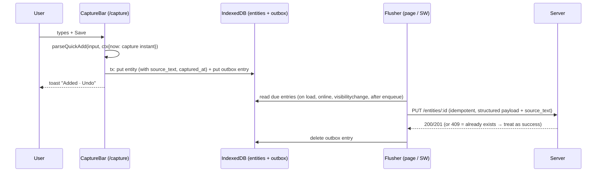
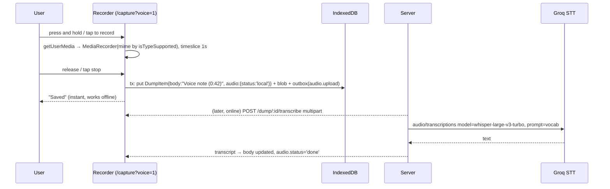
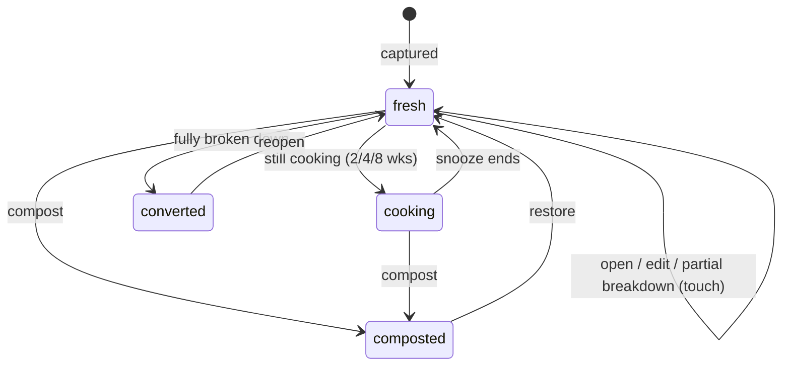

# 11 · Capture: quick add, voice, mobile speed, dump aging, breakdown

> Slice: **11-capture** · Written 2026-10-05 · Status: proposal for review
> Research checked on 2026-10-05. Versions come from the npm registry. Browser support comes from MDN, caniuse and vendor pages. Parser behaviour comes from running chrono-node 2.10.2 locally against the inputs below. Anything I could not verify is marked **(unverified)**.

---

## 1. TL;DR

- **One capture bar, three destinations.** The same input can create a **task**, a **recurring block**, or a **dump item**. Tasks and blocks get parsed when you capture them, because they carry dates. Dump items are stored raw: ideas don't have dates, and a parser that reads "next week" inside an idea as a due date does more harm than good. The rule: *parse what has a time, store what doesn't.*
- **The parser is a shared, pure TypeScript package** (`@planner/quickadd`) exposing `parseQuickAdd(input, ctx) → ParseResult`. It has three layers:
  1. **Own extractors** for the unambiguous parts: sigils (`@project`, `#category`, `!priority`, `~estimate`, `/command`), recurrence clauses (`every tue thu`), and numeric DD/MM dates.
  2. **chrono-node 2.10.2** (the default English parser, *not* `en.GB`) for date phrases, plus about eight custom parsers. Testing chrono showed real gaps: Hinglish `kal`/`parso`, `tues`/`weds`, `the 3rd`, `eod`, `day after tomorrow`, `8p`.
  3. **A small policy layer** that settles ambiguity: am/pm, "next friday", a weekday that equals today, "tomorrow" said after midnight. It always shows the choice it made and offers the alternative as one tap.

  The input string stays the single source of truth. Correcting a chip rewrites the text, not hidden state.
- **The voice MVP needs no code.** An autofocused text field already has the phone keyboard's mic (Gboard or iOS dictation). That works on-device, costs nothing, works inside installed PWAs, and handles Indian English better than anything we could ship. The first real voice feature is **record, then transcribe**:
  - MediaRecorder captures the audio, and it's saved to IndexedDB as a dump item straight away, so nothing is lost.
  - When online, the server transcribes it with Groq `whisper-large-v3-turbo`. Free tier, verified today: 20 requests/min, 2,000/day, 8 audio-hours/day.
  - The transcriber sits behind a `Transcriber` interface.

  No live Web Speech UI and no in-browser Whisper for now.
- **Mobile capture speed without native code:**
  - A `/capture` route that opens straight to the input and needs no network.
  - Three manifest shortcuts. On Android you can drag each one onto the home screen as its own icon.
  - A GET share target (Android only).
  - An offline outbox in IndexedDB.
  - A scoped **Capture API** with a personal access token. With it, free tools give near-native capture:
    - **HTTP Shortcuts** on Android: a widget and a Quick Settings tile.
    - **Apple Shortcuts** on iOS: Action button, Back Tap, or a Lock Screen control.
    - **A Hyprland keybind with a fuzzel prompt** on desktop.

  A native widget waits until measurements show we need one.
- **Dump aging is a freshness signal, not a chore:**
  - It's based on `last_touched_at`, which only deliberate interactions update.
  - It shows as gentle visual fading and a small age label.
  - At most once a week, a card offers "a few ideas from a while back" with up to three items.
  - "Still cooking" snoozes an idea, and "compost" archives it.
  - No counts of neglect, no badges, no streaks, and nothing is ever deleted automatically.
- **Breakdown** turns a dump item into one task, several tasks, a new project, or leaves it cooking.
  - The default is algorithmic: split the text into draft quick-add lines.
  - The optional AI path asks the `LLMProvider` to return *quick-add lines*. Those go through the same deterministic parser and the same preview, so the LLM never writes to the database directly.
  - Provenance is kept with `created_from_dump_id` on tasks and projects. Converting an item never deletes it.

---

## 2. Assumptions about other slices

I can't read the other slices, so this is what my design depends on. If any of these is wrong, the section marked "impact" says what changes.

| # | Assumption | Slice | Impact if wrong |
|---|---|---|---|
| A1 | The quick-add parser is a **framework-free TypeScript package** in a monorepo (`packages/quickadd`). The web client imports it for instant preview, and the Node backend imports it for API captures (Shortcuts, git hook, VS Code). | 03, 09, 13 | If the backend isn't TypeScript, server-side captures have to call a tiny parse endpoint written in TS. Workable, but it adds a hop. |
| A2 | Entities use **client-generated IDs (UUIDv7)**, and writes are **idempotent upserts by ID**. The client keeps an **offline store plus an outbox of queued mutations** (IndexedDB). | 02, 04 | If 04 goes online-only, capture still needs its own small outbox (§5.7). Capture must never fail because of the network. |
| A3 | `dump_items` is its own table with `id, user_id, body, project_id?, tags[], source, created_at, updated_at, last_touched_at, state, cooking_until?, deleted_at?`. Voice fields (`audio_status`, `audio_ms`) are nullable. | 02 | If dump items are modelled as "tasks with kind=idea", aging and breakdown still work. Filters just get messier. |
| A4 | `tasks.created_from_dump_id` and `projects.created_from_dump_id` are nullable FKs, and dump items are soft-deleted, so provenance survives. | 02 | Without the column we lose "idea → tasks" history, which is one of the best interview stories. |
| A5 | A task can carry a **date** (with optional time) and a **kind**: `do` (the day I intend to do it) or `due` (a deadline). An optional **planned block** links a task to a calendar slot. | 02, 10 | If 02 only has `due_at`, collapse `do` into `due`. The parser still emits both and the client maps them. |
| A6 | Recurring blocks use an **RRULE subset** (FREQ=DAILY/WEEKLY, INTERVAL, BYDAY, time, duration) and **belong to a group** (D-004). Quick add only creates the base rule. Exceptions and cancellations are 01's job. | 01 | If 01 picks a custom shape, `RecurrenceSpec` (§5.3) is a thin mapping. |
| A7 | The user profile stores an **IANA timezone** (`Asia/Kolkata`), a **week start**, and settings for a **logical day start** (default 04:00) and **waking hours** (default 07:00–23:00). | 02, 06 | The policy layer needs these. They can live in a capture-settings blob if nobody else wants them. |
| A8 | Auth (06) supports **scoped, revocable personal access tokens** (for example `capture:write`), stored hashed. The git hook in D-006 needs the same thing. | 06, 08 | Without PATs, the Shortcuts and HTTP Shortcuts path (my cheapest answer to the mobile-capture risk) can't work. |
| A9 | There is an **`LLMProvider` interface** (10) with a structured-output style call, `generate<T>(prompt, schema)`. AI breakdown is a new *use case* on that interface, not a new provider. | 10 | If no provider exists by v3, AI breakdown simply stays hidden. The algorithmic split is the default anyway. |
| A10 | The frontend (09) is a **Vite-built SPA/PWA** using `vite-plugin-pwa` (2.0.0, released 2026-10-03, a new major) with a service worker that precaches the app shell. | 07, 09 | The `/capture` route depends on the shell loading from cache. Any framework works, as long as there's a precached shell. |
| A11 | Push notifications exist for the evening shutdown (backlog). Capture adds **no** push notifications. Resurfacing lives inside the app. | 05, 12 | None. |
| A12 | The server has somewhere to hold an **audio upload temporarily** (memory or tmp disk) while it forwards it to the STT provider. Audio is **not** kept on the server by default. | 03, 07 | If 07 wants audio kept, a free object store (R2, Supabase Storage) works. Then it's a privacy decision for Atif (§9). |
| A13 | 12-ux-flows owns how the chips, the dump list and the breakdown screen *look*. This document defines *behaviour and data*. | 12 | None. |

**Builder assumption:** Atif types mostly English, with the occasional Hindi or Hinglish word for dates (`kal`, `parso`, `aaj`) and some Hinglish when speaking. Most voice notes will be Indian English with Hinglish mixed in. I'm also assuming his phone runs **Android** (most likely for a KIIT student; both are covered, but defaults favour Android). Both assumptions are listed for confirmation in §9.

---

## 3. Three genuinely different approaches

These are three *philosophies* for capture as a whole, not three parser libraries.

- **A: Smart bar.** Structure at capture time. One input with a rule parser and live preview, which creates tasks, blocks and dump items. Voice goes through keyboard dictation first, then recorded audio. Mobile speed comes from PWA features plus the Capture API.
- **B: Raw inbox, structure at triage.** Everything (typed text, voice audio, shared links) lands in a single inbox with no parsing. Structure (dates, projects, task or idea) gets added later, in a triage view, with suggestions from the parser or AI.
- **C: Native capture shell early.** A Capacitor or TWA Android wrapper ships early, with a home-screen widget, a Quick Settings tile, a native share intent and Android's on-device `SpeechRecognizer`. The PWA stays the main app; the shell only does capture.

| | **A. Smart bar (parse at capture)** | **B. Raw inbox → triage** | **C. Native capture shell early** |
|---|---|---|---|
| **Pros** | Tasks get their date and project in one step, with no second pass. The live preview builds trust. The parser is reused by Shortcuts, the git hook and VS Code. Deterministic and testable. Matches the backlog item "Natural-language quick add (rule parser first)". | Fastest possible capture, with zero parse errors at capture time. Every source (text, audio, share) follows one path. Very simple to build. Fits GTD's "capture and clarify are separate steps". | Real widget, Quick Settings tile, share sheet and lock-screen-adjacent entry points. Android's on-device recognizer is free and offline. Feels like a "real app". |
| **Cons** | The parser is real work (§7 lists over 50 edge cases). A wrong parse that slips through gives a wrong date. Chip UI adds some visual weight. | **Everything** needs triage, including "call mom tomorrow", which adds to the graveyard risk (§4 #5) instead of easing it. Deadlines don't appear on the calendar until triage. Duplicates the dump concept: inbox and dump blur together. | Contradicts the *timing* in D-007 (native later). Needs Kotlin for widgets, signing, and the Play Store ($25) or sideloading. iOS needs a $99/yr developer account. Two codebases to keep working. It solves only *one* risk, and it's the expensive one. |
| **Solo-dev effort** | ~1 week (v1: sigils, outbox, capture route) + ~2.5 weeks (v2: dates, recurrence, ambiguity UI) + ~1 week (voice recording and STT). | ~1 week capture + ~2 weeks triage UI (the triage UI is where the effort moves). | ~4–6 weeks for Android alone (Capacitor setup, Kotlin AppWidget, QS tile service, intent plumbing, release pipeline), plus ongoing upkeep. |
| **Interview value** | **High.** Grammar design, tokenizer/precedence, ambiguity policy, a table-driven test suite, a parser shared by client and server, offline-first capture. Every one of these is a strong whiteboard topic. | Medium. The architecture is easy to explain but has no technical depth. The interesting part (triage suggestions) is really approach A in disguise. | Medium–high for mobile roles, low for backend or full-stack roles. Mostly platform plumbing. |

**Approach A** puts the intelligence at the moment of entry. Its main risk is that a confident wrong parse goes unnoticed. That is why the preview, the ambiguity chips and the undo toast are part of the design, not polish. A also *borrows B's best idea*: dump items are not date-parsed. So the cost of parsing only applies where it pays off (tasks with deadlines, blocks with times).

**Approach B** is the honest minimal answer, and it is what most GTD-style apps do. Its flaw is specific to this product. The dump is *already* the raw inbox for ideas. Adding a second raw inbox for tasks means two places to triage, and the §4 #5 worry ("dump becomes a graveyard") then applies to tasks too. B is still the right *fallback* if the parser turns out to frustrate (§4).

**Approach C** answers the open risk "Mobile capture speed" directly, but at the highest cost, and before we know the PWA is too slow. I checked what the platforms actually allow:
- **Android:** an installed PWA *can* be a share target and *can* have long-press shortcuts.
- **iOS:** an installed PWA can do neither (§5.8).
- **Widgets and Quick Settings tiles:** native-only on both platforms. But the free *HTTP Shortcuts* app (Android) and *Apple Shortcuts* (iOS) give us widget-like and lock-screen-like entry points that call our API, with zero native code.

So C's unique value shrinks to "a widget that *shows* today's agenda", which is a read-side feature and not a capture feature.

**Rejected fourth option: LLM-first parsing.** This would send every capture to an LLM for structured extraction. It's accurate on messy input, but it breaks D-002 (an LLM must stay optional) and needs the network for every keystroke preview. Its latency kills the live preview, and each capture costs tokens. Its useful core (an LLM for *breakdown*, not *entry*) survives as an optional feature in §5.10.

---

## 4. Recommendation

**Use Approach A (smart bar) with the dump kept raw. Reach C's goal through the Capture API and OS automation apps instead of native code.** Concretely:

1. **v1** (the roadmap puts the thought dump in v1):
   - A capture bar that understands only sigils (`@ # ! ~ /`).
   - The `/capture` route, manifest shortcuts, and the offline outbox.
   - Dump aging fields, and the manual breakdown flow with provenance.
   - Voice through keyboard dictation.

   No date parsing yet. This is about a week of capture work, and it makes the dump usable from day one.
2. **v2** (roadmap: "quick add"):
   - The date layer (chrono-node plus custom parsers plus the policy layer), recurrence clauses that create blocks, ambiguity chips, undo, and storing `source_text`.
   - The GET share target, the Capture API with PATs, and recipes for HTTP Shortcuts and Apple Shortcuts.
   - Recorded voice notes with Groq transcription.
   - The weekly resurfacing card.
3. **v3+:** AI breakdown via the provider (D-002). Optionally, on-device Web Speech live captions where supported. A native widget only if the measurements in §4.2 say so.

### 4.1 The strongest argument against it

*"Parsing at capture is the wrong time to make decisions."*

Capture is the moment when you have the *least* attention to spare. That's the whole point of a thought dump: get it out of your head. A smart bar asks you to read chips and check "Fri 16 Oct" against what you meant, and that is a small clarify step snuck into capture.

Worse, a wrong parse that you *don't* notice is silent data corruption. A task due "next friday" on the wrong Friday is worse than a task with no date, because you trust it. The edge-case list in §7 shows the parser will never be finished. Natural language is unbounded, and every week of parser work comes out of the core calendar (v0/v1), which is what Atif actually needs.

Approach B ships in days. It never misparses, and it lets the evening shutdown do the clarifying with full attention. Todoist and Things have parsers because they have teams; a solo student needs the minimum that works.

That argument is strong, and it's why the plan is staged:
- v1 deliberately has **no date parsing**, only sigils, which can't be misread.
- The v2 parser **never silently guesses**. Any span that is ambiguous gets a visible chip with an alternative.
- Every capture keeps its `source_text`, so a wrong parse can be fixed from the original words.
- The dump (the actual "get it out of your head" path) is never date-parsed at all.

### 4.2 The condition under which I'd switch

During two weeks of dogfooding v2, measure this locally. It's cheap: every capture already stores `source_text` and `parser_version`.

- **Correction rate:** the share of parsed task captures whose date, time or project was edited within 10 minutes of saving.
- **Capture time:** the median time from the bar opening to save, for text captures on the phone.

**Switch toward B** if the correction rate is **above 15%**, or if Atif notices himself routinely typing `/dump` for things that have dates just to avoid the parser. Switching means the bar defaults to raw. Dates are parsed *only* when a sigil-like trigger is present (for example `due:fri`), and the full natural-language parse runs inside the shutdown review instead.

**Switch toward C** (a native Android shell) only if, *after* the HTTP Shortcuts widget is set up, the median phone capture still takes **more than 4 seconds from intent to saved** or Atif still captures elsewhere (WhatsApp "message yourself", Keep) more than a few times a week. Those signals mean the PWA path really is too slow.

---

## 5. Implementation walkthrough

### 5.1 Module map

```
packages/
  quickadd/                      # pure TS, no DOM, no network. Runs in browser, Node, workers
    src/
      index.ts                   # parseQuickAdd(), types, PARSER_VERSION
      claims.ts                  # ClaimSet: non-overlapping span bookkeeping + masking
      extract/
        command.ts               # /dump /d /idea idea: /task /t /block /b
        escapes.ts               # "quoted text", \word
        sigils.ts                # @project #category !priority ~estimate
        durations.ts             # 45m, for 2h, 1h30m (not "in 30 mins")
        recurrence.ts            # every tue thu / daily / every 2 days / weekdays
        numericDates.ts          # 12/10, 05/11/2026, 12.10.2026 (DMY default)
      dates/
        chronoFactory.ts         # makeChrono(ctx): casual EN clone + custom parsers/refiners
        customParsers.ts         # kal/parso/aaj, tues/weds, the 3rd, eod, 8p, next week fri, ...
        refiners.ts              # drop bare month names, midnight-as-deadline, ...
        bareHours.ts             # "today 6", "sun 7"
        zoned.ts                 # logicalToday(), atLocal() — all tz math via Temporal
      policy.ts                  # meridiem, same weekday, next-weekday, night owl, far future
      assemble.ts                # mode decision, title cleanup, ParseResult
      render.ts                  # spans → highlight segments for the UI
    test/
      fixtures.quickadd.ts       # table of {input, now, expect} — §7
      quickadd.test.ts           # vitest, runs fixtures under TZ=UTC and TZ=Asia/Kolkata
apps/web/src/capture/
  CaptureBar.tsx                 # input + highlight overlay + chips + mode pill
  CaptureRoute.tsx               # /capture: boots from cache, autofocus, reads query params
  outbox.ts                      # IndexedDB outbox (or 04's sync layer if it provides one)
  voice/
    recorder.ts                  # MediaRecorder wrapper, mime negotiation, chunk safety
    transcriber.ts               # Transcriber interface + server-backed implementation
  dump/
    aging.ts                     # freshness(), touch rules
    resurface.ts                 # pickResurfaceItems()
    breakdown.ts                 # splitToDrafts(), suggestWithProvider()
apps/server/src/capture/
  capture.route.ts               # POST /api/v1/capture (PAT or session)
  transcribe.route.ts            # POST /api/v1/dump/:id/transcribe → Groq
```

### 5.2 The pipeline

```mermaid
flowchart LR
  I[raw input + ctx] --> C1[command prefix]
  C1 --> C2[escapes: quotes, backslash]
  C2 --> C3[sigils: @ # ! ~]
  C3 -->|mode = dump| D[assemble dump: body + project + tags]
  C3 --> C4[durations]
  C4 --> C5[recurrence clause]
  C5 --> C6[numeric dates DD/MM]
  C6 --> M[mask claimed spans with spaces]
  M --> CH[chrono casual EN + custom parsers + refiners]
  CH --> BH[attach bare hours]
  BH --> PK[pick primary date]
  PK --> P[policy layer: meridiem, weekday, night owl, far future]
  P --> A[assemble: mode, title, when, plan, recurrence, ambiguities]
  A --> R[ParseResult + highlight spans]
```



**Why this order (precedence rules):**

1. **Command first.** `/d` changes the mode, and dump mode skips date parsing entirely.
2. **Escapes before anything else that reads words.** `"Tuesdays with Morrie"` must never become a date.
3. **Sigils before chrono.** They are unambiguous, and they must be removed so that chrono doesn't misread things. Tested: chrono reads the `45m` in `~45m` as **10:45 today**, and `2h` as **12:00 today**.
4. **Durations before chrono, for the same reason.** The one exception is `in 30 mins`, which is a relative *time* ("remind me in 30 mins"). The duration extractor skips any number preceded by `in`.
5. **Recurrence before chrono.** Otherwise chrono turns `every tue thu 6pm` into *two one-off dates* (tested: `[tue] Tue 6 Oct 12:00` and `[thu 6pm] Thu 8 Oct 18:00`), and turns `every 2 weeks` into a date 2 weeks out.
6. **Numeric dates before chrono, using our own parser.** We **must not** use `chrono.en.GB` to get DD/MM. Tested on 2.10.2: `en.GB` reads `"oct 20"` as **1 Oct 2020** and `"dec 25"` as **Dec 2025**, treating the number as a two-digit year. The default `en` parser handles named months correctly but reads `12/10` as MM/DD. So numeric dates get their own ~40-line extractor with a DMY default.
7. **Masking keeps indices stable.** Claimed spans are replaced by the *same number of spaces*, so chrono's `result.index` maps straight back onto the original string for highlighting.
8. **The policy layer comes last** and is the only place that "guesses". Every guess is recorded as an `Ambiguity` with alternatives.

### 5.3 Grammar (EBNF-ish)

This grammar describes what the extractors recognise. It is not a full-sentence grammar: everything that isn't recognised is title text.

```ebnf
input        = ws* , [ command ] , { piece | ws } ;
command      = ( "/dump" | "/d" | "/idea" | "idea:" | "/task" | "/t" | "/block" | "/b" ) , [ ":" ] , ws ;
piece        = escape | project | tag | priority | estimate | recurrence
             | date_phrase | time_phrase | range | word ;

(* ---- escapes: protected text, never parsed, quotes stripped in title ---- *)
escape       = '"' , { any - '"' } , '"' | "\" , word ;

(* ---- sigils: only at a word start (preceded by start or whitespace) ---- *)
project      = "@" , ( name | '"' , { any - '"' } , '"' ) ;     (* @sem3, @"planner app" *)
tag          = "#" , letter , { letter | digit | "-" | "_" } ;    (* #dsa; "#1" is NOT a tag *)
priority     = "!" , ( "1" | "2" | "3" | "4" | "high" | "h" | "med" | "m" | "low" | "l" )
             | "!!!" | "!!" ;                                     (* !!! = p1, !! = p2 *)
estimate     = "~" , dur ;                                        (* ~45m ~1h30m ~1.5h *)
dur          = number , unit , [ number , unit ] ;
unit         = "m" | "min" | "mins" | "h" | "hr" | "hrs" ;
bare_dur     = ( "for" , ws , dur ) | dur ;                       (* claimed unless preceded by "in" *)

(* ---- recurrence: claimed as a clause; becomes a block only with a time ---- *)
recurrence   = ( "every" | "each" ) , ws , rec_body
             | "daily" | "weekly" | "weekdays" | "on weekdays" | "every day" ;
rec_body     = weekday_list
             | "day" | "weekday" | "weekend"
             | "other" , ws , ( "day" | "week" )
             | integer , ws , ( "days" | "weeks" )
             | weekday , "-" , weekday ;                          (* mon-fri *)
weekday_list = weekday , { ( ws | "," | "&" | "/" | ws , "and" , ws ) , weekday } ;
weekday      = "mon" | "monday" | "tue" | "tues" | "tuesday" | "wed" | "weds" | "wednesday"
             | "thu" | "thur" | "thurs" | "thursday" | "fri" | "friday"
             | "sat" | "saturday" | "sun" | "sunday" ;

(* ---- dates and times: chrono-node + custom parsers (non-exhaustive) ---- *)
date_phrase  = relative_day | weekday_ref | numeric_date | named_date | ordinal_day | rel_offset ;
relative_day = "today" | "tomorrow" | "tmrw" | "tmr" | "2moro" | "tonight"
             | "day after tomorrow" | "aaj" | "kal" | "parso" | "eod" | "end of day" ;
weekday_ref  = [ "this" | "next" | "coming" | "this coming" ] , weekday
             | weekday , ws , "next week" | "next week" , ws , weekday ;
numeric_date = d , "/" , m , [ "/" , yy_or_yyyy ]                 (* DMY by default *)
             | d , "." , m , "." , yyyy ;                          (* dotted only with full year *)
named_date   = d , [ ordinal ] , ws , month | month , ws , d , [ ordinal ] ;
ordinal_day  = [ "on" , ws ] , [ "the" , ws ] , d , ordinal ;     (* the 3rd, on 1st *)
rel_offset   = "in" , ws , integer , ws , ( "mins" | "hours" | "days" | "weeks" )
             | "after" , ws , integer , ws , "days" | "in a fortnight" | "next week" | "next month" ;
time_phrase  = [ "at" , ws ] , hour , [ ( ":" | "." ) , minute ] , [ ws ] , [ meridiem ]
             | "noon" | "midnight" | "morning" | "afternoon" | "evening" | "night" ;
meridiem     = "am" | "pm" | "a.m." | "p.m." | "a" | "p" ;        (* "8p" via custom parser *)
range        = time_phrase , ( "-" | "–" | "to" ) , time_phrase ;  (* 3-5pm, 10 to 12 *)

(* ---- keywords that shape meaning ---- *)
deadline_kw  = "due" | "by" | "before" | "deadline" | "till" | "until" ;   (* → kind = due *)
```

**Semantics, in plain English:**

| Pattern | Result |
|---|---|
| a date or time with no keyword | `when.kind = 'do'` (the day I intend to do it) |
| `due/by/before/till` + date or time | `when.kind = 'due'` (deadline) |
| a time **range** (`3-5pm`) without recurrence | task + `plan` (a one-off calendar block linked to the task) |
| recurrence clause + a time or range | **recurring block** in a group (the group picker defaults to the last used) |
| recurrence clause without a time | task. The clause stays in the title, protected from chrono, and a hint appears: *"Add a time (e.g. 6pm) to make this a weekly block."* Recurring *tasks* are out of scope for v2 (see 01). |
| `/b` + date + range | standalone one-off block with no task (e.g. `/b dentist fri 5-6pm`) |
| `/d ...` | dump item. Only `@project` and `#tag` are extracted; the rest is the body, verbatim |
| default block length when there's only a start time | 60 min (settable per group) |

**Does quick add create tasks only, or blocks and dump items too?** All three, decided by the rules above. Making blocks from quick add is cheap once recurrence clauses are extracted, and "gym every tue thu 6pm" is exactly how people think about their routine. The only guardrail is that a recurring block *always* shows the group picker in the preview, because blocks belong to groups (D-004). A wrong group is worse than one extra tap.

### 5.4 Data shapes

```ts
// packages/quickadd/src/index.ts
export const PARSER_VERSION = 1;

export type CaptureMode = 'task' | 'block' | 'dump';
export type Weekday = 'MO' | 'TU' | 'WE' | 'TH' | 'FR' | 'SA' | 'SU';

export interface ParseContext {
  now: Date;                       // the instant of capture (NOT sync time)
  tz: string;                      // IANA, e.g. 'Asia/Kolkata'
  settings: {
    dateOrder: 'DMY' | 'MDY';      // default DMY (India)
    weekStart: Weekday;            // default MO
    dayStartHour: number;          // logical day boundary, default 4 (night owl)
    wakingHours: [number, number]; // default [7, 23]
    nextWeekday: 'following-week' | 'upcoming'; // "next fri" semantics, default following-week
    defaultBlockMinutes: number;   // default 60
    hinglish: boolean;             // aaj/kal/parso, default true
  };
  projects: { id: string; name: string; slug: string; archived: boolean }[];
  tags: { id: string; name: string }[];
  defaultMode: CaptureMode;        // depends on the screen the bar is on
}

export type TokenKind =
  | 'command' | 'escape' | 'project' | 'tag' | 'priority' | 'estimate'
  | 'recurrence' | 'date' | 'time' | 'range' | 'keyword';

export interface Span { start: number; end: number; kind: TokenKind; text: string }

export interface When {
  date: string;                    // 'YYYY-MM-DD' in ctx.tz
  time?: string;                   // 'HH:mm' (absent = all-day / date-only)
  kind: 'do' | 'due';
  partOfDay?: 'morning' | 'afternoon' | 'evening' | 'night'; // "thursday night"
}

export interface RecurrenceSpec {
  freq: 'DAILY' | 'WEEKLY';
  interval: number;                // every 2 days → 2
  byDay?: Weekday[];               // WEEKLY only
  startTime: string;               // 'HH:mm'
  durationMin: number;
  startsOn: string;                // first occurrence date >= today
}

export interface Alternative {
  label: string;                   // "Fri 9 Oct (tomorrow)"
  rewrite: string;                 // full replacement input, e.g. 'submit form "fri 9 oct"'
}

export type AmbiguityReason =
  | 'meridiem' | 'next-weekday' | 'same-weekday' | 'night-owl'
  | 'date-order' | 'far-future' | 'multiple-dates';

export interface Ambiguity { span: Span; reason: AmbiguityReason; chosenLabel: string; alternatives: Alternative[] }

export type Warning =
  | { code: 'unknown-project'; name: string; span: Span }        // offer "create project"
  | { code: 'archived-project'; projectId: string; span: Span }
  | { code: 'rolled-forward'; span: Span }                       // "5pm today passed → next Fri"
  | { code: 'recurrence-needs-time'; span: Span }
  | { code: 'in-the-past'; span: Span };

export interface ParseResult {
  version: typeof PARSER_VERSION;
  mode: CaptureMode;
  title: string;                   // task title / block title / dump body
  spans: Span[];                   // for highlighting
  projectId?: string;
  tags: string[];
  priority?: 1 | 2 | 3 | 4;
  estimateMin?: number;
  when?: When;
  plan?: { date: string; start: string; end: string };
  recurrence?: RecurrenceSpec;
  ambiguities: Ambiguity[];
  warnings: Warning[];
}
```

**Why `Alternative.rewrite` is a full input string and not a patch object:** the input text stays the single source of truth. Tapping "6 am instead" turns `call at 6` into `call at 6am`, and the whole thing re-parses. That gives three properties for free:
- **Undo** inside the bar is just text undo.
- **Every state the parser shows is reproducible** from a string, which is great for tests and bug reports.
- **The server can re-run** exactly what the user saw.

"Treat as text" on a chip does the same thing: it wraps the span in quotes (`watch the "march" documentary`).

```ts
// what the client persists (in addition to 02's entity columns)
interface CaptureProvenance {
  source_text: string;             // raw input, verbatim
  parser_version: number;
  capture_source: 'bar' | 'capture-route' | 'share' | 'voice' | 'api' | 'breakdown';
  captured_at: string;             // ISO instant of capture (may be earlier than created_at on server)
}

interface DumpItem {
  id: string;                      // uuidv7, client-generated
  body: string;
  projectId?: string;
  tags: string[];
  source: 'typed' | 'voice' | 'share' | 'api';
  audio?: { localKey: string; mime: string; durationMs: number;
            status: 'local' | 'uploading' | 'transcribing' | 'done' | 'failed' };
  createdAt: string;
  lastTouchedAt: string;
  state: 'fresh' | 'cooking' | 'composted' | 'converted';
  cookingUntil?: string;
  resurfaceSkips: number;          // how often it was shown and skipped
}

interface OutboxEntry {
  id: string;                      // = entity id → idempotent on the server
  op: 'task.create' | 'block.create' | 'dump.create' | 'dump.update' | 'entity.delete' | 'audio.upload';
  payload: unknown;
  enqueuedAt: string;
  attempts: number;
  nextAttemptAt: string;           // exponential backoff
  lastError?: string;
}
```

### 5.5 Key functions (signatures and pseudo-code)

```ts
export function parseQuickAdd(input: string, ctx: ParseContext): ParseResult {
  const claims = new ClaimSet(input);                 // tracks non-overlapping spans
  const mode0 = extractCommand(input, claims) ?? ctx.defaultMode;
  extractEscapes(input, claims);                      // protected; text kept for title
  extractSigils(input, claims, ctx);                  // resolves @project against ctx.projects
  if (mode0 === 'dump') return assembleDump(input, claims, ctx);

  extractDurations(input, claims);                    // "45m" yes, "in 30 mins" no
  const rec = extractRecurrence(input, claims);       // always claims, decides later
  extractNumericDates(input, claims, ctx);            // 12/10 → 2026-10-12 (DMY)
  const masked = claims.mask(input);                  // claimed → spaces, same length

  const chrono = makeChrono(ctx);                     // cached per (tz, dayStartHour, hinglish)
  let dates = chrono
    .parse(masked, { instant: ctx.now, timezone: offsetMinutes(ctx.tz, ctx.now) }, { forwardDate: true })
    .map(r => toCandidate(r, input, ctx));            // keeps isCertain flags + span
  dates = attachBareHours(input, dates, claims);      // "today 6" → hour 6, meridiem unknown
  const primary = pickPrimaryDate(dates, input);      // keyword-anchored ("due/by/on/at") else last
  const resolved = applyPolicies(primary, rec, ctx);  // returns candidate + ambiguities/warnings
  return assemble(input, claims, mode0, rec, resolved, ctx);
}
```

```ts
// policy.ts. The only place that guesses. Each rule is small, named, and tested.
export function applyPolicies(c: Candidate | undefined, rec: RecClaim | undefined, ctx: ParseContext): Resolved {
  if (!c) return { ambiguities: [], warnings: [] };
  let r = dropImpliedTime(c);          // P1: chrono's implied hours (e.g. "tomorrow" → 23:30 copy) become date-only
  r = nightOwl(r, ctx);                // P2: before dayStartHour, "today/tomorrow/kal" use the logical day
  r = sameWeekday(r, ctx);             // P3: bare weekday == today → +7 days, alt "today"
  r = nextWeekday(r, ctx);             // P4: "next fri" within 7 days → per setting, alt the other
  r = resolveMeridiem(r, ctx);         // P5: 1–12 without am/pm → waking-hours rule, alt the other
  r = midnightAsDeadline(r);           // P6: "fri midnight", "eod" → 23:59 that day
  r = farFuture(r, ctx);               // P7: forward-rolled > 300 days but ≤ 30 days ago literally → alt past
  r = partOfDay(r);                    // P8: morning/evening/night → partOfDay, no fake clock time
  return r;
}

// P5 in detail
function resolveMeridiem(r: Resolved, ctx: ParseContext): Resolved {
  if (!r.hourCertain || r.meridiemCertain || r.is24hForm || r.hour > 12) return r;
  const h12 = r.hour % 12;
  const options = [h12, h12 + 12].map(h => atLocal(r.date, h, r.minute, ctx.tz));
  const pool = r.dateCertain ? options : [...options, ...options.map(t => t.add({ days: 1 }))];
  const viable = pool.filter(t => isAfter(t, ctx.now) && inWakingHours(t, ctx));
  const chosen = r.dateCertain
    ? preferByHour(viable, r.hour)     // 7–11 → am, 12–6 → pm when both are viable
    : earliest(viable);                // today: next plausible occurrence
  return withAmbiguity(r, chosen, pool.filter(t => !t.equals(chosen)), 'meridiem');
}
```

```ts
// customParsers.ts. Note: arithmetic in ctx.tz, NEVER in the process's local timezone.
export const hinglishDays = (ctx: ParseContext): chrono.Parser => ({
  pattern: () => /\b(aaj|kal|parso)\b/i,
  extract: (c, m) => {
    const offset = { aaj: 0, kal: 1, parso: 2 }[m[1].toLowerCase() as 'aaj' | 'kal' | 'parso'];
    const d = logicalToday(c.reference.instant, ctx.tz, ctx.settings.dayStartHour).add({ days: offset });
    return { day: d.day, month: d.month, year: d.year };
  },
});
// Similar small parsers: dayAfterTomorrow, ordinalDay ("the 3rd"), eod, compactMeridiem ("8p"),
// extraWeekdayAbbrev ("tues", "weds"), nextWeekWeekday ("next week friday"), fortnight, "2moro".
// Refiners: dropBareMonth (keep only if preceded by in/by/till/due), midnightAsEndOfDay.
```

I tested that this hook works in chrono 2.10.2: a pushed custom parser merges with chrono's own time parsing (`"kal 5pm"` → 6 Oct 17:00 as one result). I also tested the timezone trap: a naive version using `new Date(instant).setDate(+1)` returned **6 Oct** when the Node process ran with `TZ=UTC` and **7 Oct** with `TZ=Asia/Kolkata`, for the same instant (02:00 IST). The server runs in UTC, so naive date math gives off-by-one days on server captures. All custom date math goes through `zoned.ts` (Temporal).

```ts
// assemble.ts: title cleanup
function cleanTitle(input: string, claims: ClaimSet): string {
  // remove claimed spans (except escapes → keep inner text), then strip dangling
  // connector words at the edges of removed spans: due, by, at, on, from, before, till, every
  // collapse whitespace; never return empty: if empty, fall back to the original input
}
```

### 5.6 The capture bar UI behaviour (live preview, ambiguity, undo)

- **Re-parse on every `input` event.** chrono's cost is small: I measured about 0.03 ms per parse of `DSA assignment due fri 5pm !high #dsa` in Node 26. The full pipeline should stay well under 1 ms, so no debounce is needed.
- **Don't touch the input value while `event.isComposing` is true.** Gboard and Hindi keyboards use IME composition, and rewriting text mid-composition breaks the cursor and doubles letters. Only `Alternative.rewrite` taps change the text, and they happen outside composition.
- **Highlighting** uses the *mirror overlay* technique. A plain `<textarea>` (one row, auto-growing) has transparent text over a `<div>` that renders the same text with `<mark>` spans. Don't use `contenteditable` (see Traps).
- **The chip row under the input** shows one chip per meaningful result:
  - `📅 Fri 9 Oct · 5:00 pm · due`, `@sem3`, `#dsa`, `!high`, `~45m`, `↻ Tue, Thu 6–7 pm · group: Personal ▾`.
  - A chip with an ambiguity has a dotted underline. Tapping it lists the alternatives, and picking one applies its `rewrite`.
  - Every chip has "treat as text", which wraps the span in quotes.
  - Text labels only, no emoji. The icons above are illustrative.
- **Mode pill** (`Task | Block | Dump`): the default comes from the screen the bar is on. Tapping it cycles the mode, which is the same as typing a command. Dump mode greys out date highlighting, so it's obvious that dates aren't being parsed.
- **Save:** Enter (desktop) or a big Save button (mobile). The entity and the outbox entry are written to IndexedDB in **one transaction** and the UI updates optimistically. A toast then appears for 6 s: *"Added · DSA assignment · due Fri 9 Oct 5 pm · Undo · Edit"*.
  - **Undo:** if the item hasn't synced yet, the outbox entry and the local row are removed. If it has synced, an `entity.delete` (soft delete) is queued.
  - **Edit:** reopens the bar with `source_text` and the original `captured_at`, so "tomorrow" still means the same day.
- **Keep the bar open after save.** It clears and keeps focus, because the second thought usually follows the first.
- **Warnings** don't block saving. `unknown-project` shows "Create project 'dsaprep'" as a chip action. Nothing is created silently.

### 5.7 Offline capture queue



- **Flush triggers:** app start, the `online` event, `visibilitychange → visible`, and right after each enqueue. The **Background Sync API** is a bonus only: verified on caniuse, it's Chromium-only (Chrome, Edge, Samsung). Safari (including iOS) and Firefox don't support it, so it can never be the only mechanism.
- **The client parses; the server validates.** The client sends the *structured* result plus `source_text`, `parser_version` and `captured_at`. The server must **not** re-parse client captures at sync time, because "tomorrow" captured offline on Friday night and synced on Saturday morning would move by a day. The server re-parses only API captures, using `now = captured_at`.
- **Backoff** is exponential, capped at 5 minutes while the app is open. After 10 failures with a 4xx response, the entry goes to a "couldn't sync" list in settings. It's never dropped silently.
- **Storage durability:** call `navigator.storage.persist()` after install. Upload audio blobs promptly (§5.9), because browsers can evict storage under pressure. **(unverified)** I didn't confirm the current WebKit eviction rules for Home Screen web apps; treat local-only audio as a cache, not a vault.

### 5.8 Capture speed on mobile (the open risk)

What the platforms actually allow, checked 2026-10-05:

| Entry point | Android (Chrome, installed PWA) | iOS (Safari, Home Screen web app) | Cost to us |
|---|---|---|---|
| Home-screen icon → `/capture` | ✅ | ✅ (iOS 26: every site added to the Home Screen opens as a web app by default, via an "Open as Web App" toggle) | trivial |
| Manifest `shortcuts` (long-press icon) | ✅ shows up to **3**. Each can be dragged out as its own home-screen icon. | ❌ not supported | trivial |
| Web Share Target (receive shares) | ✅ Chrome Android 76+, Samsung Internet | ❌ not supported (WebKit bug 194593 still open) | 1 day (GET variant) |
| Home-screen widget / Quick Settings tile | ❌ PWA can't. ✅ via **HTTP Shortcuts** (free, MIT, F-Droid/Play): widget + QS tile + text prompt → our API | ❌ PWA can't. ✅ via **Apple Shortcuts**: Home Screen, Action button (iPhone 15 Pro and later), Back Tap; Lock Screen / Control Center control on iOS 18+ **(unverified on device)** | Capture API + PAT (2–3 days, needs A8) |
| Voice in the input | ✅ Gboard mic (on-device packs available) | ✅ iOS keyboard dictation | zero |
| In-app mic (getUserMedia + MediaRecorder) | ✅ | ✅ but in standalone mode permission prompts can repeat after navigation (WebKit bugs 215884/185448). Record on one route, without navigating. | §5.9 |

**The `/capture` route:**
- **No network on boot.** It loads from the precached shell. Projects and tags come from IndexedDB. There's no auth round-trip; the session is checked lazily by the flusher. If the user is logged out, captures still go to the local outbox and are sent after login.
- **Code-split entry** with only the bar, the parser and Dexie/idb. Parser cost: chrono's English build is ~47 KB minified / **~13.5 KB gzipped** (measured with esbuild), and `temporal-polyfill` 1.0.5 is ~20 KB gzipped (measured).
- **Query parameters:** `?mode=dump|task&voice=1&title=&text=&url=&src=shortcut|share`.
- **Autofocus:** Android Chrome usually opens the keyboard on autofocus. iOS won't open the keyboard without a user gesture, so make the whole top half of the screen a tap target that focuses the input. Don't fight this.
- **Performance budget** (instrumented, stored locally): from shortcut tap to an interactive input in **under 1.0 s warm / under 2.5 s cold** on a mid-range Android, and **under 3 s** from tap to saved for a one-line dump.

**Manifest additions:**

```json
{
  "shortcuts": [
    { "name": "Dump a thought", "short_name": "Dump", "url": "/capture?mode=dump&src=shortcut",
      "icons": [{ "src": "/icons/dump-96.png", "sizes": "96x96" }] },
    { "name": "Add a task", "short_name": "Task", "url": "/capture?mode=task&src=shortcut",
      "icons": [{ "src": "/icons/task-96.png", "sizes": "96x96" }] },
    { "name": "Voice note", "short_name": "Voice", "url": "/capture?mode=dump&voice=1&src=shortcut",
      "icons": [{ "src": "/icons/voice-96.png", "sizes": "96x96" }] }
  ],
  "share_target": {
    "action": "/capture",
    "method": "GET",
    "params": { "title": "title", "text": "text", "url": "url" }
  }
}
```

The GET share target needs no service-worker fetch handler: the route reads the query string and pre-fills a dump item. Many Android apps put the URL inside `text`, so dedupe `url` if it already appears in `text`. A POST share target with `files` (to accept audio or images) is deliberately left for later.

**The Capture API (the cheapest "native" path):**

```http
POST /api/v1/capture
Authorization: Bearer pat_…            # scope: capture:write only. Cannot read anything
Content-Type: application/json

{ "text": "DSA assignment due fri 5pm #dsa",
  "mode": "auto",                      # auto | task | dump
  "source": "android-http-shortcuts",
  "clientId": "0192…",                 # optional uuidv7 → idempotent retries
  "capturedAt": "2026-10-05T10:00:00+05:30" }

201 { "kind": "task", "id": "…",
      "summary": "DSA assignment · due Fri 9 Oct 5:00 pm · #dsa",
      "needsReview": false }
```

- **`mode: "auto"`** picks *task* if the parser found a date, time or recurrence, and *dump* otherwise. It is used only by the API, where there's no preview. The in-app bar never auto-switches mode.
- **`needsReview: true`** is set when there's any ambiguity. The item then gets a small "check" marker in the app, and the summary text in the Shortcut's notification shows what was chosen.
- **Rate limit:** 60 per hour per token. Tokens are revocable in settings and stored hashed. A leaked capture token can only *add* items, never read them.

**Recipes** (documented in the README, no code in the app):
- **Android, HTTP Shortcuts:**
  1. New shortcut → POST to `/api/v1/capture`, with a Bearer header and a JSON body containing a `{text}` variable of type "Text input".
  2. Place it as a **home-screen widget** and a **Quick Settings tile**.
  3. The prompt is a normal Android text field, so the Gboard mic works for voice. That gives a two-tap capture from anywhere, including over other apps via the QS tile.
- **iOS, Apple Shortcuts:**
  1. "Dictate Text" (or "Ask for Input").
  2. "Get Contents of URL" (POST, headers, JSON).
  3. "Show Notification" with `summary`.
  4. Assign it to the Action button or Back Tap.
- **Desktop (Hyprland):** a keybind that opens a fuzzel or rofi prompt in dmenu mode and pipes the line to `curl` with the PAT. That's a system-wide quick add in about ten lines of shell. **(Sketch only. I haven't tested the exact fuzzel flags.)**

**What truly needs native, and the cheapest path there:**
- **Widgets that *display* data:** today's agenda, a running timer, a "start session" button with state.
- **A true Lock Screen widget**, and **share-target on iOS**.

None of these is about capture speed once the Shortcut recipes exist. If they become necessary, the cheapest path is a **Trusted Web Activity built with Bubblewrap**, plus one small Kotlin `AppWidgetProvider` that reads a JSON endpoint. Sideloading the APK is free; the Play Store costs a one-time $25 **(price from memory; verify)**. iOS native is a $99/year decision for much later.

### 5.9 Voice capture

**Options compared** (checked 2026-10-05):

| Option | Where audio goes | Offline | Cost | Indian English / Hinglish | Installed-PWA support | Effort |
|---|---|---|---|---|---|---|
| **1. Keyboard dictation** (Gboard / iOS) | Gboard can be on-device (offline packs); iOS on-device on recent devices | ✅ with packs | free | Best of the options. Gboard supports English (India) and Hindi; code-mixed quality unverified | ✅ (it's just the keyboard) | **zero** |
| **2. Web Speech API** (`SpeechRecognition`) | Chrome: server-based by default (MDN: "audio is sent to a web service… won't work offline"). Chrome 139+ adds `processLocally` + `SpeechRecognition.available()/install()` language packs | only with `processLocally` and an installed pack | free | en-IN as a `lang` exists server-side; on-device language list (~17 in the explainer) **not confirmed to include en-IN/hi-IN** | ❌ iOS Home Screen web apps (reported not working). ❌ Firefox (off by default since 142, pref `media.webspeech.recognition.enable`). ❌ Brave (the object exists, but `start()` fails with a `network` error and you can't feature-detect it). ⚠️ Chromium builds without Google keys fail the same way | medium (interim results, errors, restarts) |
| **3. Record → server STT** (MediaRecorder → Groq/Deepgram) | our server → provider; audio discarded after transcription | records offline, transcribes later | Groq free tier: **20 RPM, 2,000 RPD, 7,200 audio-s/hour, 28,800 audio-s/day** for `whisper-large-v3-turbo` (verified on console.groq.com). Deepgram: $200 free credit for new accounts, Nova-3 ~$0.0043/min batch (third-party sources) | Whisper large-v3 is decent on Indian English. Code-switched Hinglish degrades and may come back partly in Devanagari. A prompt with romanized vocabulary may help **(unverified on Groq)** | ✅ MediaRecorder works everywhere. Safari 18.4+ records `audio/webm;codecs=opus`, older Safari `audio/mp4` (AAC) | ~4–5 days |
| **4. Record → on-device model** (transformers.js Whisper / Moonshine) | stays on device | ✅ after model download | free, but 40–150 MB download + battery | Moonshine is English-only. Whisper tiny/base multilingual is weak on Hinglish | ⚠️ WebGPU: Chrome Android 121+ (Android 12+, Qualcomm/ARM GPUs), Safari 26. Otherwise WASM (slow) | 1–2 weeks to do well |
| **5. Store raw audio, transcribe later or never** | device (and maybe storage) | ✅ | free | n/a (you listen to it) | ✅ | ~2 days (it's option 3 without the STT call) |

Library versions checked: `@huggingface/transformers` 4.3.0 (2026-09-16), `groq-sdk` 1.6.0, `@deepgram/sdk` 5.14.0.

**The minimum viable voice capture is option 1**, and it ships in v1 for free. The capture route opens with the input focused, and a one-line hint the first time: *"Tip: tap the mic on your keyboard to speak."* No other app feature beats it on privacy, offline use, latency or Hinglish.

**The first real voice feature (v2) is option 3, built so it degrades to option 5:**



- **Record:**
  - Pick the format with `MediaRecorder.isTypeSupported('audio/webm;codecs=opus')`, falling back to `audio/mp4`.
  - Use `timeslice` of 1000 ms so a phone call or tab kill still leaves a partial blob.
  - Cap recordings at 5 minutes; Opus speech is roughly 120–180 KB per minute.
  - Hold-to-record is tempting, but tap-to-start and tap-to-stop is more accessible. It also avoids iOS gesture quirks.
- **Save first, transcribe second.** The dump item exists the moment you stop recording. It shows a play button and "Transcribing…". If transcription fails or the user is offline for days, the idea isn't lost.
- **Transcribe on the server.** This keeps the Groq key off the client.
  - The request includes a `prompt` built from project names and frequent tags (e.g. "DSA, DBMS, KIIT, planner, Hinglish words in Roman script"). Whisper uses the prompt as a style and vocabulary hint.
  - There's a per-user daily cap (default 30 min/day), well inside the free tier for one person.
- **Privacy defaults:** the server never stores audio; it forwards and forgets. The device keeps the blob for 30 days so you can replay it, then deletes it unless the item is pinned. Groq's data-retention terms should be read before launch **(unverified)**.
- **The `Transcriber` interface** keeps STT swappable, in the spirit of D-002:

```ts
export interface Transcriber {
  readonly id: 'groq' | 'deepgram' | 'webspeech-local' | 'local-whisper' | 'none';
  isAvailable(): Promise<boolean>;
  transcribe(audio: Blob, opts: { languageHint?: 'en' | 'hi' | 'auto'; prompt?: string; signal?: AbortSignal })
    : Promise<{ text: string; language?: string; confidence?: number }>;
}
```

- **Voice goes to the dump, not to tasks.** A transcript is not date-parsed (it's a dump item). Spoken *tasks* already work: dictate into the bar with the keyboard mic in task mode, and the parser handles dictation output such as `5 p.m.` (tested: chrono reads `dentist 5 p.m. friday` correctly).
- **Later, optional:** on Chrome, where `SpeechRecognition.available({ langs: ['en-IN'], processLocally: true })` reports `available`, offer live captions while recording, as a nicety on top of the recording, never instead of it.

### 5.10 Dump aging signal

The goal, from §4 #5: the dump shouldn't become a graveyard, but there's no forced ritual and no guilt.

**What counts as "touched":** only deliberate attention updates `last_touched_at`.

| Counts as touched | Does not count |
|---|---|
| Opening the item's detail view | Scrolling past it in the list |
| Editing the body, adding a tag, moving it to a project | Appearing in search results |
| Choosing "Still cooking" | The weekly card *showing* it |
| Acting on it from the resurfacing card (break down, cook, compost) | "Skip" on the card (counted separately as `resurfaceSkips`) |
| Partially breaking it down (some tasks made, item kept) | Sync, import, bulk operations |

**Freshness** is derived, never stored:

```ts
type Freshness = 'fresh' | 'settling' | 'dusty' | 'resting';
export function freshness(i: DumpItem, now: Date): Freshness {
  if (i.state === 'cooking' && i.cookingUntil && new Date(i.cookingUntil) > now) return 'fresh';
  const d = daysBetween(i.lastTouchedAt, now);
  return d < 7 ? 'fresh' : d < 21 ? 'settling' : d < 60 ? 'dusty' : 'resting';
}
```

**How it looks** (behaviour only; 12 owns the visuals):
- `fresh` looks normal.
- `settling` has slightly muted text.
- `dusty` is more muted, with a small neutral age label ("5 wks").
- `resting` keeps the same look and offers a quiet "compost?" action on hover or long-press.

No red, no warning icons, no counts in the header, no badge on the app icon. Cooking items show a small neutral marker and don't fade, because you've told the app they're intentionally waiting.

**"Still cooking"** snoozes for 2, 4 or 8 weeks (default 4). While cooking, an item is excluded from resurfacing. When the snooze ends it returns to normal aging from that date, with no "you snoozed this!" message.

**Compost** is an archive, not a delete. Composted items leave the main list but remain searchable and restorable. The app *suggests* composting only when an item is `resting` **and** `resurfaceSkips ≥ 2`, and it never composts by itself.

**The weekly resurfacing card** sits at the top of the Dump screen. It appears at most once per ISO week and holds at most 3 items, with the copy *"A few ideas from a while back."* Each item offers: **Break down · Keep cooking · Compost · Skip**. Dismissing the whole card is one tap.

```ts
export function pickResurfaceItems(items: DumpItem[], now: Date, log: ResurfaceLog, k = 3): DumpItem[] {
  if (log.cardDismissedInARow >= 2 && !log.backoffElapsed(now)) return [];   // back off: 2 → 4 → 8 weeks
  const eligible = items.filter(i =>
    i.state === 'fresh' &&
    daysBetween(i.lastTouchedAt, now) >= 14 &&
    !log.shownWithinDays(i.id, 21, now));
  const weighted = eligible.map(i => ({ item: i, w: Math.min(daysBetween(i.lastTouchedAt, now), 90) }));
  const rng = seededRng(isoWeekKey(now));             // same picks all week; no reshuffle on reload
  return sampleWithoutReplacement(weighted, k, rng, { maxPerProject: 1 });
}
```

**Rules against guilt-tripping:**
1. Never show a number of neglected items.
2. Never use second-person blame ("you haven't…").
3. No streaks.
4. Back off when the card is dismissed twice in a row.
5. An off switch in settings.
6. Optionally include the card as a skippable step in Sunday's evening shutdown (D-010's ritual already exists). That reuses a moment Atif already has instead of creating a new one. It's off by default.



### 5.11 Breakdown flow (dump item → tasks, project, or keep cooking)

**Entry points:** an item's detail view, the resurfacing card, or a swipe action in the list.

**The screen:** the idea text sits on top, read-only. Below it is the destination selector: **Into: [Misc tasks ▾ / existing project / + New project from this idea]**. Below that is a list of **draft lines**, and each draft line is a full quick-add bar with live preview.

- **Highlight to extract:** select a phrase in the idea text and tap "Make task", and a draft line is pre-filled with the selection.
- **Algorithmic split** (the default and the D-002 baseline): a "Split into steps" button turns the body into draft lines by splitting on line breaks, bullets (`-`, `*`, `1.`), semicolons and " then ". Fragments shorter than 3 characters are dropped, and there's a cap of 12. It's deterministic, instant and free.
- **AI suggestions** (optional): "Suggest steps" appears **only** when an `LLMProvider` is configured (A9). The provider returns **quick-add lines**:

```ts
export async function suggestSteps(item: DumpItem, ctx: ParseContext, llm: LLMProvider): Promise<string[]> {
  const out = await llm.generate<{ lines: string[] }>({
    system: 'Break the idea into 3–7 concrete next actions. Output each as one quick-add line using ' +
            'this syntax: title, optional "~45m" estimate, optional "#category". No dates unless the idea states one.',
    user: `Idea: ${item.body}\nKnown categories: ${ctx.tags.map(t => t.name).join(', ')}\nToday: ${todayIn(ctx)}`,
    schema: { type: 'object', properties: { lines: { type: 'array', items: { type: 'string' }, maxItems: 7 } } },
  });
  return out.lines.slice(0, 7);          // each line then goes through parseQuickAdd + preview as a draft
}
```

  The LLM output is *text in our own grammar*, not database objects. It passes through the same deterministic parser, the same preview and the same validation as typed input. The user accepts, edits or deletes each draft. Nothing is written until "Create". This keeps the LLM as an optional suggester with no authority.

**Outcomes:**

| Choice | Writes | Dump item afterwards |
|---|---|---|
| One task | 1 task, `created_from_dump_id = item.id` | `state='converted'`, links shown |
| Several tasks | N tasks, all with `created_from_dump_id` | `converted` (or stays `fresh` and touched if "keep the idea open" is ticked) |
| New project | 1 project (`created_from_dump_id`, idea body copied into its notes) + draft tasks inside it | `converted` |
| Keep cooking | nothing | `cooking` for 2/4/8 weeks |
| Partial | some tasks | stays `fresh`, touched, with an "N tasks made" marker |

All writes go into **one outbox batch**, so a half-created breakdown can't happen offline. Converted items are hidden behind a "Converted" filter and never deleted. That makes a personal stat possible ("ideas → tasks: 14 this month"), which is a nice interview talking point, not a guilt metric.

### 5.12 Libraries (verified 2026-10-05)

| Library | Version (published) | Use | Notes |
|---|---|---|---|
| `chrono-node` | **2.10.2** (2026-10-03) | date phrases | Zero dependencies. ~13.5 KB gzipped for the English build (measured). Use the **casual `en`** parser plus custom parsers. **Avoid `en.GB`** (month+day bug above). |
| `temporal-polyfill` | 1.0.5 (2026-09-11) | zoned date math in `zoned.ts` | ~20 KB gzipped (measured). Temporal shipped natively in Firefox 139 and Chrome 144 but not stable Safari as of Aug 2026, so polyfill for now. |
| `dexie` / `idb` | 4.4.6 / 8.0.3 | outbox + local store | Use whatever 04 picks. `idb` is enough for a hand-written outbox. |
| `vite-plugin-pwa` | 2.0.0 (2026-10-03) | manifest, SW precache | New major released two days ago. Check its migration notes before adopting. |
| `groq-sdk` | 1.6.0 | server STT | Or a plain `fetch` to the OpenAI-compatible `/audio/transcriptions` endpoint. |
| `vitest` | (per 13) | fixture tests | Run the fixture suite twice: `TZ=UTC` and `TZ=Asia/Kolkata`. |

**Libraries considered and rejected for the date layer:**
- `sugar` 2.0.6: last published **2018-12**, stale.
- `compromise` 14.17.0 + `compromise-dates` 3.9.0: an NLP toolkit, heavier, and less precise about dates than chrono.
- `any-date-parser` 2.2.4: oriented to *formats* rather than relative phrases (I didn't evaluate it deeply).
- **No Temporal-based natural-language parser** turned up on npm (searched 2026-10-05).
- **Writing our own full date grammar:** see Traps.

### 5.13 Order of work

| # | Step | Roadmap | Est. | Done when |
|---|---|---|---|---|
| 1 | `dump_items` + list + plain capture input, keyboard-dictation hint | v1 | 2 d | can dump from phone |
| 2 | Outbox (IndexedDB, idempotent PUT, flush triggers, undo toast) | v1 | 2–3 d | airplane-mode capture survives reload and syncs once |
| 3 | `/capture` route, precache, manifest shortcuts | v1 | 1–2 d | shortcut → typing in under 2.5 s cold |
| 4 | `packages/quickadd` v0: command, escapes, sigils, durations + highlight overlay + chips | v1 | 3–4 d | `@ # ! ~ /d` work with preview |
| 5 | Aging: `last_touched_at` rules, freshness styling, still cooking, compost | v1 | 2–3 d | |
| 6 | Breakdown: drafts, algorithmic split, provenance, single outbox batch | v1 | 3–4 d | |
| 7 | Date layer: chrono factory, custom parsers, refiners, numeric dates, policy P1–P8, fixtures (§7) | v2 | 7–9 d | all fixtures pass under both TZs |
| 8 | Recurrence clause → blocks with group picker | v2 | 3 d | `gym every tue thu 6pm` creates a block in a group |
| 9 | Ambiguity chips with `rewrite`, `source_text` / `parser_version` storage, correction-rate metric | v2 | 2–3 d | |
| 10 | GET share target | v2 | 1 d | share a link from Chrome/YouTube → dump |
| 11 | Capture API + PAT + recipes (HTTP Shortcuts, Apple Shortcuts, Hyprland) | v2 | 2–3 d | QS tile capture works |
| 12 | Voice recording + server transcription + 30-day local audio retention | v2 | 4–5 d | offline recording transcribes when online |
| 13 | Weekly resurfacing card + backoff | v2 | 2 d | |
| 14 | AI "Suggest steps" via `LLMProvider` | v3+ | 1–2 d | hidden when no provider |
| 15 | Optional: local Web Speech live captions; native widget (only if §4.2 says so) | later | — | |

---

## 6. Traps (things that look cool but eat weeks)

1. **Writing your own natural-language date parser from scratch.** It feels like a fun compiler exercise. But "next week friday", "the 3rd", "11:59 p.m.", "kal 5pm" and ranges add up to months of work. Use chrono for the long tail and put your own effort into the policy layer, which is the interesting, explainable part.
2. **Using `chrono.en.GB` to get DD/MM.** Verified on 2.10.2: it reads `oct 20` as *1 Oct 2020* and `dec 25` as *Dec 2025*. Handle numeric dates yourself and use the default parser for everything else.
3. **Date math in the process timezone.** Verified: a custom `kal` parser using `Date#setDate` gave different days under `TZ=UTC` and `TZ=Asia/Kolkata` for the same instant. Every server capture between 00:00 and 05:30 IST would be off by a day. Use Temporal with an explicit `tz`, and run the fixtures under both TZs in CI.
4. **Re-parsing on sync.** An offline capture parsed again at sync time moves relative dates. Parse once at capture with `captured_at` and send the structured result.
5. **`contenteditable` for token highlighting.** Caret jumps, IME composition bugs (Gboard and Hindi keyboards), paste sanitising, and mobile selection handles all go wrong. Use a plain textarea with a mirror overlay, and never rewrite the value while composing.
6. **A live Web Speech UI** with interim results, auto-restart on silence and error recovery. It's days of work and still fails in iOS Home Screen apps, Firefox, Brave and Chromium builds without keys. Brave also *looks* supported and then fails with `network`. If Atif's desktop browser is Brave, he would build it and never see it work.
7. **In-browser Whisper or Moonshine.** A great demo, but a weak product here: 40–150 MB downloads, WebGPU variance on phones, battery drain, and small models are weak on Hinglish. Revisit only if privacy becomes a hard requirement.
8. **Building a native widget before measuring.** HTTP Shortcuts and Apple Shortcuts cover capture. Native is a read-side feature and can wait.
9. **A spoken command grammar** ("hashtag dsa", "priority high", "project planner"). It collides with normal speech ("the project report") and needs its own test suite. Voice goes to the dump, and dictated tasks just use the normal grammar.
10. **Auto-creating projects or tags from `@foo` / `#foo`.** That produces duplicates (`@dsa`, `@DSA-prep`, `@dsaprep`). Unknown names become a warning with an explicit "Create" action. Use case-insensitive matching, and a prefix match only when it's unique.
11. **Clever resurfacing** with embeddings, clustering or "related ideas". It's cool, but a weighted random sample of three is enough to beat the graveyard. Save semantic search for later.
12. **Gamified aging** (dying plants, streaks, "inbox zero"). These are exactly the guilt mechanics §4 #5 rejected.
13. **Background Sync as the only flush path.** It's Chromium-only (caniuse). Safari and Firefox users would never sync until they reopened the app.
14. **A POST share target with files on day one.** It needs a service-worker fetch handler, blob storage and an extra UI. The GET text/URL share covers 95% of what gets shared.
15. **Chasing every parse.** Each new phrase is a fixture plus a policy question. Keep a "not supported, use quotes or chips" list and accept that the long tail is handled by the preview, not the parser.

---

## 7. Edge cases & tests

### 7.1 Quick-add fixtures

**Fixture defaults** (unless the row says otherwise):
- `now` = **Mon 2026-10-05 10:00 IST**, `tz = Asia/Kolkata`, `dateOrder = DMY`, `dayStartHour = 4`, `wakingHours = [7, 23]`, `nextWeekday = 'following-week'`, `defaultBlockMinutes = 60`, `hinglish = true`, `defaultMode = 'task'`.
- Known projects: `sem3`, `planner`. Known tags: `dsa`, `dbms`.
- "do" means `when.kind = 'do'`. Times are local.
- Run the whole table under `TZ=UTC` **and** `TZ=Asia/Kolkata`; results must be identical.

Rows marked ⚠ are cases where I verified that **raw chrono-node 2.10.2 gets it wrong or misses it**, so the custom layer is required.

| # | Input | now (if not default) | Expected |
|---|---|---|---|
| 1 | `DSA assignment due fri 5pm !high #dsa` | | task "DSA assignment"; due 2026-10-09 17:00; priority 1; tags [dsa] |
| 2 | `DSA assignment due fri 5pm !high #dsa` | Thu 2026-10-08 10:00 | due 2026-10-09 17:00 |
| 3 | `DSA assignment due fri 5pm !high #dsa` | Fri 2026-10-09 18:00 | due **2026-10-16** 17:00; warning `rolled-forward` |
| 4 | `gym every tue thu 6pm` ⚠ | | block "gym"; WEEKLY TU,TH; 18:00, 60 min; startsOn 2026-10-06; group picker shown |
| 5 | `call mom tomorrow` | | task "call mom"; do 2026-10-06, no time |
| 6 | `call mom tomorrow` ⚠ | Mon 23:30 | do 2026-10-06, **no time** (chrono implies 23:30) |
| 7 | `call mom tomorrow` ⚠ | Tue 2026-10-06 01:00 | do **2026-10-06**; ambiguity `night-owl`, alt "Wed 7 Oct" |
| 8 | `read ch 4 ~45m` ⚠ | | task "read ch 4"; estimate 45; no date (chrono alone reads `45m` as 10:45) |
| 9 | `read ch 4 45m` ⚠ | | same as #8 (bare duration claimed) |
| 10 | `/dump idea: habit tracker that reads git commits next week @planner` | | dump; body "habit tracker that reads git commits next week"; project planner; **no date** |
| 11 | `call at 6` ⚠ | | do 2026-10-05 **18:00**; ambiguity `meridiem`, alt "Tue 6:00 am" (chrono alone: Tue 06:00) |
| 12 | `call at 6` | Mon 19:00 | do 2026-10-06 18:00; ambiguity `meridiem` |
| 13 | `lab at 2:30` ⚠ | | do 2026-10-05 14:30 (chrono alone: Tue 02:30) |
| 14 | `meeting at 10 tmrw` | | do 2026-10-06 10:00; ambiguity `meridiem`, alt 22:00 |
| 15 | `meet at 4 sat` ⚠ | | do 2026-10-10 16:00 (chrono alone: 04:00) |
| 16 | `submit form next friday` | Thu 2026-10-08 | do 2026-10-16; ambiguity `next-weekday`, alt "Fri 9 Oct (tomorrow)" |
| 17 | `submit form next friday` | | do 2026-10-16; ambiguity `next-weekday`, alt "Fri 9 Oct" |
| 18 | `pay fees monday` | | do **2026-10-12**; ambiguity `same-weekday`, alt "today" |
| 19 | `os quiz 12/10` ⚠ | | do 2026-10-12 (default chrono: 10 Dec) |
| 20 | `os quiz 10/13` | | do 2026-10-13; ambiguity `date-order` (read as MM/DD because 13 > 12) |
| 21 | `viva 05/11/2026` ⚠ | | do 2026-11-05 |
| 22 | `demo 3/10` | | do 2027-10-03; ambiguity `far-future`, alt "3 Oct 2026 (2 days ago)" |
| 23 | `buy gift dec 25` | | do 2026-12-25 (regression guard: `en.GB` gives Dec 2025) |
| 24 | `register oct 20` | | do 2026-10-20 (regression guard: `en.GB` gives 1 Oct 2020) |
| 25 | `reply to prof the 3rd` ⚠ | | do 2026-11-03 |
| 26 | `pay rent on 1st` ⚠ | | do 2026-11-01 |
| 27 | `meet riya kal 5pm` ⚠ | | task "meet riya"; do 2026-10-06 17:00 |
| 28 | `kal 5pm meet riya` | Tue 2026-10-06 05:00 IST | do **2026-10-07** 17:00 under both TZ=UTC and TZ=IST (the timezone-bug guard) |
| 29 | `parso submit lab record` ⚠ | | task "submit lab record"; do 2026-10-07 |
| 30 | `day after tomorrow 6pm gym` ⚠ | | task "gym"; do 2026-10-07 18:00 (chrono alone reads only "tomorrow") |
| 31 | `watch the march documentary` ⚠ | | no date; title unchanged |
| 32 | `read "Tuesdays with Morrie" sat` | | task `read Tuesdays with Morrie`; do 2026-10-10 |
| 33 | `mail prof@kiit.ac.in about leave tomorrow` | | no project; title "mail prof@kiit.ac.in about leave"; do 2026-10-06 |
| 34 | `study dbms tomorrow 3-5pm @sem3 #dbms` | | task "study dbms"; project sem3; tags [dbms]; do 2026-10-06; plan 15:00–17:00 |
| 35 | `study dbms tomorrow 3-5pm @dsaprep` | | warning `unknown-project` ("Create project 'dsaprep'"); nothing auto-created |
| 36 | `finish report eod` ⚠ | | due 2026-10-05 23:59 |
| 37 | `submit by fri midnight` | | due 2026-10-09 **23:59** (not 10 Oct 00:00) |
| 38 | `revise sorting 8a` ⚠ | | do 2026-10-06 08:00 (explicit am, rolled to tomorrow; no ambiguity) |
| 39 | `call dad today 6` ⚠ | | do 2026-10-05 18:00; ambiguity `meridiem` (chrono alone drops the 6) |
| 40 | `top 10 dsa questions daily` | | task, title unchanged; warning `recurrence-needs-time` |
| 41 | `gym every tue thu` ⚠ | | task "gym every tue thu"; **no date**; warning `recurrence-needs-time` |
| 42 | `run every weekday 7am` ⚠ | | block "run"; WEEKLY MO–FR; 07:00, 60 min; startsOn 2026-10-06 |
| 43 | `dsa sheet every 2 days 9pm` ⚠ | | block "dsa sheet"; DAILY interval 2; 21:00; startsOn 2026-10-05 |
| 44 | `thursday night call` | | task "call"; do 2026-10-08; partOfDay night; **no clock time** |
| 45 | `submit assignment next week friday` ⚠ | | do 2026-10-16 (chrono alone returns two separate dates) |
| 46 | `tues gym 6pm` ⚠ | | task "gym"; do 2026-10-06 18:00 (one-off) |
| 47 | `weds lab` ⚠ | | task "lab"; do 2026-10-07 |
| 48 | `dentist 5 p.m. friday` | | task "dentist"; do 2026-10-09 17:00 |
| 49 | `remind me in 30 mins to stretch` | | task "remind me to stretch"; do 2026-10-05 10:30 |
| 50 | `!!! fix prod bug` | | priority 1; title "fix prod bug" |
| 51 | `wow, great idea!` | | no priority; title unchanged |
| 52 | `#1 priority: finish resume` | | no tag; title unchanged |
| 53 | `/b dentist fri 5-6pm` | | one-off block "dentist" 2026-10-09 17:00–18:00; no task |
| 54 | `tutor at 5.30` | | do 2026-10-05 17:30; ambiguity `meridiem` |
| 55 | `sec 4.2 notes` | | no date; title unchanged |
| 56 | `call 2moro 7pm` ⚠ | | do 2026-10-06 19:00 |
| 57 | `   ` | | empty → Save disabled, no ParseResult persisted |
| 58 | `call at 6 @Sem3` | | project sem3 (case-insensitive); do 18:00 today |

### 7.2 Property and invariant tests (quickadd)

- **Masking keeps length:** `mask(s).length === s.length` for any s.
- **No overlaps:** spans never overlap and always satisfy `0 ≤ start < end ≤ input.length`.
- **Title is never empty** for non-empty input.
- **Rewrites converge:** applying any `Alternative.rewrite` and re-parsing gives a result with *no ambiguity of the same reason* on that span.
- **Determinism:** the same `(input, ctx)` gives deep-equal output across 1,000 runs and both TZs.
- **Fuzz:** random strings drawn from the grammar's alphabet (sigils, digits, weekday names, Hinglish words) never throw.

### 7.3 Capture, voice, aging, breakdown

| Scenario | Expected |
|---|---|
| Airplane mode: capture 3 dumps, kill the app, reopen | 3 items visible, 3 outbox entries |
| Back online; the first PUT times out but the server committed it; retry | exactly 1 server row (idempotent by id) |
| Capture "tomorrow" offline at Fri 23:50, sync Sat 08:00 | task stays on **Saturday** (parsed at capture) |
| Logged-out user opens `/capture` | can save locally; banner "Sign in to sync" |
| Undo within 6 s before sync | outbox entry and local row removed; nothing reaches the server |
| Undo after sync | soft delete queued; item disappears locally at once |
| Record 40 s, then an incoming call ends the track | partial blob (≤1 s lost) saved as a dump item |
| Mic permission denied | message pointing to the keyboard mic; no dead button |
| Safari ≤18.3 | recorder chooses `audio/mp4`; server accepts it |
| Groq returns 429 | item stays "Transcribing…"; retry with backoff; playable meanwhile |
| Transcript contains Devanagari | stored as is, displayed fine; no crash in search indexing |
| Item listed for 30 days, never opened | freshness `dusty`; `last_touched_at` unchanged |
| Item opened once | freshness `fresh` |
| Item "still cooking" 4 wks | excluded from resurfacing until it ends; doesn't fade |
| Card dismissed twice in a row | no card for 2 weeks, then 4, then 8 |
| Same week, reload twice | same 3 resurfaced items (seeded by ISO week) |
| Two eligible items from the same project | at most one shown |
| Break into 3 tasks, delete 1 task later | dump item stays `converted`, shows 2 live links |
| Break down while offline | all N tasks plus the dump state change in one outbox batch |
| AI provider returns 12 lines / malformed JSON | truncated to 7 / falls back to the algorithmic split with a quiet notice |
| AI line `finish report next friday` | goes through the parser; shows the same ambiguity chip as typed input |

---

## 8. Challenges to locked decisions

**None.** Capture fits D-002: dates are parsed by rules, STT and AI breakdown sit behind optional interfaces, and keyboard dictation needs no provider. It also fits D-007: the PWA plus the Capture API and OS automation apps cover capture, and native is only needed later for read-side widgets.

*Clarification, not a challenge:* the §5 risk row says "widgets, share sheet are native-only". That's only half right. On Android, an installed PWA **can** receive shares (Web Share Target) and **can** have long-press shortcuts. Share-target is native-only on **iOS**. I suggest updating the wording (§10).

---

## 9. Open decisions for Atif

| # | Question | Options | Suggested default |
|---|---|---|---|
| 1 | Which phone do you use daily? | Android / iPhone | **Android** assumed. It decides whether the share target and shortcuts matter, and which Shortcut recipe to write first. |
| 2 | Hinglish date words? | off / `aaj, kal, parso` / plus `subah, shaam, raat` | **`aaj, kal, parso` on.** `kal` always means tomorrow in capture context (you rarely capture tasks for yesterday). |
| 3 | Sigil convention | `@project #category` (this doc) / Todoist-style `#project @label` | **`@project #category`.** `@` reads as "at project", and categories drive the estimation multiplier. Pick the other if you have Todoist muscle memory. |
| 4 | What does "next friday" mean to you on a Monday? | the Friday 4 days away / the Friday of next week | **Following week** (chrono's behaviour), always with the alternative chip. Use "this fri" or "coming fri" for the near one. |
| 5 | Numeric date order | DMY / MDY | **DMY** (India). Unambiguous flips (`10/13`) are accepted with a chip. |
| 6 | Bare date meaning | "do on" day / deadline | **"Do on"**; `due/by/before/till` makes it a deadline. |
| 7 | Recurring *tasks* (no time) from quick add? | no / yes ("pay rent every 1st") | **No in v2.** A hint suggests adding a time to make it a block. Revisit with 01. |
| 8 | Default block length without an end time | 30 / 60 / per group | **60 min**, overridable per group. |
| 9 | Global bar default mode | task / dump / last used | **Depends on the screen:** dump on the Dump screen and the "Dump" shortcut, task elsewhere. |
| 10 | Voice STT provider | none (keyboard only) / Groq via our server / BYO key | **Keyboard only in v1. Groq via the server in v2**, capped at 30 min/day. |
| 11 | Audio retention | delete after transcript / keep on device 30 days / keep forever on server | **On device 30 days, never on the server.** |
| 12 | Where does resurfacing live? | top of Dump weekly / also a Sunday shutdown step / off | **Top of Dump weekly.** The shutdown step is opt-in. |
| 13 | Compost suggestion threshold | 45 / 60 / 90 days + 2 skips | **60 days + 2 skips.** Never automatic. |
| 14 | Night-owl boundary | midnight / 3 am / 4 am / 5 am | **4 am**, so "tomorrow" said at 1 am means the coming day. |
| 15 | Capture API + PAT timing | v2 / v3 with the git hook | **v2.** It's the main answer to the mobile-speed risk and the git hook (D-006) reuses it. |
| 16 | Should spoken input ever create tasks directly (API `mode: auto`)? | always dump / auto by date presence | **Auto for API captures only**, with `needsReview` on ambiguity. |

---

## 10. Proposed JOURNEY.md entries

### D-0XX · One capture bar; parse tasks and blocks, keep the dump raw (2026-10-05)
- **Decision:** A single quick-add bar creates tasks, recurring blocks and dump items. Tasks and blocks are parsed at capture with a live preview. Dump items are stored verbatim; only `@project` and `#tag` are extracted.
- **Why:** Tasks and blocks carry dates, so structuring them once at entry saves a second pass. Ideas don't, and a parser misreading "next week" inside an idea would corrupt it. Rule: parse what has a time, store what doesn't.
- **Alternatives considered:** a raw inbox for everything with structuring at triage (fastest to build, but doubles the triage load and the graveyard risk); LLM-first parsing (breaks D-002, too slow for live preview).
- **Switch condition:** if more than 15% of parsed task captures get their date, time or project corrected within 10 minutes, the bar defaults to raw and parsing becomes opt-in.

### D-0XX · Quick-add parser: own sigils + chrono-node + a policy layer, shared client/server (2026-10-05)
- **Decision:** `packages/quickadd` is a pure TS function `parseQuickAdd(input, ctx)`. Own extractors handle commands, escapes, `@ # ! ~` sigils, durations, recurrence clauses and DD/MM numeric dates. chrono-node 2.10.2 (default English parser, not `en.GB`) with custom parsers handles date phrases. A named-rule policy layer resolves ambiguity and always shows its choice with a one-tap alternative.
- **Why:** chrono covers the long tail; testing showed specific gaps (Hinglish `kal`/`parso`, `tues`/`weds`, `the 3rd`, `eod`, `day after tomorrow`, am/pm guessing, durations misread as times) that small custom parsers fix. The input string stays the source of truth (chips rewrite text), so every parse is reproducible and testable. The same package runs on the server for API, git-hook and Shortcut captures.
- **Consequences:** `en.GB` is avoided (it reads "oct 20" as 1 Oct 2020). All date math uses Temporal with an explicit timezone, and the fixtures run under both UTC and IST. Captures store `source_text` and `parser_version`. Offline captures are parsed once, at capture time, never at sync.

### D-0XX · Voice: keyboard dictation first, then record-and-transcribe behind an interface (2026-10-05)
- **Decision:** v1 voice is the phone keyboard's mic in an autofocused input. v2 adds in-app recording (MediaRecorder): the dump item is saved locally first, then transcribed server-side via Groq `whisper-large-v3-turbo` (free tier) behind a `Transcriber` interface. No live Web Speech UI and no in-browser Whisper for now.
- **Why:** Keyboard dictation is free, on-device, works in installed PWAs, and handles Indian English best. Web Speech fails in iOS Home Screen apps, Firefox and Brave. On-device models are heavy and weak on Hinglish. Saving audio before transcribing means nothing is lost offline.
- **Consequences:** The server never stores audio (forward and forget). The device keeps blobs for 30 days. A per-user daily STT cap keeps usage inside the free tier.

### D-0XX · Mobile capture speed without native code (2026-10-05)
- **Decision:** a `/capture` route that boots from cache with no network; three manifest shortcuts; a GET Web Share Target; an IndexedDB outbox; and a scoped `capture:write` personal-access-token API used by HTTP Shortcuts (Android widget / Quick Settings tile), Apple Shortcuts (Action button / Back Tap) and a desktop keybind.
- **Why:** These cover the fast entry points that were assumed to need native code, at near-zero cost. Native capture code would solve one risk at the highest price.
- **Switch condition:** build a native (TWA + Kotlin widget) shell only if the median phone capture still takes more than 4 seconds from intent to saved after the Shortcut widget is in use, or captures keep leaking to other apps.

### D-0XX · Dump aging: freshness + weekly resurfacing, never guilt (2026-10-05)
- **Decision:** Freshness is derived from `last_touched_at`, which is updated only by deliberate actions: open, edit, tag, move, cook, act on a card. It shows as gentle fading and a neutral age label. A weekly card shows at most 3 older ideas, seeded per week, at most one per project, with backoff when dismissed. "Still cooking" snoozes for 2, 4 or 8 weeks. "Compost" archives, and is suggested only after 60 days plus 2 skips.
- **Why:** Resolves §4 #5 (graveyard) without a forced ritual. No counts, badges or streaks, and nothing is auto-deleted.
- **Alternatives considered:** a weekly digest notification (adds a push and a ritual); "you haven't looked at N ideas" banners (guilt); auto-archiving (silently loses ideas).

### D-0XX · Breakdown keeps provenance; AI suggests quick-add lines only (2026-10-05)
- **Decision:** A dump item can become one task, several tasks, a new project, or keep cooking. Tasks and projects get `created_from_dump_id`, and the dump item is marked `converted`, never deleted. The default splitter is algorithmic (lines, bullets, semicolons). Optional AI breakdown asks the `LLMProvider` for quick-add *lines*, which go through the same parser and preview before anything is saved.
- **Why:** Keeps the idea → work history (useful stats, and a good interview story), keeps D-002 intact (AI is optional and has no authority), and reuses the parser instead of a second code path.

**Suggested row changes (risks and backlog):**

| Risk | Status | Mitigation |
|---|---|---|
| Mobile capture speed (widgets, share sheet are native-only) | **Partly addressed** | `/capture` route + manifest shortcuts + Android share target + offline outbox; Capture API + PAT for HTTP Shortcuts / Apple Shortcuts. iOS share-target and display widgets remain native-only. |
| Parser misreads silently create wrong dates | **New · Mitigated** | Ambiguity chips with one-tap rewrite, undo toast, `source_text` stored, correction-rate metric with a switch threshold (15%) |

| Feature | Status | Notes |
|---|---|---|
| Natural-language quick add | ✅ Accepted | Sigils in v1; dates + recurrence in v2 (D-0XX parser) |
| Capture API + personal access tokens | ✅ Accepted | Shared with the git hook (D-006) |
| Voice notes (record → transcribe) | ✅ Accepted | v2; keyboard dictation covers v1 |
| Weekly resurfacing card | ✅ Accepted | Gentle aging (§4 #5) |
| Native widget (agenda / timer) | 🔭 Later | Only if the capture-speed measurement says so |
