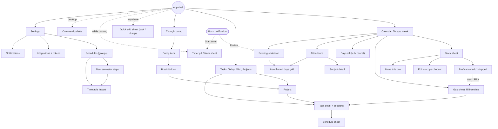

# 12 · UX flows

> Slice owner: UX flows (screen-by-screen). Written 2026-10-05 against `JOURNEY.md` D-001..D-010.
> Technical frontend is slice 09, parser/voice internals are slice 11, suggestion algorithms are slice 10. Where this document depends on them, the dependency is written down in section 2.

---

## 1. TL;DR

- **Shape of the app:** three sections exactly as D-001 says (Calendar, Tasks, Dump). On a phone they are a bottom tab bar; on the laptop they are a left rail. The **Calendar's Today view is the home screen** and the only place where planning happens.
- **Planning on the phone is "tap a gap", not "drag".** Every free gap on Today has a `+`; tapping it opens a **gap sheet** that lists tasks that fit (with "time back" suggestions from slice 10). Two taps to plan a task. Long-press drag is deferred, because touch drag on a scrolling timeline is the single biggest time sink in this whole app.
- **On the laptop, tasks sit beside the calendar** in a docked tray, and you drag them onto the timeline. Every drag has a keyboard equivalent (`p` to plan, arrow keys to move, `Shift+↓` to resize).
- **Exactly one guided ritual: the evening shutdown.** It exists because D-010 needs it for honest attendance. It has three short steps (classes pre-ticked as "went", open tasks, a glance at tomorrow) and the happy path is one tap from an Android notification or four taps in the app. Morning planning is *not* a ritual; it's just Today with free gaps highlighted.
- **Undo instead of "are you sure?".** Cancelling, moving, completing, switching timers and "letting go" of a dump item all happen instantly with an 8-second Undo toast. The only question the app ever asks mid-action is the D-005 "Prof cancelled / I skipped" split (which *is* the action) and the scope question for recurring edits.
- **Cancelling a class shows you the time you got back.** The block turns grey with diagonal stripes, the day's "free" total goes up, and the toast says "You got 1h back" with a "Fill it" button that opens the gap sheet for that slot.
- **No guilt anywhere.** No "overdue", no red badges, no streaks, no counts of unprocessed dump items. Unfinished tasks quietly go back to their list at the end of the day (exactly as the original idea describes). Attendance is shown as a range with a 75% line and a forecast ("can miss 2 more"), not as a warning siren.
- **Build order follows the roadmap**, with one correction: the **semester swap must exist (manually, without import) before the next KIIT semester starts in early 2027**, which is earlier than the roadmap's "Later" bucket for import.
- **Assumed phone: Android + Chrome.** If it's an iPhone, notification action buttons, the share target and home-screen icon shortcuts disappear, and every notification flow falls back to "tap to open". This is open decision #1.

---

## 2. Assumptions about other slices

| Slice | What this design assumes | What changes in the UX if the assumption is wrong |
|---|---|---|
| 01-recurrence | One occurrence can be cancelled, moved or edited on its own. "This and following" splits the series at a date. One-off overrides (a moved class) survive a later "this and following" edit. A date range can be bulk-cancelled. One-off extra occurrences can be added to a group. | Without per-occurrence overrides, the block sheet loses Move and cancel becomes series-wide, which breaks D-005. Without range cancel, "Days off" becomes N separate cancels. |
| 02-data-model | Task, Block and Session are separate (per backlog). A Block may reference a Task or be a group occurrence. A Session has `source` (manual, git, vscode, claude-code), optional note and commit refs. Occurrence attendance status is one of `scheduled`, `not_held` (prof cancelled), `skipped`, `confirmed_went`. Group has colour, active date range, attendance flag, attendance threshold, and attendance tracking start date. Subjects aggregate several weekly slots by a `subject` key (defaulted from the title). Dump items have `created_at`, `last_touched_at`, optional project, and a `processed_into` link. Tasks have an optional estimate and an optional planned date; due dates are optional and secondary. | If attendance status lives only on the series, the evening confirm can't work per day. If there is no subject key, the attendance view shows "DSA Mon 10:00" and "DSA Wed 14:00" as separate subjects. |
| 03-backend | Mutations return enough to render an inverse (or soft-delete with a restore endpoint), so an 8-second Undo is possible without a full command history. | Undo would need confirmation dialogs instead, adding a tap to every destructive action. |
| 04-database-and-sync | The client caches group rules and today's data, and renders Today instantly from cache. Writes are optimistic and queued while offline; the UI only shows a small sync-state icon and never shows a merge screen. | If writes can't be queued offline, cancel and quick add on campus Wi-Fi will fail visibly, and quick-add drafts must be kept locally until online. |
| 05-sessions-and-realtime | The timer is server-owned, one active timer per user. Starting a new one stops the old one server-side. Other devices learn about timer changes within seconds (or at least on focus). The server can send scheduled web push (shutdown reminder, block start, long-running timer). | Without server push, the evening shutdown reminder cannot exist on a PWA (service workers can't reliably schedule local notifications). |
| 06-auth-and-identity | Single-user login. Personal access tokens with narrow scopes, shown once, revocable, with a "last used" time. The VS Code extension can use a device-code style flow (extension shows a code, you confirm it in the app). The service worker can make authenticated calls (same-origin cookie or stored token) so notification actions work without opening the app. | Notification actions ("All went", "Stop") would have to open the app first, adding a tap. |
| 08-integrations | Git hook, VS Code and Claude Code create sessions tagged with their source. A repo is linked to a project by a `.planner` link file (name matching as fallback, per §5 risks). Commit-to-task mapping is decided in 08; this UX only needs "which project/task did this land on" and a way to reassign. | If mapping is ambiguous, the "Wrong task" fix-up action in notifications and session history becomes more important. |
| 09-frontend | Installable PWA. On Android Chrome: web push with up to two action buttons, Web Share Target, and manifest `shortcuts` (long-press the home-screen icon). A drag library with a keyboard sensor exists (e.g. dnd-kit). Day view on mobile, Day and Week view on desktop. | On iOS: push only after installing to the home screen (iOS 16.4+), no custom action buttons, no share target, no icon shortcuts. Every action in section 5.13 then needs an in-app fallback (already designed). |
| 10-scheduling-algorithms | Given a gap (start, end) the suggestion service returns ranked tasks with an adjusted estimate (estimate × multiplier), a fit label (fits / tight / too long) and a one-line reason. It runs fast enough to show when a sheet opens (under ~300 ms, or precomputed). | Without it, the gap sheet still works: it shows today's planned list and recent tasks, sorted by estimate. Suggestions are an enhancement, not a dependency. |
| 11-capture | The quick-add parser runs locally and synchronously (under ~50 ms per keystroke) and returns recognised tokens (date, time, duration, project, estimate) with their text spans. Voice uses the browser's speech recognition where available, with typed fallback. | If parsing is server-side, the live preview needs debouncing and a "parsing…" state; the chips appear 300 ms late. |
| 13-build-plan | Roadmap v0 → v3 as in JOURNEY §8. | Section 5.17 maps screens onto it. |

---

## 3. Three genuinely different approaches

| Approach | Pros | Cons | Solo-dev effort | Interview value |
|---|---|---|---|---|
| **A. One canvas** (calendar-centric single screen, like Amie or Structured): the timeline fills the screen; tasks live in a drawer on its edge; the dump is another drawer; everything is done by dragging onto the timeline. | Literally the vision ("tasks sit right beside it"). Fewest navigations. Very strong visual demo. | On a 360 px phone, timeline + task drawer + dump drawer fight for space. Project management and dump processing get squeezed into drawers. It front-loads the hardest interaction (touch drag on a scrolling, zoomable timeline). Hard to ship in pieces. | **High.** Most of the effort is in gesture handling and layout states that are not features. | High "wow" in a demo, but the explanation is mostly about gesture bugs. Risk of a half-finished showpiece. |
| **B. Three-tab app** (D-001 mapped 1:1 to tabs): Calendar, Tasks, Dump are self-contained screens; cross-section actions happen through sheets ("Plan this task" opens a time picker). | Simplest mental model and routing. Each tab ships on its own, matching roadmap v0 → v1. Easy to make accessible. Easy to explain. | Planning means hopping between tabs; calendar and tasks are never visible together on a phone. Can feel like three small apps glued together. Nothing about it is distinctive. | **Low.** | Medium. Clean, but generic. |
| **C. Ritual-driven guided flows** (Sunsama-style): the app opens into "Plan your day" in the morning and "Shut down" in the evening; the rituals are step-by-step screens, and the free-form screens are secondary. | Strong behaviour change. Good fit for brain fog: the app leads, you follow. A great story ("I designed for habits, not features"). | Rituals become chores; a skipped ritual becomes guilt, and guilt leads to abandoning the app. Lots of step screens that are used once a day. On a day you skip the morning ritual, the app has nothing to show you. | **Medium-high.** Many screens, each with its own state machine. | High as a story, but only if you can show it actually stuck for you. |

**What each one is really betting on.** A bets that *seeing* the day is the product, and everything else is a side panel. B bets that the three sections are separate jobs and that the cost of switching between them is small. C bets that the user won't plan on their own and has to be walked through it.

All three have something right. The vision is A's: clarity comes from seeing the fixed week with the free time visible, and the original idea's best moment is visual (a cancelled class turning into striped free time). The build reality is B's: Atif is one person, the roadmap ships the calendar first (v0) and tasks second (v1), and tabs let each section stand alone. And one of C's rituals is not optional: D-010 only works if there's an evening moment where classes get confirmed, so at least one guided flow has to exist and has to be short.

What fails in each when taken pure: A fails on the phone and on the schedule. B fails at the exact moment the app is meant to shine (planning the day), because "go to Tasks, pick a task, tap Plan, pick a time" is four steps across two screens. C fails on bad days, and bad days are the days this app is for.

---

## 4. Recommendation

**Use B's skeleton, put A's planning experience inside the Calendar tab, and take exactly one ritual from C.**

Concretely:

1. **Three sections, as tabs on mobile and a rail on desktop.** This is D-001, made visible. Settings and Attendance are not sections; they are reached from the Calendar header (Attendance) and from a gear (Settings).
2. **Today is home.** The app opens on the Calendar tab, Today view. The header says how many classes there are and how much free time is left ("4 classes · 3h 15m free"). This one line is the "clarity of the day's structure" that the whole idea started from.
3. **Planning happens on Today, not in Tasks.** On mobile, every free gap is tappable and opens a gap sheet that lists tasks that fit. On desktop, the task list is docked to the right of the timeline (the vision's "right beside it") and you drag. Tasks can still be planned from the Tasks tab through a schedule sheet, but that's the secondary path.
4. **One ritual: the evening shutdown.** It's short (three steps, under a minute), it can be completed from a notification, and skipping it has no penalty other than attendance staying a range. Morning planning is just Today; there is no morning wizard.
5. **Undo, not confirmation.** Every destructive action is instant and reversible for 8 seconds.

### The strongest argument against it

The person this is built for has brain fog and procrastinates. A Today screen that waits for him to tap a gap assumes he's already in a planning mood, and that is exactly the assumption that fails on a bad morning. Sunsama's whole product is built around the opposite view: a guided daily planning flow that walks you through reviewing yesterday, choosing today's tasks, prioritising, and timeboxing, because the structure itself is what gets people to plan. By refusing a morning ritual, this design keeps the low-motivation morning unsolved and only fixes the evening, which is the part that serves the *data* (attendance), not the *person*. Put bluntly: the evening ritual protects the database; a morning ritual would protect Atif's day. On top of that, on a phone the tabs mean tasks and calendar are never on screen together, which is a step away from the original vision.

That's a real argument. My answer is that a mandatory morning ritual turns into a thing to feel bad about skipping, and the first weeks of dogfooding are when an app gets abandoned. A passive Today that's useful at a glance (fixed blocks, free time total, "2 ideas" on each gap) gives the clarity without asking for anything. But I can't prove this in advance, so here is the measurable condition.

### When to switch

During the two-week v1/v2 dogfood, count mornings where Atif opened the app before noon and created **zero** blocks (the server can report this from block `created_at` times and app-open events). **If that happens on 4 or more of 10 weekdays, add a guided morning flow.** It's cheap at that point because every piece already exists: the shutdown's "glance at tomorrow" step, the gap sheet, and the suggestion list. The morning flow would be those three components in a sequence: "Here's your day → here are your gaps → pick one task for each gap you want to use → done."

The opposite switch is also worth watching: if on desktop he never opens the Tasks section except through the tray, merge the tray and the Tasks section on desktop and drop the rail item (approach A on desktop only).

---

## 5. Implementation walkthrough

### 5.0 Global patterns (used by every flow)

#### Navigation shell

**Mobile (Android, ~360–412 px wide).** Bottom tab bar with three tabs. A floating `+` button for quick add. A timer pill that appears above the tab bar only while a timer runs.

```
┌────────────────────────────────────┐
│ ‹  Mon 6 Oct  ›       ⟳  [Att] [⚙] │  header: day nav, sync state,
│ 4 classes · 3h 15m free            │  attendance, settings
│ M  T  W  T  F  S  S                │  week strip (load per day)
│ ▆  ▅  ▇  ▃  ▅  ·  ·                │
├────────────────────────────────────┤
│                                    │
│          (section content)         │
│                                    │
│                              ╭───╮ │
│                              │ + │ │  quick add (long-press: voice dump)
│                              ╰───╯ │
├────────────────────────────────────┤
│ ● DSA practice      0:23:14    [■] │  timer pill (only while running)
├────────────────────────────────────┤
│  Calendar  │   Tasks    │   Dump    │  three sections (D-001)
└────────────────────────────────────┘
```

**Desktop (laptop, ≥ 1024 px).** Left rail with the three sections and the gear at the bottom. Top bar with the running timer and a command palette. On the Calendar section, the right side holds the docked task tray.

```
┌──────┬──────────────────────────────────────────────────────────┬────────────────────────┐
│ CAL  │ ‹ Today · Mon 6 Oct ›  [Day|Week]   3h 15m free   ⟳       │ ● DSA practice 0:23 [■]│
│ ──── ├──────────────────────────────────────────────────────────┼────────────────────────┤
│ TASK │                                                          │ Tasks           [n] +  │
│ ──── │                 (timeline: day or week)                  │ ▾ Today (3)            │
│ DUMP │                                                          │ ▾ From yesterday (1)   │
│      │                                                          │ ▸ Misc (8)             │
│      │                                                          │ ▸ Projects             │
│      │                                                          │                        │
│ [⚙]  │                                                          │ Ctrl+K  commands       │
└──────┴──────────────────────────────────────────────────────────┴────────────────────────┘
```

The tray can be collapsed with `]`. When the window is narrower than ~1024 px the tray becomes an overlay toggled by the same key.

#### The four reusable UI pieces

Almost every flow is built from four pieces, which keeps the build small:

1. **Sheet** (mobile bottom sheet / desktop popover anchored to the thing you clicked). Block sheet, gap sheet, schedule sheet, task sheet.
2. **Toast with Undo** (bottom on mobile above the tab bar, bottom-left on desktop). 8 seconds, pauses while hovered or focused, one per action, newest replaces oldest. `Ctrl+Z` on desktop undoes the last toast's action even after it disappears (one level).
3. **Scope chooser** (only for edits to recurring blocks): "Only this one / This and following / Every one".
4. **Step sheet** (shutdown, semester swap, import): a full-height sheet with numbered steps and a persistent "Done"/"Next" button in the thumb zone.

#### Global states

| State | What the user sees | Notes |
|---|---|---|
| First load ever | Skeleton timeline (hour lines, no blocks), then content. | Only once per device. |
| Normal load | Today renders immediately from cache (group rules are deterministic, so occurrences can be expanded locally). A thin progress line at the top while fresh data arrives. | No spinners over content. |
| Offline | Small cloud-with-slash icon in the header. Tapping it says "You're offline. Changes are saved here and will sync when you're back." Everything that writes still works and shows instantly. | KIIT campus Wi-Fi is the realistic case. Integration screens and import "copy prompt" still work; token creation shows "Needs a connection". |
| Sync failed | Icon turns to a warning triangle; tapping it lists what didn't sync with "Retry". Typed text is never lost. | Quick-add and dump drafts are also kept in local storage until saved. |
| Server error on an action | Inline under the thing that failed: "Couldn't save. Retry". Never a modal. | |
| Empty | Each screen has one sentence and one button (listed per flow). | No illustrations needed; tone does the work. |

#### Desktop keyboard map

Single-key shortcuts work only when focus is not in a text field. `?` shows this list as an overlay.

| Key | Action |
|---|---|
| `n` | Quick add (task) |
| `d` | Quick add (dump) |
| `1` / `2` / `3` | Calendar / Tasks / Dump |
| `t` | Jump to today |
| `←` / `→` (or `h` / `l`) | Previous / next day (week in week view) |
| `v` | Toggle Day / Week |
| `j` / `k` | Move selection down / up (blocks on the timeline, rows in lists) |
| `Enter` | Open selected item's sheet |
| `p` | Plan selected task (opens schedule popover with free slots) |
| `s` | Start timer on selected task; if nothing is selected, stop the running timer |
| `x` | Complete selected task |
| `c` | Cancel selected block (then `1` = Prof cancelled, `2` = I skipped) |
| `m` | Move mode on selected block: `↑`/`↓` 15 min, `Shift+←/→` one day, `Enter` to drop, `Esc` to abort |
| `Shift+↑` / `Shift+↓` | Shrink / grow selected block by 15 min |
| `e` | Edit selected item |
| `]` | Show / hide the task tray |
| `Ctrl+K` | Command palette ("cancel next class", "start DSA practice", "attendance", "new semester") |
| `Ctrl+Z` | Undo last action |
| `Ctrl+Enter` | Save in multi-line fields (dump, breakdown, session note) |
| `Esc` | Close sheet / clear selection / abort drag |

`Ctrl+N`, `Ctrl+T`, `Ctrl+W` are deliberately avoided because the browser owns them. A PWA can't register a system-wide hotkey, so for capture from anywhere on the laptop, bind a window-manager key (Hyprland or any WM) to open the installed app at `/?add=task` or `/?add=dump`. This is the PWA equivalent of Things 3's Quick Entry on `Ctrl+Space`.

---

### 5.1 First run / onboarding

**Goal:** see your real week within about three minutes, and never face a blank calendar.

**Screens (mobile):**

```
 Screen 1                              Screen 2 (manual path)
┌────────────────────────────────────┐ ┌────────────────────────────────────┐
│                                    │ │ ‹  Your classes             1 of 2 │
│  Let's put your week in.           │ │                                    │
│                                    │ │ Name   [ DSA                     ] │
│  Your classes and routines show    │ │ When   Mon  10:00 – 11:00     [×]  │
│  up every week by themselves, so   │ │        Wed  14:00 – 15:00     [×]  │
│  you only set them up once.        │ │        [+ another day/time]        │
│                                    │ │ Room   [ C-204 ]   (optional)      │
│ ┌────────────────────────────────┐ │ │                                    │
│ │ Add my classes                 │ │ │ [ Save, add next class ]           │
│ │ About 3 minutes                │ │ │                                    │
│ └────────────────────────────────┘ │ │ Your week so far                   │
│ ┌────────────────────────────────┐ │ │ Mon ▮▮▮  Tue ▮▮  Wed ▮▮▮           │
│ │ Import from my timetable       │ │ │ Thu ▮▮   Fri ▮▮▮                   │
│ │ Uses any AI chat you like      │ │ │ DSA · OS · COA · Maths · DM        │
│ └────────────────────────────────┘ │ │                                    │
│   Skip, start with an empty week   │ │                [ That's all → ]    │
└────────────────────────────────────┘ └────────────────────────────────────┘
```

On "Add my classes", the app silently creates a group called **Classes** with attendance on, a colour, and an active range from today to a default semester end (today + 4 months, editable later; the group settings show "Ends 2 Feb 2027 · change"). The user is not asked about groups at all on first run; the concept is introduced later when they add a second group or swap semesters.

The "When" rows default to the same time as the previous row, because many subjects repeat at one time. Typing a subject name that already exists offers to add a slot to it instead of creating a duplicate.

```
 Screen 3 (optional)                   Screen 4: landing on Today
┌────────────────────────────────────┐ ┌────────────────────────────────────┐
│ ‹  Anything else that repeats?     │ │ ‹  Mon 6 Oct  ›          [Att] [⚙] │
│                                    │ │ 4 classes · 3h 15m free            │
│ [+ Evening run ] [+ Gym ]          │ │ ────────────────────────────────── │
│ [+ Writing    ] [+ Something else ]│ │  9:00 ┃ OS · C-204               ┃ │
│                                    │ │ 10:00 ┃ DSA · C-204              ┃ │
│ Evening run                        │ │ 11:00 ┆ free · 1h 30m          + ┆ │
│ Every day  18:00 – 18:45           │ │ ...                                │
│ [ Add ]                            │ │ ────────────────────────────────── │
│                                    │ │ Anything on your mind right now?   │
│                                    │ │ Put it down so you don't have to   │
│                                    │ │ carry it.        [ Empty my head ] │
│              [ Done ]              │ │                                    │
└────────────────────────────────────┘ └────────────────────────────────────┘
```

"Empty my head" opens a multi-line field: one line per thing, and each line becomes a dump item (or a task if it parses as one, e.g. "mail TPO tomorrow"). This is the onboarding moment that speaks to the original reason for the app: getting things out of your head so you stop fearing you'll forget them.

**Desktop variant.** Screen 2 becomes a week grid. Click-drag on the grid to draw a slot, type the subject, press `Enter`. `Alt`-drag an existing slot to copy it to another day. Names autocomplete. A typical 20-slot timetable takes about 20 drags.

**Notification permission is not asked during onboarding.** It's asked in context the first time it matters: after the first evening the app is used ("Want a nudge at 9:00 pm to wrap up the day? [Turn on]"). On iOS the app first explains "Add to Home Screen" because push only works for installed web apps there.

**Tap counts.** Manual path: ~4 taps + typing per subject, plus 2 per extra slot. Six subjects with 3–4 slots each: ~50 taps, about 3 minutes. Import path: see 5.10.

**States.** Offline during onboarding: everything works locally and syncs later. If the user quits midway, the classes entered so far are saved; next launch lands on Today with a small card "Add the rest of your classes" that disappears once dismissed. Re-running onboarding is not a thing; Settings → Schedules does the same job.

---

### 5.2 Morning plan (Today, free gaps, "time back" suggestions)

There is no wizard. Opening the app in the morning *is* the morning plan.

**Mobile Today:**

```
┌────────────────────────────────────┐
│ ‹  Mon 6 Oct  ›       ⟳  [Att] [⚙] │
│ 4 classes · 3h 15m free            │
│ M  T  W  T  F  S  S                │
├────────────────────────────────────┤
│  9:00 ┃ OS                C-204   ┃│
│ 10:00 ┃ DSA               C-204   ┃│
│ 11:00 ┆ free · 1h 30m   2 ideas + ┆│  dashed outline = free gap
│ 12:00 ┆                           ┆│
│ 12:30 ┃ COA ////////////////////  ┃│  cancelled: grey + stripes
│       ┃ //// Prof cancelled ///// ┃│
│ 13:30 ┆ free · 30m                ┆│
│ 14:00 ┃ ○ DSA practice      ▶     ┃│  planned task block
│ 15:00 ┃ Maths             C-112   ┃│
│ ──────┼── now 15:20 ───────────────│  "now" line
│ 16:00 ┆ free · 2h               + ┆│
│ 18:00 ┃ Evening run               ┃│
└────────────────────────────────────┘
```

Gaps shorter than 20 minutes are not drawn as gaps (setting). The "day" is bounded by a waking window (default 8:00–22:00, setting) so midnight-to-8 isn't counted as free time. Past gaps are not shown; only the remaining free time counts in the header after "now".

**Gap sheet (tap a gap's `+`):**

```
┌────────────────────────────────────┐
│ Free 11:00 – 12:30 · 1h 30m        │
│                                    │
│ Fits                               │
│ ○ DSA practice        1h  (~1h15) +│  estimate × your multiplier
│ ○ Read OS ch. 4            45m    +│
│ Tight                              │
│ ○ Tasks app: login page 1h30 (~2h)+│
│ Planned for today, no time yet     │
│ ○ Mail TPO about internship       +│
│ From yesterday                     │
│ ○ Fix resume bullet points        +│
│                                    │
│ [ Search all tasks ]               │
│ [ Just block it as "Study" ]       │
└────────────────────────────────────┘
```

Tapping `+` creates a block at the gap's start, sized to the adjusted estimate (capped at the gap), and shows a toast: "Planned 11:00–12:15. [Adjust] [Undo]". **Two taps** from Today to a planned block.

The "Fits / Tight" grouping and the "~1h15" adjusted estimate come from slice 10. The display rule for the multiplier is soft: it shows the adjusted figure in brackets without explaining it inline; tapping it explains "You usually take about 1.25× your estimate for DSA tasks." It never says "you underestimate".

"From yesterday" appears for one day only, holding tasks that were planned yesterday and not finished. After that they're simply in their lists. There is no "overdue" pile (see 5.4).

**Desktop Today:** same timeline, wider, with the tray on the right. Gaps show their best suggestion as faint text inside the dashed outline ("fits: DSA practice · 1h"), and clicking it plans it (one click). Dragging from the tray works anywhere (5.4).

**"Time back" suggestions** appear in three places: the gap sheet (always), the cancel toast (5.5), and, on desktop, the faint text inside a gap. Never as a notification, never as auto-placed ghost blocks. Suggestions are offers.

**Optional morning summary notification** (default off): "Tuesday: 3 classes, first at 9:00. 4h 30m free." Tapping opens Today.

**States.**
- *Empty day (weekend, no groups active):* "Nothing fixed today. 14h free." The gaps still work.
- *Empty task list:* the gap sheet says "Your list is empty. [Add a task]" and still offers "Just block it".
- *No estimates on any task:* gap sheet groups everything under "From your list" with no fit labels.
- *Suggestion service slow or down:* sheet opens with the plain list immediately; suggestions fade in or never appear. No spinner blocks the sheet.

---

### 5.3 Quick add (from anywhere, live parse preview)

**Entry points:** the `+` button on every mobile tab; `n` (task) and `d` (dump) on desktop; the WM hotkey route on Linux; the Android home-screen icon long-press shortcuts ("Add task", "Dump a thought"); and Android's share sheet (shared text or links land in the dump).

**Mobile:**

```
┌────────────────────────────────────┐
│ ( Task | Dump )                 ×  │
│ ┌────────────────────────────────┐ │
│ │ dsa sheet q5-10 tmrw 4pm 1h    │ │
│ │ #dsa                           │ │
│ └────────────────────────────────┘ │
│ DSA sheet q5–10                    │  ← cleaned title
│ [Tue 7 Oct, 4:00 pm ×] [1h ×]      │  ← parsed chips (tap to edit,
│ [Project: DSA ×]                   │     × to drop the token)
│ Plans Tue 4:00–5:00 pm (free).     │  ← consequence in plain words
│                                    │
│ [mic]                     [ Add ]  │
├────────────────────────────────────┤
│ q w e r t y u i o p                │
└────────────────────────────────────┘
```

**Desktop:** a centred popover with the same layout. `Enter` saves and closes. `Shift+Enter` saves and keeps it open for the next item (for brain-dump bursts). `Tab` toggles Task/Dump. `Esc` closes and keeps the draft.

**Design choices:**

- **Chips below a plain input, not inline highlighting.** Todoist highlights recognised dates, projects and labels inside the text field as you type. That's lovely, but it needs a rich-text input (`contenteditable`), which is a well-known swamp of cursor and IME bugs, especially with Android keyboards. A plain `<input>` plus chips underneath gives the same feedback ("the app understood these bits") at a fraction of the cost. Each chip shows what was understood; tapping `×` on a chip puts that text back into the title (e.g. a task literally called "Read 1984" shouldn't become a time).
- **A time means a block.** If the text contains a time ("4pm"), the task is created *and* planned as a block. If it contains only a date ("tmrw"), the task gets a planned date and appears in that day's "Planned for today" list without a time. This is open decision #3.
- **The consequence line** ("Plans Tue 4:00–5:00 pm (free)" or "…overlaps Maths") is the safety net for parser mistakes. It tells you what will happen before you press Add.
- **Unknown project** (`#newthing`) shows the chip as "New project: newthing" and creates it on save; a close match ("#dsaa") shows "Project: DSA?" with the question mark.
- **Dump mode** turns parsing off except for `#project`. Thoughts are not tasks; parsing "maybe build X next week" into a dated task would be wrong.
- **Voice:** the mic button fills the input with the transcript, which stays editable and is parsed like typed text. Long-pressing the `+` button opens dump mode with the mic already listening.

**Keystrokes / taps.**
- Desktop task: `n` + text + `Enter`.
- Mobile task: tap `+`, type, tap Add = 2 taps + typing.
- Mobile voice dump: long-press `+`, speak, tap Add = 2 taps.
- From the Android home screen: long-press icon → "Dump a thought" → type → Add = 3 taps, without passing through the app's Today screen.

**States.** Offline: saves locally, chip parsing still works (local parser). Save failed: the sheet stays open with the text intact and "Couldn't save. Retry". Closing with text in it keeps a draft that reappears next time (`Esc` on desktop, swipe-down on mobile). Parser unsure ("at 5" with no am/pm): the chip shows the guess ("5:00 pm?") with a question mark; 11 owns the rule.

---

### 5.4 Drag to calendar, schedule, resize, and what happens when a block ends

#### Desktop: drag from the tray

1. Grab a task in the tray. The timeline highlights free gaps, and a ghost block follows the cursor, sized to the adjusted estimate (or 30 min if no estimate), snapping to 15 minutes.
2. The ghost shows a label: "11:00–12:15 · fits", "…· overlaps OS", or "…· in the past".
3. Drop: a block is created. Toast: "Planned 11:00–12:15. [Undo]".
4. `Esc` mid-drag cancels.

Dropping on a cancelled class is normal (that's the "time back" use). Dropping on an active class is allowed, but both blocks render side by side at half width with the overlap shown; nothing is blocked. Dropping into the past creates a past block and the toast offers "[Log it as time worked]", which creates a session for the same range (useful when you forgot the timer). This is open decision #12.

**Resize:** drag the bottom edge; a tooltip shows "2:00–3:15 pm (1h 15m)". Resizing a task block changes the plan only; it doesn't silently change the task's estimate.

**Move:** drag the block body. Moving a task block is just a move. Moving a class occurrence moves *only that occurrence* (see 5.5).

**Keyboard equivalent:** select a task in the tray (`j`/`k`), press `p` → a popover lists free slots today and tomorrow (same data as the mobile schedule sheet) → arrow to one → `Enter`. Select a block → `m` → arrows → `Enter`. `Shift+↓` grows it by 15 minutes.

#### Mobile: two options compared

| | Long-press drag on the timeline | Gap sheet + schedule sheet (tap-based) |
|---|---|---|
| Taps to plan | 1 long gesture, but you need the task visible next to the timeline (a tray), which doesn't fit well at 360 px | 2 (gap `+`, task `+`) or 3 from a task (row → Plan → slot) |
| Precision | Fiddly near the screen edges; needs auto-scroll while dragging | Exact; slots are pre-computed |
| Accessibility | Poor without a separate keyboard/switch path | Good by default |
| Build effort | High: long-press vs scroll conflicts, auto-scroll, haptics, drop previews, Android back gesture conflicts | Low: two sheets, reuses 10's suggestions |
| Feels like | The vision's "drag and drop" | A form, but a fast one |

**Recommendation: ship the tap-based path in v1; add long-press drag of *existing* blocks (to move them) in v2 or later, and only if he misses it.** Dragging tasks from a tray on a phone may never be worth it.

**Schedule sheet (task-first path, from any task row → Plan):**

```
┌────────────────────────────────────┐
│ Plan "DSA practice" · 1h (~1h15)   │
│                                    │
│ Today                              │
│ [ 16:00–18:00 free ]               │
│ Tomorrow                           │
│ [ 9:00–10:00 ] [ 14:00–17:00 ]     │
│ Wed 8 Oct                          │
│ [ 11:00–13:00 ]                    │
│                                    │
│ [ Pick a time… ]                   │
│ [ Today, no fixed time ]           │
└────────────────────────────────────┘
```

"Today, no fixed time" sets only the planned date; the task shows up in Today's "Planned for today" list and in every gap sheet that day. "Pick a time…" opens a day-and-time picker for when none of the gaps suit.

**Mobile resize:** in the block sheet, a duration stepper `[–15] 1h 15m [+15]`. No drag handles.

#### When a block ends and the task isn't ticked

This follows the original idea exactly: *"if the time is completed and it still isn't ticked then it goes back to its place unticked and clicking on it would show all the time and sessions spent on it."*

- **On the timeline:** the block stays as history. After its end time it drops to lower contrast. If the task got done, the block shows a tick; if not, it keeps the empty circle.
- **In the task list:** while planned, the row shows a "2–3 pm" badge. After the block ends, the badge goes away and the row shows plain facts instead: "45m logged". The task is in its original place (its project, or Misc), unticked.
- **If a timer is running on that task:** nothing changes. The timer keeps going. If block-start notifications are on, one quiet notification at the block's end says "Planned time for DSA practice is up. [Keep going] [Stop]". Otherwise nothing happens.
- **At day rollover:** tasks planned for today and not done lose today's planned date and stay in their list. For one day they also appear under "From yesterday" in gap sheets and the tray. There is no overdue state at all.
- **When a task is completed**, it's struck through where it lives (project or Misc), and at the end of the day it collapses into a "Done (5)" fold at the bottom of that list.

**Task detail (tap a task anywhere):**

```
┌────────────────────────────────────┐
│ ‹                              ⋯   │
│ ○ DSA practice                     │
│ DSA · estimate 1h (usually ~1h15)  │
│ 3h 05m over 4 sessions             │
│                                    │
│ [ ▶ Start ]  [ Plan ]  [ ✓ Done ]  │
│                                    │
│ Sessions                           │
│ Today    14:02–14:47   45m  manual │
│   "q5–q8 done, stuck on q9"        │
│ Sat      20:10–21:30  1h20  git    │
│   a1b2c3d fix two-pointer edge case│
│ Thu      19:00–19:30   30m  manual │
│ [+ Add a session by hand]          │
│                                    │
│ Planned                            │
│ Today    14:00–15:00  (ended)      │
│ Notes                              │
│ [ … ]                              │
└────────────────────────────────────┘
```

---

### 5.5 Cancel, move, edit "this and following", undo, days off, and the "time back" moment

#### Cancelling one class (D-005)

**Block sheet for a class in a group with attendance on:**

```
┌────────────────────────────────────┐
│ COA · 12:30 – 13:30 · C-305        │
│ Classes · every Mon, Thu           │
│                                    │
│ Not happening today?               │
│ ┌──────────────┐ ┌───────────────┐ │
│ │ Prof         │ │ I skipped     │ │
│ │ cancelled    │ │               │ │
│ │ (or holiday) │ │               │ │
│ └──────────────┘ └───────────────┘ │
│                                    │
│ [ Move this one ]  [ Edit ]        │
└────────────────────────────────────┘
```

The two buttons are the cancel action. There's no separate "Cancel" button followed by a question; the D-005 question is the first thing in the sheet. **Two taps** from Today: tap the block, tap the reason.

For a future class, "I skipped" reads "I'll skip" (same status). For a class in a group without attendance (the evening run), the sheet shows a single "Cancel this one" button: also two taps.

#### How cancelled blocks look

- Grey fill with diagonal stripes, text dimmed but readable, and a **text label** ("Prof cancelled" or "Skipped") so the state never depends on colour or pattern alone.
- The block keeps its place and size. It's not deleted (exactly as in the original idea).
- Task blocks placed over it render on top at about 85% width, aligned right, so a strip of the stripes stays visible on the left. You can see both "this was a class" and "now it's DSA practice".
- Tapping a cancelled block shows: "Prof cancelled · [Change to: I skipped] [Restore class]".

#### The "you got time back" moment

Right after cancelling:

1. The stripes slide in (about 200 ms; instant if reduced motion is on).
2. The header's free total ticks up: "3h 15m free" → "4h 15m free", with a brief highlight.
3. The block shows "1h back" in its corner until something is planned over it.
4. Toast: **"You got 1h back. [Fill it] [Undo]"**.

"Fill it" opens the gap sheet for exactly that slot (merged with any adjacent free time; a cancelled 12:30 class next to a free 11:00–12:30 gap offers 11:00–13:30). That's the "time back" suggestion from the backlog, at the moment it's most useful.

If the class was cancelled while it was in progress, the time back is "now until the end". If it's already over (marking it later), there's no "time back" toast, only "Marked as skipped. [Undo]".

No confetti, no sounds. The point is that freed time becomes *visible*, which is the feeling the idea started with.

#### Moving one occurrence

- **Desktop:** drag the class block. On drop: toast "Moved OS to 11:00, just this once. [Undo] [Move all following]". No dialog. The bigger scope is offered, not asked.
- **Mobile:** block sheet → "Move this one" → picker with day chips and time slots (free slots first) → tap. Same toast.
- **Keyboard:** select block, `m`, arrows, `Enter`.

#### Editing "this and following"

Edit sheet fields: name, time, room, days, colour (group). When saving an edit to a recurring occurrence, the scope chooser appears:

```
┌────────────────────────────────────┐
│ Change which classes?              │
│                                    │
│ (•) Only Tue 7 Oct                 │
│ ( ) Tue 7 Oct and after            │
│ ( ) Every OS class                 │
│                                    │
│ "Tue 7 Oct and after" changes 18   │
│ classes from 10:00 to 11:00.       │
│ 2 classes you already moved keep   │
│ their own times. Past attendance   │
│ isn't touched.                     │
│                                    │
│            [ Save ]                │
└────────────────────────────────────┘
```

The preview sentence is the important part: it says how many occurrences change and what happens to exceptions (the rule comes from slice 01). Default is always the smallest scope. Room changes mid-semester are the common "and after" case; this can be revisited if he keeps choosing it.

#### Days off (bulk cancel)

KIIT has holiday breaks (for example around the Puja holidays in October), and the backlog already mentions "a holiday import that bulk-cancels classes". A manual version is cheap and needed sooner:

Calendar header menu → "Days off…" → pick a date range → which groups (Classes ticked, Evening run unticked) → reason: "Holiday (not held)" or "I'm away (skipped)" → preview "Cancels 22 classes from 17 to 25 Oct." → Apply → toast with Undo.

For attendance this is the same as "Prof cancelled" (not held) or "I skipped", applied in bulk.

#### Undo

- Every action in this section shows the toast with Undo for 8 seconds; `Ctrl+Z` works for one level after that on desktop.
- After the toast is gone, everything is still reversible by hand: "Restore class", "Change to…", moving the block back. Nothing here is a permanent delete.

**States.** Offline: cancel works, the block shows the stripes immediately and a tiny "not synced" dot until it syncs. Edit scope preview offline: shows "Changes this and later classes" without the count if the count can't be computed locally.

---

### 5.6 Timer: start/stop, visible everywhere, switching, notes, history

**Starting:**

| From | Mobile | Desktop |
|---|---|---|
| Task row | Tap ▶ on the row (1 tap) | Click ▶ or select + `s` |
| Task detail | "▶ Start" (1 tap after opening) | Same |
| Planned task block | Tap block → "▶ Start" (2 taps) | Click the ▶ on the block (1) |
| Notification at block start | "▶ Start timer" action (1 tap, app doesn't open) | n/a (desktop notification can carry the same action if push is enabled on the laptop) |
| Integration | Automatic (git, VS Code Start button, Claude Code first prompt per D-006) | Same |

Class blocks have no timer; sessions are for tasks.

**Running timer, visible everywhere:**
- Mobile: the pill above the tab bar on every tab ("● DSA practice 0:23:14 [■]"). The active block on Today has a pulsing left edge and the task row shows elapsed time.
- Desktop: the top-right chip, plus the browser tab / window title "0:23 · DSA practice", so it's visible from other windows.
- Android, optional (default on): a silent notification "Timing DSA practice · since 2:02 pm [Stop]". It shows the start time, not a ticking clock, because a web notification can't update itself every second.

**Stopping:** tap ■ on the pill (1 tap). The pill turns into a small card for 10 seconds:

```
┌────────────────────────────────────┐
│ Stopped · 45m on DSA practice      │
│ [ What did you get done? (opt.)  ] │
│ [ Mark task done ]        [Undo]   │
└────────────────────────────────────┘
```

Notes are optional and never block. A 7–40 character hex string or a GitHub/GitLab commit URL typed into the note is shown as a commit chip. With the git hook connected (v3), commits made during the session attach themselves.

**Switching tasks:** start another task's timer while one is running → the first stops, the second starts, toast "Stopped DSA practice (45m). Started Mail TPO. [Undo]". No dialog. From the expanded pill there's also "Switch to…" with a searchable list, recent tasks first.

**Forgot to stop:** after 3 hours (setting) or at midnight, a notification: "Still on DSA practice? 3h 05m so far. [Keep going] [Stop now]". If editor heartbeats show the last activity, the second action becomes "[Stop at 5:40 pm]" (last activity time). The evening shutdown also shows a running timer as its first item. Any session can be edited in the task's history (start and end times, note, task).

**Integration-started sessions** (D-006): "Started timing Tasks app. From Claude Code in ~/programming/tasks. [Stop] [Wrong task]". "Wrong task" opens the switcher and moves the session.

**Session history** lives in task detail (wireframe in 5.4): total time, sessions grouped by day, each with time range, duration, source tag (manual, git, VS Code, Claude Code), note, and commit chips. Project detail shows the same per project with a simple per-week total. No charts in v1.

**States.** Timer started offline: shows immediately using the device clock, syncs later (04 decides how to reconcile). Timer started on the laptop, phone opened later: the pill appears on focus with the right elapsed time. Two devices stopping at once: whichever reaches the server first wins; the other shows the already-stopped state without an error.

---

### 5.7 Evening shutdown with attendance confirm (D-010)

**Trigger:** a notification at a user-set time (default 9:00 pm), only on days that had something to review, and only if the shutdown hasn't been done. On Today after the last class has ended, a quiet card also appears at the top: "Wrap up today · 1 min".

**Notification (Android):**

```
┌ Planner · 9:00 pm ─────────────────┐
│ Wrap up Monday?                    │
│ Today: OS, DSA, Maths. COA was     │
│ cancelled. Went to all three?      │
│ [ Yes, all ]          [ Review ]   │
└────────────────────────────────────┘
```

"Yes, all" confirms every class still marked "went" for today and doesn't open the app (1 tap). If there are unfinished planned tasks, they follow the default (back to their list) and the notification is replaced by "Done. 2 tasks went back to your list." "Review" opens the shutdown.

**In the app, three steps (mobile):**

```
 Step 1                                Step 2
┌────────────────────────────────────┐ ┌────────────────────────────────────┐
│ ×  Wrap up Monday           1 of 3 │ │ ×  Still open from today    2 of 3 │
│                                    │ │                                    │
│ Classes today                      │ │ ○ DSA practice                     │
│ Tap any you didn't go to.          │ │   planned 2–3 pm · 45m logged      │
│                                    │ │   [Tomorrow] [Back to list] [Done] │
│ [✓ Went   ] OS        9:00         │ │                                    │
│ [✓ Went   ] DSA      10:00         │ │ ○ Mail TPO about internship        │
│ [ Not held] COA      12:30         │ │   planned today                    │
│ [✓ Went   ] Maths    15:00         │ │   [Tomorrow] [Back to list] [Done] │
│                                    │ │                                    │
│ Tapping cycles: Went → Skipped.    │ │ Untouched ones go back to your     │
│ Long-press for "Not held".         │ │ list. Nothing is lost.             │
│                                    │ │                                    │
│          [ Looks right → ]         │ │       [ Leave the rest → ]         │
└────────────────────────────────────┘ └────────────────────────────────────┘

 Step 3
┌────────────────────────────────────┐
│ ×  Tomorrow, Tue 7 Oct      3 of 3 │
│                                    │
│ 3 classes · first at 9:00          │
│ 2 free gaps · 4h 30m               │
│                                    │
│ Want to set anything aside for it? │
│ (optional)                         │
│ ○ DSA practice           (moved) ✓ │
│ [+ Pick from your list ]           │
│                                    │
│         [ Done for today ]         │
│                                    │
│   That's the day. See you          │
│   tomorrow.                        │
└────────────────────────────────────┘
```

**Step 0 (only when needed):** if a timer is running: "Your timer on DSA practice is still running (3h 10m). [Stop now] [Stop at 6:40 pm] [Keep it running]".

**Rules:**
- Step 1 lists only classes from groups with attendance on, and only those whose start time has passed. A shutdown opened at 4 pm leaves the 5 pm lab unconfirmed ("not yet").
- Classes already cancelled during the day show their status and can still be changed.
- If no attendance classes happened today, step 1 is skipped.
- If there were no planned tasks, step 2 is skipped.
- Step 3 is always shown but is a single tap.
- The Sunsama shutdown has the same skeleton (review what got done, deal with what didn't, close the day with a boundary). This one drops the reflection-writing step to keep it under a minute; a one-line "note for today" can be a later addition if he wants a journal.

**Tap counts:** notification happy path = 1. In-app happy path = 3 or 4 (open, Looks right, Leave the rest, Done). With one skipped class: +1.

**Desktop:** the same three steps side by side in one wide panel, with keyboard: `j`/`k` through classes, `Space` to flip Went/Skipped, `Enter` to continue.

#### Days not confirmed (the backlog)

If shutdown is skipped, those days stay **unconfirmed**, and attendance shows a range (D-010). Next time the shutdown opens (or from the Attendance view), the first step becomes a grid:

```
┌────────────────────────────────────┐
│ ×  3 days to confirm               │
│                                    │
│          Thu 2   Fri 3   Mon 6     │
│ OS        ✓        ✓       ✓       │
│ DSA       ✓        ✗       ✓       │
│ COA       –        ✓       ✓       │
│ Maths     ✓        ✓       ✓       │
│                                    │
│ ✓ went  ✗ skipped  – not held      │
│ Tap a cell to change it.           │
│                                    │
│ [ Confirm these ]   [ Not now ]    │
└────────────────────────────────────┘
```

- The grid starts from what the app knows (cancellations made during those days) and pre-ticks the rest as "went", same as the daily step.
- "Not now" leaves them unconfirmed. The app never auto-confirms (open decision #6).
- Beyond 14 days the grid only shows the most recent 14 and a line: "Older days stay unconfirmed. You can review them in Attendance." This keeps the step from becoming a wall.
- The shutdown notification body mentions the backlog only as "(+2 earlier days)". There's no separate nag.

**States.** Offline: works fully; confirmation syncs later. Shutdown done on the phone, then the laptop shows the card: the card disappears on focus.

---

### 5.8 Thought dump: capture, aging, breakdown, "keep cooking"

**Capture** is in 5.3 (quick add in dump mode), plus a capture box at the top of the Dump tab and the Android share target.

**Dump tab (mobile):**

```
┌────────────────────────────────────┐
│ Dump                    [All ▾]    │  filter: All / General / a project
│ ┌────────────────────────────────┐ │
│ │ What's on your mind?      [mic]│ │
│ └────────────────────────────────┘ │
│ This week                          │
│ ▢ portfolio site with 3d hero      │
│   General · 2 days                 │
│ ▢ tasks app: ICS export?           │
│   Tasks app · 5 days               │
│ Simmering                          │
│ ▢ learn rust via advent of code    │
│   General · 3 weeks                │
│ Been a while                       │
│ ▢ hackathon idea: hostel mess app  │
│   General · 2 months         (dim) │
└────────────────────────────────────┘
```

**The aging signal** is grouping and wording, not alarms:
- "This week" (under 7 days), "Simmering" (7–30 days), "Been a while" (over 30 days). Old items are slightly dimmed, not reddened.
- No count badges on the tab. At most, a small dot on the Dump tab when something has crossed into "Been a while" and the tab hasn't been opened for 7 days. The dot clears when the tab is opened.
- An optional weekly notification (default off): "A few thoughts have been simmering for a month. Have a look when you're free." No action buttons, no numbers.

This is the "gentle aging signal, not a forced ritual" from the debates table (§4 #5).

**Dump item:**

```
┌────────────────────────────────────┐
│ ‹ Dump                         ⋯   │
│ learn rust via advent of code      │
│ General · added 21 days ago        │
│ ────────────────────────────────── │
│ 12 Sep  maybe only the first 10    │
│         days, they get hard after  │
│ [+ Add a thought]           [mic]  │
│ ────────────────────────────────── │
│ [ Break it down ]                  │
│ [ Keep cooking ]   [ Move to ▾ ]   │
│ [ Let go ]                         │
└────────────────────────────────────┘
```

- **Add a thought** appends a dated line (typed or voice). Adding a thought also counts as touching the item, so it moves back to "This week".
- **Keep cooking** means "I looked at this, I'm still thinking, leave it alone." It resets the item's age to "This week" without changing it. Toast: "Back to simmering. [Undo]". One tap.
- **Move to** changes General ↔ a project.
- **Let go** archives it (not delete). Toast: "Let go. It's in Archive if you want it back. [Undo]".

**Break it down:**

```
┌────────────────────────────────────┐
│ ×  Break it down                   │
│ Turn into:                         │
│ (•) Tasks in a project [Learning▾] │
│ ( ) A new project: [Learn Rust   ] │
│ ( ) Loose tasks (Misc)             │
│                                    │
│ One task per line:                 │
│ ┌────────────────────────────────┐ │
│ │ set up rust toolchain          │ │
│ │ AoC day 1–3 30m                │ │
│ │ notes on ownership             │ │
│ └────────────────────────────────┘ │
│ 3 tasks · "30m" read as estimate   │
│ This thought will be marked        │
│ "turned into tasks" and linked.    │
│                                    │
│        [ Create 3 tasks ]          │
└────────────────────────────────────┘
```

Each line goes through the quick-add parser (so "30m" becomes an estimate). The original dump item is kept, marked "Turned into 3 tasks in Learning", and links to them; it moves to the archive. A "Suggest a breakdown" button appears here only if an LLM provider is configured (backlog: AI breakdown is optional, behind a provider interface). It fills the text box; it never creates tasks by itself.

**Desktop:** the Dump section is two panes (list left, item right). `d` captures. `Ctrl+Enter` saves a thought. `b` = break down, `k` = keep cooking, `#` = move.

**Voice states.** Mic permission denied: "Mic is blocked. You can type instead, or allow it in your browser settings." Speech recognition not available (common on Firefox, and often on Brave or Chromium builds without Google's speech service): the mic button is hidden, not broken. Voice is mainly a phone feature. Recognition error mid-sentence: the transcript so far stays in the box.

**Empty state:** "Nothing here. When something's rattling around your head, drop it here and stop carrying it."

---

### 5.9 Semester swap (D-004)

**Entry:** Settings → Schedules → "New semester", and automatically as a card on Today seven days before the Classes group's end date: "Sem 3 classes end on 2 Dec. Set up next semester when you have the timetable. [Set up]".

**Step sheet (desktop shown; mobile is the same steps stacked):**

```
┌ New semester ────────────────────────────────────────────────────────────────┐
│  1 Wrap up old  ›  2 Add new  ›  3 Check clashes  ›  4 Confirm               │
├──────────────────────────────────────────────────────────────────────────────┤
│ Sem 3 Classes   active · 6 subjects · attendance on                          │
│                                                                              │
│ Last day of classes:  [ 2 Dec 2026 ▾ ]                                       │
│                                                                              │
│ After that date it's archived: past days still show these classes, and       │
│ attendance stays in the Attendance view. Nothing is deleted.                 │
│                                                                              │
│                                                               [ Next → ]     │
└──────────────────────────────────────────────────────────────────────────────┘
```

**Step 2: add new.** Three choices: "Import from my timetable" (goes to 5.10, then returns here), "Start from Sem 3 and edit" (copies the group with new dates; useful when only some slots change), or "Add classes myself" (the onboarding form). Name defaults to "Sem 4 Classes", colour defaults to the old group's colour, attendance on, start date defaults to the day after the old end date.

**Step 3: check clashes.**

```
┌ New semester ────────────────────────────────────────────────────────────────┐
│  1 Wrap up old  ›  2 Add new  ›  3 Check clashes  ›  4 Confirm               │
├──────────────────────────────────────────────────────────────────────────────┤
│        Mon         Tue         Wed         Thu              Fri              │
│ 17:00  ·           ·           ·           ┏ OS Lab ┓       ·                │
│ 18:00  Run         Run         Run         ┃OS Lab╳Run┃     Run              │
│ 19:00  ·           ·           ·           ┗━━━━━━━━┛       ·                │
│                                                                              │
│ 1 clash, every Thursday from 5 Jan                                           │
│ OS Lab (Thu 17:00–19:00) overlaps Evening run (daily 18:00–18:45)            │
│   ( ) Keep both, I'll sort it out on the day                                 │
│   (•) Skip the run on Thursdays                                              │
│   ( ) Move the run on Thursdays to [ 19:30 ▾ ]                               │
│                                                                              │
│ Only groups active in the new semester's dates are checked.                  │
│                                                           [ ← ] [ Next → ]   │
└──────────────────────────────────────────────────────────────────────────────┘
```

Clashes are grouped by pattern ("every Thursday"), not listed per date, so 15 Thursdays show up as one decision. Resolutions edit the *other* group (the run) with a dated rule, never the imported classes, because the timetable is the fixed thing. Overlaps between the old and new Classes groups appear only if their date ranges overlap (for example the user picked a new start date before the old end date); then the first option is "Move Sem 3's end date to 4 Jan".

**Step 4: confirm.** Summary: "Sem 3 Classes ends 2 Dec (attendance kept). Sem 4 Classes starts 5 Jan: 24 weekly classes. Evening run skips Thursdays from 5 Jan." → "Apply". Toast with Undo; also "Undo" stays available under Settings → Schedules → Sem 4 → "Undo setup" for 24 hours.

**Mobile:** the week grid in step 3 becomes a day-by-day list of only the days with clashes; the radio options are the same.

**States.** No other groups: step 3 says "No clashes" and is skipped automatically. Very many clashes (20+ patterns, usually a wrong import): "That's a lot of clashes. Something might be off with the imported times. [Back to the import preview]".

**Timing note for the build plan:** if KIIT's next semester starts in early 2027, this flow (at least the manual path: archive + add + clash check) is needed by late December 2026, which is earlier than the roadmap's "Later" for timetable import.

---

### 5.10 Timetable import preview (D-008)

**Step 1: get the prompt.**

```
┌────────────────────────────────────┐
│ ×  Import timetable         1 of 3 │
│                                    │
│ 1. Copy this prompt.               │
│    [ Copy prompt ]                 │
│                                    │
│ 2. Open any AI chat (ChatGPT,      │
│    Gemini, Claude…), paste the     │
│    prompt, and attach a screenshot │
│    or the text of your timetable.  │
│                                    │
│ 3. Copy everything it replies with │
│    and come back here.             │
│                                    │
│ Tip: one section's timetable at a  │
│ time works best.                   │
│                                    │
│      [ I have the result → ]       │
└────────────────────────────────────┘
```

The copied prompt contains the format spec and an example, and asks for a fenced JSON block (the exact format is 08's / 02's). "Copied" feedback replaces the button label for 2 seconds.

**Step 2: paste and validate (desktop shown):**

```
┌ Import timetable · 2 of 3 ──────────────────────────────────────────────────┐
│ Paste what the AI gave you                                                  │
│ ┌──────────────────────────────────────────────────────────────────────────┐│
│ │ Sure! Here's your timetable:                                             ││
│ │ ```json                                                                  ││
│ │ { "version": 1, "group": "Sem 4 Classes", "starts": "2027-01-05", ...    ││
│ └──────────────────────────────────────────────────────────────────────────┘│
│ ✓ Found 26 classes. (We ignored the chat text around the data.)             │
│                                                                             │
│ 2 things to fix before you can apply                                        │
│  · Class 14: "Thrusday" isn't a day. Use Thursday?            [ Fix ]       │
│  · Class 21 (DM): ends before it starts, 11:00–10:00.          [ Edit ]     │
│ 2 things to check                                                           │
│  · Starts 5 Jan 2025, which is in the past. Did you mean 2027? [ Use 2027 ]│
│  · Mon 10:00: OS and DSA overlap.                       [ Fine ] [ Edit ]   │
│                                                                             │
│ [ Copy a fix-up prompt for the AI ]                       [ Preview → ]     │
└─────────────────────────────────────────────────────────────────────────────┘
```

- **Lenient reading:** strip markdown fences and chat text around the first JSON block automatically and say so. LLMs almost always add prose.
- **Errors block Preview; warnings don't.** Errors are things that can't be applied (unknown day, end before start, missing time). Warnings are things that might be wrong (dates in the past, overlaps, a class at 3 am, a semester longer than 7 months).
- **Messages name the class, not a JSON path.** "Class 14 (COA)" rather than `$.classes[13].day`.
- **One-click fixes** for the obvious ones (typo days, swapped times, wrong year).
- **"Copy a fix-up prompt"** builds a second prompt containing the problems ("Fix these issues in the JSON you gave me: …") so the user can paste it back into the same chat. This uses the same zero-cost loop as D-008.
- **Unreadable input:** "We couldn't find timetable data in that. It might be cut off: check that you copied the whole reply, including the end." With a "Show what we read" disclosure for debugging.

**Step 3: preview.**

```
┌ Import timetable · 3 of 3 ──────────────────────────────────────────────────┐
│ Sem 4 Classes · 5 Jan – 30 Apr 2027 · 26 weekly classes   [Week ▾][List]    │
│ [✓] show my other schedules                                                 │
│        Mon            Tue            Wed            Thu            Fri      │
│  9:00  OS  C-204      DM  C-110      OS  C-204      ·              CN C-204 │
│ 10:00  DSA C-204 ⚠    ·              DSA C-204      SE  C-101      ·        │
│ 11:00  ·              CN  C-204      ·              ┏OS Lab ┓      DM C-110 │
│ ...                                                                         │
│                                                                             │
│ Tap any class to edit it before applying.                                   │
│ Group: [Sem 4 Classes]  Colour: [■ teal]  Attendance: [on]                  │
│                                                                             │
│ [ ← Back ]                                   [ Apply: add 26 classes ]      │
└─────────────────────────────────────────────────────────────────────────────┘
```

- Week grid on desktop; on mobile, the default is the List tab (grouped by day), because a 5-column grid at 360 px is unreadable.
- Tapping a class opens a small edit sheet (name, day, time, room). Edits are in the draft only.
- **Re-import into an existing group** (timetable revised mid-semester) shows a diff instead: added in green with `+`, removed struck through, changed in amber with "was 10:00 → now 11:00". Apply asks one scope question: "Apply changes from [today ▾]" (past attendance stays).
- If this was opened from the semester swap, "Apply" returns to the swap's step 3 (clashes) instead of applying directly.
- Apply → toast "Added 26 weekly classes to Sem 4 Classes. [Undo]" and the calendar jumps to the first week of the new group.

**States.** Offline: steps 1–3 work (validation is local); Apply queues. Paste of a huge text: validation runs after paste, not per keystroke, with "Reading…" for anything over a few hundred lines.

---

### 5.11 Attendance view

**Where:** the `[Att]` button in the Calendar header (it's part of the Calendar section, not a fourth section). Also linked from the shutdown backlog.

**Mobile:**

```
┌────────────────────────────────────┐
│ ‹  Attendance        Sem 3 Classes▾│
│ Line at 75% · 3 days unconfirmed   │
│ [ Confirm them ]                   │
│ ────────────────────────────────── │
│ OS                        82–88%   │
│ ▓▓▓▓▓▓▓▓▓▓▓▓▓▓▓▓░░│░░             │
│ 31 went · 4 skipped · 3 unsure     │
│ of 38 held. Can miss 4 more.       │
│ ────────────────────────────────── │
│ COA                       71–76%   │
│ ▓▓▓▓▓▓▓▓▓▓▓▓▓▓░░░░│               │
│ 20 went · 7 skipped · 1 unsure     │
│ of 28 held. Going to the next 3    │
│ keeps you above 75%.               │
│ ────────────────────────────────── │
│ DSA                         94%    │
│ ▓▓▓▓▓▓▓▓▓▓▓▓▓▓▓▓▓▓▓│▓            │
│ 33 of 35 held · all confirmed      │
│ ────────────────────────────────── │
│ Not held (prof/holiday) doesn't    │
│ count against you.                 │
└────────────────────────────────────┘
```

**How the numbers work (for slices 02/10 to confirm):**
- **Held** = scheduled occurrences up to now, minus "Prof cancelled / not held". KIIT's regulation phrases the requirement as attending at least 75% of the classes *held* in that subject, so "not held" must leave the denominator. This is the payoff of D-005's split.
- **Range:** low end counts unconfirmed as skipped, high end counts them as went. When everything is confirmed, it's a single number.
- **"Can miss N more"** uses the *low* end (safe side) and the remaining scheduled classes until the group's end date: the largest N such that (went + remaining − N) / (held + remaining) ≥ 75%. Holidays already entered via Days off reduce "remaining".
- **Per subject first.** The regulation is per subject, so the overall percentage is a small footer line, not the headline.
- **Threshold is a group setting** (default 75%). The app doesn't model exceptions or relaxations; it just draws the line.

**Tone rules for this screen:** no red until a subject is below the line *even at the high end*. Between the two ends it's amber with words ("Going to the next 3 keeps you above 75%"). Below the line it says what fixes it, not what went wrong: "Below 75%. Going to the next 5 brings it back to 76%." If it's mathematically out of reach for the semester: "Can't reach 75% this semester with the classes left. Worth talking to your faculty advisor." Calm and factual.

**Subject detail (tap a row):** a list of every occurrence with its status, editable inline (fixing a mis-tap from three weeks ago), and the attendance tracking start date ("Tracking since 6 Oct").

**Desktop:** the same rows in a table with a sparkline per subject (attendance over weeks) and the subject detail in a side pane.

**States.**
- *Group without attendance:* not listed.
- *Tracking started mid-semester:* "Tracking since 6 Oct. Classes before that aren't counted. [Add earlier attendance]" which opens a bulk grid like the backlog grid, for copying numbers from the college portal.
- *No classes held yet:* "Nothing to count yet."
- *Archived group:* selectable from the group menu; read-only, single number per subject.

---

### 5.12 Settings for integrations (git hook, VS Code, Claude Code)

**Settings → Integrations:**

```
┌ Integrations ───────────────────────────────────────────────────────────────┐
│ Git hook        ● Connected · last commit 2h ago (Tasks app)    [ Manage ]  │
│ VS Code         ○ Not connected                                 [ Connect ] │
│ Claude Code     ○ Not connected                                 [ Connect ] │
│                                                                             │
│ Access tokens                                                               │
│ laptop-git       can log sessions & commits   used 2h ago        [ Revoke ] │
│ + New token                                                                 │
└─────────────────────────────────────────────────────────────────────────────┘
```

**Connect git hook (step sheet):**

```
┌ Connect git hook ───────────────────────────────────────────────────────────┐
│ 1. Name this token  [ laptop-git            ]                               │
│    It can only log work sessions and commits. Nothing else.   [ Create ]    │
│ ─────────────────────────────────────────────────────────────────────────── │
│ 2. Your token (shown only once)                                             │
│    plnr_7f3a••••••••••••c91e                          [ Copy ] [ Show ]     │
│                                                                             │
│ 3. Install the hook on this laptop                                          │
│    $ npx planner-hook install --token plnr_7f3a…c91e          [ Copy ]      │
│                                                                             │
│ 4. Link a repo to a project (run inside the repo)                           │
│    $ planner link "Tasks app"                                 [ Copy ]      │
│    This writes a small .planner file so renames don't break the link.       │
│                                                                             │
│ 5. Make any commit to check it works                                        │
│    ◌ Waiting for your first commit…                                         │
│    ✓ Got "fix: parse am/pm" on Tasks app. Logged a 25m session.             │
│                                                         [ Done ]            │
└─────────────────────────────────────────────────────────────────────────────┘
```

- The token is shown once, masked by default with "Show". Leaving the sheet before copying asks "You haven't copied the token. Leave anyway? You'd need to make a new one."
- The install command already contains the token so it's a single paste. A "Do it by hand" disclosure shows the manual steps for anyone who doesn't want `npx` touching their machine.
- **The live "waiting for your first commit" check** is the best moment in this flow: the screen updates when the first commit arrives (polling every few seconds is enough). It turns an invisible integration into visible proof. If nothing arrives in 2 minutes: "Nothing yet. Check the hook is installed: `ls .git/hooks/post-commit`. [Keep waiting]".
- Command names are placeholders; 08 owns the tooling.

**Connect VS Code:** "Install the extension [link]. Then run 'Planner: Sign in' in VS Code. It will show a code like `KX4-92P`." → a field here: "Enter the code" → "Connected: VS Code on atif-laptop". No token copy-pasting at all. (Device-code style flow, per 06.)

**Connect Claude Code:** token creation as for git, then a snippet to paste into Claude Code's hook settings, with the same "waiting for first prompt" check. Copy explains the behaviour from D-006 plainly: "When you send the first prompt in a linked project folder, a session starts if none is running, and you'll get a notification."

**Manage:** last activity per integration, per-repo links ("Tasks app ← ~/programming/personal/webapps/tasks"), "Pause" (stop logging without revoking) and "Revoke token". Revoking shows which integration will stop working.

**States.** Offline: list visible from cache, "Create token" disabled with "Needs a connection". Token revoked elsewhere: integration shows "Token revoked · [Reconnect]".

---

### 5.13 Notification copy

**Rules:** at most three app-initiated notifications per day (user-triggered ones like "Stop" confirmations don't count); quiet hours 23:00–07:00; each kind has its own toggle; every notification uses a `tag` so a newer one replaces an older one of the same kind; every action also exists in the app (iOS shows no custom actions).

| Kind | Default | Title | Body | Android actions | Tap / iOS |
|---|---|---|---|---|---|
| Evening shutdown | On, 21:00 | Wrap up Monday? | Today: OS, DSA, Maths. COA was cancelled. Went to all three? (+2 earlier days) | Yes, all · Review | Opens shutdown |
| Shutdown, no classes | On | Wrap up Saturday? | One minute to close the day. | Open | Opens shutdown |
| Task block starting | On for task blocks, off for classes | DSA practice · now until 3:00 pm | (none) | Start timer · 10 min later | Opens block sheet |
| Planned time up (timer running) | On | Planned time for DSA practice is up | 1h 05m so far. | Keep going · Stop | Opens timer |
| Running timer (silent, ongoing) | On (Android) | Timing DSA practice | Since 2:02 pm | Stop | Opens timer |
| Timer running long | On, 3h or midnight | Still on DSA practice? | 3h 05m so far. | Keep going · Stop now (or Stop at 5:40 pm) | Opens timer |
| Auto-started session (Claude Code / VS Code) | On | Started timing Tasks app | From Claude Code in ~/programming/tasks. | Stop · Wrong task | Opens timer |
| Git session logged | Off | Logged 45m on Tasks app | From 3 commits, 4:10–4:55 pm. | (none) | Opens session |
| Morning summary | Off | Tuesday: 3 classes, first at 9:00 | 4h 30m free. | (none) | Opens Today |
| Dump simmering | Off, weekly max | A few thoughts have been simmering | Have a look when you're free. | (none) | Opens Dump |
| Semester ending | On, 7 days before | Sem 3 classes end on 2 Dec | Set up next semester when you have the timetable. | Set up | Opens swap |

Never sent: "You missed…", streak notifications, "You haven't opened the app in a while", counts of unfinished tasks.

---

### 5.14 Microcopy tone

Voice: a calm friend. Short sentences, second person, no exclamation marks except "Got it", no emoji, Indian date style "Mon 6 Oct", 12-hour times "2:00 pm" (24-hour as a setting).

| Avoid | Use instead |
|---|---|
| Overdue | From yesterday (and only for one day) |
| You missed 3 classes | 3 skipped |
| You didn't finish 4 tasks | 4 still open. They're back in your list. |
| Are you sure you want to cancel this class? | (no question) Toast: "Marked as prof cancelled. [Undo]" |
| Delete | Let go (archived) / Remove (for blocks, with Undo) |
| You have 12 unprocessed items | (no count) "Some thoughts have been simmering a while" |
| Attendance critical! | Below 75%. Going to the next 5 brings it back. |
| Error: invalid JSON at position 412 | We couldn't read that. It might be cut off. Check you copied the whole reply. |
| Great job! You crushed it today! 🎉 | That's the day. See you tomorrow. |
| Streak: 0 days | (no streaks at all) |
| Timer stopped. | Stopped · 45m on DSA practice |
| Session limit exceeded | Still on DSA practice? 3h so far. |
| No tasks | Nothing here. If something's on your mind, put it down and stop carrying it. |
| Cancelled | You got 1h back. |

---

### 5.15 Accessibility pass

- **Every drag has a non-drag path.** Plan: `p` / schedule sheet. Move: `m` + arrows / block sheet "Move". Resize: `Shift+↑/↓` / duration stepper. This is a hard rule, not a nice-to-have.
- **State is never colour-only or pattern-only.** Cancelled blocks carry "Prof cancelled" / "Skipped" text; attendance status in the grid uses ✓ ✗ – plus a legend; fit labels are words ("Fits", "Tight").
- **Screen reader names for blocks:** "COA, 12:30 to 1:30 pm, room C-305, cancelled by professor. Double-tap for options." The timeline also exposes an **agenda list** reading order (blocks in time order), because a 2D grid is hard to navigate with a reader.
- **Live regions:** announce timer start and stop, and toasts ("Marked as skipped. Undo available"). Never announce the ticking clock.
- **Focus management:** sheets trap focus and return it to the element that opened them; `Esc` closes; the first focus in the cancel sheet is "Prof cancelled", not a destructive option.
- **Touch targets** at least 44×44 px. The attendance toggles in the shutdown are full-row targets, not small checkboxes.
- **Reduced motion:** stripes appear without sliding, the free-time count changes without ticking, no pulsing timer edge (a static dot instead).
- **Contrast:** group colours come from a fixed palette checked for 4.5:1 text contrast in light and dark themes; users pick from the palette, not a free colour picker. The stripe pattern stays visible in both themes and in Windows/forced-colours mode (falls back to a border style).
- **Zoom:** layouts hold at 200% browser zoom; the timeline's hour height grows rather than text being clipped.
- **Timeouts:** the 8-second Undo toast pauses on hover/focus, and undo stays available via `Ctrl+Z` and manual restore, so slow readers lose nothing.
- **Dogfood checks:** run TalkBack on the phone and Orca on Linux for one flow each per release (cancel a class; plan a task).

---

### 5.16 Navigation map



---

### 5.17 Build order for the screens

Mapped onto the JOURNEY roadmap. Each step is usable on its own.

**v0: calendar (dogfood 2 weeks)**
1. App shell with only the Calendar section visible (the other tabs appear when they exist; no "coming soon" placeholders).
2. Today day view rendered from groups, with free gaps and the "N classes · Xh free" header. Desktop week view.
3. Onboarding manual path (creates the Classes group) and Settings → Schedules (add/edit groups).
4. Block sheet with the D-005 reason buttons, cancelled styling, Restore, toast + Undo.
5. Move this one, Edit with scope chooser.
6. Days off (bulk cancel). Needed before the October holidays if v0 is in use by then.

**v1: tasks, timer, dump**
7. Tasks section: Today / Misc / Projects lists, task detail.
8. Gap sheet (without suggestions: planned-for-today plus recent tasks) and schedule sheet. Block-end behaviour and day rollover.
9. Desktop tray + drag to timeline + resize, with the keyboard equivalents in the same step (not later).
10. Timer pill, start/stop/switch, stop card with note, session history.
11. Dump: capture box, list with aging groups, item, keep cooking, let go, break down. Then voice.

**v2: the smart and ritual parts**
12. Evening shutdown (with backlog grid) + notification permission ask + push.
13. Attendance view and subject detail.
14. Quick add with parse chips (replaces the plain add form), Android icon shortcuts and share target.
15. Suggestions in the gap sheet, "time back" toast with Fill it, estimate multiplier display.
16. Command palette and the `?` shortcut overlay.

**Before early January 2027 (pulled forward from "Later")**
17. Semester swap with the manual and "copy from old" paths and the clash view.

**v3: integrations**
18. Integrations settings, token creation, live "waiting for first commit", VS Code code entry, Claude Code snippet. Notifications for auto-started sessions.

**Later**
19. Timetable import (prompt, paste and validate, preview, diff), plugged into the swap's step 2.
20. Long-press drag to move blocks on mobile, if missed.

---

## 6. Traps (look cool, eat weeks)

1. **Touch drag-and-drop from a task tray onto a scrolling timeline on a phone.** Long-press vs scroll conflicts, auto-scroll near edges, drop previews, the Android back gesture, haptics. Easily two to three weeks for something the gap sheet does in two taps. Defer.
2. **Inline token highlighting inside the quick-add text field.** Needs `contenteditable` and fighting cursor position and Android IME composition. Chips under a plain input give 90% of the value.
3. **A general overlap layout algorithm for the week view** (Google Calendar-style column packing for N overlapping events). Classes rarely overlap; side-by-side halves for two overlapping blocks are enough.
4. **Pinch-to-zoom on the timeline / variable hour heights.** A fixed hour height plus a "compact/comfortable" setting covers it.
5. **Auto-scheduling ghost blocks** (Motion-style "we planned your day"). Tempting because 10 can compute it, but it turns offers into a plan you didn't make, and it adds a whole accept/reject UI. Suggestions in the gap sheet are enough.
6. **Celebration animations** for time back, completed tasks, or a finished shutdown. Confetti libraries, sound, haptic choreography. It also fights the calm tone.
7. **A month view.** Nothing in the three sections needs it. The week strip on mobile and week view on desktop are enough.
8. **Onboarding tours, coach marks and tooltips.** They need maintenance whenever a screen changes. Good empty states do the job.
9. **A visual offline conflict-resolution UI** ("this changed on another device, pick one"). Leave it to 04's merge policy; show a sync icon only.
10. **Voice capture with waveforms and live captions.** A mic button that fills the text box is the whole feature.
11. **Infinite horizontally-scrolling, virtualised calendar.** Day-by-day navigation with arrows and a week strip is fine.
12. **A full undo/redo history stack.** One-level undo plus manual restore actions covers real mistakes.
13. **A theming system with custom colours per user.** Light and dark from a fixed token set; group colours from a palette.
14. **Charts in session history and attendance** (stacked bars, heatmaps). A total, a list, and one sparkline per subject on desktop are enough until the core is used daily.
15. **Rebuilding the import preview as an editable spreadsheet grid.** A read-only week grid plus tap-to-edit sheet is much cheaper.

---

## 7. Edge cases & tests

### Concrete scenarios

| # | Situation | Expected behaviour |
|---|---|---|
| 1 | Cancel a class that's currently in progress (prof didn't show up) | Reason prompt as usual. Time back = now until end ("You got 40m back"). Gap sheet offers that range. |
| 2 | Mark yesterday's class as skipped (forgot during the day) | Allowed from the block sheet or shutdown backlog. No time-back toast, just "Marked as skipped. [Undo]". Attendance updates. |
| 3 | Tapped "I skipped" by mistake; it was actually cancelled | Block sheet on the cancelled block: "Change to: Prof cancelled". Attendance recalculates. |
| 4 | Task planned over a cancelled class, then the class is restored | Both render side by side at half width. Toast: "DSA practice now overlaps COA. [Move it]". Nothing is removed. |
| 5 | Drag a task onto an active class | Allowed; side-by-side overlap shown; ghost label says "overlaps COA" before dropping. |
| 6 | Drop a task into the past | Past block created; toast offers "Log it as time worked" (creates a session over that range). |
| 7 | "This and following" on a series where two later classes were moved by hand | Preview says "2 classes you already moved keep their own times". Behaviour per 01. |
| 8 | Planned block ends, task not ticked, no timer | Block dims; task stays in its list unticked with no planned badge; it appears in the shutdown's step 2. |
| 9 | Planned block ends while the timer runs on that task | Timer continues. Optional "Planned time is up" notification with Keep going / Stop. |
| 10 | Timer running past midnight | Long-running notification at midnight; session stays one session; history shows it under its start day with "→ next day". Shutdown step 0 catches it if shutdown happens before midnight. |
| 11 | Start timer on task B while A runs | A stops, B starts, toast with Undo restores A as running (as if never stopped). |
| 12 | Timer started on phone, stopped on laptop | Phone's pill disappears within seconds or on next focus. No error on either device. |
| 13 | Offline on campus: cancel a class, quick add a task, start a timer | All three show immediately with a "not synced" indicator; they sync later without user action. |
| 14 | Quick add "Read 1984" | Parser may read 1984 as a year or time; chip shows the guess; tapping × on the chip puts "1984" back in the title. |
| 15 | Quick add "#dsaa revise trees" | Chip "Project: DSA?" (close match). Tapping it offers "Create new project 'dsaa'" instead. |
| 16 | Shutdown opened at 4 pm, lab at 5 pm | Lab not listed (or shown as "later today, not yet"). Stays unconfirmed until next shutdown. |
| 17 | Shutdown skipped for 10 days | Next shutdown opens with the grid of the most recent 10 days, pre-ticked. "Not now" leaves them unconfirmed. Attendance shows ranges. No extra notifications. |
| 18 | "Yes, all" tapped from notification, but one class was actually skipped | Fixable later from the class's block sheet or subject detail ("Change to: Skipped"). |
| 19 | Attendance turned on for a group mid-semester | Tracking start date = today. Earlier days don't appear as "unconfirmed". Subject detail offers "Add earlier attendance". |
| 20 | Group's end date passes with no new semester set up | Today shows no classes; a card says "Sem 3 classes ended on 2 Dec. Set up next semester? [Set up]". Not a notification after the first one. |
| 21 | Days off range includes a day with one class already marked skipped | Already-marked occurrences keep their status; preview says "1 class already marked stays as is". |
| 22 | Import paste wrapped in ```json fences with chat text | Read automatically; "We ignored the chat text around the data". |
| 23 | Import with dates in the wrong year | Warning with one-click "Use 2027". Not blocking. |
| 24 | Import creates 20+ clash patterns with existing groups | "That's a lot of clashes. Something might be off with the imported times. [Back to preview]". |
| 25 | Re-import a revised timetable into the current semester's group | Diff view; apply from a chosen date; past attendance untouched. |
| 26 | Voice capture with mic permission denied | Message with typed fallback; mic button shows a slashed icon; the typed draft is untouched. |
| 27 | Dump item turned into a project, then the project is deleted | Project is archived, not deleted (if it has sessions). The dump item's link shows "(archived project)". |
| 28 | Git commit arrives with no running timer and no linked repo | Session lands in an "Unsorted" list in Integrations with "[Assign to a project]". Not lost, not guessed. |
| 29 | Two tabs of the app open on the laptop | Timer chip consistent in both; undo applies to the tab where the action happened. |
| 30 | Gap of 15 minutes between classes | Not drawn as a gap (under the 20-minute threshold), not counted in "free". |

### Self-run usability checks during dogfooding

1. **Capture speed:** from phone locked to a saved dump item, using the icon shortcut. Time it ten times. Target under 8 seconds median.
2. **Shutdown under a minute:** time the in-app shutdown on a normal day. Target under 45 seconds; if it creeps up, cut a step.
3. **Morning zero-block mornings:** count days you opened the app before noon and planned nothing (the switch condition in section 4).
4. **Tab hops while planning:** on the phone, count how many times you switch tabs during one planning session. More than two means the gap sheet is missing something.
5. **"Where did my time go" test:** pick a project and answer "how many hours this week?" from the app in under 15 seconds.
6. **Keyboard-only morning:** unplug the mouse and plan a day on the laptop. Every place you get stuck is an accessibility bug.
7. **One-handed phone test:** cancel a class and start a timer with the thumb only, standing up.
8. **Portal check:** once a month compare the app's attendance numbers to the college portal's for each subject. Differences point at either unmarked skips (D-010 working as intended) or a calculation bug.
9. **Read-aloud guilt check:** read every notification and empty-state string out loud. If any would sound annoying from a friend, rewrite it.
10. **Dump aging check (week 4):** are there items in "Been a while", and did the grouping alone make you open any of them? If not, the aging signal is too quiet; if you felt nagged, it's too loud.

---

## 8. Challenges to locked decisions

No decision needs reversing. Three gaps I found while designing the flows, raised here so they're decided rather than designed around:

1. **D-005 only models deviations that remove a class; extra classes add one.** Profs at Indian universities regularly hold makeup or extra classes, and those count in "classes held". If the only deviation is cancel, the denominator is wrong whenever an extra class happens, and an unrecorded extra class you skipped silently helps your percentage. The fix is small and consistent with D-005's spirit: an "Add extra class" action on a group (one-off occurrence, default attended like everything else, shown in the shutdown). It needs 01 to support one-off occurrences inside a group.
2. **The "Prof cancelled" label covers holidays awkwardly.** Bulk "Days off" for a holiday is semantically "not held", not "the prof cancelled". I kept D-005's two buttons exactly, with a "(or holiday)" subtitle, and used "Not held" as the internal and attendance-view term. Worth a one-line note in D-005 that "Prof cancelled" means "not held, for any reason".
3. **D-010 doesn't say what happens to days that are never reviewed, or to days before tracking began.** Without a rule, the range widens forever and every day before the feature shipped shows as unconfirmed. Proposed: unconfirmed days are never auto-confirmed (keeps the honesty that D-010 is for), the shutdown offers a bulk grid capped at 14 days, and each attendance group has a tracking start date before which nothing is counted. See the proposed D-0XX entry below.

---

## 9. Open decisions for Atif

| # | Question | Options | Suggested default |
|---|---|---|---|
| 1 | Is your phone Android or iPhone? | Android / iPhone | **Assumed Android.** On iPhone: install to home screen is required for push, notification actions vanish (everything becomes "tap to open"), no share target, no icon shortcuts. |
| 2 | Mobile calendar default view | Day timeline / 3-day / agenda list | **Day timeline** with the week strip; agenda is the screen-reader view. |
| 3 | Quick add with a time ("4pm") | (a) task + block automatically; (b) task with a planned time, no block; (c) ask each time | **(a)**, with the consequence line as the safety net. |
| 4 | Evening shutdown time | Fixed time (user-set) / 30 min after the last block / both | **Fixed, 21:00**, user-set. Predictable beats clever. |
| 5 | "Yes, all" action directly in the shutdown notification | Allow / require opening the app | **Allow.** The notification lists the classes so you're still answering a real question. Revisit if the portal check (§7 test 8) shows drift. |
| 6 | Unconfirmed days | Never auto-confirm / auto-confirm as "went" after N days | **Never auto-confirm.** Bulk grid capped at 14 days. |
| 7 | How several weekly slots form one subject for attendance | By exact title / explicit subject field defaulted from title / per series | **Subject field defaulted from the title**, editable in the class edit sheet. |
| 8 | Attendance "can miss N more" line | Show / hide / show only when close to the line | **Show**, computed from the safe (low) end. Phrased as information, not permission. |
| 9 | Where the desktop task tray goes | Right / left / bottom | **Right**, collapsible with `]`. |
| 10 | Single-key shortcuts on desktop | Single keys (`n`, `s`, `c`) / modifier-only (`Alt+N`) | **Single keys** outside text fields, with the `?` overlay. |
| 11 | Dump aging thresholds | 7 / 30 days; 3 / 14 days; off | **7 / 30 days**, dot only, weekly notification off. |
| 12 | Dropping a task into the past | Create a past block only / create a session only / block + offer "Log it" | **Block + offer "Log it as time worked"**. |
| 13 | Block-start notifications | On for all / on for task blocks only / off | **Task blocks only.** You know when your classes are. |
| 14 | Timer switch behaviour | Auto-stop the old one with Undo / ask first | **Auto-stop with Undo.** |
| 15 | Mobile drag for moving existing blocks | v1 / v2 / only if missed | **Only if missed** after a month of using the Move sheet. |
| 16 | Time format | 12-hour / 24-hour | **12-hour** ("2:00 pm"), 24-hour as a setting. |
| 17 | Long-running timer threshold | 2h / 3h / per task estimate × 2 | **3h**, plus always at midnight. |
| 18 | Unfinished planned tasks at day end when shutdown is skipped | Back to their list / stay planned for today as "from yesterday" / roll to tomorrow | **Back to their list**, shown once under "From yesterday". |

---

## 10. Proposed JOURNEY.md entries

### D-0XX · Navigation: three sections as tabs, Today is home (2026-10-05)
- **Decision:** Calendar, Tasks and Dump are the bottom tabs on mobile and a left rail on desktop. The app opens on Calendar → Today. Attendance and Settings are reached from the Calendar header and a gear, not as extra sections. On desktop, the task list is docked beside the timeline.
- **Why:** D-001 made visible. Each section ships on its own (matches the roadmap), and the docked tray keeps the vision's "tasks right beside the calendar" where there's room for it.
- **Alternatives considered:** one-canvas calendar with drawers (too cramped on a phone, drag-heavy); ritual-first guided app (chores and guilt on bad days).

### D-0XX · One ritual only: the evening shutdown (2026-10-05)
- **Decision:** The only guided flow is the evening shutdown: confirm classes (pre-ticked "went"), deal with open tasks, glance at tomorrow. Morning planning is just the Today view with free gaps highlighted. The shutdown can be completed from a notification ("Yes, all").
- **Why:** The shutdown carries data integrity for attendance (D-010); a mandatory morning ritual risks guilt and abandonment.
- **Switch condition:** if, in a two-week dogfood, 4+ of 10 weekday mornings have the app opened before noon with zero blocks created, add a guided morning flow built from existing pieces (tomorrow glance, gap sheet, suggestions).

### D-0XX · Mobile planning is tap-a-gap; long-press drag deferred (2026-10-05)
- **Decision:** On mobile, free gaps on Today are tappable and open a gap sheet listing tasks that fit; tasks can also be planned from a schedule sheet listing free slots. Desktop gets drag from the tray. Long-press drag on mobile is deferred until missed.
- **Why:** Two taps instead of a fiddly gesture, accessible by default, and it avoids the single biggest time sink in the frontend.
- **Consequence:** Every drag on desktop also gets a keyboard path (`p` to plan, `m` + arrows to move, `Shift+↑/↓` to resize).

### D-0XX · Undo instead of confirmation dialogs (2026-10-05)
- **Decision:** Cancel, move, complete, timer switch and "let go" happen instantly with an 8-second Undo toast (one-level `Ctrl+Z` on desktop) and manual restore actions afterwards. The only mid-action questions are D-005's reason and the recurring-edit scope.
- **Why:** Confirmation dialogs add a tap to every action and train you to click through them. Nothing here is a hard delete.
- **Needs:** mutations that can be reversed (soft delete or inverse ops) in the backend.

### D-0XX · No-guilt rules for copy and signals (2026-10-05)
- **Decision:** No "overdue" state, no red for unfinished tasks, no streaks, no count badges for dump items or open tasks. Unfinished planned tasks go back to their list at day end and show once under "From yesterday". Attendance warnings say what fixes the situation, not what went wrong.
- **Why:** The app exists to reduce the anxiety of forgetting things. Guilt signals make people avoid opening it.
- **Alternatives considered:** Sunsama-style carry-over prompts and streaks (rejected: guilt on skipped days).

### D-0XX · Attendance view: per subject, range, threshold line, forecast (2026-10-05)
- **Decision:** Attendance is shown per subject with a range (low = unconfirmed counted as skipped, high = as went), a 75% line (group setting), and "can miss N more" computed from the low end and the remaining scheduled classes. "Not held" classes are excluded from the denominator.
- **Why:** KIIT's rule is per subject and on classes *held*, so D-005's "Prof cancelled" split directly changes the number. The forecast is only possible because the recurrence engine knows future classes.
- **Consequence:** Groups need an attendance threshold and a tracking start date; subjects need a key that groups several weekly slots.

### D-0XX · Unconfirmed attendance days are never auto-confirmed (2026-10-05)
- **Decision:** Days skipped in the shutdown stay unconfirmed. The next shutdown (or the Attendance view) shows a pre-ticked grid of up to 14 recent unconfirmed days for bulk confirmation. Days before a group's tracking start date don't count at all.
- **Why:** Auto-confirming would bring back the exact inflation D-010 fixed; an unbounded backlog would turn the shutdown into a wall.
- **Alternatives considered:** auto-confirm as "went" after N days (rejected: dishonest number).

### D-0XX · Extra classes are recorded as one-off occurrences (2026-10-05)
- **Decision:** A group with attendance can get an "Add extra class" one-off occurrence. It counts as held, defaults to attended, and appears in the shutdown like any other class.
- **Why:** D-005 only covers deviations that remove a class; makeup classes change the denominator too.
- **Needs:** one-off occurrences inside a group (slice 01).

### D-0XX · Quick add shows parse results as chips, not inline highlights (2026-10-05)
- **Decision:** Quick add is a plain text input with recognised tokens shown as removable chips underneath and a one-line consequence ("Plans Tue 4:00–5:00 pm"). A parsed time creates a block; a date alone sets the planned date.
- **Why:** Same feedback as Todoist-style inline highlighting without a `contenteditable` editor, which is a known source of cursor and Android keyboard bugs.
- **Alternatives considered:** inline highlighting (too costly); no preview (parser mistakes become silent).

### D-0XX · Semester swap is needed before early 2027, not "Later" (2026-10-05)
- **Decision:** Build the semester swap (archive old group, add new manually or by copying, clash view with pattern-grouped clashes) before the next semester starts. Timetable import plugs into it later.
- **Why:** The first real swap happens in about three months; the import can wait, the swap can't.

---

## Sources

- Sunsama daily planning and shutdown flow: [Sunsama: Daily Planning and Shutdown](https://www.sunsama.com/features/daily-planning-and-shutdown), [The Official Daily Planning Guide](https://www.sunsama.com/blog/the-official-daily-planning-guide), [Sunsama User Manual: Daily Planning](https://help.sunsama.com/docs/usage-guides/daily-planning/)
- Structured's inbox-to-timeline drag pattern: [Structured: How to Use Drag and Drop](https://help.structured.app/en/articles/338306), [Structured: How to Use the Inbox](https://help.structured.app/en/articles/338178)
- Todoist quick add recognition and highlighting: [Todoist: Use Task Quick Add](https://www.todoist.com/help/articles/use-task-quick-add-in-todoist-va4Lhpzz), [How to Use Natural Language in Todoist](https://www.usecarly.com/blog/how-to-use-natural-language-in-todoist/)
- Things 3 Quick Entry (`Ctrl+Space`): [Things Support: Quick Entry](https://culturedcode.com/things/support/articles/2249437/)
- iOS web push limits (home-screen install, no custom actions): [MagicBell: PWA iOS Limitations](https://www.magicbell.com/blog/pwa-ios-limitations-safari-support-complete-guide), [Apple Developer Forums: notification actions on iOS 16.4](https://developer.apple.com/forums/thread/726793)
- Android PWA share target and icon shortcuts: [Chrome: Web Share Target](https://developer.chrome.com/docs/android/trusted-web-activity/web-share-target), [MDN: Expose common actions as shortcuts](https://developer.mozilla.org/en-US/docs/Web/Progressive_web_apps/How_to/Expose_common_actions_as_shortcuts), [9to5Google: PWA app shortcuts on Android](https://9to5google.com/2020/05/20/android-app-shortcuts-progressive-web-apps/)
- KIIT attendance rule (75% of classes held, per subject): [KIIT Academic Regulations, B.Tech](https://cdn.kiit.ac.in/wp-content/uploads/2022/07/REG-Academic-Regulations-BTech.pdf) (quoted via search summary; the PDF itself returned 403 when fetched, so verify the exact clause), [KIIT Examination Regulations](https://coe.kiit.ac.in/examination-regulations)
