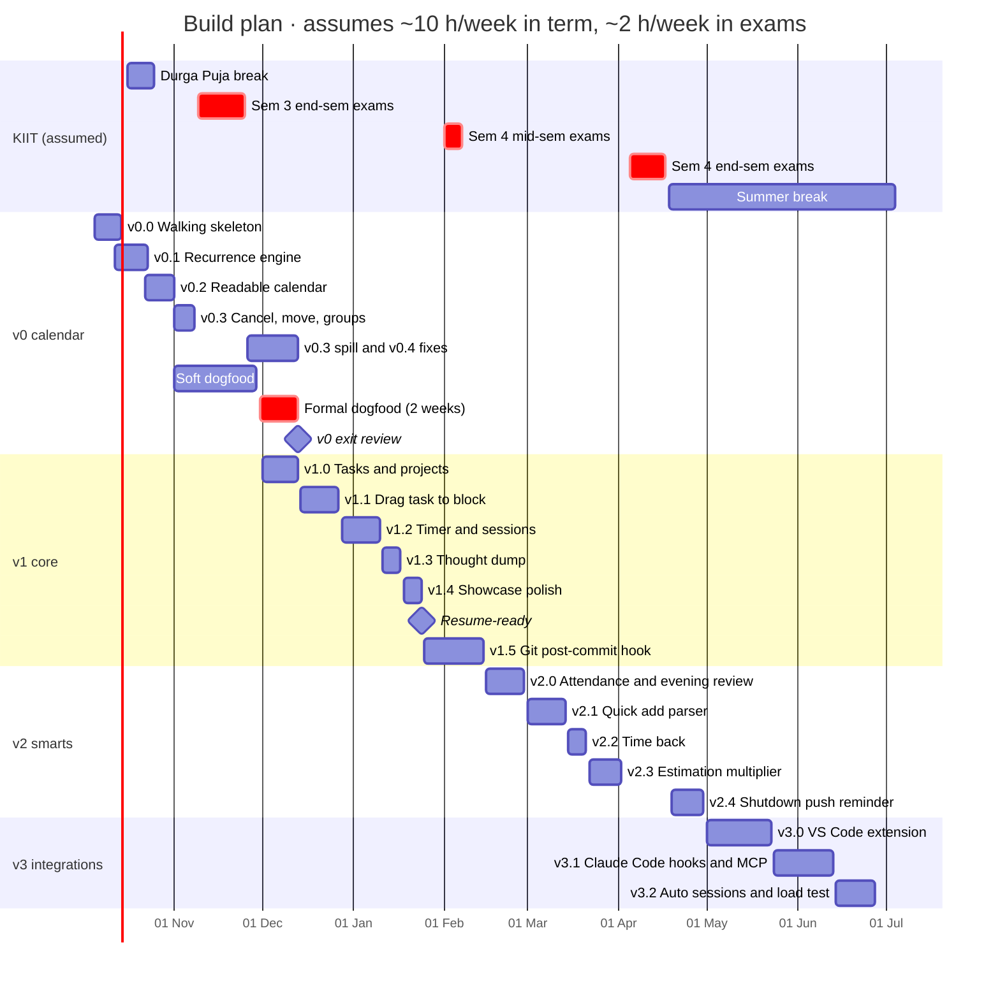
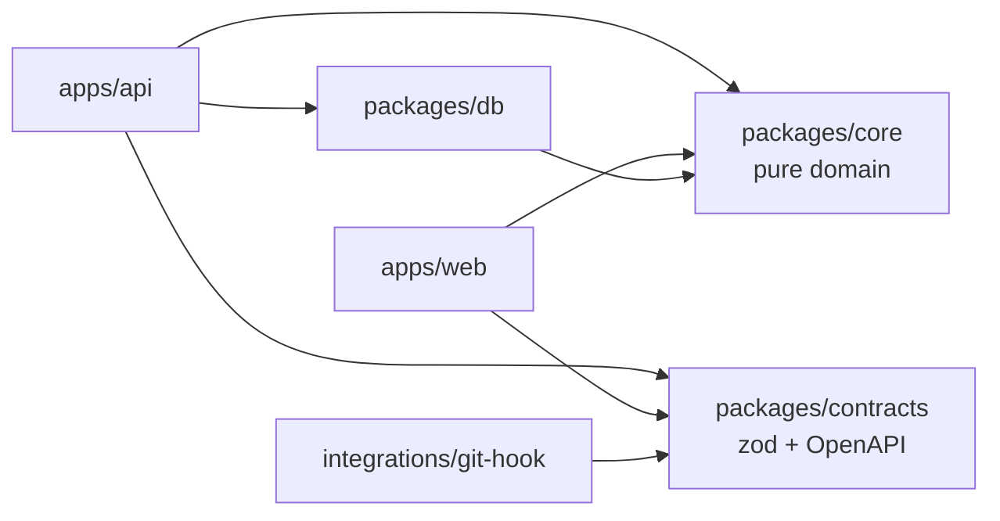

# 13 · Build plan

> Brainstorm slice 13 of 14. Written 2026-10-05. Depends on slices 01–12 and the wildcard. I haven't read them, so §2 lists every assumption I make about them.
> Inputs: `JOURNEY.md` (D-001..D-010, §5 risks, §6 backlog, §8 roadmap) and the original idea note.

---

## 1. TL;DR

- **Approach:** build in **vertical slices on a walking skeleton**. Every milestone ends deployed, usable on Atif's phone, and demo-able. I borrow one rule from the engine-first approach: the **recurrence engine gets its own test-first milestone** (a pure package with property tests) before any calendar UI exists. From the integration-first approach I take one thing: the **git post-commit hook moves forward to v1.5**, ahead of the v2 features.
- **Assumed capacity:** about **10 h/week during term, about 2 h/week in exam weeks, about 15 h/week in summer**. On that budget, v0 is roughly 63 h, v1 roughly 52 h, the v1.5 hook roughly 12 h and v2 roughly 42 h. My estimates are probably 1.3–1.8× too low, so every milestone has a hard cap and an ordered cut list.
- **Dates** (they rest on an assumed KIIT calendar, see §2):
  - walking skeleton live by **14 Oct**
  - real timetable on the phone by **1 Nov**
  - cancel/skip before end-sems (around 9 Nov)
  - exam weeks are maintenance-only
  - **formal 2-week dogfood in the first two weeks of semester 4 (about 30 Nov – 13 Dec)**
  - **v1 resume-ready by about 24 Jan 2027**
  - git hook by mid-February, v2 by the end of April, v3 over the summer
- **Why the dogfood waits for semester 4:** exam weeks have no classes to recur, and the semester change is the real test of D-004.
- **Auth in v0: yes, but owner-only.** A real login library with an allowlist of one, and `user_id` on every row from the first migration. Three reasons:
  - The URL is public.
  - The phone needs a session that survives restarts.
  - It makes a read-only demo user for interviewers almost free in v1.4.
- **Testing:**
  - The base of the pyramid is pure unit and property tests in `packages/core`: fast-check, golden text snapshots of real KIIT weeks, and a timezone matrix of UTC, IST and New York.
  - API tests run against real Postgres, with shared zod contracts and an OpenAPI diff check.
  - At most 6 Playwright flows.
  - No UI pixel snapshots, and no global coverage target.
- **JOURNEY.md becomes the interview asset.** It gets ADRs with a status field, a mistakes-and-fixes log, a metrics table, a screenshot/GIF gallery per milestone and STAR stories. A 15-minute ritual every Sunday keeps it current.

---

## 2. Assumptions about other slices

I wrote this plan in parallel with the design slices, so its estimates rest on the assumptions below. The right-hand column says which milestones move if a slice decides differently. A critic should check this table against the actual slices first.

| Slice | What I assume | If it turns out different |
|---|---|---|
| **01 Recurrence** | A series stores a small **RFC 5545 RRULE subset**: daily, weekly by weekday, every N days, and an end by UNTIL or COUNT. It also stores a local start time, a duration and an IANA timezone. **Occurrences are expanded on read** for a requested window. Exceptions are keyed by `(series_id, original_start)` and are one of cancelled(reason), moved, or overridden. "This and following" means **splitting into two series**. Time maths uses **Temporal** with `disambiguation: 'compatible'`: native in Node 26 and Chrome 144+, polyfilled for Safari. | If occurrences are **materialised into rows**, v0.1 needs about 6 h more for a materialiser and horizon-extension job. The tests change from "expand" to "materialise, then query", but the properties stay the same. If 01 picks a library (e.g. rrule.js) over an own subset, v0.1 shrinks by about 4 h, but the timezone tests matter more because those libraries have known TZ quirks. |
| **02 Data model** | Task / Block (planned time) / Session are separate (as §6 says). Groups own series. **Every table has `user_id`.** Deletes are soft deletes. | Different names don't move any dates. Merging Block and Session would merge v1.1 and v1.2. |
| **03 Backend** | A **TypeScript monolith with a REST API** (Hono or Fastify), separate from the PWA. Validation uses zod, and the OpenAPI document is generated from the zod schemas. | A full-stack framework with server actions saves about 3 h in the skeleton. I'd still keep a small REST surface for the hook and VS Code, because D-007 says API-first. The contract tests don't change. |
| **04 DB & sync** | **Postgres on a free tier**, online-first. The client caches recently fetched windows for **offline reading** only. No offline writes in v0 or v1. | If 04 picks **local-first sync** (a Replicache/Zero/PowerSync/Electric-style engine), the skeleton grows by 10–15 h and v0 slips about 2 weeks, past the end-sems. I'd then trigger the switch condition in §4. |
| **05 Sessions & realtime** | A **server-owned timer**: a session row holds `started_at` and the client ticks locally. No websockets. D-009 batched heartbeats only arrive with the v3 integrations. | Live sync of the timer across devices over SSE or websockets adds about 4 h to v1.2. |
| **06 Auth** | v0 is **owner-only** through a maintained library, using a cookie session. **Personal API tokens** (stored hashed) arrive in v1.5 for the hook. | Full multi-user signup now adds about 5 h to the skeleton. No auth at all saves about 3 h, but I argue against it in §5.1. |
| **07 Infra** | Free tiers throughout: a static PWA host, a small API host, managed Postgres, a region near India, GitHub Actions, and a subdomain of `ahmedatif.in`. **₹0/month** apart from the domain he already owns. | If the hosts have **cold starts over about 3 s**, the offline cache in v0.2 becomes even more important (it is already a must). A self-managed VPS adds about 4 h to the skeleton, but also adds operations stories. |
| **08 Integrations** | A `.planner` link file in the repo root, a POSIX `sh` hook using `curl`, and an **idempotent `POST /commits`** keyed by `(repo_id, sha)`. | Mapping by branch name only saves about 2 h in v1.5. |
| **09 Frontend** | A React + Vite SPA with a PWA plugin and TanStack Query. The week grid is either a library or a hand-rolled CSS grid. | Library versus custom grid moves v0.2 by ±8 h. Next.js or SvelteKit changes nothing structural. |
| **10 Scheduling algorithms** | "Time back" and the estimation multiplier are **pure functions in `packages/core`**. | Nothing moves; they are v2 work either way. |
| **11 Capture** | The dump is text first. Voice comes from the **phone keyboard's dictation**, which needs zero code. The quick-add rule parser is v2.1. The Android share target is declared in the web manifest. | If in-app voice through the Web Speech API is a must, v1.3 grows by about 4 h and works in some browsers only. |
| **12 UX flows** | The cancel action asks for a reason only in groups that track attendance. The evening review ships as an in-app screen before it ships as a push notification. | No change to dates. |
| **Wildcard** | Adds nothing that v0 or v1 must have. | If it does, it goes through the scope gate in §5.10 like everything else. |

**Research notes (checked 2026-10-05):**

- **Tool versions.** Vitest 5.0.3 is current; 5.0 came out on 3 Sep 2026, so it is a month old. Pin it, and use plain `fc.assert` inside Vitest so you don't depend on a plugin catching up. The other current versions:
  - fast-check 4.10.2
  - Playwright 1.63 (5 Sep 2026)
  - `@testcontainers/postgresql` 12.1.0
  - Temporal is native in Node 26 (LTS from October 2026) and Chrome 144+, but not in Safari.
- **KIIT calendar.** I couldn't find the 2026-27 calendar for second-year B.Tech. I derived dates from two published calendars:
  - KIIT's 2025-26 School of Engineering calendar: autumn session 7 Jul – 19 Nov 2025, mid-sem 8–13 Sep, end-sem 10–19 Nov, next semester from 21 Nov; spring mid-sem 2–7 Feb 2026 and end-sem 4–13 Apr 2026.
  - The 2025 first-year autumn session: 18 Jul – 29 Nov 2025.
- **Festivals.** Durga Puja 2026 runs from Shashthi on 16 Oct to Dashami on 20/21 Oct. Diwali (Lakshmi Puja) is 8 Nov 2026.
- **Assumed 2026-27 calendar** (please confirm, §9 Q2):

  | Event | Assumed dates |
  |---|---|
  | Semester 3 end-sems | about 9–25 Nov 2026 |
  | Semester 4 classes start | about 30 Nov 2026 |
  | Semester 4 mid-sems | about 1–6 Feb 2027 |
  | Semester 4 end-sems | about 5–17 Apr 2027 |
  | Summer break | mid-April to early July 2027 |

---

## 3. Three genuinely different approaches

| Approach | Pros | Cons | Solo-dev effort | Interview value |
|---|---|---|---|---|
| **A. Walking skeleton + vertical slices** (tracer bullets: deploy hello-world with auth, DB and CI first, then add one thin end-to-end feature at a time) | Every milestone is usable and demo-able. Infra risks (cookies, PWA install, free-tier quirks) show up in week 1, not week 10. Dogfooding starts early. Motivation stays high because the phone keeps improving. A stop at any point still leaves a working product. | About 14 h of plumbing before any calendar exists, which is the scarcest stretch of the term. Thin slices tempt you to under-design the hard core (recurrence) and rewrite it later. Schema migrations on live dogfood data cost real care. | Medium. Steady and predictable. Total effort to v1 is about 115 h. | High. "Deployed with CI from day one, shipped every 2 weeks, changed course based on usage data" is the story interviewers want from a student project. |
| **B. Engine-first, layer by layer** (full domain model and recurrence library with tests → DB schema → complete API → UI last) | The hardest part gets full attention. The cleanest architecture. Lots of tests. The core package is reusable by the hook and VS Code later. | Nothing usable for 6–8 weeks, so no dogfooding before exams. You design APIs nobody has called yet, and the UI then finds they're wrong. Highest risk of stalling during exams with "a great library and no app". | Medium-high. Lots of rework once the UI arrives. Calendar risk: v0 lands after the end-sems. | Medium-high for depth ("I wrote a property-tested recurrence engine"). Weaker on product ("did anyone use it?"). |
| **C. Integration-first** ("hook the git commit on day 1": build commit ingestion → sessions → timer first, then tasks, calendar last) | Starts with the "gold" feature (§6). It produces data every day without any discipline (he commits anyway). It is the most unusual demo. It attacks the timer-friction risk first. | It inverts D-006 ("core first"), which is locked. Commits without tasks or projects have nowhere meaningful to attach. The calendar, which is the reason the app exists (vision §1), comes last. The ingestion API gets designed before the domain is understood. | Low at first (a hook is small), high later (re-mapping orphan commits, reworking the session model). | High novelty, but a weak core. An interviewer asks "so where's the planner?" |

**What each approach optimises for.**

- **A optimises for learning from use.** Its unit of progress is "something I can do on my phone today that I couldn't yesterday". Its weakness is that it can treat the recurrence engine as just another slice, when it is really the foundation everything stands on. §5 fixes that by giving the engine its own test-first milestone.
- **B optimises for correctness of the core.** For a planner whose central promise is "your fixed week is always right", that matters. But B delays the only test that matters for a personal tool (does he actually open it?) until after the end-sems. It also designs an API before any client exists to push back on it.
- **C optimises for the most distinctive feature.** Its timing is wrong rather than its idea. The hook really is tiny on the client side. The open questions sit on the server: mapping commits to tasks, gap thresholds, and sessions without a start signal (§5, §7). Those can't be answered well before tasks and sessions exist.

---

## 4. Recommendation

**Choose A (walking skeleton + vertical slices), with two grafts.**

1. **From B:** v0.1 is a **pure, test-first recurrence package** with no DB and no UI. Its definition of done is written as properties, not screens. The skeleton (v0.0) and the engine (v0.1) can overlap, because the engine needs no internet. He can write property tests on a train home for Puja.
2. **From C:** the **git post-commit hook moves forward to v1.5**, right after the core is complete and before the v2 features. This is a re-order *within* the draft roadmap. It does not violate D-006, which says "Core first. Then the git post-commit hook…". The v2 items (attendance stats, quick add, time back, estimation multiplier, shutdown reminder) are "Accepted" in §6, not "Core". Three reasons to move it:
   - It is the best interview story.
   - It retires the timer-friction risk earlier.
   - From v1.5 onward, the app's own development gets tracked by the app. That gives real data for the estimation multiplier in v2.3.

**The strongest argument against it (steelman).** In the five weeks before the end-sems Atif has roughly 50 hours, and A spends about 14 of them, nearly a third, on things that don't change his week at all: CI, auth, DNS, cookies, deploy pipelines. A **local-only PWA** (Vite + IndexedDB, no backend, no login) built on the same `packages/core` engine could put his real timetable on his phone in about 20 hours. That buys about three extra weeks of dogfooding before exams. It also answers the only question v0 exists to answer: *"Is this model of my week right, and will I actually open it?"* The backend could then be built in the calmer post-exam week. Moving the data over is just an export/import of the JSON format that D-008 needs anyway. Deploying early also creates an operations burden (free-tier limits, expiring secrets, a 2 a.m. database suspension) at exactly the moment he should be revising. Finally, a single-user app with no collaboration doesn't strictly need a server to be useful.

**Why I still choose A.**

- **Two devices.** He plans on the laptop and checks the next class on the phone, between classes, on campus Wi-Fi or 4G. A local-only app on one device fails that use case.
- **D-007 is API-first.** The backend isn't optional; it only gets postponed.
- **The skeleton retires the infra risks that are hardest to debug,** while there is still slack to absorb them. These are SameSite cookies on mobile, PWA install, and free-tier cold starts.
- **The interview story is stronger.** "Deployed and continuously integrated from week one" beats "rewrote the storage layer in month two".

**When to switch.** If the skeleton isn't live in production by **Sunday 18 October** (meaning it has eaten more than about 18 hours), stop the backend work. Ship v0 as a local-only PWA on the phone, reusing `packages/core` and the same JSON fixture format, and pick the server back up in the post-exam week (from about 26 Nov). Two more triggers:

- If slice 04 picks a local-first sync engine, switch to the same local-first v0.
- If the v0.1 property tests show the series/exception model is wrong (for example, split semantics can't be made consistent), pause all UI work and go engine-first for one week.

---

## 5. Implementation walkthrough

### 5.1 Capacity model and the v0 auth decision

**Capacity (assumed; please correct in §9 Q1):**

| Period (assumed) | h/week | Notes |
|---|---|---|
| 5 Oct – 15 Oct (classes) | 10 | Post-mid-sem stretch, assignments due |
| 16 – 25 Oct (Durga Puja) | 12 | Anywhere from 4 h (travelling home) to 20 h (staying on campus) |
| 26 Oct – 8 Nov (last classes, Diwali 8 Nov) | 8–10 | Assignment and lab-record crunch |
| 9 – 25 Nov (end-sem exams) | ~2 | **Maintenance only**: P0 fixes, no features |
| 26 – 29 Nov (gap) | 15 | Short break between semesters, if KIIT gives one |
| Dec – Jan (Sem 4, before mid-sems) | 10 | The steadiest building stretch |
| 1 – 6 Feb (mid-sems) | ~2 | Maintenance only |
| Feb – Mar | 10 | |
| 5 – 17 Apr (end-sems) | ~2 | Maintenance only |
| Mid-Apr – early Jul (summer) | 15 | Drops to about 8 if he gets an internship, which is the point of the project |

**Is auth needed in v0? Yes, owner-only.** The options:

1. **No auth.** Anyone with the URL can read and edit his schedule, and he can never share a link. This only works for a local-only app, which is the §4 fallback.
2. **HTTP basic auth or a shared-secret header at the host.** About 1 hour, but it is clunky in an installed PWA (it prompts again after restarts and doesn't fit the service worker), and the hook needs real tokens later anyway. It all gets thrown away.
3. **Real login through a maintained library, with an allowlist of one** (GitHub OAuth matching his GitHub user ID, or a passkey/email link, whichever slice 06 picks), plus a 30-day `httpOnly` `Secure` `SameSite=Lax` cookie. About 3 hours, and nothing gets thrown away.

Choose option 3. The hidden cost isn't the login itself. It is **cookie behaviour across subdomains on mobile**, especially WebKit's tracking prevention with third-party cookies. Put the API on the same *site* as the PWA (`app.<domain>` and `api.<domain>` under `ahmedatif.in`), or proxy `/api` through the web host, so the cookie stays first-party. Finding this out in week 1 costs 1 hour. Finding it in week 10 costs a weekend.

Put **`user_id` on every table from migration 0001**, even with one user. It costs nothing now. It lets the v1.4 demo user exist safely, and it keeps the shared `*.ahmedatif.in` identity (far future) from requiring a data migration.

### 5.2 Milestone overview

| Milestone | Goal | Estimate (h) | Cap (h) | Target window | Demo-able outcome |
|---|---|---|---|---|---|
| **v0.0** Walking skeleton | Prove the plumbing in production | 13.5 | 18 | 5–14 Oct | Merge a PR → 3 minutes later the phone shows the new commit SHA after login |
| **v0.1** Recurrence engine | Pure, deterministic, property-tested expansion | 13 | 17 | 12–23 Oct | `pnpm test core`: thousands of generated cases, golden KIIT weeks, TZ matrix |
| **v0.2** Readable calendar | Groups and series in the DB; week/day view on phone and laptop | 15 | 19 | 22 Oct – 1 Nov | His real semester 3 timetable plus the daily run, on the home screen |
| **v0.3** Cancel, move, groups | Cancel/skip with reason and stripes; moves; splits; group lifecycle | 13.5 | 17 | 1–8 Nov (+ planned spill to 26–29 Nov) | GIF: cancel with "I skipped" → stripes; semester swap with conflict list |
| **v0.4** Dogfood + fixes | Live semester swap (D-004); fix the top friction | 8 | 10 | 26 Nov – 13 Dec | Exit review entry in JOURNEY with metrics |
| **v1.0** Tasks & projects | Misc list + projects with nested tasks beside the calendar | 12 | 16 | 1–13 Dec | Plan the app's own backlog inside the app |
| **v1.1** Drag → block | Planned blocks from tasks; unfinished tasks return unticked | 13 | 17 | 14–27 Dec | Drag "DSA sheet" into Tuesday 16:00, resize to 90 minutes |
| **v1.2** Timer & sessions | Server-owned timer, sessions, notes, manual commit refs | 12 | 16 | 28 Dec – 10 Jan | Start on the laptop, see it running on the phone, stop, see the session history |
| **v1.3** Thought dump | Two-tap capture, per project or general, aging signal, convert to task | 6 | 8 | 11–17 Jan | Capture from the home-screen shortcut in under 5 s |
| **v1.4** Showcase polish | README, architecture diagram, demo user, Lighthouse, a11y | 9 | 12 | 18–24 Jan | **Resume-ready link with a "Try the demo" button** |
| **v1.5** Git hook | Tokens, `.planner`, idempotent commit ingestion | 12 | 16 | 25 Jan – 14 Feb | Commit in the terminal → the commit appears on the running session |
| **v2.0** Attendance + evening review | Per-subject range (D-010), in-app evening confirm | 10 | 13 | 15–28 Feb | "DSA: 78–86 %, 3 unconfirmed" |
| **v2.1** Quick add | Rule-based parser | 10 | 13 | 1–14 Mar | Typing `revise OS tmrw 6pm 1h #os` → a block |
| **v2.2** Time back | Suggest tasks that fit a freed slot | 7 | 9 | 15–21 Mar | Cancel a class → three suggestions that fit |
| **v2.3** Estimation multiplier | Per-category learned multiplier | 7 | 9 | 22 Mar – 2 Apr | "You underestimate coding by 1.6×" from his own sessions |
| **v2.4** Shutdown push | Web Push reminder for the evening review | 8 | 10 | 19–30 Apr | Phone buzzes at 22:00 → one tap → review |
| **v3.0** VS Code extension | Start button, project from folder, task picker | 20 | 26 | May | Click Start in VS Code → session on the phone |
| **v3.1** Claude Code hooks / MCP | First prompt in a project folder auto-starts a session (D-006) | 14 | 18 | late May – mid Jun | — |
| **v3.2** Auto sessions + load check | Heartbeat `last_seen` (D-009), gap close, a k6 run at 83 req/s | 10 | 13 | late Jun | A graph showing that D-009's maths holds |

The "Later" items (timetable import via D-008, ICS export, browser extension, shared identity) stay unscheduled. One shortcut: the **JSON fixture format from v0.2 becomes the D-008 import format**. That makes "Later: import" mostly a validation-and-preview UI, because the format, parser and tests already exist.

**Parallel work rule during the dogfood.** v1.0 (tasks and projects) barely touches recurrence, so it can be built *during* the formal dogfood window. **v1.1 (drag → block) waits for the v0 exit review,** because it couples tasks to the calendar model and the dogfood might change that model.

### 5.3 Milestones in detail

#### v0.0 — Walking skeleton (est. 13.5 h, cap 18 h, 5–14 Oct)

**Goal:** a logged-in owner sees data read from the production DB, inside an installed PWA on his phone, deployed automatically when he merges to `main`.

- [ ] Repo, pnpm workspace, TypeScript `strict`, Biome (or ESLint + Prettier), `.editorconfig`, Node version pinned (`.nvmrc` and `engines`) — 1.5 h
- [ ] `packages/core` with one Vitest test; `packages/contracts` with a first zod schema — 0.5 h
- [ ] `apps/api`: hello route; `/healthz` returns `{ sha, dbOk, time }`; env config validated with zod at boot (fail fast) — 2 h
- [ ] Database: provision free Postgres; pick the migration tool; migration `0001_users`; seed the owner; `docker compose` Postgres for local dev — 1.5 h
- [ ] Auth: owner-only login (library + allowlist); session cookie; `/me`; middleware that rejects everything except `/healthz` and `/auth/*` — 3 h
- [ ] `apps/web`: Vite + React + PWA plugin, manifest and icons, login screen, a page showing `/me` and the server time in IST; installable on Android — 2 h
- [ ] Deploy the web app and the API; set up subdomains and HTTPS; same-site cookie check on the phone — 1.5 h
- [ ] CI: on each PR run install, typecheck, lint, unit tests and build. On `main`, deploy, then run a smoke test that `/healthz.sha` equals the commit SHA. Branch protection on `main` — 1 h
- [ ] JOURNEY: a stack ADR, and a screenshot of the installed PWA — 0.5 h

**Definition of done:**

- A fresh clone runs with `pnpm i && pnpm dev` (timed and written in the README).
- A PR containing a deliberate type error cannot merge. Verify this once, then revert the PR.
- The production login survives a phone restart.
- `/healthz` shows the SHA of `main`.
- The §7 v0.0 scenarios pass.

#### v0.1 — Recurrence engine (est. 13 h, cap 17 h, 12–23 Oct)

**Goal:** a pure, deterministic `expand(series[], exceptions[], window, viewerTz) → Occurrence[]` in `packages/core/recurrence`, plus `splitSeries` and the exception helpers. No IO, no `Date.now()`; the clock is injected.

- [ ] Types: `Series` (rule, local start date and time, duration, until/count, tz, group range), `Exception` (cancelled + reason, moved, overridden), and `Occurrence` (`seriesId`, `originalStart`, `start`, `end`, `status`, `reason?`) — 1.5 h
- [ ] Spike: own RRULE subset versus a library, following slice 01's choice; write the result into JOURNEY — 1.5 h
- [ ] Expansion for daily, weekly by weekday, every N days (anchored on the series start, not the window start), until (inclusive local date) and count — 3 h
- [ ] Exceptions: cancel (`prof_cancelled` / `skipped` / `holiday`), undo, move a single occurrence, override the duration — 2 h
- [ ] `splitSeries(series, at)` for "this and following" — 1.5 h
- [ ] Clipping to the group's active range; archived groups are hidden in the "active" view but still visible in history — 0.5 h
- [ ] Tests: about 40 example tests, 10 or more properties, 4 golden weeks, explicit DST cases, the TZ matrix in CI (§5.7). This overlaps with the items above and is written alongside them — 3 h

**Definition of done:**

- All §7 v0.1 cases are green under `TZ=UTC`, `TZ=Asia/Kolkata` and `TZ=America/New_York`.
- Every property runs 1,000 times per PR.
- Branch coverage of `core/recurrence` is at least 90%. This is the **only** coverage gate in the repo.
- A lint rule forbids `new Date(` and `Date.now` inside `packages/core`.
- One mutation-testing run (Stryker) on the recurrence folder, with the score recorded in the metrics table. This is a single run, not a CI gate, and it is the first thing to cut.

#### v0.2 — Readable calendar (est. 15 h, cap 19 h, 22 Oct – 1 Nov)

**Goal:** he creates groups and recurring blocks, and sees this week and the next few weeks on his phone and laptop.

- [ ] Migrations: `groups`, `series`, `exceptions` (with `user_id`, soft delete, a unique index on `(series_id, original_start)`) — 2 h
- [ ] API: CRUD for groups and series; `GET /occurrences?from&to` (expanded on read, window capped at 62 days → 400 if larger) — 3 h
- [ ] Contracts: zod request and response schemas in `packages/contracts`; generate `openapi.json` and commit it; a CI diff check — 1.5 h
- [ ] Week grid (desktop) and day agenda (mobile), group colours, a "now" line, week navigation (±8 weeks) — 5 h
- [ ] Series form: title, group, days, start time, duration, start and end dates — 2 h
- [ ] Offline read: persist the last fetched windows (TanStack Query persister or a service-worker cache); "offline · last synced 14:02" badge — 1.5 h
- [ ] Fixture `fixtures/kiit-sem3.json`: his real timetable, used as both seed data and a test fixture. **This is the first draft of the D-008 import format** — 0.5 h (manual entry)

**Definition of done:**

- His real timetable renders correctly for the current week and 4 weeks ahead, on the phone.
- p95 of `GET /occurrences` (7-day window) is under 300 ms server-side, measured with a `Server-Timing` header.
- The cold open on 4G shows the next class within 4 s, and within 1.5 s with a warm cache.
- The user-scoping integration test is green: a second seeded user can't read the owner's rows.
- **The soft dogfood starts the same day.**

#### v0.3 — Cancel, move, groups lifecycle (est. 13.5 h, cap 17 h, 1–8 Nov, planned spill to 26–29 Nov)

The checklist is ordered by priority, so everything above the line must ship before exams start.

- [ ] Cancel an occurrence. In groups that track attendance it asks once: "Prof cancelled" / "I skipped" (D-005). Render it greyed out with diagonal stripes, and allow undo — 3.5 h
- [ ] Playwright E2E: create a weekly block → cancel one with a reason → reload → the stripes persist — 1 h
- [ ] Nightly encrypted `pg_dump` backup, plus **one restore drill** into a local DB — 1 h
- — *exam line: everything below may move to 26–29 Nov* —
- [ ] Group lifecycle: archive; edit the active date range; attendance on/off — 1.5 h
- [ ] Holiday bulk-cancel: "pause group from date X to date Y" with reason `holiday` (excluded from attendance). This directly serves D-003's "holiday import that bulk-cancels classes" — 1.5 h
- [ ] Move a single occurrence — 1.5 h
- [ ] Edit "only this / this and following / all" (uses `splitSeries`) — 2 h
- [ ] Conflict list when adding or activating a group that overlaps another active group (D-004) — 1.5 h

**Definition of done:** all §7 v0.3 scenarios pass. The E2E suite is green in CI. The restore drill is written up in JOURNEY with how long it took.

#### v0.4 — Dogfood, semester swap, fixes (8 h reserved, 26 Nov – 13 Dec)

- [ ] Finish the v0.3 spill.
- [ ] **The live D-004 test:** archive "Sem 3 Classes", create "Sem 4 Classes" from the new timetable (as fixture JSON → seed, or through the form), and check the conflict view. Time the whole swap.
- [ ] Fix the top 3 friction items from the log, P0s first.
- [ ] Hold the exit review (§5.8) and write it into JOURNEY.

#### v1.0 – v1.5 (summary checklists)

**v1.0 Tasks & projects (12 h).**

- Migrations for `projects` and `tasks`, with `parent_id` capped at 2 levels in v1.
- Fractional-index ordering.
- Tasks panel beside the calendar (a side panel on desktop, a tab on mobile).
- Complete and uncomplete; archive a project (never hard-delete).
- Integration tests, including "moving a task between projects keeps its sessions".

**v1.1 Drag → planned block (13 h).**

- A `blocks` entity linked to a task.
- Drag from the list onto the grid, using a DnD library. Resize to set the duration (or a numeric field).
- Overlaps with fixed blocks are allowed but flagged.
- On **mobile, a "Plan…" sheet with a time picker replaces drag**.
- When a block's time passes with the task unfinished, the task returns to its list unticked and shows "planned 1 h · spent 0 h". This is computed on read, so no cron job is needed.
- E2E: drag → block → reload.

**v1.2 Timer & sessions (12 h).**

- `sessions` (task, `started_at`, `ended_at`, `last_seen`, notes, `commit_refs[]`).
- A **partial unique index enforcing at most one open session per user**.
- Start/stop endpoints. Starting a new session closes the running one (or rejects with 409, as slice 05 decides).
- The client ticks from `started_at`.
- Task detail shows the sessions and the total time.
- Integration test: 10 concurrent start requests produce exactly one open session.

**v1.3 Thought dump (6 h).**

- Capture input reachable from a manifest shortcut and an Android share target.
- General or per-project dumps.
- Age shown as "3 weeks old" (the gentle aging signal from debate #5).
- Convert an item to a task.
- Text that fails to submit stays in the input and is never lost.

**v1.4 Showcase polish (9 h).**

- README with a GIF, an architecture diagram and a "how to run".
- A **demo user**: seeded from the fixtures, reset nightly, rate-limited, behind a "Try the demo" button.
- Lighthouse PWA/performance pass and keyboard navigation.
- Release `v1.0.0` with notes generated from Conventional Commits (`git-cliff`).
- Update the metrics table.

**v1.5 Git hook (12 h).**

- Personal API tokens (shown once, stored hashed, revocable).
- A `.planner` file holding the project ID, with name matching only as a fallback (§5 risk).
- `post-commit` script (POSIX `sh` + `curl`). Rules for the script:
  - It runs in the background with a 2 s timeout and always exits 0.
  - It queues to `.git/planner-queue` when offline.
  - The installer chains with existing hooks and husky's `core.hooksPath`.
- `POST /commits` is **idempotent on `(repo_id, sha)`**. It attaches the commit to the running session, or to the project's "unattached commits".
- Auto-creating sessions from commit gaps waits until v3.2.

### 5.4 Timeline (Gantt)



**Honest arithmetic for v0.** From 5 Oct to 8 Nov there are about 50 available hours, against 55 h of estimates for v0.0–v0.3. That is why v0.3 has an exam line and a planned spill. **The pre-exam must-haves are v0.2 plus cancel-with-reason.** v1 has about 30% slack built in, because December and January are the most predictable stretch and the planning fallacy is real.

### 5.5 What to cut if behind

**Cut lists.** Cut in the order shown; cut the first item first. "Never cut" is the minimum lovable core of that milestone.

| Milestone | Cut first → last | Never cut |
|---|---|---|
| v0.0 | Playwright smoke (move to v0.3) → custom domain (use the hosts' default URLs) → PWA installability (responsive web is enough) | CI typecheck + tests, branch protection, the auth gate, `user_id` everywhere, automatic deploy |
| v0.1 | Mutation run → count-based ends (keep until) → every-N-days → move/override exceptions (keep cancel) | Properties for containment, order, uniqueness and split equivalence; one golden KIIT week; the TZ matrix |
| v0.2 | Week navigation beyond ±2 → series edit (delete and recreate instead) → desktop week grid (agenda on both) | Real timetable on the phone, offline read, the user-scoping test |
| v0.3 | Conflict view (show a plain text list) → "this and following" (offer "only this" or "all") → move a single occurrence → holiday bulk-cancel | Cancel with reason, stripes, undo, group archive, backup + restore drill |
| v1.0 | Subtasks (keep flat tasks per project) → manual ordering (sort by creation) → project colours | Misc list plus projects beside the calendar |
| v1.1 | Resize by drag (use a numeric duration) → drag on desktop (use the Plan sheet everywhere) → automatic return of unfinished tasks | A planned block stored and shown beside the fixed blocks |
| v1.2 | Markdown notes → commit-ref field → stale-session auto-close | Server-owned start/stop, the one-open-session constraint, sessions per task |
| v1.3 | Per-project dumps (use one global dump with a project tag) → aging signal → convert to task (copy and paste instead) | Capture in two taps or fewer, typed text never lost |
| v1.4 | Lighthouse tuning → a11y pass → demo user | README with a GIF and an architecture diagram |
| v1.5 | Offline queue → husky chaining (document it instead) → `.planner` (name match only) | Token auth, idempotent ingestion, a hook that never blocks or fails a commit |
| v2.x | Push reminder (use the in-app review) → multiplier UI (show the raw ratio) → time-back suggestions (just highlight the freed gap) | Attendance range with confirmed/unconfirmed (D-010) |

**Minimum lovable version of each feature:**

| Feature | Minimum lovable |
|---|---|
| Recurring calendar | Next class visible within 2 s of opening the phone, correct every time, works offline |
| Groups | Colour + archive + active range; one swap per semester in under 30 minutes |
| Cancel/skip | 3 taps or fewer: tap the block → Cancel → reason. Stripes; undo |
| Tasks/projects | One inbox, flat projects, tick off; visible beside the week |
| Drag → block | "Plan…" button with a time picker that works on the phone; drag is a desktop bonus |
| Timer/sessions | One button, survives a closed tab, total time per task |
| Thought dump | Text box on a home-screen shortcut; keyboard dictation counts as "voice" |
| Attendance | Range per subject, plus "you can skip N more and stay at or above 75%" |
| Quick add | 10 patterns he actually types, plus an error that shows what it understood |
| Time back | Highlight the freed slot and list tasks with an estimate that fits |
| Estimation multiplier | One number per category with "based on N sessions" |
| Git hook | Commits show up under the running session; the hook never slows a commit |

### 5.6 Risk burndown (JOURNEY §5 → milestones)

| Risk (§5) | Retired or reduced by | How you know it's retired |
|---|---|---|
| Recurrence edge cases (one-off cancel/move, this-and-following, semester end, DST) | **v0.1** (engine + properties), **v0.3** (moves, splits, group range), **v0.4** (live semester swap) | Split-equivalence and locality properties are green; DST cases pass on the TZ matrix; zero wrong-occurrence incidents in the last 7 dogfood days |
| Timer friction | **v1.2** (server-owned timer) → **v1.5** (commits attach automatically) → **v3.0/3.1** (start signals) | Fraction of coding time with an open session, compared before and after v1.5 |
| Commits mark the end, not the start | **v3.0** (VS Code Start), **v3.1** (Claude Code first prompt); v1.5 only records | Median start lag (first activity → session start) |
| Heartbeat load at scale | Already argued on paper (D-009); **v3.2** turns the claim into a measurement: one k6 run at 83 req/s against `last_seen` updates | p95 and error rate at 83 req/s on the free-tier box, in the metrics table |
| Unmarked skips inflate attendance | **v0.3** records reasons from day one; **v2.0** evening confirm + range | App range vs the university portal's percentage per subject, within 2 points at the end of semester 4 |
| Folder ↔ project matching is fragile | **v1.5** `.planner` link file, name match as fallback | Rename-the-folder test passes |
| No free LLM | Not on the critical path (D-002); v2 is algorithmic | — |
| Mobile capture speed | **v1.3** manifest shortcut + Android share target | Median capture time under 5 s over 10 timed tries; if over 10 s, reopen the native question (D-007) |
| Timetable formats vary | Parked; **v0.2** fixes the JSON format, which later becomes the import format | — |
| *New:* solo-dev stall during exams | v0.2 before exams; exam weeks are maintenance-only; cut lists | v0.2 live before 9 Nov |
| *New:* free-tier cold starts and limits | v0.2 offline read cache; measured in the dogfood | Cold open under 4 s on 4G |
| *New:* losing personal data | v0.3 nightly encrypted backup + a restore drill per milestone | Restore drill time written in JOURNEY |

### 5.7 Testing strategy

**The pyramid:**

| Layer | Tool | Scope | Target by v1.4 | When it runs |
|---|---|---|---|---|
| Pure unit + property | Vitest 5 + fast-check (plain `fc.assert`) | `packages/core`: recurrence, attendance maths, parser, time-back, multiplier | ~150 examples, ~25 properties | Every PR, < 10 s |
| Golden text snapshots | Vitest file snapshots | Expanded weeks rendered as readable text | 6–8 fixtures | Every PR |
| API integration | Vitest + **real Postgres** (Actions `services:` in CI; Testcontainers or `docker compose` locally) | Routes, DB constraints, user scoping, idempotency, concurrency | ~40 | Every PR, < 60 s |
| Contract | zod schemas shared by API and web; `openapi.json` diff | Response shapes; breaking-change detection for the hook and VS Code clients | All routes | Every PR |
| E2E | Playwright 1.63, Chromium + a Pixel-sized viewport | Critical flows only | **6 or fewer** | Every PR from v0.3, < 3 min |
| Post-deploy smoke | `curl` | `/healthz` SHA and DB ok | 1 | Every deploy to `main` |
| Nightly | fast-check at 50k runs with a random, logged seed; backup; `pnpm audit` | Properties | — | Cron |
| Acceptance | Dogfooding | Everything else | Daily | — |

**Recurrence tests in depth.**

*Properties* (fast-check generates the series, exceptions, windows and timezones from a list that includes `Asia/Kolkata`, `UTC`, `America/New_York`, `Europe/London` and `Asia/Kathmandu`):

1. **Containment:** every returned occurrence overlaps `[from, to)`.
2. **Order and uniqueness:** results are sorted by `start`, with no duplicate `(seriesId, originalStart)`.
3. **Window additivity:** `expand(a,c)` equals the de-duplicated union of `expand(a,b)` and `expand(b,c)`. This protects week paging and caching.
4. **Rule adherence:** for weekly rules, each occurrence's local weekday in the series' timezone is in `byDay`, and its local wall-clock start equals the series start time (moved occurrences excepted).
5. **Ends:** with COUNT, an unbounded window yields exactly `count` occurrences. With UNTIL, nothing falls after the until-date (inclusive, local).
6. **Exception idempotence:** cancelling twice equals cancelling once; cancel then undo restores the original.
7. **Cancel locality:** cancelling occurrence X changes only X; every other occurrence is identical.
8. **Split equivalence:** `splitSeries(s, t)` with no edits produces exactly the same occurrences as `s`. This is the property that makes "this and following" safe.
9. **Group clipping:** nothing appears outside the group's active range; archived groups appear in the history view only.
10. **Determinism:** the same inputs and the same injected clock give the same output.
11. **Viewer invariance:** changing the viewer's timezone changes only how times display, never which occurrences exist.
12. **Duration:** `end − start` equals the duration in absolute time, unless overridden. The DST policy is written down and tested.

```ts
// sketch: split equivalence
fc.assert(
  fc.property(arbSeries(), arbInstant(), arbWindow(), (s, t, w) => {
    const [a, b] = splitSeries(s, t);
    expect(keys(expand([a, b], [], w))).toEqual(keys(expand([s], [], w)));
  }),
  { numRuns: 1000 },
);
```

*Golden text snapshots.* Readable files, so a PR diff reads like a timetable:

```
Week 2026-W41 · viewer Asia/Kolkata
Mon 05 Oct  10:00–11:00  DSA             Sem 3 Classes
Mon 05 Oct  18:00–19:00  Evening run     Health
Wed 07 Oct  10:00–11:00  DSA  [cancelled: prof]  Sem 3 Classes
```

Fixtures:

- (a) a normal week
- (b) the Puja week with a holiday bulk-cancel
- (c) the semester boundary week (Sem 3 ends, Sem 4 begins)
- (d) an exam week with one-off blocks
- (e) ISO week 53 (28 Dec 2026 – 3 Jan 2027; 2026 has 53 ISO weeks)
- (f) a US-defined series seen from IST across 1 Nov 2026

*Explicit DST and timezone cases.* IST has no DST, but these still matter for three reasons:

- He may follow a US-time online course or event.
- The server may run in UTC.
- An interviewer will ask.

The cases (dates checked with `zdump`):

- `America/New_York` weekly 09:00 → **18:30 IST until Sat 31 Oct 2026, 19:30 IST from Mon 2 Nov** (US DST ends Sun 1 Nov 2026).
- New York daily 02:30 on **Sun 14 Mar 2027** (that local time doesn't exist) → 03:30 local under `compatible`.
- New York daily 01:30 on **Sun 1 Nov 2026** (the hour happens twice) → the earlier instant under `compatible`, and exactly one occurrence, not two.
- `Europe/London` across **25 Oct 2026** and **28 Mar 2027**.
- `Asia/Kolkata` (+05:30) and `Asia/Kathmandu` (+05:45): no code may assume whole-hour offsets, for example when computing grid rows from UTC hours.
- A block that crosses midnight (23:30–00:30) shows on both days in the grid and is counted once.
- The whole core suite runs three times in CI, under `TZ=UTC`, `TZ=Asia/Kolkata` and `TZ=America/New_York`. That cheaply catches accidental use of the machine's local time.

*Exception cases.* Each one follows slice 01's policy, with the policy written down and tested:

- cancel, then change the series time for "all" occurrences (what happens to the orphaned exception?)
- move an occurrence into the next week (it must show in the destination window, not the original one)
- split when exceptions exist after the split point (they get re-keyed onto the new series, or dropped)
- cancel an occurrence of an archived group (rejected)
- an end date before the start date (validation error)

**API contract tests:**

- Every response is parsed by its zod schema inside the integration tests.
- Errors use one consistent shape (problem+json).
- Every route except `/healthz` and `/auth/*` returns 401 without a session.
- Windows over 62 days return 400.
- `POST /commits` is idempotent.
- `openapi.json` is regenerated in CI and must match the committed copy. Breaking changes need a deliberate commit, which matters once the hook and VS Code exist as clients you can't redeploy together.

**E2E flows (six at most by v1.5):**

1. Login → the week renders (smoke).
2. Create a weekly series → cancel one occurrence with "I skipped" → reload → stripes persist → undo.
3. "This and following" time change.
4. Drag (or Plan) a task into a block → start the timer → stop → the session appears in task detail.
5. Thought-dump capture → convert to a task.
6. A simulated hook `POST` → the commit appears on the open session.

**What not to test as a solo dev:**

- **Pixel or visual snapshots of the UI.** Flaky and expensive to maintain; golden *data* snapshots replace them.
- **A cross-browser matrix on every PR.** Chromium only; check the real phone by hand once per milestone.
- **Global coverage targets.** Only `core/recurrence` gets a gate.
- **Component tests that just render props.** Test logic, hooks and core functions instead.
- **Mocked databases in API tests.** Use real Postgres; the constraints *are* the logic.
- **Third-party internals** (the auth library, Temporal, the DnD library).
- **Edge cases through E2E.** Push them down into core properties.
- **Continuous load testing.** One deliberate k6 run in v3.2, for the D-009 story.

### 5.8 Dogfooding protocol

**Timing.** The soft dogfood starts the day v0.2 ships (target 1 Nov): the app becomes the only place the timetable lives. During the end-sems it holds exam one-offs and a recurring "Revision" group, which is real use but light. The **formal 2-week window is the first two full weeks of semester 4** (about 30 Nov – 13 Dec), for three reasons:

- That is when class recurrence and cancellations are actually exercised.
- He doesn't know the new timetable by heart yet, so he'll check it constantly. That's the highest natural engagement he'll ever have.
- The semester swap (D-004) happens right before it.

**Rules for the window:**

1. **One source of truth.** No WhatsApp timetable image and no paper. Every time he reaches for the old source, he logs it as friction.
2. **Log friction the moment it happens.** If the app is down, use the markdown file directly; that is why the log doesn't live in the app.
3. **Fix nothing on the spot** except P0s. Batch everything else into the weekly review, so building doesn't eat the trial.

**Daily friction log** (`docs/dogfood/2026-12-friction.md`, about 2 minutes at night):

```md
## 2026-12-01 (Tue)
- 09:52 · phone · tried: check room for OS lab · got: block has no location field · P1 · workaround: memory
- 13:10 · phone · tried: cancel DBMS (prof absent) · got: 4 taps, reason sheet hid the block · P2
- opens today: 6 · went back to old timetable: 0 · wrong data seen: 0
```

**What to measure.** It comes from a tiny `events` table (`app_open`, `cancel`, `create_series`), from server timing logs, and from the log above. No third-party analytics.

| Metric | Target to exit |
|---|---|
| Days the app was opened | ≥ 12 of 14 |
| Opens per day (median) | ≥ 3 |
| Times he reverted to the old timetable source | 0 in week 2 |
| Wrong-occurrence incidents (wrong day, time or status) | 0 in the final 7 days |
| Taps to cancel an occurrence | ≤ 3 |
| Cold open → next class visible (4G, measured 5×) | median < 4 s; < 1.5 s warm |
| Cancellations captured vs real (checked against a paper tally kept for the 2 weeks) | ≥ 90 % |
| Semester swap time (archive + new group + check conflicts) | < 30 min |
| P0 open / P1 open at the end | 0 / ≤ 2, each with a plan |

**Weekly review (Sunday, 20 minutes):**

1. Read the log.
2. Turn every item into a GitHub issue labelled `dogfood` plus P0, P1 or P2.
3. Pick at most 3 for next week.
4. Note one thing that *surprised* him. The surprises become interview stories.

**Exit criteria for moving to v1.1.** All of these must hold:

1. The usage targets above are met.
2. No open P0s.
3. Zero wrong-occurrence incidents in the last 7 days.
4. The semester swap was done through the app, and the conflict view matched reality.
5. The honest answer to *"would I be annoyed if this vanished tomorrow?"* is yes.

If the exit criteria fail, extend the window by **one** week of focused fixes, at most once. If usage is the only criterion failing a second time, don't block v1 any longer. A calendar of fixed classes is low-engagement by nature once the timetable is memorised, and tasks plus the timer (v1) are what give daily reasons to open the app. Record the finding in JOURNEY as a lesson rather than a failure.

### 5.9 Repo, branches, CI and issue tracking

**Monorepo layout** (pnpm workspaces and TypeScript project references; no Turborepo or Nx until build times hurt):

```
<repo>/
├─ apps/
│  ├─ web/            # PWA (React + Vite)
│  └─ api/            # REST API (monolith)
├─ packages/
│  ├─ core/           # pure domain: recurrence, attendance, sessions, parser, scheduling — no IO
│  ├─ contracts/      # zod schemas + generated openapi.json (shared by web, api, hook, vscode)
│  └─ db/             # schema, migrations, seed
├─ integrations/      # v1.5+: git-hook/, later vscode/, claude-code/
├─ e2e/               # Playwright
├─ fixtures/          # timetable JSON = seed = test fixture = future D-008 import format
├─ docs/
│  ├─ brainstorm/  dogfood/  media/   # media = screenshots and GIFs per milestone
├─ .github/  workflows/{ci,deploy,nightly}.yml  pull_request_template.md  ISSUE_TEMPLATE/
├─ JOURNEY.md  README.md  docker-compose.yml  .env.example
```



`core` depends on nothing in the repo; a CI script checks its `package.json`. That boundary makes it testable, reusable by the VS Code extension, and easy to explain.

**Branches and PRs** (matching his existing conventions):

- `main` is the integration branch; there is no `develop` for a solo repo.
- Feature branches are named `<type>/<short-kebab-topic>`, e.g. `feat/recurrence-split`, `fix/ist-grid-offset`.
- **Conventional Commits** with atomic commits, ordered so that each one builds; commitlint checks them in CI.
- **Merge commits (`--no-ff`)** keep the atomic commits and the PR grouping both visible in history.
- PRs stay under ~400 changed lines, excluding the lockfile and snapshots. The PR template has `## Summary`, `## Changes`, `## Test plan` (tick only what was verified) and a **self-review checklist**: migrations reversible? new dependency justified? JOURNEY entry needed?
- Branch protection requires green CI. Self-merging is allowed, since he can't review his own PRs; an optional AI review is fine as a second pair of eyes.
- Every milestone gets a tag (`v0.2.0`) and a GitHub Release with the GIF and a changelog from `git-cliff`.

**CI gates:**

| Trigger | Steps | Budget |
|---|---|---|
| PR | install (pnpm cache) → `tsc -b` → lint → core tests ×3 TZ → API integration tests (Postgres service) → build → OpenAPI diff → Playwright (from v0.3) → commitlint | < 5 min |
| Push to `main` | All of the above → `pg_dump` → forward-only migrations (expand/contract style) → deploy API → deploy web → `/healthz` SHA smoke | < 8 min |
| Nightly | fast-check 50k runs with the seed logged → encrypted backup artefact → `pnpm audit` | — |

There is no staging environment; ephemeral CI databases plus production are enough for one user. **Make the repo public from day one** (§9 Q4): Actions minutes are free for public repos, it is the showcase, and no personal data lives in the repo.

**Issue tracking:**

- **Until v1.0:** GitHub Issues, one GitHub milestone per roadmap milestone, and a single Projects board (Backlog / This week / Doing / Done).
- **Labels:** `feat`, `bug`, `chore`, `dogfood`, `P0`, `P1`, `P2`, and areas: `recurrence`, `calendar`, `tasks`, `sessions`, `infra`.
- **From v1.0, dogfood the planning.** The app holds the *time* plan: a "Planner" project with its tasks, planned on the calendar and timed with the timer. GitHub Issues keep the *specs and bugs*, because they are public and linkable from commits (`fixes #12`).
- **No mirroring.** An issue is never copied into the app. A task in the app may hold an issue URL.
- **From v1.5, commits attach themselves to sessions.** By v2.3 he can show his own estimation multiplier on building this app. That's a rare and honest interview artefact.

### 5.10 Working rhythm and scope guardrails

**A normal term week (~10 h):**

| When | Length | What |
|---|---|---|
| Sunday 21:00 | 15 min | Journaling ritual (§5.11) |
| Sunday 21:15 | 15 min | Plan: at most 3 issues for the week; check the milestone cut-line |
| Tuesday evening | 1.5 h | One small PR (tests, a fix, a migration) |
| Thursday evening | 1.5 h | One small PR |
| Saturday | 4 h | The feature block |
| Sunday afternoon | 2 h | Finish, deploy, record the GIF, update the issue |

**Session rituals.**

- *Start:* open the issue and write a one-line "done means…" before touching code.
- *End:* push the work-in-progress branch, and write "next step: …" in the draft PR description.

Sessions are 90 minutes long and days apart, so being able to pick the work back up quickly matters more than raw speed.

**Exam mode.** It starts 7 days before the first end-sem or mid-sem paper. Only P0 fixes; the dogfood continues (the app plans the revision blocks). There's no guilt and no catching up afterwards: dates move, and scope gets cut from the list.

**Re-planning rule.** If two consecutive weeks deliver less than 50% of the planned hours, move the milestone dates and apply the cut list. Never compress the remaining work.

**Scope gate (enforcing D-001).** Every new idea goes into the parking lot: `docs/parking-lot.md` until v1.3 ships, then the thought dump itself. It enters a milestone only if all three answers are yes:

1. Does it serve "organise my day" through Calendar, Tasks or the Dump?
2. Does it fit in the current milestone's *cap* without cutting a "never cut" item?
3. What comes out to make room? (one in, one out)

Hard rules on top of the gate:

- No new integrations before v1.4 ships.
- No new runtime dependency without a one-line reason in the PR.
- One milestone in progress at a time; at most one feature PR and one bug PR open.

### 5.11 Keeping JOURNEY.md useful for interviews

**Keep the existing D-entry style and add two fields.**

- **Status:** Accepted / Superseded by D-0YY / Deprecated.
- **Revisited:** date + what changed.

*Superseded* decisions are the best interview material, because they show you learned something. Never delete or rewrite an old decision; supersede it.

**Add four sections** (proposed; the main agent decides the numbering):

1. **Mistakes & fixes log.** A blameless mini-postmortem per entry: *date · what broke · how it was found (test / dogfood / prod) · root cause · fix · what I changed in my process*. Example shape: "Grid was off by 30 minutes for one user → found in dogfood → rows computed from UTC hours → render in viewer tz via Temporal → added the Kathmandu +05:45 property case." Log the embarrassing ones too; they make the best stories.
2. **Metrics table**, updated at each milestone:

   | Metric | How measured | Target |
   |---|---|---|
   | Recurrence example tests / properties / runs per CI | Vitest output | grows each milestone |
   | Mutation score on `core/recurrence` | One Stryker run | record it |
   | p95 `GET /occurrences` (7 days) | `Server-Timing` logs | < 300 ms |
   | Cold open → next class on 4G | Stopwatch ×5 | < 4 s |
   | JS bundle (gzip) | Build output | < 200 kB |
   | Lighthouse PWA / performance | Lighthouse | record it |
   | Dogfood days active / 14 | `events` table | ≥ 12 |
   | Attendance accuracy vs university portal | Per subject, end of semester 4 | ±2 points |
   | Median actual/estimate ratio, before and after the multiplier | Sessions | closer to 1 |
   | Hook overhead per commit | `time git commit` | < 50 ms |
   | CI duration on PRs / flaky reruns per month | Actions | < 5 min / 0 |
   | Hosting cost | Bills | ₹0 + domain |
   | **Build hours per milestone (from v1.2, measured by the app itself)** | Sessions | estimate vs actual |

3. **Milestone gallery.** One screenshot and one ≤ 15 s GIF per milestone in `docs/media/`, each with a one-line caption. Interviewers scroll; they don't read.
4. **Interview stories (STAR).** One per strong decision, written while the memory is fresh and updated as results come in.

**Which decisions make the best stories, and how to tell them:**

| Story | Source | Angle |
|---|---|---|
| A property-tested recurrence engine | v0.1, D-004 | Technical depth: "Here's a bug fast-check found that 40 hand-written tests missed" |
| Heartbeat maths → measured | D-009, v3.2 | System design: back-of-envelope (83 req/s), the `last_seen` design, then the k6 number that confirmed or corrected it |
| Default-attended + evening confirm | D-005, D-010 | Product thinking: found a hole in my own design; chose to show uncertainty as a range instead of hiding it |
| No ChatGPT plan → algorithmic first → multiplier as a learning rate | D-002, v2.3 | Handling a constraint; ML intuition without an LLM |
| Idempotent commit ingestion | v1.5 | Distributed-systems basics: at-least-once delivery, dedupe keys, a hook that never blocks |
| What dogfooding changed | v0.4 | Evidence over opinion: "I planned X; usage data showed Y; I cut Z" |
| Scope discipline | D-001, cut lists | Saying no; finishing |

**How to tell them:**

- Lead with the constraint.
- Give one concrete number.
- Name the alternative you rejected and why.
- End with what you would do differently.
- Keep each one under 2 minutes.

**STAR template** (fill it in with real outcomes; never invent numbers):

```md
### Story · Attendance you can trust (D-005 → D-010)
- **Situation:** KIIT has a minimum-attendance rule; I wanted the app to track it without marking every class.
- **Task:** Make tracking zero-effort without inflating the number.
- **Action:** Default-attended; the cancel action asks "prof cancelled / I skipped"; found that unmarked skips inflate it;
  added an evening confirm and showed attendance as a range (confirmed … confirmed + unconfirmed).
- **Result:** [fill in: app vs portal difference per subject at end of semester 4; taps per day].
- **Learned:** [fill in].
```

**The weekly 15-minute ritual** (Sunday 21:00, with a timer):

1. **5 minutes:** session log entry. What shipped, what broke, what I learned, and one surprise.
2. **5 minutes:** update one metric, and drop in one screenshot if anything visible changed.
3. **5 minutes:** write or update **one** decision or mistake entry. If there's nothing to write, write down what you deliberately *didn't* build this week and why. That is a scope story too.

---

## 6. Traps (things that look cool but eat weeks)

1. **A full RFC 5545 engine.** BYSETPOS, BYWEEKNO, yearly rules, RDATE. He needs daily, weekly by weekday, every N days, and until/count. Store and validate a *subset*.
2. **Local-first sync engines and CRDTs.** Fascinating, and 3–6 weeks of work for one user on two devices. An offline *read* cache covers 90% of the value.
3. **A hand-rolled drag-and-drop calendar grid with perfect touch gestures.** Use a library, or make drag desktop-only and give mobile a "Plan…" sheet.
4. **Microservices, queues, Kubernetes, Redis** "for scale". The D-009 maths already shows one box is enough. The scale story is the maths, not the infrastructure.
5. **Websockets for the timer.** A server-owned `started_at` plus local ticking needs no realtime connection.
6. **Theme, animation and motion polish before v1.4.** It's endlessly satisfying and never finished. Timebox it to the polish milestone.
7. **A native app or widgets** before the PWA has proven daily use (D-007).
8. **LLM features or the provider interface** before v2 (D-002). The provider interface is an abstraction with no second implementation yet.
9. **CI yak-shaving.** Preview environments per PR for the API, a 3-browser × 3-OS matrix, Renovate floods, Turborepo remote caching, Changesets for packages nobody publishes.
10. **Multi-tenant SaaS features** (organisations, sharing, billing, the shared `*.ahmedatif.in` identity) before there is a second user.
11. **An analytics stack** (PostHog, Grafana) for one user. An `events` table and one SQL query are enough.
12. **Building the D-008 import UI** before the JSON format has survived a semester swap.
13. **Rewriting instead of fixing forward** after a bad dogfood week. Revert the change that regressed things; don't stack fixes on top of it.
14. **Starting the VS Code extension** before the API contract is stable. Every API change then means republishing the extension.
15. **Chasing 100% coverage or snapshotting UI markup.**
16. **Assuming "IST has no DST, so plain local `Date` is fine".** It works until the server runs in UTC, he follows a US-time course, or an interviewer asks. Use Temporal from day one.
17. **Push notifications early.** iOS needs an installed PWA, it needs scheduling infrastructure, and it needs a permission flow. The in-app evening review comes first.
18. **Treating the free tier as free of limits.** Auto-suspend, cold starts, row and storage caps. Measure them in the dogfood rather than discovering them during an interview demo. Keep a warm-up `curl` in the demo checklist.

---

## 7. Edge cases & tests — what each milestone must pass

**v0.0**

- Without a session: `GET /api/series` → 401. `/healthz` → 200 with `sha` equal to the deployed commit.
- After login on Android: kill the browser and restart the phone → still logged in (cookie lives ≥ 30 days).
- Log in from a non-allowlisted account → rejected, and no user row is created.
- A PR containing a type error → CI red → merge blocked (checked once).
- Fresh clone to running app in one documented command; time it and record the time.
- Migrations run twice on an empty DB → the second run is a no-op.

**v0.1** (all under 3 values of `TZ`)

- Weekly Mon/Wed/Fri 10:00–11:00, window **Mon 5 – Sun 11 Oct 2026** → exactly 5, 7 and 9 Oct.
- Every 2 days from **Sun 4 Oct**, window 5–11 Oct → 6, 8 and 10 Oct (anchored on the series start, not the window).
- UNTIL **Thu 19 Nov 2026** with a Thursday class → includes 19 Nov (inclusive end).
- A weekly Monday series created on a Wednesday → the first occurrence is the following Monday.
- A daily 18:00 run with COUNT 10 → exactly 10, the last one 9 days after the first.
- 23:30–00:30 block → appears in both the Monday and Tuesday windows, once per window, with one `originalStart`.
- New York 09:00 weekly → 18:30 IST before **1 Nov 2026**, 19:30 IST after.
- New York 02:30 daily on **14 Mar 2027** → 03:30 local. 01:30 on **1 Nov 2026** → one occurrence, at the earlier instant.
- London across **25 Oct 2026**: the absolute duration is preserved.
- Cancel X, then undo → output deep-equals the original. Cancel X → all other occurrences unchanged.
- `splitSeries` at any instant with no edits → identical output (property).
- A group range ending Wednesday → no occurrences from Thursday.
- All properties at 1,000 runs green; the nightly 50k run green for 3 consecutive nights before the milestone closes.

**v0.2**

- A window of 63 days → 400; 62 days → 200.
- Week 53: **28 Dec 2026 – 3 Jan 2027** renders, and navigation from week 52 → 53 → 2027-W01 works.
- 360 px wide screen: day agenda without horizontal scroll; the "now" line is in the right place in IST.
- Airplane mode after one online load → the last viewed week shows with an "offline" badge.
- A second seeded user requesting the owner's series by ID → 404 (not 403, so existence doesn't leak).
- The fixture `kiit-sem3.json` round-trips through seed → API → expansion → golden snapshot.

**v0.3**

- Cancel with "I skipped" → reload → stripes and reason persist; undo restores the block.
- The cancel prompt does **not** ask for a reason in the "Health" group, where attendance is off.
- Moving Wednesday's occurrence to Thursday → the Wednesday slot is empty, Thursday is marked "moved", and cancelling the moved occurrence works.
- "This and following" from 21 Oct, changing 10:00 to 11:00 → 14 Oct unchanged, 21 Oct onward at 11:00, earlier exceptions intact.
- Holiday pause 16–25 Oct → every class in that range is shown cancelled with reason `holiday`, and is excluded from attendance.
- Archiving "Sem 3 Classes" → past weeks still show history including stripes; future weeks are empty.
- Activating a group that overlaps the daily 18:00 run → the conflict list names the exact overlapping slots.
- Restore drill: back up last night's dump → restore it locally → the occurrence counts match production.

**v0.4 (dogfood exit)**

- The §5.8 exit criteria are met, or the single one-week extension is in use.
- The semester swap is timed and under 30 minutes.

**v1.0 – v1.5**

- Moving a task between projects → its sessions and blocks stay attached.
- Archiving a project with tasks → nothing hard-deleted; un-archiving restores it.
- Planning a task over a class → allowed, and flagged as overlapping.
- A block's end passes with the task unfinished → the task appears in its list unticked, showing "planned 1 h · spent 0 h".
- 10 concurrent `POST /sessions/start` → exactly one open session (real Postgres; partial unique index).
- Start on the laptop, close the tab, open the phone → shows "running" with the correct elapsed time.
- A session across midnight → its total counts once; for the per-day split, a documented rule.
- Dump submit with the network down → the text stays in the input with a retry button; nothing is lost.
- Hook: the same SHA posted twice → one record. No network → the commit completes, the hook exits 0 within 2 s, and the item is queued. Revoked token → one-line warning, commit unaffected. No `.planner` file → no-op. Repo using husky (`core.hooksPath`) → the installer chains rather than clobbering. Amend or rebase (new SHA) → a new record (documented).
- The demo user cannot read or write the owner's data. Its data resets nightly.

**v2**

- Attendance with 20 classes held (prof-cancelled and holidays excluded), 15 confirmed attended, 2 skipped, 3 unconfirmed → **75 %–90 %**.
- "Can skip N more" never suggests a number that drops the *lower bound* below 75%.
- Quick add: property `parse(format(x)) == x` over generated inputs; a table of the 10 phrases he really types.
- Time back: a cancelled 60-minute class only suggests tasks whose `estimate × multiplier ≤ 60 min`.
- Multiplier: property — with a constant true ratio r, the EMA converges towards r; one outlier session moves it by at most α.

---

## 8. Challenges to locked decisions

**None.** The build plan fits inside D-001..D-010. Moving the git hook to v1.5 is consistent with D-006 ("core first, then the git hook"), because the v2 items it jumps are "Accepted" features, not "Core". One clarification (not a challenge) for slices 01 and 12: the cancel reasons need a third, system-level value, `holiday`, for bulk cancels (D-003's holiday import). The D-005 prompt itself keeps its two options.

---

## 9. Open decisions for Atif

1. **How many hours a week can you really give this?**
   - Options: 6 / 10 / 15 in term.
   - *Default: 10 in term, 2 in exam weeks.* Every date in §5 scales with this number.
2. **What are the actual KIIT dates for your batch?** Semester 3 end-sems, the semester 4 start, the Puja break.
   - *Default: the assumed dates in §2.* If semester 4 starts earlier than about 30 Nov, the formal dogfood window moves with it.
3. **Auth in v0?**
   - Options: none (local-only) / basic auth / owner-only real login.
   - *Default: owner-only login with an allowlist of one.* GitHub OAuth unless slice 06 picks something else.
4. **Public or private repo?**
   - *Default: public from day one.* Free Actions minutes, the showcase, and no personal data in the repo; secrets go in GitHub.
5. **Formal dogfood window?**
   - Options: right after v0.3 (exam weeks) / the first 2 weeks of semester 4.
   - *Default: semester 4.* Exams have no classes to recur.
6. **Pull the git hook forward to v1.5?**
   - Options: yes / keep it in v3.
   - *Default: yes.*
7. **Demo user in v1.4?**
   - Options: yes / screenshots only.
   - *Default: yes.* Interviewers can click around without your account.
8. **Where does build planning live?**
   - Options: GitHub Projects only / Issues + the app from v1.0.
   - *Default: Issues and milestones now; time planning moves into the app at v1.0; Issues stay for bugs and specs.*
9. **Merge strategy?**
   - Options: `--no-ff` merge commits / squash / rebase.
   - *Default: `--no-ff`.* It keeps your atomic commits visible.
10. **Integration DB in tests?**
    - Options: Actions `services:` + `docker compose` / Testcontainers everywhere.
    - *Default: services + compose.* Simpler; Testcontainers is optional locally.
11. **Coverage gate?**
    - Options: none / `core/recurrence` only / global.
    - *Default: `core/recurrence` at 90% branches.*
12. **Which phone?**
    - Options: Android / iPhone.
    - *Default: Android Chrome.* On iPhone, push (v2.4) needs an installed PWA, and Temporal needs the polyfill.
13. **Holiday bulk-cancel in v0.3?**
    - Options: yes, if hours permit / defer.
    - *Default: yes.* It's useful for the Puja week and for later semesters.
14. **When must the project be "resume-ready"?**
    - *Default: 24 Jan 2027.* Tell me if you're applying for something earlier.
15. **Puja week: home or campus?**
    - Options: travelling (about 4 h) / campus (about 20 h).
    - *Default: 12 h.* If travelling, use it for v0.1, which needs no internet.

---

## 10. Proposed JOURNEY.md entries

### D-0XX · Build in vertical slices on a walking skeleton (2026-10-05)
- **Decision:** Start with a deployed walking skeleton (auth, DB, CI, PWA shell). Then ship thin end-to-end milestones (v0.0–v0.4, v1.0–v1.5…), each deployed, usable on my phone, and demo-able. The recurrence engine is the one exception: it gets its own test-first milestone (v0.1) as a pure package before any calendar UI.
- **Why:** I have about 10 h/week and exams in November. Vertical slices keep the app usable at every stop point and surface infra problems (cookies, PWA install, cold starts) in week 1. They also let real use, not guesses, shape the next milestone.
- **Alternatives considered:** engine-first, layer by layer (nothing usable before exams); integration-first with the git hook on day 1 (inverts D-006; commits would have nothing to attach to).
- **Switch condition:** if the skeleton isn't live by 18 Oct, ship v0 as a local-only PWA on the same core package and add the server after exams.

### D-0XX · Owner-only auth in v0; `user_id` on every row (2026-10-05)
- **Decision:** v0 has a real login (maintained library) restricted to an allowlist of one, with a long-lived first-party cookie. Every table carries `user_id` from the first migration.
- **Why:** The URL is public and holds my schedule, and the installed PWA needs a session that survives restarts. `user_id` costs nothing now and makes the v1.4 demo user and the far-future shared identity possible without a data migration.
- **Alternatives considered:** no auth (only works local-only); basic auth (clunky in a PWA, thrown away later); full signup (not needed for one user).

### D-0XX · The recurrence engine is a pure, property-tested package (2026-10-05)
- **Decision:** `packages/core/recurrence` has no IO and no system clock. It is tested with fast-check properties, golden *text* snapshots of real KIIT weeks, explicit DST cases, and a CI matrix of `TZ=UTC`, `Asia/Kolkata` and `America/New_York`. Branch coverage ≥ 90% applies here and nowhere else.
- **Why:** "Your fixed week is always right" is the app's core promise, and recurrence edge cases are the top open risk (§5). Properties such as split equivalence and cancel locality cover cases I would never think to write by hand.
- **Consequences:** No `Date` arithmetic in core (enforced by a lint rule). Temporal with `compatible` disambiguation; a polyfill on Safari.

### D-0XX · Dogfood window = first two weeks of semester 4, with exit criteria (2026-10-05)
- **Decision:** A soft dogfood starts when v0.2 ships (around 1 Nov). The formal 2-week evaluation runs in the first two weeks of semester 4 (around 30 Nov – 13 Dec), with a daily friction log, a tiny `events` table, and exit criteria: ≥ 12/14 days used, no open P0, zero wrong occurrences in the last 7 days, semester swap in under 30 minutes, and "I'd be annoyed if it vanished."
- **Why:** End-sem weeks have no classes to recur. The semester swap is the real test of D-004, and a new timetable is when I check the calendar most.
- **Consequences:** v1.0 (tasks) can be built during the window; v1.1 (drag → block) waits for the exit review. At most one 1-week extension.

### D-0XX · Pull the git post-commit hook forward to v1.5 (2026-10-05)
- **Decision:** Build the minimal git hook (tokens, `.planner` link file, idempotent `POST /commits`, attach to the running session) right after v1 core, before the v2 features. Auto-sessions from commit gaps stay in v3.
- **Why:** D-006 already puts the hook right after core, and the v2 items are "Accepted", not "Core". It attacks timer friction early, it's my strongest interview story, and from then on the app records its own development, which gives real data for the estimation multiplier.
- **Alternatives considered:** keep it in v3 per the draft roadmap (loses ~4 months of commit data and the story during internship season).

### D-0XX · Exam weeks are maintenance-only (2026-10-05)
- **Decision:** From 7 days before any mid-sem or end-sem paper until the last paper: only P0 fixes, no features. Dates move; scope is cut from the ordered cut list. Remaining work is never compressed.
- **Why:** The project only works if it survives the semester. Using the app to plan revision is dogfooding enough.
- **Consequences:** v0.3 has an explicit "exam line"; everything below it may spill to the post-exam week.

### D-0XX · Testing pyramid and what I deliberately don't test (2026-10-05)
- **Decision:** A fat base of unit and property tests in `packages/core`. API integration tests against real Postgres. Shared zod contracts with a committed `openapi.json` diff check. Six or fewer Playwright E2E flows on Chromium. No UI pixel snapshots, no global coverage target, no mocked DB, no cross-browser matrix per PR.
- **Why:** As a solo developer, test effort goes where bugs are expensive (time maths, constraints, contracts other clients depend on), not where tests are flaky or redundant.

### D-0XX · Repo and CI conventions (2026-10-05)
- **Decision:**
  - A pnpm-workspace monorepo (`apps/web`, `apps/api`, `packages/core|contracts|db`, `integrations/`, `e2e/`, `fixtures/`), with `core` depending on nothing.
  - `main` plus `<type>/<topic>` branches, Conventional Commits, atomic commits, `--no-ff` merges, PRs under ~400 lines, and a tag + release per milestone.
  - PR CI under 5 min: typecheck, lint, core tests ×3 TZ, integration, OpenAPI diff, E2E, commitlint.
  - Deploy on `main` with a pre-migration `pg_dump` and a `/healthz` SHA smoke test. A nightly long property run plus an encrypted backup.
  - A public repo.
- **Why:** These keep history reviewable and the showcase credible, at ₹0 in CI cost.

### D-0XX · The timetable fixture is the future import format (2026-10-05)
- **Decision:** The JSON used to seed my real timetable (`fixtures/kiit-sem*.json`) and to drive the golden tests is the custom import format from D-008.
- **Why:** One format, already validated by tests and by two real semesters, before any import UI or LLM prompt is built.
- **Consequences:** "Later: timetable import" shrinks to the validation + preview UI and the prompt text.

### D-0XX · JOURNEY.md as an interview asset, kept up weekly (2026-10-05)
- **Decision:**
  - Add a Status/Revisited field to decisions (never delete; supersede).
  - Add a mistakes-and-fixes log (a blameless mini-postmortem per entry), a metrics table updated per milestone, a screenshot/GIF gallery, and STAR stories.
  - Keep it current with a 15-minute Sunday ritual: session log, one metric, one decision or mistake entry.
- **Why:** The story of *how* the app was built (constraints, reversals, measurements) is what interviews ask about. Writing it weekly keeps it accurate and cheap.
